# Quaser RAT 入侵检测，通讯流量特征分析及自动化检测实现 - 先知社区

# 前言

此篇是 Quaser RAT 系列文章第三篇，第一篇《Quasar RAT 客户端木马执行流程逆向分析》详细记录病毒样本执行流程，第二篇《Quaser RAT 加解密技术剖析》介绍了样本配置信息在内存中的解密流程，以及 TLS1.2 通讯流量的解密。

本篇将结合此前两篇文章的分析，从通讯流量中提取特征并被检测，并且提供了分析平台（平台链接在后文）和示例数据包供大家学习。

# 背景

对于更新迭代的样本，有大的版本号更迭时往往意味着通讯架构的修改或着重大功能的迭代。

Quaser RAT 在 2020 年 6 月 5 日发布的 v1.4.0 版本中，通讯流量层面增加了 TLS1.2 通讯加密模块、消息序列化器更改为 Protobuf。这些内容在系列前两篇文章中分析的非常清除了，感兴趣的读者可以看一看系列文章前两篇。

<<<<<<< HEAD
[](https://xzfile.aliyuncs.com/media/upload/picture/20240311232705-d0dfff46-dfbb-1.png)
=======
[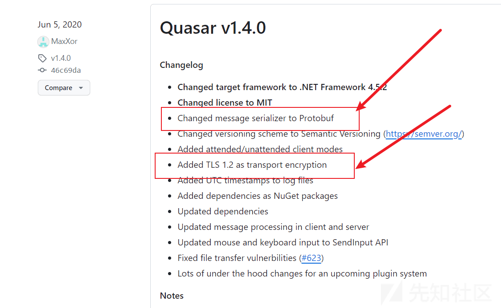](https://xzfile.aliyuncs.com/media/upload/picture/20240311232705-d0dfff46-dfbb-1.png)
>>>>>>> 4992f5f682bf7aa8873ceb2495ac1d2a8296850f

# 一、特征分析

针对 QuaserRAT 加密流量的检测，特征规则匹配是非常乏力的，只能根据一些 TLS 协议的固有属性（证书相关信息等），或者 TCP 的一些特殊会话行为去做梳理。在生产环境中针对加密流流量的检测最主要还是靠威胁情报，例如 IP、域名、JA3、JA3S 指纹、样本 HASH 等。

## 1.1 TLS1.2 加密套件相对固定

Quasar RAT 使用 SslStream 进行安全套接字通信，对 TLS 使用的加密套件不做指定，该情况下 TLS 加密套件的通常选择由.NET Framework 或.NET Core 运行时负责选择。

对于具体的加密套件的选择，通常由操作系统和底层的加密库决定，而不是由的 C# 代码直接控制。经测试，在 Windows 10 专业版、Windows 10 家庭版、Windows 10 教育版、Windows 10 企业版等常规版本中，Quasar RAT 在 TLS 密钥协商过程中加密套件选择上，通常会选择如下套件。

<<<<<<< HEAD
```plain
TLS_ECDHE_RSA_WITH_AES_256_GCM_SHA384
```

[](https://xzfile.aliyuncs.com/media/upload/picture/20240311232713-d5eb06fc-dfbb-1.png)

## 1.2 默认配置下的固定证书 CN 值

如果使用 Quasar RAT 自带的配置信息，证书中的 CN 值会是“Quasar Server CA”，当然这会被秒杀。

动态调试查看内存中解密的证书 CN 值。

[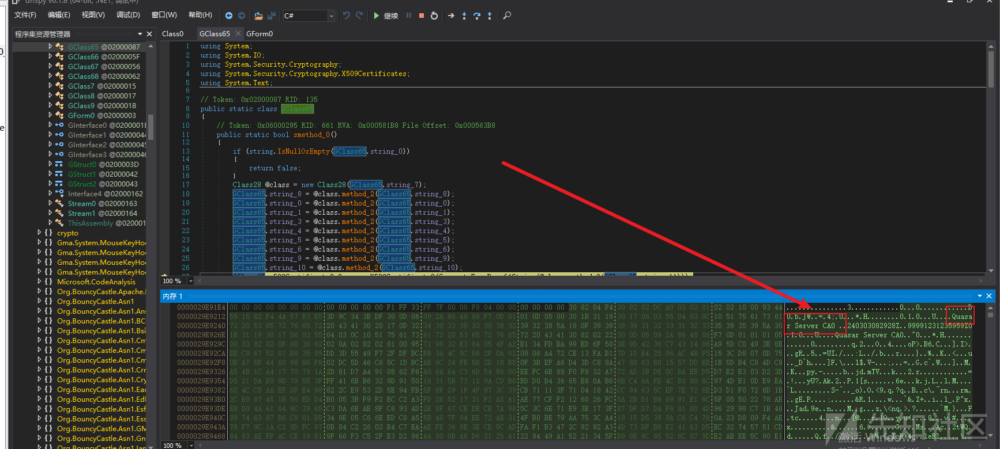](https://xzfile.aliyuncs.com/media/upload/picture/20240311232717-d84d4e1e-dfbb-1.png)

还原成文件查看更直观。

[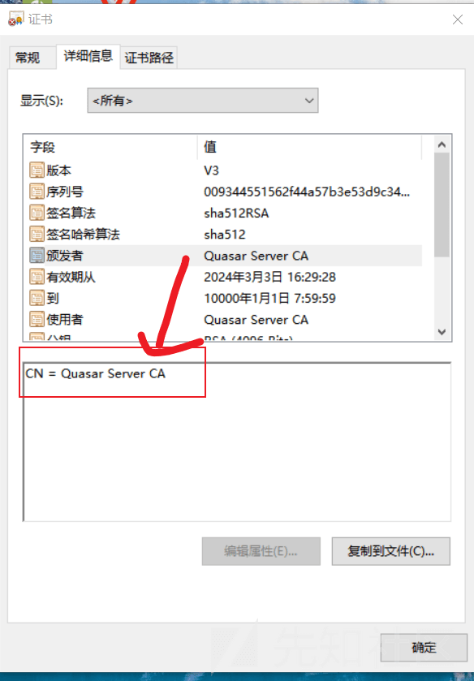](https://xzfile.aliyuncs.com/media/upload/picture/20240311232722-db6730a6-dfbb-1.png)
=======
```bash
TLS_ECDHE_RSA_WITH_AES_256_GCM_SHA384
```

[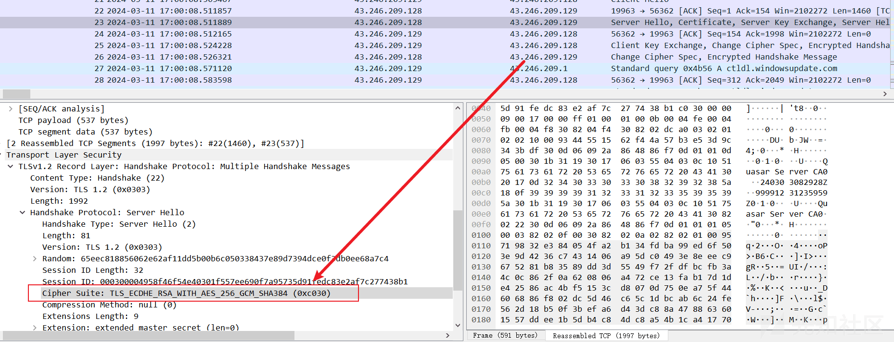](https://xzfile.aliyuncs.com/media/upload/picture/20240311232713-d5eb06fc-dfbb-1.png)

## 1.2 默认配置下的固定证书 CN 值

如果使用 Quasar RAT 自带的配置信息，证书中的 CN 值会是“Quasar Server CA”，当然这会被秒杀。

动态调试查看内存中解密的证书 CN 值。

[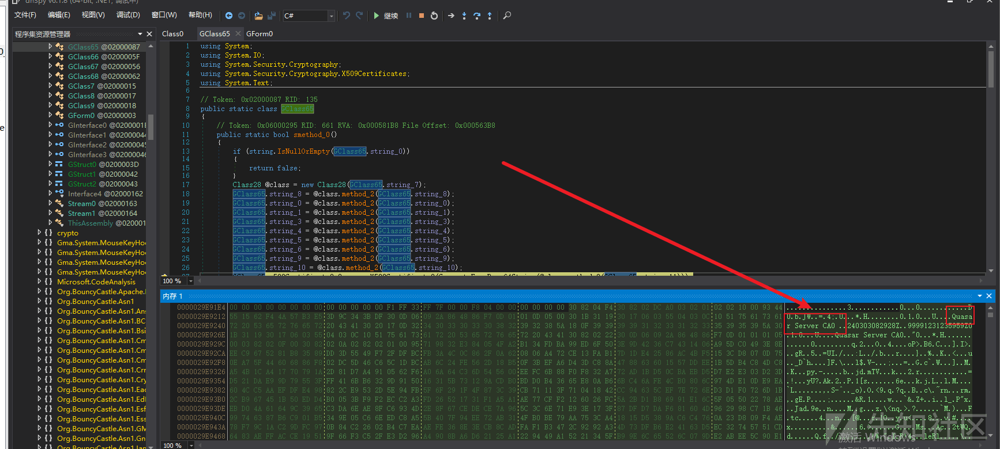](https://xzfile.aliyuncs.com/media/upload/picture/20240311232717-d84d4e1e-dfbb-1.png)

还原成文件查看更直观。

[](https://xzfile.aliyuncs.com/media/upload/picture/20240311232722-db6730a6-dfbb-1.png)
>>>>>>> 4992f5f682bf7aa8873ceb2495ac1d2a8296850f

## 1.3 默认配置下的证书固定 hex 流

经过分析发现默认证书配置中会包含有固定的 hex 流如下。并且此特征在 AsyncRAT 默认配置证书中同样存在，一定程度可以说明 Async RAT 和 Quaser RAT 的同源性。

<<<<<<< HEAD
```plain
0f 39 39 39 39 31 32 33 31 32 33 35 39 35 39 5a
```

[](https://xzfile.aliyuncs.com/media/upload/picture/20240311232728-df076708-dfbb-1.png)

通讯流量如下。

[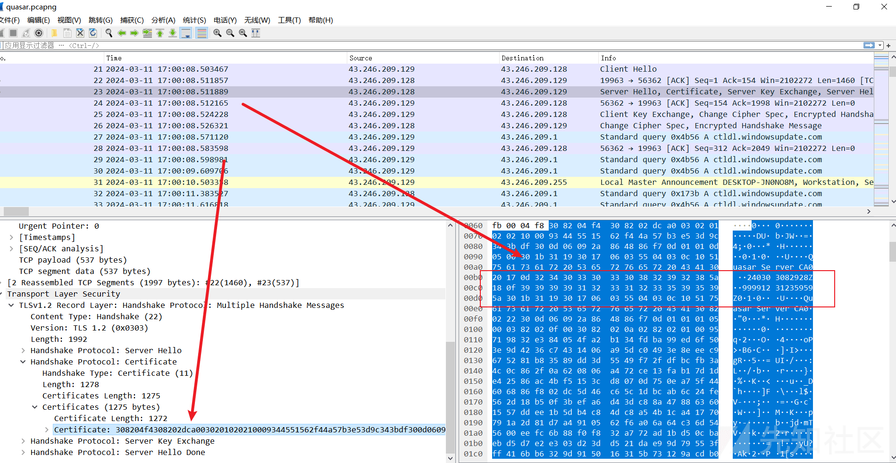](https://xzfile.aliyuncs.com/media/upload/picture/20240311232739-e59de574-dfbb-1.png)
=======
```bash
0f 39 39 39 39 31 32 33 31 32 33 35 39 35 39 5a
```

[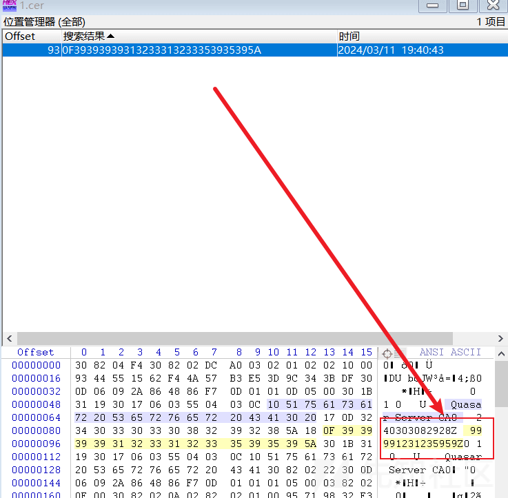](https://xzfile.aliyuncs.com/media/upload/picture/20240311232728-df076708-dfbb-1.png)

通讯流量如下。

[](https://xzfile.aliyuncs.com/media/upload/picture/20240311232739-e59de574-dfbb-1.png)
>>>>>>> 4992f5f682bf7aa8873ceb2495ac1d2a8296850f

## 1.4 心跳包及 1 字节心跳载荷

在第一篇文章中执行流程中解密到 TCP 的通讯配置信息。

<<<<<<< HEAD
[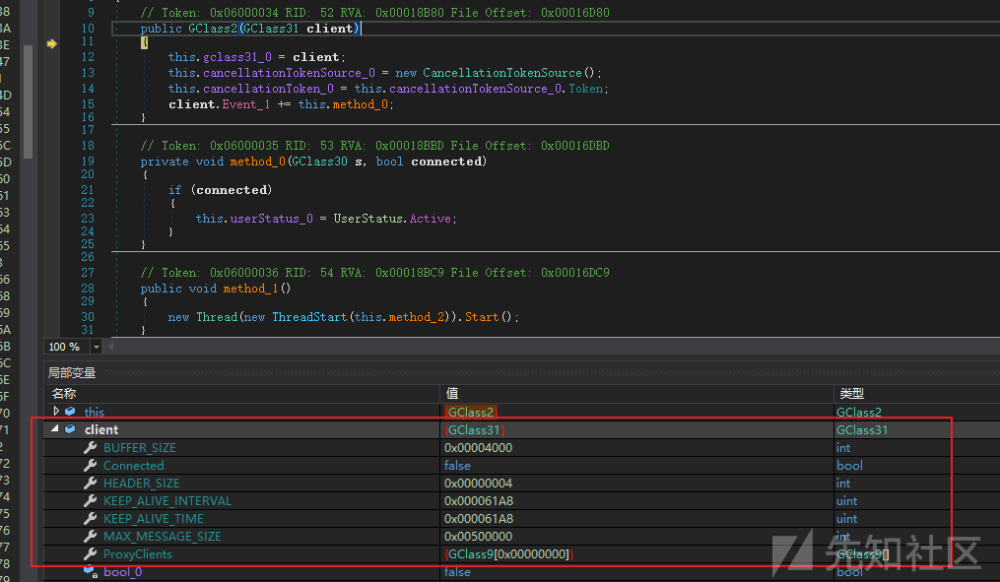](https://xzfile.aliyuncs.com/media/upload/picture/20240311232813-f9d7bd4e-dfbb-1.png)

```plain
=======
[](https://xzfile.aliyuncs.com/media/upload/picture/20240311232813-f9d7bd4e-dfbb-1.png)

```bash
>>>>>>> 4992f5f682bf7aa8873ceb2495ac1d2a8296850f
KEEP_ALIVE_INTERVAL 0x000061A8
KEEP_ALIVE_TIME 0x000061A8
```

KEEP\_ALIVE\_TIME 0x000061A8 换算为十进制秒为 25 秒，Quasar RAT 在无功能作业时默认配置心跳包间隔约为 25 秒。并且会有载荷数据 00。

KEEP-ALIVE 间隔 25 秒如图。

<<<<<<< HEAD
[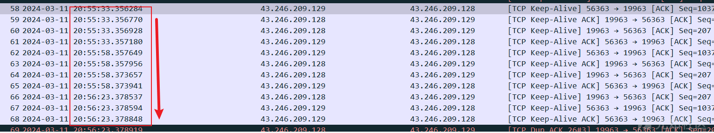](https://xzfile.aliyuncs.com/media/upload/picture/20240311232829-0358e744-dfbc-1.png)

KEEP-ALIVE 1 字节载荷 00 如图。

[](https://xzfile.aliyuncs.com/media/upload/picture/20240311232839-08fc31ec-dfbc-1.png)
=======
[](https://xzfile.aliyuncs.com/media/upload/picture/20240311232829-0358e744-dfbc-1.png)

KEEP-ALIVE 1 字节载荷 00 如图。

[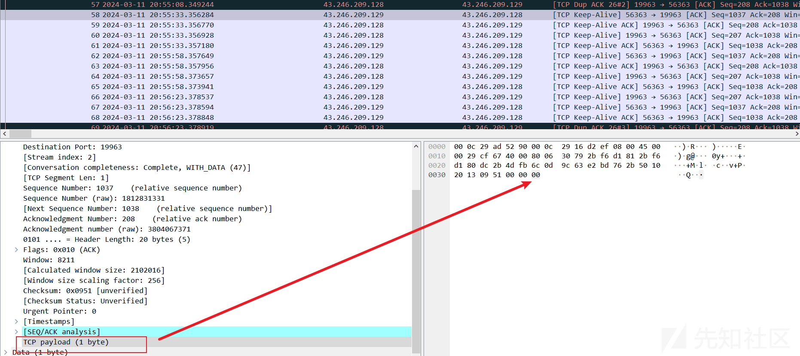](https://xzfile.aliyuncs.com/media/upload/picture/20240311232839-08fc31ec-dfbc-1.png)
>>>>>>> 4992f5f682bf7aa8873ceb2495ac1d2a8296850f

## 1.5 上行流量远大于下行流量

和其他病毒程序一致，服务端指令（蓝色）十分精简，数据量很小，客户端响应则数据（红色）量很大。这可以作为一个弱特征与其他特征组合检测。

以下截图举例。

## 1.6 TCP Keep-Alive 心跳机制导致同步确认位（ACK）数据包数量远大于同步发送 (SYN) 数据包

Quaser RAT 使用 Keep-Alive 作为心跳机制，Keep-Alive 数据包的 TCP 标志位在不同操作系统上不一致，Windows 专业版中 Keep-Alive、Keep-Alive ACK 数据包标志位均为 ACK。

<<<<<<< HEAD
[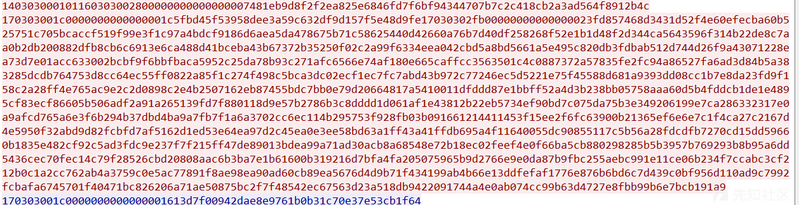](https://xzfile.aliyuncs.com/media/upload/picture/20240311232900-157cabfe-dfbc-1.png)

Keep-Alive 数据包标志位状态。

[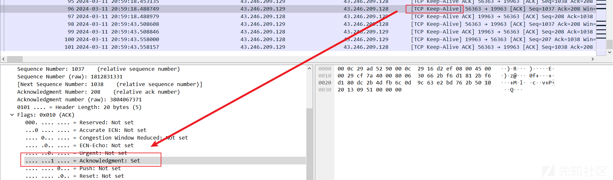](https://xzfile.aliyuncs.com/media/upload/picture/20240311232850-0f927bc4-dfbc-1.png)

Keep-Alive ACK 数据包标志位状态。

[](https://xzfile.aliyuncs.com/media/upload/picture/20240311232910-1bc72fa2-dfbc-1.png)
=======
[](https://xzfile.aliyuncs.com/media/upload/picture/20240311232900-157cabfe-dfbc-1.png)

Keep-Alive 数据包标志位状态。

[](https://xzfile.aliyuncs.com/media/upload/picture/20240311232850-0f927bc4-dfbc-1.png)

Keep-Alive ACK 数据包标志位状态。

[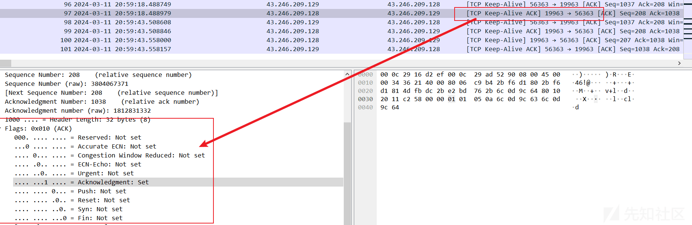](https://xzfile.aliyuncs.com/media/upload/picture/20240311232910-1bc72fa2-dfbc-1.png)
>>>>>>> 4992f5f682bf7aa8873ceb2495ac1d2a8296850f

所以这使得同步确认位（ACK）数据包数量远大于同步发送 (SYN) 数据包。这可以作为一个弱特征与其他特征组合检测。

# 二、检测实现

上诉特征只有部分强特征可以用编写成 suricata 检测规则实现，其余部分偏向多维度统计分析需要检测模型代码实。

## 2.1 检测平台及示例数据包

入侵检测系列文章《入侵检测之流量分析 -- 恶意数据包分析平台》中介绍了我搭建的流量分析平台，大家平时有可疑流量可以往里边扔。

我提供了示例数据包供大家分析。

<<<<<<< HEAD
```plain
=======
```bash
>>>>>>> 4992f5f682bf7aa8873ceb2495ac1d2a8296850f
平台地址：
http://47.108.150.136:8080/IDS
测试数据包：
https://www.123pan.com/s/3BsPjv-vLhnd.html
```

在平台上传数据包即可。

<<<<<<< HEAD
[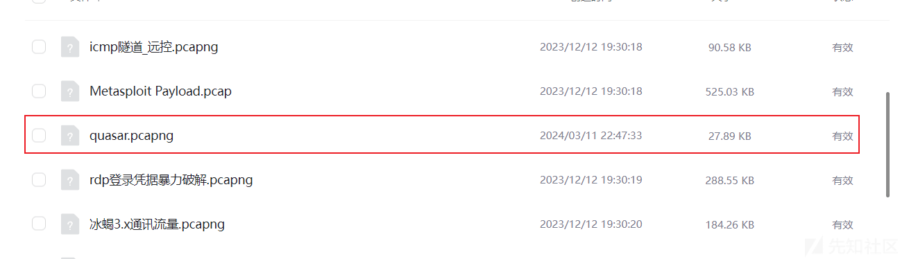](https://xzfile.aliyuncs.com/media/upload/picture/20240311232914-1e44f8d6-dfbc-1.png)
=======
[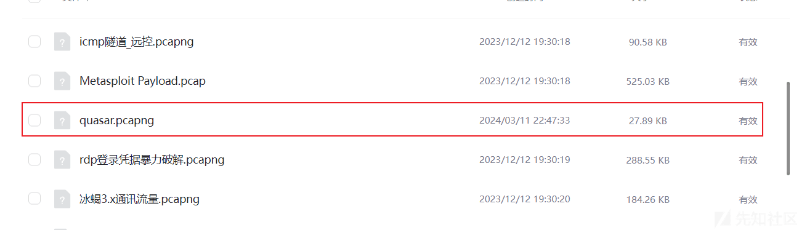](https://xzfile.aliyuncs.com/media/upload/picture/20240311232914-1e44f8d6-dfbc-1.png)
>>>>>>> 4992f5f682bf7aa8873ceb2495ac1d2a8296850f

## 2.2 告警信息分析

选择数据包上传后，等待分析结果。

<<<<<<< HEAD
[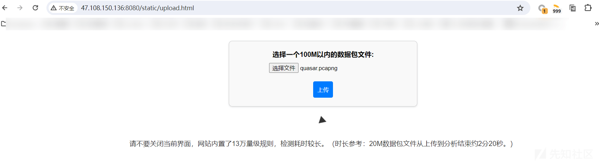](https://xzfile.aliyuncs.com/media/upload/picture/20240311232920-2152d548-dfbc-1.png)

返回分析结果。

[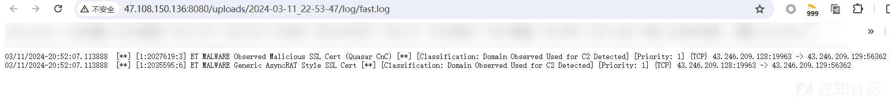](https://xzfile.aliyuncs.com/media/upload/picture/20240311232927-25900d06-dfbc-1.png)

详细使用说明以及告警分析可以看平台配套文章，这里就不在过多赘述。

```plain
=======
[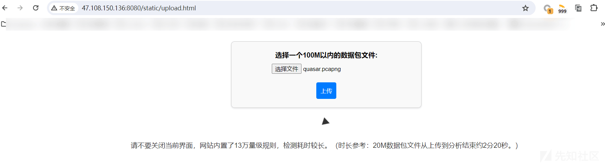](https://xzfile.aliyuncs.com/media/upload/picture/20240311232920-2152d548-dfbc-1.png)

返回分析结果。

[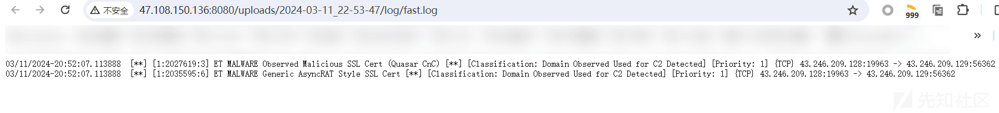](https://xzfile.aliyuncs.com/media/upload/picture/20240311232927-25900d06-dfbc-1.png)

详细使用说明以及告警分析可以看平台配套文章，这里就不在过多赘述。

```bash
>>>>>>> 4992f5f682bf7aa8873ceb2495ac1d2a8296850f
03/11/2024-20:52:07.113888  [**] [1:2027619:3] ET MALWARE Observed Malicious SSL Cert (Quasar CnC) [**] [Classification: Domain Observed Used for C2 Detected] [Priority: 1] {TCP} 43.246.209.128:19963 -> 43.246.209.129:56362
03/11/2024-20:52:07.113888  [**] [1:2035595:6] ET MALWARE Generic AsyncRAT Style SSL Cert [**] [Classification: Domain Observed Used for C2 Detected] [Priority: 1] {TCP} 43.246.209.128:19963 -> 43.246.209.129:56362
```

<<<<<<< HEAD
[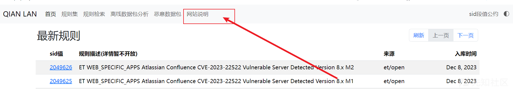](https://xzfile.aliyuncs.com/media/upload/picture/20240311232934-2a190a12-dfbc-1.png)
=======
[](https://xzfile.aliyuncs.com/media/upload/picture/20240311232934-2a190a12-dfbc-1.png)
>>>>>>> 4992f5f682bf7aa8873ceb2495ac1d2a8296850f

Quaser RAT 系列到此就结束了。
