<<<<<<< HEAD
---
title: Quaser RAT 加解密技术剖析 - 先知社区
url: https://xz.aliyun.com/t/14074
clipped_at: 2024-03-20 09:42:37
category: default
tags: 
 - xz.aliyun.com
---
=======
>>>>>>> 4992f5f682bf7aa8873ceb2495ac1d2a8296850f


# Quaser RAT 加解密技术剖析 - 先知社区

<<<<<<< HEAD
=======
Quaser RAT 加解密技术剖析

- - -

>>>>>>> 4992f5f682bf7aa8873ceb2495ac1d2a8296850f
# 前言

此篇是 Quaser RAT 系类文章第二篇，前文《Quasar RAT 客户端木马执行流程逆向分析》详细记录其执行流程，本篇将介绍样本的加解密技术做剖析，包括内存中配置信息解密行为，以及 TLS1.2 通讯流量的解密。

# 背景

详细的 Quaser RAT 背景以及使用示例可以看系列的第一篇文章。

Quaser RAT 通过 AES 算法解密经过 Base64 编码的密文字符串，外连地址、客户端版本号等待解密字符硬编码于样本中。而通讯流量的解密在分析过程中遇到了 TLS 加密套件配置等繁琐的环境问题，不过受益良多。

# 一、配置信息解密

在此系列第一篇文章中介绍了配置信息解密位于初始化过程，通过 AES 解密算法解密经过 Base64 编码的字符串。待解密字符硬编码于样本中。

<<<<<<< HEAD
[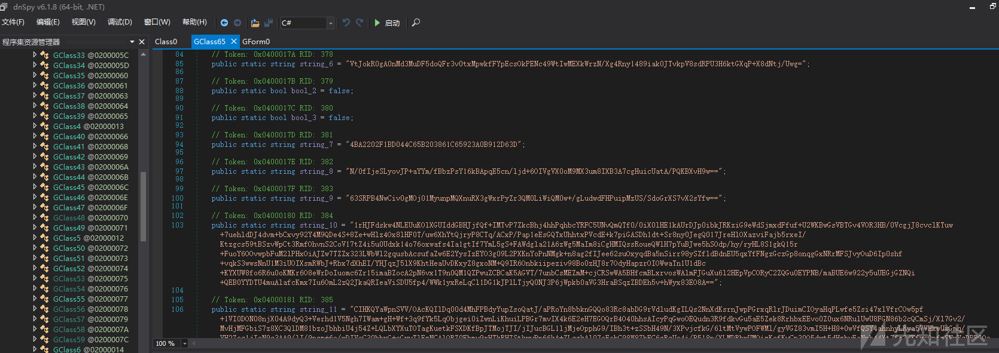](https://xzfile.aliyuncs.com/media/upload/picture/20240311125432-7317bc6c-df63-1.png)

解密流程如下。

[](https://xzfile.aliyuncs.com/media/upload/picture/20240311125443-79c88ef6-df63-1.png)

密钥派生流程如下。  
[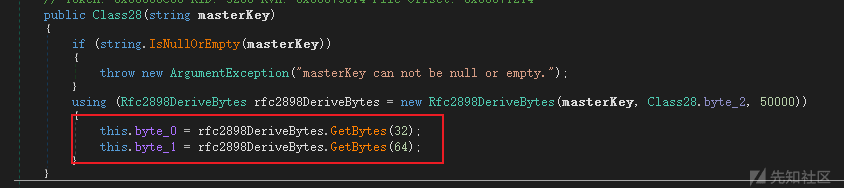](https://xzfile.aliyuncs.com/media/upload/picture/20240311125453-801424be-df63-1.png)
=======
[](https://xzfile.aliyuncs.com/media/upload/picture/20240311125432-7317bc6c-df63-1.png)

解密流程如下。

[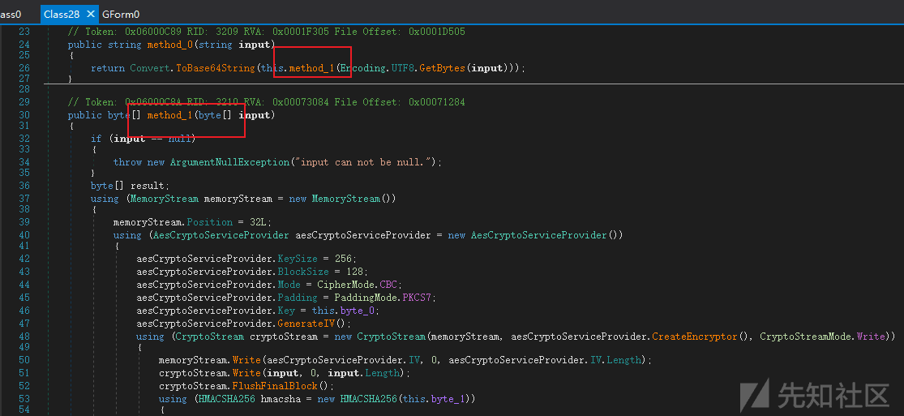](https://xzfile.aliyuncs.com/media/upload/picture/20240311125443-79c88ef6-df63-1.png)

密钥派生流程如下。  
[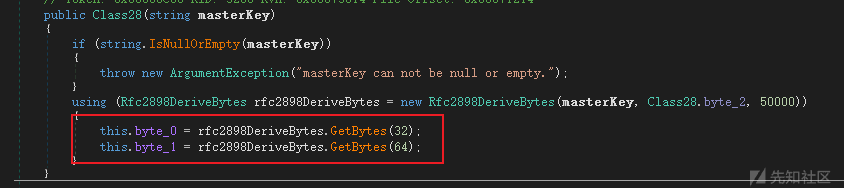](https://xzfile.aliyuncs.com/media/upload/picture/20240311125453-801424be-df63-1.png)
>>>>>>> 4992f5f682bf7aa8873ceb2495ac1d2a8296850f

整体解密流程如下。

-   密钥派生流程中，通过密钥派生函数（PBKDF2）以及固定盐值（byte\_2）生成两个密钥，一个长度为 32 字节 (用作 AES key)，另一个长度为 64 字节（HMAC-SHA256 算法的密钥，用于验证消息完整性）。
-   对硬编码的 base64 字符做解码获得字节流 A。
-   字节流 A 前 0~32 字节用于 HMAC-SHA256 校验，验证消息完整性
-   字节流 A 中读取 33~48 的 16 字节作为 AES 初始化向量 (IV)，用作解密。
-   字节流 A 中 48 字节以后的内容才是密文。  
    下面以外连地址的 IP:port 解密流程为示例。

<<<<<<< HEAD
```plain
初始密文
K9+5GQdWhtwvWqnr4WXcNt1Fuig7c0813j6YdzFtSI48rf1lpnSb45VpxLZGC7R/XiWEzPea0ItdoE7sIDU1VOtCuuMNS0/KbJaEaWVbz38=
初始密文 base64 解码，转为 hex 流
=======
```bash
初始密文
K9+5GQdWhtwvWqnr4WXcNt1Fuig7c0813j6YdzFtSI48rf1lpnSb45VpxLZGC7R/XiWEzPea0ItdoE7sIDU1VOtCuuMNS0/KbJaEaWVbz38=
初始密文 base64 解码，转为 hex 流
>>>>>>> 4992f5f682bf7aa8873ceb2495ac1d2a8296850f
2BDFB919075686DC2F5AA9EBE165DC36DD45BA283B734F35DE3E9877316D488E3CADFD65A6749BE39569C4B6460BB47F5E2584CCF79AD08B5DA04EEC20353554EB42BAE30D4B4FCA6C968469655BCF7F

AES key
0C394B409E44CC1C10BFA99B3FADFB3AF3474B7CA97303AA2774A044AFF23D6C

<<<<<<< HEAD
密文 hex 流前 32 字节用于 HMAC-SHA256 校验
2BDFB919075686DC2F5AA9EBE165DC36DD45BA283B734F35DE3E9877316D488E

密文 hex 流 33~48 的 16 字节作为 AES 初始化向量 (IV)
=======
密文 hex 流前 32 字节用于 HMAC-SHA256 校验
2BDFB919075686DC2F5AA9EBE165DC36DD45BA283B734F35DE3E9877316D488E

密文 hex 流 33~48 的 16 字节作为 AES 初始化向量 (IV)
>>>>>>> 4992f5f682bf7aa8873ceb2495ac1d2a8296850f
3CADFD65A6749BE39569C4B6460BB47F

剩余部分为外连地址信息
5E2584CCF79AD08B5DA04EEC20353554EB42BAE30D4B4FCA6C968469655BCF7F
```

解密示例，数据与上述一致。

<<<<<<< HEAD
[](https://xzfile.aliyuncs.com/media/upload/picture/20240311125501-84c232f8-df63-1.png)

样本动态调试解密外连信息如图。

[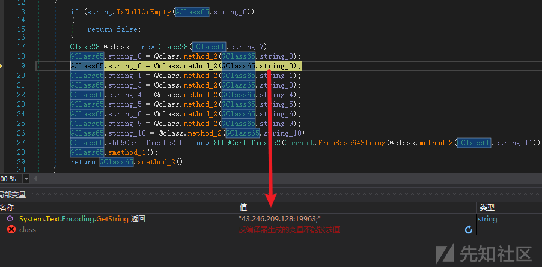](https://xzfile.aliyuncs.com/media/upload/picture/20240311125507-88081586-df63-1.png)

所有均按此流程解密和校验，最后在纳入后续使用。

```plain
客户端标识，Office01
RAT 版本信息，1.4.1
外连 IP:port
=======
[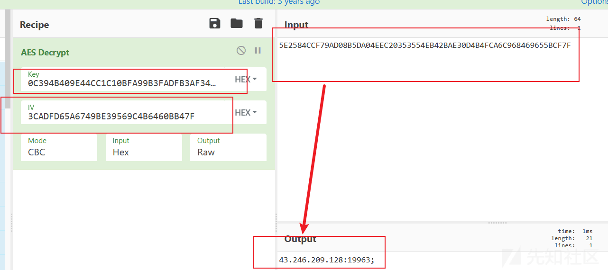](https://xzfile.aliyuncs.com/media/upload/picture/20240311125501-84c232f8-df63-1.png)

样本动态调试解密外连信息如图。

[](https://xzfile.aliyuncs.com/media/upload/picture/20240311125507-88081586-df63-1.png)

所有均按此流程解密和校验，最后在纳入后续使用。

```bash
客户端标识，Office01
RAT 版本信息，1.4.1
外连 IP:port
>>>>>>> 4992f5f682bf7aa8873ceb2495ac1d2a8296850f
文件路径名，SubDir
文件名，Client.exe
客户端唯一标识，a1b41ba4-4cfe-48a7-9f59-c3575aa6b70d
启动项名称，Quasar Client Startup
日志文件路径名，Logs
<<<<<<< HEAD
公钥证书文件，用于TLS1.2通讯
=======
公钥证书文件，用于 TLS1.2 通讯
>>>>>>> 4992f5f682bf7aa8873ceb2495ac1d2a8296850f
```

# 二、通讯数据解密

基于前文的执行流程分析，可获悉样本通讯数据使用的是 TLS1.2 加密，并且数据收发时有序列化和反序列化操作。

## 1\. 服务端 RSA 私钥提取

<<<<<<< HEAD
服务端初始化时，需要用户配置或自动生成文件“quasar.p12”，并保存在项目根目录中。“.p12”是 PKCS＃12 文件的文件扩展名，它是保存私钥和证书的组合格式。

[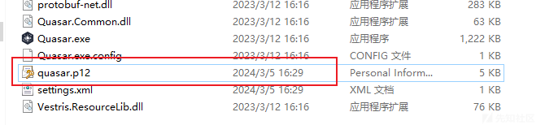](https://xzfile.aliyuncs.com/media/upload/picture/20240311125519-8fa2d538-df63-1.png)

可以使用 OPENSSL 工具在“.p12”中提取私钥，生成阶段也没写保护，空密码即可。

```plain
openssl pkcs12 -in quasar.p12 -out certificate.pem -nodes
```

[](https://xzfile.aliyuncs.com/media/upload/picture/20240311125547-a007b0a6-df63-1.png)

查看私钥。

[](https://xzfile.aliyuncs.com/media/upload/picture/20240311125553-a388f97e-df63-1.png)
=======
服务端初始化时，需要用户配置或自动生成文件“quasar.p12”，并保存在项目根目录中。“.p12”是 PKCS＃12 文件的文件扩展名，它是保存私钥和证书的组合格式。

[](https://xzfile.aliyuncs.com/media/upload/picture/20240311125519-8fa2d538-df63-1.png)

可以使用 OPENSSL 工具在“.p12”中提取私钥，生成阶段也没写保护，空密码即可。

```bash
openssl pkcs12 -in quasar.p12 -out certificate.pem -nodes
```

[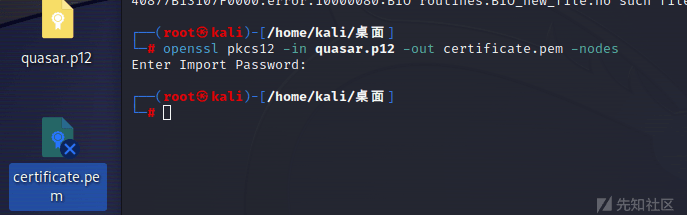](https://xzfile.aliyuncs.com/media/upload/picture/20240311125547-a007b0a6-df63-1.png)

查看私钥。

[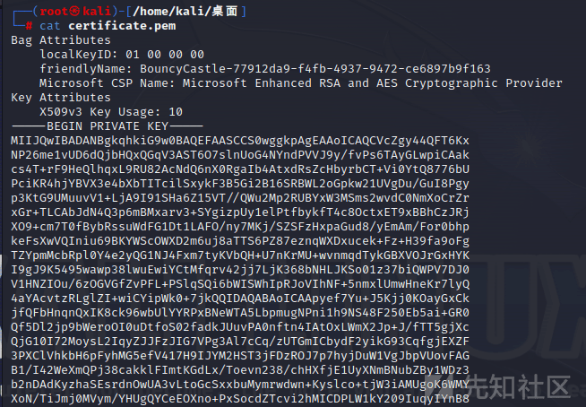](https://xzfile.aliyuncs.com/media/upload/picture/20240311125553-a388f97e-df63-1.png)
>>>>>>> 4992f5f682bf7aa8873ceb2495ac1d2a8296850f

## 2\. TLS 通讯流量解密

### 2.1 TLS 通讯加密分析

如果没有密码学基础这一快看着可能会很模糊，这一部分是 TLS 1.2 加密流程的细节分析。

<<<<<<< HEAD
从通讯流量中可获悉，在客户端和服务端密钥协商阶段数据包，最后使用的加密协议套件为“TLS\_ECDHE\_RSA\_WITH\_AES\_256\_GCM\_SHA384”。使用此套件即使获取 RSA 私钥依然无法解密通讯数据。

[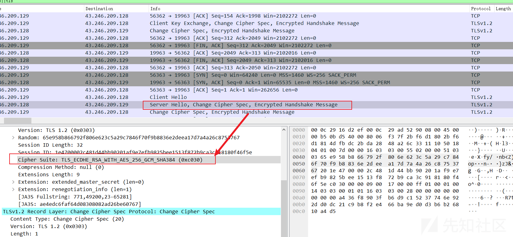](https://xzfile.aliyuncs.com/media/upload/picture/20240311125609-ad3b8fea-df63-1.png)
=======
从通讯流量中可获悉，在客户端和服务端密钥协商阶段数据包，最后使用的加密协议套件为“TLS\_ECDHE\_RSA\_WITH\_AES\_256\_GCM\_SHA384”。使用此套件即使获取 RSA 私钥依然无法解密通讯数据。

[](https://xzfile.aliyuncs.com/media/upload/picture/20240311125609-ad3b8fea-df63-1.png)
>>>>>>> 4992f5f682bf7aa8873ceb2495ac1d2a8296850f

ECDHE\_RSA 是做密钥协商的算法，AES-256-GCM 提供了对称加密，而 SHA-384 用于数据的完整性验证。

ECDHE（Elliptic Curve Diffie-Hellman Ephemeral），Diffie-Hellman 密钥交换算法在密钥协商阶段被使用，生成临时的 ECDHE（椭圆曲线 Diffie-Hellman Ephemeral）密钥对，并且使用服务器的 RSA 证书（公钥）来加密这些临时密钥对。

相比于传统的 RSA 算法加密 AES 通讯密钥，服务端的 RSA 私钥用于密钥交换，它不直接用于加密数据流。实际的数据流加密是使用客户端和服务器之间协商出的临时密钥对进行的，这些密钥对在握手过程中生成，并不依赖于服务器的 RSA 私钥。

下图为通讯实例中密钥 Diffie-Hellman 密钥交换环节。

<<<<<<< HEAD
[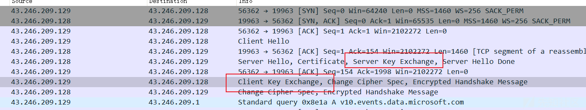](https://xzfile.aliyuncs.com/media/upload/picture/20240311125617-b22d2978-df63-1.png)
=======
[](https://xzfile.aliyuncs.com/media/upload/picture/20240311125617-b22d2978-df63-1.png)
>>>>>>> 4992f5f682bf7aa8873ceb2495ac1d2a8296850f

-   在 Server Key Exchange 消息中，服务器发送包含 Diffie-Hellman 公共参数（通常是素数 p 和底数 g）以及服务器生成的 Diffie-Hellman 公共值的信息。
-   在 Client Key Exchange 消息，客户端使用服务器提供的 Diffie-Hellman 公共参数和值，生成自己的 Diffie-Hellman 公共值，并将其包含在 Client Key Exchange 消息中发送给服务器。

这样的话，只能另辟蹊径修改 TLS 的加密组件了，经过资料查阅，通过修改 SChannel 配置（密钥套件可选择通用于 TLS 各版本及不同 Windows 版本的密钥套件），目的是选择一种只要有 RSA 私钥就可以解密 TLS1.2 通讯流量的加密组件。

我的目的是为了找一个能直接用 RSA 私钥就可以解密 TLS 通讯流量的加密套件，以下是符合我要求的。

<<<<<<< HEAD
```plain
TLS_RSA_WITH_AES_128_CBC_SHA：使用 AES-128-CBC 加密算法和 SHA-1 哈希算法，RSA 密钥用于密钥交换。

TLS_RSA_WITH_AES_256_CBC_SHA: 使用 AES-256-CBC 加密算法和 SHA-1 哈希算法，RSA 密钥用于密钥交换。

TLS_RSA_WITH_AES_128_GCM_SHA256: 使用 AES-128-GCM 加密算法和 SHA-256 哈希算法，RSA 密钥用于密钥交换。

TLS_RSA_WITH_AES_256_GCM_SHA384: 使用 AES-256-GCM 加密算法和 SHA-384 哈希算法，RSA 密钥用于密钥交换。

TLS_RSA_WITH_3DES_EDE_CBC_SHA: 使用 3DES（Triple DES）加密算法和 SHA-1 哈希算法，RSA 密钥用于密钥交换。

TLS_RSA_WITH_RC4_128_SHA: 使用 RC4 加密算法和 SHA-1 哈希算法，RSA 密钥用于密钥交换。
=======
```bash
TLS_RSA_WITH_AES_128_CBC_SHA：使用 AES-128-CBC 加密算法和 SHA-1 哈希算法，RSA 密钥用于密钥交换。

TLS_RSA_WITH_AES_256_CBC_SHA: 使用 AES-256-CBC 加密算法和 SHA-1 哈希算法，RSA 密钥用于密钥交换。

TLS_RSA_WITH_AES_128_GCM_SHA256: 使用 AES-128-GCM 加密算法和 SHA-256 哈希算法，RSA 密钥用于密钥交换。

TLS_RSA_WITH_AES_256_GCM_SHA384: 使用 AES-256-GCM 加密算法和 SHA-384 哈希算法，RSA 密钥用于密钥交换。

TLS_RSA_WITH_3DES_EDE_CBC_SHA: 使用 3DES（Triple DES）加密算法和 SHA-1 哈希算法，RSA 密钥用于密钥交换。

TLS_RSA_WITH_RC4_128_SHA: 使用 RC4 加密算法和 SHA-1 哈希算法，RSA 密钥用于密钥交换。
>>>>>>> 4992f5f682bf7aa8873ceb2495ac1d2a8296850f
```

### 2.2 组策略编辑器 SChannel 配置

#### 2.2.1 组策略编辑器

<<<<<<< HEAD
在实际操作过程中我发现部分版本的 win10 系统没有组策略编辑器模块。将下列系统命令行保存为 “.bat“脚本执行即可

```plain
=======
在实际操作过程中我发现部分版本的 win10 系统没有组策略编辑器模块。将下列系统命令行保存为“.bat“脚本执行即可

```bash
>>>>>>> 4992f5f682bf7aa8873ceb2495ac1d2a8296850f
@echo off

pushd "%~dp0"

dir /b C:\Windows\servicing\Packages\Microsoft-Windows-GroupPolicy-ClientExtensions-Package~3*.mum >List.txt

dir /b C:\Windows\servicing\Packages\Microsoft-Windows-GroupPolicy-ClientTools-Package~3*.mum >>List.txt

for /f %%i in ('findstr /i . List.txt 2^>nul') do dism /online /norestart /add-package:"C:\Windows\servicing\Packages\%%i"

pause
```

<<<<<<< HEAD
[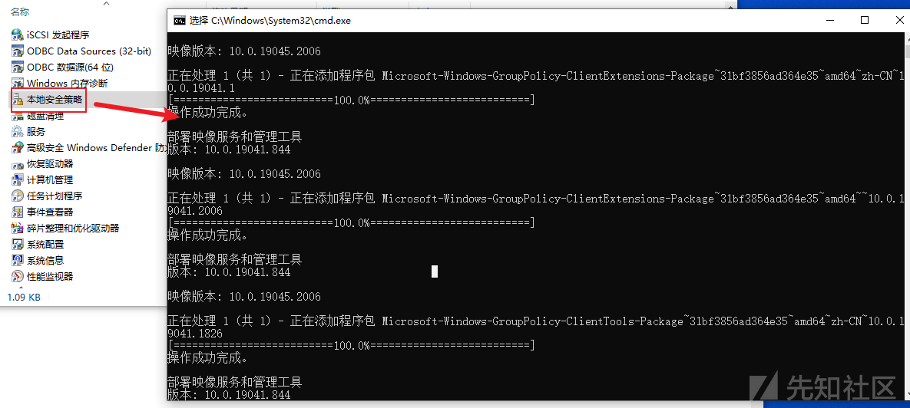](https://xzfile.aliyuncs.com/media/upload/picture/20240311125634-bc585198-df63-1.png)
=======
[](https://xzfile.aliyuncs.com/media/upload/picture/20240311125634-bc585198-df63-1.png)
>>>>>>> 4992f5f682bf7aa8873ceb2495ac1d2a8296850f

#### 2.2.2 SChannel 配置修改（组策略编辑器）

按照如下流程修改设置 TLS\_RSA\_WITH\_AES\_128\_CBC\_SHA 为最高优先级的步骤。不过这有个大坑，就是一些 Windows 操作系统版本特别是家庭版或者单语言版，组策略编辑器无法生效。在这种情况可以通过编辑注册表来手动配置加密套件的优先级。

-   打开组策略编辑器：运行 gpedit.msc 以打开本地组策略编辑器。
<<<<<<< HEAD
-   定位到密钥套件设置：在组策略编辑器中，导航到计算机配置 -> 管理模板 -> 网络 -> SSL 配置设置。在这里，可以找到“SSL 密码套件顺序”设置。
-   配置密码套件：双击“SSL 密码套件顺序”，启用该设置，并在文本框中输入你希望使用的密钥套件列表。密钥套件应该按照优先级排序，使用逗号分隔。
-   重启操作系统。

[](https://xzfile.aliyuncs.com/media/upload/picture/20240311125650-c5a9de60-df63-1.png)
=======
-   定位到密钥套件设置：在组策略编辑器中，导航到计算机配置 -> 管理模板 -> 网络 -> SSL 配置设置。在这里，可以找到“SSL 密码套件顺序”设置。
-   配置密码套件：双击“SSL 密码套件顺序”，启用该设置，并在文本框中输入你希望使用的密钥套件列表。密钥套件应该按照优先级排序，使用逗号分隔。
-   重启操作系统。

[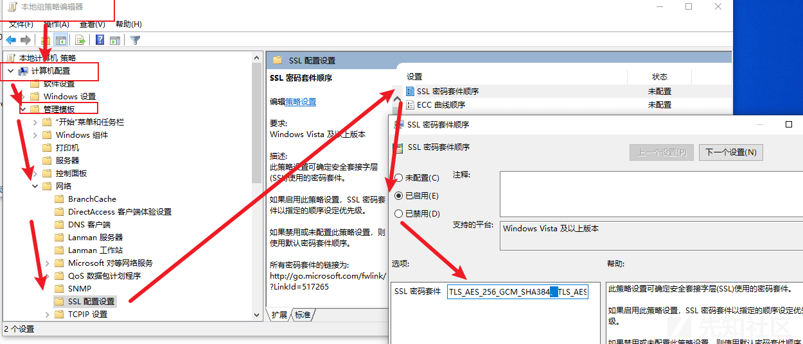](https://xzfile.aliyuncs.com/media/upload/picture/20240311125650-c5a9de60-df63-1.png)
>>>>>>> 4992f5f682bf7aa8873ceb2495ac1d2a8296850f

#### 2.2.2 SChannel 配置修改（注册表）

还是区分操作系统版本，在家庭版不生效。

以下是通过编辑注册表设置 TLS\_RSA\_WITH\_AES\_128\_CBC\_SHA 为最高优先级的步骤：

-   打开注册表编辑器：按下 Win + R，输入 regedit，然后按 Enter。
    
-   导航到以下路径：
    

<<<<<<< HEAD
```plain
=======
```bash
>>>>>>> 4992f5f682bf7aa8873ceb2495ac1d2a8296850f
HKEY_LOCAL_MACHINE\SOFTWARE\Policies\Microsoft\Cryptography\Configuration\SSL\00010002
```

-   在 00010002 路径下，创建或编辑名为 Functi ons 的 REG\_MULTI\_SZ（多字符串值）。
-   在 Functions 的值中，确保 TLS\_RSA\_WITH\_AES\_128\_CBC\_SHA 在列表的最前面。
-   保存并关闭注册表编辑器。
-   重新启动计算机。

<<<<<<< HEAD
[](https://xzfile.aliyuncs.com/media/upload/picture/20240311125720-d76addfc-df63-1.png)

修改前通讯使用无法解密的 TLS 套件通讯。

[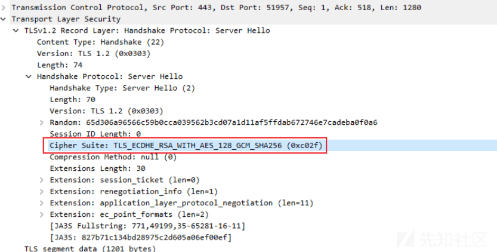](https://xzfile.aliyuncs.com/media/upload/picture/20240311125726-dade46ea-df63-1.png)

修改后使用 RSA 私钥即可解密的 TLS 套件通讯。

[](https://xzfile.aliyuncs.com/media/upload/picture/20240311125731-de4237f6-df63-1.png)
=======
[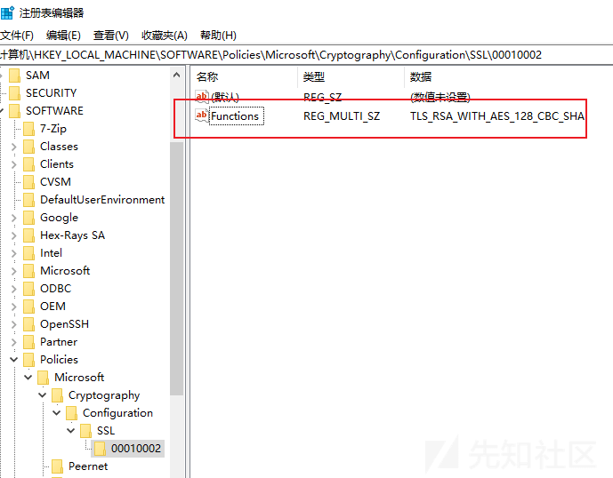](https://xzfile.aliyuncs.com/media/upload/picture/20240311125720-d76addfc-df63-1.png)

修改前通讯使用无法解密的 TLS 套件通讯。

[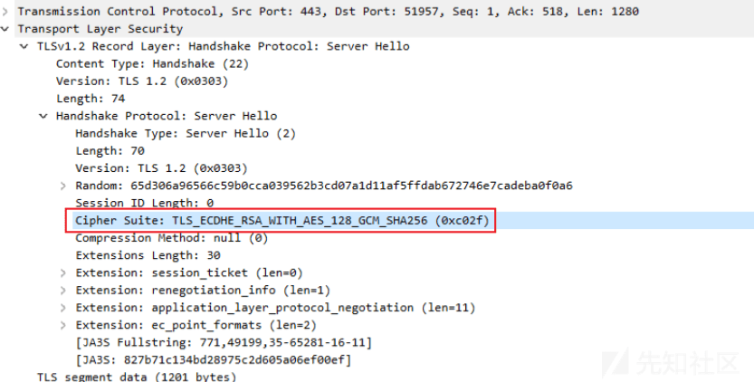](https://xzfile.aliyuncs.com/media/upload/picture/20240311125726-dade46ea-df63-1.png)

修改后使用 RSA 私钥即可解密的 TLS 套件通讯。

[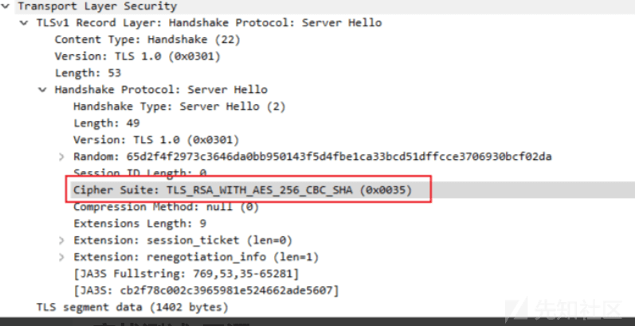](https://xzfile.aliyuncs.com/media/upload/picture/20240311125731-de4237f6-df63-1.png)
>>>>>>> 4992f5f682bf7aa8873ceb2495ac1d2a8296850f

### 2.3 TLS 通讯流量解密

TLS 套件 TLS\_RSA\_WITH\_AES\_256\_CBC\_SHA 在加密过程中，会使用双方生成的随机数、公钥、私钥以及配套的加密套件算法，自己写脚本的话还得去流量中做参数提取。所以使用 wireshark 自带的解密模块是最方便的。

将私钥保存为单独的文件，在 wireshark 首选项中配置解密即可，解密通讯数据如下。

<<<<<<< HEAD
[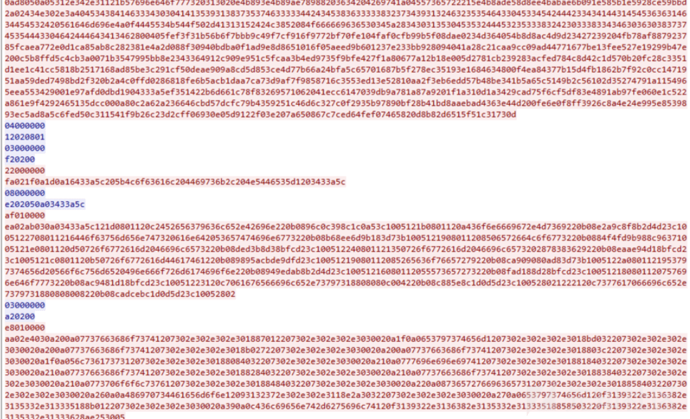](https://xzfile.aliyuncs.com/media/upload/picture/20240311125741-e3d584e8-df63-1.png)
=======
[](https://xzfile.aliyuncs.com/media/upload/picture/20240311125741-e3d584e8-df63-1.png)
>>>>>>> 4992f5f682bf7aa8873ceb2495ac1d2a8296850f

### 2.4 反序列化

在此系列第一篇文章中介绍了序列化流程，利用开源工具 CyberChef 解密 protobuf 序列化数据即可。

以一个网络链接反序列化数据解密为例子。  
选择 from hex、protobuf decode 模块。

<<<<<<< HEAD
[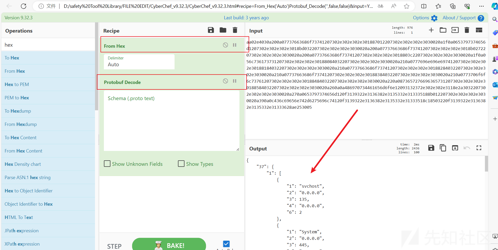](https://xzfile.aliyuncs.com/media/upload/picture/20240311125752-eaa8869e-df63-1.png)

解密部分数据如下。

[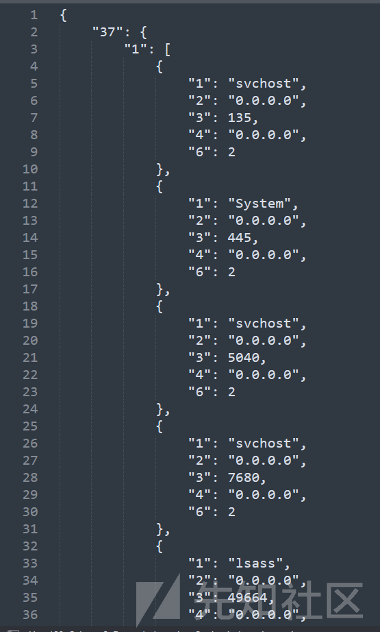](https://xzfile.aliyuncs.com/media/upload/picture/20240311125809-f48d1ab2-df63-1.png)

服务端在获取数据后解析如下。

[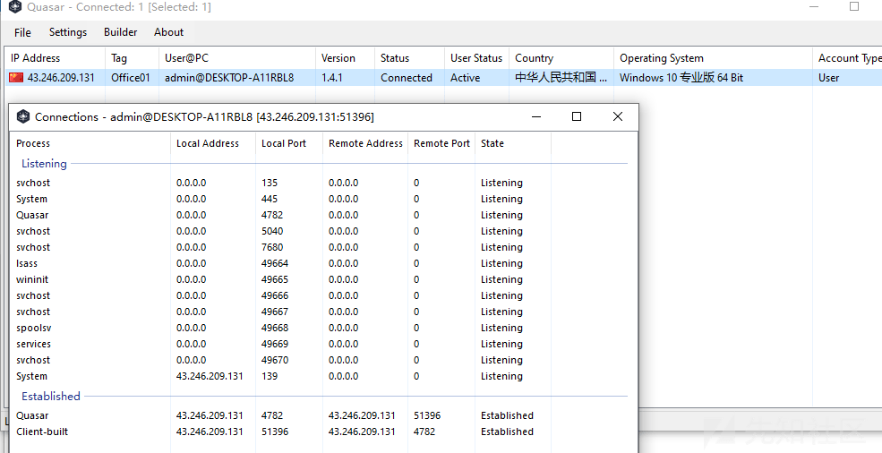](https://xzfile.aliyuncs.com/media/upload/picture/20240311125820-faf455f0-df63-1.png)
=======
[](https://xzfile.aliyuncs.com/media/upload/picture/20240311125752-eaa8869e-df63-1.png)

解密部分数据如下。

[](https://xzfile.aliyuncs.com/media/upload/picture/20240311125809-f48d1ab2-df63-1.png)

服务端在获取数据后解析如下。

[](https://xzfile.aliyuncs.com/media/upload/picture/20240311125820-faf455f0-df63-1.png)
>>>>>>> 4992f5f682bf7aa8873ceb2495ac1d2a8296850f

Quasar RAT 涉及加解密的模块主要就是这两大块，系列文章后续文会涉及针对 Quasar RAT 的入侵检测。

多谢师傅们观看，点个赞吧～
