# Wappalyzer 的分析和欺骗 - 先知社区

# 分析

## 构建一个 web

<<<<<<< HEAD
```plain
=======
```bash
>>>>>>> 4992f5f682bf7aa8873ceb2495ac1d2a8296850f
version: "3.3"

services:
  web:
    image: php:8.0-apache
    ports:
      - "18080:80"
    volumes:
      - ./fake:/var/www/html
    environment:
      - APACHE_DOCUMENT_ROOT=/var/www/html
```

docker 简单构建一个 web 容器，使用 apache+php，fake 目录用来后期欺骗测试

Wappalyzer 识别如下：

<<<<<<< HEAD
[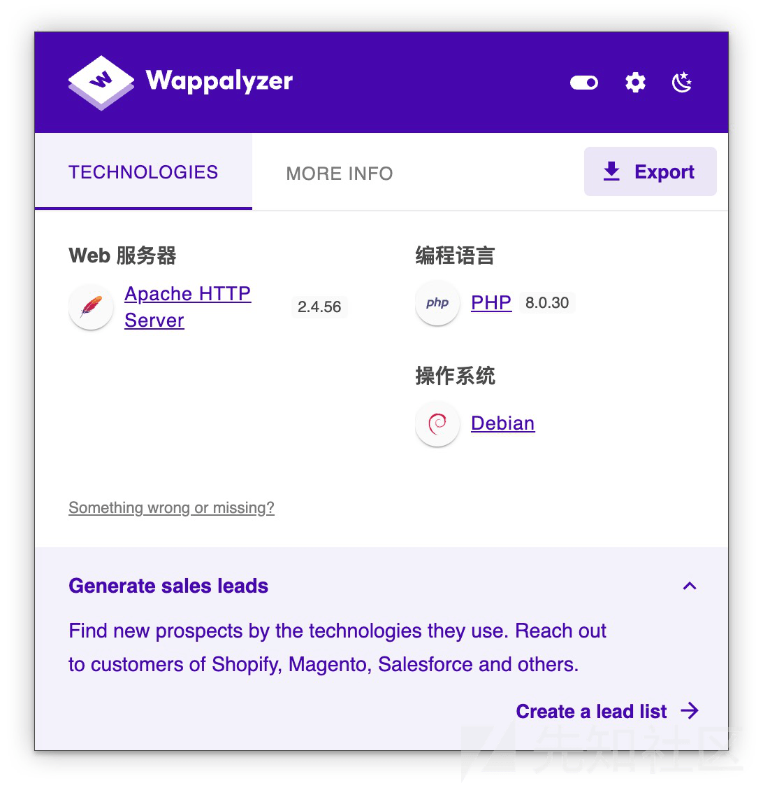](https://xzfile.aliyuncs.com/media/upload/picture/20240311221257-76223d58-dfb1-1.png)
=======
[](https://xzfile.aliyuncs.com/media/upload/picture/20240311221257-76223d58-dfb1-1.png)
>>>>>>> 4992f5f682bf7aa8873ceb2495ac1d2a8296850f

Web 服务器和编程语言的指纹基本上来自 `response header` 或者网页内容主体，没什么特别的

`js` 和 `dom` 的分析比较特殊，我们树藤摸瓜，先简单分析一下源代码

不知何故 Wappalyzer 已经删除了删除了开源项目

<<<<<<< HEAD
[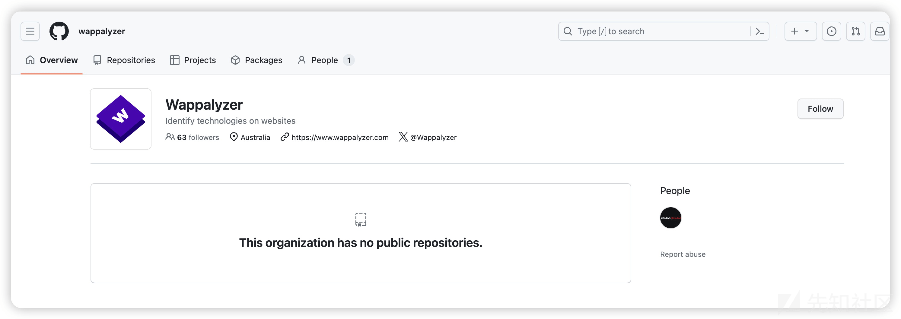](https://xzfile.aliyuncs.com/media/upload/picture/20240311221428-abed9702-dfb1-1.png)
=======
[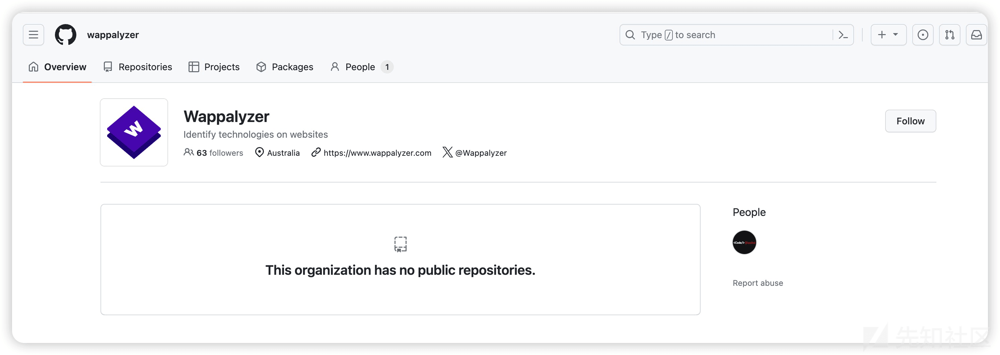](https://xzfile.aliyuncs.com/media/upload/picture/20240311221428-abed9702-dfb1-1.png)
>>>>>>> 4992f5f682bf7aa8873ceb2495ac1d2a8296850f

我们可以在谷歌应用商店安装插件然后到安装目录去直接进行分析

也可以下载 `crx` 文件重命名为 `zip` 后解压 [Wappalyzer crx](https://clients2.googleusercontent.com/crx/blobs/AQF4VIVFL7K7ButN59SnUvBAssSJKzgkuxHeKoRZhB9xsQRoPYYIuFDuU_OMC21tVpgAprmKGCYTGava5VyAktOAKQAdBGpSi0Xqfpi4F2M-gXkxE4Y1FxfqLdl2eBYkbn0HAMZSmuWD0FiewCUHHiCw6rXA8t2WnEGGQg/GPPONGMHJKPFNBHAGPMJFKANNFBLLAMG_6_10_68_0.crx)

## 源码分析

Chrome 插件存放目录一般位于 `/Chrome/Default/Extensions/`，在插件管理页面，我们可以看到 `Wappalyzer` 插件 `ID`

<<<<<<< HEAD
[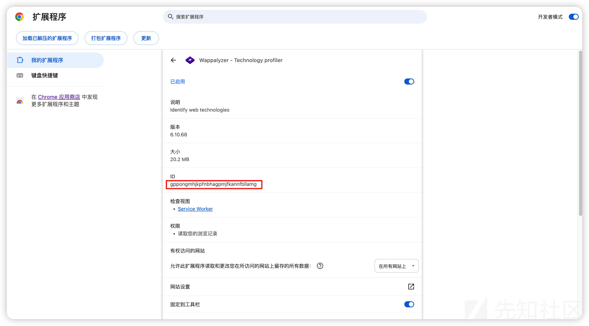](https://xzfile.aliyuncs.com/media/upload/picture/20240311221532-d2912842-dfb1-1.png)
=======
[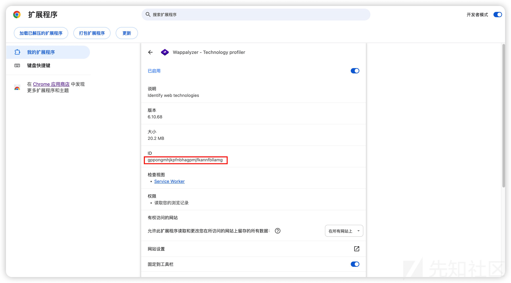](https://xzfile.aliyuncs.com/media/upload/picture/20240311221532-d2912842-dfb1-1.png)
>>>>>>> 4992f5f682bf7aa8873ceb2495ac1d2a8296850f

到插件目录下访问对应 ID，下面存放的就是插件的源代码，目录结构如下：

目录：

-   **\_locales**：这个目录包含插件的本地化文件。每个支持的语言都有自己的子目录，用于存放翻译后的字符串资源，使插件能够支持多种语言。
    
-   **\_metadata**：这个目录通常用于存储插件的元数据，比如 Chrome Web Store 的验证文件等。
    
-   **css**：存放插件使用的 CSS 样式文件的目录。
    
-   **html**：包含插件用到的 HTML 文件，例如插件的选项页面、弹出页面等。
    
-   **images**：存放插件使用的图片资源。
    
-   **js**：存放插件的 JavaScript 脚本文件，这些脚本负责插件的大部分功能实现。
    
-   **technologies**：这个目录可能包含与插件所使用的技术或框架相关的文件。
    
    - - -
    

我们重点只需要放在 `js` 和 `technologies` 目录

文件：

-   **manifest-safari.json**, **manifest-v2.json**, **manifest-v3.json**, **manifest.bak.json**, **manifest.json**：这些都是清单文件，描述了插件的基本信息（如版本、名称、权限需求等）。Chrome 插件可以支持不同的清单版本，因此可能存在多个不同版本的清单文件。`manifest.json` 是 Chrome 插件必须包含的文件，定义了插件的基本信息和行为。
    
-   **manifest.fingerprint**：用于安全或版本控制的指纹信息文件。
    
-   **schema.json**：用于定义插件的一些配置或数据结构的模式。
    
-   **categories.json**：用于定义插件相关的类别信息，这个文件不是所有插件都会有，具体内容依插件的功能和设计而定。
    
-   **groups.json**：这个文件可能用于定义插件内部的一些逻辑分组信息，具体内容取决于插件的设计。
    
    - - -
    

这里只需要关注 `manifest.json` 清单文件

js 注入实现功能的插件过多会影响我们的分析，我们只打开 Wappalyzer 在无痕模式下的使用权限，在无痕模式下打开 web 来开始分析

我们先来了解一下 Chrome 插件的执行大概执行流程

<<<<<<< HEAD
[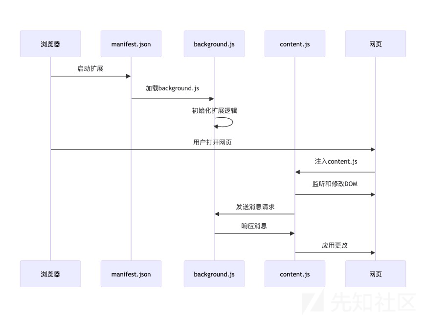](https://xzfile.aliyuncs.com/media/upload/picture/20240311221558-e1be6d8e-dfb1-1.png)

扩展加载的过程中会阅读 `manifest.json` 清单文件，浏览器会执行 `background.js` 和 `content.js`

[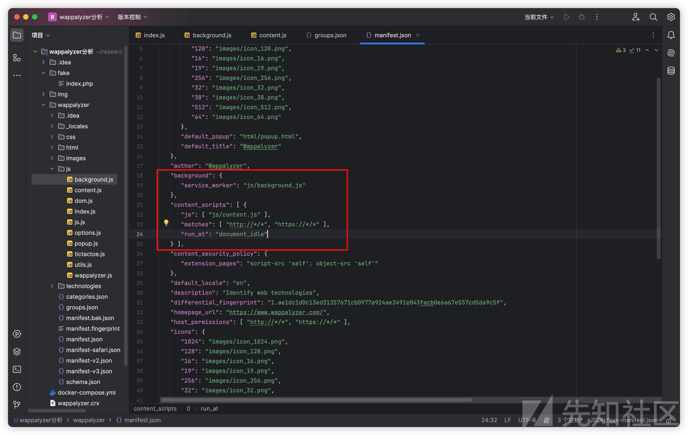](https://xzfile.aliyuncs.com/media/upload/picture/20240311221626-f286ab68-dfb1-1.png)

`background.js` 的代码很简单，通过 `importScripts` 这个全局函数引入了 `wappalyzer.js`、`utils.js`、`index.js`

```plain
=======
[](https://xzfile.aliyuncs.com/media/upload/picture/20240311221558-e1be6d8e-dfb1-1.png)

扩展加载的过程中会阅读 `manifest.json` 清单文件，浏览器会执行 `background.js` 和 `content.js`

[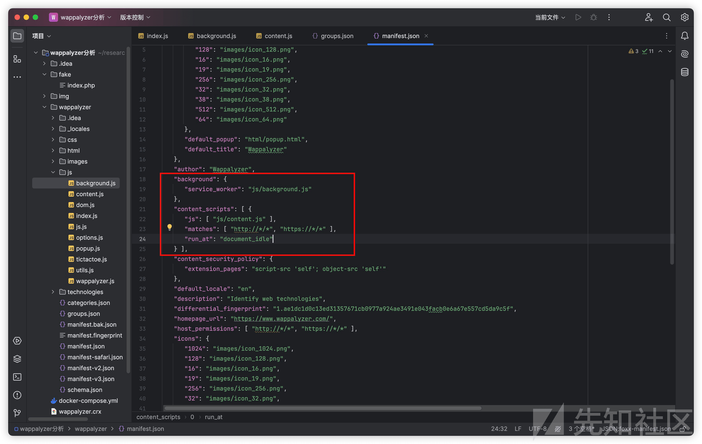](https://xzfile.aliyuncs.com/media/upload/picture/20240311221626-f286ab68-dfb1-1.png)

`background.js` 的代码很简单，通过 `importScripts` 这个全局函数引入了 `wappalyzer.js`、`utils.js`、`index.js`

```bash
>>>>>>> 4992f5f682bf7aa8873ceb2495ac1d2a8296850f
importScripts(chrome.runtime.getURL('js/wappalyzer.js'))
importScripts(chrome.runtime.getURL('js/utils.js'))
importScripts(chrome.runtime.getURL('js/index.js'))a
```

### 核心层 - wappalyzer.js

其中的 `toArray` 函数用于将传入的任何值都以数组形式返回 数据处理好后交给 `benchmark` 相关的函数进行性能监测相关的操作

<<<<<<< HEAD
[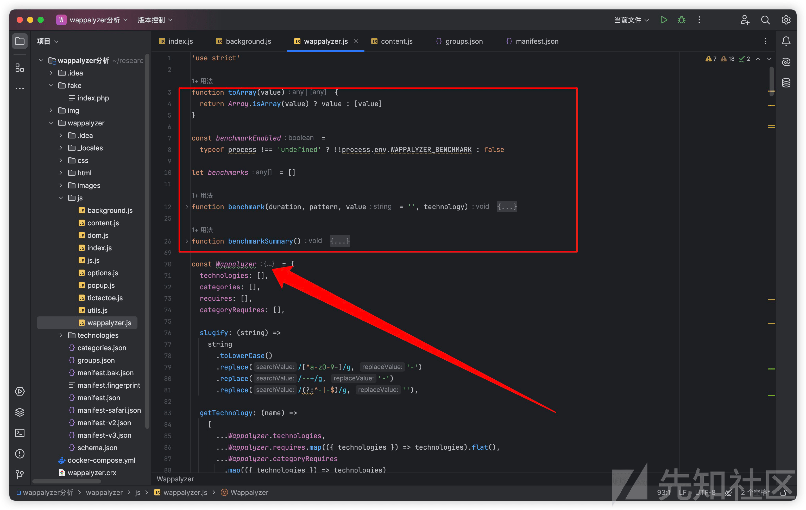](https://xzfile.aliyuncs.com/media/upload/picture/20240311221728-17a2fa8c-dfb2-1.png)
=======
[](https://xzfile.aliyuncs.com/media/upload/picture/20240311221728-17a2fa8c-dfb2-1.png)
>>>>>>> 4992f5f682bf7aa8873ceb2495ac1d2a8296850f

我们重点关注 `Wappalyzer` 对象，这是核心功能的集合，我们拆解一下其中的函数和变量

#### slugify

`slugify` 函数，用于将输入的字符转换为 `slug`，即 SEO 友好的字符

<<<<<<< HEAD
```plain
=======
```bash
>>>>>>> 4992f5f682bf7aa8873ceb2495ac1d2a8296850f
slugify: (string) =>
    string
      .toLowerCase()
      .replace(/[^a-z0-9-]/g, '-')
      .replace(/--+/g, '-')
      .replace(/(?:^-|-$)/g, ''),
```

#### getTechnology

`getTechnology` 函数，用于从 `Wappalyzer` 的指纹库中查找对应技术的详细信息

<<<<<<< HEAD
```plain
=======
```bash
>>>>>>> 4992f5f682bf7aa8873ceb2495ac1d2a8296850f
getTechnology: (name) =>
  [
    ...Wappalyzer.technologies,
    ...Wappalyzer.requires.map(({ technologies }) => technologies).flat(),
    ...Wappalyzer.categoryRequires
      .map(({ technologies }) => technologies)
      .flat(),
  ].find(({ name: _name }) => name === _name),
```

#### analyze

<<<<<<< HEAD
`analyze` 函数 ，它是 Wappalyzer 的主要分析入口

[](https://xzfile.aliyuncs.com/media/upload/picture/20240311221756-282ddd36-dfb2-1.png)

在这个函数最开始，通过 `benchmarks = []` 清空了代码最开始的性能监测结果，然后定义了不同类型的分析方法：

```plain
=======
`analyze` 函数，它是 Wappalyzer 的主要分析入口

[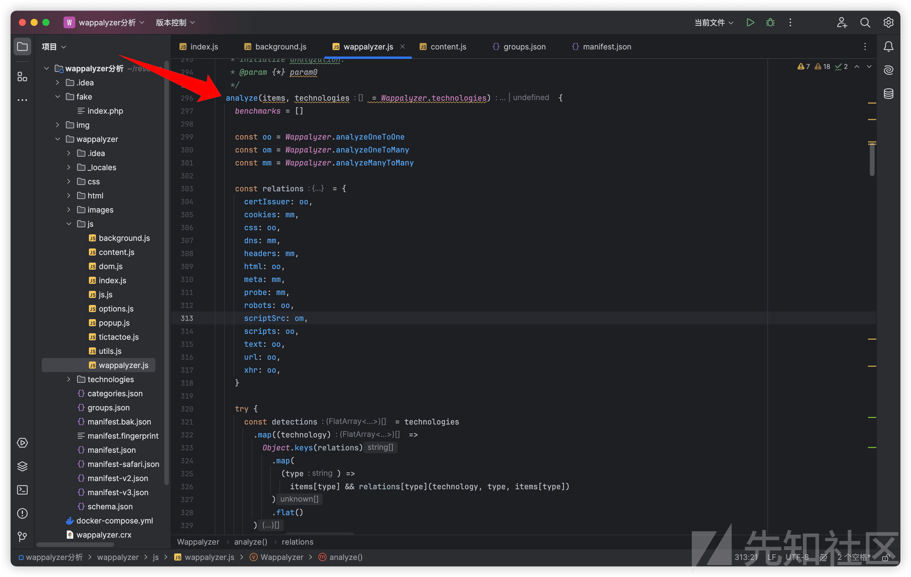](https://xzfile.aliyuncs.com/media/upload/picture/20240311221756-282ddd36-dfb2-1.png)

在这个函数最开始，通过 `benchmarks = []` 清空了代码最开始的性能监测结果，然后定义了不同类型的分析方法：

```bash
>>>>>>> 4992f5f682bf7aa8873ceb2495ac1d2a8296850f
const oo = Wappalyzer.analyzeOneToOne
    const om = Wappalyzer.analyzeOneToMany
    const mm = Wappalyzer.analyzeManyToMany
```

定义了一对一、一对多和多对多的分析方法，下面的 relations 定义了分析方法和不同网页数据的关系，这可以指导 `analyze` 函数如何根据网页的不同特征来应用不同的分析策略。

<<<<<<< HEAD
```plain
=======
```bash
>>>>>>> 4992f5f682bf7aa8873ceb2495ac1d2a8296850f
const relations = {
      certIssuer: oo,
      cookies: mm,
      css: oo,
      dns: mm,
      headers: mm,
      html: oo,
      meta: mm,
      probe: mm,
      robots: oo,
      scriptSrc: om,
      scripts: oo,
      text: oo,
      url: oo,
      xhr: oo,
    }
```

下面的其他函数就基本都是定义了技术的分类要求和隐含关系，整个过程相当于在初始化

### 工具层 - utils.js

这个文件主要定义了一些工具函数，代码比较长，简单看一下

<<<<<<< HEAD
```plain
=======
```bash
>>>>>>> 4992f5f682bf7aa8873ceb2495ac1d2a8296850f
'use strict'
/* eslint-env browser */
/* globals chrome */

<<<<<<< HEAD
// 为Manifest v2版本的Chrome扩展提供兼容性处理
=======
// 为 Manifest v2 版本的 Chrome 扩展提供兼容性处理
>>>>>>> 4992f5f682bf7aa8873ceb2495ac1d2a8296850f
if (chrome.runtime.getManifest().manifest_version === 2) {
  chrome.action = chrome.browserAction
}

const Utils = {
<<<<<<< HEAD
  // 根据运行时URL判断浏览器类型
  agent: '判断浏览器类型并返回',

  // 将基于回调的API调用转换为基于Promise的调用，以简化异步操作
  promisify: '将回调风格的异步操作转换为Promise风格',
=======
  // 根据运行时 URL 判断浏览器类型
  agent: '判断浏览器类型并返回',

  // 将基于回调的 API 调用转换为基于 Promise 的调用，以简化异步操作
  promisify: '将回调风格的异步操作转换为 Promise 风格',
>>>>>>> 4992f5f682bf7aa8873ceb2495ac1d2a8296850f

  // 打开新的浏览器标签页
  open: '在浏览器中打开新的标签页',

  // 从本地存储中获取选项值，如果不存在则返回默认值
  getOption: '从本地存储获取指定选项的值',

  // 将值保存到本地存储中
  setOption: '将指定选项的值保存到本地存储',

  // 应用国际化，更新文档中的文本为当前语言的翻译
<<<<<<< HEAD
  i18n: '自动将带有data-i18n属性的元素内容替换为国际化的文本',
=======
  i18n: '自动将带有 data-i18n 属性的元素内容替换为国际化的文本',
>>>>>>> 4992f5f682bf7aa8873ceb2495ac1d2a8296850f

  // 向扩展的其他部分发送消息，并处理响应
  sendMessage: '发送消息给扩展的其他部分，并等待响应',

<<<<<<< HEAD
  // 对glob模式的字符串进行转义
  globEscape: '对字符串中的特殊字符进行转义，以在glob模式中使用',
=======
  // 对 glob 模式的字符串进行转义
  globEscape: '对字符串中的特殊字符进行转义，以在 glob 模式中使用',
>>>>>>> 4992f5f682bf7aa8873ceb2495ac1d2a8296850f
}
```

### 入口层 - index.js

这个文件通过上面两个文件中的 `wappalyzer` 和 `utils` 对象完成了扩展程序的初始化，定义了一些匹配技术栈的具体实现方式

这里我们只查看指纹匹配部分的代码

从这个文件 `191` 行开始有了 `analyze*` 系列函数，我们一个个来看

首先定义了一个代理函数，它直接调用 `Wappalyzer` 中的 `analyze` 方法

<<<<<<< HEAD
```plain
=======
```bash
>>>>>>> 4992f5f682bf7aa8873ceb2495ac1d2a8296850f
analyze(...args) {
    return analyze(...args)
  },
```

#### analyzeJs

analyzeJs 函数用于接受一个 `url` 和 `JavaScript` 对象数组，以及 `Wapplyzer` 中 `analyze` 方法里定义的技术需求和类别需求

<<<<<<< HEAD
```plain
=======
```bash
>>>>>>> 4992f5f682bf7aa8873ceb2495ac1d2a8296850f
analyzeJs(url, js, requires, categoryRequires) {
    const technologies =
      getRequiredTechnologies(requires, categoryRequires) ||
      Wappalyzer.technologies

    return Driver.onDetect(
      url,
      js
        .map(({ name, chain, value }) => {
          const technology = technologies.find(
            ({ name: _name }) => name === _name
          )

          return technology
            ? analyzeManyToMany(technology, 'js', { [chain]: [value] })
            : []
        })
        .flat()
    )
  },
```

函数首先确定需要分析的技术集合，然后针对每个 JavaScript 对象（包含技术名称、链式调用路径和值），寻找与之匹配的技术。如果找到匹配的技术，会使用 `analyzeManyToMany` 方法进行深入分析，也就是多对多。

最后将匹配的技术通过 `Driver.OnDect` 方法进行处理，这个方法会去除重复的检测结果，并更新每项检测的最后访问 URL 和根路径标志。接下来，它解析检测结果以解决技术之间的依赖关系，并可能触发对需要的技术的进一步分析。

这里发现 OnDect 方法中有一个 ping 函数，这个函数用于发送匿名化数据帮助 Wappalyzer 改善服务

<<<<<<< HEAD
```plain
=======
```bash
>>>>>>> 4992f5f682bf7aa8873ceb2495ac1d2a8296850f
async ping() {
    const tracking = await getOption('tracking', true)
    const termsAccepted =
      agent === 'chrome' || (await getOption('termsAccepted', false))

    if (tracking && termsAccepted) {
      const urls = Object.keys(Driver.cache.hostnames).reduce(
        (urls, hostname) => {
          if (Object.keys(urls).length >= 25) {
            return urls
          }

          // eslint-disable-next-line standard/computed-property-even-spacing
          const { language, detections, hits, https } =
            Driver.cache.hostnames[hostname]

          const url = `http${https ? 's' : ''}://${hostname}`

          if (!hostnameIgnoreList.test(hostname) && hits) {
            urls[url] = urls[url] || {
              technologies: resolve(detections).reduce(
                (technologies, { name, confidence, version, rootPath }) => {
                  if (confidence === 100) {
                    technologies[name] = {
                      version,
                      hits,
                      rootPath,
                    }
                  }

                  return technologies
                },
                {}
              ),
              meta: {
                language,
              },
            }
          }

          return urls
        },
        {}
      )

      const count = Object.keys(urls).length

      const lastPing = await getOption('lastPing', Date.now())

      if (
        count &&
        ((count >= 25 && lastPing < Date.now() - 1000 * 60 * 60) ||
          (count >= 5 && lastPing < Date.now() - expiry))
      ) {
        await setOption('lastPing', Date.now())

        try {
          await Driver.post('https://ping.wappalyzer.com/v2/', {
            version: chrome.runtime.getManifest().version,
            urls,
          })
        } catch (error) {
          // eslint-disable-next-line no-console
          console.error(error)
        }

        Object.keys(Driver.cache.hostnames).forEach((hostname) => {
          Driver.cache.hostnames[hostname].hits = 0
        })
      }
    }
  }
```

它会首先检测用户是否接受了相关条款，当然 这个条款是默认接受了的

<<<<<<< HEAD
[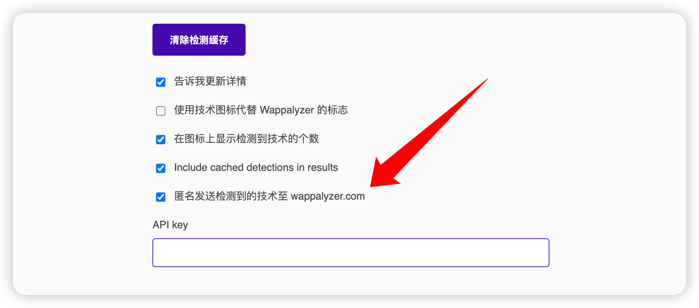](https://mayss.oss-cn-beijing.aliyuncs.com/image/image-20240225210542513.png)

在数据脱敏后会发送到 Wappalyzer 服务器

[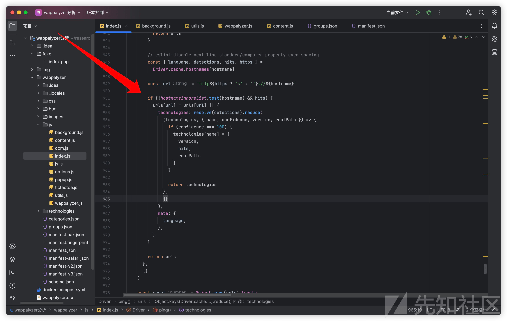](https://xzfile.aliyuncs.com/media/upload/picture/20240311221850-4853edda-dfb2-1.png)

[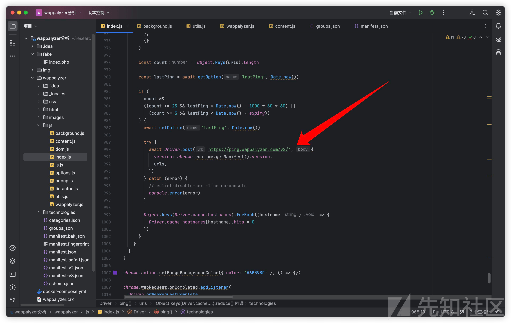](https://xzfile.aliyuncs.com/media/upload/picture/20240311221916-5791105c-dfb2-1.png)
=======
[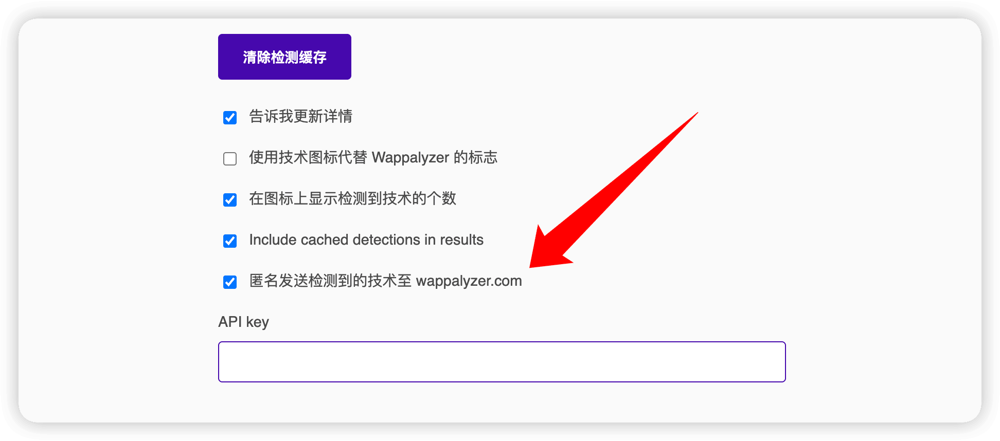](https://mayss.oss-cn-beijing.aliyuncs.com/image/image-20240225210542513.png)

在数据脱敏后会发送到 Wappalyzer 服务器

[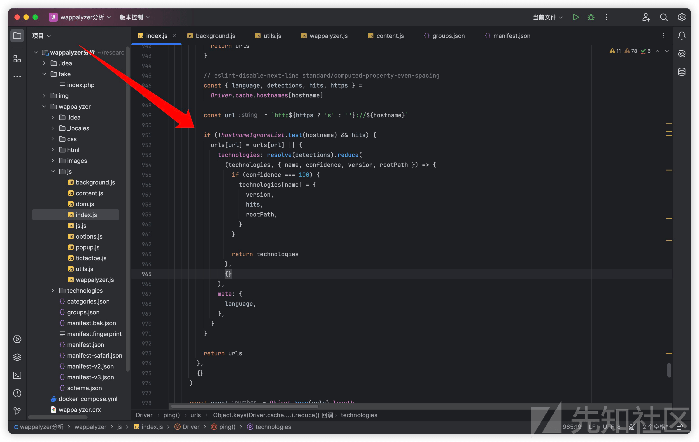](https://xzfile.aliyuncs.com/media/upload/picture/20240311221850-4853edda-dfb2-1.png)

[](https://xzfile.aliyuncs.com/media/upload/picture/20240311221916-5791105c-dfb2-1.png)
>>>>>>> 4992f5f682bf7aa8873ceb2495ac1d2a8296850f

#### analyzeDom

这个函数通过分析 `Dom` 节点来识别所使用的技术，使用的是 `Wappalyzer` 对象中定义的 `analyzeManyToMany` 多对多方式

主要提取了元素存在性、文本内容、属性值这三个 Dom 特征，最后也交给了 `Driver.OnDect` 方法进行处理

<<<<<<< HEAD
[](https://xzfile.aliyuncs.com/media/upload/picture/20240311221935-630edb58-dfb2-1.png)
=======
[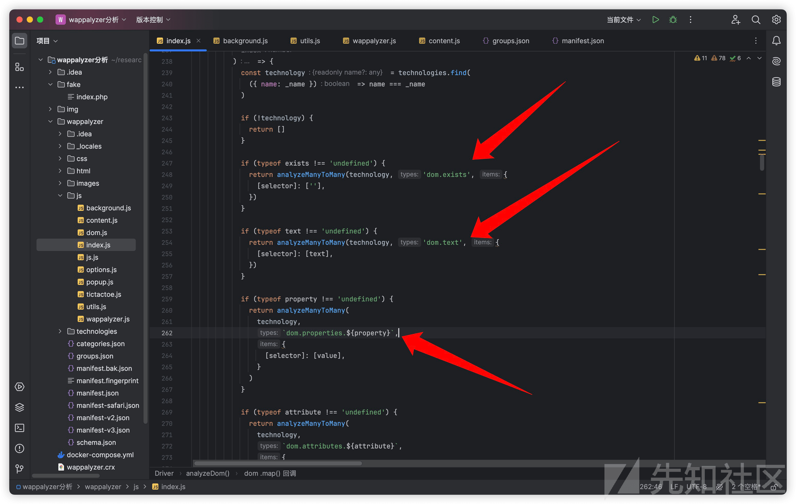](https://xzfile.aliyuncs.com/media/upload/picture/20240311221935-630edb58-dfb2-1.png)
>>>>>>> 4992f5f682bf7aa8873ceb2495ac1d2a8296850f

#### loadTechnologies

这个异步函数用于处理技术和类别数据

<<<<<<< HEAD
```plain
=======
```bash
>>>>>>> 4992f5f682bf7aa8873ceb2495ac1d2a8296850f
async loadTechnologies() {
    try {
      const categories = await (
        await fetch(chrome.runtime.getURL('categories.json'))
      ).json()

      let technologies = {}

      for (const index of Array(27).keys()) {
        const character = index ? String.fromCharCode(index + 96) : '_'

        technologies = {
          ...technologies,
          ...(await (
            await fetch(chrome.runtime.getURL(`technologies/${character}.json`))
          ).json()),
        }
      }

      Object.keys(technologies).forEach((name) => {
        delete technologies[name].description
        delete technologies[name].cpe
        delete technologies[name].pricing
        delete technologies[name].website
      })

      setTechnologies(technologies)
      setCategories(categories)
    } catch (error) {
      Driver.error(error)
    }
  }
```

通过 `categories.json` 文件获取类别数据后通过 `json()` 方法将相应体转换为 JavaScript 对象

<<<<<<< HEAD
```plain
=======
```bash
>>>>>>> 4992f5f682bf7aa8873ceb2495ac1d2a8296850f
try {
      const categories = await (
        await fetch(chrome.runtime.getURL('categories.json'))
      ).json()
```

初始化 `technologies` 对象，通过 `Array(27).keys()` 生成的序列加载 technologies 文件夹中的所有 json 文件

<<<<<<< HEAD
```plain
=======
```bash
>>>>>>> 4992f5f682bf7aa8873ceb2495ac1d2a8296850f
let technologies = {}

      for (const index of Array(27).keys()) {
        const character = index ? String.fromCharCode(index + 96) : '_'

        technologies = {
          ...technologies,
          ...(await (
            await fetch(chrome.runtime.getURL(`technologies/${character}.json`))
          ).json()),
        }
      }
```

加载了所有技术数据合并到 `technologies` 对象后移除了 `description`、`cpe`、`pricing`、`website` 这些不需要的属性来精简数据

<<<<<<< HEAD
```plain
=======
```bash
>>>>>>> 4992f5f682bf7aa8873ceb2495ac1d2a8296850f
Object.keys(technologies).forEach((name) => {
        delete technologies[name].description
        delete technologies[name].cpe
        delete technologies[name].pricing
        delete technologies[name].website
      }
```

- - -

chrome 执行完 `background.js` 后就来到了 `content.js`，我们来进行分析

### 内容脚本层 - content.js

#### inject

<<<<<<< HEAD
```plain
=======
```bash
>>>>>>> 4992f5f682bf7aa8873ceb2495ac1d2a8296850f
function inject(src, id, message) {
  return new Promise((resolve) => {
    // Inject a script tag into the page to access methods of the window object
    const script = document.createElement('script')

    script.onload = () => {
      const onMessage = ({ data }) => {
        if (!data.wappalyzer || !data.wappalyzer[id]) {
          return
        }

        window.removeEventListener('message', onMessage)

        resolve(data.wappalyzer[id])

        script.remove()
      }

      window.addEventListener('message', onMessage)

      window.postMessage({
        wappalyzer: message,
      })
    }

    script.setAttribute('src', chrome.runtime.getURL(src))

    document.body.appendChild(script)
  })
}
```

我们发现这里通过 `windows` 对象添加了一个 `message` 事件监听器，用于接收 `postMessage` 发送的消息，在处理完成后会通过 `removeEventListener` 移除监听器

#### getJs

getJs 函数中调用了 inject 函数向网页中注入了 `js.js` 文件，并传递了 `technologies` 对象，这个对象包含了技术列表

<<<<<<< HEAD
```plain
=======
```bash
>>>>>>> 4992f5f682bf7aa8873ceb2495ac1d2a8296850f
function getJs(technologies) {
  return inject('js/js.js', 'js', {
    technologies: technologies
      .filter(({ js }) => Object.keys(js).length)
      .map(({ name, js }) => ({ name, chains: Object.keys(js) })),
  })
}
```

传递的 `technologies` 对象使用 `filter` 筛选了那些没有 js 属性或者 js 属性为空的技术

#### getDom

代码有点长，整体就是其中调用 inject 函数向网页注入了 `dom.js` 文件并传递了 `technologies` 对象

<<<<<<< HEAD
```plain
async function getDom(technologies) {
  // 筛选出定义了dom属性的技术，并为每个技术保留其名称和dom对象
  const _technologies = '筛选并映射技术列表，只包含定义了DOM属性的技术';

  // 调用inject函数注入js/dom.js，并传递特定的技术列表到页面中
  // 这个过程允许在页面上执行js/dom.js脚本，该脚本根据传入的技术分析DOM
  return [
    ...(await '调用inject函数，将js/dom.js注入到页面，并传递包含DOM属性的技术列表'),
    ...'直接在当前页面上分析DOM元素，根据传入的技术规则收集信息',
=======
```bash
async function getDom(technologies) {
  // 筛选出定义了 dom 属性的技术，并为每个技术保留其名称和 dom 对象
  const _technologies = '筛选并映射技术列表，只包含定义了 DOM 属性的技术';

  // 调用 inject 函数注入 js/dom.js，并传递特定的技术列表到页面中
  // 这个过程允许在页面上执行 js/dom.js 脚本，该脚本根据传入的技术分析 DOM
  return [
    ...(await '调用 inject 函数，将 js/dom.js 注入到页面，并传递包含 DOM 属性的技术列表'),
    ...'直接在当前页面上分析 DOM 元素，根据传入的技术规则收集信息',
>>>>>>> 4992f5f682bf7aa8873ceb2495ac1d2a8296850f
  ]
}
```

它会通过传入的 `technologies` 对象分析 DOM 元素匹配 Web 技术

其中类似 `getJs` 函数，也去筛选掉了不包含 `dom` 属性的技术

那么我们顺藤摸瓜，看看 `js.js` 和 `dom.js` 都干了什么

### js.js

这个脚本被注入到网页中实现的内容比较简单，就是通过 technologies 对象识别网页所使用的技术绕后通过 postMessage 函数返回给 content.js

它首先会通过 onMessage 监听信息，插件后台会通过 postMessage 的方式传到前端，前端进行指纹匹配后再通过 postMessage 传回后台

<<<<<<< HEAD
```plain
=======
```bash
>>>>>>> 4992f5f682bf7aa8873ceb2495ac1d2a8296850f
/* eslint-env browser */

;(function () {
  try {
    const onMessage = ({ data }) => {
      if (!data.wappalyzer || !data.wappalyzer.technologies) {
        return
      }

      const { technologies } = data.wappalyzer

      postMessage({
        wappalyzer: {
          js: technologies.reduce((technologies, { name, chains }) => {
            chains.forEach((chain, index) => {
              const value = chain
                .split('.')
                .reduce(
                  (value, method) =>
                    value &&
                    value instanceof Object &&
                    Object.prototype.hasOwnProperty.call(value, method)
                      ? value[method]
                      : '__UNDEFINED__',
                  window
                )

              if (value !== '__UNDEFINED__') {
                technologies.push({
                  name,
                  chain,
                  value:
                    typeof value === 'string' || typeof value === 'number'
                      ? value
                      : !!value,
                })
              }
            })

            return technologies
          }, []),
        },
      })
    }

    addEventListener('message', onMessage, { once: true })
  } catch (e) {
    // Fail quietly
  }
})()
```

### dom.js

这个脚本通过分析网页 DOM 结构寻找与特定技术相关的 DOM 元素然后通过 postMessage 返回给 content.js，监听和匹配逻辑与 js.js 无异

<<<<<<< HEAD
```plain
=======
```bash
>>>>>>> 4992f5f682bf7aa8873ceb2495ac1d2a8296850f
/* eslint-env browser */

;(function () {
  try {
    const onMessage = ({ data }) => {
      if (!data.wappalyzer || !data.wappalyzer.technologies) {
        return
      }

      const { technologies } = data.wappalyzer

      const toScalar = (value) =>
        typeof value === 'string' || typeof value === 'number' ? value : !!value

      removeEventListener('message', onMessage)

      postMessage({
        wappalyzer: {
          dom: technologies.reduce((technologies, { name, dom }) => {
            try {
              Object.keys(dom).forEach((selector) => {
                let nodes = []

                try {
                  nodes = document.querySelectorAll(selector)
                } catch (error) {
                  // Continue
                }

                if (!nodes.length) {
                  return
                }

                nodes.forEach((node) => {
                  dom[selector].forEach(({ properties }) => {
                    if (properties) {
                      Object.keys(properties).forEach((property) => {
                        if (
                          Object.prototype.hasOwnProperty.call(node, property)
                        ) {
                          const value = node[property]

                          if (typeof value !== 'undefined') {
                            technologies.push({
                              name,
                              selector,
                              property,
                              value: toScalar(value),
                            })
                          }
                        }
                      })
                    }
                  })
                })
              })
            } catch (error) {
              // Fail quietly
            }

            return technologies
          }, []),
        },
      })
    }

    addEventListener('message', onMessage)
  } catch (e) {
    // Fail quietly
  }
})()
```

# 伪造思路

## Hook

要实现 Wappalyzer 的欺骗，我们就要利用 hook 技术来修改执行流程中的某个函数

比如在流水线的某个环节，我们想加入一个检查站来检测产品质量，但你不想停下整个流水线或改变其它环节的工作

Hook 就像是在流水线上加入这样一个检查站的方式，它让你能在不干扰原有流程的情况下，加入自己的检测或修改步骤。

## target function

根据我们在源码分析中一开始分析的 chrome 加载插件流程，其中 content.js 被注入到了网页中

那我们我们通过 hook content.js 中的函数就可以实现欺骗

<<<<<<< HEAD
[](https://xzfile.aliyuncs.com/media/upload/picture/20240311222000-71f3f1e4-dfb2-1.png)

内容脚本层 content.js 中的 inject 函数就十分合适，这里我们可以有若干种 hook 思路

```plain
=======
[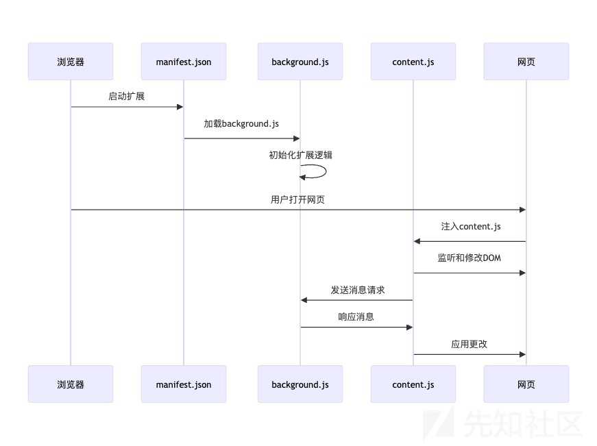](https://xzfile.aliyuncs.com/media/upload/picture/20240311222000-71f3f1e4-dfb2-1.png)

内容脚本层 content.js 中的 inject 函数就十分合适，这里我们可以有若干种 hook 思路

```bash
>>>>>>> 4992f5f682bf7aa8873ceb2495ac1d2a8296850f
function inject(src, id, message) {
  return new Promise((resolve) => {
    // Inject a script tag into the page to access methods of the window object
    const script = document.createElement('script')

    script.onload = () => {
      const onMessage = ({ data }) => {
        if (!data.wappalyzer || !data.wappalyzer[id]) {
          return
        }

        window.removeEventListener('message', onMessage)

        resolve(data.wappalyzer[id])

        script.remove()
      }

      window.addEventListener('message', onMessage)

      window.postMessage({
        wappalyzer: message,
      })
    }

    script.setAttribute('src', chrome.runtime.getURL(src))

    document.body.appendChild(script)
  })
}
```

脚本通过 `windows` 对象 `addEventListener` 添加 `message` 监听器，每次接收完 `postMessage` 传递的消息后就执行 `removeEventListener`

那我我们就可以通过劫持 `addEventListener` 或 `removeEventListener` 来实现 `hook`，在这个过程中伪造指纹通过 `postMessage` 传递

在 `js.js` 中我们看看 `postMessage` 发送的指纹格式

<<<<<<< HEAD
```plain
=======
```bash
>>>>>>> 4992f5f682bf7aa8873ceb2495ac1d2a8296850f
postMessage({
        wappalyzer: {
          js: technologies.reduce((technologies, { name, chains }) => {
            chains.forEach((chain, index) => {
              const value = chain
                .split('.')
                .reduce(
                  (value, method) =>
                    value &&
                    value instanceof Object &&
                    Object.prototype.hasOwnProperty.call(value, method)
                      ? value[method]
                      : '__UNDEFINED__',
                  window
                )

              if (value !== '__UNDEFINED__') {
                technologies.push({
                  name,
                  chain,
                  value:
                    typeof value === 'string' || typeof value === 'number'
                      ? value
                      : !!value,
                })
              }
            })

            return technologies
          }, []),
        },
      }
```

参数是一个对象，其中包含了 `wappalyzer` 属性，而 `wappalyzer` 属性本身又是一个对象，包含了 `js` 属性

其中包含了 `name`、`chain`、`value` 这三个参数

`name`：技术名称，通过遍历 `technologies` 数组获得

`chains`：接收一个字符串，表示尝试访问的技术原型链，指定了以 `window` 开头

`value`：属性链最终指向的值（版本号）这个值的处理方式如下：

-   如果最终值是字符串或数字，直接使用该值。
-   如果最终值是其他类型（如对象、数组等），则转换为布尔值 `true`（只要存在且不是字符串或数字，就认为技术存在）。
-   如果属性链在某个点断开（即，无法找到下一个属性或方法），则这个技术不会被包含在最终的数组中。

<<<<<<< HEAD
> 但是这里 value 其实有被过滤 暂时没找到是哪个位置进行的过滤 暂时无法写入一些有趣的字符 （mo60）

打个断点也能清晰的看到数据结构

[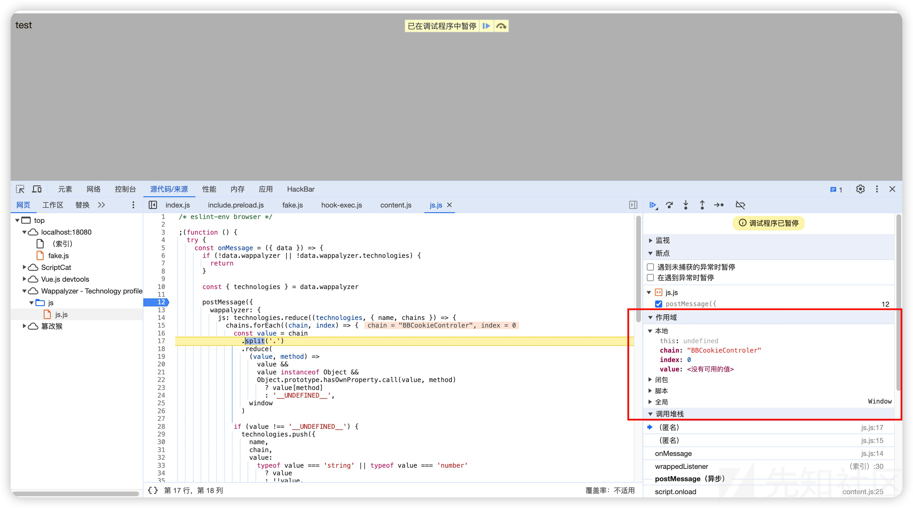](https://xzfile.aliyuncs.com/media/upload/picture/20240311222021-7e3da18e-dfb2-1.png)

同样能看到 `technologies` 来源于 onMessage 消息

[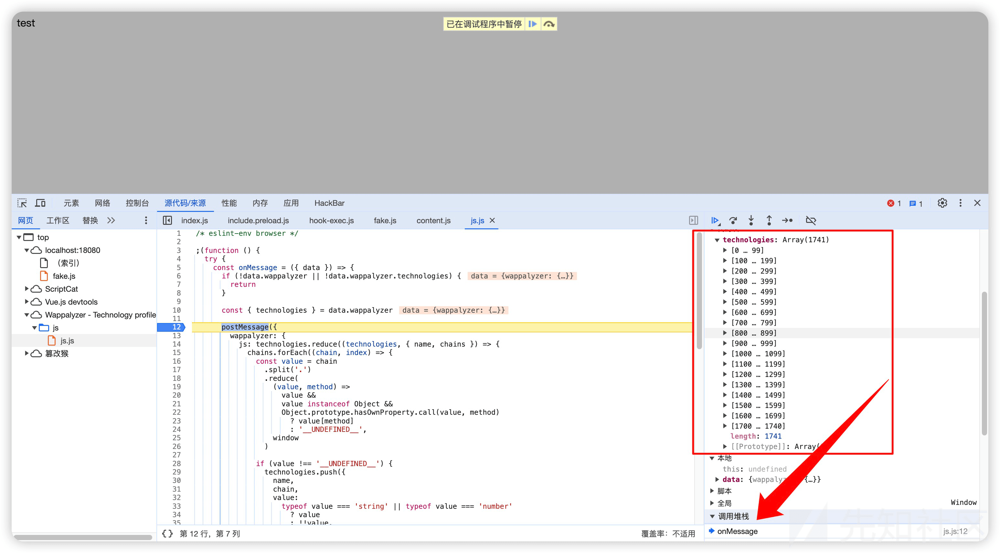](https://xzfile.aliyuncs.com/media/upload/picture/20240311222038-888469fc-dfb2-1.png)
=======
> 但是这里 value 其实有被过滤 暂时没找到是哪个位置进行的过滤 暂时无法写入一些有趣的字符（mo60）

打个断点也能清晰的看到数据结构

[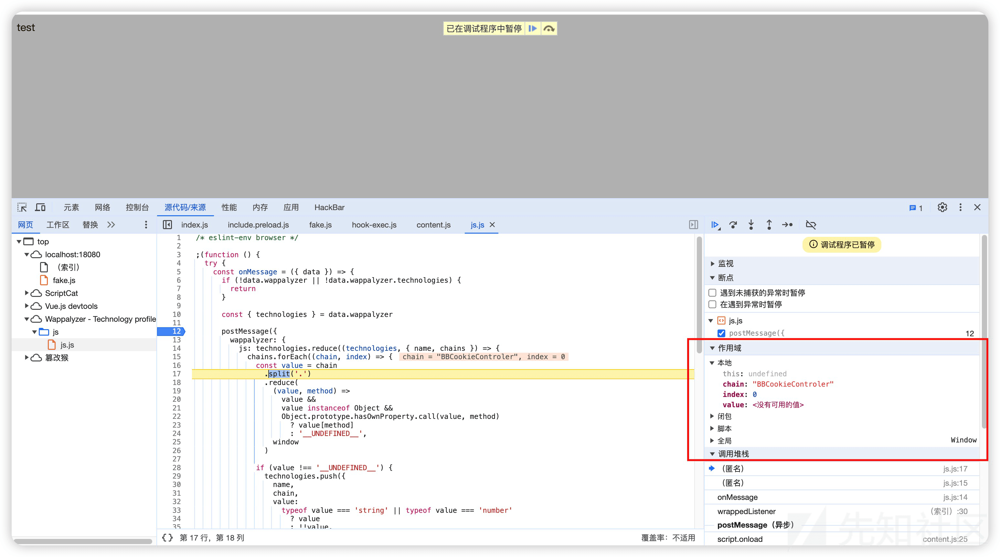](https://xzfile.aliyuncs.com/media/upload/picture/20240311222021-7e3da18e-dfb2-1.png)

同样能看到 `technologies` 来源于 onMessage 消息

[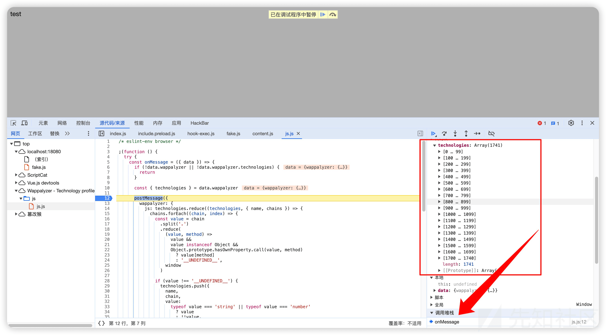](https://xzfile.aliyuncs.com/media/upload/picture/20240311222038-888469fc-dfb2-1.png)
>>>>>>> 4992f5f682bf7aa8873ceb2495ac1d2a8296850f

# 雏形

## Hook

<<<<<<< HEAD
```plain
=======
```bash
>>>>>>> 4992f5f682bf7aa8873ceb2495ac1d2a8296850f
<script>
    (function() {
        const originalAddEventListener = window.addEventListener;
        window.addEventListener = function(type, listener, options) {
            if (type === "message") {
                const wrappedListener = function(event) {
                    if (event.data && event.data.wappalyzer) {
                        console.log("Wappalyzer message intercepted", event.data);
                        const poc = () => {
                            postMessage({
                                wappalyzer: {
                                    js: [
                                    // 这里插入伪造的指纹
                                    ],
                                },
                            });
                        };
                    }
<<<<<<< HEAD
                    // 调用原始listener
=======
                    // 调用原始 listener
>>>>>>> 4992f5f682bf7aa8873ceb2495ac1d2a8296850f
                    return listener.apply(this, arguments);
                };
                return originalAddEventListener.call(this, type, wrappedListener, options);
            }
            return originalAddEventListener.apply(this, arguments);
        };
    })();
</script>
```

# 数据处理

读取 technologies 目录下所有 json 文件 实现 content.js 中 getJs 筛选技术的功能

getDom 的实现方法页到的应用会不太一样 实际中可能结合蜜罐等需求伪造相应指纹

我们通过 Python 来实现

<<<<<<< HEAD
```plain
import os # 读文件
import json # json操作
=======
```bash
import os # 读文件
import json # json 操作
>>>>>>> 4992f5f682bf7aa8873ceb2495ac1d2a8296850f
```

从文件加载技术数据

<<<<<<< HEAD
```plain
=======
```bash
>>>>>>> 4992f5f682bf7aa8873ceb2495ac1d2a8296850f
def load_technologies(directory):
    characters = ['_'] + [chr(i) for i in range(ord('a'), ord('z') + 1)]
    all_technologies = {}

    for character in characters:
        file_path = os.path.join(directory, f"{character}.json")
        if os.path.exists(file_path):
            with open(file_path, 'r') as file:
                data = json.load(file)
                all_technologies.update(data)

    return all_technologies
```

筛选 js 技术 其中 `value` 的值我们直接硬编码 `true` 由于 `technologies/*.json` 中某个技术可能存在多个 `chain` 我们只取第一个

只提取 `name`、`chain`、`value` 字段

<<<<<<< HEAD
```plain
=======
```bash
>>>>>>> 4992f5f682bf7aa8873ceb2495ac1d2a8296850f
def filter_technologies(technologies):
    js_technologies = []

    for name, details in technologies.items():
        if "js" in details and details["js"]:
            first_chain = list(details["js"].keys())[0]
            js_technologies.append({
                "name": name,
                "chain": first_chain,
                "value": True
            })

    return js_technologies
```

调用主逻辑 数据清洗后写入文件

<<<<<<< HEAD
```plain
=======
```bash
>>>>>>> 4992f5f682bf7aa8873ceb2495ac1d2a8296850f
def main():
    technologies_directory = "./technologies"
    loaded_technologies = load_technologies(technologies_directory)
    js_technologies, dom_technologies = filter_technologies(loaded_technologies)

    with open('js.json', 'w') as f:
        json.dump(js_technologies, f, indent=4)

if __name__ == "__main__":
    main()
```

写入后 js.json 长这样

<<<<<<< HEAD
```plain
=======
```bash
>>>>>>> 4992f5f682bf7aa8873ceb2495ac1d2a8296850f
[
    {
        "name": "2B Advice",
        "chain": "BBCookieControler",
        "value": true
    },
    {
        "name": "33Across",
        "chain": "Tynt",
        "value": true
    },
    {
        "name": "4-Tell",
        "chain": "_4TellBoost",
        "value": true
    },
    {
        "name": "51.LA",
        "chain": "LA.config.ck",
        "value": true
    },
  ...
  ]
```

# Response 指纹伪造

这里的伪造方法比较简单，以一个朋友的博客为例

Wappalyzer 识别为 WordPress 4.7.24 实际上用的是 typecho

<<<<<<< HEAD
[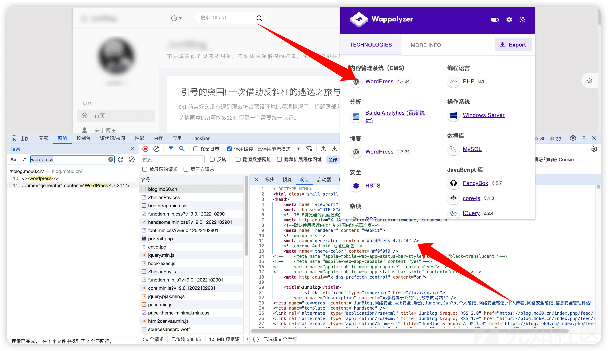](https://xzfile.aliyuncs.com/media/upload/picture/20240311222057-941cc2aa-dfb2-1.png)

[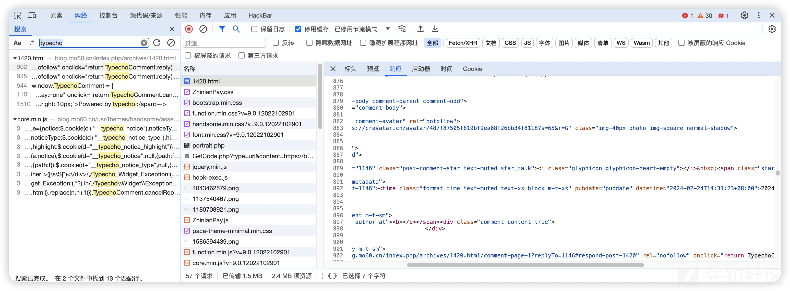](https://xzfile.aliyuncs.com/media/upload/picture/20240311222118-a0564028-dfb2-1.png)

这种伪造只需要在 html 中写一个 generator

```plain
=======
[](https://xzfile.aliyuncs.com/media/upload/picture/20240311222057-941cc2aa-dfb2-1.png)

[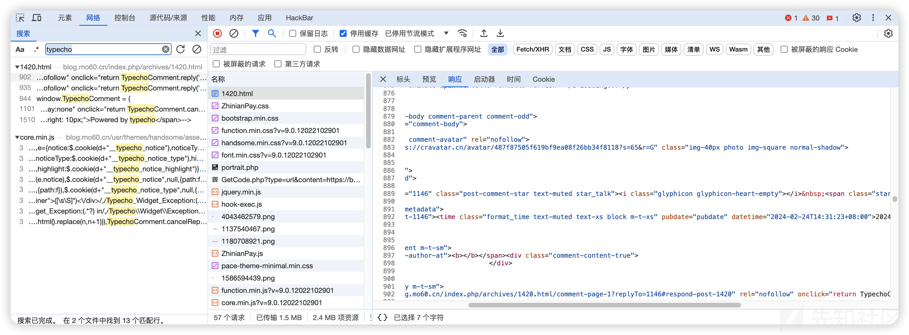](https://xzfile.aliyuncs.com/media/upload/picture/20240311222118-a0564028-dfb2-1.png)

这种伪造只需要在 html 中写一个 generator

```bash
>>>>>>> 4992f5f682bf7aa8873ceb2495ac1d2a8296850f
<meta name="generator" content="WordPress 4.7.24" />
```

# Js 指纹伪造

在 html 中调用 fake.js 其中也需要预先注入脚本 不过可以先不写入指纹数据

<<<<<<< HEAD
```plain
=======
```bash
>>>>>>> 4992f5f682bf7aa8873ceb2495ac1d2a8296850f
<html>
<head><title>fake fingerprint</title><script  src="fake.js" async></script></head>
<body>
<script>
    (function() {
        const originalAddEventListener = window.addEventListener;

        window.addEventListener = function(type, listener, options) {
            if (type === "message") {
                const wrappedListener = function(event) {
                    if (event.data && event.data.wappalyzer) {
                        console.log("Wappalyzer message intercepted", event.data);
                        const poc = () => {
                            postMessage({
                                wappalyzer: {
                                    js: [

                                    ],
                                },
                            });
                        };
                    }
                    return listener.apply(this, arguments);
                };
                return originalAddEventListener.call(this, type, wrappedListener, options);
            }
            return originalAddEventListener.apply(this, arguments);
        };
    })();
</script>
<?php
echo "test";
?>

</body>
</html>
```

fake.js 这里我们先少写几个指纹

<<<<<<< HEAD
```plain
=======
```bash
>>>>>>> 4992f5f682bf7aa8873ceb2495ac1d2a8296850f
// hook removeEventListener


let rel = removeEventListener;
removeEventListener = (name, func, opt) => {
    if (
        name === "message" &&
        func &&
        func.toString().includes("wappalyzer.technologies") !== -1 &&
        func.toString().includes("removeEventListener") !== -1 &&
        func.toString().includes("__UNDEFINED__") !== -1 &&
        func.toString().includes("postMessage") !== -1
    ) {
        poc();
        rel(name, func, opt);
    } else {
        rel(name, func, opt);
    }
};

const poc = () => {
    postMessage({
        wappalyzer: {
            js: [
                {name: "Zipify Pages", chain: "ZipifyPages", value: true},
                {name: "Zipteams", chain: "ZipteamsWidget", value: true},
                {name: "Zmags Creator", chain: "__zmags", value: true},
                {name: "Zoey", chain: "Zoey.module", value: true},
                {name: "Zoho PageSense", chain: "$pagesense", value: true},
                {name: "Zoko", chain: "__zoko_app_version", value: true},
                {name: "Zone.js", chain: "Zone.root", value: true},
                {name: "Zonos", chain: "Zonos", value: true},
                {name: "Zotabox", chain: "Zotabox", value: true}
            ],
        },
    });
};
```

测试的时候记得清除 Wappalyzer 缓存

<<<<<<< HEAD
[](https://xzfile.aliyuncs.com/media/upload/picture/20240311222139-acc9b128-dfb2-1.png)

伪造效果如下：

[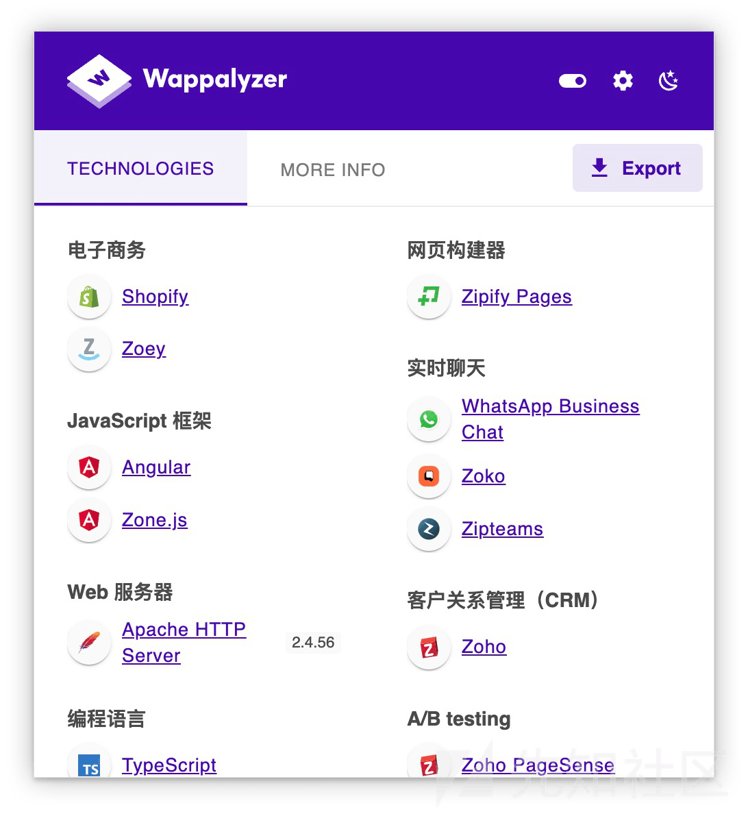](https://xzfile.aliyuncs.com/media/upload/picture/20240311222203-bb76b036-dfb2-1.png)

也可以添加全部指纹 混淆视听

[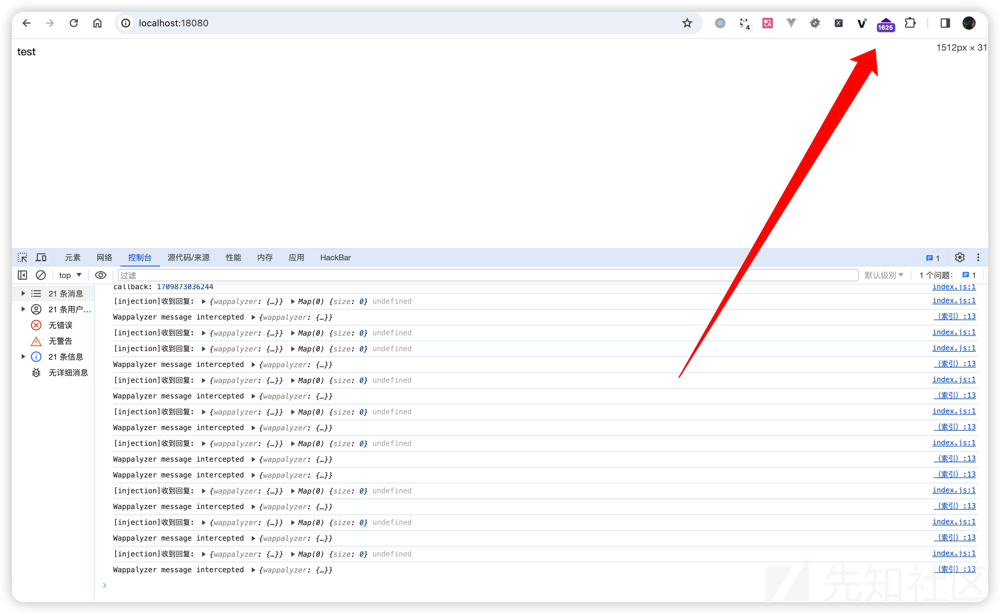](https://xzfile.aliyuncs.com/media/upload/picture/20240311222225-c8a8b402-dfb2-1.png)
=======
[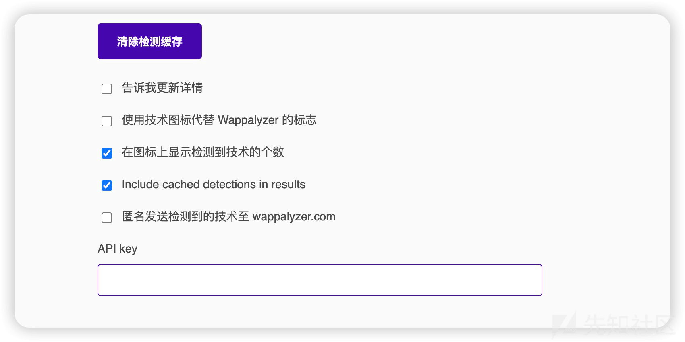](https://xzfile.aliyuncs.com/media/upload/picture/20240311222139-acc9b128-dfb2-1.png)

伪造效果如下：

[](https://xzfile.aliyuncs.com/media/upload/picture/20240311222203-bb76b036-dfb2-1.png)

也可以添加全部指纹 混淆视听

[](https://xzfile.aliyuncs.com/media/upload/picture/20240311222225-c8a8b402-dfb2-1.png)
>>>>>>> 4992f5f682bf7aa8873ceb2495ac1d2a8296850f

# Dom 指纹伪造

异曲同工

# Self Xss

<<<<<<< HEAD
```plain
=======
```bash
>>>>>>> 4992f5f682bf7aa8873ceb2495ac1d2a8296850f
// hook addEventListener
let rel = addEventListener;
addEventListener = (name, func, opt) => {
  if (
    name === "message" &&
    func &&
    func.toString().includes("wappalyzer.technologies") !== -1 &&
    func.toString().includes("removeEventListener") !== -1 &&
    func.toString().includes("__UNDEFINED__") !== -1 &&
    func.toString().includes("postMessage") !== -1
  ) {
    rel(name, func, opt);
    poc();
  } else {
    rel(name, func, opt);
  }
};

window.bad = {
  get xss() {
    alert("xss!");
  },
};

const poc = () => {
  postMessage({
    wappalyzer: {
      technologies: [
        {
          name: "xss",
          chains: ["bad.xss"],
        },
      ],
    },
  });
};
```

<<<<<<< HEAD
[](https://xzfile.aliyuncs.com/media/upload/picture/20240311222247-d5464fd0-dfb2-1.png)
=======
[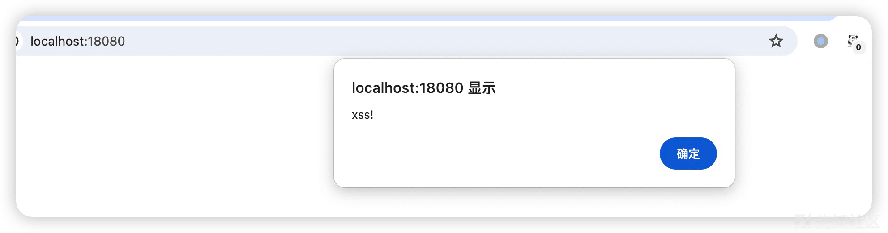](https://xzfile.aliyuncs.com/media/upload/picture/20240311222247-d5464fd0-dfb2-1.png)
>>>>>>> 4992f5f682bf7aa8873ceb2495ac1d2a8296850f

# 絮叨

本文用到的代码只是一个示例，在实际中可以参考我的上一篇文章 [JavaScript 混淆防护与调试技术探析](https://xz.aliyun.com/t/13845) 对代码进行混淆

指纹部分代码也可以通过 cdn 引入 让代码更简洁

[https://blog.xlab.app/p/63a5b7e6/#XSS](https://blog.xlab.app/p/63a5b7e6/#XSS)
