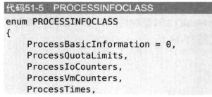
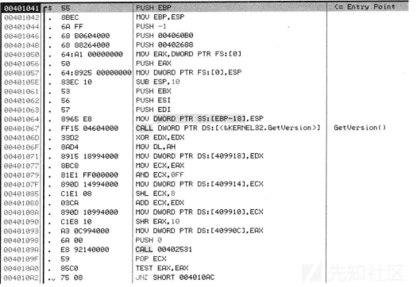

# Windows 环境下病毒逆向分析，常见反调试技术手法梳理 - 先知社区

# 前言

作者近期在分析具有 APT 背景的病毒样本中遇到一个反调试模块，搞了满满当当三天虽然搞定了，但是期间还是戴了痛苦面具，回头总结一下问题还是出在对一些底层、原理性的知识不太了解。所以萌生了梳理 Windows 环境下病毒逆向分析常见反调试技术的想法，遂记录此篇文章。

文章记录偏向于原理梳理，辅以简单案例，但案例代码过长的不好贴在文章里，大部分案例我都以 C++ 和 GO 两种语言实现 (GO 调用 NT 内核函数颇为麻烦，部分只写了 C++)。

-   C++

[](https://xzfile.aliyuncs.com/media/upload/picture/20240324100207-84cf35e2-e982-1.png)

-   GO

[](https://xzfile.aliyuncs.com/media/upload/picture/20240324100210-8685cee6-e982-1.png)

一是熟悉一下 GO 和 C++ 的反汇编代码在结构、执行上的区别（区别很大，等再熟悉点就记录一下），二是提高一些对 Windows 内核、进程结构、系统异常处理等偏系统底层技术的认识。

# 背景

引用《逆向工程核心原理》思路，将 Windows 环境下的反调试技术归类为静态和动态两类。

-   静态

恶意程序在执行过程中，在各个环节或模块探测调试器的存在。进程在调试环境中，会在内核、进程、系统信息等存在调试痕迹，静态反调试模块通过检索这些信息辅以判断逻辑，使程序在调试状态下无法正常运行。

-   动态

恶意程序通过干扰调试器跟踪源程序的关键代码，来达到反调试的目的。

而有一些较为综合的手法结合静态和动态反调试技术，来达到反调试的目的，用到的技术和思路就五花八门了。

# 一、静态反调试技术

进程在调试环境中，会在内核、进程、系统信息等存在调试痕迹，Windows 操作系统直接或间接提供了一些可供痕迹检查的 API，或者通过主动寻址取值找到这些痕迹等方法，确认当前进程是否处于调试状态，从而达到反调试的目的。

## 1.1、PEB（进程环境块）信息

PEB 是一种结构体位于进程内存块中，每一个进程都有独立的 PEB（在 32 位和 64 位 Windows 系统中，PEB 的地址分别存储在 FS:0x30 和 GS:0x60），它包含当前进程的全局信息，它存储了进程的各种信息，包括进程参数、环境变量、加载的模块列表等。PEB 结构体中有几个成员可以作为当前进程是否被调试的判断依据。

[](https://xzfile.aliyuncs.com/media/upload/picture/20240324093809-2bb3827c-e97f-1.png)

通过操作系统的提供的 API 或者自定义的寻址取值函数，可以获取 PEB 结构体中成员变量状态检查是否在调试状态，这里以 Windwos API IsDebuggerPresent 为例。

### IsDebuggerPresent

-   原理

IsDebuggerPresent 是一个 Windows API 函数，通过布尔返回值检查当前进程是否被调试器调试。该函数检测进程环境块 (PEB）中的 PEB.BeingDebugged 值。

-   绕过

修改 IsDebuggerPresent 函数返回值即可绕过，或者定位和修改 PEB.BeingDebugged 的值。

C++ demo 反汇编代码，修改比较汇编指令即可绕过。

cmp eax,1

[](https://xzfile.aliyuncs.com/media/upload/picture/20240324094017-77a8b080-e97f-1.png)  
GO demo 反汇编代码，修改 syscall 的返回值即可绕过。

test rax rax

[](https://xzfile.aliyuncs.com/media/upload/picture/20240324094030-7fce88fc-e97f-1.png)

## 1.2、内核中的进程信息

在 Windows 内核中存在用于描述进程状态和控制信息的数据结构，这些数据结构是不公开的，所以也没有一个名字。但是部分 NT（内核）函数提供了访问方法来访问指定进程的详细信息，如进程 ID、父进程 ID、进程创建时间、进程退出码等信息。

这些信息中也包含着可以判断当前进程是否处于调试状态的数据结构成员。通过 NtQueryInformationProcess()、NtQueryObject()、NtSetInformationThread() 等 NT 函数可以获取这些数据结构成员。

### NtQueryInformationProcess

-   原理

NtQueryInformationProcess() 函数定义如下，它用于在内核中提取一个给定进程的信息。

```plain
NTSYSAPI NTSTATUS NTAPI NtQueryInformationProcess (
  IN   HANDLE           ProcessHandle,       // 进程句柄
  IN   PROCESSINFOCLASS     InformationClass,      // 信息类型
  OUT PVOID           ProcessInformation,     // 缓冲指针
  IN   ULONG            ProcessInformationLength, // 以字节为单位的缓冲大小
  OUT PULONG           ReturnLength OPTIONAL     // 写入缓冲的字节数
);
```

将要检索的参数指定在 PROCESSINFOCLASS 中，调用此函数后，从内核获取的值就会返回在第三个指针参数指向的地址中。

可指定的值如下（展示不完全）。

[](https://xzfile.aliyuncs.com/media/upload/picture/20240324094115-9a56d666-e97f-1.png)  
中与反调试相关的成员有。

```plain
成员
ProcessDebugPort(0x7)，经验证失效。
ProcessDebugObjectHandle(0x1E)
ProcessDebugFlags(0x1F)
函数调用示例如下
NtQueryInformationProcess(GetCurrentProcess(), 0x7, &debugPort, sizeof(debugPort), NULL);
NtQueryInformationProcess(GetCurrentProcess(), 0x1E, &hdebugObject, sizeof(hdebugObject), NULL);
NtQueryInformationProcess(GetCurrentProcess(), 0x1E, &bdebugFlag, sizeof(bdebugFlag), NULL);
```

通过上诉代码中的调用第三个指针地址显示从内核中获取不同结果。

(1) 对 ProcessDebugPort 调用，进程处于调试状态时，操作系统会为他分配 1 个调试端口 (Debug Port)。&debugPort 值调试状态为 0xFFFFFFFF，非调试状态为 0x0。

(2) 对 ProcessDebugObjectHandle 调用，调试进程时，会生成一个调试对象 (Debug Obiect)。&hdebugObject 值调试状态调试句柄存在，返回值不为 NULL，非调试状态为 NULL。

(3) 对 ProcessDebugFlags 调用，判断调试标志（Debug Flags）的值确认进程是否处于调试状态。&bdebugFlag 值调试状态为 0，非调试状态为 1。  
运行结果如图，貌似 ProcessDebugPort 在 WIN10 中不好使了。

[](https://xzfile.aliyuncs.com/media/upload/picture/20240324094131-a4309b86-e97f-1.png)

-   绕过

内核进程信息无法定位修改，修改调用结束后符合希望的判断逻辑即可。

[](https://xzfile.aliyuncs.com/media/upload/picture/20240324094148-addda2fa-e97f-1.png)

### NtQueryObject

-   原理

系统中某个调试器在调试进程时，会创建一个调试类型的内核对象，检测该类型的内核对象是否存在即可判断是否有进程在被调试，NT 函数 NtQueryObject()API 用于获取各种系统内核对象信息。

函数定义如下。

```plain
NTSTATUS NtQueryObject(
HANDLE            Handle,
OBJECT_INFORMATION_CLASS   objectInformationClass,
PVOID             ObjectInformation,
ULONG             ObjectInformationLength,
PULONG             ReturnLength);
```

通过 OBJECT\_INFORMATION\_CLASS 传入指定值，调用函数，从内核获取的信息就会传递在第三个指针参数指向的地址中。

[](https://xzfile.aliyuncs.com/media/upload/picture/20240324094326-e8364ba0-e97f-1.png)  
关键调用如下

```plain
NtQueryObject((HANDLE)0xFFFFFFFF, ObjectAllTypesInformation, pBuf, lSize, NULL);
```

随后就在 pBuf 地址内容循环检索"DebugObject"信息，查看当前进程是否为调试状态。

-   绕过

内核进程信息无法定位修改，修改调用结束后符合希望的判断逻辑即可。

[](https://xzfile.aliyuncs.com/media/upload/picture/20240324094432-0fd4671e-e980-1.png)

### NtSetInformationThread

-   原理  
    内核函数 NtSetInformationThread 函数原型如下。
    
    ```plain
    NTSTATUS NtSetInformationThread(
    HANDLE          ThreadHandle,
    THREADINFOCLASS ThreadInformationClass,
    PVOID           ThreadInformation,
    ULONG           ThreadInformationLength
    );
    ```
    
    同样时 THREADINFOCLASS 为枚举类型，在函数调用时接收参数，从内核查询信息或者执行结果返回指针参数 ThreadInformation 指向的地址里。

如果在第二个参数里指定 0x11 这个值（意思是 ThreadHideFromDebugger），调用该函数后调试进程就会被终止执行，如果当前进程不为调试进程将不会受到影响，以此达到反调试的目的。

调用示例如下。

```plain
SetInformationThread(GetCurrentThread(), 0x11, 0, 0);
```

-   绕过

跳过此函数执行，或者修改第二个参数枚举类型为 0。

## 1.3 系统痕迹

可以通过当前操作系统和其软件是否是调试环境，可以从系统中获取信息并做逻辑判断（进程、文件、窗口、注册表、环境变量、主机名、计算机名、用户名等）。

可以通过搜集这些位置的信息，来判断当前进程、当前系统是否为与 windbg、IDA、OD 等逆向分析工具相关的环境中，举例如下图。

[](https://xzfile.aliyuncs.com/media/upload/picture/20240324094602-458c7ac2-e980-1.png)  
以窗口信息为例，代码中调用了 FindWindow() 与 GetWindowText() 系统 API，探测是否存在指定名称 (OllyDbg、IDAPro、WinDbg 等) 的调试器窗口。

[](https://xzfile.aliyuncs.com/media/upload/picture/20240324094638-5ac7c00e-e980-1.png)  
可以利用调试工具自身隐藏的模块或者一些插件绕过，例如 OllyDbg 的 PhantOm 插件中勾选 hide OllyDbg windows，其他对于进程、父进程、文件、窗口、注册表、环境变量、主机名、计算机名、用户名等判断就需要梳理其判断逻辑了。

# 二、动态反调试技术

## 2.1 异常

进程在正常运行过程中若发生异常，OS 会委托进程处理，若进程中存在正确的异常处理代码（例如 try、except 等），如果没有正确的处理方法，OS 就会终止进程运行，就是常见的某某进程已停止工作，也没具体报错信息。  
而进程在调试运行过程中发生异常，OS 会首先把进程抛给调试器处理。

从遭遇异常处理的状态，可以作为当前进程是否处于调试状态，以此实现反调试的目的。

### 设置 SEH 处理异常

-   原理

SEH 是 Windows 操作系统默认的异常处理机制。示例代码中以 int3（CPU 中断指令）断点异常为例。

按照上述 OS 处理逻辑，正常运行会调用 SEH Handler 处理异常，处理完异常后返回正常代码，init3 断点不会对程序执行造成问题。

若以调试状态运行，OS 则会将异常抛给调试器，调试器继续单步执行将执行终止代码，程序跳转至非法地址，无法继续调试。

```plain
void AD_BreakPoint()
{
    printf("SEH : BreakPoint\n");

    __asm {
        // 安装SEH
        push handler
        push DWORD ptr fs : [0]
        mov DWORD ptr fs : [0] , esp

        // 触发异常
        int 3

        // 1) 调试状态
        //    终止代码
        mov eax, 0xFFFFFFFF
        jmp eax                 // 进程终止!!!

        // 2)非调试状态
        //    执行正常代码
    handler:
        mov eax, dword ptr ss : [esp + 0xc]
            mov ebx, normal_code
            mov dword ptr ds : [eax + 0xb8] , ebx
            xor eax, eax
            retn

            normal_code :
        //   卸载SEH
        pop dword ptr fs : [0]
            add esp, 4
    }

    printf("  => Not debugging...\n\n");
}
```

-   绕过

调试器会通过配置可以自动忽略 int3 异常，从而执行正常代码，或者通过分析异常定位正常后续代码的位置，直接重置 EIP。

[](https://xzfile.aliyuncs.com/media/upload/picture/20240324094852-aace225a-e980-1.png)

### SetUnhandledExceptionFilter

-   原理

若进程中发生异常，且程序中没有相应的异常处理逻辑，就会调用系统函数 SetUnhandledExceptionFilter(),该函数会运行系统内部的顶层异常处理器，常见于报错如下。

[](https://xzfile.aliyuncs.com/media/upload/picture/20240324094934-c3fdba9c-e980-1.png)  
而 SetUnhandledExceptionFilter 会调用 NtQueryInformationProcess 查询 Proccessdebug 值（前边静态反调试介绍了），查询当前进程是否处于调试状态。如果程序正常运行，则运行顶层异常处理器，如果处于调试状态，则将异常抛给调试器。

这样可以在函数 SetUnhandledExceptionFilter 手动定义顶层异常处理器参数，在处理器函数辅以跳转至正确代码的逻辑（EIP 复制、jmp 等），即可完成反调试操作。

[](https://xzfile.aliyuncs.com/media/upload/picture/20240324094956-d0b09ebc-e980-1.png)

-   绕过

还是梳理代码逻辑跳转是最好的，不然有点麻烦要 hook NtQueryInformationProcess 函数。

## 2.2 时间戳校验

-   原理

在调试器中，逐行汇编指令的调试程序的运行时间，会远超程序正常运行的时间。通过时间戳校验的技术可以判断当前程序有没有处于调试状态。

[](https://xzfile.aliyuncs.com/media/upload/picture/20240324095010-d90fa788-e980-1.png)  
通过获取前后两次时间戳，计算时间差，远大于合理的值即判断当前程序处于调试状态，可以用于此校验的时间戳有两个常用，及其对应的获取方法如下。

CPU 的计数器（Counter）,系统启动到当前时刻经过的 CPU 时钟周期数。可以用 rdtsc 指令、QueryPerformanceCounter()API、GetTiketCount（）获取。

系统的实际时间（Time），可以用 Time()、GetSystemTime() 获取。

[](https://xzfile.aliyuncs.com/media/upload/picture/20240324095024-e1df122c-e980-1.png)

-   绕过

修改判断逻辑，或者梳理清除两次时间统计之间的代码后，重新分析然后快速步过，即可绕过。

[](https://xzfile.aliyuncs.com/media/upload/picture/20240324095035-e814e838-e980-1.png)

## 2.3 断点（0xcc）检索

程序调试过程中，我们一般会设置许多软件断点，同时还有硬件断点，检索断点是否存在可以作为当前程序是否处于调试状态的判断依据。

### 软件断点检索

断点对应的 x86 指令为“0xCC”。若能检测到该指令，即可判断程序是否处于调试状态。

例如下列内联汇编代码，在内存区域中搜索是否存在字节为 0xCC 的内容

```plain
__asm
    {
        cld
        mov     edi,dwAddr
        mov     ecx,dwCodeSize
        mov     al,0CCH 
        repne   scasb
        jnz     NotFound
        mov Found,1
NotFound:
    }
    return Found;
```

### 硬件断点检索

在调试器寄存器窗口按下右键，点击 View debug registers 可以看到 DR0、DR1、DR2、DR3、DR6 和 DR7 这几个寄存器。DR0、Dr1、Dr2、Dr3 用于设置硬件断点，由于只有 4 个硬件断点寄存器，所以同时最多只能设置 4 个硬件断点。

DR4、DR5 由系统保留。DR6、DR7 用于记录 Dr0-Dr3 中断点的相关属性。如果没有硬件断点，那么 DR0、DR1、DR2、DR3 这 4 个寄存器的值都为 0。

[](https://xzfile.aliyuncs.com/media/upload/picture/20240324095109-fc325a3a-e980-1.png)

# 三、综合反调试技术

## 3.1 花指令

-   原理

花指令反调试技术程序代码中插入大量的无效指令，使得调试器在跟踪程序执行时变得困难。这些无效指令不会对程序的逻辑产生影响，但会增加调试器和人员对程序的处理时间和资源消耗。

例如下图示例一，一些指令 (PUSH/POP、XCHG、MOV) 拥有相同的操作数，最终执行的是一些毫无意义的运算 (命令执行后没有什么变化)。

[](https://xzfile.aliyuncs.com/media/upload/picture/20240324095123-04b01a76-e981-1.png)  
示例二，垃圾代码利用 SUB 与 ADD 指令为 EBX 设置值，最后执行 4041A0 地址处的 JMPEBX 指令。除此之外，其余指令全部都是垃圾代码，原本用 1 条 JMPXXXXXXXX 指令即可实现操作，结果却用了很长、很复杂的代码来实现。

[](https://xzfile.aliyuncs.com/media/upload/picture/20240324095135-0ba43e98-e981-1.png)

-   绕过

只能慢慢梳理了，很头疼。

## 3.2 对齐扰乱

-   原理

向代码插入经过精心设计过的不必要的代码来降低反汇编代码的可读性。

例举代码对其扰乱如图。  
[](https://xzfile.aliyuncs.com/media/upload/picture/20240324095158-19d6ab72-e981-1.png)  
41510F 地址处的 JMP 指令用来跳转到 415117 地址处，但是 415117 地址处的反汇编代码却未能正常显示。这是由于扰乱代码对齐 (BreakingCode Alignment) 使 OllyDbg 调试器生成了错误的反汇编代码。  
415115 地址处的指令中，操作码为“A3"，对应于 MOV 指令，用来处理 4 个字节大小的立即数值。所以该地址处的指令长度最终被解析为 5 个字节，这正是扰乱代码对齐的花招。415115 地址处的“A368”指令是故意添加的代码，用来扰乱反汇编代码，程序中未使用它，实际的代码仅为 415117 地址处的“7201”。

单步调试即可进入正确代码地址。

[](https://xzfile.aliyuncs.com/media/upload/picture/20240324095223-28424aa4-e981-1.png)

-   绕过

看到这种很不清晰的，单步调试就会好一点，就一行指令，再长也长不到拿去。

## 3.3 加解密

-   原理  
    加密/解密 (Encryption/Decryption) 是压缩器与保护器中经常使用的技术，用来隐藏程序代码与数据，从而有效防止调试分析程序。常见于 shellcode 解密，shellcode 加载器模块中。

以下图为例

[](https://xzfile.aliyuncs.com/media/upload/picture/20240324095241-334269b6-e981-1.png)

40B000~40B00E 地址间的代码是解码循环，用来对 40B010~40B110 地址区域进行解码 (XOR7F)。40B010 地址以后的代码只有经过解码才能正常显示。

-   绕过

就病毒分析来说，其实不用太过于关心其如何做解密的，确认到一只在更迭的位置找到正确代码就行。例如上诉只需要查看异或循环结束后的 DS:\[ESI\] 代码内即可。

## 3.4 盗取关键字节

-   原理  
    Stolen Bytes(或者 Remove OEP) 技术将部分源代码 (主要是程序 OEP（程序原始入口点）代码) 转移到压缩器/保护器创建的内存区域运行。

例如，正常的 OEP 代码。

[](https://xzfile.aliyuncs.com/media/upload/picture/20240324095257-3c8e8964-e981-1.png)  
被盗取字节后的 OEP 代码，删除的字节转移到压缩器/保护器创建的内存区域运行，解压缩时放出来执行。

[](https://xzfile.aliyuncs.com/media/upload/picture/20240324095313-46299928-e981-1.png)

## 3.5 API 重定向

在我的理解里实际上就是，复写 WindowsAPI 调用方法，以函数指针的形式调用，实现 windows。在 API 重定向中，恶意软件通常会截获系统调用，并将其重定向到自己的代码中。在此过程中，恶意软件可能会执行检测调试器的代码。如果检测到调试器的存在，恶意软件可能会修改其行为，或者直接退出，以防止被调试。

但是这样的代码在 IDA 就可以很直观的看出来有问题，应该还是不怎么常用的。

## 3.6 TLS 回调

TLS 是各线程的独立的数据存储空间。使用 TLS 技术可在线程内部独立使用或修改进程的全局数据或静态数据，就像对待自身的局部变量一样 (编程中这种功能非常有用)。

TLS(ThreadLocalStorage，线程局部存储) 回调 (CallbackFunction) 是种函数，每当创建/终止进程的线程时会自动调用执行的函数。创建进程的主线程时也会自动调用回调函数，且其调用执行先于 EP 代码。

在 IDA Pro 中按 Ctrl+E 快捷键看到二进制的入口点，该组合键的作用是显示应用程序所有的入口点，其中包括 TLS 回调。

[](https://xzfile.aliyuncs.com/media/upload/picture/20240324095636-bf70536c-e981-1.png)

反调试技术利用的就是 TLS 回调函数的这一特征，一个简单案例如下。这段代码在程序启动时注册一个 TLS 回调函数，用于检测调试器的存在。如果检测到调试器存在，则弹出消息框并退出进程。

```plain
void NTAPI TLS_CALLBACK(PVOID DllHandle, DWORD Reason, PVOID Reserved)
{
    if( IsDebuggerPresent() )
    {
        MessageBoxA(NULL, "Debugger Detected!", "TLS Callback", MB_OK);
        ExitProcess(1);
    }
}

#pragma data_seg(".CRT$XLX")
    PIMAGE_TLS_CALLBACK pTLS_CALLBACKs[] = { TLS_CALLBACK, 0 };
#pragma data_seg()

int main(void)
{
    MessageBoxA(NULL, "Hello :)", "main()", MB_OK);
}
```

-   绕过

因为 TLS 函数遭遇 EP 代码执行，所以需要比 EP 更早的断点，才能在 TLS 函数打上断点。可以配置调试器启用系统断点。

[](https://xzfile.aliyuncs.com/media/upload/picture/20240324095542-9f66405e-e981-1.png)  
开启后就可以在 TLS 函数断下来调试了。也有些调试器有 tls 断点的选项。

## 3.7 代码段或数据段 HASH 校验

-   原理  
    程序通过某种计算方法计算代码段或数据段（通常时 shellcode）的 HASH 值，并且与正确的结果相比对，从比对结果的判断来达到反调试的目的。

该方法通常还是针对断点，举例如下，这是我曾经调试过的一个样本的反调试手法。

这段代码计算当前 shellocde 代码段（长度 E035）的 32 位 hash 值，与硬编码在代码中的正确计算结果 (AEE91C72) 对比，具体 hash 的计算方法如下。

[](https://xzfile.aliyuncs.com/media/upload/picture/20240324095729-dec7b78c-e981-1.png)  
动态调试如图。  
当使用调试器并添加断点时，调试器通常会在代码的某个位置插入 0xCC 操作码（代表中断指令 INT 3），以便在执行到该位置时触发断点。但是，由于插入了新的操作码，改变了代码段的内容，导致计算得到的哈希值与预期的哈希值不匹配，从而触发反调试的检测。

-   绕过

在汇编指令 cmp ebp,r8d，修改寄存器 r8 的低 32 位就好了。若哈希不匹配，Shellcode 将终止执行。

## 3.8 以调试状态运行程序

-   原理

同一进程不能同时被两个调试器调试，其核心在于：

调试端口（Debug Port）的独占性：在 Windows 系统中，当一个调试器附加到一个进程时，系统会在目标进程的 EPROCESS 结构中设置调试端口字段。这个调试端口用于与调试器建立通信通道，使得调试器能够监视和控制目标进程的执行。由于调试端口是一个字段，它只能被一个调试器所占用，因此同一进程不能同时被两个调试器调试。

阻止并发调试：利用这个原理，恶意软件可以在启动时检测当前进程是否已经被调试，并且尝试附加一个调试器。如果检测到当前进程已经被调试，则意味着调试端口已经被占用，恶意软件可以利用这个信息来判断自身是否处于调试环境中。如果处于调试环境中，恶意软件可以采取相应的反调试措施，如修改行为、隐藏代码等，以逃避分析。

使用了 DEBUG\_PROCESS 标志来创建一个处于调试状态的进程。这个标志告诉系统在启动进程时附加调试器。

```plain
// 创建调试标志，指示需要启动时附加调试器
DWORD dwCreationFlags = DEBUG_PROCESS;
CreateProcess(lpApplicationName, NULL, NULL, NULL, FALSE, dwCreationFlags, NULL, NULL, &si, &pi)
```

但实际上，这种方法会被 x86dbg 等高级调试器绕过，一个简单的测试，用 x86dbg 打开两个相同的被调试进程。

[](https://xzfile.aliyuncs.com/media/upload/picture/20240324095753-ed08e2b2-e981-1.png)

[](https://xzfile.aliyuncs.com/media/upload/picture/20240324095756-eecdde2c-e981-1.png)

- - -

梳理就到这里了，谢谢读者观看，主要侧重原理梳理。