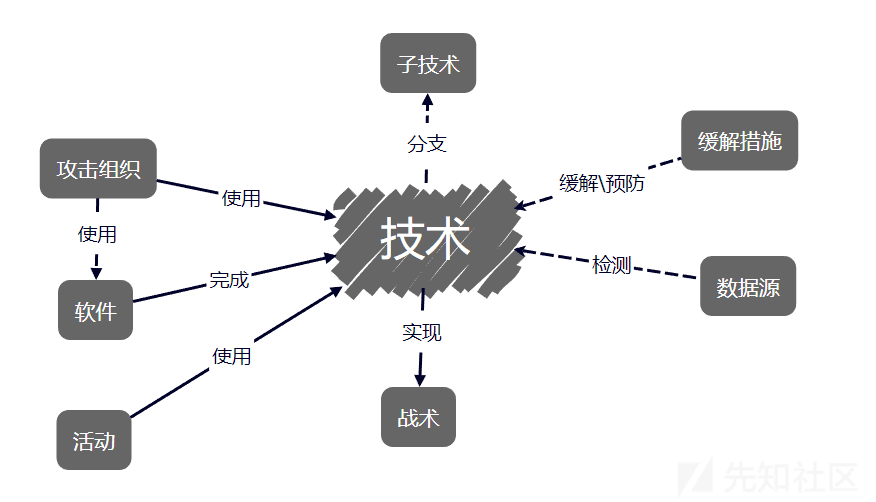
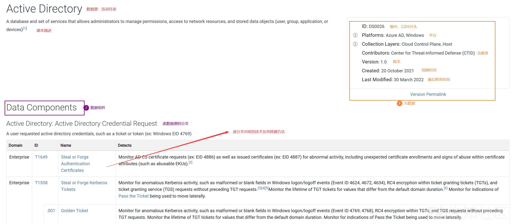
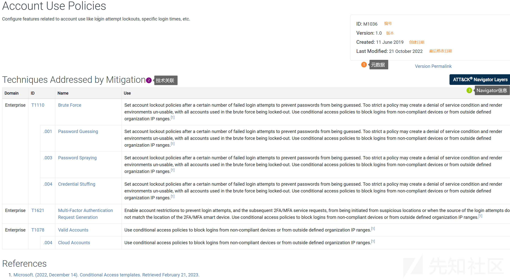
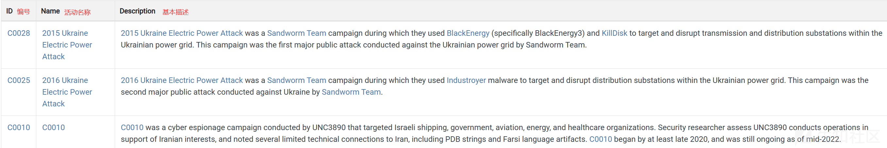
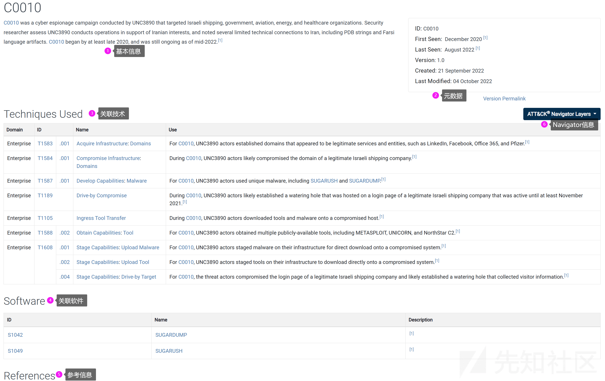

# 一文说清楚MITRE ATT&CK威胁框架 - 先知社区

> **写在最前面**：如题所见，本文旨在介绍MITRE ATT&CK威胁框架的基础知识，
> 
> **写在目的有二**：
> 
> -   其一、自身学习，ATT&CK框架的内容很多，希望通过本文整理出系统的知识结构，便于后续学习。
> -   其二、知识分享，希望这篇文章可以帮助刚开始接触ATT&CK框架的朋友更加快速、简单的入门。
> 
> **阅读建议**：ATT&CK框架的**内容很多**，包括`战术、技术、数据集、缓解措施、检测方法、关联APT组织和恶意软件`等众多组件，涵盖`企业与云服务端、移动设备端、工控设备端`等多个技术领域，涉及`威胁情报、检测分析、攻击模拟、评估改进`等多个应用领域，所以虽然本文题目叫做`一文搞清楚MITRE ATT&CK威胁框架`，但是想要仅仅通过本文就掌握该框架是不现实的。本文更多**起到入门引导作用**，笔者会尽力对该框架的基础知识进行详尽的介绍，至少保证读者在读完本文后对ATT&CK框架**有更加实际的理解**，而非停留在**镜花水月、空中楼阁**之境。同时笔者后续会更新一系列相关文章，具体**文章架构参见本文末尾**。

# ATT&CK框架介绍

## 顾名思义

**MITRE ATT&CK**，全称是`MITRE Adversarial Tactics Techniques and Common Knowledge`，即**入侵者战术、技术和共有知识库**，是以[骇客](https://zh.wikipedia.org/wiki/%E9%A7%AD%E5%AE%A2)的视角，针对[网络攻击](https://zh.wikipedia.org/wiki/%E7%B6%B2%E7%B5%A1%E6%94%BB%E6%93%8A)入侵进行分类和说明的指南，由非营利组织MITRE所创建。

**MITRE**：[https://www.mitre.org/](https://www.mitre.org/)

MITRE（The MITRE Corporation）是一家**非营利性的美国研究和技术组织**，成立于1958年，最初从麻省理工学院林肯实验室分离出来。该组织在众多关键领域为美国政府提供系统工程、研究开发和信息技术支持服务，尤其以网络安全、国防技术、航空系统、医疗保健、生物识别技术和公共政策分析等方面的研究与应用闻名。

-   在网络安全领域，MITRE创建并维护了`Common Vulnerabilities and Exposures (CVE) 编号系统`，这是一个国际标准，用于标识已知的安全漏洞和 exp。
-   MITRE还开发了`ATT&CK（Adversarial Tactics, Techniques & Common Knowledge）框架`，这是一种行业广泛采用的方法，用于描述对手在网络攻击中的战术、技术和过程（TTPs）

## 深入理解

`ATT&CK`是**基于真实世界观察的对抗技术知识库**。ATT&CK 专注于攻击者在操作过程中**如何与系统交互**，反映攻击者攻击生命周期的各个阶段以及不同平台使用的各种技术。

`ATT&CK`很大程度上是对抗性技术的知识库，对抗性技术是对可用于特定平台（如Windows）的攻击性操作的细分和分类。与该领域之前的工作不同，重点**不在于对手使用的工具和恶意软件**，而在于他们**在操作过程中如何与系统交互**。

`ATT&CK`是一个系统地对**对手行为进行分类的模型**。该模型的**主要组成部分是**：（后续会介绍完整的10个组件）

-   **[战术](https://attack.mitre.org/tactics/enterprise/)**，代表“为什么”或对手执行某项**行动的原因**。
    
    战术代表了 ATT&CK 技术的“原因”，是对手执行行动的**战术目标**。战术可作为单个技术的上下文类别，并涵盖对手在操作期间执行操作的标准，例如**持久化、横向移动、数据窃取等**。
    
-   **[技术](https://attack.mitre.org/techniques/enterprise/)**，代表对手**实现**战术目标的**方式**
    
    例如，攻击者可能会转储凭据，以获取对网络中有用凭据的访问权限，这些凭据稍后可用于横向移动。技术也可以表示对手通过执行操作获得的“什么”。实现战术目标的方法或技术可能有很多种，因此每个战术类别都有多种技术。
    
-   **子技术**，对对抗行为的**更具体或更低层次**的描述
    

`ATT&CK`由**一系列技术领域组**成，即对手在其中运作的生态系统。目前，有三个**技术**领域：

-   **[企业，](https://attack.mitre.org/matrices/enterprise/)**代表传统的企业IT网络和云服务
-   **[移动，](https://attack.mitre.org/matrices/mobile/)**移动端设备
-   用于工业控制系统的 **[ICS](https://attack.mitre.org/matrices/ics/)**

每个域中都有平台，可以是操作系统或应用程序（例如 Microsoft Windows）。技术和子技术可以应用于多个平台。

- - -

**该框架有四个常见的应用场景：**（只是简单介绍，后续系列会扩展实践）

-   **一是用于检测和分析**：帮助网络防御者分析攻击者行为，以**检测对手使用的技术**
    
    -   [示例1](https://medium.com/mitre-attack/getting-started-with-attack-detection-a8e49e4960d0)\-介绍了如何开始使用 ATT&CK 进行三种不同复杂程度的检测和分析。
        
    -   [示例2](https://www.mitre.org/publications/technical-papers/finding-cyber-threats-with-attck-based-analytics)\-介绍了一种使用 ATT&CK 构建、测试和改进基于行为的分析检测功能的方法。
        
    -   更多资源：[https://attack.mitre.org/resources/get-started/detections-and-analytics/](https://attack.mitre.org/resources/get-started/detections-and-analytics/)
        
-   **二是用于威胁情报**：为分析人员提供了一种通用的语言来**构建、比较、分析威胁情报**
    
    -   [示例1](https://medium.com/mitre-attack/getting-started-with-attack-cti-4eb205be4b2f)\-介绍了如何开始使用 ATT&CK 进行三种不同复杂程度的检测和分析。
-   **三是用于对手仿真和红队行动**：ATT&CK 提供了一种通用语言和框架，红队可以使用该语言和框架来**模拟特定威胁并规划其行动**。
    
    -   [示例1](https://medium.com/mitre-attack/getting-started-with-attack-red-29f074ccf7e3)\-这篇博文介绍了如何开始使用 ATT&CK 进行三个不同复杂程度的**对手仿真**。
        
    -   [示例2](https://www.x33fcon.com/slides/x33fcon19_ThreatbasedPurpleTeamming_JamieDaniel.pdf)\-介绍了如何使用 ATT&CK 获取网络威胁情报并将其实施为可驱动相关检测的行为。
        
-   **四是用于评估与工程决策**：ATT&CK 可用于**评估组织的能力并推动工程决策**，例如应该实施哪些工具或审计哪些日志记录。
    
    -   [示例1](https://medium.com/mitre-attack/getting-started-with-attack-assessment-cc0b01769cb4)\-介绍了如何开始使用 ATT&CK 进行三种不同复杂程度的评估和工程设计。
        
    -   [示例2](https://www.mitre.org/publications/technical-papers/finding-cyber-threats-with-attck-based-analytics)\-介绍一种使用 ATT&CK 构建、测试和改进基于行为的分析检测功能的方法。
        

# ATT&CK框架的构成

> 上文提到过ATT&CK各个字母的含义，即`战术、技术和常识`，这三者构成了整个ATT&CK知识库。为了更加精确的划分和更加深入的理解，将战术、技术和常识细分为了9个组件：`战术、技术、子技术、数据源、缓解措施、资产、攻击组织、软件、攻击活动`，这9个组件是**官网信息的主要构成部分**，也是**Navigator工具搜索控件的目标**。
> 
> 注：下面主要介绍各个组件在ATT&CK中的**描述方式和查看方法**，更加具体的内容会在后续系列更新，如各个战术技术的详细描述。

## 各个组件之间的关联

在ATT&CK框架中，上述9个组件是**通过技术关联**起来的，如下图所示：（资产组件专属于ICS领域）

下面具体介绍这几个组件

## 组件：战术、技术与子技术

战术、技术与子技术是ATT&CK框架的核心，具体概念参见上文`ATT&CK框架介绍`。下面主要介绍在ATT&CK框架中是**如何描述这些组件**的。

打开官网（[https://attack.mitre.org/），首页会\*\*给出一个矩阵\*\*（\`ATT&CK](https://attack.mitre.org/%EF%BC%89%EF%BC%8C%E9%A6%96%E9%A1%B5%E4%BC%9A**%E7%BB%99%E5%87%BA%E4%B8%80%E4%B8%AA%E7%9F%A9%E9%98%B5**%EF%BC%88%60ATT&CK) Matrix for Enterprise\`），如下图，这个矩阵便是战术、技术和子技术在ATT&CK框架中最直观的显示方式。

这个矩阵的**内容很容易理解**：

-   可以根据**不同的技术领域**选择不同的矩阵，如`Enterprise、Mobile、ICS`（首页给出的是Enterprise，因为该领域是应用范围最广、涉及知识最详细的）
-   可以在题目下方**选择布局**（`side`和`flat`，在Navigator中还有`Mini`）、选择是否**显示子技术**
-   矩阵的**第一行**是框架中的**14个战术**，可以点击链接到具体介绍
-   矩阵的**每一列**对应该战术包含的**技术和子技术**，同样的，可以点击链接到具体介绍

- - -

除了矩阵这一直观显示方式，也可以在**菜单栏选择**战术或者技术汇总，如下图：

以`Enterprise下的Tactics`为例，如下图，该页面是所有**战术信息的汇总界面**，可以查看不同领域下的战术信息，如`战术数量、战术编号、战术描述`等，也可以快速链接到某一具体的战术界面。

- - -

也可以通过菜单栏选择[所有的技术汇总](https://attack.mitre.org/techniques/enterprise/)，如下图，以`Enterprise下的Techniques`为例，该界面汇总了所有的技术信息，可以选择`不同的技术领域`、`不同战术下的不同技术`、`同一个技术下的不同子技术`，还可以看到当前版本下`某一个领域的技术和子技术数量`。

- - -

**总结如下：**

1.  **战术、技术和子技术是ATT&CK框架的核心内容**，战术是攻击者的目标、技术和子技术是这一目标的具体实现方法。
2.  ATT&CK给出了一个**威胁矩阵**，将战术、技术和子技术通过直观的方式汇总到一起。可以通过`Navigator`根据对该矩阵进行细致操作，具体参见后续`工具使用系列`。
3.  可以在**主页菜单栏**选择战术或技术汇总界面，以便查看更加详细的描述。

## 组件：数据源

下面要介绍的组件是**数据源**，即`Data Source`，可以在下图中查看菜单栏选择，ATT&CK将数据源归类到**防御一栏**。  

如下图，通过上菜单栏可以进入**数据源汇总界面**，在该界面可以查看数据源的整体信息，包括`数据源数量、数据源目录`等。

下面介绍**数据源的组成**，如下图，数据源包括`名称、基本描述、元数据和数据组件`，其中**元数据**是指该数据源的`编号、平台、贡献值、版本`等**本体信息**，**数据组件**是指该数据源**与具体技术的关联**。

下面介绍**数据源的作用**：用于某**技术的检测**，通过数据组件与技术进行关联。如下图，在`技术介绍界面`，关于检测方法一栏会引入数据源和数据组件。

## 组件：缓解措施

下面要介绍的组件是**缓解措施**，即`Mitigations`，可以在下图中查看菜单栏选择，ATT&CK将缓解措施归类到**防御一栏**。

如下图，通过上菜单栏可以进入**缓解措施汇总界面**，以`Enterprise`为例，在该界面可以查看Enterprise领域下包含的所有的缓解措施，一共有43个，以列表的形式列出。

某一具体**缓解措施由以下部分组成**：`基本描述、元数据、技术关联、Navigator信息、参考来源`，如下图。

-   `元数据`：该缓解措施`的编号、版本、日期`等。
-   `技术关联`：该缓解措施可以预防或者解决的**具体技术**
-   `Navigator信息`：将该缓解措施关联的技术在**矩阵中标注**
-   `参考`：该措施的**消息来源**

下面介绍**缓解措施的作用**：描述预防或者缓解某一技术的方法。如下图，在`技术介绍界面`，引入了Mitigations一栏，以**表述这一技术关联哪些缓解措施**。

## 组件：资产

下面要介绍的组件是**资产**，即`Assets`，可以在下图中查看菜单栏选择，ATT&CK将资产归类到**防御一栏**。

如下图，通过上菜单栏可以进入**资产汇总界面**，在该界面可以查看ATT&CK的所有资产信息，目前一共有14个，资产表示ICS环境中常见的设备和系统。（只有ICS领域有资产信息，Enterprise和Mobile没有）

**注**：要将资产和平台区分。**平台通常描述操作系统或应用程序**（即 Microsoft Windows），而**资产表示设备**，其中包括硬件、软件、体系结构和预期功能的考虑因素

某一具体**资产信息由以下部分组成**：`基本描述、元数据、技术关联、Navigator信息`，如下图。

-   `元数据`：该资产的`编号、版本、平台、日期`等。
-   `技术关联`：该资产对应的**具体技术**
-   `Navigator信息`：将该资产关联的技术在**矩阵中标注**

## 组件：攻击组织

下面要介绍的组件是**攻击组织**，即`Groups`，可以在下图中查看**菜单栏选择**，ATT&CK将攻击组织归类到**检测一栏**。

如下图，通过上菜单栏可以进入**攻击组织汇总界面**，在该界面可以查看ATT&CK下包含的所有的攻击组织，一共有143个，以列表的形式列出。在该界面可以查看每一个攻击组织的`编号（以G开头）、名称、关联组织、基本信息描述`等。

某一具体**攻击组织由以下部分组成**：`基本描述、元数据、技术使用、软件使用、Navigator信息、参考来源`，如下图。

-   `元数据`：该攻击组织的`编号、贡献者、版本、日期`等。
-   `技术使用`：该攻击组织在攻击过程中使用的各种技术
-   `软件使用`：该攻击组织在攻击过程中使用的各种软件
-   `Navigator信息`：将该攻击组织关联的技术在**矩阵中标注**

下面介绍**攻击组织的作用**：为了更加深入的理解ATT&CK的各种技术，给出了实际攻击组织的使用情况。如下图，在`技术介绍界面`，引入了**在野使用**一栏，以**表述哪些攻击组织使用了该技术**。

## 组件：软件

下面要介绍的组件是**软件**，即`Software`，可以在下图中查看**菜单栏选择**，ATT&CK将软件归类到**检测一栏**。

如下图，通过上菜单栏可以进入**软件汇总界面**，在该界面可以查看ATT&CK下包含的所有的软件信息，一共有760个，以列表的形式列出。在该界面可以查看每一个软件的`编号（以S开头）、名称、关联、基本信息描述`等。

软件是自定义代码、操作系统程序、开源软件、 或用于执行在 ATT&CK 中建模行为的其他工具。可以大体分为两类：

-   工具 - 商业、开源、内置或公开可用的软件，可供防御者、渗透测试人员、红队成员使用。此类别既包括通常在企业系统上不存在的软件，也包括操作系统的一部分提供的软件。例如包括 PsExec、Metasploit、Mimikatz 以及 Windows 实用程序（如 Net、netstat、Tasklist 等）。
-   恶意软件 - 被攻击者用于恶意目的的商业、自定义闭源或开源软件。例如 PlugX、CHOPSTICK 等。

某一具体**软件信息由以下部分组成**：`基本描述、元数据、关联技术、关联组织、Navigator信息、参考来源`，如下图。

-   `元数据`：该攻击组织的`编号、贡献者、版本、日期`等。
-   `技术使用`：该软件在攻击过程中**使用的各种技术**
-   `关联组织`：该**攻击组织**在攻击过程中使用的各种软件
-   `Navigator信息`：将该软件关联的技术在**矩阵中标注**

下面介绍**软件的作用**：为了更加深入的理解ATT&CK的各种技术，给出了实际攻击软件的**技术使用情况**。如下图，在`技术介绍界面`，引入了**在野使用**一栏，以**表述哪些攻击软件使用了该技术**。

## 组件：攻击活动

下面要介绍的组件是**攻击活动**，即`Campaigns`，可以在下图中查看**菜单栏选择**，ATT&CK将攻击活动归类到**检测一栏**。

如下图，通过上菜单栏可以进入**攻击活动汇总界面**，在该界面可以查看ATT&CK下包含的所有的活动信息，一共有24个，以列表的形式列出。在该界面可以查看每一个活动的`编号（以C开头）、名称、基本信息描述`等。

攻击活动这一组件是在2022年10月的v11版本引入的，指代**在某一个特定时期内完成的一系列具有共同目标**的攻击活动，如2015年发生的乌克兰电力攻击活动。

某一具体**活动攻击由以下部分组成**：`基本描述、元数据、关联技术、关联组织、Navigator信息、参考来源`，如下图。

-   `元数据`：该活动的`开始和结束日期、版本、创建和修改日期`等。
-   `技术使用`：该活动在攻击过程中**使用的各种技术**
-   `关联软件`：该活动中使用的**各种软件**
-   `Navigator信息`：将该活动关联的技术在**矩阵中标注**

下面介绍**活动的作用**：为了更加深入的理解ATT&CK的各种技术，给出了实际活动中的**技术使用情况**。如下图，在`技术介绍界面`，引入了**在野使用**一栏，以**表述哪些攻击活动使用了该技术**。

# 各战术宏观介绍

> ATT&CK的内容很多，但是其**核心内容一定是战术与技术**，因为篇幅有限，下面会从**宏观角度**对这些战术和技术进行介绍。在之后的文章中，会有专门一个系列`ATT&CK威胁框架-战术、技术详解`，该系列会详细介绍最新版本（v14）下的各个战术、技术、子技术信息。

## 战术梳理

**战术梳理：**截止到`2024-3，v14版本、Enterprise领域下`的战术整合如下

| 战术编号 | 战术名称（英） | 战术名称（译） | 技术数量（不含子技术） |
| --- | --- | --- | --- |
| TA0043 | Reconnaissance | 侦察  | 10  |
| TA0042 | Resource Development | 资源开发 | 8   |
| TA0001 | Initial Access | 初始访问 | 10  |
| TA0002 | Execution | 攻击执行 | 14  |
| TA0003 | Persistence | 持久化 | 20  |
| TA0004 | Privilege Escalation | 权限提升 | 14  |
| TA0005 | Defense Evasion | 防御规避 | 43  |
| TA0006 | Credential Access | 凭证访问 | 17  |
| TA0007 | Discovery | 环境发现 | 32  |
| TA0008 | Lateral Movement | 横向移动 | 9   |
| TA0009 | Collection | 信息收集 | 17  |
| TA0011 | Command and Control | 指令与控制 | 17  |
| TA0010 | Exfiltration | 数据窃取 | 9   |
| TA0040 | Impact | 危害影响 | 14  |

下面具体介绍这些战术的相关信息，不会很详细，旨在**从宏观上了解、构建一个简略的攻击模型**，为后续深入学习做铺垫。

## 战术：侦察

> **名称**：`Reconnaissance`
> 
> **译**：`侦察/信息搜集`
> 
> **ATT&CK编号**：`TA0043`
> 
> **技术数量**：`10`
> 
> **子技术数量**：`34`
> 
> **版本**：`v14`
> 
> **战术关键词**：\`攻击前阶段

**具体介绍：**

不论是APT组织进行攻击，还是红队进行安全演练、渗透测试，都会在正式攻击之前**收集相关的有用信息**，以规划后续具体行动。这些信息可能包括受害**组织、设备、受害人的基本信息**，例如`组织网络架构、员工身份信息`等；采取的**技术措施也很多**，如`钓鱼攻击`、`公开数据库搜索`（如WHOIS、CDNs等）、`公开网站搜索`（如搜索引擎、社交媒体等）等等。

需要注意的是，`侦察`这个攻击前战术是**很难缓解和防御**的，因为相关的技术与正常行为很类似，而且也超出了企业的防御和控制范围。为了保证框架结构的完整性，ATT&CK专门创建了一个名为`Pre-compromise`的缓解措施，如下：

> **方法**：`Pre-compromise`
> 
> **编号**：`M1056`
> 
> **可缓解技术**：攻击者获得初始访问权限之前发生的技术，如侦`察和资源开发阶段`
> 
> **官方链接**：[https://attack.mitre.org/mitigations/M1056/](https://attack.mitre.org/mitigations/M1056/)

**问**：既然相关技术的缓解与检测方法很少，为什么还要介绍这些技术呢？

**答**：因为通过学习侦察战术下的相关技术，可以更加清晰的知晓攻击者需要搜集哪些信息、通过哪些途径搜集，进而可以**帮助企业自检，减少暴露面**。

**注**：关于该战术的具体情况和各个技术的实现原理、缓解措施、实践等由于篇幅原因不在此处赘述，可以参见后续系列`ATT&CK威胁框架各战术、技术详解一-侦察战术`

## 战术：资源开发

> **名称**：`Resource Development`
> 
> **译**：`资源开发\武器库配置`
> 
> **ATT&CK编号**：`TA0042`
> 
> **技术数量**：`8`
> 
> **子技术数量**：`37`
> 
> **版本**：`v14`
> 
> **战术关键词**：`攻击前阶段`

**具体介绍：**

**资源开发**是指攻击者在开展具体攻击前会开发一些**后续使用的相关资源**，开发方式包括`创建、购买、窃取`等，开发的资源具体包括**基础设施**（`域、DNS服务器、Web服务、VPS`等）、**账户**（`社交媒体、电子邮件、云账户`等）、**能力**（`恶意软件、数字证书、exp`等）。

攻击者在开发完相应资源后，会在**后续攻击阶段**使用，如在初始访问阶段（`TA0001`）中利用有效账户（T1078），在防御隐藏阶段（`TA0005`）利用数字签名等。

与侦察战术类似，资源开发战术也**很难缓解和检测**，在具体技术描述中，一般会引入`Pre-compromise`缓解措施，如下：

> **方法**：`Pre-compromise`
> 
> **编号**：`M1056`
> 
> **可缓解技术**：攻击者获得初始访问权限之前发生的技术，如`侦察和资源开发阶段`
> 
> **官方链接**：[https://attack.mitre.org/mitigations/M1056/](https://attack.mitre.org/mitigations/M1056/)

**注**：关于该战术的具体情况和各个技术的实现原理、缓解措施、实践等由于篇幅原因不在此处赘述，可以参见后续系列`ATT&CK威胁框架各战术、技术详解二-资源开发战术`

## 战术：初始访问

> **名称**：`Initial Access`
> 
> **译**：`初始访问`
> 
> **ATT&CK编号**：`TA0001`
> 
> **技术数量**：`10`
> 
> **子技术数量**：`11`
> 
> **版本**：`v14`
> 
> **战术关键词**：`攻击阶段的第一个战术`

**具体介绍：**

之前两个战术（`侦察与资源开发`）属于**攻击前阶段**，用于为后续攻击**提供信息和资源**；而**攻击阶段**便会介绍具体攻击时涉及的战术和使用的技术。攻击阶段的**第一个战术**是`初始访问`。

初始访问是指**攻击者在目标网络环境中建立立足点**，攻击者会借助攻击前阶段收集的信息，利用不同的技术来实现初始访问。常用的攻击技术报价鱼叉式钓鱼`T1566`或者针对Web服务漏洞`T1190`等。

与侦察和资源开发战术不同，初始访问涵盖的技术是**典型的攻击行为**，所以有很多对应的**缓解措施和检测方法**。比如，针对**水坑攻击**，可以采取`软件更新（M1051）`、`应用沙盒隔离（M1048）`等方法来**缓解**，采取`网络流量监测（DS0029）`、`应用日志审计（DS0015）`等方法来**检测**。

**注：**关于该战术的具体情况和各个技术的实现原理、缓解措施、实践等由于篇幅原因不在此处赘述，可以参见后续系列`ATT&CK威胁框架各战术、技术详解三-初始访问战术`

## 战术：攻击执行

> **名称**：`Execution`
> 
> **译**：`攻击执行`
> 
> **ATT&CK编号**：`TA0002`
> 
> **技术数量**：`14`
> 
> **子技术数量**：`22`
> 
> **版本**：`v14`
> 
> **战术关键词**：`应用范围最广泛的战术`

**具体介绍：**

攻击执行战术是指攻击者**尝试运行恶意代码**，包括在本地或者远程执行恶意代码的技术。这些技术大体可以分为实体恶意软件执行和无落地文件执行（如命令行、powershell等）。

该战术中的技术通常与**其他战术联动**实现更加广泛的目标（信息窃取、环境探测等），例如通过**初始访问战术**中的`利用远程外部服务T1133`来执行`Powershell脚本T1059.001`。

攻击执行战术中采取的技术有很多对应的缓解措施和检测方法。例如，针对`利用命令和脚本解释器T1059`技术，可以采取`安装防病毒软件M1049`、`检测签名（M1045）`、`禁用或删除某些功能T1042`等方法**缓解和预防**，可以采取`监视执行的命令和参数DS0017`、`监视有关正在运行进程的上下文数据DS0009`等方法检测攻击行为。

**注**：关于该战术的具体情况和各个技术的实现原理、缓解措施、实践等由于篇幅原因不在此处赘述，可以参见后续系列`ATT&CK威胁框架各战术、技术详解四-攻击执行战术`

## 战术：持久化

> **名称**：`Persistence`
> 
> **译**：`持久化`
> 
> **ATT&CK编号**：`TA0003`
> 
> **技术数量**：`20`
> 
> **子技术数量**：`95`
> 
> **版本**：`v14`
> 
> **战术关键词**：`防守方最应该重视的战术`

**具体介绍：**

初始访问战术在目标网络环境中建立了立足点，**持久化战术**便是为了**长久保持这些立足点**，即受害者即使重启、修改凭证仍然可以保证攻击者对系统的持续访问。

常用的技术包括`利用计划任务T1542`、`修改身份认证T1556`、`劫持进程T1574`（DLL劫持、利用环境变量等）、`创建或修改系统进程T1543`(利用系统服务、守护进程等)等等。

持久化战术是所有战术中子技术第二多的战术，也就是说可以完成持久化操作的方法非常多，所以持久化应该是最应该被重视的战术。

针对持久化操作的相关技术，ATT&CK提供了很多**缓解措施和检测方法**，因为篇幅限制，很难一一介绍，在后续**持久化战术专栏**会详细说明，细化到每一个子技术。

**注**：关于该战术的具体情况和各个技术的实现原理、缓解措施、实践等由于篇幅原因不在此处赘述，可以参见后续系列`ATT&CK威胁框架各战术、技术详解五-持久化战术`

## 战术：提权

> **名称**：`Privilege Escalation`
> 
> **译**：`提权/权限提升`
> 
> **ATT&CK编号**：`TA0004`
> 
> **技术数量**：`14`
> 
> **子技术数量**：`80`
> 
> **版本**：`v14`
> 
> **战术关键词**：`攻击者最喜爱的战术之一`

**具体介绍**：

该战术是指攻击者**正试图获取更高权限**。

权限提升战术是指攻击者用来在系统或网络中获得更高权限的一系列技术。对手通常能够以**非特权身份进入**并探索网络，但为了实现其目标，他们需要获得更高的权限。常见的技术包括：`利用漏洞提权T1068、容器逃逸T1611、进程注入T1055、操纵访问令牌T1134`等。

相关权限包括：

1.  系统级（SYSTEM）或根级（root）权限
2.  本地管理员权限
3.  拥有类似管理员权限的用户账户
4.  具有访问特定系统或执行特定功能权限的用户账户

这些权限提升技术往往与**持久化技术相互重叠**，因为操作系统中的某些能让对手保持持久存在的功能可以以提权的方式执行。

**注**：关于该战术的具体情况和各个技术的实现原理、缓解措施、实践等由于篇幅原因不在此处赘述，可以参见后续系列`ATT&CK威胁框架各战术、技术详解六-提权战术`

## 战术：防御规避

> **名称**：`Privilege Escalation`
> 
> **译**：`防御规避`
> 
> **ATT&CK编号**：`TA0005`
> 
> **技术数量**：`42`
> 
> **子技术数量**：`148`
> 
> **版本**：`v14`
> 
> **战术关键词**：`技术和子技术最多的战术`

**基本介绍：**

该战术是指攻击者**正试图避免被检测到**。

防御规避战术包含了对手在入侵过程中所采用的各类逃避检测技术。这些技术包括`卸载/禁用安全软件`，或者`对数据和脚本进行混淆/加密处理`。此外，对手还会`利用受信任的进程`来隐藏和伪装其恶意软件。当其他战术中的技术同时具有绕过防御机制的附加优势时，也会在此处交叉列出。

**注**：关于该战术的具体情况和各个技术的实现原理、缓解措施、实践等由于篇幅原因不在此处赘述，可以参见后续系列`ATT&CK威胁框架各战术、技术详解七-防御规避战术`。

## 战术：凭证访问

> **名称**：`Credential Access`
> 
> **译**：`凭证访问`
> 
> **ATT&CK编号**：`TA0006`
> 
> **技术数量**：`17`
> 
> **子技术数量**：`47`
> 
> **版本**：`v14`
> 
> **战术关键词**：`信息窃取中攻击者最想要的`

**基本介绍：**

该战术是指攻击者**正试图窃取账号、密码等凭证信息**。

该战术包括一系列用于窃取如账号名和密码等凭证的技术。获取凭证的方法包括`键盘记录（keylogging）或凭证转储（credential dumping）`。通过合法的凭证，对手可以获得对系统的访问权限，并有机会创建更多账户来帮助实现他们的目标。

**注**：关于该战术的具体情况和各个技术的实现原理、缓解措施、实践等由于篇幅原因不在此处赘述，可以参见后续系列`ATT&CK威胁框架各战术、技术详解八-凭证访问战术`。

## 战术：环境发现

> **名称**：`Discovery`
> 
> **译**：`（环境）发现`
> 
> **ATT&CK编号**：`TA0007`
> 
> **技术数量**：`32`
> 
> **子技术数量**：`14`
> 
> **版本**：`v14`
> 
> **战术关键词**：`攻击阶段的侦察战术`

**基本介绍：**

该战术是指攻击者**正试图了解目标系统的网络环境**。

攻击者可能采取各种技术以**获取有关系统和内部网络的知识**。这些技术帮助攻击者在进行后续攻击之前**对环境进行观察和自我定位**。

攻击者可能侦察的目标有`浏览器书签T1217、云服务相关信息、注册表信息T1012、进程信息T1057、软件信息T1518、地理位置信息T1614、系统网络配置信息T1016、系统服务信息T1007、系统时间信息T1124`等等。

**注**：关于该战术的具体情况和各个技术的实现原理、缓解措施、实践等由于篇幅原因不在此处赘述，可以参见后续系列`ATT&CK威胁框架各战术、技术详解九-环境发现战术`。

## 战术：横向移动

> **名称**：`Lateral Movement`
> 
> **译**：`横向移动`
> 
> **ATT&CK编号**：`TA0008`
> 
> **技术数量**：`9`
> 
> **子技术数量**：`14`
> 
> **版本**：`v14`
> 
> **战术关键词**：`关键目标寻找与扩散`

**基本介绍：**

该战术是指对手**试图在目标网络环境中移动渗透**。

横向移动是指对手在网络中使用各种技术以进入并控制远程系统。为了实现主要目标，对手通常需要探索网络**找到目标**，并随后获取对目标的**访问权限**。达成目标的过程中，往往涉及通过多个系统和账户进行**跳跃式渗透**。

在横向移动的过程中，攻击者可能会利用`远程服务漏洞T1210`、`使用内部钓鱼攻击T1534`、`劫持远程服务会话T1563`等技术。

**注**：关于该战术的具体情况和各个技术的实现原理、缓解措施、实践等由于篇幅原因不在此处赘述，可以参见后续系列`ATT&CK威胁框架各战术、技术详解十-横向移动战术`。

## 战术：信息收集

> **名称**：`Collection`
> 
> **译**：`信息搜集`
> 
> **ATT&CK编号**：`TA0009`
> 
> **技术数量**：`17`
> 
> **子技术数量**：`20`
> 
> **版本**：`v14`
> 
> **战术关键词**：`系统内部的信息搜集`

**基本介绍：**

该战术是指攻击者正**试图收集与其目标相关的、感兴趣的数据**。

信息收集战术包括对手可能会采用的各种技术，以便从与目标相关的各种数据源中获取信息。通常情况下，在收集到数据之后的下一步便是窃取（外泄）这些数据，参见`战术数据窃取TA0010`。常见的数据来源包括`各类驱动器、浏览器、音频、视频和电子邮件`等。常用的数据收集方法包括`截屏和键盘输入记录`。

**注**：关于该战术的具体情况和各个技术的实现原理、缓解措施、实践等由于篇幅原因不在此处赘述，可以参见后续系列`ATT&CK威胁框架各战术、技术详解十一-信息搜集战术`。

## 战术：命令与控制

> **名称**：`Command and Control`
> 
> **译**：`命令与控制`
> 
> **ATT&CK编号**：`TA0011`
> 
> **技术数量**：`17`
> 
> **子技术数量**：`23`
> 
> **版本**：`v14`
> 
> **战术关键词**：`远控与命令执行`

**基本介绍：**

该战术是指对手正试图**与受控系统进行通信以操控它们**。

命令与控制战术包括对手可能会使用的各种技术，以便在受害者的网络内部与其控制下的系统进行通信。为了规避检测，对手通常会**尝试模仿正常、预期的网络流量**。根据受害者网络结构和防御机制的不同，攻击者有多种方式可以建立具有不同程度隐匿性的命令与控制通道。

该战术常见的技术包括`使用应用层协议T1071、通过可移动介质通信T1092、使用备用信道T1008、利用远程访问软件T1219等`，在通信过程中也会`编码数据T1132、混淆数据T1001、使用动态参数T1568、使用加密信道T1573`以保证通信的隐蔽性。

**注**：关于该战术的具体情况和各个技术的实现原理、缓解措施、实践等由于篇幅原因不在此处赘述，可以参见后续系列`ATT&CK威胁框架各战术、技术详解十二-命令与控制战术`。

## 战术：数据窃取

> **名称**：`Exfiltration`
> 
> **译**：`（数据）窃取`
> 
> **ATT&CK编号**：`TA0010`
> 
> **技术数量**：`9`
> 
> **子技术数量**：`10`
> 
> **版本**：`v14`
> 
> **战术关键词**：`数据收集与回传`

**基本介绍：**

该战术是指**攻击者在试图窃取数据**。一旦收集到数据，对手通常会对其进行**打包处理**以避免在传递过程中被检测到，这可能涉及压缩和加密等操作。将数据从目标网络中取出的常用技术包括`使用C2信道回传T1041、使用物理介质回传T1052、使用Web服务回传T1567、使用云账户T1537`等，可能会限制传递的数据大小。

**注**：关于该战术的具体情况和各个技术的实现原理、缓解措施、实践等由于篇幅原因不在此处赘述，可以参见后续系列`ATT&CK威胁框架各战术、技术详解十三-数据窃取战术`。

## 战术：危害影响

> **名称**：`Impact`
> 
> **译**：`危害影响`
> 
> **ATT&CK编号**：`TA0040`
> 
> **技术数量**：`14`
> 
> **子技术数量**：`13`
> 
> **版本**：`v14`
> 
> **战术关键词**：`框架的最后一个战术`

**基本介绍：**

**危害影响战术**是指攻击者**试图操控、中断或破坏目标的系统和数据**。

该战术包含一系列技术，这些技术被攻击者利用以通过**操纵业务和运营流程**来干扰系统的可用性或破坏信息的完整性。实现该战术的技术包括`删除账户权限T1531`、`破坏数据T1485、数据加密T1486、操纵数据T1565、篡改内容T1491、擦除磁盘T1561、损坏固件T1495`等。具体详见后续系列。

在某些情况下，虽然业务流程表面上看似正常运行，但实际上可能已被对手为了达成自身目标而进行了篡改。

# 总结与预告

## 本文总结

本篇文章从`框架基本信息`、`框架组件构成`、`框架战术简述`三个方面介绍了ATT&CK框架的基本知识，由于篇幅限制，很多细致具体的内容就放到后续系列了。

笔者个人认为本篇文章的内容是足够完善的，读者通过这篇文章应该可以对ATT&CK框架有一个大体的把握，也能更容易的结合自身研究方向去探索ATT&CK的应用。

## 后续该系列架构

> 本文是ATT&CK系列的第一篇文章，主要介绍该框架的一些基础内容，为刚了解该框架的朋友解决一些困惑。因为篇幅有限，不可能涵盖所有内容，所以后续会继续更新该系列，感兴趣的朋友可以收藏下，以备后续食用。

下面说下目前定下的该系列框架，主要分为三类：知识理解类、工具使用类、应用实践类。

**知识理解类**：该类别会系统整理ATT&CK框架中的**所有战术、技术、子技术**，以十四个战术为主干，向外延申各个技术的`原理、使用方法、缓解措施、检测方法`等。

**工具使用类**：ATT&CK框架不仅是一个知识库，还包括很多**开源的工具和项目**，比如用于可视化操作的`Navigator工具`、用于威胁检测分析的`CAR项目`等，该类别便会具体介绍这些**工具和项目的使用**。

**应用实践类**：ATT&CK框架的应用场景有很多，比如前面提到的`威胁情报、攻击模拟、检测分析`等，该类别便会介绍**如果将ATT&CK框架应用到具体的安全实践**中。因为笔者的研究方向和兴趣爱好，这部分内容会更多偏向于`威胁检测`和`恶意代码分析`。