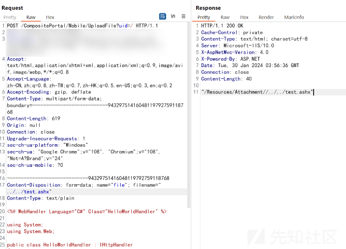
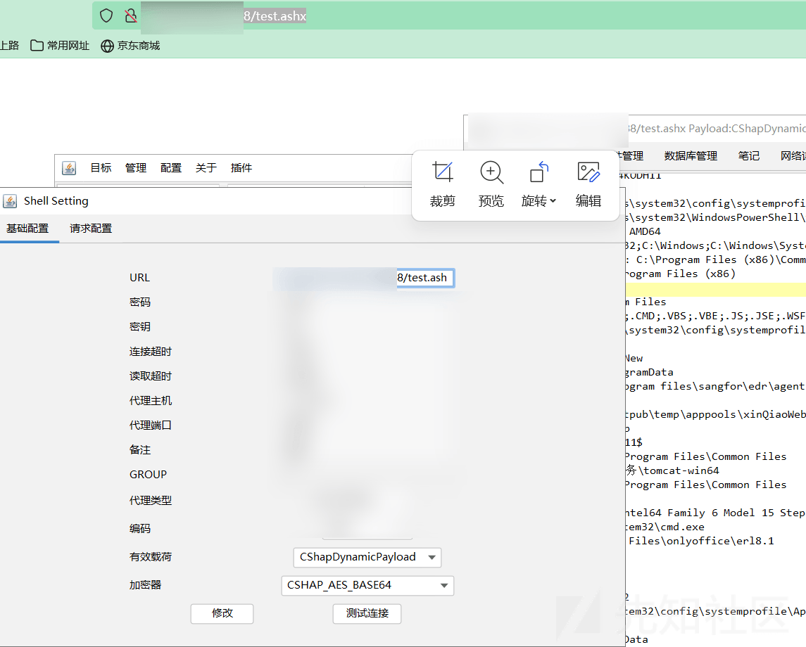
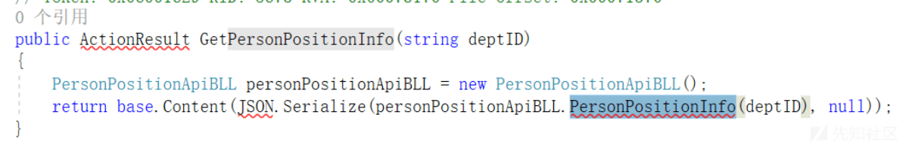
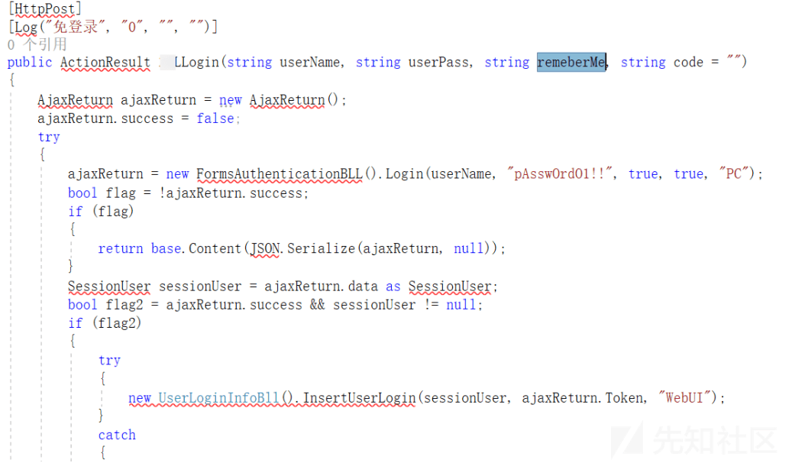

# 一次多版本.net系统代码审计 - 先知社区

# 前言

做项目喜闻乐见的获取了bin.rar，当时快速过了config交了数据库权限，然后看代码发现mobileController下方法未授权，交了一些信息泄露，大部分是人员手机相关。项目结束后想交cnvd，写了个nuclei跑了一下结果没几个，当时大为不解，但是感谢他们部署系统的好习惯，顺手测了另两个站的bin.rar，嘿嘿。dnspy导出到vs里，记录一下发现的漏洞。

> 最后发现最开始漏洞少的原因：1.系统版本不同，第一个源码应该是较老的版本，后面系统重构。2.供应商对每个企业多多少少做了功能的个性化开发，导致出现某个企业特有的漏洞。

# 漏洞

## 未授权

别问我什么rce、sql、反序列化，问就是未授权

老版本mobileController下未授权，可利用接口很多，不一一列举，但是大部分需要别的参数。不过有数据能交就行。  

## 文件上传

搜索saveas  
**老版本下两个**

-   一个直接的图片上传getshell
-   一个参数全部可控  
      
    附件目录下不能解析，穿一下目录，传到根目录

**中版本无**  
中版本开始权限使用AllowAnonymous  
ImgFile默认没开  

**新版本**  
嘿，您猜怎么着，其他洞全都没了。但是系统贴心的加了一个功能

## 注入

老版本  

其他

顺便看了一下反序列化，莫得

## 任意用户登录

某企业定制化漏洞

给个名字，还你个cookie，很棒