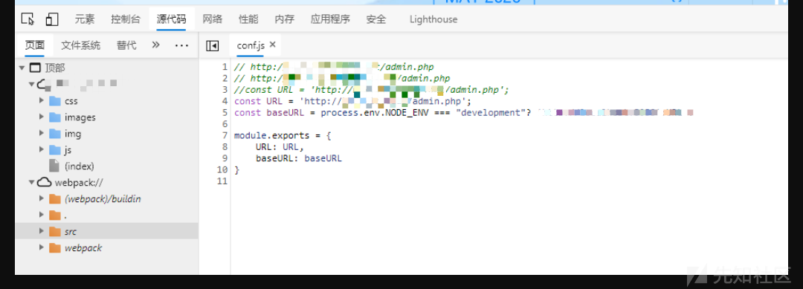
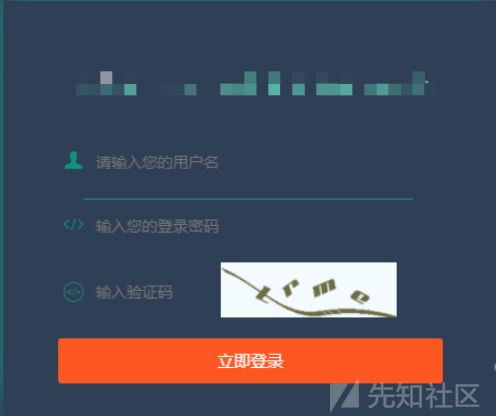
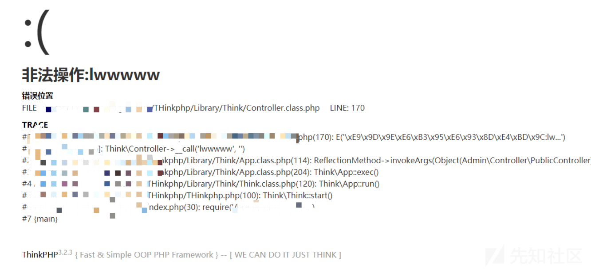
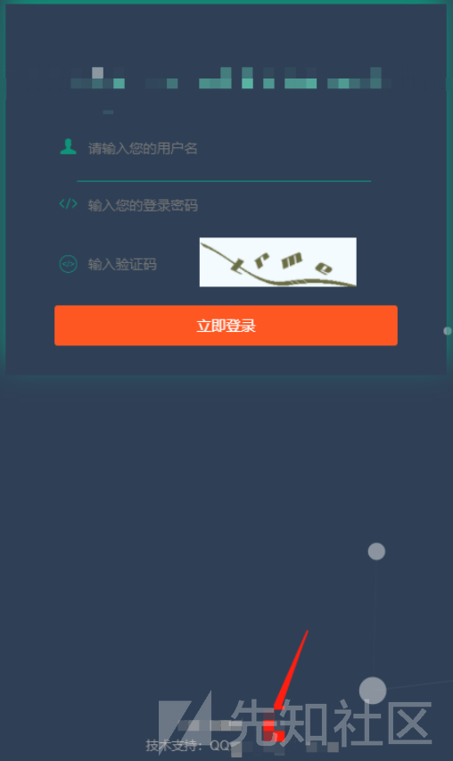
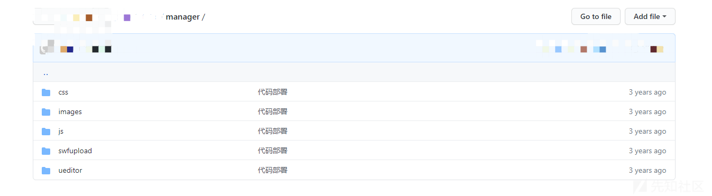
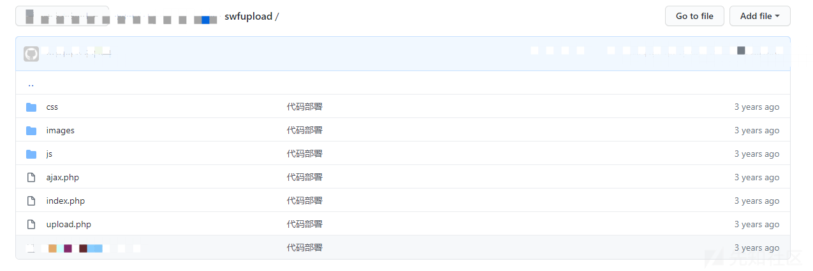
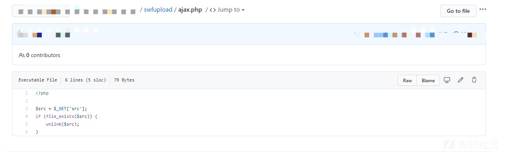
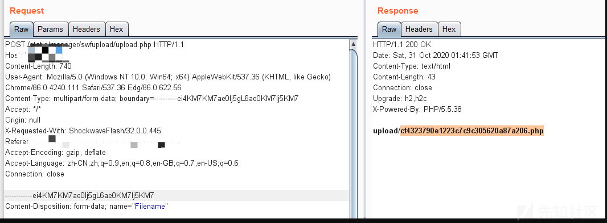

# 从 webpack 开始发现的漏洞大礼包 - 先知社区

## 前言

**信息收集贯穿渗透测试的全过程**

## webpack 发现后台地址

日常 SRC 发现一个比较偏僻的域名，很有可能存在漏洞。git 搜域名没找到源码。顺手翻了下 js，发现 webpack 打包的源码，然后赶紧去搜了搜这个怎么利用，发现主要是用来找里面的接口，尝试未授权的思路。这个站点的 webpack 没有发现什么能未授权的接口，但是发现了 config.js 文件。这个肯定得进去看看，里面发现了 3 个地址，都是后台应该有两个是测试阶段的站点，另一个是生产环境。

## 后台常规的信息收集和初步测试

常规登录框测试手段，简单测口令，然后验证码能不能绕过开始爆破，扫目录什么的。

thinkphp3.2.3 然后就是已知漏洞测试，再加上有位师傅提过的日志泄露，都测试了一遍，无果

## github 泄露源码

过了好几天想起来这个站点，不甘心在后台晃悠，想起来有位师傅提起过，可以把页面上的东西都扔到 github 搜一下，前面已经在 github 上搜过域名了不好使。然后看到后台底下有个技术支持 qq 号码

反正没有入手点，就把 qq 号码扔到 github 上面搜索发现源码。

这里发现了两个入手点，一个是 ueditor, 一个是 swfupload。ueditor php 版本已知的应该是 1.4.3 ssrf 漏洞，但是是云服务器，危害不大，重心放在 swfupload 上面

进去 swfupload 文件夹里面结构是下面这样子的。

## 任意文件删除

第一个就看到任意文件删除

## 任意文件上传

upload.php 太长了，最快的方法就是码云直接找个 swfupload 的源码，扔 phpstudy，直接上传 php，抓包复制过来，然后重新上传。

访问代码执行成功。
