# 从历史漏洞学习漏洞挖掘 - 先知社区

本篇文章会从复现 mrdoc 任意文件读取漏洞为入口，记录一下怎么用类似的思路去寻找其他的漏洞。

<<<<<<< HEAD
## 影响版本:

commit 提交记录是 2 月一号，但是最近一次 release 版本时 2 个月前 v0.9.2, 大概 v0.9.2 以下的版本都存在漏洞.
=======
## 影响版本：

commit 提交记录是 2 月一号，但是最近一次 release 版本时 2 个月前 v0.9.2, 大概 v0.9.2 以下的版本都存在漏洞。
>>>>>>> 4992f5f682bf7aa8873ceb2495ac1d2a8296850f

## Commit 记录：

[https://gitee.com/zmister/MrDoc/commit/b634cf84eedb669fc1f11ce87558b0b045301af1](https://gitee.com/zmister/MrDoc/commit/b634cf84eedb669fc1f11ce87558b0b045301af1)  
<<<<<<< HEAD
[](https://xzfile.aliyuncs.com/media/upload/picture/20240313131659-eae119c8-e0f8-1.png)

## 漏洞分析:

通过 commit 记录可以看到是对变量 `media_filename` 进行了处理，那么感觉问题就出现在 `media_filename` 这个变量，我们下载下项目，切换到修复前的版本：

```plain
=======
[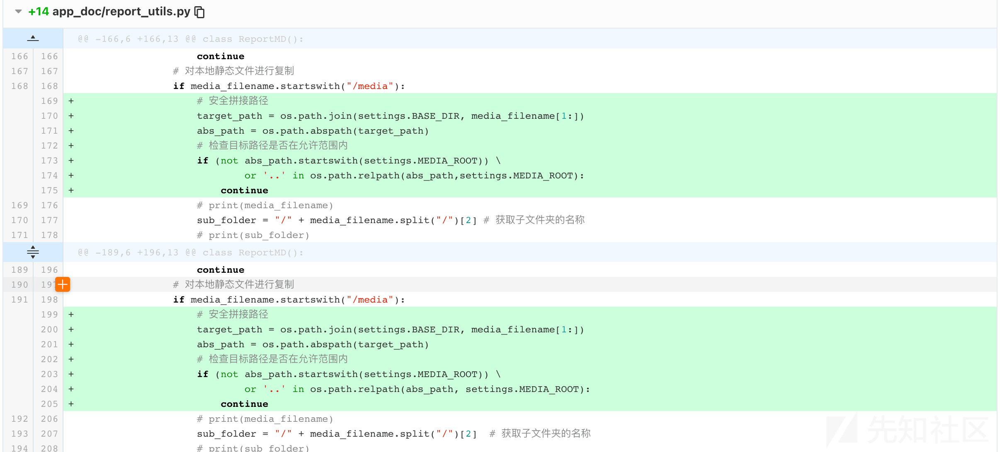](https://xzfile.aliyuncs.com/media/upload/picture/20240313131659-eae119c8-e0f8-1.png)

## 漏洞分析：

通过 commit 记录可以看到是对变量 `media_filename` 进行了处理，那么感觉问题就出现在 `media_filename` 这个变量，我们下载下项目，切换到修复前的版本：

```bash
>>>>>>> 4992f5f682bf7aa8873ceb2495ac1d2a8296850f
git clone https://gitee.com/zmister/MrDoc.git
git checkout d1ce
```

定位一下漏洞位置 `app_doc/report_utils.py#152`：  
<<<<<<< HEAD
[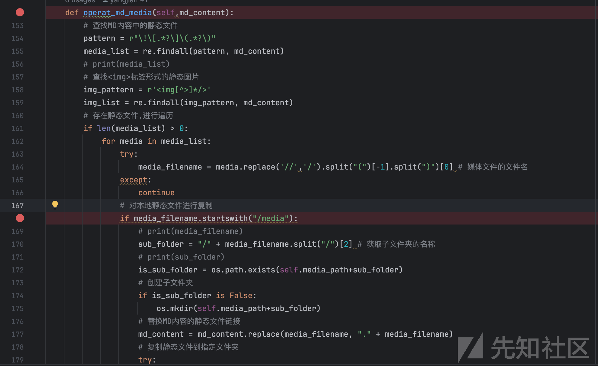](https://xzfile.aliyuncs.com/media/upload/picture/20240313131815-18699096-e0f9-1.png)  
这段代码就是从 markdown 文件中去查找静态资源，然后对查找到的每个静态资源进行路径处理，最后移动到一个文件中进行下载。  
先来看第一个正则表达式：`pattern = r"\!\[.*?\]\(.*?\)"`，他是用来匹配

```plain
=======
[](https://xzfile.aliyuncs.com/media/upload/picture/20240313131815-18699096-e0f9-1.png)  
这段代码就是从 markdown 文件中去查找静态资源，然后对查找到的每个静态资源进行路径处理，最后移动到一个文件中进行下载。  
先来看第一个正则表达式：`pattern = r"\!\[.*?\]\(.*?\)"`，他是用来匹配

```bash
>>>>>>> 4992f5f682bf7aa8873ceb2495ac1d2a8296850f

```

格式的字符串，当然如果你对正则不熟悉，直接去问 AI 也行：  
<<<<<<< HEAD
[](https://xzfile.aliyuncs.com/media/upload/picture/20240313131858-323f567c-e0f9-1.png)  
接着会从匹配到的每个字符串中取出括号 () 中的内容，并进行资源目录查找，其中要求了加载资源地址需要是以 `/media` 开头，到这里基本上都能猜到 payload 的形式了，无非就是 `/media/../../../xxx` ,  
先吧这个函数取出来测试一下，其中 `self.media_path` 等一些路径变量我就先随便模拟了：

```plain
=======
[](https://xzfile.aliyuncs.com/media/upload/picture/20240313131858-323f567c-e0f9-1.png)  
接着会从匹配到的每个字符串中取出括号 () 中的内容，并进行资源目录查找，其中要求了加载资源地址需要是以 `/media` 开头，到这里基本上都能猜到 payload 的形式了，无非就是 `/media/../../../xxx` ,  
先吧这个函数取出来测试一下，其中 `self.media_path` 等一些路径变量我就先随便模拟了：

```bash
>>>>>>> 4992f5f682bf7aa8873ceb2495ac1d2a8296850f
import re
import os
import pathlib
from urllib.parse import unquote

md_content = '''

'''
pattern = r"\!\[.*?\]\(.*?\)"
media_list = re.findall(pattern, md_content)
print(media_list)
for media in media_list:
    try:
        media_filename = media.replace('//', '/').split("(")[-1].split(")")[0]  # 媒体文件的文件名
        print(media_filename)
    except:
        continue
        # 对本地静态文件进行复制
    if media_filename.startswith("/media"):
        # print(media_filename)
        sub_folder = "/" + media_filename.split("/")[2]  # 获取子文件夹的名称
        # print(sub_folder)
        print("sub_folder is", sub_folder)
        is_sub_folder = os.path.exists("/Users/xxx/language/python_floder/MrDoc/media/reportmd_temp"
                                       + sub_folder)
        # 替换MD内容的静态文件链接
        md_content = md_content.replace(media_filename, "." + media_filename)
        # 复制静态文件到指定文件夹
        new_file_path = pathlib.Path("/Users/xxx/language/python_floder/", unquote(media_filename)[1:])
        print("new_file_path is", new_file_path)
```

<<<<<<< HEAD
[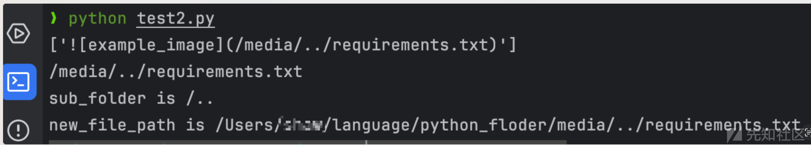](https://xzfile.aliyuncs.com/media/upload/picture/20240313131936-488a0db4-e0f9-1.png)

可以看到解析的路径是可以存在 `../` 路径穿越的，随后就使用 `shutil.copy` 对这个资源进行的复制操作.  
[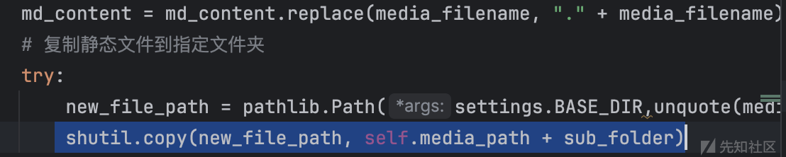](https://xzfile.aliyuncs.com/media/upload/picture/20240313131954-5397cf52-e0f9-1.png)
=======
[](https://xzfile.aliyuncs.com/media/upload/picture/20240313131936-488a0db4-e0f9-1.png)

可以看到解析的路径是可以存在 `../` 路径穿越的，随后就使用 `shutil.copy` 对这个资源进行的复制操作。 
[](https://xzfile.aliyuncs.com/media/upload/picture/20240313131954-5397cf52-e0f9-1.png)
>>>>>>> 4992f5f682bf7aa8873ceb2495ac1d2a8296850f

## 漏洞复现：

接下来去找漏洞触发点，其调用栈如下：  
<<<<<<< HEAD
[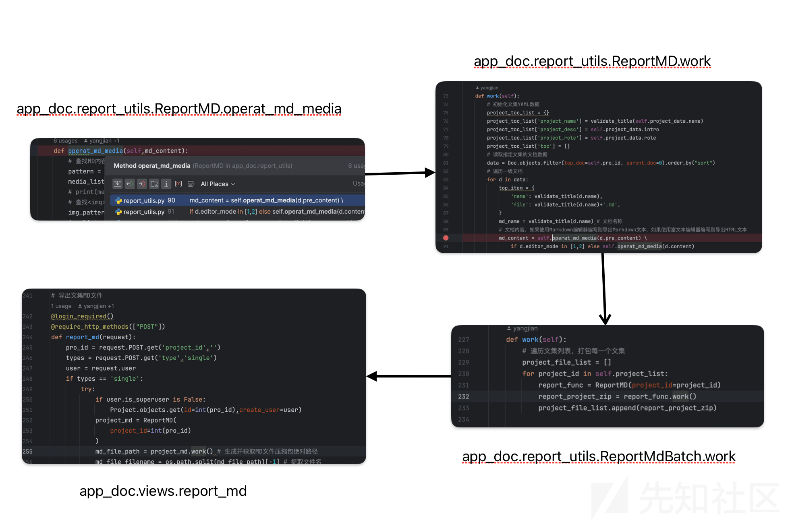](https://xzfile.aliyuncs.com/media/upload/picture/20240313132007-5b48008c-e0f9-1.png)

最后找到的入口点是在这个地方，根据注释 `导出文集MD文件` , 去官网找一下这个功能的位置，搜索结果如下：[https://doc.mrdoc.pro/doc/45554/](https://doc.mrdoc.pro/doc/45554/)

[](https://xzfile.aliyuncs.com/media/upload/picture/20240313132024-656480e0-e0f9-1.png)

那就去试一下：  
先注册账号编辑一便文章，资源路径为 ``, 然后保存到文集下面，这里我的文集是 test2:  
[](https://xzfile.aliyuncs.com/media/upload/picture/20240313132040-6e821048-e0f9-1.png)  
然后来到 `我的文集----文集管理----选择文集----批量导出`  
[](https://xzfile.aliyuncs.com/media/upload/picture/20240313132055-776d74fe-e0f9-1.png)  
然后下载压缩包，解压就能发现里面有 requirements.txt  
[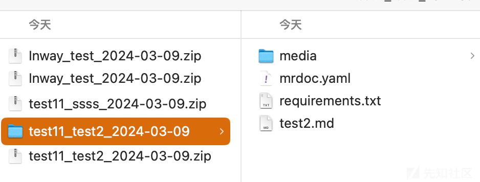](https://xzfile.aliyuncs.com/media/upload/picture/20240313132110-80e15f82-e0f9-1.png)
=======
[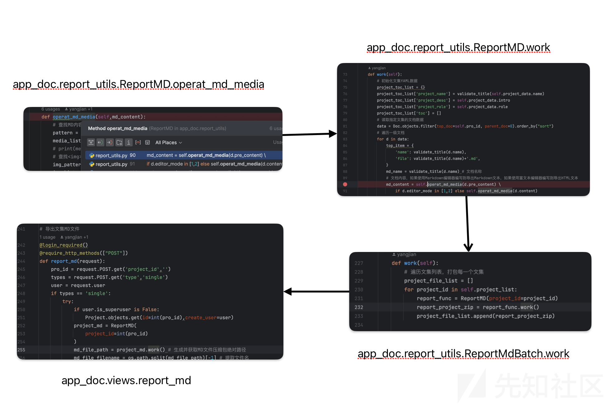](https://xzfile.aliyuncs.com/media/upload/picture/20240313132007-5b48008c-e0f9-1.png)

最后找到的入口点是在这个地方，根据注释 `导出文集MD文件` , 去官网找一下这个功能的位置，搜索结果如下：[https://doc.mrdoc.pro/doc/45554/](https://doc.mrdoc.pro/doc/45554/)

[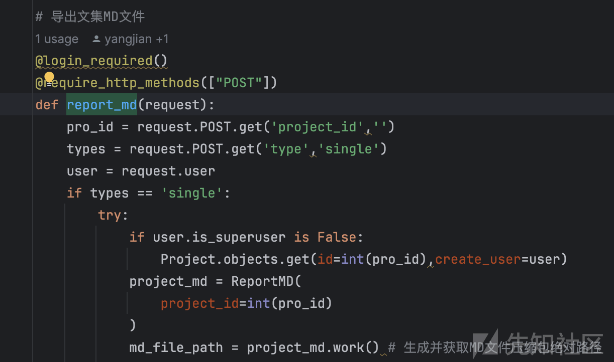](https://xzfile.aliyuncs.com/media/upload/picture/20240313132024-656480e0-e0f9-1.png)

那就去试一下：  
先注册账号编辑一便文章，资源路径为 ``, 然后保存到文集下面，这里我的文集是 test2:  
[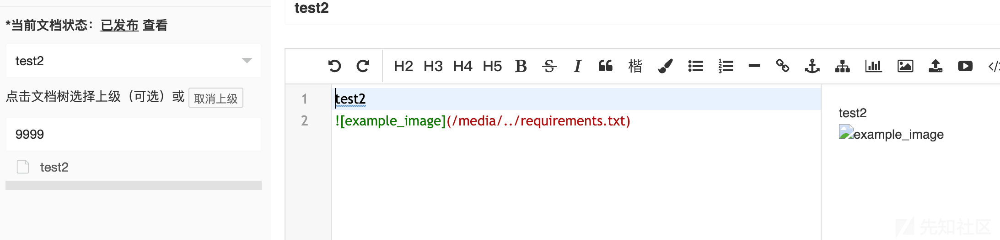](https://xzfile.aliyuncs.com/media/upload/picture/20240313132040-6e821048-e0f9-1.png)  
然后来到 `我的文集----文集管理----选择文集----批量导出`  
[](https://xzfile.aliyuncs.com/media/upload/picture/20240313132055-776d74fe-e0f9-1.png)  
然后下载压缩包，解压就能发现里面有 requirements.txt  
[](https://xzfile.aliyuncs.com/media/upload/picture/20240313132110-80e15f82-e0f9-1.png)
>>>>>>> 4992f5f682bf7aa8873ceb2495ac1d2a8296850f

除此之外 img 标签也是存在目录穿越导致文件读取的，测试如下：  
``

自此，漏洞复现结束

## 一次失败的尝试

既然这个地方的文件导出功能存在问题，那类似的，其他 markdown 的导出是否也存在同样的问题呢？带着这个疑问，我尝试去找了下类似于 Mrdoc 的其他开源在线文档系统，找到了一个用 go 语言写的 mm-wiki:[https://github.com/phachon/mm-wiki](https://github.com/phachon/mm-wiki)  
跳过环境搭建，先来黑盒测试一下功能，我先上传了一张照片，按照同样的逻辑加入了一个带有穿越路径的资源，如下，接着导出：

<<<<<<< HEAD
[](https://xzfile.aliyuncs.com/media/upload/picture/20240313132122-87f56d04-e0f9-1.png)  
[](https://xzfile.aliyuncs.com/media/upload/picture/20240313132130-8c59c39a-e0f9-1.png)

结果并没有出现类似的问题，再去代码里看看相关的处理逻辑 `app/controllers/page.go:367` , 发现打包的图片地址是从数据库中检索的，然后使用了 `filepath.Join` 来拼接，那如果我们 `attachment["path"]` 是存在 `../` 这种目录穿越字符，那就能够造成目录穿越。因此接下来去查看下上传图片的逻辑。  
[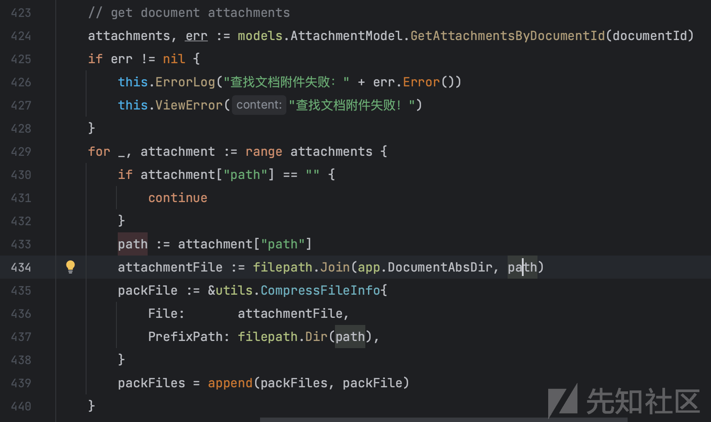](https://xzfile.aliyuncs.com/media/upload/picture/20240313132143-94876d6a-e0f9-1.png)

图片上传的代码位于 `app/controllers/image.go:23`  
[](https://xzfile.aliyuncs.com/media/upload/picture/20240313132157-9c914d32-e0f9-1.png)  
[](https://xzfile.aliyuncs.com/media/upload/picture/20240313132203-a0259d36-e0f9-1.png)  
可以看到，在上传处使用了 `path.Join` 直接将上传的文件名进行了，因此在此处是存在目录穿越的，但是由于在保存文件之前进行了文件是否存在校验，所以即使存在目录穿越，也无法进行文件覆盖，从而也不能将数据插入到数据库中  
[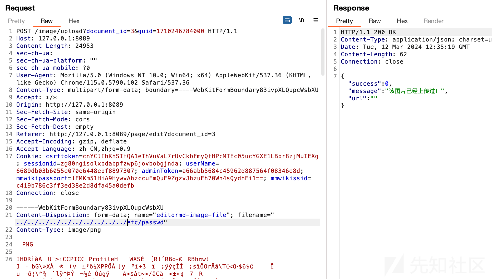](https://xzfile.aliyuncs.com/media/upload/picture/20240313132221-aaf94820-e0f9-1.png)

所以最后该项目不存在类似的漏洞.  
=======
[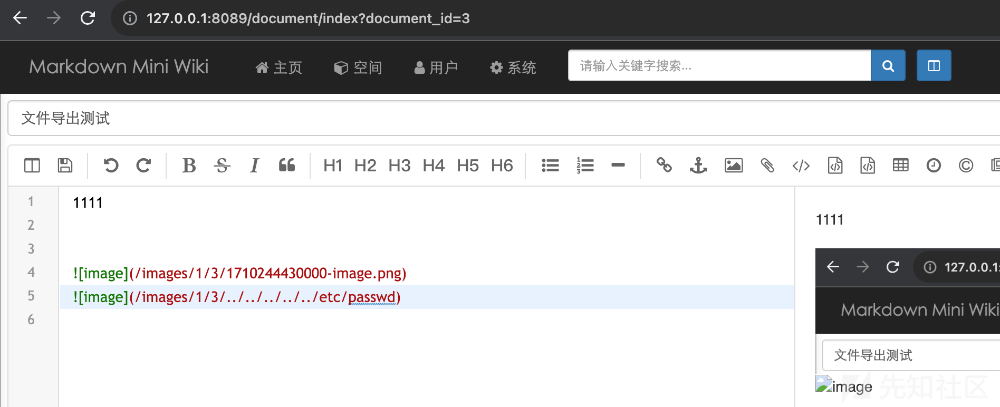](https://xzfile.aliyuncs.com/media/upload/picture/20240313132122-87f56d04-e0f9-1.png)  
[](https://xzfile.aliyuncs.com/media/upload/picture/20240313132130-8c59c39a-e0f9-1.png)

结果并没有出现类似的问题，再去代码里看看相关的处理逻辑 `app/controllers/page.go:367` , 发现打包的图片地址是从数据库中检索的，然后使用了 `filepath.Join` 来拼接，那如果我们 `attachment["path"]` 是存在 `../` 这种目录穿越字符，那就能够造成目录穿越。因此接下来去查看下上传图片的逻辑。  
[](https://xzfile.aliyuncs.com/media/upload/picture/20240313132143-94876d6a-e0f9-1.png)

图片上传的代码位于 `app/controllers/image.go:23`  
[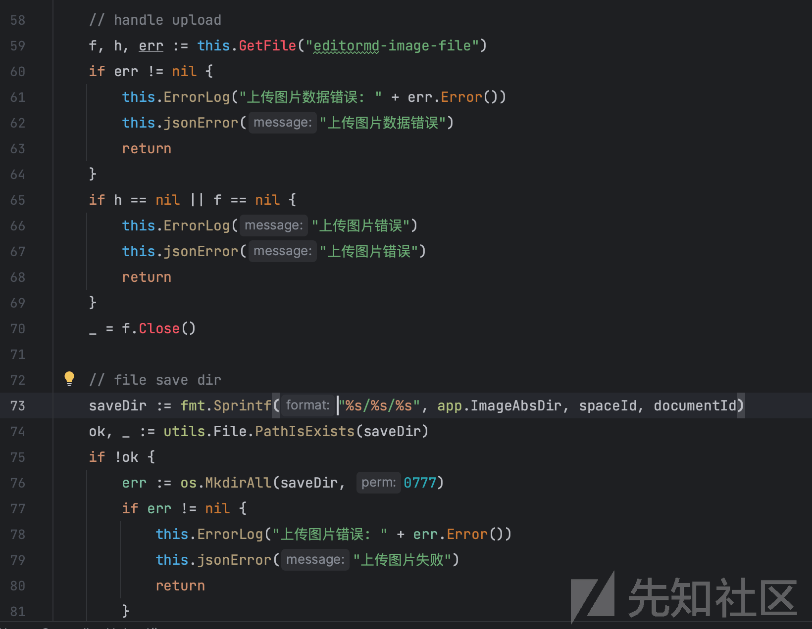](https://xzfile.aliyuncs.com/media/upload/picture/20240313132157-9c914d32-e0f9-1.png)  
[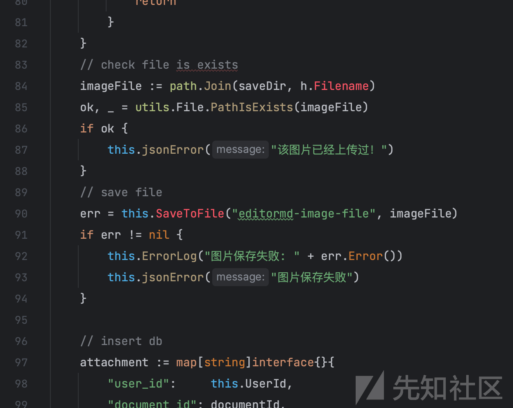](https://xzfile.aliyuncs.com/media/upload/picture/20240313132203-a0259d36-e0f9-1.png)  
可以看到，在上传处使用了 `path.Join` 直接将上传的文件名进行了，因此在此处是存在目录穿越的，但是由于在保存文件之前进行了文件是否存在校验，所以即使存在目录穿越，也无法进行文件覆盖，从而也不能将数据插入到数据库中  
[](https://xzfile.aliyuncs.com/media/upload/picture/20240313132221-aaf94820-e0f9-1.png)

所以最后该项目不存在类似的漏洞。 
>>>>>>> 4992f5f682bf7aa8873ceb2495ac1d2a8296850f
这里只列举了一个类似的网站，感兴趣的师傅可以利用相同的思路，去找找其他相关项目的再测测，说不定会有什么发现。

## 关于 Markdown 的一些漏洞

既然遇到 Markdown 了，那就顺带回顾一下关于 markdown 的一些常见漏洞吧。历史上，markdown 出现最多的问题就是 HTML 渲染导致的 XSS 漏洞，这里举一些案例：  
typora:  
[Typora XSS 到 RCE (上)- 安全客 - 安全资讯平台](https://www.anquanke.com/post/id/170665)  
[Typora XSS 到 RCE (上)- 安全客 - 安全资讯平台](https://www.anquanke.com/post/id/170665)  
[CVE-2023-2317：Typora MD 编辑器命令执行漏洞分析与复现](https://www.wevul.com/2386.html)  
[Typora XSS Vulnerability](https://c0olw.github.io/2023/07/31/Typora-XSS-Vulnerability/)  
[Typora XSS to Code Execution](https://blog.splitline.tw/typora-xss-to-code-execution/)  
[https://github.com/typora/typora-issues/issues/2959](https://github.com/typora/typora-issues/issues/2959)  
以及开源 markdwon 编辑器 [editor.md](https://pandao.github.io/editor.md/) 的一些 xss  
[https://github.com/pandao/editor.md/issues?q=xss](https://github.com/pandao/editor.md/issues?q=xss)

但是，上面大部分的 xss 都是基于源码去分析了程序逻辑才找到漏洞，那在平时的黑盒测试中我们应该如何去挖掘 markdown 中的 xss 问题呢？  
个人的理解：就是多尝试一些比较少见的标签去测试，举些例子：

<<<<<<< HEAD
```plain
<iframe src=javascript://%0aalert('iframe')>
<embed src="https://c0olw.github.io/pic/1.html">
<audio src=x onerror=confirm("casrc")> //从xmind那抄来的
```

以一个在线网站网站为例，尝试最简单的 payload 都没啥反应  
[](https://xzfile.aliyuncs.com/media/upload/picture/20240313132303-c41ba42e-e0f9-1.png)  
换了个 `embed` `iframe` 一下就出了，当然这个反射性没啥用，只是给各位平时做漏洞挖掘起到一点启发。  
[](https://xzfile.aliyuncs.com/media/upload/picture/20240313132337-d851b47e-e0f9-1.png)

[](https://xzfile.aliyuncs.com/media/upload/picture/20240313132427-f6145322-e0f9-1.png)

当然 mm-wiki 上也是存在 xss 的，  
[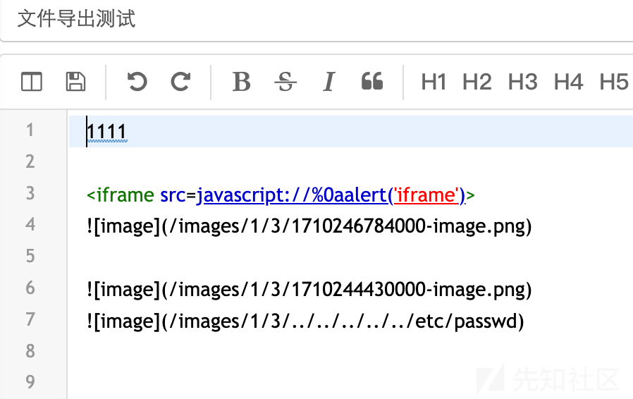](https://xzfile.aliyuncs.com/media/upload/picture/20240313132538-2042eeba-e0fa-1.png)  
[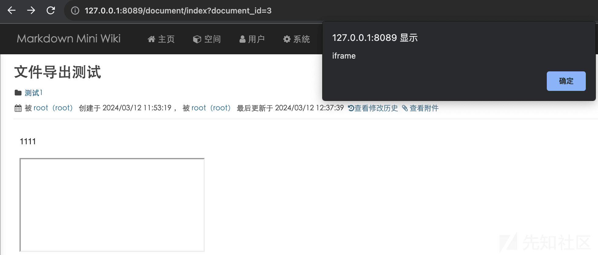](https://xzfile.aliyuncs.com/media/upload/picture/20240313132542-22990186-e0fa-1.png)
=======
```bash
<iframe src=javascript://%0aalert('iframe')>
<embed src="https://c0olw.github.io/pic/1.html">
<audio src=x onerror=confirm("casrc")> //从 xmind 那抄来的
```

以一个在线网站网站为例，尝试最简单的 payload 都没啥反应  
[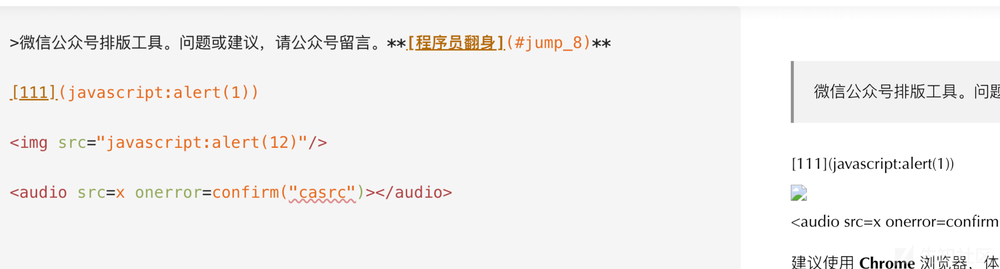](https://xzfile.aliyuncs.com/media/upload/picture/20240313132303-c41ba42e-e0f9-1.png)  
换了个 `embed` `iframe` 一下就出了，当然这个反射性没啥用，只是给各位平时做漏洞挖掘起到一点启发。  
[](https://xzfile.aliyuncs.com/media/upload/picture/20240313132337-d851b47e-e0f9-1.png)

[](https://xzfile.aliyuncs.com/media/upload/picture/20240313132427-f6145322-e0f9-1.png)

当然 mm-wiki 上也是存在 xss 的，  
[](https://xzfile.aliyuncs.com/media/upload/picture/20240313132538-2042eeba-e0fa-1.png)  
[](https://xzfile.aliyuncs.com/media/upload/picture/20240313132542-22990186-e0fa-1.png)
>>>>>>> 4992f5f682bf7aa8873ceb2495ac1d2a8296850f
