# 利用 MSIX 安装包传播恶意软件攻击样本的详细分析 - 先知社区

# 前言概述

MSIX 是一种 Windows 应用包格式，可以为所有 Windows 应用提供现代打包体验，MSIX 包格式保留了现有应用包和安装文件的功能，此外它还为 Win32、WPF 和 Windows 窗体应用启用了全新的现代打包和部署功能。

从去年年底开始，全球范围内越来越多的攻击者开始使用 MSIX 类型的安装包传播各种恶意软件，这些 MSIX 安装包样本大多数包含正常的数字签名，下面针对一些 MSIX 安装包样本进行详细分析。

# 样本分析

1.MSIX 大多数样本都带有正常的数字签名，如下所示：  
[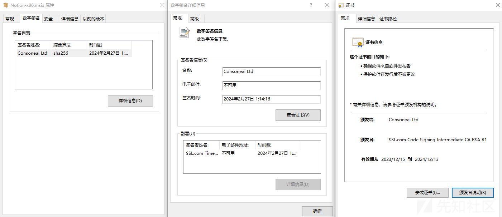](https://xzfile.aliyuncs.com/media/upload/picture/20240315185130-fb45faf0-e2b9-1.png)  
2.安装程序运行之后，会调用执行 StartingScriptWrapper.ps1 脚本，如下所示：  
[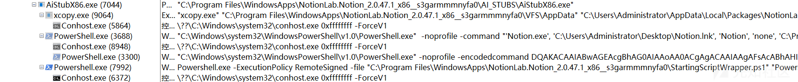](https://xzfile.aliyuncs.com/media/upload/picture/20240315185146-04a13132-e2ba-1.png)  
3.然后执行 refresh.ps1 恶意脚本，如下所示：  
[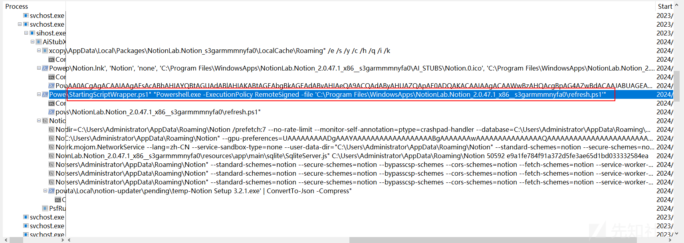](https://xzfile.aliyuncs.com/media/upload/picture/20240315185159-0c6b94ac-e2ba-1.png)  
4.研究一下 MSIX 安装包是如何调用恶意 PS 脚本的，首先 MSIX 安装包会更改应用程序的入口点 AppxManifest.xml，如下所示：  
[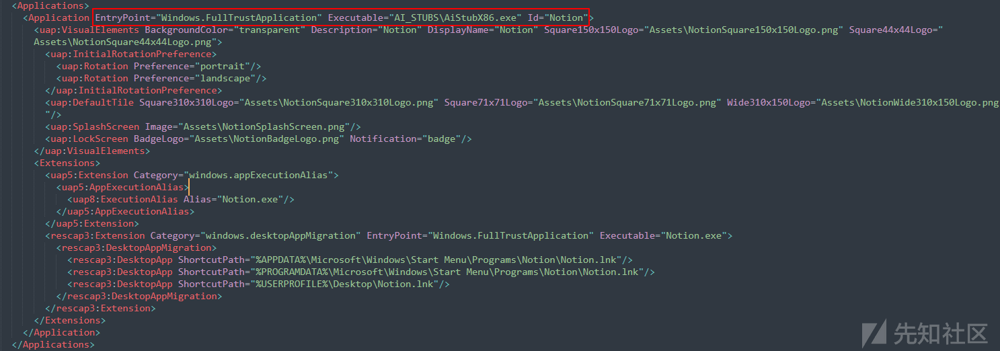](https://xzfile.aliyuncs.com/media/upload/picture/20240315185217-16e341be-e2ba-1.png)  
5.使用 PSF Launcher 充当应用程序的包装器，它将 PSF 注入 psfRuntime 到应用程序进程中，然后激活它，如下所示：  
[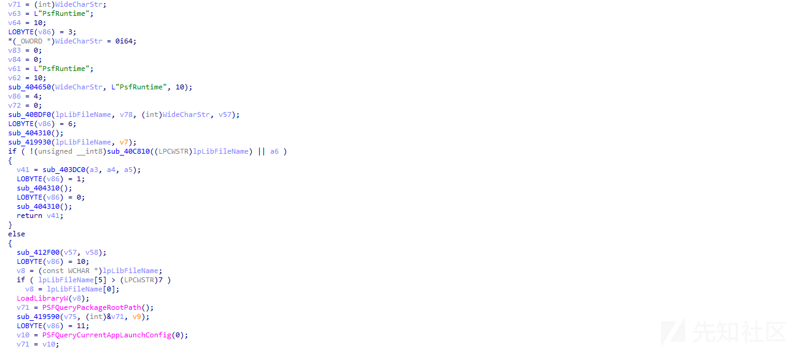](https://xzfile.aliyuncs.com/media/upload/picture/20240315185247-28f54050-e2ba-1.png)  
6.然后调用执行 StartingScriptWrapper.ps1 脚本，如下所示：  
[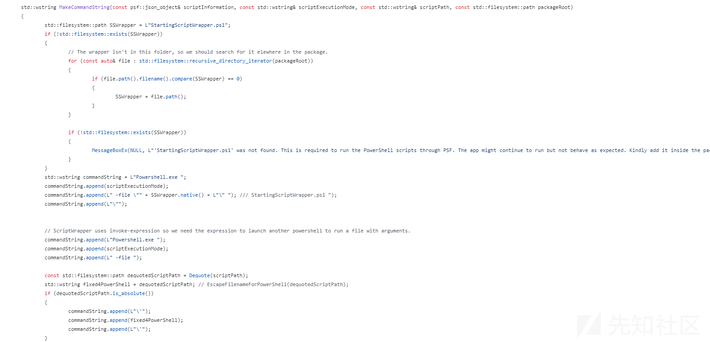](https://xzfile.aliyuncs.com/media/upload/picture/20240315185301-3158d5b8-e2ba-1.png)  
7.读取 config.json 配置文件信息，如下所示：  
[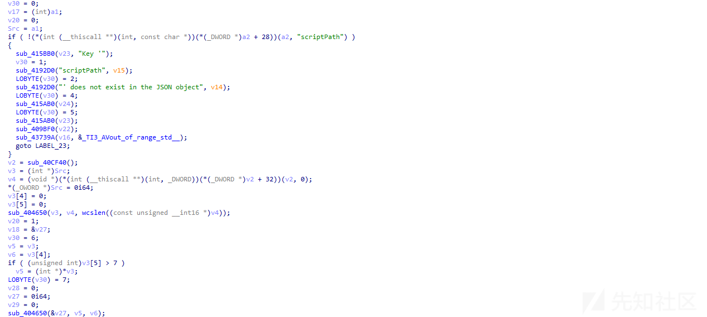](https://xzfile.aliyuncs.com/media/upload/picture/20240315185317-3b143c5a-e2ba-1.png)  
8.config.json 配置文件启动脚本信息，如下所示：  
[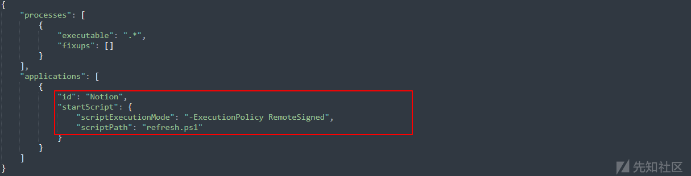](https://xzfile.aliyuncs.com/media/upload/picture/20240315185346-4c6d967c-e2ba-1.png)  
9.按配置信息中指定的脚本执行模式和脚本路径，调用执行 refresh.ps1 恶意脚本，refresh.ps1 恶意脚本使用空白字符进行混淆，如下所示：  
[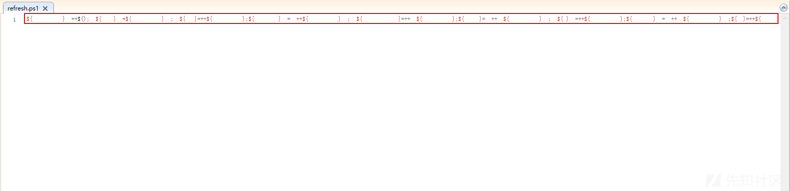](https://xzfile.aliyuncs.com/media/upload/picture/20240315185400-546cf5f2-e2ba-1.png)  
10.解密之后，从远程服务器上下载执行恶意脚本，如下所示：  
[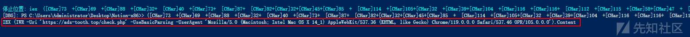](https://xzfile.aliyuncs.com/media/upload/picture/20240315185414-5d1a3462-e2ba-1.png)  
由于远程服务器已经关闭了，无法下载到后续的脚本，暂不作研究了。  
11.另一个 MSIX 安装包样本，数字签名如下所示：  
  
12.样本解压之后，如下所示：  
[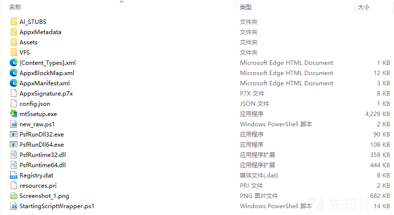](https://xzfile.aliyuncs.com/media/upload/picture/20240315185452-73bca5b0-e2ba-1.png)  
13.通过上面的分析结论，查看 config.json 配置文件信息，该 MSIX 安装包会调用目录下的 new\_raw.ps1 恶意脚本，如下所示：  
[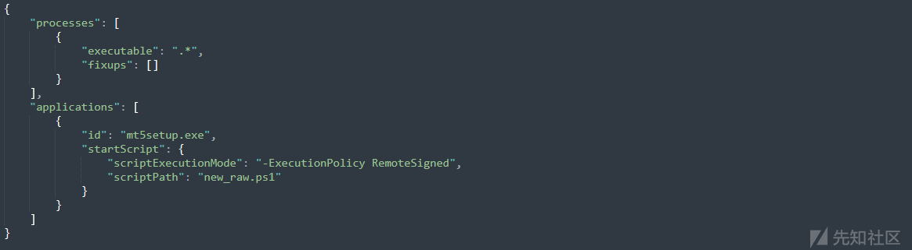](https://xzfile.aliyuncs.com/media/upload/picture/20240315185510-7e314636-e2ba-1.png)  
14.恶意脚本从网上下载 gpg 文件到指定目录，并通过 gpg.exe 程序解密下载的 gpg 文件，最后通过 tar 解压缩，执行恶意程序，如下所示：  
[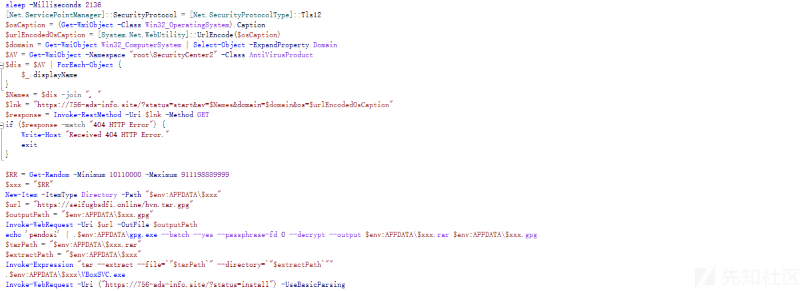](https://xzfile.aliyuncs.com/media/upload/picture/20240315185527-883d7712-e2ba-1.png)  
15.解密解压缩之后，生成恶意程序，如下所示：  
[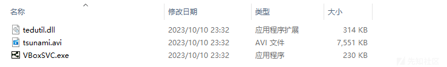](https://xzfile.aliyuncs.com/media/upload/picture/20240315185541-90bf2fca-e2ba-1.png)  
16.启动 VBoxSVC.exe，利用白 + 黑技术加载同目录下的 tedutil.dll 恶意模块，如下所示：  
[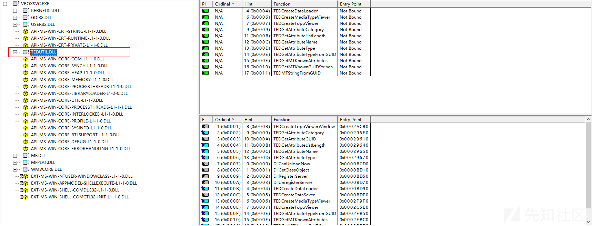](https://xzfile.aliyuncs.com/media/upload/picture/20240315185557-9a7eeabe-e2ba-1.png)  
17.该恶意模块带有无效的微软数字签名，如下所示：  
[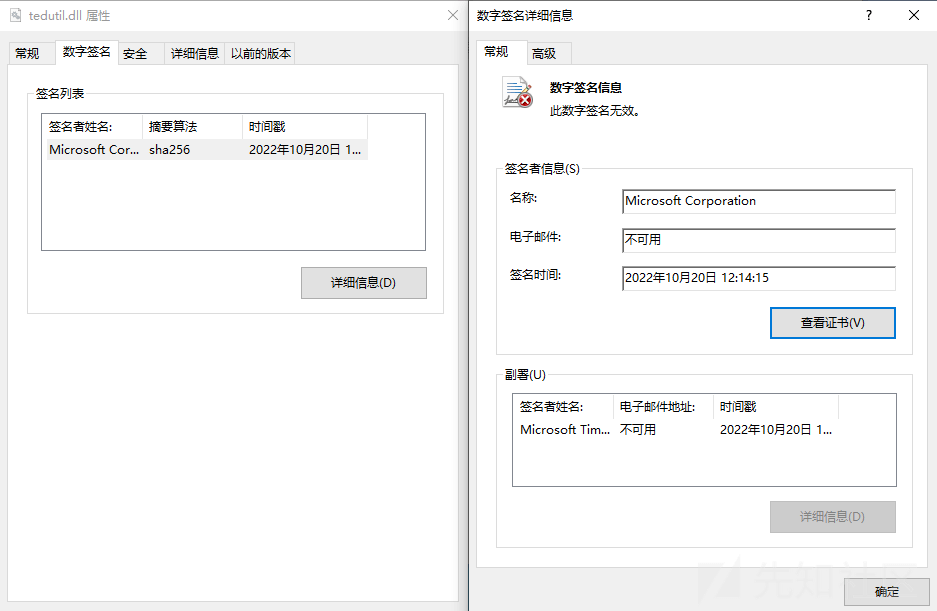](https://xzfile.aliyuncs.com/media/upload/picture/20240315185612-a351588e-e2ba-1.png)  
18.恶意模块读取 tsunami.avi 数据到分配的内存空间当中，如下所示：  
  
19.拷贝相关的数据到分配的内存空间，如下所示：  
[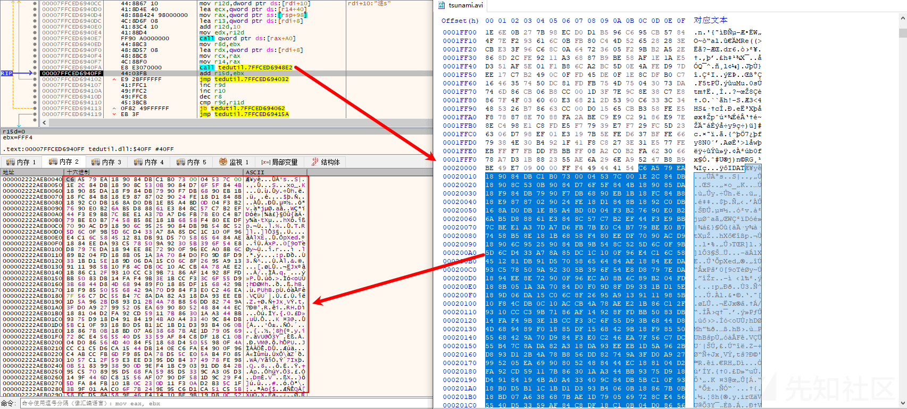](https://xzfile.aliyuncs.com/media/upload/picture/20240315185642-b541ad82-e2ba-1.png)  
20.解密内存中的数据，如下所示：  
[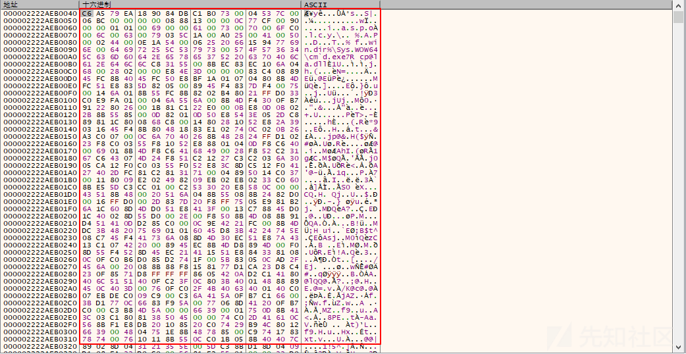](https://xzfile.aliyuncs.com/media/upload/picture/20240315185657-be1db2a2-e2ba-1.png)  
21.解压解密后的数据，如下所示：  
[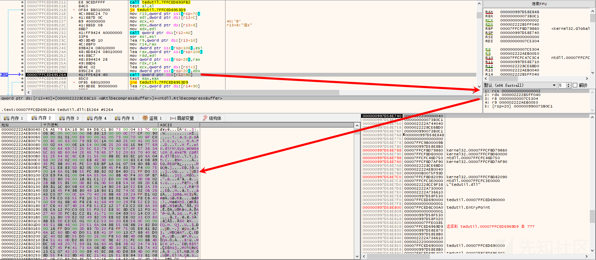](https://xzfile.aliyuncs.com/media/upload/picture/20240315185710-c5d69266-e2ba-1.png)  
22.解压解密之后的数据，如下所示：  
[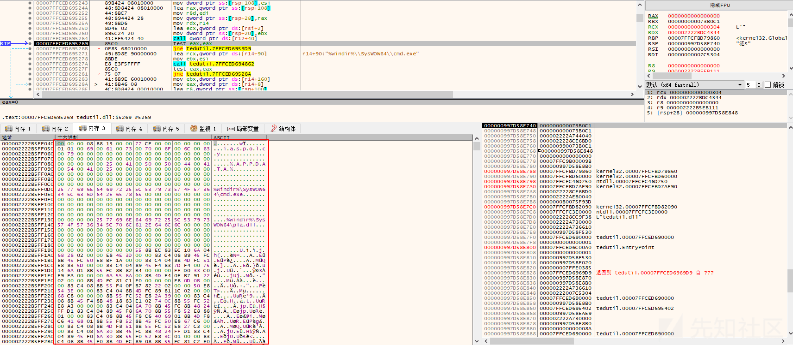](https://xzfile.aliyuncs.com/media/upload/picture/20240315185726-cf61eea2-e2ba-1.png)  
23.通过 LoadLibrary 加载系统 pla.dll 模块，如下所示：  
[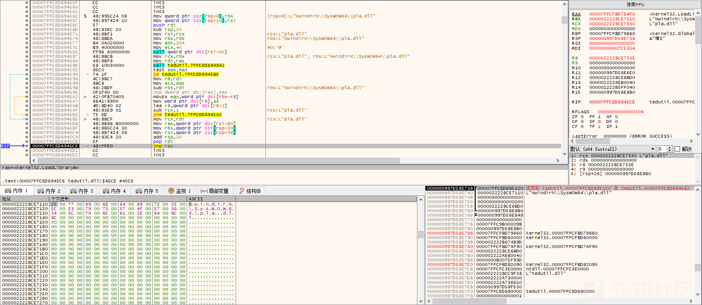](https://xzfile.aliyuncs.com/media/upload/picture/20240315185740-d75c7e7e-e2ba-1.png)  
24.将 pla.dll 模块 text 区段的数据拷贝到分配的内存空间当中，如下所示：  
[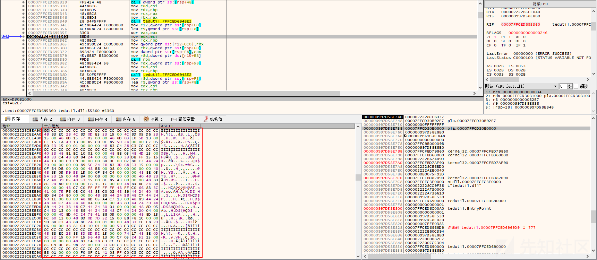](https://xzfile.aliyuncs.com/media/upload/picture/20240315185754-e04ab7d0-e2ba-1.png)  
25.修改 pla.dll 模块 text 区段的内存页面保护属性，如下所示：  
[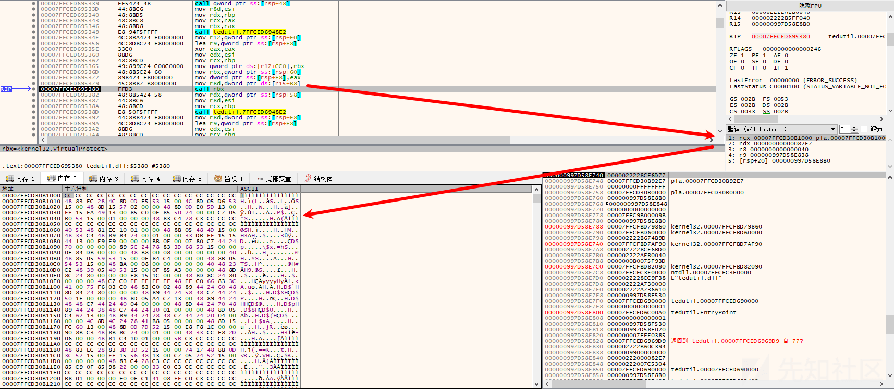](https://xzfile.aliyuncs.com/media/upload/picture/20240315185826-f353d33e-e2ba-1.png)  
26.修改之后 text 区段的内存页面保护属性，如下所示：  
[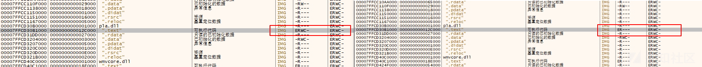](https://xzfile.aliyuncs.com/media/upload/picture/20240315185840-fb3a75bc-e2ba-1.png)  
27.将恶意代码写入到 pla.txt 模块的 text 区段，替换 text 区段的数据，如下所示：  
  
28.还原 pla.txt 模块 text 区段的内存页面保护属性，如下所示：  
[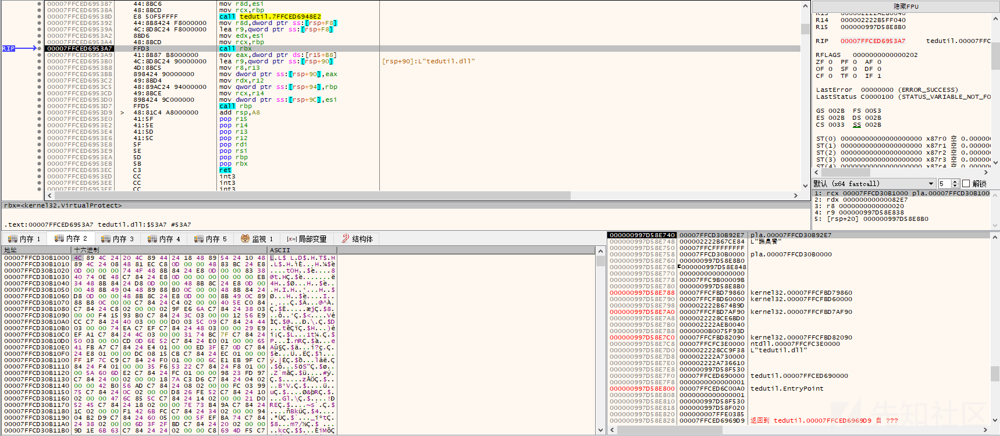](https://xzfile.aliyuncs.com/media/upload/picture/20240315185910-0d82ebbe-e2bb-1.png)  
29.跳转到 pla.txt 模块 text 区段，执行被替换的恶意代码，如下所示：  
[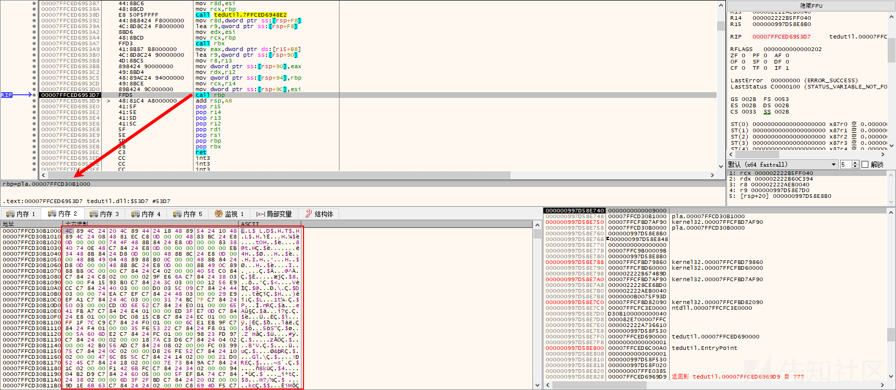](https://xzfile.aliyuncs.com/media/upload/picture/20240315185926-168fdffa-e2bb-1.png)  
30.恶意代码，如下所示：  
[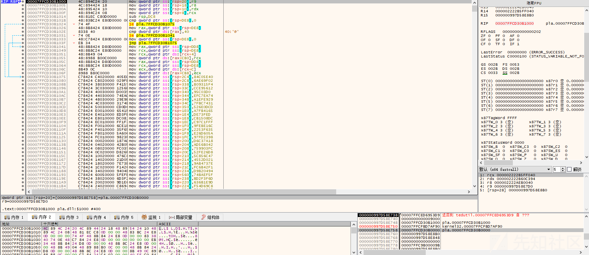](https://xzfile.aliyuncs.com/media/upload/picture/20240315185940-1f1f4598-e2bb-1.png)  
31.加载指定的系统 DLL 模块，获取相关的函数地址，如下所示：  
[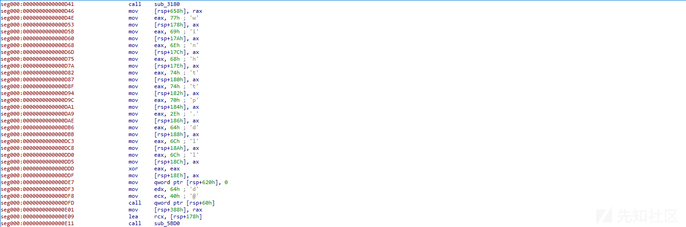](https://xzfile.aliyuncs.com/media/upload/picture/20240315185955-27db1c7a-e2bb-1.png)  
32.判断恶意程序是否运行在 64 位操作系统，如下所示：  
[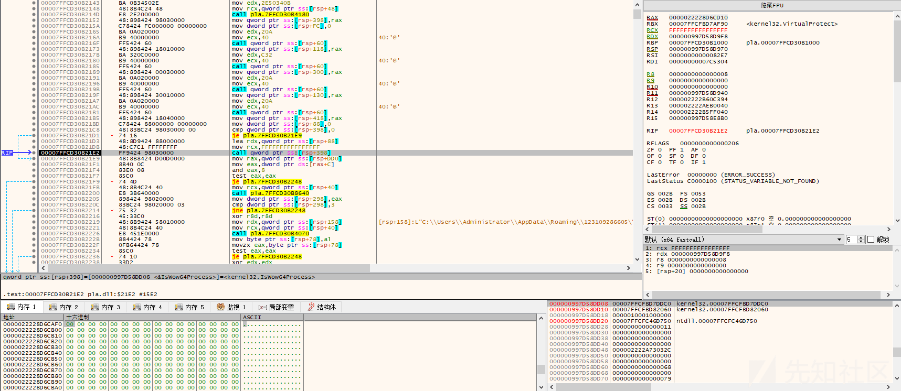](https://xzfile.aliyuncs.com/media/upload/picture/20240315190009-30619a90-e2bb-1.png)  
33.获取计算机名，如下所示：  
[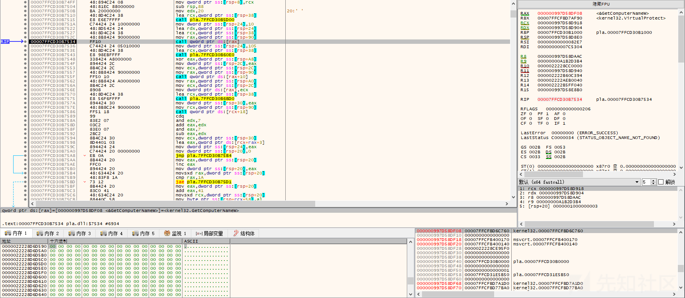](https://xzfile.aliyuncs.com/media/upload/picture/20240315190025-3a3209ec-e2bb-1.png)  
34.启动 cmd.exe 进程，如下所示：  
[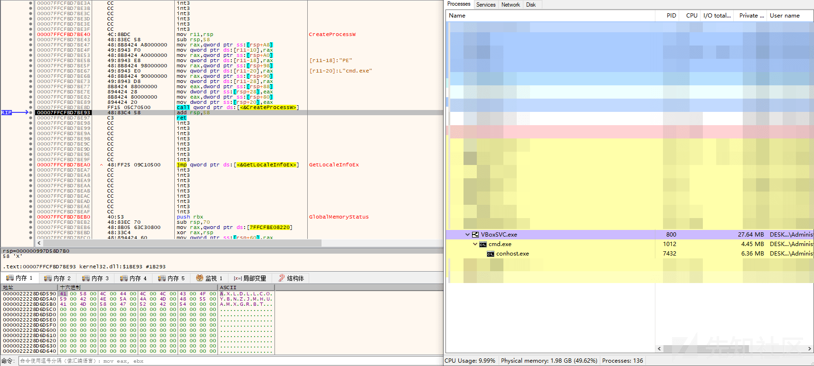](https://xzfile.aliyuncs.com/media/upload/picture/20240315190041-43919e80-e2bb-1.png)  
35.在 Temp 目录下生成随机文件，并写入恶意数据，如下所示：  
[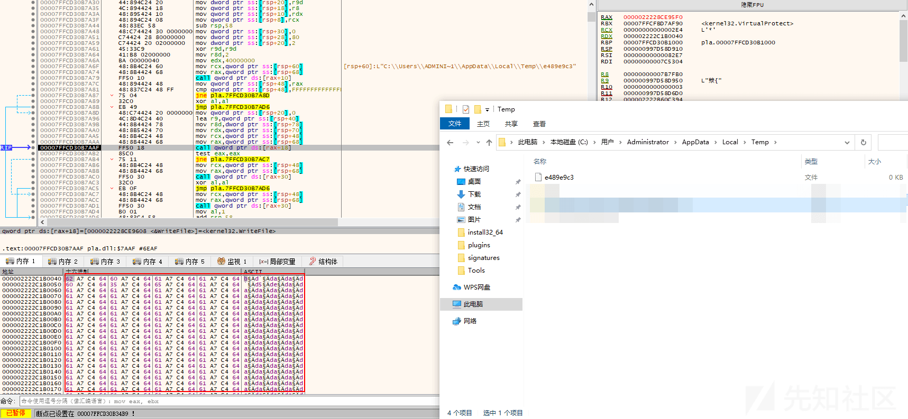](https://xzfile.aliyuncs.com/media/upload/picture/20240315190055-4c0582fc-e2bb-1.png)  
36.将恶意代码写入到进程当中，如下所示：  
[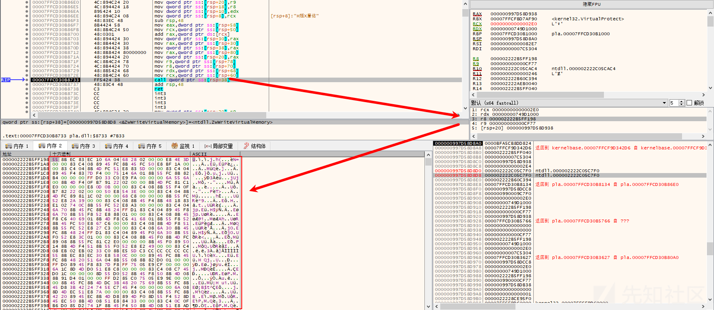](https://xzfile.aliyuncs.com/media/upload/picture/20240315190109-547ba592-e2bb-1.png)  
37.覆盖 pla.dll 模块的 text 区段，如下所示：  
[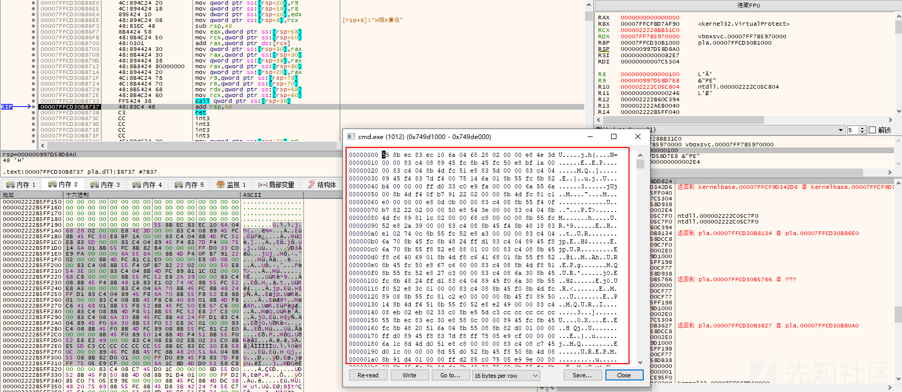](https://xzfile.aliyuncs.com/media/upload/picture/20240315190126-5e3c3858-e2bb-1.png)  
38.启动远程进程线程，然后结束主进程，如下所示：  
[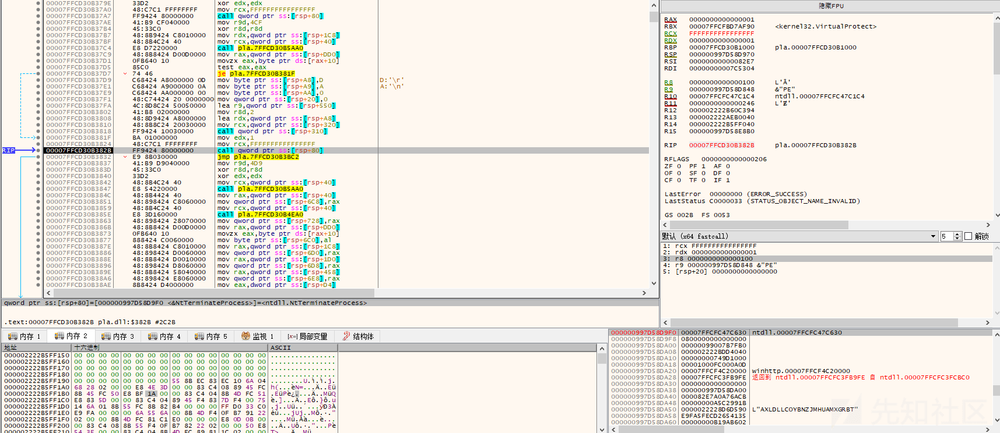](https://xzfile.aliyuncs.com/media/upload/picture/20240315190143-6888b3b8-e2bb-1.png)  
39.注入的恶意代码，如下所示：  
[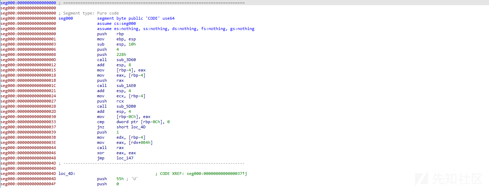](https://xzfile.aliyuncs.com/media/upload/picture/20240315191317-065fbc5c-e2bd-1.png)  
40.执行恶意代码，解密出窃密木马，与远程服务器通信，如下所示：  
[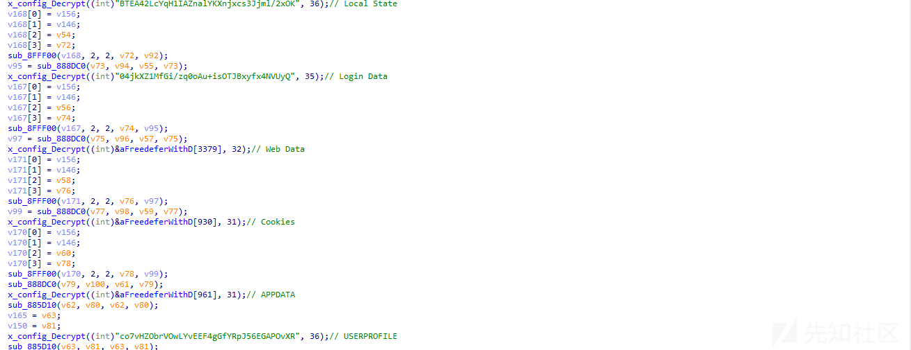](https://xzfile.aliyuncs.com/media/upload/picture/20240315191333-0ffb4786-e2bd-1.png)  
41.窃取主机相关信息，如下所示：  
  
42.窃取到主机的信息，如下所示：  
[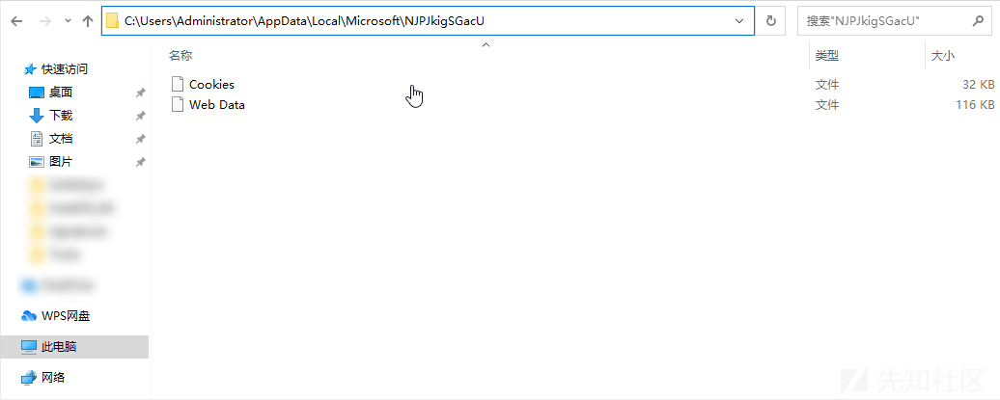](https://xzfile.aliyuncs.com/media/upload/picture/20240315191408-24599caa-e2bd-1.png)  
43.获取主机数字钱包数据，如下所示：  
[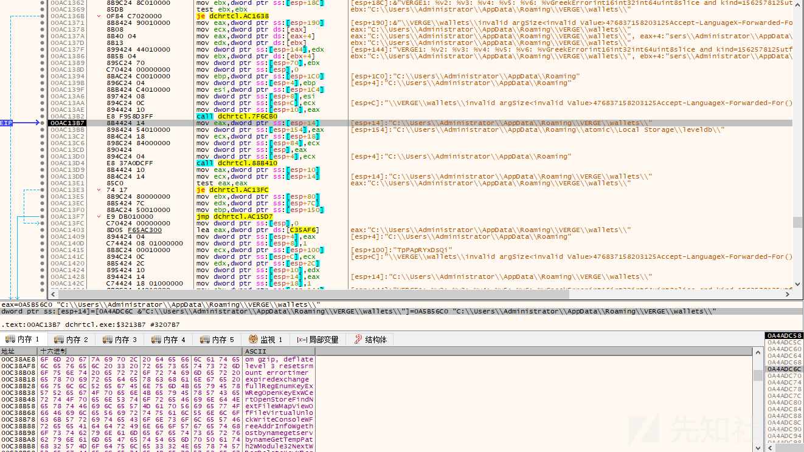](https://xzfile.aliyuncs.com/media/upload/picture/20240315191430-3175c2d8-e2bd-1.png)  
获取相关的数字钱包以及通信软件数据信息，如下所示：  
C:\\Users\\Administrator\\AppData\\Roaming\\VERGE\\wallets\\  
C:\\Users\\Administrator\\AppData\\Roaming\\exodus\\exodus.wallet\\  
C:\\Users\\Administrator\\AppData\\Roaming\\Electrum\\wallets\\  
C:\\Users\\Administrator\\AppData\\Roaming\\Coinomi\\Coinomi\\wallets\\  
C:\\Users\\Administrator\\AppData\\Roaming\\Telegram Desktop\\tdata\\  
C:\\Users\\Administrator\\AppData\\Roaming\\ICQ\\0001\\  
C:\\Users\\Administrator\\AppData\\Roaming\\Microsoft\\Skype for Desktop\\Local Storage\\  
C:\\Users\\Administrator\\AppData\\Roaming\\Element\\Local Storage\\leveldb\\  
C:\\Users\\Administrator\\AppData\\Roaming\\Discord\\Local Storage\\leveldb\\  
C:\\Users\\Administrator\\AppData\\Roaming\\Wallets\\Jaxx\\com.liberty.jaxx\\IndexedDB\\  
C:\\Users\\Administrator\\AppData\\Roaming\\bytecoin\\  
C:\\Users\\Administrator\\AppData\\Roaming\\Guarda\\Local Storage\\leveldb\\  
C:\\Users\\Administrator\\AppData\\Roaming\\Armory\\  
C:\\Users\\Administrator\\AppData\\Roaming\\Zcash\\  
44.上传到远程服务器上，如下所示：  
[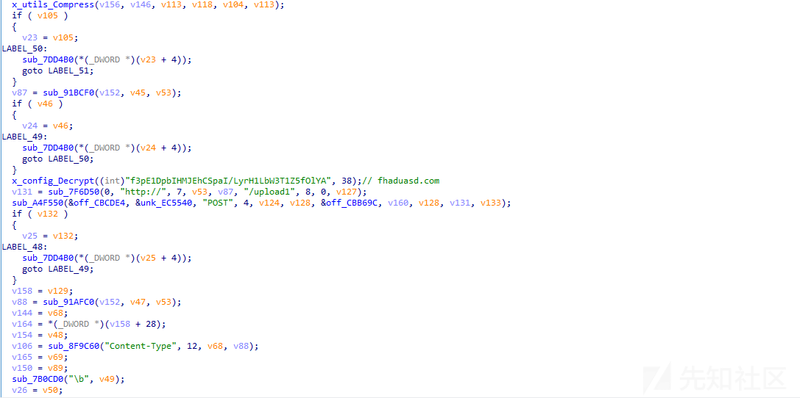](https://xzfile.aliyuncs.com/media/upload/picture/20240315191454-3fd13326-e2bd-1.png)

# 威胁情报

[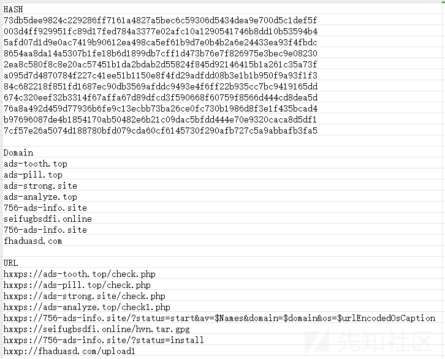](https://xzfile.aliyuncs.com/media/upload/picture/20240315191515-4cc199fe-e2bd-1.png)

# 总结结尾

2023 年攻击者开始大量使用 OneNote 文件类型来传播各种恶意软件，2024 年攻击者又开始大量使用含有正常数字签名的 MSIX 文件类型来传播各种恶意软件，攻与防的对抗一直在升级。
