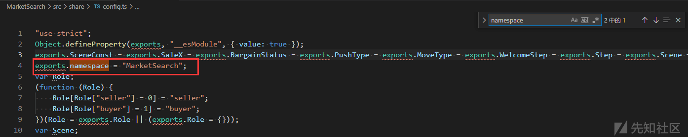

# 发现 Webpack 中泄露的 api - 先知社区

## 1 - 安装 reverse-sourcemap

> 需要配置好[npm 环境](https://www.runoob.com/nodejs/nodejs-npm.html) （runoob 教程）

使用命令（需要代理） `npm install --global reverse-sourcemap` 进行安装

## 2 - 寻找 xxx.js.map

> 如果有 sourcemap 的话，在 js 最后会有注释：
> 
> `//# sourceMappingURL=xxxxxxx.js.map`

比如这里我要下载`MarketSearch.js.map`（`MarketSearch.js`是与站点同名的 js，应该是主要的 js 文件）

-   在开发者工具中搜索`.js.map` （位置 1）
-   找到`MarketSearch.js.map`所在的 js（位置 2）
-   找到对应的链`URL`（位置 3）
    -   一般来说，静态文件会挂载在当前域名下，但不排除其他站点挂载的情况，所以需要找到对应的`URL`，比如这里就不同站
    -   这里`MarketSearch.js`的`URL`记为`[xxx.xxx/mulu/MarketSearch.js](http://xxx.xxx/mulu/MarketSearch.js)`

[](https://xzfile.aliyuncs.com/media/upload/picture/20210417205047-8817bf70-9f7b-1.png)

## 3 - 下载 xxx.js.map 并获取所有 webpack 打包文件

使用`curl -O http://xxx.xxx/mulu/MarketSearch.js.map`

或者直接访问`http://xxx.xxx/mulu/MarketSearch.js.map` 下载`MarketSearch.js.map`

使用命令`reverse-sourcemap --output-dir ./MarketSearch MarketSearch.js.map`即可获取所有 webpack 打包文件

## 4 - 使用 IDE/其他编辑器寻找接口

我这里使用的是 vs code

直接使用全局搜索 左边侧边栏的搜索图标，或者`ctrl+shift+f`

### 4-1 搜索接口

搜索接口有两个方法：

一个是借鉴先验请求的`url`，这种情况需要我们可以访问到某些接口，比如非 SSO 的登录

另一个是直接搜索，这种情况大多是我们没法访问到当前站点的接口

#### 4-1-1 借鉴先验请求的`url`

比如我们访问的站点`xxx.xxx`存在登录接口，通过尝试，发现会调用`/MarketSearch/api/login`接口

[](https://xzfile.aliyuncs.com/media/upload/picture/20210417205104-92065974-9f7b-1.png)

那么我们可以通过不断删减来搜索接口`/MarketSearch/api/login`,`/api/login`,`/login`

可以看到，当我们删减到`/api/login`的时候，就可以找到接口对应的代码

[](https://xzfile.aliyuncs.com/media/upload/picture/20210417205115-984fc540-9f7b-1.png)

这个接口是可以调用的，但是发现其定义的接口与实际访问的接口不同（第五部分解释，这里使用了动态定义的接口）

#### 4-1-2 直接搜索

直接搜索有两种方法，根据请求方法，或者猜测命名规则进行搜索

##### 4-1-2-1 根据请求方法搜索接口

接口大多是通过`get/post`方法进行访问的，所以这是一个很好的关键词

通过请求方法，可以搜索到动态定义的接口（第五部分），避免找不到接口的问题。

而且，如果存在请求方法重写的代码，通过请求方法搜索可以发现这些代码的定义。

`post`

[](https://xzfile.aliyuncs.com/media/upload/picture/20210417205130-a140f232-9f7b-1.png)

`get`

[](https://xzfile.aliyuncs.com/media/upload/picture/20210417205139-a72899a2-9f7b-1.png)

##### 4-1-2-1 根据猜测命名规则搜索接口

一般来说，`admin`,`superadmin`,`manage`之类的关键词比较常见

[](https://xzfile.aliyuncs.com/media/upload/picture/20210417205149-ad03110e-9f7b-1.png)

此外，还可以根据站点名，可调用 api 命名规则，js 命名规则进行搜索。这个站点没有这样的接口，就不举例了。

## 5 - 寻找动态定义的接口

刚好这个站点存在动态定义的接口（直接明文写在 js 代码中的静态接口相反）：`MarketSearch/api/login` ，上面我们通过搜索，只发现了`/MarketSearch/api/user/login`接口，这里介绍一下如何寻找该接口。

首先搜索`login`，可以看到在`index.ts`中对登录进行了定义

[](https://xzfile.aliyuncs.com/media/upload/picture/20210417205206-b70e7ecc-9f7b-1.png)

查看`index.ts`,可以看到这里定义了用到的视图，继续跟踪`Login`视图，命名为`Login_1`，路径在`./Login`

[](https://xzfile.aliyuncs.com/media/upload/picture/20210417205214-bbba8c04-9f7b-1.png)

打开`Login.tsx`，可以看到根据`vse_client_1.defaultMainView.Login`视图，创建了对应的元素，`vse_client_1`定义为`vse-client`

[](https://xzfile.aliyuncs.com/media/upload/picture/20210417205222-c055bb1c-9f7b-1.png)

打开`vse-client`目录，寻找`defaultMainView`视图的定义

[](https://xzfile.aliyuncs.com/media/upload/picture/20210417205228-c411d9ac-9f7b-1.png)

跟踪`Login`视图，可以看到`api_1`路径在`./api`，且`Login`视图定义了`游客登录`和`用户登录`两个登录方式，这里跟踪`用户登录`登录方法

`用户登录`使用了`LoginModal`模态框

[](https://xzfile.aliyuncs.com/media/upload/picture/20210417205241-cbc8f388-9f7b-1.png)

跟踪`LoginModal`模态框，可以看到登录的行为通过`yield api_1.api.login(input)`来实现

`api_1 = ./api`，`input`则是`ItemKey`生成的表单中用户填写的数据（`username & password`）

[](https://xzfile.aliyuncs.com/media/upload/picture/20210417205251-d1f672bc-9f7b-1.png)

跟踪`api_1.api.login`

[](https://xzfile.aliyuncs.com/media/upload/picture/20210417205259-d6d0f12c-9f7b-1.png)

大致说一下这里的逻辑：

-   key 是键值，比如这里调用的是`api.login`，则`key === login`
    
-   对于每一个`vse_share_1.Api`定义的接口
    

[](https://xzfile.aliyuncs.com/media/upload/picture/20210417205331-e9642606-9f7b-1.png)

-   如果传入的`key`与其中一个接口相同，且不为`constructor`（通过`prototype`原型读取，所以需要排除构造函数），则向下继续
    
-   `login`传入`__awaiter_`
    
-   通过``axios_1.default.post(`/${NAMESPACE}/${vse_share_1.ShareConfig.apiPrefix}/${key}`, args)``发起请求
    
    -   `${NAMESPACE} === MarketSearch`
        
        -   查看命名空间的定义
            
            [](https://xzfile.aliyuncs.com/media/upload/picture/20210417205344-f19ef7ba-9f7b-1.png)
            
        -   跟踪`../share`
            
            [](https://xzfile.aliyuncs.com/media/upload/picture/20210417205405-fdbba37c-9f7b-1.png)
            
    -   `${vse_share_1.ShareConfig.apiPrefix} === api`
        
        ```plain
        
        ```
        
        -   跟踪`vse-share`，寻找`ShareConfig`
            
            [](https://xzfile.aliyuncs.com/media/upload/picture/20210417205428-0bd0c726-9f7c-1.png)
            
    -   `${key} === login`
        
    -   `args === input`，即，由`ItemKey`生成的 json`{username:"xxx",password:"xxx"}`
        

这种情况下，通过拼接预定义参数和传入的`api`名称，动态生成`url`路径，避免了静态存储`api`路径，使得寻找`api`接口需要花费的精力大大提升。（web 安全狗流泪）