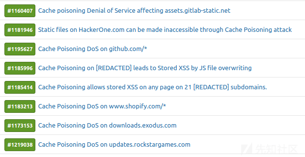
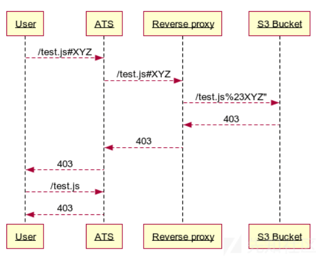
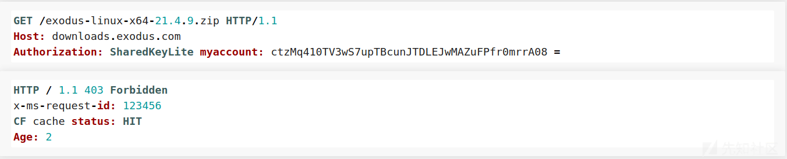
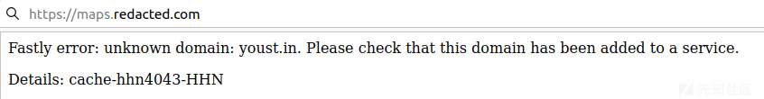

# 大规模缓存投毒总结 - 先知社区

译文声明  
本文是翻译文章，文章原作者 Youstin，文章来源：[https://youst.in/](https://youst.in/posts/cache-poisoning-at-scale/)  
原文地址：[Cache Poisoning at Scale (youst.in)](https://youst.in/posts/cache-poisoning-at-scale/)

译文仅供参考，具体内容表达以及含义原文为准

发现并利用 70 多种缓存投毒漏洞

[](https://xzfile.aliyuncs.com/media/upload/picture/20220124170553-d51af86c-7cf4-1.png)

尽管 Web 缓存投毒已活跃多年，而趋于复杂的技术栈会不断引入难以预料的行为，这些行为可能会被滥用以完成新的缓存投毒攻击。在本文我会用来向各种 Bug Bounty 程序报告 70 多个缓存中毒漏洞的技术。如果你对 Web 缓存投毒的基础内容不熟悉，我高度建议你阅读 albinowax 写的真实 Web 缓存投毒这篇文章。

## 背景故事

在 2020 年 12 月 19 日，我发布了一篇关于一种特定案例下影响 Varnish 配置的短文，其中写到当发送一个大写形式的主机头时可以实现缓存投毒。不幸的是，由于其需要特定的自定义 Varnish 配置，因此扫描它并没有给我带来其他结果。令我惊讶的是，在发布文章后不久，我意识到 Cloudflare 也容易受到相同的大写主机头攻击，但这一次，它不需要自定义配置。这意味着 cloudflare 在将主机标头引入缓存密钥之前将其小写，但始终按照客户端发送的方式进行转发。如果 Cloudflare 后面的任何后端在发送大写主机标头时会以不同的响应进行响应，则缓存会受到毒害。您可以在我[之前的文章中](https://youst.in/posts/cache-key-normalization-denial-of-service/)阅读有关此特定技术的更多信息，但是 Fastly 和 Cloudflare 现在都已修复了该行为。由于这种微妙的不一致影响了一个很好的错误赏金目标子集，我决定看看我可以大规模识别和利用哪些其他常见模式。

## Apache Traffic Server 中 URL 片段的错误处置（[CVE-2021-27577](https://cve.mitre.org/cgi-bin/cvename.cgi?name=CVE-2021-27577)）

Apache Traffic Server（ATS）是雅虎和苹果广泛使用的缓存 HTTP 代理。当发送到 ATS 的请求包含 url 片段时，ATS 会转发该片段，而不会剥离该片段。根据[RFC7230，ATS](https://datatracker.ietf.org/doc/html/rfc7230)转发的请求是无效的，因为源表单应该只由绝对路径和查询组成。

[](https://xzfile.aliyuncs.com/media/upload/picture/20220124170613-e125464e-7cf4-1.png)

此外，ATS 通过提取主机、路径和查询来生成缓存密钥，而忽略 url 片段。因此，这意味着下面的两个请求将共享相同的缓存密钥：

[](https://xzfile.aliyuncs.com/media/upload/picture/20220124170637-ef8bf372-7cf4-1.png)

[](https://xzfile.aliyuncs.com/media/upload/picture/20220124170644-f3af5034-7cf4-1.png)

ATS 在生成缓存密钥时忽略 url 片段，但仍然转发它，这为缓存中毒攻击创造了巨大的机会。当 ATS 背后的代理配置为 编码为 时，攻击者可以在任何缓存键下缓存完全不同的路径。我能够使用这种技术来毒害静态文件，如下所示：`#``%23`

[](https://xzfile.aliyuncs.com/media/upload/picture/20220124170651-f835eabe-7cf4-1.png)

如果后端也进行完标准化处理，它将允许攻击者将用户重定向到任何路径，从而容易导致 XSS 攻击和 Open 重定向的激增。`/../`

[](https://xzfile.aliyuncs.com/media/upload/picture/20220124170659-fcbf3f9a-7cf4-1.png)

## GitHub CP-DoS

由于缓存中毒漏洞的很大一部分是由未加密的报头引起的，因此我编写了一个工具，可以暴力破解未加密的报头并检测缓存投毒漏洞。这使我能够快速大规模扫描漏洞赏金目标。

由于许多漏洞赏金项目在其范围列表中包含 Github 存储库，因此一些存储库 URL 进入了我的目标列表。在浏览扫描结果时，我注意到当报头包含无效值时，所有 github 存储库都被标记为容易受到缓存投毒攻击的影响。`content-type`

[](https://xzfile.aliyuncs.com/media/upload/picture/20220124170736-1286a994-7cf5-1.png)

即使扫描将 Github Repos 标记为易受攻击并且攻击在 Burpsuite 中起作用，我也无法在浏览器中复制。很明显，Github 正在将身份验证 Cookie 包含在缓存密钥中。虽然不可能为经过身份验证的用户中毒存储库，但可以删除访问它们的所有未经身份验证的用户的存储库，因为它们都共享相同的缓存密钥。这获得了 7500 美元的奖金，使其成为我收入最高的缓存中毒报告。

## GitLab CP-DoS

GitLab 使用 Google Cloud Platform 和 Fastly 在 上托管静态文件。默认情况下，Google Cloud Buckets 支持使用报头，这允许覆盖 HTTP 方法。追加标头 将返回一个 405 状态代码，默认情况下 Fastly 不会缓存该代码。但是，可以发送报头并将缓存中毒以返回空响应正文。

```plain
https://assets.gitlab-static.net/*``x-http-method-override``x-http-method-override: POST``x-http-method-override: HEAD
```

[](https://xzfile.aliyuncs.com/media/upload/picture/20220124170748-19ab2056-7cf5-1.png)

此外，还启用了该方法，大大降低了攻击的复杂性。这获得了 4，850 美元的顶级赏金。除了 GitLab 之外，我还能够在许多其他赏金目标上使用相同的技术。`PURGE`

## X-Forwarded-Scheme - Rack 中间件

Ruby on Rails 应用程序通常与 Rack 中间件一起部署。下面的 Rack 代码采用该值的值，并将其用作请求的方案。x-forwarded-scheme

[](https://xzfile.aliyuncs.com/media/upload/picture/20220124170756-1e9f4eac-7cf5-1.png)

发送标头将导致 301 重定向到同一位置。如果响应由 CDN 缓存，则会导致重定向循环，从而固定地拒绝对文件的访问。这在大量赏金目标上被利用，例如：`x-forwarded-scheme: http`

### Hackerone.com 静态文件中的 CP-DoS

由于 Hackerone 的缓存配置设置为仅缓存静态文件，因此缓存中毒攻击仅限于静态文件。

[](https://xzfile.aliyuncs.com/media/upload/picture/20220124170806-247c6904-7cf5-1.png)

尽管在报告 DoS 漏洞时超出了范围，但这仍然获得了 2500 美元的赏金。

### www.shopify.com 的单一请求 DoS

同样的技术也影响了，但是 Shopify 的缓存配置增加了攻击的影响。由于服务器未配置为缓存 HTML 页面，但默认情况下缓存了 301 个请求，因此只需一个非定时请求即可触发缓存中毒 DoS。`www.shopify.com`

[](https://xzfile.aliyuncs.com/media/upload/picture/20220124170814-29560520-7cf5-1.png)

这最初被授予 1300 美元，但经过进一步调查后，发现这也会影响其他本地化的子域和主机，例如。由于该漏洞影响了许多 Shopify 主机，并且只需要一个请求即可使缓存中毒，因此赏金金额增加到 6300 美元。`apps.shopify.com`

### 21 个子域下的存储型 XSS

在测试私人程序时，我注意到 Hackerone 上发现的相同漏洞影响了他们所有的子域。然而，这一次，服务器也信任 301 重定向的标头，允许攻击者将 JS 文件重定向到攻击者控制的 Javascript。`X-forwarded-host`

[](https://xzfile.aliyuncs.com/media/upload/picture/20220124170820-2d352996-7cf5-1.png)

由于这可能导致在目标的主网站和超过 21 个其他子域上存储 XSS，因此将其分类为严重，并奖励最高 3000 美元的赏金。

## Cloudflare 和 Storage Buckets

由于 Cloudflare 是使用最广泛的内容交付网络，因此 S3 等 Storage Buckets 通常落后于 cloudflare。不幸的是，默认情况下，此设置过去容易受到缓存投毒攻击的影响。

直到 2021 年 8 月 3 日，Cloudflare 过去常常缓存 403 个状态代码，即使没有指令也是如此。这使得在 S3 Buckets 上托管并通过 Cloudflare 代理的任何文件都可能中毒。发送无效的授权标头将导致可缓存的 403 错误。`Cache-control`

### S3 Bucket:

[](https://xzfile.aliyuncs.com/media/upload/picture/20220124170828-3207b894-7cf5-1.png)

### Azure Storage

Exodus 使用子域名来提供下载，例如 Exodus 钱包安装程序。由于文件存储在 Azure Storage Blob 上，因此可能会使用精心构造的授权标头导致可缓存的 403 错误。Exodus 团队在收到报告后几个小时就解决了这个问题，并获得了 2500 美元的赏金。`downloads.exodus.com`

[](https://xzfile.aliyuncs.com/media/upload/picture/20220124170835-361bd9c4-7cf5-1.png)

Cloudflare 还更改了其默认配置，现在不再默认缓存 403 响应。

## Fastly 主机头注入攻击

在向同一漏洞赏金项目报告了多个缓存投毒漏洞后，他们同意向我发送他们的 Varnish 配置文件，以便我可以更轻松地识别其他问题之处。在浏览文件时，我发现了一个类似于下面的片段：

[](https://xzfile.aliyuncs.com/media/upload/picture/20220124170842-3a0edfe0-7cf5-1.png)

该代码段用于主机地图镜像的子域。请求镜像将如下所示：

[](https://xzfile.aliyuncs.com/media/upload/picture/20220124170849-3e4c85a8-7cf5-1.png)

引入的规则规定，当 url 路径与正则表达式匹配时，缓存密钥将仅包含从 url 中提取的坐标，并忽略所有其他 url 组件。因此，上面请求的图像将具有以下缓存密钥：

```plain
/4/151/16
```

由于该规则仅将提取的坐标包含在路径中，这意味着我可以将任何主机标头发送到后端，并且它仍然与相同的缓存密钥匹配。不幸的是，这不起作用，因为 Fastly 拒绝任何未列入白名单的主机头。

[](https://xzfile.aliyuncs.com/media/upload/picture/20220124170857-4310574a-7cf5-1.png)

通过在请求中附加报头，完全绕过了此机制。如果报头包含在白名单值之内，则主机头可以更改为任何内容：`Fastly-host``fastly-host`

[](https://xzfile.aliyuncs.com/media/upload/picture/20220124170904-4773257e-7cf5-1.png)

虽然可以将主机头注入用于 CP-DoS 攻击，但我希望获得更多信息，因此我决定更深入地研究。在同一程序上寻找其他 Fastly 主机时，我发现一个 html 文件容易受到 DOM XSS 的攻击。由于这是在起源之下，因此 xss 本身没有影响。`redacted-cdn.com``redacted-cdn.com`

在发现主机头正在转发，但快速主机用于生成缓存密钥后，我能够使用标头将其升级。因此，以下请求将与 的缓存键匹配：`fastly-host`

```plain
https://assets.redacted.com/test.html
```

[](https://xzfile.aliyuncs.com/media/upload/picture/20220124170912-4c1ea09e-7cf5-1.png)

由于两个主机都位于同一个 loadbalancer 后面，因此可以缓存托管在 下的文件，这本身就允许我将易受攻击的 html 文件移动到不同的域上，并在不同的源下实现 xss。`redacted-cdn.com``assets.redacted.com`

## 注入加密参数

通常，缓存配置为仅在缓存键中包含特定的 GET 参数。这在 CDNs 主机镜像中尤其常见，这些 CDN 使用参数来修改图像大小或格式。

当测试一个用于快速缓存镜像的目标时，我注意到该参数包含在缓存密钥中，但所有其他参数都被忽略了。如果添加了两个参数，则这两个参数都包含在缓存密钥中，但后端服务器使用的是最后一个参数中的值。考虑到快速性（Varnish），在生成缓存密钥之前不做任何的 url 标准化处理，从而我能够提出使用以下 DoS 攻击方法：sizesize

[](https://xzfile.aliyuncs.com/media/upload/picture/20220124170919-502a7c3a-7cf5-1.png)

对第二个参数进行 URL 编码会导致缓存忽略它，但被后端使用。赋予参数一个指定值 0 将导致可缓存的 400 错误请求。`size`

## 用户代理规则

由于 FFUF 或 Nuclei 等批量扫描工具的出现，一些开发人员决定拦截与他们相匹配的用户代理发起的请求。讽刺的是，这些微调可能会引入不必要的缓存投毒 DoS 攻击机会。

[](https://xzfile.aliyuncs.com/media/upload/picture/20220124170926-543fc834-7cf5-1.png)

我发现这适用于多个目标，使用来自不同工具或扫描器的用户代理。

## 非法报头字段

[RFC7230](https://datatracker.ietf.mrg/doc/html/rfc7230)中定义的报头名称格式如下：

[](https://xzfile.aliyuncs.com/media/upload/picture/20220124170932-5808fbf2-7cf5-1.png)

从理论上来说，如果一个报头名称包含**tchar**中列出的字符以外的字符，则应使用 400 Bad 请求拒绝它。然而实际上，服务器并不总是尊重 RFC。利用这种细微差别的最简单方法是以 Akamai 为目标，Akamai 不会拒绝无效标头，但只要缓存控制标头不存在，就会转发它们并缓存任何 400 错误。

[](https://xzfile.aliyuncs.com/media/upload/picture/20220124170938-5b7a8de6-7cf5-1.png)

发送包含非法字符的标头将导致可缓存的 400 错误请求错误。这是我在整个测试过程中最常发现的模式之一。`\`

## 查找新报头

除了一些通过请求行属性进行缓存投毒的新情况以外，检测到的大多数缓存投毒漏洞都是由未加密的报头引起的。

由于我想扩展我的报头列表，因此我使用 Google 的 BigQuery 在 HTTP 存档中查询**Vary**响应报头中使用的值。**Vary**报头包含应由缓存服务器加密的报头名称。这让我能够找到一些额外的易受攻击的实体，否则将无法检测到这些实体。

以下是结合 Param-Miner 报头的报头列表。

[https://gist.github.com/iustin24/92a5ba76ee436c85716f003dda8eecc6](https://gist.github.com/iustin24/92a5ba76ee436c85716f003dda8eecc6) （2917L）

## 常见报头

下面的列表显示了用于利用 70 多个缓存服务器的所有报头。

[](https://xzfile.aliyuncs.com/media/upload/picture/20220124170946-60481d02-7cf5-1.png)

## 结论

识别缓存投毒漏洞可以像运行报头暴力破解和检测未加密的报头一样简单，但是将测试限制为该漏洞通常可能会忽略掉存在于服务器堆栈中利用其复杂性来运作的灵活投毒技术。自定义缓存配置、URL 解析差异或未记录的请求头都会引入意外行为，从而导致缓存的任意重定向、DoS 攻击甚至 JS 文件覆盖。