# 恶意通讯流量案例分析，钓鱼邮件附件链路执行，导致 Cobalt Strike、IcedID 木马受控等多种威胁行为 - 先知社区

# 前言

这是一个新的系列文章，并且会长期更新，作者会四处收录一些来自生产环境的综合案例，案例主体内容是有相对完整攻击链路的恶意通讯数据包（包括主动扫描、暴力破解、漏洞利用、木马通讯等）。文章内容和思路模拟真实生产环境，在海量通讯流量中，以检测引擎告警信息作为线索出发点，做威胁溯源、扩线，目的是梳理清楚整个攻击链路以及关键技术环节，并且我会提供案例数据包和恶意数据包分析平台，供读者实践。

读者只需要安装 wireshark，配合作者提供的平台就可以完整在流量中复现攻击链路。非常适合希望学习恶意数据包分析技术的读者来阅读和实践，案例驱动学习是很高效的。

恶意数据包分析平台地址如下，可以先简单看看平台其中包含使用介绍。

```plain
分析平台地址：
http://47.108.150.136:8080/IDS/
文章配套案例数据包获取：
https://www.123pan.com/s/3BsPjv-lqhnd.html
```

# 背景

作者往期文章[《入侵检测之流量分析--恶意数据包分析平台》](https://mp.weixin.qq.com/s/Gs5VfeDUG0A-KVJYb4x5Kg "《入侵检测之流量分析--恶意数据包分析平台》")详细介绍了分析平台的基本及其使用和检测结果分析，平台是一个基于 SURICATA 的威胁流量分析 WEB 应用，后端用基于 GO 语言的 WEB 框架 GIN 编写，我个人维护了包括 ET/PRO 库在内的 8 个规则库 10 万量级的检测规则库，就特征规则来说是企业级的，免费供大家使用。

# 一、告警信息概览

这是经过平台检测并输出的案例数据包的告警信息。

[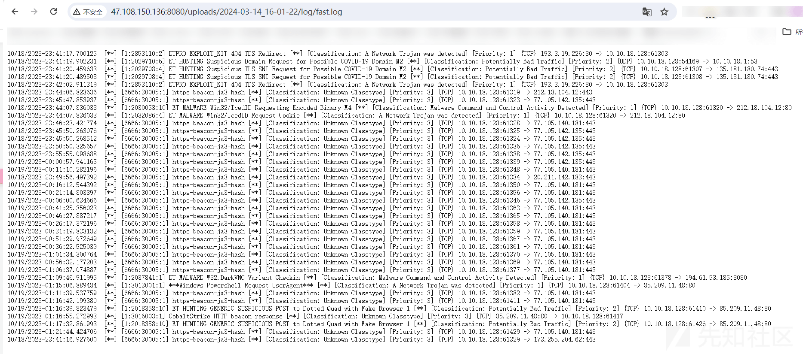](https://xzfile.aliyuncs.com/media/upload/picture/20240315151622-ed15ffe8-e29b-1.png)

我们在对现有各厂商流量产品做分析时，几乎不能避免会遇到大量的告警信息，如何在大量告警信息中去做有威胁挖掘就比较考研分析人员能力了。

```plain
可以自己上案例传数据包分析得到上图中的告警信息。
也可以通过访问此链接直接获取，都阔以。
http://47.108.150.136:8080/uploads/2024-03-14_16-01-22/log/fast.log
```

# 二、入侵案例全链路、涉及通讯流量告警分析

## 2.1 访问合法网站被重定向下载恶意”.VBS“文件

访问合法但受到污染的网站”vippartyrentals.net“资源，被重定向至”hxxps://precisiongroupsa.com/wqmfths“。

[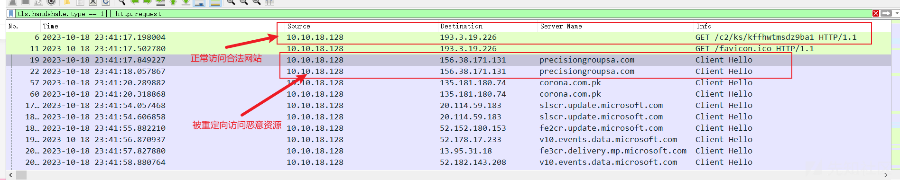](https://xzfile.aliyuncs.com/media/upload/picture/20240315151713-0be54672-e29c-1.png)  
重定向手法如下如下。

[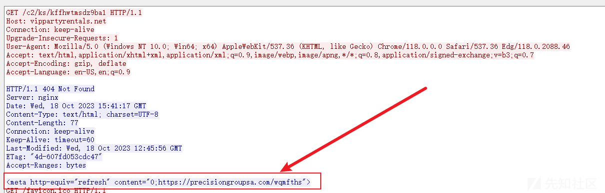](https://xzfile.aliyuncs.com/media/upload/picture/20240315151723-11b9f250-e29c-1.png)  
此流程涉及通讯流量触发规则告警信息如下。

-   ***ETPRO EXPLOIT\_KIT 404 TDS Redirect***，（告警说明：访问一个状态码为 404 网站，但是 http 响应体中有重定向资源，这显然是不合理的，此情况下重定向访问的资源十有八九九九是恶意的）

## 2.2”.VBS“执行释放”IcedID“木马程序

被重定向后下载了一个恶意的压缩包 (TLS 流量)，解压之后是一个”.VBS“文件文件。

[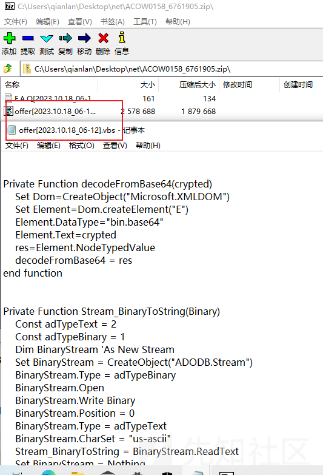](https://xzfile.aliyuncs.com/media/upload/picture/20240315151739-1b6e6470-e29c-1.png)  
执行此 VBS 文件会释放%temp%/QzlWtcd/IXwmcoBtgW.dll，此 dll 是 IcedID（又称为 BokBot）的木马程序，并使用了 Windows 系统自带的 regsvr32.exe 执行此 DLL，dll 程序会下载后续载荷。

[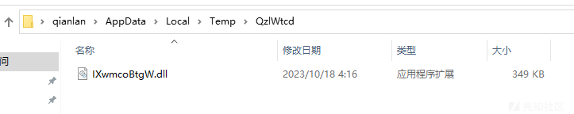](https://xzfile.aliyuncs.com/media/upload/picture/20240315151759-275e4de0-e29c-1.png)

## 2.3 IcedID 木马下载伪装为 GZIP 文件的二进制文件，释放 IcedID 木马变体

木门程序继续执行，向域名”modalefastnow.com“请求下载持久化载荷资源，分别做了 https 和 http 的访问。

[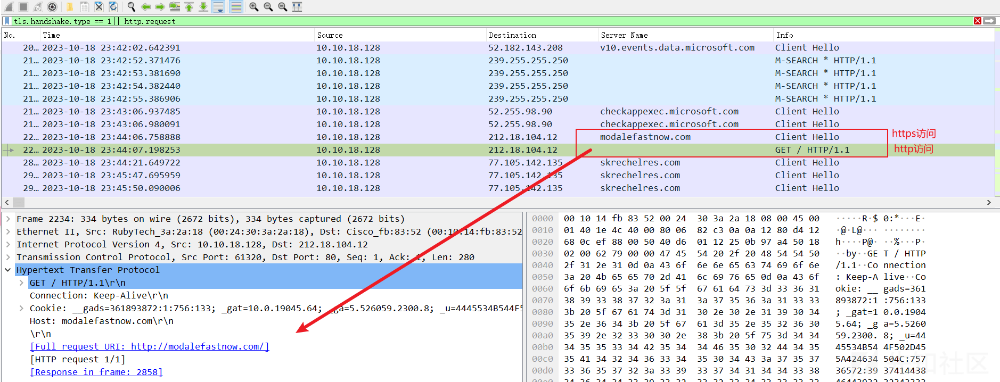](https://xzfile.aliyuncs.com/media/upload/picture/20240315151811-2e6d18aa-e29c-1.png)  
在 http 访问中可以看到响应头中 Content-Type 字段为”application/gzip“，返回数据文件头是“1f8b08”的 gzip 文件头，但还原为文件尝试解压发现失败，实际上并非压缩包文件，而是下载到主机后通过文件流处理后释放木马的持久化模块 DLL。

[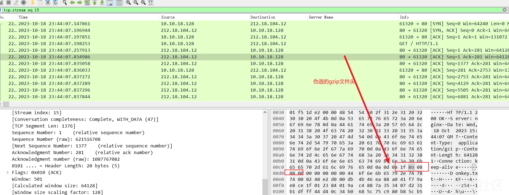](https://xzfile.aliyuncs.com/media/upload/picture/20240315151824-363082fc-e29c-1.png)  
从流量中还文件，并原尝试解压失败。

[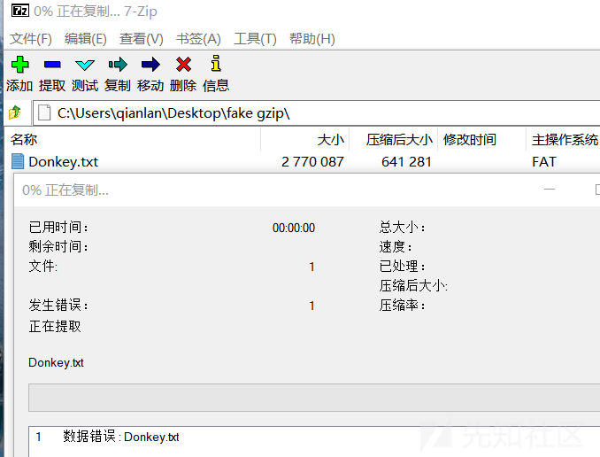](https://xzfile.aliyuncs.com/media/upload/picture/20240315151848-447a42d0-e29c-1.png)  
经过文件流处理，最终释放木马持久化 DLL 文件（实际上也是拥有完整功能的木马，可以理解为 ICEDID 的变体），C:\\Users\[username\]\\user\\AppData\\Local\[username\]\\Vijeum3.dll。

[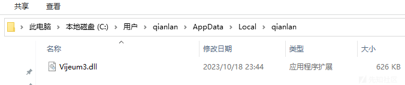](https://xzfile.aliyuncs.com/media/upload/picture/20240315151908-505cfb6a-e29c-1.png)  
此流程涉及通讯流量触发规则告警信息如下。

-   ***ET MALWARE Win32/IcedID Requesting Encoded Binary M4***，（告警说明：匹配木马活动，IcedID 木马发送 http 请求的二进制编码特征）
-   ***ET MALWARE Win32/IcedID Request Cookie***，（告警说明：匹配木马活动，IcedID 木马发送 http 请求的 cookie 特征）

## 2.4 IcedID 木马变体连接 C2 地址

IcedID 木马变体执行，连接 C2 地址，因为我的平台没有放黑名单库所以没有告警（黑名单体积庞大，我的小云服务器扛不住），但是可以借助开源威胁情报平台，看看这三个域名性质。

[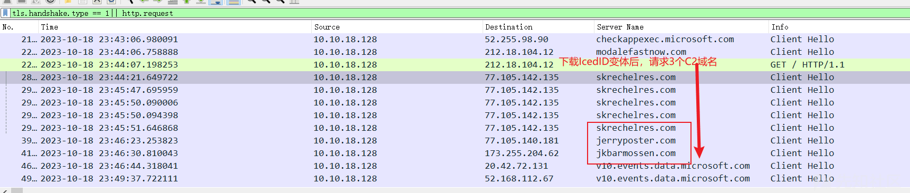](https://xzfile.aliyuncs.com/media/upload/picture/20240315151944-65df6806-e29c-1.png)  
skrechelres.com

[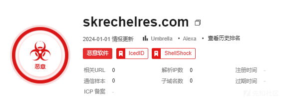](https://xzfile.aliyuncs.com/media/upload/picture/20240315151958-6de09246-e29c-1.png)  
jerryposter.com

[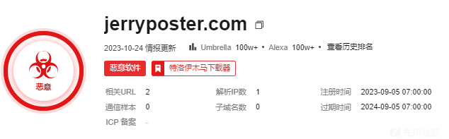](https://xzfile.aliyuncs.com/media/upload/picture/20240315152006-72cff90e-e29c-1.png)  
jkbarmossen.com，其他一个情报渠道都标记了。

[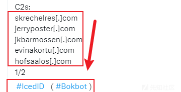](https://xzfile.aliyuncs.com/media/upload/picture/20240315152010-7547ad44-e29c-1.png)

## 2.5 IcedID 的 BackConnect VNC 模块执行，回连至控制端

变种 IcedID 木马 Vijeum3.dll 运行不久以后，启动了反向 VNC 功能 (可以理解为反向 shell)，BackConnect VNC 是 IcedID 木马的功能模块，回连至攻击者控制机器，从而使攻击者能够远程访问和控制受害者系统。

[](https://xzfile.aliyuncs.com/media/upload/picture/20240315152034-8390a928-e29c-1.png)  
此流程涉及通讯流量触发规则告警信息如下。

-   **\*ET MALWARE W32.DarkVNC Variant Checkin**，（告警说明：匹配到了 DarkVNC 变体的通讯流量，可能 IcedID 的反向 VNC 模块就是 DarkVNC 改的）

## 2.6 下载 COBALT STRIKE 载荷并执行，回连至 C2 心跳包周期 5 秒

通过回连的 VNC 获取权限后，从外部下载“http64.exe”的 PE 文件，该 PE 文件是 COBALT STRIKE 木马载荷。

[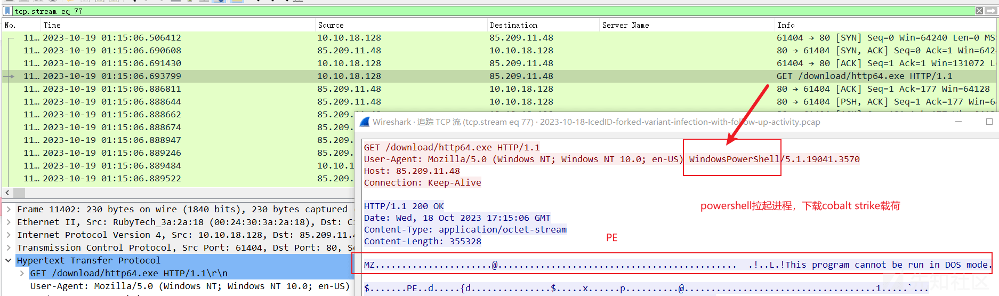](https://xzfile.aliyuncs.com/media/upload/picture/20240315152052-8e22fbe8-e29c-1.png)  
20 秒后，从流量中可以看到对“hxxp://85.209.11.48/pixel.gif”间隔为 5 秒的规律请求，这是 COBALT STRIKE 木马的 http 心跳数据包。

[](https://xzfile.aliyuncs.com/media/upload/picture/20240315152114-9b20df18-e29c-1.png)  
从开源情报渠道也可以获取一些信息。

[](https://xzfile.aliyuncs.com/media/upload/picture/20240315152121-9fb31b22-e29c-1.png)  
此流程涉及通讯流量触发规则告警信息如下。

-   ***CobaltStrike HTTP beacon response***，（告警说明：匹配到 CobaltStrike 木马 http beacon 的响应数据包。）
-   ***Windows Powershell Request UserAgent***，（告警说明：powershell 出现在 http.user-agent 中，表明相关 http 请求是 powerhsell 发起的，并非人为访问网站。可见下载实体（可能是 IcedID）调用的是 powershell。）
-   ***ET HUNTING GENERIC SUSPICIOUS POST to Dotted Quad with Fake Browser 1***（告警说明：假冒的浏览器 User-Agent，没记错的话这是 CobaltStrike 的 3.x 中 http 请求的一个弱特征）。

## 2.7 下载 screnconnect 工具并且运行

从相同恶意 IP 下载 screnconnect 工具（可以类比 anydesk），很显然也是恶意行径，利用合法工具去做恶意远程控制，可以规避防火墙、安全软件等查杀。

下载 screnconnect 软件。

[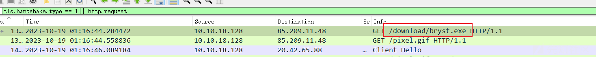](https://xzfile.aliyuncs.com/media/upload/picture/20240315152214-befc7e9c-e29c-1.png)

screnconnect 工具执行，请求相关域名（在官方提供的第三方平台完成认证和连接建立，与向日葵、anydesk 等类似，所以会请求域名）  
[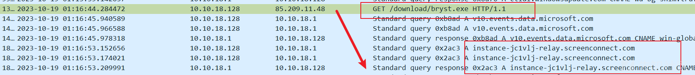](https://xzfile.aliyuncs.com/media/upload/picture/20240315152201-b76b598c-e29c-1.png)  
这里的请求 http.user-agent 就没有出现 powershell，说明 http 请求不是同一个进程实体拉起的。

# 三、告警数据包定位和研判

这里就不逐个分析了，分析几个比较重要的，对于其他的你如果感兴趣或者想搞明白，后台私信我，我把规则原文发给你。

## 3.1 检测到 http 响应 404 状态码，但是恶意存在重定向

-   定位

根据告警信息五元组，在定位 http 响应即可，再准确一点加个状态码 404

```plain
ip.src==193.3.19.226&&http.response.code==404
```

[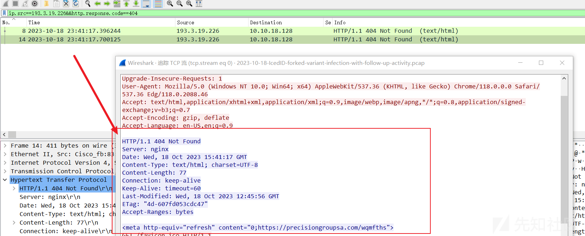](https://xzfile.aliyuncs.com/media/upload/picture/20240315152237-cd29da28-e29c-1.png)

-   研判

说明用户 IP 10.10.18.128 访问了一个恶意界面，下载的恶意资源有导致受控的风险。经典钓鱼手法，404 界面迷惑用户，再重定向至指定 url 下载恶意资源载荷，响应体如下。

```plain
HTTP/1.1 404 Not Found
Server: nginx
Date: Wed, 18 Oct 2023 15:41:17 GMT
Content-Type: text/html; charset=UTF-8
Content-Length: 77
Connection: keep-alive
Keep-Alive: timeout=60
Last-Modified: Wed, 18 Oct 2023 12:45:56 GMT
ETag: "4d-607fd053cdc47"
Accept-Ranges: bytes

<meta http-equiv="refresh" content="0;https://precisiongroupsa.com/wqmfths">
```

## 3.2 检测到 IcedID 木马 http 请求

-   定位

触发两条规则的实际上是同一个数据包，这里可能要对 IcedID 分析，从样本中提取外连域名“modalefastnow.com”，在通讯流量中发现对此域名解析的结果是 212.18.104.12。

```plain
dns.qry.name==modalefastnow.com
```

[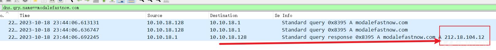](https://xzfile.aliyuncs.com/media/upload/picture/20240315152252-d61bc66e-e29c-1.png)  
在定位于此 IP 的通讯 http 或 https 请求即可。

[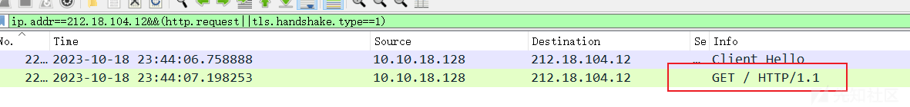](https://xzfile.aliyuncs.com/media/upload/picture/20240315152454-1ec41308-e29d-1.png)

```plain
ip.addr==212.18.104.12&&(http.request||tls.handshake.type==1)
```

[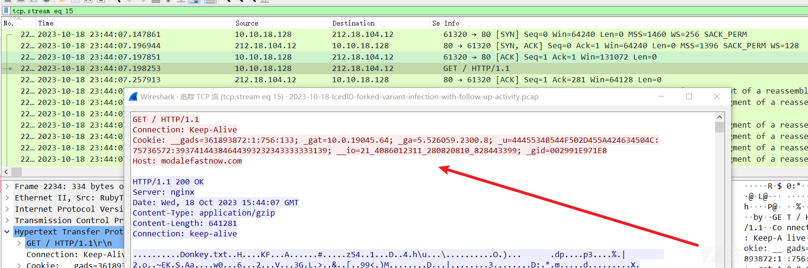](https://xzfile.aliyuncs.com/media/upload/picture/20240315152554-4291aba6-e29d-1.png)  
规则匹配的实际上是其中的 cookie 字段中的键值对中的多个“键”和 hex 流。

-   研判

本地资产 IP 10.10.18.128 访问 IcedID 木马 C2 域名“modalefastnow.com”，说明 IP 10.10.18.128 中马导致受控。

## 3.3 HTTP 请求中出现 Powershell User-Agent

-   定位

按照如下过滤规则和字符搜索即可定位触发告警信息的数据包。

[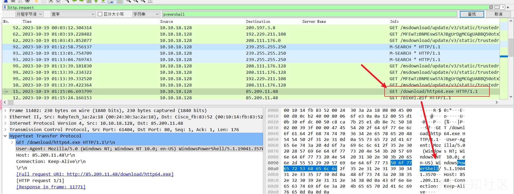](https://xzfile.aliyuncs.com/media/upload/picture/20240315152621-52816f6a-e29d-1.png)  
追踪流可以看到 HTTP 请求中出现 Powershell User-Agent

[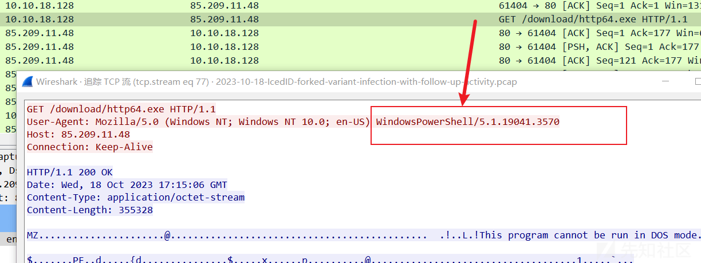](https://xzfile.aliyuncs.com/media/upload/picture/20240315152630-57af10fa-e29d-1.png)

-   研判

本地资产 IP 10.10.18.128 通过 powershell 进程对 IP 85.209.11.48 发起 http 请求，这里下载的就是 COBALT STRIKE 载荷，说明拉起此 powershell 进程的实体为恶意，内网资产 IP 10.10.18.128 疑似中下载者木马。

## 3.4 检测到 CobaltStrike http 形式的 beacon 响应

-   定位

这实际上是个 CobaltStrike 响应的弱特征，在生产环境中有误报概率，规则匹配东西比较多，而且是按统计维度和字符组合匹配的，规则原文如下。

```plain
alert http $EXTERNAL_NET any -> $HOME_NET any (msg: "CobaltStrike HTTP beacon response"; flow: established; content:"200"; http_stat_code; content:!"Server:"; http_header; content:"application/octet-stream"; http_header; distance:0;  content:"Content-Length: 0"; http_header; distance:0; threshold: type both, track by_src, count 5, seconds 60;
```

如果你感觉不好研判或者不好把握可以去，开源情报渠道看看，比如这个 IP 就明确的是 C2。

[](https://xzfile.aliyuncs.com/media/upload/picture/20240315153405-6729f21a-e29e-1.png)

-   研判

本地本地资产 IP 10.10.18.128 与外部 IP 85.209.11.48 通讯流量中发现 CobaltStrike 木马铜须特征，结合开源威胁情报确认本地资产 IP 10.10.18.128 受控行为。

- - -

对这些告警信息做研判分析，从时间维度、恶意资源执行流程等，就可以梳理到完整链路。

感谢靓仔你有耐心读完，这个系列都会以类似方式记录和整理，案例驱动学习是很高效的。
