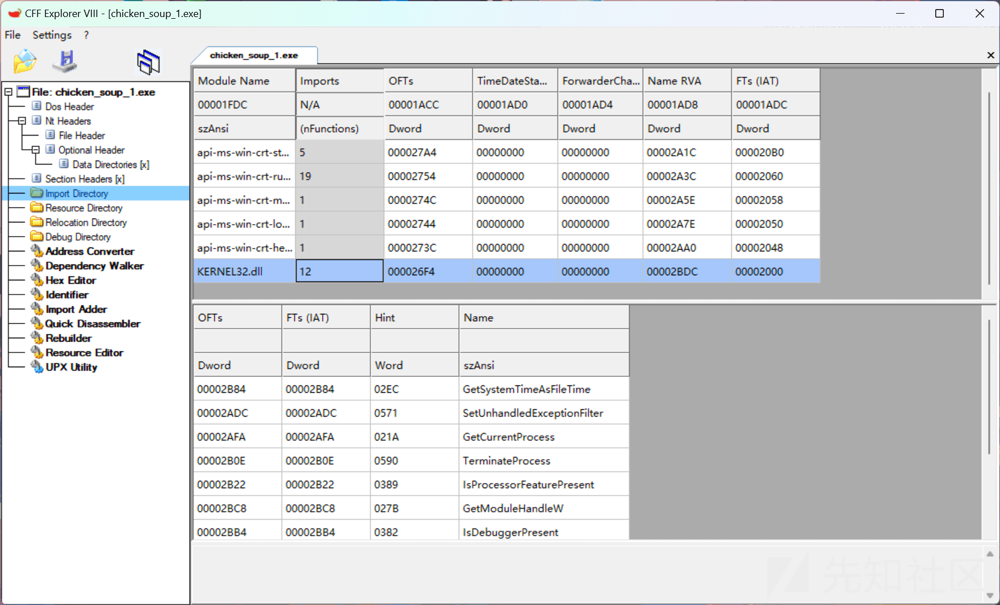
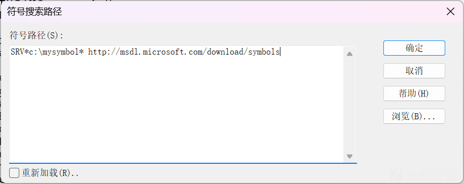
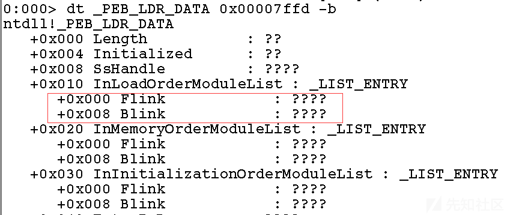
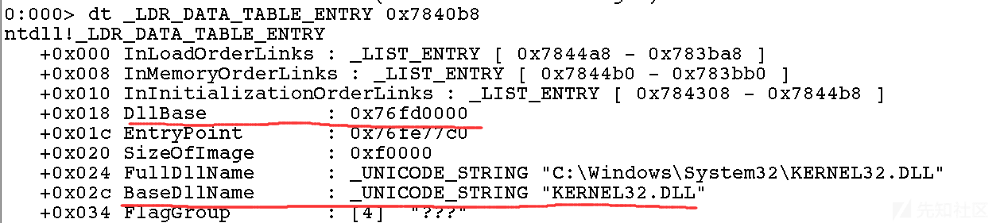
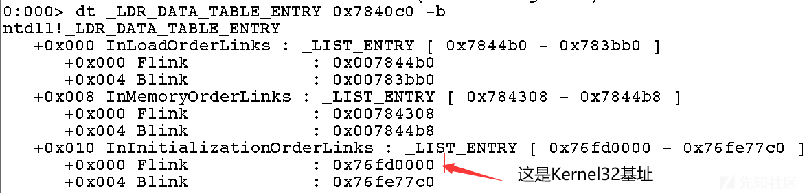
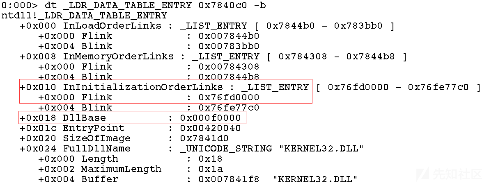

# 意外的 Kernel32 基址寻址 - 先知社区

意外的 Kernel32 基址寻址

- - -

### 前言

在 PE 文件结构中有个十分重要的东西，也是杀软进行静态分析时常死盯着的，那就是我们的导入表 (Import Directory)，内含了该文件运行时调用的 DLL 文件以及导出函数。  
[](https://xzfile.aliyuncs.com/media/upload/picture/20240315131108-6eeb8f9a-e28a-1.png)

```plain
如果我们编写脚本时使用Windows库内自带的API，那么这些DLL文件以及包含在内的导出函数便会一览无余得暴露出来，所以我们需要将这些都隐藏掉实现导入表隐藏。如何实现最重要的一步就是通过PEB找到我们的Kernel32基址。
```

### Windbg 调试中遇到的问题与解决

Windbg 的使用及安装教程网上资料很多就不多说了，主要提一下在调试时遇到的几个问题。  
1、在附加进程时出现错误，先尝试以管理员权限启动 Windbg 再附加，若仍然报错则直接 File->Open Executable File 直接启动任意一个可执行文件也是可以进行调试的，和附加是一样的。  
2、调试过程中发生错误 Symbol \_PEB 不存在等等之类的，在符号搜索路径 (Symbol File Path Search) 中添加路径：SRV*c:\\mysymbol* [http://msdl.microsoft.com/download/symbols](http://msdl.microsoft.com/download/symbols) 即可。  
3、查询至 InloadOrderMudleList 中的 Flink，Blink 双向链表时其地址为？？？，这是操作系统对内核数据结构的保护进行的隐藏，我分别在 Win10，Win10 (虚拟机)，Win11 三台机器上操作发现只有 Win10 (虚拟机) 进行了字段隐藏，只显示？？？，这个问题我也不知道怎么解决，看情况应该是只有虚拟机会出现，还望懂的大佬能帮一手。

[](https://xzfile.aliyuncs.com/media/upload/picture/20240315131159-8cf87868-e28a-1.png)

[](https://xzfile.aliyuncs.com/media/upload/picture/20240315131210-93c6b79a-e28a-1.png)

### Kernel32 基址寻址的两条路线

如何使用 Windbg 在 PEB 寻找到 kernel32 基址这里不展开说了有很多相关的文章可以看，这里主要的内容是我在调试寻址过程中发现的一些问题。  
第一条路线：这是最常见的一条即通过 InloadOrderMudleList:Flink 这条链一直往下跟就能找到 Kernel32 的 DllBase，汇编代码：

```plain
mov eax, fs:[0x30]     //找PEB
mov eax, [eax + 0x0c]  //获取Ldr
mov eax, [eax + 0x0c]  //获取InloadOrderMudleList:Flink
mov eax, [eax]         //获取InloadOrderLinks:Flink => xxx.exe
mov eax, [eax]         //获取InloadOrderLinks:Flink => ntdll.dll
mov eax, [eax + 0x18]  //获取kernel32 DLLBase也就是基地址
mov dwKernel32Addr, eax
```

```plain
第二条路线：在最先开始研究的时候我以为这条路线就是第一条路线，但随着调试的过程中发现这地址不对啊！我还以为是操作系统造成的区别导致地址不一，但是我运行了这两段代码都成功指向同一个地址也就是我们的Kernel32的基址
```

```plain
mov eax, fs: [0x30]      //找到PEB
mov eax, [eax + 0x0c]    //找LDR
mov eax, [eax + 0x14]    //InMemoryOrderModuleList:Flink
mov eax, [eax]           //InLoadOrderLinks:"shellcode.exe"
mov eax, [eax]           //InLoadOrderLinks:"ntdll.dll"
mov eax, [eax + 0x10]    //InInitializationOrderLinks:Flink => DllBase"kernel32.dll"
mov dwKernel32Addr, eax
```

仔细观察上述两段寻址汇编会发现除了获取 Ldr 内的 MudleList 不同和最后不同，其他找的步骤都是一样，那我们看看两条路线在 Windbg 中最后分别是什么

[](https://xzfile.aliyuncs.com/media/upload/picture/20240315131244-a7c35f0a-e28a-1.png)

[](https://xzfile.aliyuncs.com/media/upload/picture/20240315131258-b0325ef2-e28a-1.png)

可以很明显看到这两个字段都指向了 0x76fd0000，但是后面为什么 InInitializationOrderLinks:Flink 的地址就是 Kernel32 基址而不是 DLLBase 呢？根据网上众多资料收集来的信息来看可能是因为版本的原因造成的，其真正的基址需要在 DllBase 的地址上回滚 8 个字节 (也就是图中从 0x18 ==> 0x10)，所以才变成了 Flink 的地址。其中 Ldr 内三个模块都能找到 Kernel32 基址 (除了上述两条还有 InInitializationOrderModuleList)，只不过现在只有第一条路线是不需要回滚字节的。

[](https://xzfile.aliyuncs.com/media/upload/picture/20240315131400-d546d1a0-e28a-1.png)

**至于要回滚字节的背后的底层原因我也不是很清楚，还望知道的大佬教教～～**

参考资料：  
[https://bbs.kanxue.com/thread-266678.htm#msg\_header\_h1\_5](https://bbs.kanxue.com/thread-266678.htm#msg_header_h1_5)
