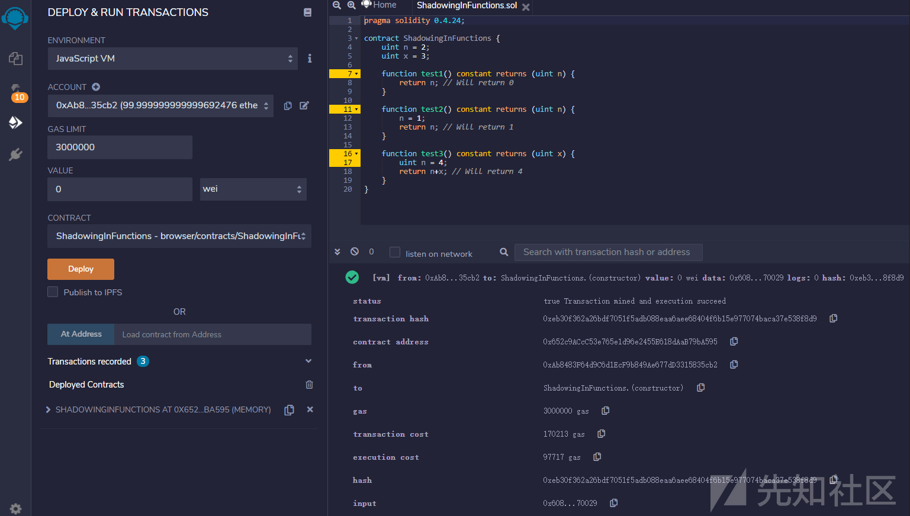
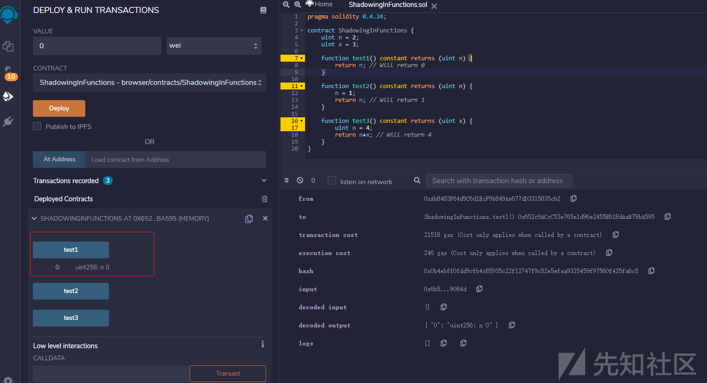
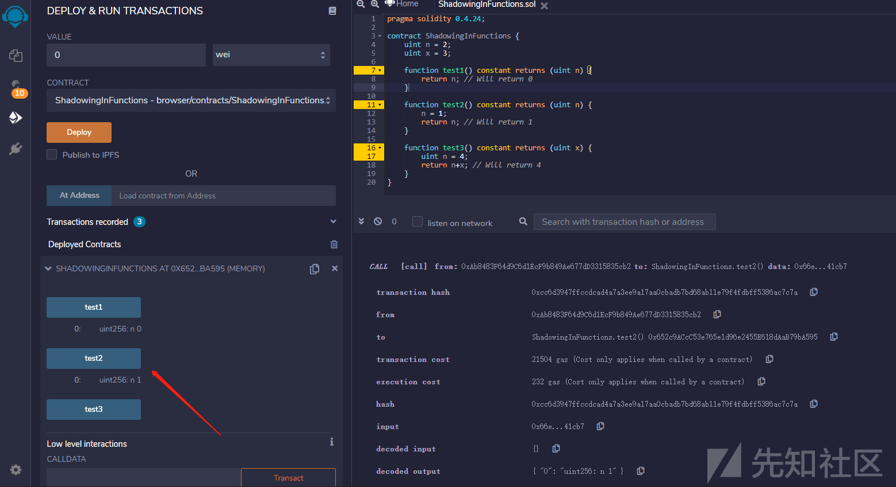
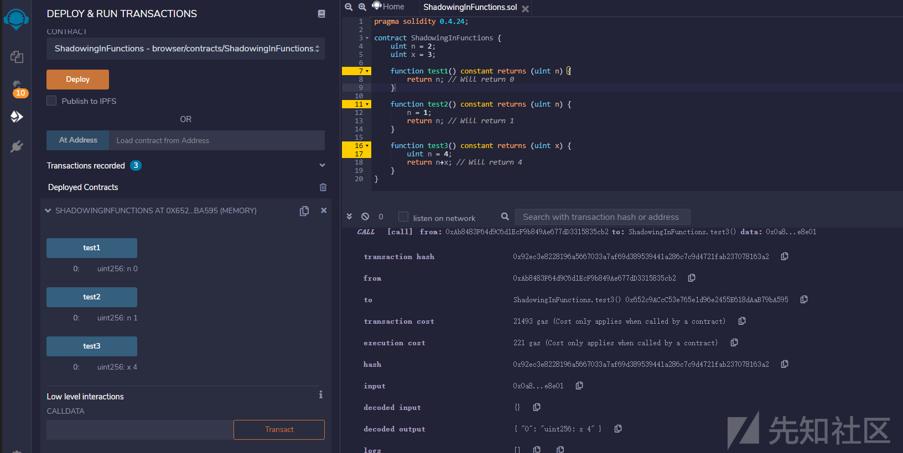
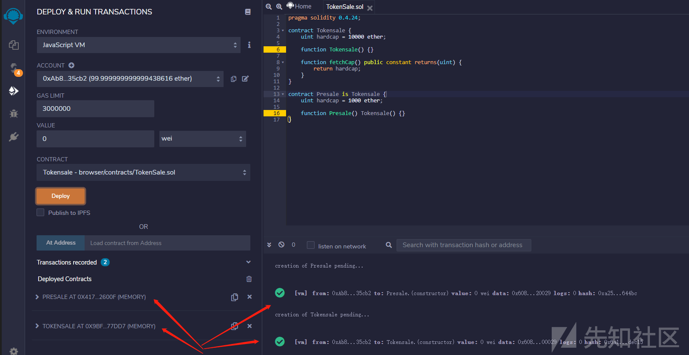
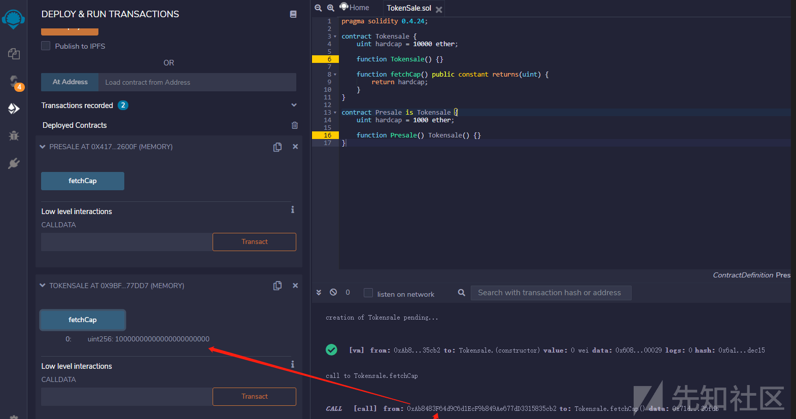
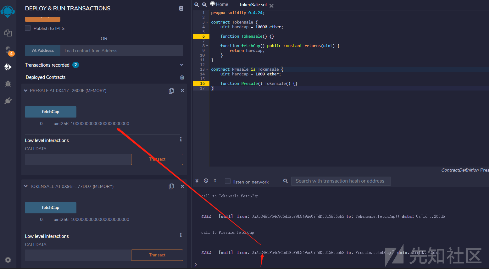
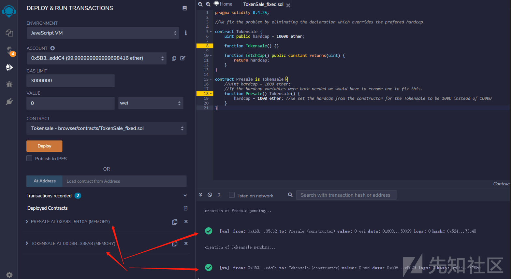
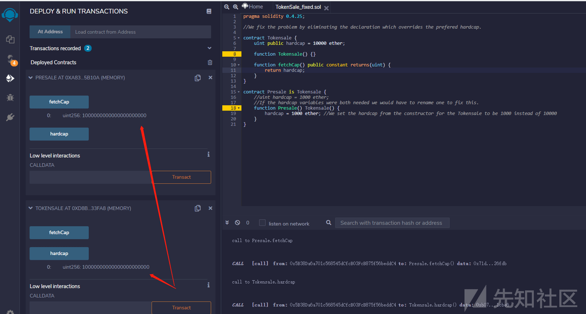

# 智能合约安全之变量歧义命名 - 先知社区

## 文章前言

Solidity 允许在继承时对状态变量进行歧义命名，定义有变量 x 的合约 A 可以继承同样含有状态变量 x 的合约 B，这将导致两个单独版本的 x，一个可以从合约 A 访问，而另一个则需要从合约 B 访问，在更复杂的合约系统中这种情况可能不会引起注意并随后导致严重的安全问题，本篇文章将对此特例进行演示介绍说明

## 基本介绍

Solidity 中变量按作用域划分有三种 ———— 状态变量 (state variable)，局部变量 (local variable) 和全局变量 (global variable)

**状态变量**

状态变量是数据存储在链上的变量，所有合约内函数都可以访问，状态变量在合约内、函数外声明，例如：

```plain
contract A {
    uint public x = 121;
    uint public y;
    string public z;
}
```

我们也可以在函数里更改状态变量的值：

```plain
function B() external{
        x = 5;
        y = 2;
        z = "0xFF";
    }
```

**局部变量**

局部变量是仅在函数执行过程中有效的变量，函数退出后变量无效，局部变量的数据存储在内存里，不上链，局部变量在函数内声明：

```plain
function QWQ() external pure returns(uint){
        uint xxx = 1;
        uint yyy = 3;
        uint zzz = xxx + yyy;
        return(zxz);
}
```

**全局变量**

全局变量是全局范围工作的变量，都是 solidity 预留关键字，他们可以在函数内不声明直接使用：

```plain
function QAZ() external view returns(address, uint, bytes memory){
        address sender = msg.sender;
        uint blockNum = block.number;
        bytes memory data = msg.data;
        return(sender, blockNum, data);
    }
```

## 漏洞示例

下面我们先通过编译器编译构造合约来进行一个简单的测试看看局部变量与全局变量之间的关系：

```plain
pragma solidity 0.4.24;

contract ShadowingInFunctions {
    uint n = 2;
    uint x = 3;

    function test1() constant returns (uint n) {
        return n; // Will return 0
    }

    function test2() constant returns (uint n) {
        n = 1;
        return n; // Will return 1
    }

    function test3() constant returns (uint x) {
        uint n = 4;
        return n+x; // Will return 4
    }
}
```

首先部署合约：  
[](https://xzfile.aliyuncs.com/media/upload/picture/20240314145732-21a81d12-e1d0-1.png)  
随后我们调用 test1 函数来测试当同名的全局变量与局部变量同时存在且局部变量未初始化时局部变量作何回应 ——0：

[](https://xzfile.aliyuncs.com/media/upload/picture/20240314145800-3204854c-e1d0-1.png)  
调用 test2 函数来测试当同名的全局变量与局部变量同时存在且局部变量初始化时局部变量作何回应 — 局部变量：  
[](https://xzfile.aliyuncs.com/media/upload/picture/20240314145822-3f43298e-e1d0-1.png)  
调用 test3 函数来测试当同名的全局变量与局部变量同时存在且局部变量已初始化并与另一个全局变量进行数值运算时作何回应 —— 当前局部变量与所需的全局变量进行数值运算：  
[](https://xzfile.aliyuncs.com/media/upload/picture/20240314145853-516b6bd0-e1d0-1.png)  
下面我们再来看一个示例，合约 TokenSale.sol 代码如下：

```plain
pragma solidity 0.4.24;

contract Tokensale {
    uint hardcap = 10000 ether;

    function Tokensale() {}

    function fetchCap() public constant returns(uint) {
        return hardcap;
    }
}

contract Presale is Tokensale {
    uint hardcap = 1000 ether;

    function Presale() Tokensale() {}
}
```

部署以上两个合约：

[](https://xzfile.aliyuncs.com/media/upload/picture/20240314145929-6736bb68-e1d0-1.png)  
之后调用 Tokensale 合约的 fetchCap 函数来查看 hardcap 的数值 —10000000000000000000000=10000ether：  
[](https://xzfile.aliyuncs.com/media/upload/picture/20240314145946-716bde38-e1d0-1.png)  
之后调用继承自 TokenSale 合约的 Presale 合约中 fetchCap 函数来查看继承合约中的 hardcap 的数值是多少：  
10000000000000000000000=10000ether：

[](https://xzfile.aliyuncs.com/media/upload/picture/20240314150009-7f05cae0-e1d0-1.png)  
由此可见 Presale 合约中的同名变量 hardcap 并未起到预期的作用，在调用 fetchCap 时使用的变量 hardcap 依旧源自 fetchCap 函数所处的合约上下文环境

## 防御措施

检查合约系统的存储变量布局并消除歧义，下面是修改上面示例二中修改后的合约代码：  
TokenSale\_fixed.sol

```plain
pragma solidity 0.4.25;

//We fix the problem by eliminating the declaration which overrides the prefered hardcap.

contract Tokensale {
    uint public hardcap = 10000 ether;

    function Tokensale() {}

    function fetchCap() public constant returns(uint) {
        return hardcap;
    }
}

contract Presale is Tokensale {
    //uint hardcap = 1000 ether;
    //If the hardcap variables were both needed we would have to rename one to fix this.
    function Presale() Tokensale() {
        hardcap = 1000 ether; //We set the hardcap from the constructor for the Tokensale to be 1000 instead of 10000
    }
}
```

首先部署上述两个合约：

[](https://xzfile.aliyuncs.com/media/upload/picture/20240314150054-9a0cba56-e1d0-1.png)  
之后调用 fetchCap 进行测试，效果如下所示：  
[](https://xzfile.aliyuncs.com/media/upload/picture/20240314150122-aa7a3a62-e1d0-1.png)

## 文末小结

在复杂性合约逻辑设计过程中对于变量名称的定义建议具备 "专名专用" 的特性，同时对全局变量与局部变量进行合理使用，同时需要注意变量的初始化
