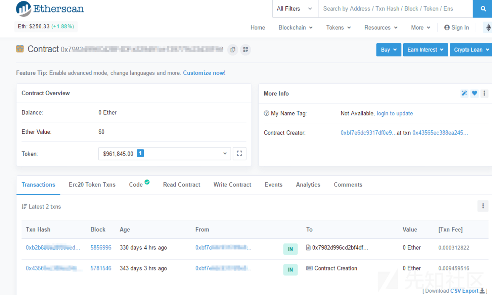
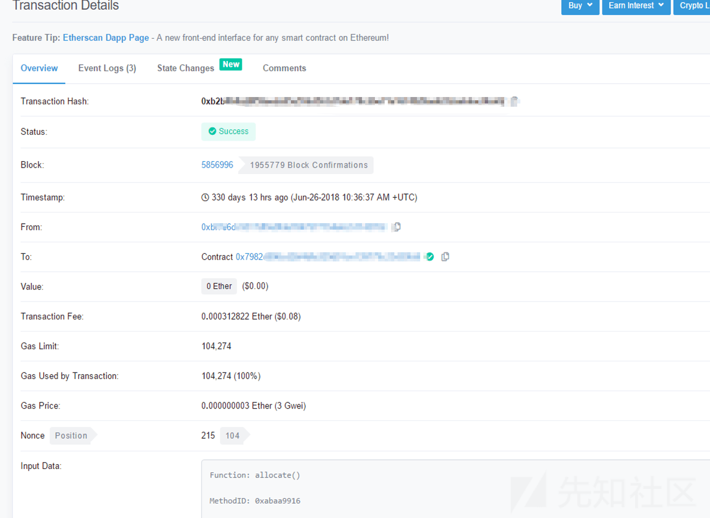
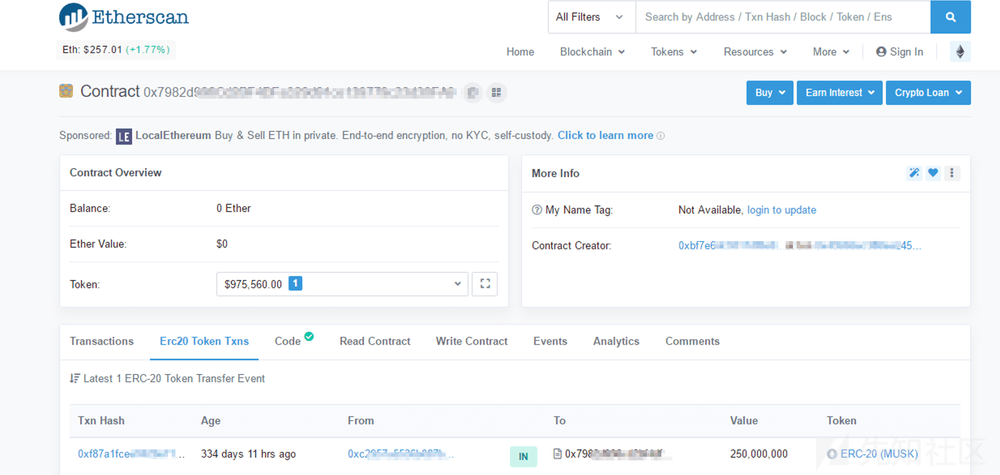
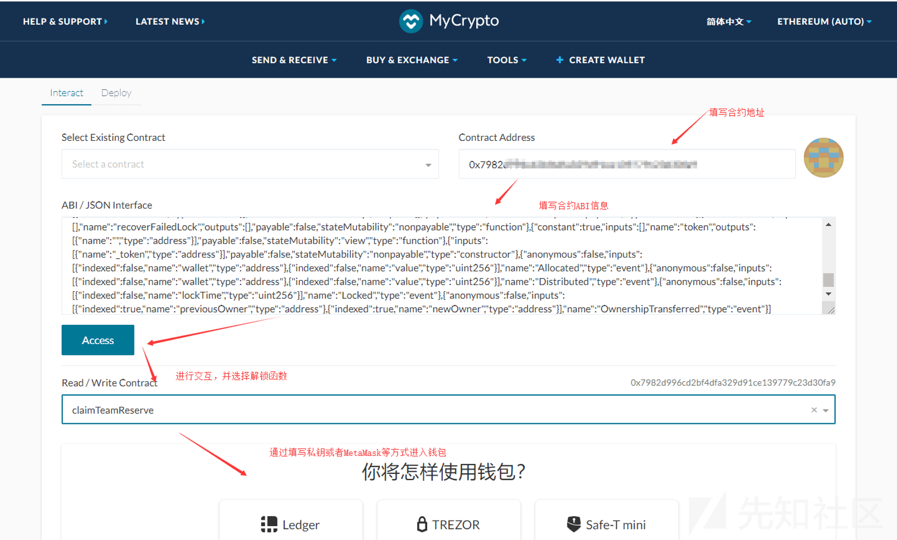
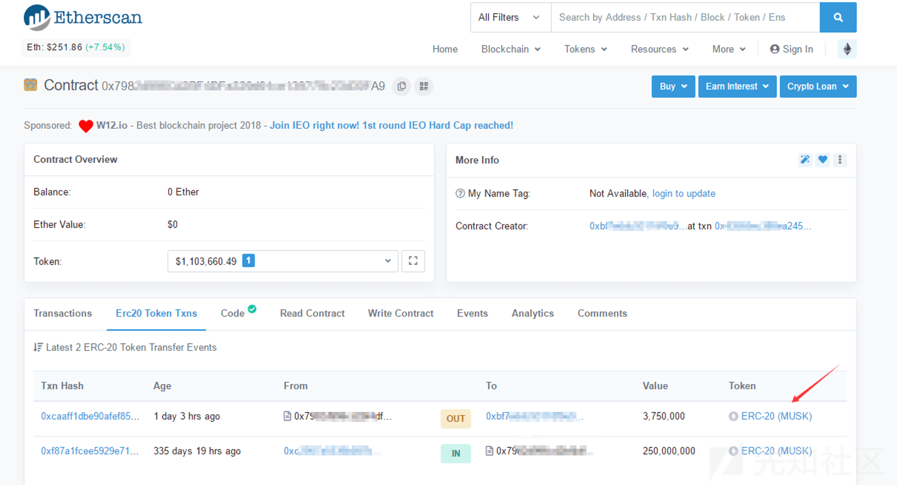

# 某次锁仓合约应急响应分析记录 - 先知社区

## 背景介绍

在之前的一次应急响应中有客户反馈某合约在上X币交易所的时候，按照交易所的要求曾找人写了锁仓合约并完成了2.5亿某代币的锁仓操作，本来应该是三个月解锁一次，两年解锁完毕，然而一年快过去了，一笔解锁款都没有收到，客户感到很是费解，这和预期的有很大的差入，所以需要帮忙查看究竟是代码问题，还是操作问题并尽最大的可能将未解锁的合约代币进行解锁操作

## 锁仓合约

智能合约中的锁仓合约是一种功能强大的合约，它用于将加密货币或数字资产锁定在一个特定的账户中以实现一定的安全性和可控性，锁仓合约通常被用于以下几个方面：

-   基本锁仓：锁仓合约可用于将加密货币或数字资产锁定在一个特定的账户中一段预定的时间，这可以用于各种情况，例如：长期投资、团队解锁、ICO众筹等，在锁仓期间，资产将无法被转移或使用，直到锁仓期满
-   投票权锁定：一些项目或组织可能会使用锁仓合约来限制投资者或持有者的投票权以防止他们在短期内大量投票或操纵决策，在这种情况下锁仓合约可以将一定数量的代币或股份锁定在账户中直到特定的条件满足
-   奖励和激励计划：锁仓合约也可以用于奖励和激励计划，特别是在加密货币项目中，项目团队可以锁定一部分代币或股份以作为未来的奖励或激励分配给特定的个人或团队，这可以帮助确保项目的成功和可持续发展
-   安全保障：锁仓合约还可以用于提供额外的安全保障，通过将资产锁定在一个合约中可以防止黑客攻击或非法访问，这对于保护大量资产或敏感信息非常重要

## 分析过程

### 初次分析

第一次分析的时候客户提供了锁仓合约的代码，只是对锁仓解锁的业务逻辑进行了分析并没有彻底发现问题，基本的流程分析流程大致如下：  
首先查看了合约代码，发现其中的锁仓部分代码中代币分配总量：2.5亿，耗费两年时间分配完成，其中每隔三个月解锁一次

```plain
contract xxxx is Ownable {
    using SafeMath for uint256;

    //Wallet Addresses for allocation
    address public teamReserveWallet = 0xA;
    address public finalReserveWallet = =0xA;

    //Token Allocations
    uint256 public teamReserveAllocation = 240 * (10 ** 6) * (10 ** 18);
    uint256 public finalReserveAllocation = 10 * (10 ** 6) * (10 ** 18);

    //Total Token Allocations
    uint256 public totalAllocation = 250 * (10 ** 6) * (10 ** 18);

    uint256 public teamTimeLock = 2 * 365 days;
    uint256 public teamVestingStages = 8;
    uint256 public finalReserveTimeLock = 2 * 365 days;

    /** Reserve allocations */
    mapping(address => uint256) public allocations;

    /** When timeLocks are over (UNIX Timestamp)  */  
    mapping(address => uint256) public timeLocks;

    /** How many tokens each reserve wallet has claimed */
    mapping(address => uint256) public claimed;

    /** When this vault was locked (UNIX Timestamp)*/
    uint256 public lockedAt = 0;

    MuskToken public token;

    /** Allocated reserve tokens */
    event Allocated(address wallet, uint256 value);

    /** Distributed reserved tokens */
    event Distributed(address wallet, uint256 value);

    /** Tokens have been locked */
    event Locked(uint256 lockTime);

    //Any of the three reserve wallets
    modifier onlyReserveWallets {
        require(allocations[msg.sender] > 0);
        _;
    }
```

锁仓时间为两年：

```plain
function allocate() public notLocked notAllocated onlyOwner {

        //Makes sure Token Contract has the exact number of tokens
        require(token.balanceOf(address(this)) == totalAllocation);

        allocations[teamReserveWallet] = teamReserveAllocation;
        allocations[finalReserveWallet] = finalReserveAllocation;

        Allocated(teamReserveWallet, teamReserveAllocation);
        Allocated(finalReserveWallet, finalReserveAllocation);

        lock();
    }

    //Lock the vault for the wallets
    function lock() internal notLocked onlyOwner {

        lockedAt = block.timestamp;

        timeLocks[teamReserveWallet] = lockedAt.add(teamTimeLock);
        timeLocks[finalReserveWallet] = lockedAt.add(finalReserveTimeLock);

        Locked(lockedAt);
    }
```

如果锁仓失败则允许所有者收回合约上的token并回收token

```plain
//In the case locking failed, then allow the owner to reclaim the tokens on the contract.
    //Recover Tokens in case incorrect amount was sent to contract.
    function recoverFailedLock() external notLocked notAllocated onlyOwner {

        // Transfer all tokens on this contract back to the owner
        require(token.transfer(owner, token.balanceOf(address(this))));
    }
```

而锁仓的代币中的0.1亿总量在2年后一次性分配：

```plain
//Claim tokens for final reserve wallet
    function claimTokenReserve() onlyTokenReserve locked public {

        address reserveWallet = msg.sender;

        // Can't claim before Lock ends
        require(block.timestamp > timeLocks[reserveWallet]);

        // Must Only claim once
        require(claimed[reserveWallet] == 0);

        uint256 amount = allocations[reserveWallet];

        claimed[reserveWallet] = amount;

        require(token.transfer(reserveWallet, amount));

        Distributed(reserveWallet, amount);
    }
```

2.4亿总量每三个月解锁一次：

```plain
//Claim tokens for Musk team reserve wallet
    function claimTeamReserve() onlyTeamReserve locked public {

        uint256 vestingStage = teamVestingStage();

        //Amount of tokens the team should have at this vesting stage
        uint256 totalUnlocked = vestingStage.mul(allocations[teamReserveWallet]).div(teamVestingStages);

        require(totalUnlocked <= allocations[teamReserveWallet]);

        //Previously claimed tokens must be less than what is unlocked
        require(claimed[teamReserveWallet] < totalUnlocked);

        uint256 payment = totalUnlocked.sub(claimed[teamReserveWallet]);

        claimed[teamReserveWallet] = totalUnlocked;

        require(token.transfer(teamReserveWallet, payment));

        Distributed(teamReserveWallet, payment);
    }

    //Current Vesting stage for Musk team 
    function teamVestingStage() public view onlyTeamReserve returns(uint256){

        // Every 3 months
        uint256 vestingMonths = teamTimeLock.div(teamVestingStages); 

        uint256 stage = (block.timestamp.sub(lockedAt)).div(vestingMonths);

        //Ensures team vesting stage doesn't go past teamVestingStages
        if(stage > teamVestingStages){
            stage = teamVestingStages;
        }

        return stage;

    }
```

从上面的代码我们可以看到这里的解锁条件需要满足以下条件：

1、 之前已成功锁仓  
2、 自我每3个月调用一次claimTeamReserve进行解锁(需要使用teamReserveWallet地址)，最后的一次(第8次)解锁可以调用claimTeamReserve和claimTokenReserve（解锁0.1亿总量）来解锁。

于是我们将解锁失败的原因总结了一下下并请客户进行锁仓和解锁操作：  
1、合约的owner（0xB）没有调用allocate函数来锁仓，也就没有后面的解锁操作了  
2、锁仓失败而且没有调用recoverFailedLock()来回收锁仓失败的token  
3、解锁调用函数调用错误,每次解锁时应当调用teamVestingStage函数来解锁，而且调用者的地址需要为teamReserveWallet(0xA),第8次解锁时需要调用teamVestingStage函数以及claimTeamReserve函数来完成最后的解锁

### 深入分析

通过上面的分析并给予客户处置建议后客户进行操作发现并无效果，再次找到了我们寻求协助查看到底是什么问题，所以我们对链上的交易和合约内容进行了进一步的分析，这次的好处是提供了链上的查询地址，之前要了并没给，直接让看代码，不过最后我们也发现其实根源也还是在代码中，不过有点呆，具体看下面的分析记录：  
首先我们在etherscan上查看锁仓合约的交易信息，发现一共有2次交易，一次是创建合约，另外一次是调用函数allocate进行锁仓操作  
[](https://xzfile.aliyuncs.com/media/upload/picture/20240317203545-e001c4a2-e45a-1.png)

锁仓操作交易细节如下：  
[](https://xzfile.aliyuncs.com/media/upload/picture/20240317203620-f54d8fc6-e45a-1.png)  
查看ERC20交易，可以看到musk合约创建后，转了2.5亿到锁仓合约，锁仓操作流程无误：

a. 创建代币合约、锁仓合约  
b. 代币合约向锁仓合约转账，转账数量为锁仓总量  
c. 锁仓合约执行锁仓操作

[](https://xzfile.aliyuncs.com/media/upload/picture/20240317203714-15220976-e45b-1.png)

根据以上分析得出结论为客户没有收到解锁token的原因是因为没有主动调用解锁函数去解锁，之后通过语音和视频交流的方式指导客户进行解锁操作，在解锁过程中使用MyCrypto以太坊钱包客户端与锁仓合约进行交互并成功解锁375万token，具体操作与交易记录如下

[](https://xzfile.aliyuncs.com/media/upload/picture/20240317203852-4fd4a1aa-e45b-1.png)

[](https://xzfile.aliyuncs.com/media/upload/picture/20240317203919-5fd8aae2-e45b-1.png)

解锁操作后虽然客户账户成功解锁了375万，但是与预期的数量2.4亿/8*3(*)不一致，目前已经确认客户没有收到锁仓合约解锁token的原因是由于客户没有主动调用锁仓合约的解锁函数去解锁，下面继续分析解锁数量不正确的问题,  
经过查看锁仓合约源代码，发现锁仓合约中的teamReserveWallet和finalReserveWallet两个锁仓操作的地址(这里做了匿名，直接用0xA来替代)一致：

```plain
contract XXX is Ownable {
    using SafeMath for uint256;

    //Wallet Addresses for allocation
    address public teamReserveWallet = 0xA;
    address public finalReserveWallet = 0xA;

    //Token Allocations
    uint256 public teamReserveAllocation = 240 * (10 ** 6) * (10 ** 18);
    uint256 public finalReserveAllocation = 10 * (10 ** 6) * (10 ** 18);

    //Total Token Allocations
    uint256 public totalAllocation = 250 * (10 ** 6) * (10 ** 18);

    uint256 public teamTimeLock = 2 * 365 days;
    uint256 public teamVestingStages = 8;
    uint256 public finalReserveTimeLock = 2 * 365 days;

    /** Reserve allocations */
    mapping(address => uint256) public allocations;

    /** When timeLocks are over (UNIX Timestamp)  */  
    mapping(address => uint256) public timeLocks;

    /** How many tokens each reserve wallet has claimed */
    mapping(address => uint256) public claimed;

    /** When this vault was locked (UNIX Timestamp)*/
    uint256 public lockedAt = 0;

    MuskToken public token;

    /** Allocated reserve tokens */
    event Allocated(address wallet, uint256 value);
```

在锁仓过程中由于锁仓地址一致，而同一变量allocations\[WalletAddress\]进行两次赋值，则第二次的0.1亿将会覆盖第一次的2.4亿的赋值，最后的allocations\[WalletAddress\]值为0.1亿，故真正实现锁仓的代币数量为0.1亿token，经计算0.1亿/8\*3=375万，符合解锁数量

```plain
function allocate() public notLocked notAllocated onlyOwner {

        //Makes sure Token Contract has the exact number of tokens
        require(token.balanceOf(address(this)) == totalAllocation);

        allocations[teamReserveWallet] = teamReserveAllocation;
        allocations[finalReserveWallet] = finalReserveAllocation;

        Allocated(teamReserveWallet, teamReserveAllocation);
        Allocated(finalReserveWallet, finalReserveAllocation);

        lock();
    }
```

## 分析总结

客户反映多个月过去没有收到解锁token的原因是因为锁仓合约不是自动按时解锁的，需要主动调用解锁函数去解锁，后经过指导客户进行解锁操作成功解锁375万token，后因为解锁token数量有误差，经过分析查看锁仓合约源代码，发现allocate函数中存在同一变量两次赋值问题，在锁仓过程中真正锁仓的数量只有0.1亿token，由于锁仓合约已经部署完成，无法修改所以目前只能为客户追回的资产总量为0.1亿token(后续每隔3个月解锁一次)。基于本次的应急响应分析也深刻意识到合约审计过程中的细微之处不可忽略，同时也意识到合约研发人员不可偷懒，要对一些关键的变量，尤其是全局变量进行名词专用，不要过于去节省gas或者节省笔墨，安全很是重要
