<<<<<<< HEAD
---
title: 给 EXE 加个密码【免杀系列】 - 先知社区
url: https://xz.aliyun.com/t/14057
clipped_at: 2024-03-20 09:57:37
category: default
tags: 
 - xz.aliyun.com
---
=======
>>>>>>> 4992f5f682bf7aa8873ceb2495ac1d2a8296850f


# 给 EXE 加个密码【免杀系列】 - 先知社区

<<<<<<< HEAD
=======
给 EXE 加个密码【免杀系列】

- - -

>>>>>>> 4992f5f682bf7aa8873ceb2495ac1d2a8296850f
在免杀中我们常常会用各种加密手段将 shellcode 进行变形以达到绕过杀软的静态检测分析，比如说最常见的异或，base64 编码，aes，rsa，ecc 等，当然静态查杀并不是我们主要要解决的，因为静态查杀是最容易绕过的基本上用异或就可以解决，今天我们的主题是绕过杀软的动态查杀。  
先说说我认为的杀软查杀恶意文件的方法吧，第一种就是静态查杀，只通过搜索其有无恶意软件的静态特征进行查杀，这种是最容易绕过的基本上对恶意代码进行简单的变形就可以绕过了；第二种就是动态查杀，即用一个沙箱去模拟执行你的文件看是否会执行到某些敏感操作上去；第三种是内存查杀和行为监控，这也是最为难绕过的，因为不管你 shellcode 在执行前是什么样的加载到内存中去就会现出原形从而被检查到，还有在你去执行命令时不可避免的会向外联地址发送数据，这其中的流量特征也是难以更改的因此很容易被捕捉到，这也就是有些我们可以上线但一执行命令就寄了的原因。  
好，简单叙述完查杀原因，我们来步入今天的主题，如何轻松绕过第二种查杀。首先也是最为重要的一点，那就是我们的 exe 文件后面是可以跟参数的，举个例子：

<<<<<<< HEAD
```plain
=======
```bash
>>>>>>> 4992f5f682bf7aa8873ceb2495ac1d2a8296850f
#include <stdio.h>
#include <Windows.h>

int main(int argc, char* argv[]) {
    printf("参数个数：%d", argc);
    printf("第几个参数：%s-%s", argv[0], argv[1]);
    system("pause");
}
```

<<<<<<< HEAD
[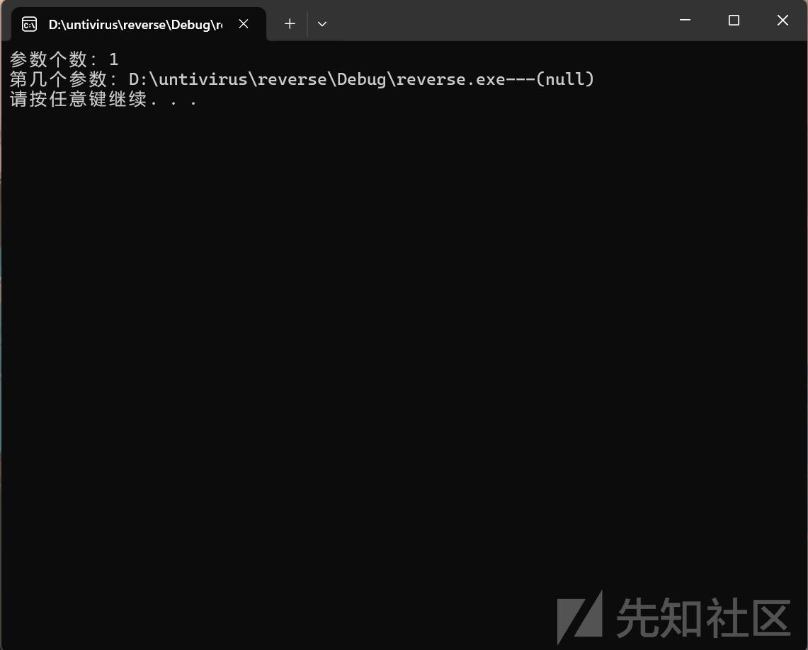](https://xzfile.aliyuncs.com/media/upload/picture/20240307224917-dfc7ce26-dc91-1.png)

可以看到输出的参数，其中 argc 是命令行中参数个数 (包括了这个文件名)，其中 argv 中存储的是命令行中所有的参数。

[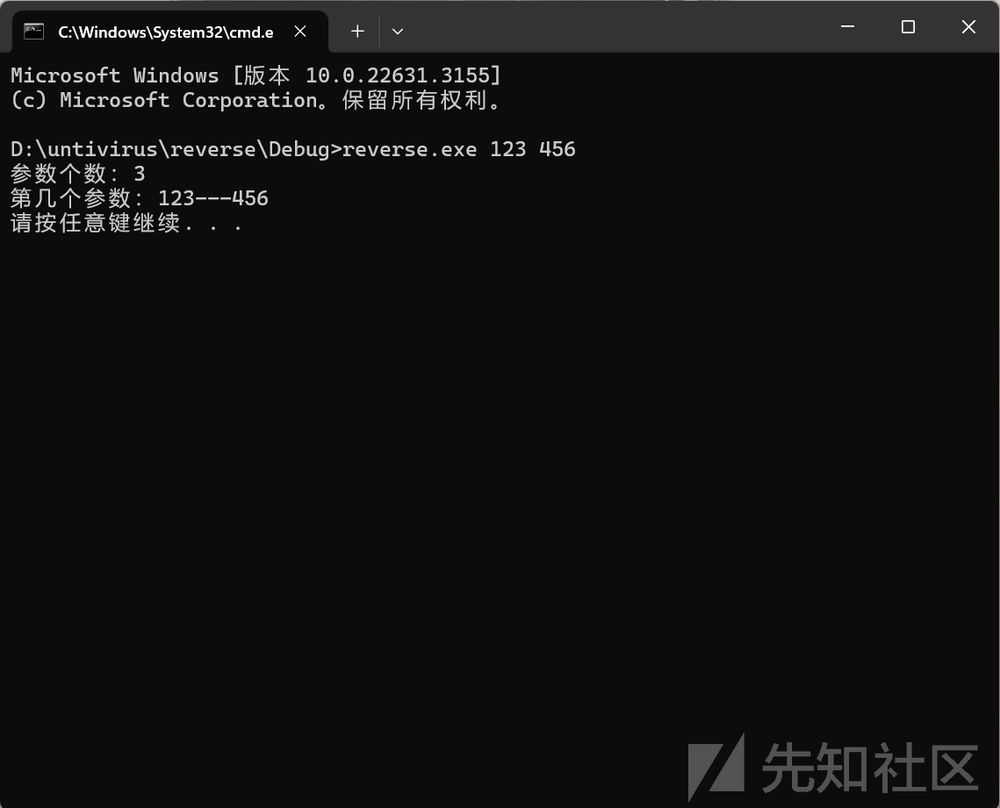](https://xzfile.aliyuncs.com/media/upload/picture/20240307230802-7e6a28ec-dc94-1.png)

既然可以跟参数取参数，那我们就可以像设置密码一样控制程序的流程，从而绕过某些检测机制。

```plain
=======
[](https://xzfile.aliyuncs.com/media/upload/picture/20240307224917-dfc7ce26-dc91-1.png)

可以看到输出的参数，其中 argc 是命令行中参数个数 (包括了这个文件名)，其中 argv 中存储的是命令行中所有的参数。

[](https://xzfile.aliyuncs.com/media/upload/picture/20240307230802-7e6a28ec-dc94-1.png)

既然可以跟参数取参数，那我们就可以像设置密码一样控制程序的流程，从而绕过某些检测机制。

```bash
>>>>>>> 4992f5f682bf7aa8873ceb2495ac1d2a8296850f
#include <stdio.h>
#include <Windows.h>
#include <iostream>

void Hello() {
    printf("Hello World");
}

void InjectShellcode() {
    printf("Inject shellcode!!!");
}

int main(int argc, char* argv[]) {
    if (argc >= 2)
    {
        if ((std::string)argv[1] == "123456") {
            InjectShellcode();
        }
    }
    else
    {
        Hello();
    }

    system("pause");
}
```

<<<<<<< HEAD
[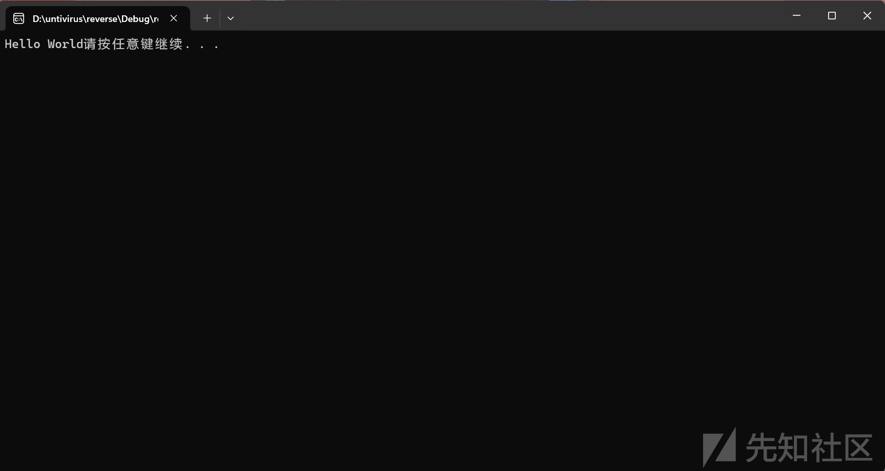](https://xzfile.aliyuncs.com/media/upload/picture/20240307231832-f5e2f768-dc95-1.png)

[](https://xzfile.aliyuncs.com/media/upload/picture/20240307233051-ae0f6ae6-dc97-1.png)
=======
[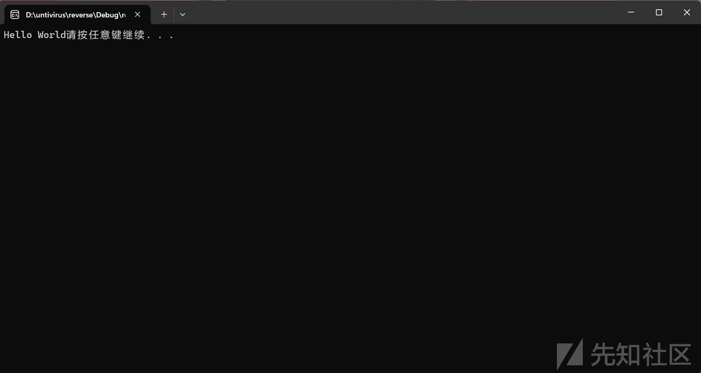](https://xzfile.aliyuncs.com/media/upload/picture/20240307231832-f5e2f768-dc95-1.png)

[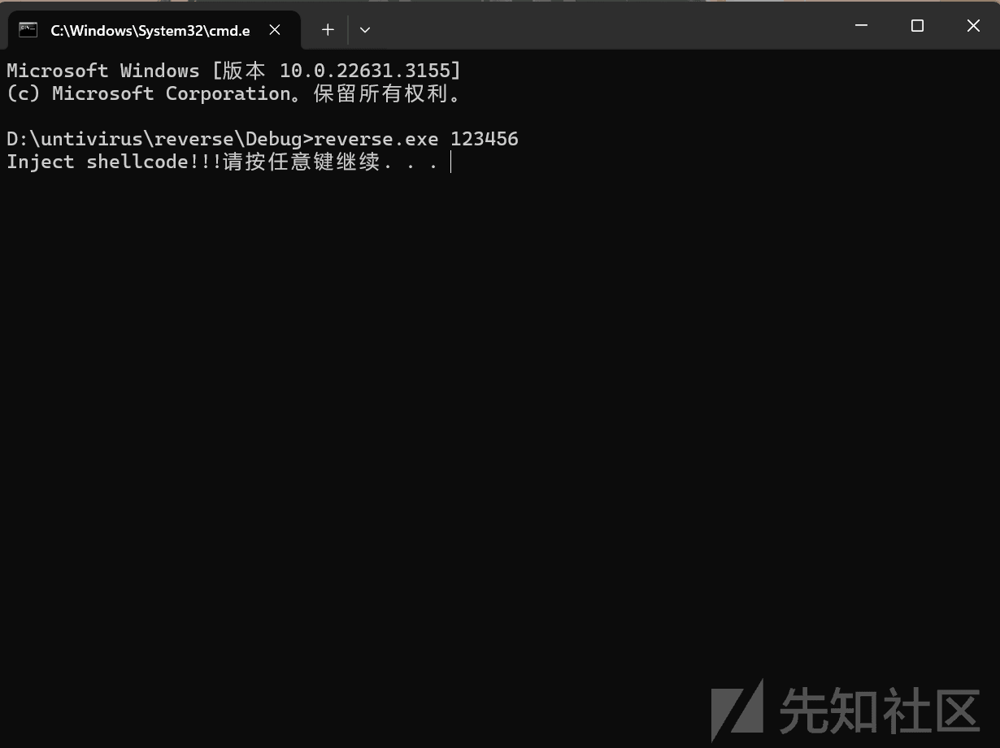](https://xzfile.aliyuncs.com/media/upload/picture/20240307233051-ae0f6ae6-dc97-1.png)
>>>>>>> 4992f5f682bf7aa8873ceb2495ac1d2a8296850f

效果：  
火绒：可持续上线不会掉  
360：可持续上线，可能长时间会掉  
windef：可上线但执行不了命令 (现在已经被标记了上不了线)  
卡巴斯基：可过静态无法上线

<<<<<<< HEAD
[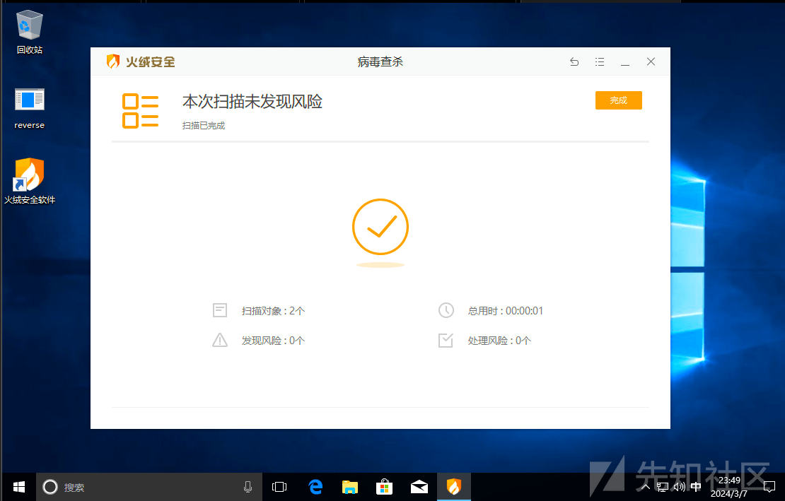](https://xzfile.aliyuncs.com/media/upload/picture/20240307235139-96030af4-dc9a-1.png)

[](https://xzfile.aliyuncs.com/media/upload/picture/20240307235404-ec5a05ec-dc9a-1.png)

[](https://xzfile.aliyuncs.com/media/upload/picture/20240307235732-683e32e6-dc9b-1.png)

[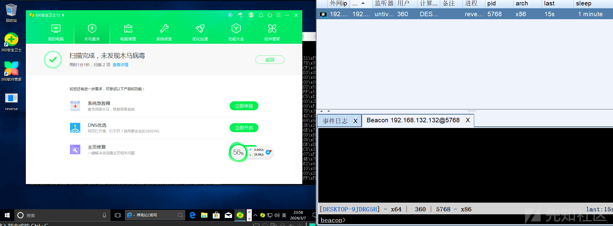](https://xzfile.aliyuncs.com/media/upload/picture/20240307235840-90fdb828-dc9b-1.png)

[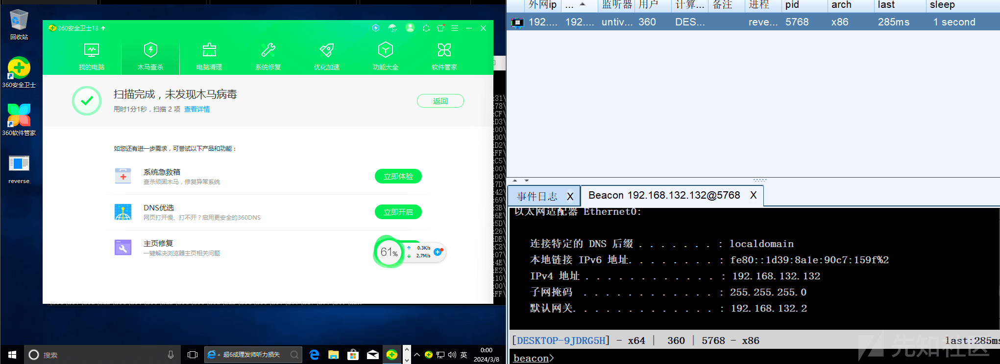](https://xzfile.aliyuncs.com/media/upload/picture/20240308000025-cf3e98d2-dc9b-1.png)

[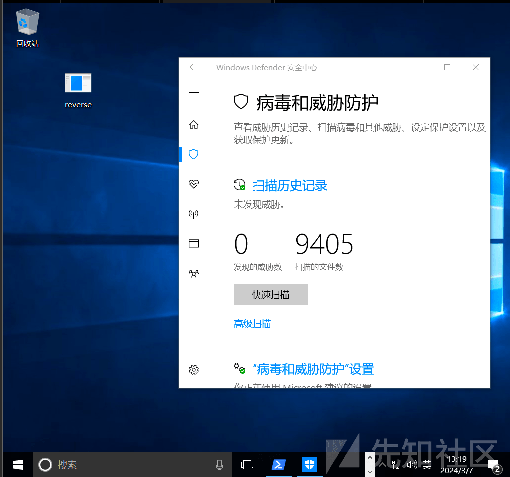](https://xzfile.aliyuncs.com/media/upload/picture/20240308002704-88620b66-dc9f-1.png)

[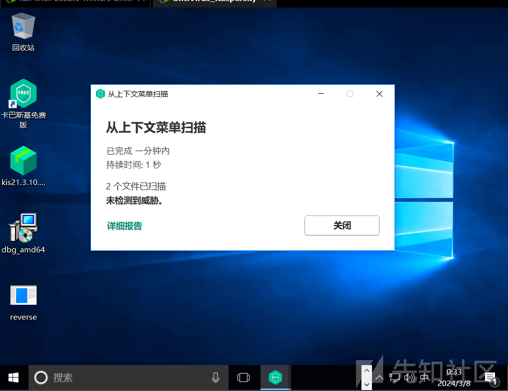](https://xzfile.aliyuncs.com/media/upload/picture/20240308003410-8659747a-dca0-1.png)
=======
[](https://xzfile.aliyuncs.com/media/upload/picture/20240307235139-96030af4-dc9a-1.png)

[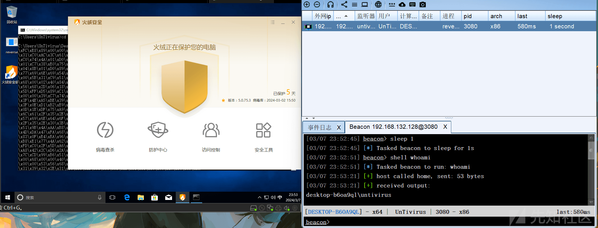](https://xzfile.aliyuncs.com/media/upload/picture/20240307235404-ec5a05ec-dc9a-1.png)

[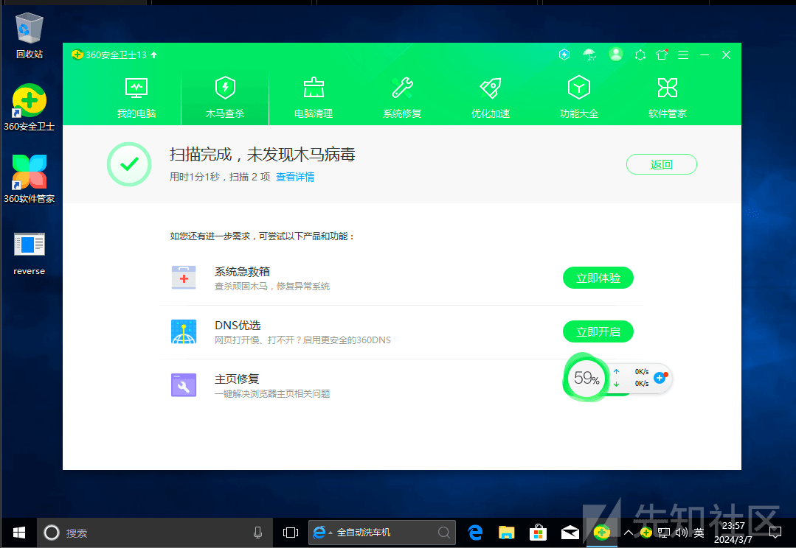](https://xzfile.aliyuncs.com/media/upload/picture/20240307235732-683e32e6-dc9b-1.png)

[](https://xzfile.aliyuncs.com/media/upload/picture/20240307235840-90fdb828-dc9b-1.png)

[](https://xzfile.aliyuncs.com/media/upload/picture/20240308000025-cf3e98d2-dc9b-1.png)

[](https://xzfile.aliyuncs.com/media/upload/picture/20240308002704-88620b66-dc9f-1.png)

[](https://xzfile.aliyuncs.com/media/upload/picture/20240308003410-8659747a-dca0-1.png)
>>>>>>> 4992f5f682bf7aa8873ceb2495ac1d2a8296850f

当然这是看起来比较 low 的方法，但确实对于通过沙箱模拟运行查杀的杀软还是很有效果的。

**如果本文内容中有什么错误或表达不准的地方还请各位大佬斧正 (先给大佬们磕一个～~ ~)**
