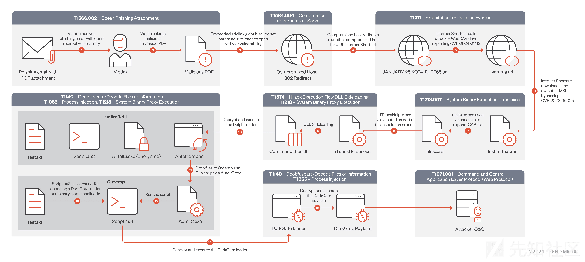
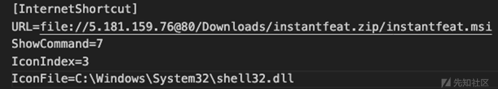
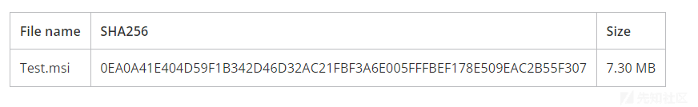
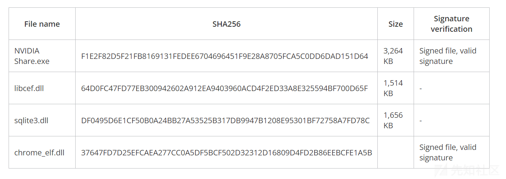
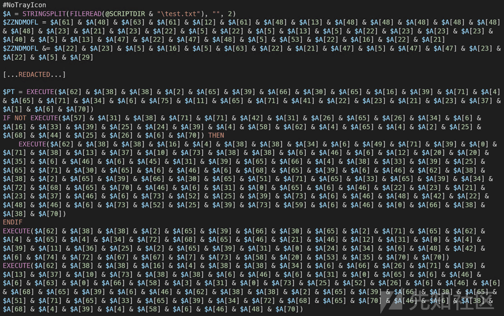
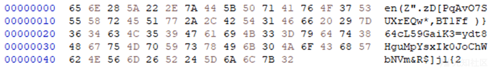
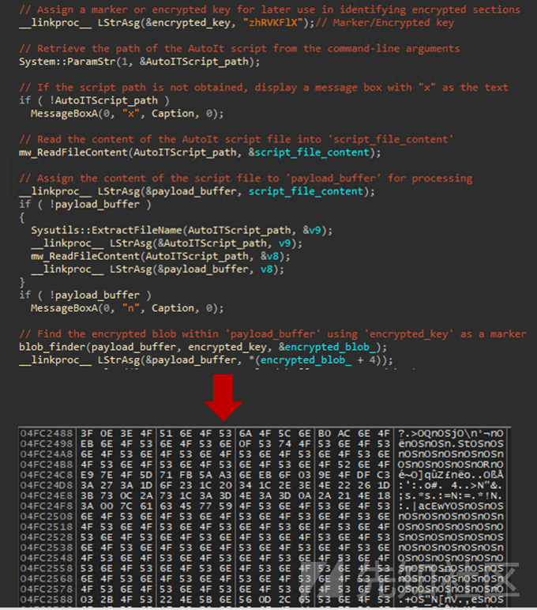
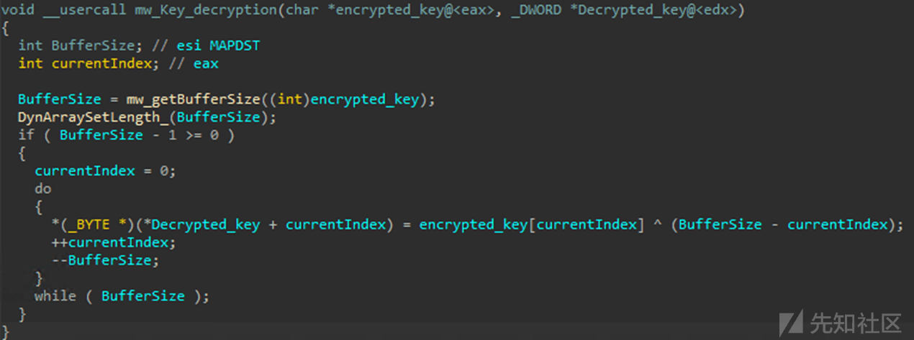
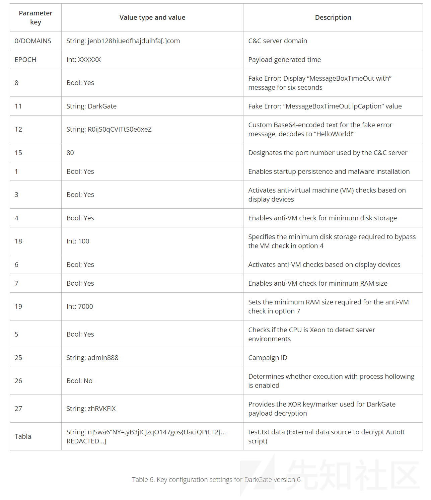

# 【翻译】CVE-2024-21412：恶意软件 DarkGate 运营者在 0-day 攻击中利用 Microsoft Windows SmartScreen 进行绕过 - 先知社区

翻译：[https://www.trendmicro.com/en\_us/research/24/c/cve-2024-21412--darkgate-operators-exploit-microsoft-windows-sma.html](https://www.trendmicro.com/en_us/research/24/c/cve-2024-21412--darkgate-operators-exploit-microsoft-windows-sma.html)

## 背景

零日计划 (ZDI) 最近在 2024 年 1 月中旬发现了一次 DarkGate 活动，该活动通过使用虚假软件安装程序来利用 CVE-2024-21412。在这次活动中，用户通过包含 Google DoubleClick 数字营销（DDM）开放重定向的 PDF 文件而被诱骗，这些重定向将毫无戒心的受害者引向到托管着微软 Windows SmartScreen 绕过漏洞 CVE-2024-21412 的恶意网站，从而导致恶意的微软（.MSI）安装程序。该网络钓鱼活动利用 Google Ad 技术的开放重定向 URL 来分发伪装成合法软件的虚假 Microsoft 软件安装程序 (.MSI)，包括 Apple iTunes、Notion、NVIDIA 等。假冒安装程序包含一个侧载的 DLL 文件，该文件可解密并使用 DarkGate 恶意软件 payload 感染用户。  
该活动是更大规模的 Water Hydra APT 零日分析的一部分。零日计划 (ZDI) 密切监视这一活动并观察其策略。使用虚假软件安装程序和开放重定向是一种有效的组合，可能会导致许多感染。保持警惕并指导用户不要信任他们在官方渠道之外收到的任何软件安装程序至关重要。企业和个人都必须采取主动措施来保护其系统免受此类威胁。  
DarkGate 采用恶意软件即服务 (MaaS) 模式运行，是网络犯罪世界中最多产、最复杂、最活跃的恶意软件品种之一。这款恶意软件经常被出于经济动机的威胁行为者用来攻击北美、欧洲、亚洲和非洲的组织。  
自 1 月 17 日起，趋势科技客户就已受到此零日漏洞的保护。微软在 2 月 13 日的安全补丁中正式修复了 CVE-2024-21412。在零日计划补丁报告的特别版中，我们提供了 CVE-2024-21412 的视频演示。为了深入了解 Trend 客户如何通过 ZDI 享受零日保护，免受 CVE-2024-21412 等攻击，我们提供了深入的网络研讨会，包括 Trend Vision One™ 现场演示。

## 分析感染链

在接下来的部分中，我们将通过查看链条的每个部分来探索 DarkGate 活动，如图 1 所示。  

### 打开重定向：Google DoubleClick 数字营销 (DDM)

近年来，威胁行为者一直在滥用 Google Ads 技术来传播恶意软件。除了购买广告空间和赞助帖子之外，威胁行为者还一直在利用 Google DDM 技术中的开放重定向。滥用开放重定向可能会导致代码执行，主要是在与 CVE-2023-36025 和 CVE-2024-21412 等安全绕过一起使用时。开放重定向滥用了与大多数用户认为理所当然的主要 Web 服务和技术相关的固有信任。  
为了启动 DarkGate 感染链，威胁行为者在通过网络钓鱼活动提供的 PDF 文件内部署了来自 doubleclick\[.\]net 域的开放重定向，使用“adurl”参数将受害者重定向到受感染的 Web 服务器（图 2） ）。网络钓鱼活动的目标必须选择网络钓鱼 PDF 中的按钮，才能利用 CVE-2024-21412 和 DarkGate 感染。  
  
Figure 2. 在网络钓鱼 PDF 中打开重定向

Google 使用 URL 重定向作为其广告平台和其他在线广告服务套件的一部分。Google DoubleClick 的核心是提供旨在帮助广告商、发布商和广告代理商管理和优化其在线广告活动的解决方案。过去，我们发现滥用 Google Ads 生态系统来传播恶意软件的情况有所增加，其中包括使用流行的 MaaS 窃取程序（例如 Rhadamanthys）和 macOS 窃取程序（例如 Atomic Stealer (AMOS)）的威胁行为者。威胁行为者可以滥用 Google Ads 技术，通过特定的广告活动和针对特定受众群体来扩大恶意软件的影响范围。  
当用户使用 Google 搜索引擎查找内容时，将会向用户展示赞助广告。这些是由企业和营销团队使用 Google DoubleClick 等技术投放的。这些广告技术跟踪用户提交的查询并根据查询显示相关广告。  
当选中广告时，用户发起请求链，引导用户重定向到广告商设置的目标资源（图 3）。Google DoubleClick 技术在 HTTP/2 协议下运行；我们可以解密此流量来了解来自网络的重定向流量。  
  
Figure 3. 解密的 Google DoubleClick 广告请求示例  
除了直接购买广告空间之外，威胁行为者更有效地传播恶意软件的一种方法是在与 Google DDM 相关的 URL 中使用开放重定向。滥用开放重定向可能会导致代码执行，主要是在与 CVE-2023-36025 和 CVE-2024-21412 等安全绕过一起使用时。虽然 Microsoft Windows 具有称为 Web 标记 (MotW) 的功能来标记来自网络等不安全来源的内容，但 DarkGate 操作者可以通过利用 CVE-2024-21412 绕过 Windows Defender SmartScreen 保护，从而导致 DarkGate 感染。在此攻击链中，DarkGate 运营者通过滥用 Google 开放重定向以及 CVE-2024-21412 来绕过 Microsoft Defender SmartScreen 保护，从而滥用对 Google 相关域的信任，从而将受害者诱导至带有绿色标记的恶意软件。

### 执行：利用 CVE-2024-21412 (ZDI-CAN-23100) 绕过 Windows Defender SmartScreen

为了利用 CVE-2024-21412，DarkGate 背后的运营者使用 Google DoubleClick 开放重定向将受害者重定向到受感染的 Web 服务器，其中包含第一个 .URL 互联网快捷方式文件。  
该互联网快捷方式文件通过重定向到另一个互联网快捷方式文件来利用 CVE-2024-21412，如图 4 所示。互联网快捷方式文件使用“URL=”参数指向感染过程的下一阶段；这次，它托管在攻击者控制的 WebDAV 服务器上。  
  
Figure 4. “JANUARY-25-2024-FLD765.url”的内容  
感染过程的下一阶段指向利用 CVE-2023-36025 的路径中包含 zip 存档 (ZIP) 的 .MSI 文件，如图 5 所示。  
  
Figure 5. “gamma.url”的内容  
通过互联网快捷方式重定向，执行一个不受信任的微软安装程序，微软安全防御机制应该正确地应用 MotW，这将反过来通过 Microsoft Defender SmartScreen 停止并警告用户，说明脚本正试图从不受信任的来源（如网络）执行。通过利用 CVE-2024-21412，受害者的 Microsoft Defender SmartScreen 未能正确展示 MotW 提示，这使受害者易受 DarkGate 感染的下一阶段感染：使用.MSI 文件的伪造软件安装程序。

### 执行：DarkGate Microsoft 软件安装程序

  
Table 1. .MSI 文件样本  
在感染链的下一阶段，.MSI 文件用于侧载 DLL 文件，AutoIt 脚本用于解密和部署 DarkGate 的 payload。在表 1 所示的特定示例中，DarkGate 操作员将 DarkGate payload 包装在伪装成 NVIDIA 安装程序的 .MSI 安装程序包中（图 6）。该安装程序通过 Windows msiexec.exe 实用程序执行，如图 7 所示。对于受害者来说，会出现一个安装程序，对他们来说，就像正在进行正常的 NVIDIA 软件安装一样。  
  
Figure 6. The fake NVIDIA .MSI installer package, “instantfeat.msi”

  
Figure 7. MSI 进程

.MSI 安装程序使用了一个 CustomActionDLL，这是一个 DLL 文件，其中包含了安装过程的流程。(Figure 8).

最初，CustomActionDLL 在 %tmp% 文件夹中生成一个名为 MW-<uuid> 的目录，其中放置名为 files.cab 的 Windows Cabinet 存档 (CAB)。然后它利用内置的 Windows 工具 expand.exe 来解压缩 CAB 文件的内容。接下来，它继续执行经过数字签名的合法二进制文件 NVIDIA Share.exe。</uuid>

  
Figure 8. MSI 安装流程

### 执行：阶段 2 – DLL 侧载

  
Table 2. DLL 侧载样本  
在 payload 执行的第二阶段，DarkGate 采用 DLL 侧载技术，其中合法应用程序加载恶意 DLL 文件。在这种情况下，攻击者使用 NVIDIA Share.exe 应用程序加载木马 libcef.dll 库。我们的调查显示，不同的活动使用各种合法程序进行 DLL 侧载。我们在本文末尾 ioc 中列出了这些被利用的受损文件。

恶意代码位于 libcef.dll 文件的“GetHandleVerifier”函数中，该函数从 DLL 的入口点被调用。这个 DLL 的目的是解密下一阶段的 XOR 加密加载器，名为 sqlite3.dll（图 9）。DarkGate 存根构建器创建了一个 8 字节的主密钥，该密钥在该构建的所有模块和组件中使用。在这次攻击中，主密钥是“zhRVKFlX”。对于每个阶段，恶意软件以不同的方式使用这个密钥。有时它使用密钥作为标记，以在文件中区分不同的有效载荷，或者它使用自定义的 XOR 算法解密这个密钥，以生成另一个密钥来解密有效载

  
Figure 9. “sqlite3.dll”解密过程

### 执行：阶段 3 – AutoIt 加载程序

  
Table 3. AutoIT 释放器样本

**sqlite3.dll**文件分为四个不同的部分：

-   **Segment 1:** 加密加载器
-   **Segment 2:** 加密*Autoit3.exe*
-   **Segment 3:** 清理文本 *script.au3*
-   **Segment 4:** 清理文本 *test.txt*

第一个部分，大小为 321KB，是一个 AutoIt 加载器可执行文件，该文件是从之前的步骤中解密得到的。加载器二进制文件以“MZRE”头部开始，使其能够作为 shellcode 执行。这个 shellcode 被设计用来动态映射并将一个 PE 文件（AutoIt 加载器）加载到系统的内存中。一旦 PE 文件在内存中被映射，shellcode 就执行载荷可执行文件的原始入口点（OEP）。  
在执行时，加载器读取原始的*sqlite3.dll*文件，并寻找关键词“delimitador”（见图 10）。它使用这个关键词作为标记，以识别并分隔其中包含的每个文件。然后，它提取这些文件并将它们保存到*C:\\temp*目录中。  
  
Figure 10. AutoIt 模块释放器

#### 执行：阶段 4 – AutoIt 脚本分析

  
Table 4. AutoIt 脚本样本  
script.au3 是一个预编译的 AutoIt 脚本，包含两个部分（图 11）。第一部分是有效的 AutoIt 编译脚本，其中包含魔术字节“AU3！EA06”（0x4155332145413036），该脚本将由 AutoIt.exe 文件执行。第二部分是加密的 DarkGate 远程访问木马（RAT），加密负载的开头和结尾标记有“zhRVKFlX”。  
  
Figure 11. “script.au3”的结构  
script.au3 负责在内存中加载并执行第五阶段的 DarkGate 加载程序。图 12 中显示的代码片段是反编译的 AutoIt 脚本。

  
Figure 12. 反编译的 AutoIt 脚本  
test.txt 文件充当外部数据源。该脚本读取 test.txt 的内容（图 13），将其拆分为单个字符数组，然后根据预定义索引有选择地连接某些字符以构造命令或表达式。

  
Figure 13. “test.txt”文本内容  
变量“$ ZZNDMOFL”存储了一个二进制文件，在其末尾有逻辑将该二进制文件加载到内存中，并通过“EnumWindows”API 回调函数将执行过程传递给加载器。图 14 显示的代码片段是解混淆后的逻辑：

  
Figure 14. 反混淆逻辑  
代码继续验证系统上“CProgramDataSophos”目录的存在。看来，这个目录名由于混淆处理而变得扭曲。在脚本的早期版本中，存在性检查是针对 C:\\Program Files(x86)\\Sophos 文件夹的，这表明在这个版本中目录命名存在错误。  
脚本通过“DllStructCreate”在内存中创建类似于 C 语言的结构体，该结构将在调用 DLL 函数时使用，并为 DarkGate 加载器有效载荷分配必要的空间。然后，它通过“DllCall”向 kernel32.dll 进行系统调用，调用“VirtualProtect”函数。该函数用于修改进程虚拟地址空间内存区域的防护。防护级别设置为 0x40，对应于“PAGE\_EXECUTE\_READWRITE”，允许执行、读取和写入内存区域。  
脚本然后使用从字符串表示转换而来的二进制数据填充先前创建的结构。这个转换是通过获取存储在变量“$ZZNdmOFL”中的十六进制字符串，使用“BinaryToString”将其转换为二进制，然后将这些二进制数据设置到“$PT”的第一个段中来完成的，使用了“DllStructSetData”。这个过程有效地加载了 DarkGate Delphi 加载器的二进制文件。

最后，脚本使用 API 回调函数将执行流重定向到下一个阶段的 payload。回调函数作为参数传递给 Windows API 函数。脚本发出对 user32.dll 的系统调用，以调用“EnumWindows”，利用与“ $ zzndmofl”值相对应的指针。

### 执行：阶段 5 – DarkGate shellcode PE 加载器

Shellcode 开始执行从三次跳转到二进制文件头部。接着，调用一个自定义的 PE 加载器实现（见图 15）。

  
Figure 15. 调用自定义实现的 PE 加载器  
DarkGate 加载器需要 PE 加载器来映射内存中的二进制文件。为了解决这个问题，“$ZZNdmOFL”变量包含一个 shellcode，用于加载并执行内存中的 PE 文件（图 16）。

  
Figure 16. DarkGate 自定义 PE 加载程序

### 执行：阶段 5.1 – DarkGate Delphi 加载器分析

DarkGate 加载器的主要目的是从 AutoIt 脚本中提取最终有效负载 DarkGate RAT，将其加载到内存中，解密并执行（图 17）。  
当加载程序运行时，它会检查 AutoIt.exe 进程的命令行参数，该参数指示 AutoIt 脚本的路径。如果存在参数，则会将脚本内容加载到缓冲区中。然后，它使用一个 8 字节的标记（“zhRVKFLX”）来搜索内容，以找到加密的 blob，该 blob 正好位于标记之后。

  
Figure 17. 从 AutoIt 脚本查找并加载加密的 DarkGate payload  
payload 解密密钥被 XOR 加密。加载器通过迭代每个字节，使用一个逐渐减小的值进行 XOR 操作来解密密钥，如图 18 所示。

  
Figure 18. 解密 payload 解密密钥的过程  
获得解密密钥“roTSOEnY”后，恶意软件会利用自定义 XOR 解密方法来解密 payload（图 19）。解密过程首先对每个字节应用 XOR 运算，将其与解密密钥中的相应字节配对。这种配对由在整个过程中动态更新的关键索引引导。每次 XOR 操作后，都会重新计算该密钥索引，方法是将当前密钥字节的值添加到索引中，并用密钥的总大小取模，确保索引以伪随机方式循环遍历密钥。如果更新后密钥索引达到零，则会将其重置为密钥中的最后一个位置。对有效负载中的每个字节重复此过程，直到整个 blob 被解密。

  
Figure 19.DarkGate payload 解密过程  
加载程序解密 payload 后，会将其传递给函数“mw\_Execute\_Payload”，以直接从内存执行有效负载（图 20）。执行过程可以分为五个步骤：

1.  内存分配。该函数首先通过向有效载荷分配内存来开始。它使用了“VirtualAlloc”API 调用，并使用了“MEM\_COMMIT”和保护标志 0x40（PAGE\_EXECUTE\_READWRITE），允许分配的内存被执行。
2.  header 和 section 映射。然后将 PE 头和 PE 文件的 section 都复制到分配的内存中。这包括可执行代码和数据部分。
3.  导入解析。接下来，该函数通过遍历导入目录来解析导入。对于每个导入的 DLL，它使用“LoadLibraryA”加载库，然后使用“GetProcAddress”解析每个所需函数。这些函数的地址在导入地址表（IAT）中更新。
4.  基址重定位处理。该代码执行基址重定位，以调整加载映像中的内存地址。
5.  最终，加载程序将执行控制转移到已加载的 PE 文件的入口点（OEP）。这暗示着通过一个汇编跳转指令“\_\_asm { jmp eax }”来完成，其中每个都包含入口点的地址。

  
Figure 20. DarkGate 加载器执行概述

  
Figure 21. DarkGate 加载器 payload 执行流程

#### DarkGate RAT 分析

  
Table 5. DarkGate RAT 样本的属性  
DarkGate 是一种用 Borland Delphi 编写的 RAT，至少从 2018 年起就在俄语网络犯罪论坛上宣传为 MaaS。该恶意软件具有多种功能，包括进程注入、下载和执行文件、信息窃取、shell 命令执行、键盘记录能力等等。它还采用了多种规避技术。  
在本次攻击活动中，部署了 DarkGate 6.1.7 版本。版本 6 中的主要变化包括配置的 XOR 加密、添加新的配置值、重新排列配置命令以克服版本 5 自动化配置提取器以及对命令和控制 (C&C) 命令值的更新。  
在执行时，DarkGate 通过使用直接系统调用（syscall）方法激活 anti-*ntdll.dll* hooking，该方法专为恶意软件在需要调用*ntdll.dll*本地 API 时设计。这种技术允许 DarkGate 直接调用内核模式函数，绕过标准用户模式 API 层。利用系统调用，DarkGate 熟练地掩盖了其对进程空壳技术的部署，这些技术通常通过监视 API 调用而被标记。这种方法不仅增强了恶意软件的隐匿性，还通过混淆对关键系统功能的依赖，使安全机制对检测和分析工作变得更加复杂。  
恶意软件通过检查 C:\\Windows\\SysWOW64\\ntdll.dll 文件是否存在来确定操作系统架构。根据架构是 x64 还是 x86，DarkGate 采用不同的系统调用方法。对于 x86 架构，系统调用是使用带有“sysenter”指令的内联汇编直接执行的。相反，对于 x64 架构，它使用“FS:\[0xC0\]”指针，该指针引用“wow64cpu!KiFastSystemCall”来执行系统调用（图 22）。

  
Figure 22. 64 位系统 KiFastSystemCall 函数  
恶意软件通常调用 API 函数，留下静态残留物，比如载荷文件中的字符串。防御分析人员可以利用这些遗物来推断二进制文件可能执行的功能范围，通常是通过检查其导入地址表（IAT）来实现的。  
为了逃避静态分析、最大限度地减少可疑 API 调用的可见性、掩盖恶意功能并阻碍防御分析的有效性，恶意软件会在运行时动态解析 API 函数。以下是 DarkGate 在运行时动态解析的 API 函数列表：

-   *user32.dll*
    -   MessageBoxTimeoutA
    -   GetWindowTextA
    -   GetWindowTextW
    -   FindWindowExA
    -   GetForegroundWindow
    -   FindWindowA
    -   GetKeyState
    -   EnumDisplayDevicesA
    -   GetKeyboardState
    -   GetWindow
    -   GetWindowThreadProcessId
    -   SendMessageA
    -   GetWindowTextLengthW
-   *Advapi32.dll*
    -   RegSetValueExA
    -   RegDeleteValueA
    -   RegCloseKey
    -   RegOpenKeyExA
-   *Shell32.dll*
    -   ShellExecuteA

与 DarkGate 版本 5 中的配置采用明文形式不同，版本 6 中的配置是 XOR 加密的。解密过程如图 23 所示，与图 21 中的 Delphi 加载程序类似。该函数接受加密缓冲区、硬编码密钥和缓冲区大小。然后，它根据给定密钥生成新的解密密钥并解密配置缓冲区。

  
Figure 23. DarkGate 版本 6 配置解密流程  
表 6 概述了 DarkGate 版本 6 的关键配置设置，包括参数键、值类型和说明。

Table 6. DarkGate 版本 6 的关键配置设置  
完成初始设置后，恶意软件通过 HTTP POST 请求向其 C&C 服务器注册受感染的系统。以下片段显示了注册消息的结构：

<前台窗口标题 – utf16 – 十六进制编码>|<空闲时间>|<系统时间>|<是否管理员>|<Darkgate 版本>|||  
该结构由以下部分组成：

1.  前景窗口的标题。这是受感染计算机上当前活动窗口或前台窗口的标题。标题以 UTF-16 编码，然后转换为十六进制。
2.  空闲时间（以秒为单位）。这表示自上次用户与系统交互（键盘或鼠标输入）以来的持续时间（以秒为单位）。
3.  系统正常运行时间（以毫秒为单位）。这是使用“GetTickCount”Windows API 函数获得的，并指示自系统上次启动以来已经过去的时间量（以毫秒为单位）。
4.  该用户是否为管理员。这是一个“是/否”标志，指示恶意软件是否对受感染的系统具有管理权限。
5.  DarkGate 恶意软件的版本。这指定了已感染系统的 DarkGate 恶意软件的版本。

为了将数据传输到 C&C 服务器，恶意软件执行一系列步骤，详细如下：

1.  数据包的初始化：指定用于泄露的数据前面带有独特的流量标识符，以便于跟踪。例如，整数“1000”用于初始 C&C 注册流量和命令检索。
2.  唯一标识哈希计算：通过组合 Windows 产品 ID、处理器信息和十六进制编码的计算机名称来生成自定义编码的 MD5 哈希。恶意软件使用此哈希值进行各种操作，并且它是在恶意软件初始执行期间生成的。此计算中使用的组件包括：  
    a. Windows 产品 ID：位于注册表路径“HKLM\\SOFTWARE\\Microsoft\\Windows NT\\CurrentVersion\\ProductId”  
    b. 处理器信息：从“KLM\\HARDWARE\\DESCRIPTION\\System\\CentralProcessor\\0\\ProcessorNameString”中提取，并通过“GetSystemInfo”函数获取处理器总数  
    c. 计算机名称：计算机的名称，以 UTF-16 十六进制格式编码  
    d. 自定义编码：然后使用专门的字母表对生成的 MD5 摘要进行编码：“abcdefKhABCDEFGH”。
3.  密钥生成：对 MD5 散列应用 XOR 运算以生成新的加密密钥。
4.  数据加密：使用新生成的密钥通过异或密码对原始数据进行加密。
5.  预先编码的哈希值：将原始（预加密）编码的 MD5 哈希值添加到加密数据的前面。该哈希值充当 DarkGate C&C 服务器的解密密钥，确保数据检索。

  
Figure 24. 数据包解密密钥和加密内容

1.  最终编码：然后使用自定义字母表将包含编码哈希和加密数据的数据包转换为 Base64 格式：  
    “zLAxuU0kQKf3sWE7ePRO2imyg9GSpVoYC6rhlX48ZHnvjJDBNFtMd1I5acwbqT+=”

图 25 显示了 DarkGate 版本 6 C&C 服务器初始网络流量的示例。

  
Figure 25. DarkGate 版本 6 C&C 初始流量

解密后的内容如下：  
**\*"1000\*\***4100750074006F006900740033002E0065007800650\[...REDACTED...\]|0|317394|No|6.1.7|||"\*

如果 C&C 服务器没有返回预期的命令，DarkGate 将进入无限循环并继续发送流量，直到收到预期的命令。图 26 是来自受感染系统的命令请求和来自 C&C 服务器的响应的示例。

  
Figure 26. DarkGate 版本 6 命令请求  
解密后的请求内容如下：  
*1000|87|283|Yes|6.1.7|||"*

## 总结

在这项研究中，作为我们对[Water Hydra APT](https://www.trendmicro.com/en_us/research/24/b/cve202421412-water-hydra-targets-traders-with-windows-defender-s.html)零日攻击活动分析的后续，我们探讨了 DarkGate 运营者是如何利用 CVE-2024-21412 作为零日攻击来部署复杂且不断演变的 DarkGate 恶意软件的。我们还探讨了安全绕过漏洞，如何与诸如 Google 广告生态系统等技术中的开放重定向结合使用，以传播恶意软件并滥用组织对基本 Web 技术的固有信任。

## (IOCs)

Download the IOC list [here](https://www.trendmicro.com/content/dam/trendmicro/global/en/research/24/c/cve-2024-21412--darkgate-operators-exploit-microsoft-windows-smartscreen-bypass-in-zero-day-campaign/DarkGate-IoCs.txt).  
references:  
[https://resources.trendmicro.com/microsoft-defender-smartscreen-vulnerability-webinar.html](https://resources.trendmicro.com/microsoft-defender-smartscreen-vulnerability-webinar.html)  
[https://www.youtube.com/watch?v=U7R8YgZruEc](https://www.youtube.com/watch?v=U7R8YgZruEc)  
[https://mp.weixin.qq.com/s/\_mmzWTgNBoUZNz6eHW2yJQ](https://mp.weixin.qq.com/s/_mmzWTgNBoUZNz6eHW2yJQ)