<<<<<<< HEAD
---
title: 【翻译】GhostSec 的联合勒索活动及其武器库的演变 - 先知社区
url: https://xz.aliyun.com/t/14067
clipped_at: 2024-03-20 09:56:38
category: default
tags: 
 - xz.aliyun.com
---
=======
>>>>>>> 4992f5f682bf7aa8873ceb2495ac1d2a8296850f

# 【翻译】GhostSec 的联合勒索活动及其武器库的演变 - 先知社区

<<<<<<< HEAD
翻译原文：[https://blog.talosintelligence.com/ghostsec-ghostlocker2-ransomware/](https://blog.talosintelligence.com/ghostsec-ghostlocker2-ransomware/)  
[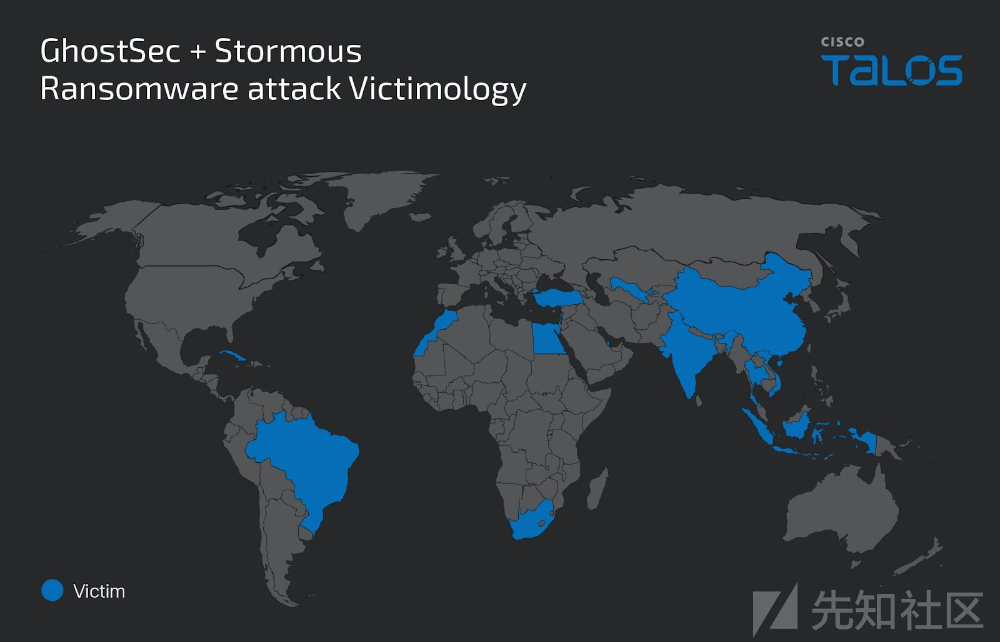](https://xzfile.aliyuncs.com/media/upload/picture/20240310145303-d777599c-deaa-1.png)
=======
【翻译】GhostSec 的联合勒索活动及其武器库的演变

- - -

翻译原文：[https://blog.talosintelligence.com/ghostsec-ghostlocker2-ransomware/](https://blog.talosintelligence.com/ghostsec-ghostlocker2-ransomware/)  

>>>>>>> 4992f5f682bf7aa8873ceb2495ac1d2a8296850f

-   思科威胁情报团队 Talos 观察到，自去年以来，黑客组织 GhostSec 的恶意活动激增。
-   GhostSec 已经开发出了一种新的勒索软件，名为 GhostLocker 2.0，这是 GhostLocker 勒索软件的 Golang 版本。
-   GhostSec 和 Stormous 勒索软件组织正在联合对多个国家（包括中国）的各种商业垂直领域进行双重勒索软件攻击。
-   GhostLocker 和 Stormous 勒索软件启动了一个新的勒索软件即服务 (RaaS) 计划 STMX\_GhostLocker，为其附属机构提供各种选择。
<<<<<<< HEAD
-   Talos 还在 GhostSec 武器库中发现了两个新工具，“GhostSec 深度扫描工具”和“GhostPresser”，两者都可能用于针对网站的攻击。
=======
-   Talos 还在 GhostSec 武器库中发现了两个新工具，“GhostSec 深度扫描工具”和“GhostPresser”，两者都可能用于针对网站的攻击。
>>>>>>> 4992f5f682bf7aa8873ceb2495ac1d2a8296850f

# 勒索软件攻击的受害者

Talos 观察到 GhostSec 和 Stormous 勒索软件团伙进行了联合行动，针对古巴、阿根廷、波兰、中国、黎巴嫩、以色列、乌兹别克斯坦、印度、南非、巴西、摩洛哥、卡塔尔、土耳其、埃及、越南、泰国和印度尼西亚的受害者进行了多起双重勒索攻击，这些攻击使用了 GhostLocker 和 StormousX 勒索软件。我们对该团伙在他们的 Telegram 频道及 Stormous 勒索软件数据泄露网站上发布的泄露信息得出的结论。

根据这些组织在其 Telegram 频道中披露的信息，此次联合行动影响了各个垂直行业的受害者。  
<<<<<<< HEAD
[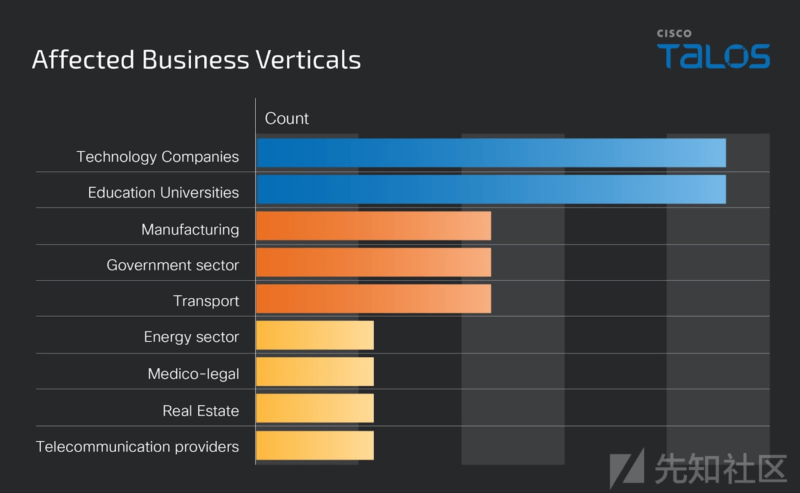](https://xzfile.aliyuncs.com/media/upload/picture/20240310150655-c7627c24-deac-1.png)  
Talos 在 GhostSec Telegram 频道中的观察到该组织强调了对以色列工业系统、关键基础设施和技术公司的持续攻击。2023 年 11 月 12 日，他们声称受影响的组织还包括以色列国防部。  
2023 年 10 月，GhostSec 宣布推出名为 GhostLocker 的新勒索软件即服务 (RaaS) 框架。在 2023 年 7 月与 Stormous 勒索软件组织成功合作针对古巴各部委实施行动后，Stormous 团伙于 2023 年 10 月 14 日宣布，除了 StormousX 程序外，他们还将使用 GhostLocker 勒索软件程序。  
此后，GhostSec 和 Stormous 勒索软件组织联合针对多个国家各个行业的受害者进行双重勒索勒索软件攻击。除了勒索软件攻击之外，GhostSec 似乎还对企业网站进行攻击，其中包括印度尼西亚的一家国家铁路运营商和加拿大领先的能源公司之一。他们可能利用 GhostPresser 工具以及跨站点脚本攻击技术来破坏网站。  
2024 年 2 月 24 日，Stormous 组织在“The Five Families”Telegram 频道上提到，他们已经与 GhostSec 的合作伙伴一起启动了新的勒索软件即服务 (RaaS) 计划“STMX\_GhostLocker”。新计划由三类为附属机构提供的服务组成：付费服务、免费服务，以及另一类为没有计划但只想在博客上出售或发布数据的个人提供的服务（PYV 服务）。

Stmx\_GhostLocker 会员组织架构  

Stmx\_GhostLocker 非会员组织架构  
[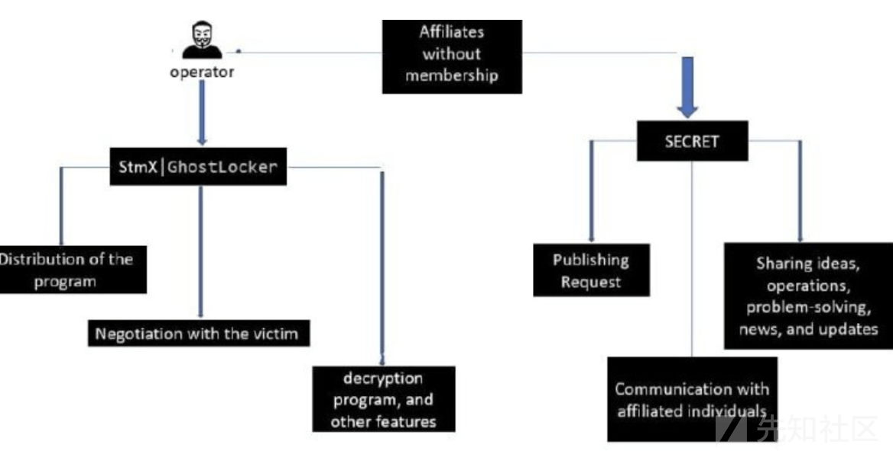](https://xzfile.aliyuncs.com/media/upload/picture/20240310151434-d8dd5072-dead-1.png)

Stormous 和 GhostSec 在 TOR 网络上重建了 RAAS 程序 Stmx\_GhostLocker 的新官方博客，并提供了附属机构加入其程序并披露受害者数据的功能。他们的博客显示了受害者的数量和受害者信息的披露，以及指向其泄露数据的链接。他们还显示最大的赎金为 500,000 美元 —— 我们不确定这是否是他们收到的最高赎金。  
[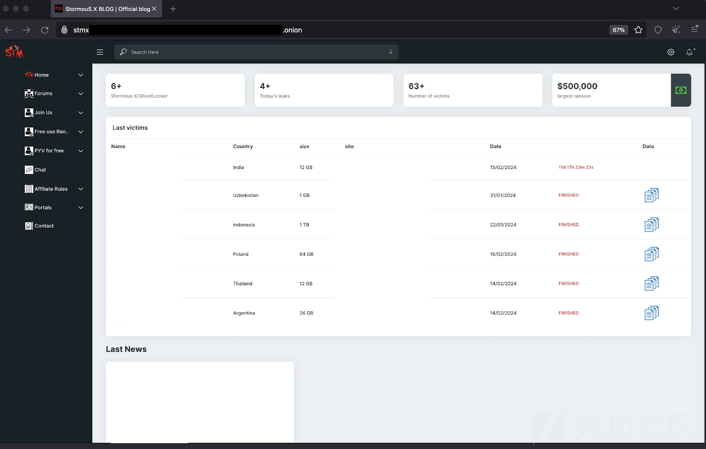](https://xzfile.aliyuncs.com/media/upload/picture/20240310151601-0c8eb852-deae-1.png)

# GhostLocker 2.0 勒索软件的演变

2023 年 11 月，GhostSec 发布了其 GhostLocker 勒索软件的新版本，称为 GhostLocker 2.0。最近我们观察到，他们再次开始宣传他们最新的 Golang 版本“GhostLocker 2.0”，称其为“GhostLocker V2”，并提到他们正在进行的 GhostLocker V3 工作，这表明他们在持续开发新的勒索武器库。  
[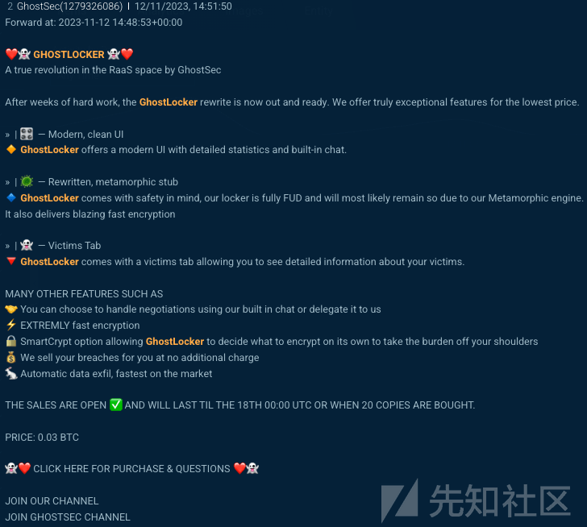](https://xzfile.aliyuncs.com/media/upload/picture/20240310151750-4de5785e-deae-1.png)  
GhostLocker 2.0 通过使用文件扩展名“.ghost”加密受害者机器上的文件，并且释放并打开一个勒索说明。勒索说明从其先前版本发生了变化，勒索者告诉受害者在勒索说明中显示的加密 ID，并在通过点击“点击我”进行谈判时，在他们的聊天服务中与他们分享这一 ID。勒索者还提到，如果受害者在七天内未能联系他们，其被盗数据将会被公开。  
  
GhostLocker 的勒索信（左）和 GhostLocker 2.0 的勒索信（右）。

GhostLocker RAAS 有一个 C2 面板，附属机构可以在其中概述他们的攻击和收益。当部署在受害者的机器上时，勒索软件二进制文件将注册到 C2 面板，附属机构可以跟踪受害者机器上的加密状态。Talos 发现位于俄罗斯莫斯科的 GhostLocker 2.0 C2 服务器，IP 地址为 94 \[.\] 103 \[.\] 91 \[.\] 246。我们观察到，C2 服务器的地理位置与 Uptycs 安全研究人员报告的 GhostLocker 勒索软件早期版本的 C2 服务器相似。  
  
=======
  
Talos 在 GhostSec Telegram 频道中的观察到该组织强调了对以色列工业系统、关键基础设施和技术公司的持续攻击。2023 年 11 月 12 日，他们声称受影响的组织还包括以色列国防部。  
2023 年 10 月，GhostSec 宣布推出名为 GhostLocker 的新勒索软件即服务 (RaaS) 框架。在 2023 年 7 月与 Stormous 勒索软件组织成功合作针对古巴各部委实施行动后，Stormous 团伙于 2023 年 10 月 14 日宣布，除了 StormousX 程序外，他们还将使用 GhostLocker 勒索软件程序。  
此后，GhostSec 和 Stormous 勒索软件组织联合针对多个国家各个行业的受害者进行双重勒索勒索软件攻击。除了勒索软件攻击之外，GhostSec 似乎还对企业网站进行攻击，其中包括印度尼西亚的一家国家铁路运营商和加拿大领先的能源公司之一。他们可能利用 GhostPresser 工具以及跨站点脚本攻击技术来破坏网站。  
2024 年 2 月 24 日，Stormous 组织在“The Five Families”Telegram 频道上提到，他们已经与 GhostSec 的合作伙伴一起启动了新的勒索软件即服务 (RaaS) 计划“STMX\_GhostLocker”。新计划由三类为附属机构提供的服务组成：付费服务、免费服务，以及另一类为没有计划但只想在博客上出售或发布数据的个人提供的服务（PYV 服务）。

Stmx\_GhostLocker 会员组织架构  
[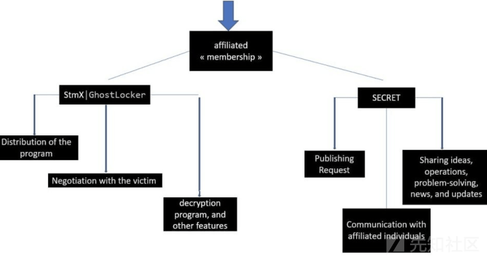](https://xzfile.aliyuncs.com/media/upload/picture/20240310151400-c4ed4b8a-dead-1.png)

Stmx\_GhostLocker 非会员组织架构  

Stormous 和 GhostSec 在 TOR 网络上重建了 RAAS 程序 Stmx\_GhostLocker 的新官方博客，并提供了附属机构加入其程序并披露受害者数据的功能。他们的博客显示了受害者的数量和受害者信息的披露，以及指向其泄露数据的链接。他们还显示最大的赎金为 500,000 美元 —— 我们不确定这是否是他们收到的最高赎金。  

# GhostLocker 2.0 勒索软件的演变

2023 年 11 月，GhostSec 发布了其 GhostLocker 勒索软件的新版本，称为 GhostLocker 2.0。最近我们观察到，他们再次开始宣传他们最新的 Golang 版本“GhostLocker 2.0”，称其为“GhostLocker V2”，并提到他们正在进行的 GhostLocker V3 工作，这表明他们在持续开发新的勒索武器库。  
[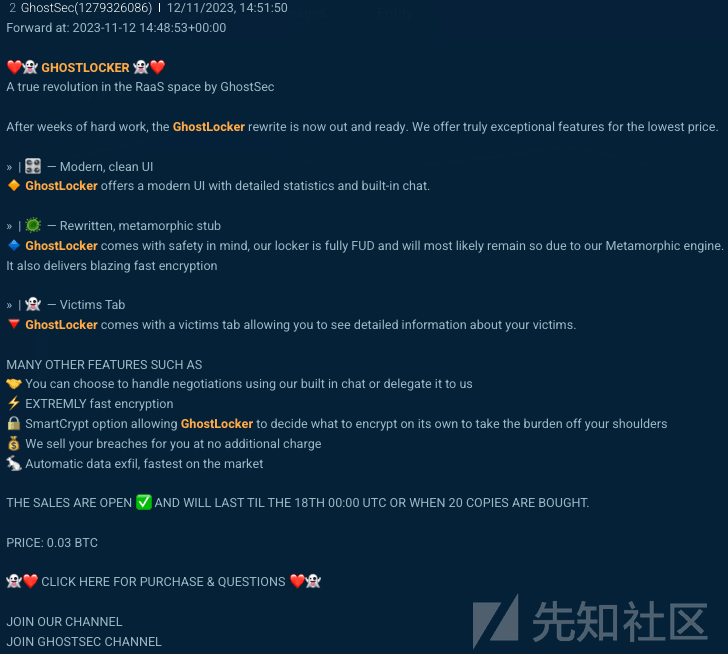](https://xzfile.aliyuncs.com/media/upload/picture/20240310151750-4de5785e-deae-1.png)  
GhostLocker 2.0 通过使用文件扩展名“.ghost”加密受害者机器上的文件，并且释放并打开一个勒索说明。勒索说明从其先前版本发生了变化，勒索者告诉受害者在勒索说明中显示的加密 ID，并在通过点击“点击我”进行谈判时，在他们的聊天服务中与他们分享这一 ID。勒索者还提到，如果受害者在七天内未能联系他们，其被盗数据将会被公开。  
[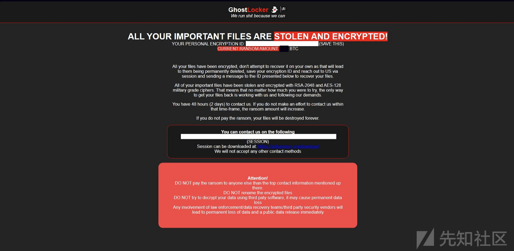](https://xzfile.aliyuncs.com/media/upload/picture/20240310152035-b005082e-deae-1.png)  
GhostLocker 的勒索信（左）和 GhostLocker 2.0 的勒索信（右）。

GhostLocker RAAS 有一个 C2 面板，附属机构可以在其中概述他们的攻击和收益。当部署在受害者的机器上时，勒索软件二进制文件将注册到 C2 面板，附属机构可以跟踪受害者机器上的加密状态。Talos 发现位于俄罗斯莫斯科的 GhostLocker 2.0 C2 服务器，IP 地址为 94 \[.\] 103 \[.\] 91 \[.\] 246。我们观察到，C2 服务器的地理位置与 Uptycs 安全研究人员报告的 GhostLocker 勒索软件早期版本的 C2 服务器相似。  
[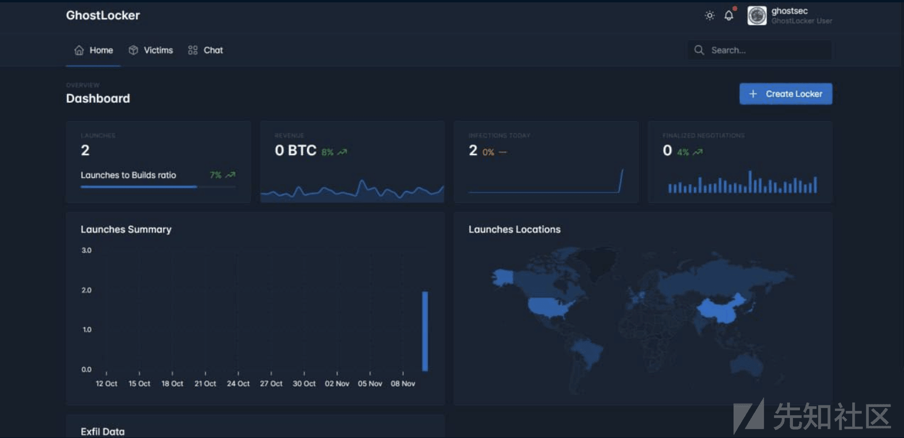](https://xzfile.aliyuncs.com/media/upload/picture/20240310152154-df36a8fa-deae-1.png)  
>>>>>>> 4992f5f682bf7aa8873ceb2495ac1d2a8296850f
GhostLocker C2 面板

GhostLocker RAAS 为其附属公司提供勒索软件构建器，其中包含配置选项，包括勒索软件二进制文件在受害者计算机上成功运行后可以建立的持久模式、要加密的目标目录以及逃避检测的技术，例如查杀定义的进程或服务或运行任意命令来终止计划任务或绕过用户帐户控制（UAC）。

<<<<<<< HEAD
[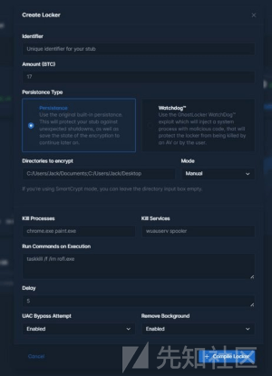](https://xzfile.aliyuncs.com/media/upload/picture/20240310152243-fc1a4530-deae-1.png)  
GhostLocker 2.0 勒索软件构建面板。

Talos 在 2023 年 11 月 15 日发现了 GhostLocker 勒索软件的新变种，“GhostLocker 2.0”。GhostLocker 2.0 的大部分勒索软件功能与早期版本 GhostLocker 相同，早期版本是用 Python 编写的，但排除了操作员在早期版本中使用的监视组件，该组件用于从受害者计算机的 Windows 启动位置启动已释放的勒索软件二进制文件，以及早期版本中的 AES 加密密钥长度从 256 位更改为 128 位。  
在初始执行期间，GhostLocker 2.0 将自身复制到 Windows 启动文件夹以确立持久性。它还生成一个 32 字节的随机字符串，并将生成的字符串用作其在 Windows 启动文件夹中的复制的文件名。  

在保持权限维持后，勒索软件通过 URL hxxp \[://\] 94 \[.\] 103 \[.\] 91 \[.\] 246 \[/\] incrementLaunch 建立与 C2 服务器的连接。  
  
启动与 C2 连接的函数。

与 C2 服务器建立成功连接后，勒索软件会生成密钥和加密 ID，并从其配置参数中收集受害者的 IP 地址、感染日期和其他信息，包括加密状态、勒索金额和受害者标识符字符串，以在受害者的机器内存中创建一个 JSON 文件。  

生成的 JSON 文件通过 URL hxxp \[://\] 94 \[.\] 103 \[.\] 91 \[.\] 246 \[/\] addInfection 发送到 C2 服务器，以在 C2 面板中注册受害者的机器感染。  
[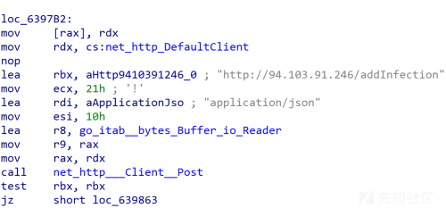](https://xzfile.aliyuncs.com/media/upload/picture/20240310152901-ddcfa1fa-deaf-1.png)

在 C2 面板注册受害者计算机感染后，勒索软件会尝试从受害者计算机中的配置参数终止定义的进程或服务或 Windows 计划任务，以逃避检测。  
[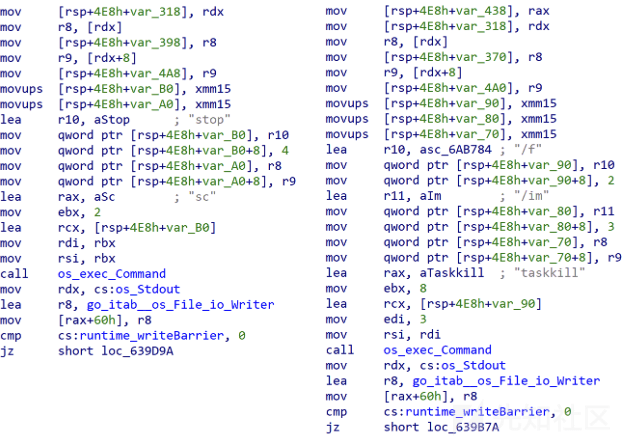](https://xzfile.aliyuncs.com/media/upload/picture/20240310152953-fc785962-deaf-1.png)

GhostLocker 2.0 根据威胁行为团体定义的文件扩展名列表，在受害者机器上搜索目标文件，在加密程序开始之前，它将通过 HTTP POST 方法将目标文件上传到 C2 服务器，上传的 URL 为 "hxxp \[://\] 94 \[.\] 103 \[.\] 91 \[.\] 246 \[/\] upload"。在我们分析的 GhostLocker 2.0 样本中，威胁行为团体已经配置了勒索软件，以便窃取和加密具有文件扩展名.doc、.docx、.xls 和.xlsx 的文件。  
  
将目标文件上传到 C2 服务器的功能

在成功上传目标文件后，GhostLocker 2.0 会对目标文件进行加密，并附加“.ghost”作为加密文件的文件扩展名。在加密过程中，GhostLocker 2.0 会跳过“C:\\Windows”文件夹。完成加密例程后，勒索软件将嵌入的勒索字条放入受害者桌面上文件名为“Ransomnote.html”的 HTML 文件中，并使用 Windows“开始”命令启动它。  
[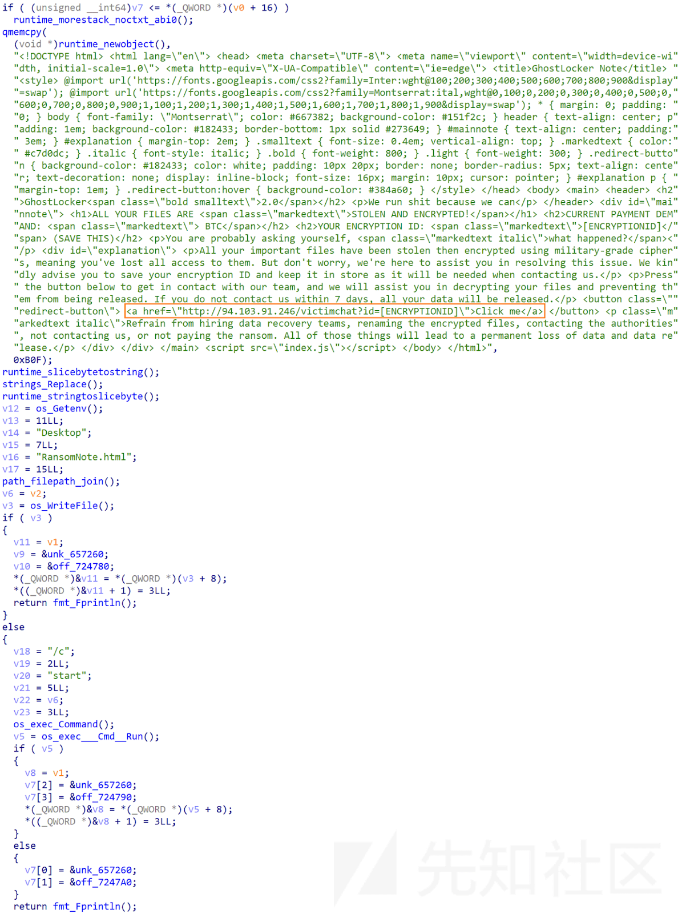](https://xzfile.aliyuncs.com/media/upload/picture/20240310153403-91bd8dee-deb0-1.png)  
=======
  
GhostLocker 2.0 勒索软件构建面板。

Talos 在 2023 年 11 月 15 日发现了 GhostLocker 勒索软件的新变种，“GhostLocker 2.0”。GhostLocker 2.0 的大部分勒索软件功能与早期版本 GhostLocker 相同，早期版本是用 Python 编写的，但排除了操作员在早期版本中使用的监视组件，该组件用于从受害者计算机的 Windows 启动位置启动已释放的勒索软件二进制文件，以及早期版本中的 AES 加密密钥长度从 256 位更改为 128 位。  
在初始执行期间，GhostLocker 2.0 将自身复制到 Windows 启动文件夹以确立持久性。它还生成一个 32 字节的随机字符串，并将生成的字符串用作其在 Windows 启动文件夹中的复制的文件名。  
[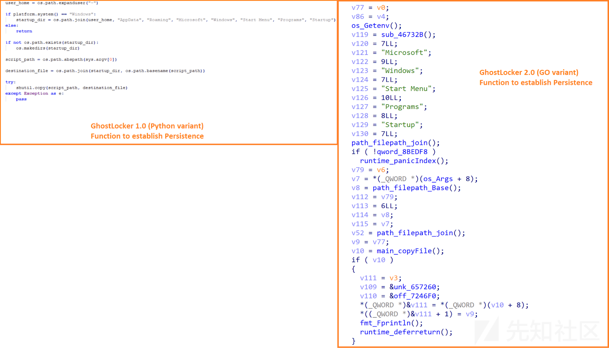](https://xzfile.aliyuncs.com/media/upload/picture/20240310152640-89863b72-deaf-1.png)

在保持权限维持后，勒索软件通过 URL hxxp \[://\] 94 \[.\] 103 \[.\] 91 \[.\] 246 \[/\] incrementLaunch 建立与 C2 服务器的连接。  
[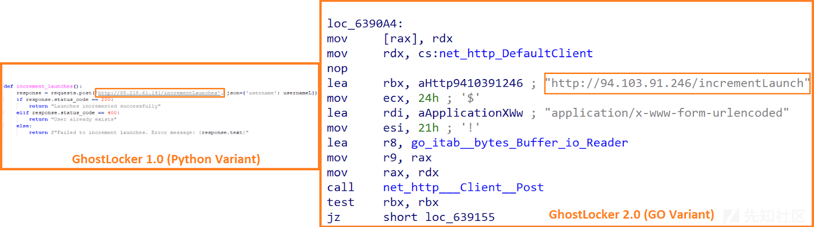](https://xzfile.aliyuncs.com/media/upload/picture/20240310152740-ad349bc2-deaf-1.png)  
启动与 C2 连接的函数。

与 C2 服务器建立成功连接后，勒索软件会生成密钥和加密 ID，并从其配置参数中收集受害者的 IP 地址、感染日期和其他信息，包括加密状态、勒索金额和受害者标识符字符串，以在受害者的机器内存中创建一个 JSON 文件。  
[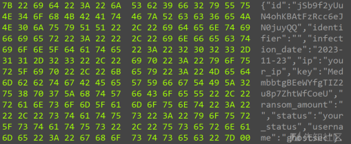](https://xzfile.aliyuncs.com/media/upload/picture/20240310152831-cb904fd0-deaf-1.png)

生成的 JSON 文件通过 URL hxxp \[://\] 94 \[.\] 103 \[.\] 91 \[.\] 246 \[/\] addInfection 发送到 C2 服务器，以在 C2 面板中注册受害者的机器感染。  

在 C2 面板注册受害者计算机感染后，勒索软件会尝试从受害者计算机中的配置参数终止定义的进程或服务或 Windows 计划任务，以逃避检测。  

GhostLocker 2.0 根据威胁行为团体定义的文件扩展名列表，在受害者机器上搜索目标文件，在加密程序开始之前，它将通过 HTTP POST 方法将目标文件上传到 C2 服务器，上传的 URL 为 "hxxp \[://\] 94 \[.\] 103 \[.\] 91 \[.\] 246 \[/\] upload"。在我们分析的 GhostLocker 2.0 样本中，威胁行为团体已经配置了勒索软件，以便窃取和加密具有文件扩展名.doc、.docx、.xls 和.xlsx 的文件。  
[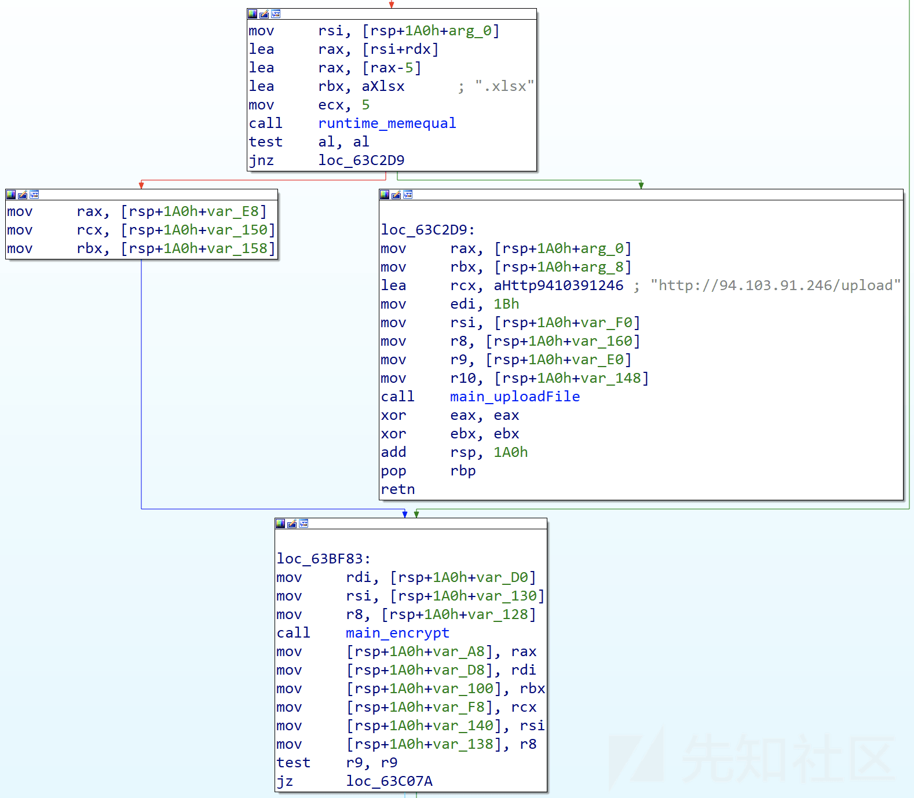](https://xzfile.aliyuncs.com/media/upload/picture/20240310153207-4cc8e012-deb0-1.png)  
将目标文件上传到 C2 服务器的功能

在成功上传目标文件后，GhostLocker 2.0 会对目标文件进行加密，并附加“.ghost”作为加密文件的文件扩展名。在加密过程中，GhostLocker 2.0 会跳过“C:\\Windows”文件夹。完成加密例程后，勒索软件将嵌入的勒索字条放入受害者桌面上文件名为“Ransomnote.html”的 HTML 文件中，并使用 Windows“开始”命令启动它。  
  
>>>>>>> 4992f5f682bf7aa8873ceb2495ac1d2a8296850f
删除并打开勒索信的功能

# 可能用于扫描和入侵网站的其他工具

<<<<<<< HEAD
Talos 的研究发现了 GhostSec 武器库中的两种新工具，该黑客组织声称使用它们来破坏合法网站。其中之一是“GhostSec 深度扫描工具集”，用于递归扫描合法网站，另一个是名为“GhostPresser”的执行跨站脚本（XSS）攻击的黑客工具。

GhostSec 深度扫描工具  
GhostSec 深度扫描工具集是一个 Python 实用程序，攻击者可以使用它来扫描潜在目标的网站。  

=======
Talos 的研究发现了 GhostSec 武器库中的两种新工具，该黑客组织声称使用它们来破坏合法网站。其中之一是“GhostSec 深度扫描工具集”，用于递归扫描合法网站，另一个是名为“GhostPresser”的执行跨站脚本（XSS）攻击的黑客工具。

GhostSec 深度扫描工具  
GhostSec 深度扫描工具集是一个 Python 实用程序，攻击者可以使用它来扫描潜在目标的网站。  
[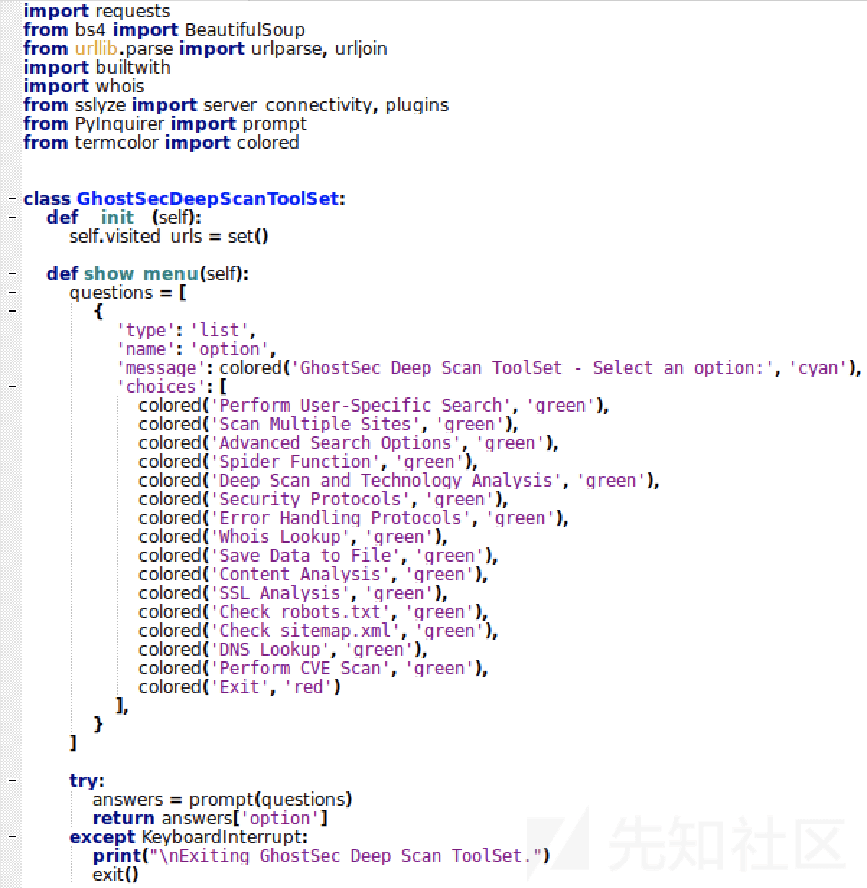](https://xzfile.aliyuncs.com/media/upload/picture/20240310153548-d00ac148-deb0-1.png)
>>>>>>> 4992f5f682bf7aa8873ceb2495ac1d2a8296850f

该工具有几个模块可以在目标网站上执行以下扫描：

-   执行特定于用户的搜索。
-   扫描多个网站。
-   提取网站上的超链接。
-   执行深度扫描并分析用于构建网页的技术。
-   扫描安全协议以检测 SSL/TLS 和 HSTS（HTTP 严格传输安全）。
-   执行网站内容分析并将内容提取到文件中。
-   执行 WhoIs 查找。
-   检查网站中是否存在任何损坏的链接。

该工具还包含用于执行特定功能的占位符，包括 SSL 分析、DNS 查找、检查 robots.txt 和 sitemap.xml、目标网站上的 CVE 扫描以及基于文件类型、日期范围和自定义标准的高级搜索。这些网站，表明 GhostSec 的工具库在不断发展。  
<<<<<<< HEAD
对我们来说最突出的模块之一是“deep\_scan”函数，攻击者定义该函数用于解析和抓取目标网页中的信息，并评估网页中使用的技术。它是通过使用 Python 库 Beautiful Soup 来完成的，Beautiful Soup 是一个用于从 HTML 和 XML 文件中解析数据的 Python 包，而 BuiltWith Python 库是一个用于检测网站使用的技术的 Python 包，例如 Apache、JQuery 和 WordPress。  
[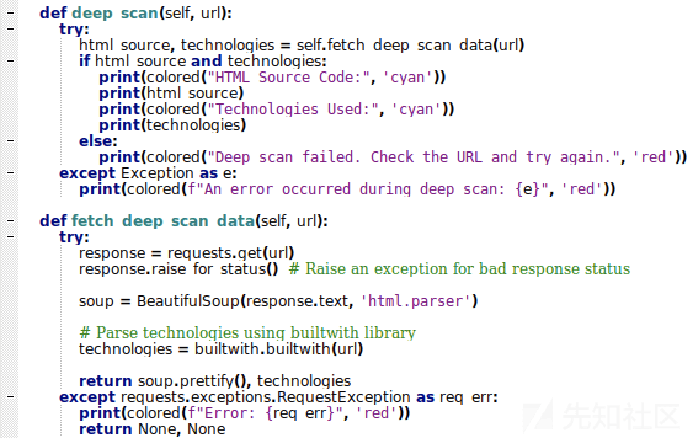](https://xzfile.aliyuncs.com/media/upload/picture/20240310153740-13080f5a-deb1-1.png)  
=======
对我们来说最突出的模块之一是“deep\_scan”函数，攻击者定义该函数用于解析和抓取目标网页中的信息，并评估网页中使用的技术。它是通过使用 Python 库 Beautiful Soup 来完成的，Beautiful Soup 是一个用于从 HTML 和 XML 文件中解析数据的 Python 包，而 BuiltWith Python 库是一个用于检测网站使用的技术的 Python 包，例如 Apache、JQuery 和 WordPress。  
  
>>>>>>> 4992f5f682bf7aa8873ceb2495ac1d2a8296850f
解析和识别网页中使用的技术的功能

# GhostPresser：一款 WordPress 黑客工具

GhostPresser，一个针对 WordPress 内容管理系统的管理员绕过的黑客工具，是一个 Shell 脚本，GhostSec 声称曾在对加拿大合法网站的 XSS 攻击中使用过。该工具似乎正在功能加强的开发中，因为我们在工具中发现了几个占位符，用于包括对目标网站执行审核功能。我们目前不确定威胁行为团体打算在他们的工具中实施什么类型的攻击。  
<<<<<<< HEAD
[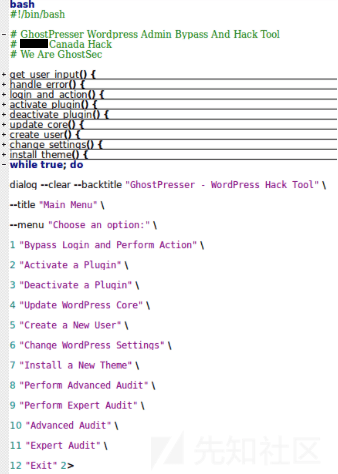](https://xzfile.aliyuncs.com/media/upload/picture/20240310154044-80a6f62a-deb1-1.png)
=======

>>>>>>> 4992f5f682bf7aa8873ceb2495ac1d2a8296850f

成功将 GhostPresser 注入 WordPress 上的目标网站后，威胁参与者可以实现以下操作。

-   绕过登录并执行测试 cookie 等操作。
-   激活和停用插件。
-   更改 WordPress 设置。
-   创建一个新用户。
-   更新 WordPress 核心信息。
-   安装新主题的功能。

下面是 GhostPresser 中用于在 WordPress 中安装新主题的功能示例。  
<<<<<<< HEAD
[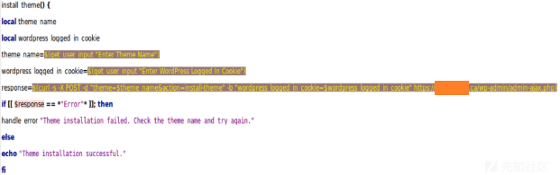](https://xzfile.aliyuncs.com/media/upload/picture/20240310154310-d7e222ac-deb1-1.png)
=======
[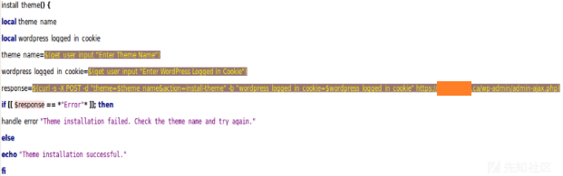](https://xzfile.aliyuncs.com/media/upload/picture/20240310154310-d7e222ac-deb1-1.png)
>>>>>>> 4992f5f682bf7aa8873ceb2495ac1d2a8296850f

IOCs:  
a1b468e9550f9960c5e60f7c52ca3c058de19d42eafa760b9d5282eb24b7c55f  
8b758ccdfbfa5ff3a0b67b2063c2397531cf0f7b3d278298da76528f443779e9  
36760e9bbfaf5a28ec7f85d13c7e8078a4ee4e5168b672639e97037d66eb1d17  
8fa28795e4cd95e6c78c4a1308ea80674102669f9980b2006599d82eff6237b3  
94\[.\]103\[.\]91\[.\]246  
hxxp\[://\]94\[.\]103\[.\]91\[.\]246/incrementLaunch  
hxxp\[://\]94\[.\]103\[.\]91\[.\]246/addInfection  
hxxp\[://\]94\[.\]103\[.\]91\[.\]246/victimchat?id=\[EncryptionID\]  
hxxp\[://\]94\[.\]103\[.\]91\[.\]246/login?next=  
hxxp\[://\]94\[.\]103\[.\]91\[.\]246/upload
