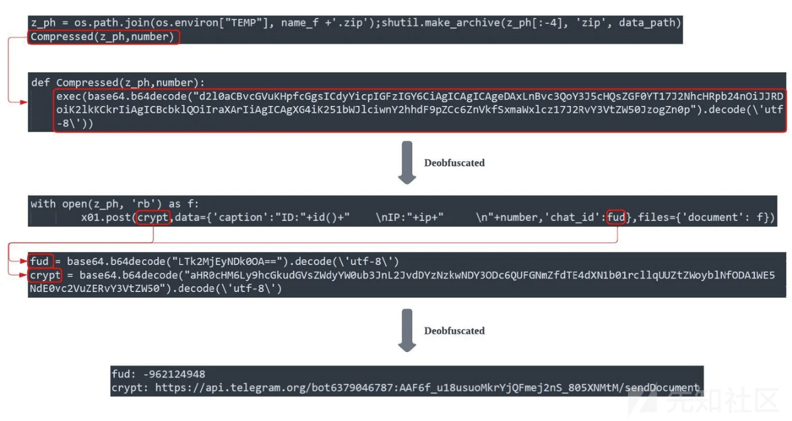
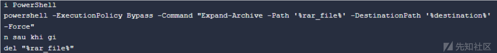
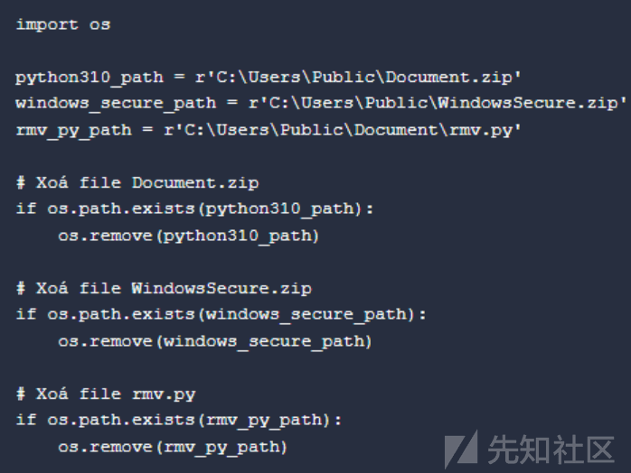

# 【翻译】Python 信息窃取程序利用通讯程序传播诱饵 - 先知社区

原文链接：[https://www.cybereason.com/blog/unboxing-snake-python-infostealer-lurking-through-messaging-service](https://www.cybereason.com/blog/unboxing-snake-python-infostealer-lurking-through-messaging-service)

### 正文

Cybereason 安全人员调查并分析各类威胁，发布威胁分析报告以告知用户存在的威胁同时提供实用的安全防御建议。在本次报告中，Cybereason 安全人员深入研究了利用 GitHub 和 GitLab 传播 Python 信息窃取程序的攻击活动，该信息窃取程序最终通过 Telegram Bot API 或其他合法平台传输窃取的敏感数据。

### 总览

-   合法网站滥用

许多攻击者利用公共代码库和通信应用作为其 C2 服务器设施，因为这类网站极具知名度，受到大量用户的信任和使用。滥用基于 Web 的合法代码托管平台（如 GitHub 和 GitLab）将很难被安全应用检测到，并且随着越来越多的用户使用这类网站，检测到恶意行为将更加困难。因此，越来越多的攻击者恶意使用代码托管平台。

-   狡兔三窟

攻击者拥有三种不同的 Python 信息窃取程序变体。三者的不同点是第一、二种变体为 Python 脚本，而第三种变体是由 PyInstaller 组装的可执行文件。

-   大量凭据通过合法平台传播

从受害者那窃取的数据将被传输至不同的平台，如 Discord、GitHub 和 Telegram。由于 Telagrm 等工具的可访问性和便捷性，攻击者滥用合法通信程序的频率大大提高。

### 分析

本部分介绍了 Python 信息窃取程序的感染链，见下图。分析由以下四个部分组成：

-   分析 Python 信息窃取程序的两个阶段
-   分析三种不同的 Python 信息窃取程序变体
-   Python 信息窃取程序的比较分析
-   程序开发人员属性分析

### 感染链

正如 Twitter 和 StackOverflow 上的安全研究人员所说，此次攻击活动的感染链始于攻击发布的 Facebook 信息。Facebook 信息诱导受害者下载 RAR 或 ZIP 压缩包文件。从压缩包文件可以看出，本次感染链由两个下载器组成，下载器最终将部署合适的 Python 信息窃取程序变体。

所有变种的感染链都很相似，不过以下感染进程的阶段一和阶段二特定于变种一。

### 阶段一

压缩文件中包含一个 BAT 脚本，该脚本是感染链的初始下载器。脚本将使用 curl 命令下载 ZIP 文件，并且将文件保存至**C:\\Users\\Public\\myFile.zip**路径下。BAT 脚本还将继续使用 PowerShell 命令 Expand-Archive 从 ZIP 文件中提取 CMD 脚本**vn.cmd\\**以进一步感染受害主机。

### 阶段二

CMD 脚本**vn.cmd\\**是负责下载和执行 Python 信息窃取程序的主要脚本。

脚本开头通过大量的 set 命令将特定字母设置为新的变量名，如下图，显然，脚本运行时将通过变量值的替换来进行反混淆。不过并非所有版本的变体都使用了该混淆技术，混淆技术的使用与版本相关。

**vn.cmd\\**脚本运行后会打开 Google Chrome 浏览器，访问阿里巴巴网站主页，随后，脚本将从 Git Lab 下载并重命名三个文件。三个文件的详细信息如下：

-   ***WindowsSecure.bat\\***：该文件是一个 BAT 脚本，被放置于开始目录下。每次用户登入时，脚本均将执行 project.py 文件在受害主机上建立持久性。

-   ***Document.zip\\***：一个包含捆绑 python 包的压缩包文件。文件可保证 project.py 无需额外安装 Python 包即可顺利运行。
    
-   ***Project.py\\***：一个混淆的 Python 脚本，负责从不同的浏览器窃取凭据。
    

一旦下载完成，vn.cmd 脚本将执行利用 Document.zip 中的 Python 模块执行 Project.py 文件。

### 变种一

变种一是此前提到的 Project.py 文件。该脚本包含嵌套混淆，其中使用各种压缩方法来压缩十六进制值。反混淆流程如下：

反混淆的 Python 脚本首先会访问 ipinfo\[.\]com 获取当前受害主机的 IP 地址与地理位置。这两条信息有利于攻击者更好地了解受害者来自哪里，为攻击者提供更有效的社会工程学攻击所需的背景。此外，精心设计的社会工程学方法还可以使攻击者利用其他潜在目标，例如受害者的熟人。

一旦脚本获取到受害者的地理位置，脚本的*main()*函数将进入凭据收集阶段。main() 首先会识别受害主机中浏览器的相关目录路径。该脚本针对七种浏览器，浏览器名称如下：

-   Brave
-   Coc Coc Browser
-   Chromium
-   Google Chrome Browser
-   Microsoft Edge
-   Mozilla Firefox
-   Opera Web Browser

main() 函数将浏览器相关信息保存至硬盘，同时复制信息到三个不同的文件中。

| FILES |
| --- |
| c:\\users{user\_name}}\\appdata\\local\\temp{country + ip address}\\cookiefb.txt |
| c:\\users{user\_name}}\\appdata\\local\\temp{country + ip address}{browser}{profile + number}\\cookie.txt |
| c:\\users{user\_name}}\\appdata\\local\\temp{country + ip address}{browser}\\password.txt |

*File Locations For Information Dump From main() Function*

除了窃取 Cookie 和登录凭据外，攻击者还将 Facebook 的 Cookie 信息转储到磁盘中的*cookiefb.txt*文件。攻击者的这种行为很可能会劫持受害者的 Facebook 帐户，从而扩大其感染面。

脚本最终将包含窃取信息的文件以“国家/\*\*\*地区 + ip 地址.zip”格式命名的 zip 文件中，并通过 Telegram Bot API 发送至攻击者。

main *() 函数尝试通过 Telegram Bot API 的*sendDocument 功能传输 ZIP 文件，sendDocument 功能允许 API 发送普通文件。main *()*函数似乎包含两次*sendDocument* API 调用，两者都有不同的机器人令牌以及不同的聊天 ID，表明信息被发送到两个不同的聊天室。另外，执行此 POST 请求的方法也不相同。

-   混淆字符串-Telegram Bot API 由*Compressed()*函数调用，其中包含 base64 混淆的代码。

-   明文字符串-Telegram Bot API 由 main() 函数调用，函数无任何混淆。

从这部分可以看出，Telegram Bot API 仅用于凭证收集，与其他攻击者的行为有所不同，其他攻击者都是利用该 API 进行完整的 C2 通信。

### 变种二

安全人员还观察到了另一种 Python 脚本变种，该变种同样试图收集受害主机浏览器上存储的信息。变种二的感染流程与变种一类似，直到下载 Python 信息窃取程序阶段，以及最终 BAT 脚本负载下载了以下**三个**文件。

-   **Lib-jae.py**：混淆的 Python 信息窃取程序脚本。
-   **Python39.zip：Python**模块包。
-   **WindowsSecure.bat**：用于建立持久性的 BAT 脚本，放置在启动目录中。

然而，与变种一相比，此变种的 Python 脚本有一些显着的脚本结构差异。

#### 脚本内容差异

变种二的脚本内容是面向对象编程的，变种使用*RitCucki*类来准备和执行浏览器相关信息窃取操作。

变种二的代码内容也比变种一更混乱，代码中的许多实例方法以及变量名称均不太直观。攻击者可能使用该种方式来进行代码混淆。

#### 目标浏览器不同

不像变种一针对七种浏览器，变种二仅查找三种浏览器的信息，三种浏览器分别是

-   **Coc Coc Browser**
-   **Google Chrome**
-   **Microsoft Edge**

#### 分阶段有效负载

变种二的初始有效负载会持续从 C2 基础设施、GitHub 或 GitLab 存储库获取经过 Base64 编码的最终有效负载。一旦获取有效负载成功后，变种将解码并执行有效负载，进而实现类*RitCucki*。

Python 类*RitCucki*还依赖于存储在文件*scriptcall*中的字符串集。该脚本从与上图相同的 GitHub 存储库中获取*scriptcall*。

如果其中一个文件丢失，这一额外的混淆步骤可能会阻碍分析。即使有了最后阶段的有效负载，如果没有包含这组字符串的文件，分析人员也很难确定脚本的意图。

### 变种三

与变种一和变体二类似，变种三采用类似的方法，利用多个下载器来部署 Python 信息窃取程序。但是，与变种一和变种二不同，变种三是 Python 文件打包的可执行文件。

变种三似乎是由 PyInstaller 组装的。PyInstaller 组装的可执行文件的大小比普通可执行文件的大小要大，并且变种三的大小大于**13 MB**。

反编译的主脚本与变种二的阶段有效负载相同，它尝试下载包含*RitCucki*类的 Python 脚本。这表明变种三可能是变种二的 exe 可执行版本。

这从*RitCucki*类中的*critduplicatetzz*实例方法中的代码也可以看出，该代码包含注释掉的代码，负责在环境中为此 Python 信息窃取器的可执行版本创建持久性。

变种二的开发者似乎想让攻击者可以选择.py 脚本或.exe 可执行格式。

### 对比分析

### 信息窃取程序 变体比较

三个 Python 信息窃取程序 s 的最终目标是获取目标浏览器中存储的信息。然而，三个变体之间存在几个关键差异。

|     | 变种一 | 变种二 | 变种三 |
| --- | --- | --- | --- |
| 向*ipinfo\[.\]io*发出 GET 请求以识别受害者的地理位置 | ✔   |     |     |
| 由 PyInstaller 打包 |     |     | ✔   |
| 不依赖本地安装的 Python 包 | ✔   | ✔   | ✔   |
| 将文件部署到 C:\\Users\\Public 子目录 | ✔   | ✔   |     |
| 函数和变量名混淆 |     | ✔   | ✔   |
| 通过数据压缩进行混淆 | ✔   |     |     |
| 通过启动文件夹建立持久化 | ✔   | ✔   | ✔   |
| 分阶段有效载荷 |     | ✔   | ✔   |
| 针对 Brave 浏览器 | ✔   |     |     |
| 针对 Coc Coc 浏览器 | ✔   | ✔   | ✔   |
| 针对 Chromium 浏览器 | ✔   |     |     |
| 窃取 Facebook Cookie | ✔   | ✔   | ✔   |
| 针对 Google Chrome 浏览器 | ✔   | ✔   | ✔   |
| 针对 Microsoft Edge 浏览器 | ✔   | ✔   | ✔   |
| 针对 Mozilla Firefox 浏览器 | ✔   |     |     |
| 针对 Opera Web 浏览器 | ✔   |     |

根据公开信息，最早发现的变种二是在 2023 年 2 月，而变种一是在 2023 年 6 月。这表明最初的版本可能实际上是变种二，变种一是 Python 信息窃取程序变体的最新版本。这可能是变种一的目标浏览器数量增加的原因。

### 感染链差异

Python 信息窃取程序部署方法有多种。一些显着的流程差异包括：

-   **GitHub 和 GitLab 两种方案可选**：Python 信息窃取程序主要 C2 服务器的替代方案是不常见的非文件共享域 (non-file sharing domains)，不过攻击者也使用 Google Workspace。
    
-   **其他下载器文件格式**：虽然许多 Python 信息窃取程序的下载器是 BAT 或 CMD 脚本，但也有不同的变体，例如 exe 可执行文件、恶意 Microsoft 文档、恶意 MSI 文件或 VBScript 文件。
    
-   **Telegram Bot API 替代品**：尽管并非所有程序都将窃取的凭据发送到 Telegram，但 Python 信息窃取程序，尤其是变种一，主要利用 Telegram Bot API。安全人员还观察到信息窃取程序将获取的凭据发送到 Discord 或存储在 GitLab 或 GitHub 中的主机文件中列出的其他 C2 服务器。
    
-   **证据删除脚本**：变种一会移除嵌入在 Python 信息窃取程序本体中相关的脚本。其他版本则下载另一个 Python 脚本*rmv.py*，专门用于删除文件。变种二和三目前没有进行证据移除操作。
    
-   **下载器数量**：如上文所示，较新版本程序依赖两个 BAT 下载器脚本去下载 Python 信息窃取程序本体。不过，有些只依赖第二阶段，并会立即尝试下载 Python 信息窃取程序。
    

### 潜在归因

有一些迹象表明 Python 信息窃取程序的开发人员或附属机构是越南语使用者

#### 注释

分析中观察到的一些 BAT 脚本包含越南语注释。例如，“sau khi gi”翻译为“之后”。这可能是越南俚语中的“sau khi ghi”，意思是“写完之后”。重要的是，这些注释是在 Powershell 命令执行解压 ZIP 文件后写入的。

此外，移除脚本*rmv.py*似乎还包含注释“Xoa”，意思是“擦除”或“删除”。

#### 命名约定

攻击者使用的命名约定也表明其与越南语有紧密联系。一些观察到的使用越南语的命名约定如下：

-   **函数名称**：该脚本包含迹象表明这可能是由使用越南语的攻击者创建的。在脚本中，观察到函数名称使用越南语短语，如 demso() 函数负责计数器，函数名在越南语中也意味着*“计数”*。

-   **帐户别名**：一些 GitHub 和 GitLab 存储库名称或帐户名称使用越南语命名约定。例如，GitLab 帐户别名之一是*Khoi Nguyen*，这似乎是越南常见的名称，也是社区内常用的别名。

**文件名**：一些 Python 信息窃取程序文件名使用通用越南语名称，示例包括*hoang.exe*或*hoangtuan.exe*。

### 目标浏览器

所有变体都支持 Coc Coc 浏览器，这是越南社区广泛使用的越南语浏览器。浏览器的选择也表明，曾经有过针对越南社区的需求。特别是对于变种二和三，这两个变种被认为是较早的版本，针对包括 Coc Coc 浏览器在内的三种浏览器。

### MITRE ATT&CK 映射

| 战术  | 技术/子技术 |
| --- | --- |
| TA0001：初始访问 | T1566 – 网络钓鱼 |
| TA0002：执行 | T1059 – 命令和脚本解释器 |
| TA0003：持久化 | T1547 – 启动或登录自动启动执行：注册表运行键/启动文件夹 |
| TA0005：防御规避 | T1070.004 – 指示器移除：文件删除 |
| TA0005：防御规避 | T1027 – 混淆的文件或信息 |
| TA0006：凭证访问 | T1539 – 窃取 Web 会话 Cookie |
| TA0006：凭证访问 | T1555.003 – 来自密码存储的凭证：来自 Web 浏览器的凭证 |
| TA0010：渗透 | T1041 – 通过 C2 通道渗透 |
| TA0010：渗透 | T1567 – 通过 Web 服务进行渗透 |
| TA0011：命令与控制 | T1071.001 – 应用层协议：Web 协议 |