# 【翻译】apt 组织 Evasive Panda（在逃熊猫）利用祈愿节来针对藏人 - 先知社区

翻译：[https://www.welivesecurity.com/en/eset-research/evasive-panda-leverages-monlam-festival-target-tibetans/](https://www.welivesecurity.com/en/eset-research/evasive-panda-leverages-monlam-festival-target-tibetans/)  
<<<<<<< HEAD
  
=======
  
>>>>>>> 4992f5f682bf7aa8873ceb2495ac1d2a8296850f
ESET 研究人员发现了一项网络间谍活动，至少自 2023 年 9 月以来，该活动一直通过有针对性的水坑（也称为战略网络侵害）和供应链侵害来提供藏语翻译软件的木马安装程序，从而使藏人受害。攻击者旨在部署适用于 Windows 和 macOS 的恶意下载程序，利用 MgBot 和后门来危害网站访问者，据我们所知，该后门尚未公开记录；我们把它命名为夜门。  
这篇博文的要点：

-   我们发现了一项网络间谍活动，该活动利用祈愿节（宗教集会）来针对多个国家和地区的藏人。
-   攻击者入侵了在印度举行的一年一度的节日组织者的网站，并添加了恶意代码来创建一个针对从特定网络连接用户的水坑攻击。
-   我们还发现软件开发商的供应链受到损害，并向用户提供了 Windows 和 macOS 的木马安装程序。
-   攻击者为此次行动部署了许多恶意下载程序和全功能后门，其中包括一个未公开记录的 Windows 后门，我们将其命名为 Nightdoor。
-   我们高度确信将此次活动归因于与中国地区相关联的 Evasive Panda APT 组织。

# Evasive Panda 简介

Evasive Panda（也称为 BRONZE HIGHLAND 和 Daggerfly）是一个中文 APT 组织，至少自 2012 年以来一直活跃。ESET Research 观察到该组织针对中国大陆、香港、澳门和尼日利亚的个人进行网络间谍活动。东南亚和东亚的政府实体成为攻击目标，特别是中国、澳门、缅甸、菲律宾、台湾和越南。中国和香港的其他组织也成为目标。据公开报道，该组织还针对香港、印度和马来西亚的未知实体。  
该组织使用自己的定制恶意软件框架和模块化架构，允许其后门（称为 MgBot）接收模块来监视受害者并增强其功能。自 2020 年以来，我们还观察到 Evasive Panda 有能力通过中间人攻击劫持合法软件的更新来提供后门。

# 事件概览

2024 年 1 月，我们发现了一次网络间谍活动，攻击者入侵了至少三个网站以进行水坑攻击，并入侵了一家西藏软件公司的供应链。  
<<<<<<< HEAD
这个被水坑攻击侵害的受损网站属于印度的 Kagyu 国际祈愿信托基金会，该组织在国际上推广藏传佛教。攻击者在网站中放置了一个脚本，用于验证潜在受害者的 IP 地址，如果该地址位于目标地址范围之一，则向用户显示一个虚假的错误页面，诱使用户下载一个名为“证书”的“修复”（如果访问者使用 Windows，则扩展名为 .exe，如果使用 macOS，则为 .pkg）。这个文件是一个恶意下载器，用于部署侵害链中的下一个阶段。  
根据代码检查的 IP 地址范围，我们发现攻击者针对的是印度、台湾、香港、澳大利亚和美国的用户；这次袭击可能旨在利用国际社会对每年 1 月在印度菩提伽耶市举行的噶举祈愿节（图 1）的兴趣。  

2023 年 9 月左右，攻击者入侵了一家位于印度的软件开发公司的网站，该公司生产藏语翻译软件。攻击者在那里放置了多个木马应用程序，这些应用程序部署了适用于 Windows 或 macOS 的恶意下载程序。  
除此之外，攻击者还滥用同一网站和一个名为 Tibetpost 的西藏新闻网站 ——tibetpost \[.\] net—— 来托管恶意下载获得的有效负载，其中包括两个全功能的 Windows 后门和未知数量的有效负载对于 macOS。  
[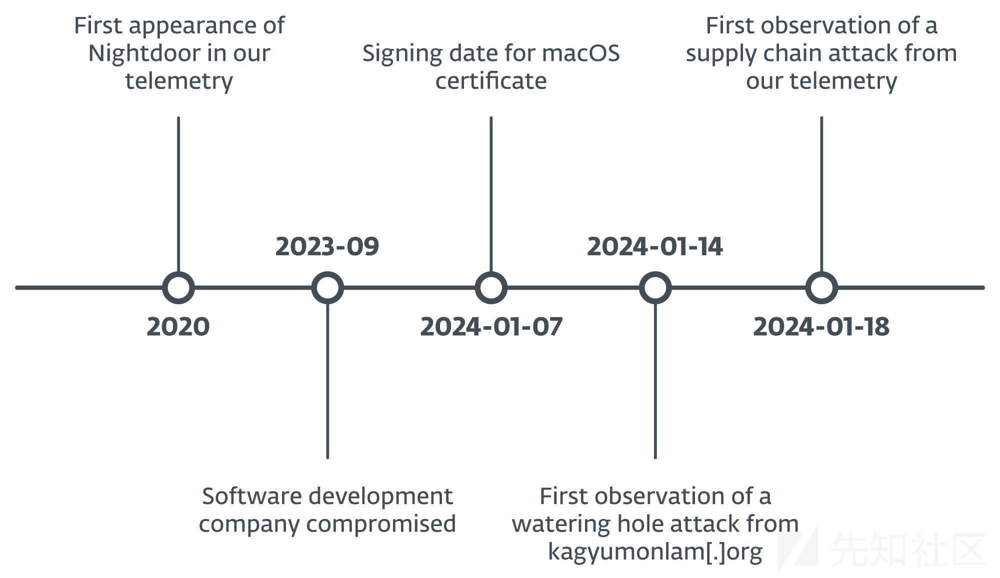](https://xzfile.aliyuncs.com/media/upload/picture/20240311232723-dbe475d4-dfbb-1.png)  
=======
这个被水坑攻击侵害的受损网站属于印度的 Kagyu 国际祈愿信托基金会，该组织在国际上推广藏传佛教。攻击者在网站中放置了一个脚本，用于验证潜在受害者的 IP 地址，如果该地址位于目标地址范围之一，则向用户显示一个虚假的错误页面，诱使用户下载一个名为“证书”的“修复”（如果访问者使用 Windows，则扩展名为 .exe，如果使用 macOS，则为 .pkg）。这个文件是一个恶意下载器，用于部署侵害链中的下一个阶段。  
根据代码检查的 IP 地址范围，我们发现攻击者针对的是印度、台湾、香港、澳大利亚和美国的用户；这次袭击可能旨在利用国际社会对每年 1 月在印度菩提伽耶市举行的噶举祈愿节（图 1）的兴趣。  

2023 年 9 月左右，攻击者入侵了一家位于印度的软件开发公司的网站，该公司生产藏语翻译软件。攻击者在那里放置了多个木马应用程序，这些应用程序部署了适用于 Windows 或 macOS 的恶意下载程序。  
除此之外，攻击者还滥用同一网站和一个名为 Tibetpost 的西藏新闻网站 ——tibetpost \[.\] net—— 来托管恶意下载获得的有效负载，其中包括两个全功能的 Windows 后门和未知数量的有效负载对于 macOS。  
[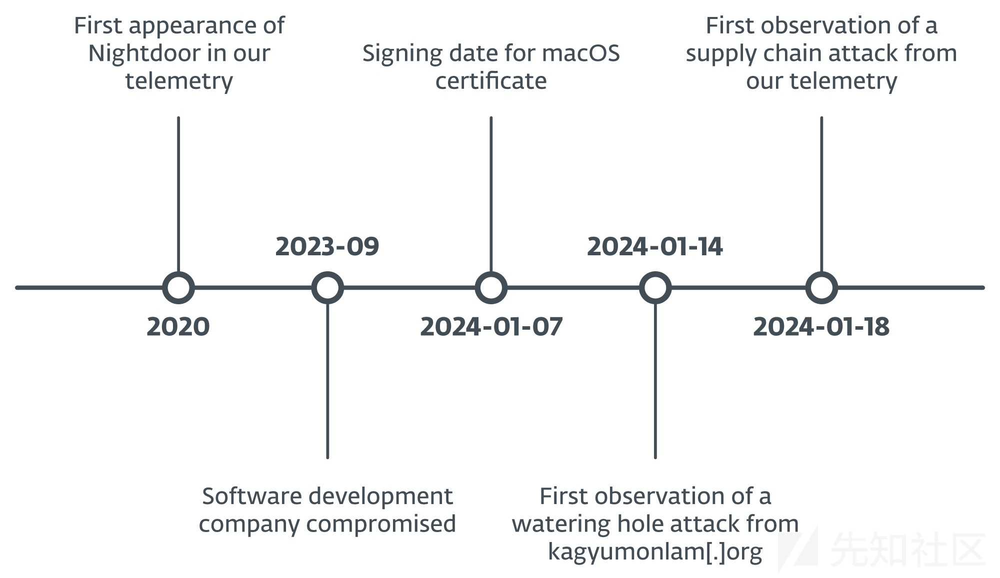](https://xzfile.aliyuncs.com/media/upload/picture/20240311232723-dbe475d4-dfbb-1.png)  
>>>>>>> 4992f5f682bf7aa8873ceb2495ac1d2a8296850f
我们非常自信地将此次活动归因于 Evasive Panda APT 组织，根据所使用的恶意软件：MgBot 和 Nightdoor。过去，我们曾看到两种后门同时部署，用于一次针对台湾宗教组织的无关攻击，它们还共享了相同的 C&C 服务器。这两点也适用于本文中描述的活动。

# 水坑攻击

<<<<<<< HEAD
2024 年 1 月 14 日 th，我们在 [https://www.kagyumonlam\[.\]org/media/vendor/jquery/js/jquery.js?3.6.3](https://www.kagyumonlam[.]org/media/vendor/jquery/js/jquery.js?3.6.3) 上检测到可疑脚本。  
恶意混淆代码被附加到合法的 jQuery JavaScript 库脚本中，如下图 3 所示。  
[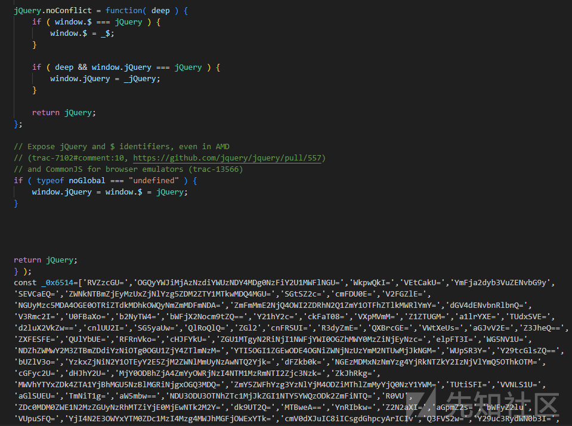](https://xzfile.aliyuncs.com/media/upload/picture/20240311233054-59a47c94-dfbc-1.png)  
该脚本向本地主机地址 [http://localhost:63403/?callback=handleCallback](http://localhost:63403/?callback=handleCallback) 发送 HTTP 请求，以检查攻击者的中间下载程序是否已在潜在受害者计算机上运行（参见图 3）。在之前受感染的计算机上，植入程序会使用 handleCallback ({"success":true}) 进行回复（参见图 4），并且脚本不会采取进一步的操作。  
图 4  
  
图 5  
[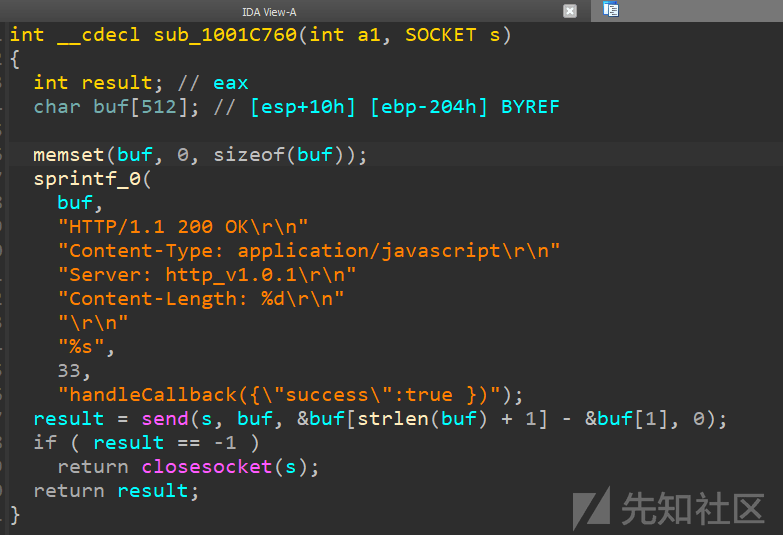](https://xzfile.aliyuncs.com/media/upload/picture/20240311233216-8a443d08-dfbc-1.png)  
如果计算机未回复预期数据，则恶意代码会继续从 [https://update.devicebug\[.\]com/getVersion.php](https://update.devicebug[.]com/getVersion.php) 上的辅助服务器获取 MD5 哈希值。然后根据 74 个哈希值的列表检查哈希值，如图 6 所示。  
图 6  
  
如果存在匹配，该脚本将呈现一个 HTML 页面，其中包含虚假的崩溃通知（图 7），旨在诱使访问用户下载解决方案来解决问题。该页面模仿典型的“喔唷，崩溃啦！”来自 Google Chrome 的警告。  
图 7  
[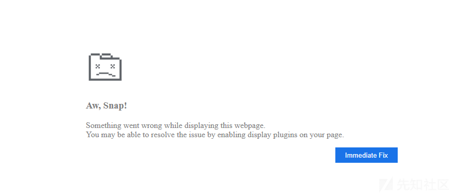](https://xzfile.aliyuncs.com/media/upload/picture/20240311233348-c146f052-dfbc-1.png)  
“立即修复”按钮会触发一个脚本，该脚本会根据用户的操作系统下载有效负载（图 8）。  
图 8  

=======
2024 年 1 月 14 日 th，我们在 [https://www.kagyumonlam\[.\]org/media/vendor/jquery/js/jquery.js?3.6.3](https://www.kagyumonlam[.]org/media/vendor/jquery/js/jquery.js?3.6.3) 上检测到可疑脚本。  
恶意混淆代码被附加到合法的 jQuery JavaScript 库脚本中，如下图 3 所示。  
  
该脚本向本地主机地址 [http://localhost:63403/?callback=handleCallback](http://localhost:63403/?callback=handleCallback) 发送 HTTP 请求，以检查攻击者的中间下载程序是否已在潜在受害者计算机上运行（参见图 3）。在之前受感染的计算机上，植入程序会使用 handleCallback ({"success":true}) 进行回复（参见图 4），并且脚本不会采取进一步的操作。  
图 4  
[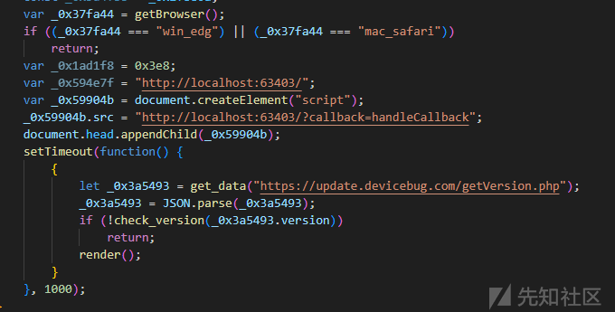](https://xzfile.aliyuncs.com/media/upload/picture/20240311233146-78ab442e-dfbc-1.png)  
图 5  
[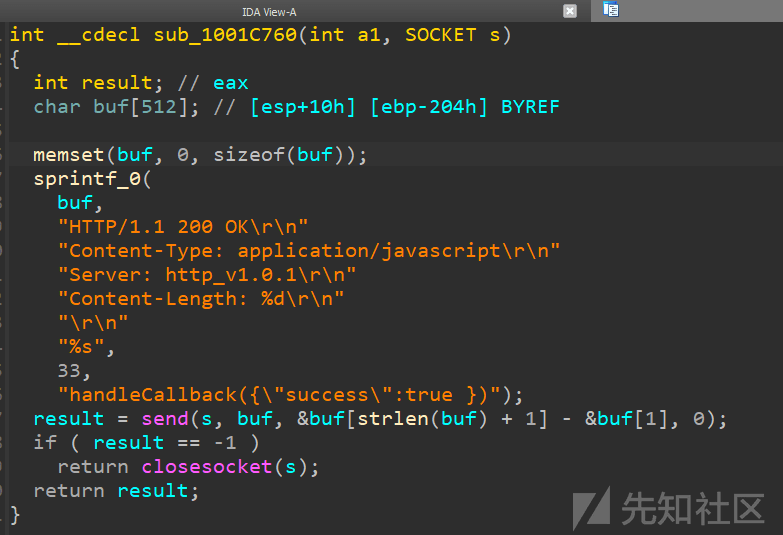](https://xzfile.aliyuncs.com/media/upload/picture/20240311233216-8a443d08-dfbc-1.png)  
如果计算机未回复预期数据，则恶意代码会继续从 [https://update.devicebug\[.\]com/getVersion.php](https://update.devicebug[.]com/getVersion.php) 上的辅助服务器获取 MD5 哈希值。然后根据 74 个哈希值的列表检查哈希值，如图 6 所示。  
图 6  
[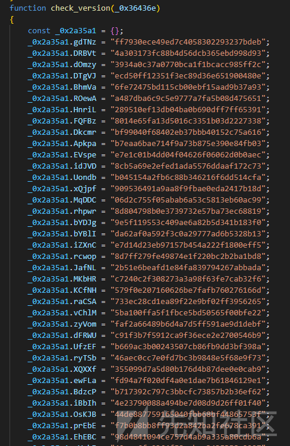](https://xzfile.aliyuncs.com/media/upload/picture/20240311233305-a7cc0fea-dfbc-1.png)  
如果存在匹配，该脚本将呈现一个 HTML 页面，其中包含虚假的崩溃通知（图 7），旨在诱使访问用户下载解决方案来解决问题。该页面模仿典型的“喔唷，崩溃啦！”来自 Google Chrome 的警告。  
图 7  
  
“立即修复”按钮会触发一个脚本，该脚本会根据用户的操作系统下载有效负载（图 8）。  
图 8  
[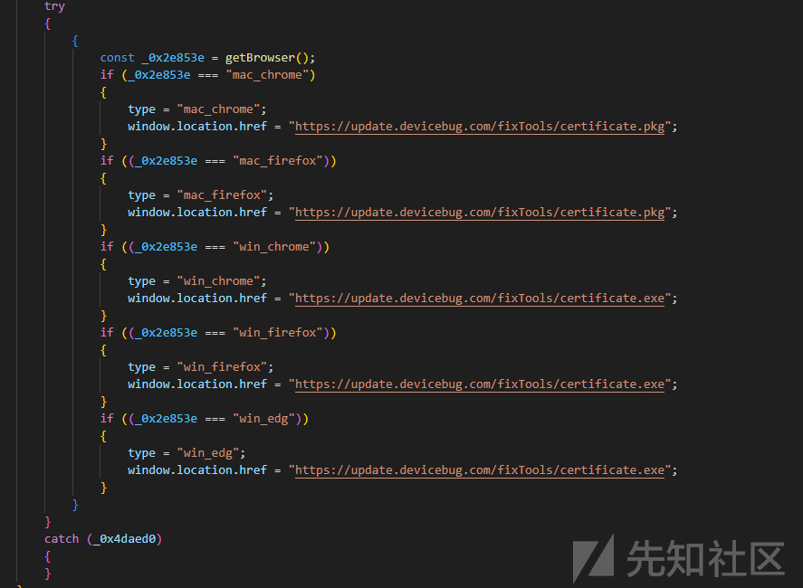](https://xzfile.aliyuncs.com/media/upload/picture/20240311233532-ff162d8a-dfbc-1.png)
>>>>>>> 4992f5f682bf7aa8873ceb2495ac1d2a8296850f

# 破解哈希值

有效负载传递的条件需要从 update.devicebug \[.\] com 的服务器获取正确的哈希值，因此 74 个哈希值是攻击者受害者选择机制的关键。然而，由于哈希是在服务器端计算的，因此了解使用哪些数据来计算它给我们带来了挑战。  
我们尝试了不同的 IP 地址和系统配置，并将 MD5 算法的输入范围缩小为用户 IP 地址的前三个八位字节的公式。换句话说，通过输入共享相同网络前缀的 IP 地址，例如 192.168.0.1 和 192.168.0.50，将从 C&C 服务器接收到相同的 MD5 哈希值。  
然而，在散列之前，前三个 IP 八位位组的字符串中包含未知的字符组合或盐，以防止散列被简单地暴力破解。因此，我们需要对盐进行暴力破解以确保输入公式的安全，然后使用整个 IPv4 地址范围生成哈希值，以找到匹配的 74 个哈希值。  
有时星星确实对齐，我们发现盐是 1qaz0okm！@#。通过 MD5 输入公式的所有部分（例如，192.168.1.1qaz0okm！@#），我们轻松地暴力破解了 74 个哈希值并生成了目标列表。完整列表请参见附录。  
如图 9 所示，大多数目标 IP 地址范围位于印度，其次是台湾、澳大利亚、美国和香港。请注意，大多数西藏侨民居住在印度。  
<<<<<<< HEAD
[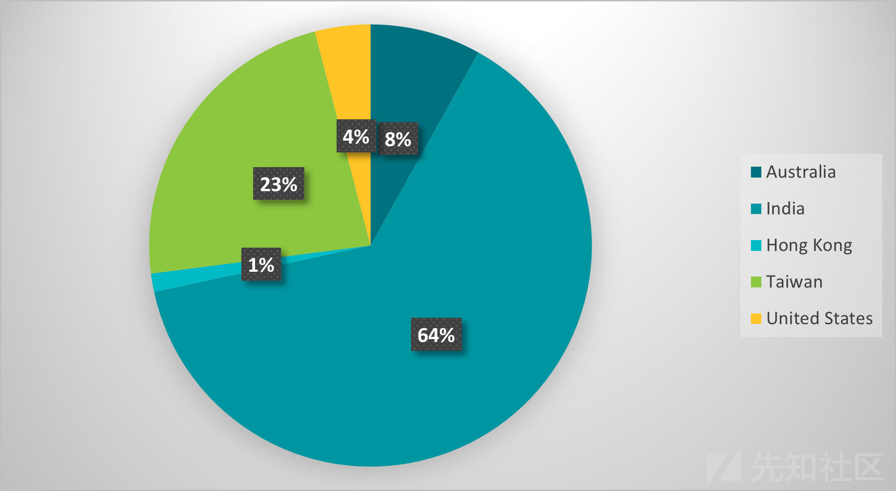](https://xzfile.aliyuncs.com/media/upload/picture/20240311233841-6feed7e6-dfbd-1.png)
=======

>>>>>>> 4992f5f682bf7aa8873ceb2495ac1d2a8296850f

# Windows payload

在 Windows 上，攻击的受害者会收到位于 [https://update.devicebug\[.\]com/fixTools/certificate.exe](https://update.devicebug[.]com/fixTools/certificate.exe) 的恶意可执行文件。图 10 显示了用户下载并执行恶意修复程序时遵循的执行链。  
图 10  
<<<<<<< HEAD
  
certificate.exe 是一个释放器，它部署侧加载链来加载中间下载器 memmgrset.dll（内部名为 http\_dy.dll）。此 DLL 从位于 [https://update.devicebug\[.\]com/assets\_files/config.json](https://update.devicebug[.]com/assets_files/config.json) 的 C&C 服务器获取 JSON 文件，其中包含下载下一阶段所需的信息（参见图 11）。  
  
=======
[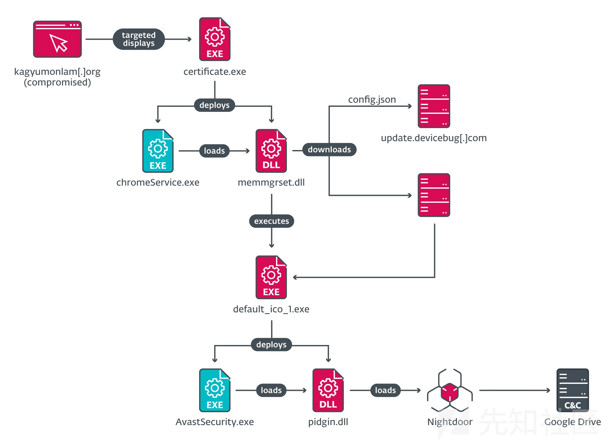](https://xzfile.aliyuncs.com/media/upload/picture/20240311233928-8c2a30ea-dfbd-1.png)  
certificate.exe 是一个释放器，它部署侧加载链来加载中间下载器 memmgrset.dll（内部名为 http\_dy.dll）。此 DLL 从位于 [https://update.devicebug\[.\]com/assets\_files/config.json](https://update.devicebug[.]com/assets_files/config.json) 的 C&C 服务器获取 JSON 文件，其中包含下载下一阶段所需的信息（参见图 11）。  
[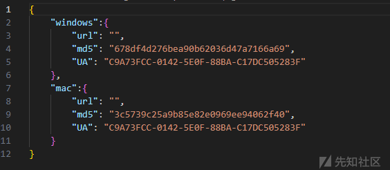](https://xzfile.aliyuncs.com/media/upload/picture/20240311233958-9df8ad56-dfbd-1.png)  
>>>>>>> 4992f5f682bf7aa8873ceb2495ac1d2a8296850f
当下载并执行下一阶段时，它会部署另一个侧面加载链来交付 Nightdoor 作为最终有效负载。下面的 Nightdoor 部分提供了对 Nightdoor 的分析。

# macOS payload

macOS 恶意软件与我们在供应链妥协中更详细记录的下载程序相同。然而，这个程序会释放一个额外的 Mach-O 可执行文件，该可执行文件侦听 TCP 端口 63403。其唯一目的是使用 handleCallback ({"success":true}) 回复恶意 JavaScript 代码请求，因此如果用户访问浇水再次打开网站时，JavaScript 代码不会尝试再次危害访问者。  
该下载器从服务器获取 JSON 文件并下载下一阶段，就像之前描述的 Windows 版本一样。

# 供应链侵害

<<<<<<< HEAD
1 月 18 日，我们发现一款多平台藏文翻译软件产品的官方网站（图 12）托管着包含合法软件木马安装程序的 ZIP 包，该安装程序在 Windows 和 macOS 上部署了恶意下载程序。  
  
=======
1 月 18 日，我们发现一款多平台藏文翻译软件产品的官方网站（图 12）托管着包含合法软件木马安装程序的 ZIP 包，该安装程序在 Windows 和 macOS 上部署了恶意下载程序。  
  
>>>>>>> 4992f5f682bf7aa8873ceb2495ac1d2a8296850f
我们发现一名来自日本的受害者下载了其中一个 Windows 软件包。表 1 列出了 URL 和已删除的植入程序。

| Malicious package URL | Payload type |
| --- | --- |
| [https://www.monlamit\[.\]com/monlam-app-store/monlam-bodyig3.zip](https://www.monlamit[.]com/monlam-app-store/monlam-bodyig3.zip) | Win32 downloader |
| [https://www.monlamit\[.\]com/monlam-app-store/Monlam\_Grand\_Tibetan\_Dictionary\_2018.zip](https://www.monlamit[.]com/monlam-app-store/Monlam_Grand_Tibetan_Dictionary_2018.zip) | Win32 downloader |
| [https://www.monlamit\[.\]com/monlam-app-store/Deutsch-Tibetisches\_W%C3%B6rterbuch\_Installer\_Windows.zip](https://www.monlamit[.]com/monlam-app-store/Deutsch-Tibetisches_W%C3%B6rterbuch_Installer_Windows.zip) | Win32 downloader |
| [https://www.monlamit\[.\]com/monlam-app-store/monlam-bodyig-mac-os.zip](https://www.monlamit[.]com/monlam-app-store/monlam-bodyig-mac-os.zip) | macOS downloader |
| [https://www.monlamit\[.\]com/monlam-app-store/Monlam-Grand-Tibetan-Dictionary-for-mac-OS-X.zip](https://www.monlamit[.]com/monlam-app-store/Monlam-Grand-Tibetan-Dictionary-for-mac-OS-X.zip) | macOS downloader |

# Windows packages

下图显示了 monlam-bodyig3.zip 包中木马应用程序的加载链。  
<<<<<<< HEAD
  
=======
[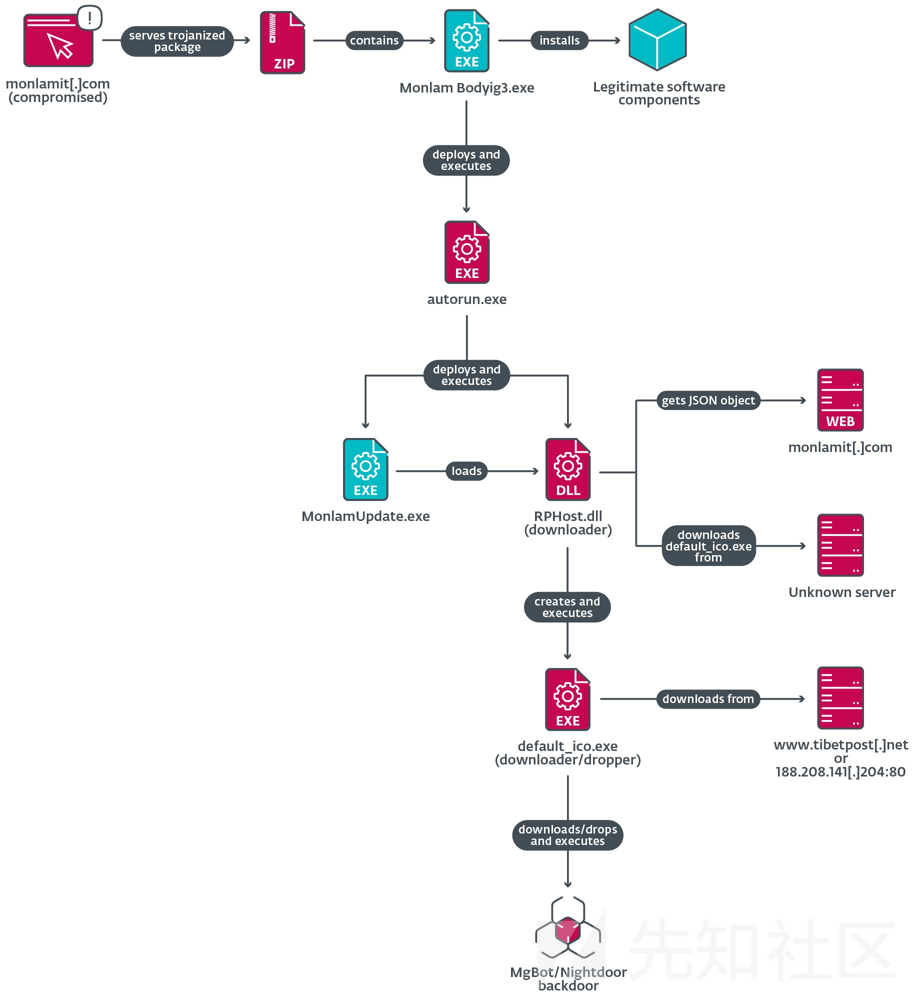](https://xzfile.aliyuncs.com/media/upload/picture/20240311234740-b1126d86-dfbe-1.png)  
>>>>>>> 4992f5f682bf7aa8873ceb2495ac1d2a8296850f
该木马应用程序包含一个名为 autorun.exe 的恶意植入程序，该植入程序部署两个组件：

-   名为 MonlamUpdate.exe 的可执行文件，它是来自名为 C64 Forever 的模拟器的软件组件，被滥用于 DLL 侧面加载，以及
-   RPHost.dll，旁加载 DLL，是下一阶段的恶意下载程序。

当下载器 DLL 加载到内存中时，它会创建一个名为 Demovale 的计划任务，旨在每次用户登录时执行。但是，由于该任务没有指定要执行的文件，因此无法建立持久性。  
接下来，此 DLL 获取 UUID 和操作系统版本以创建自定义用户代理，并向 [https://www.monlamit\[.\]com/sites/default/files/softwares/updateFiles/Monlam\_Grand\_Tibetan\_Dictionary\_2018/UpdateInfo](https://www.monlamit[.]com/sites/default/files/softwares/updateFiles/Monlam_Grand_Tibetan_Dictionary_2018/UpdateInfo) 发送 GET 请求.dat 获取包含 URL 的 JSON 文件，以下载并执行有效负载，并将其放入 % TEMP% 目录。我们无法从受感染的网站获取 JSON 对象数据样本；因此我们不知道 default\_ico.exe 到底是从哪里下载的，如图 13 所示。  
通过 ESET 遥测，我们注意到非法 MonlamUpdate.exe 进程在不同场合下载并执行了至少四个恶意文件到 % TEMP%\\default\_ico.exe。表 2 列出了这些文件及其用途。  
<<<<<<< HEAD
[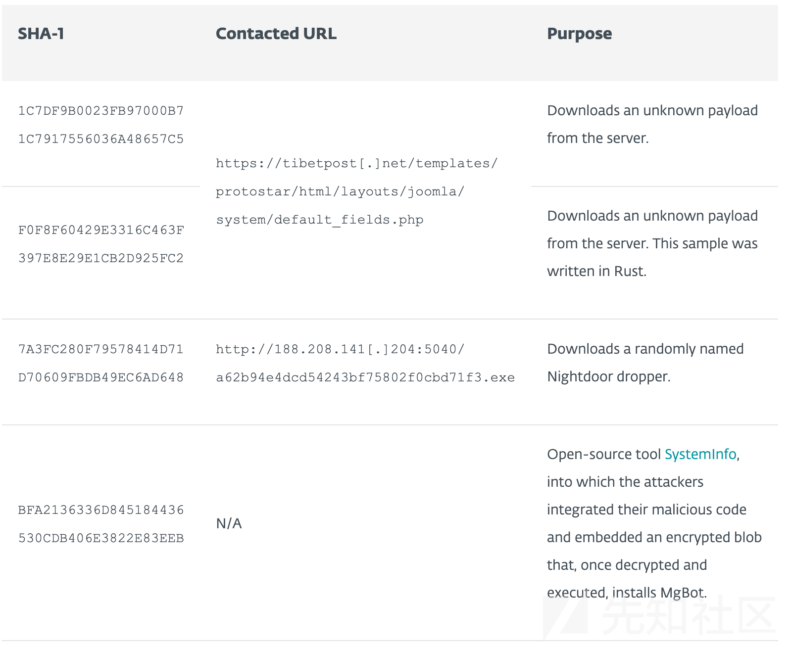](https://xzfile.aliyuncs.com/media/upload/picture/20240311234941-f92d7cf0-dfbe-1.png)  
=======
[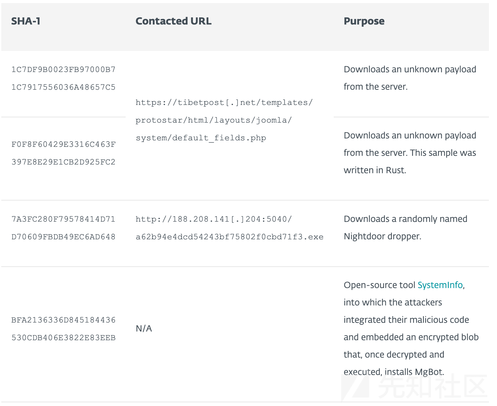](https://xzfile.aliyuncs.com/media/upload/picture/20240311234941-f92d7cf0-dfbe-1.png)  
>>>>>>> 4992f5f682bf7aa8873ceb2495ac1d2a8296850f
最后，default\_ico.exe 下载器或植入程序将从服务器获取有效负载或删除它，然后在受害计算机上执行它，安装 Nightdoor（请参阅 Nightdoor 部分）或 MgBot（请参阅我们之前的分析）。  
剩下的两个木马程序包非常相似，都部署由合法可执行文件旁加载的相同恶意下载程序 DLL。

# macOS packages

从官方应用商店下载的 ZIP 存档包含修改后的安装程序包（.pkg 文件），其中添加了 Mach-O 可执行文件和安装后脚本。安装后脚本将 Mach-O 文件复制到 $HOME/Library/Containers/CalendarFocusEXT/ 并继续在 $HOME/Library/LaunchAgents/com.Terminal.us.plist 中安装启动代理以实现持久性。图 14 显示了负责安装和启动恶意启动代理的脚本。  
<<<<<<< HEAD
[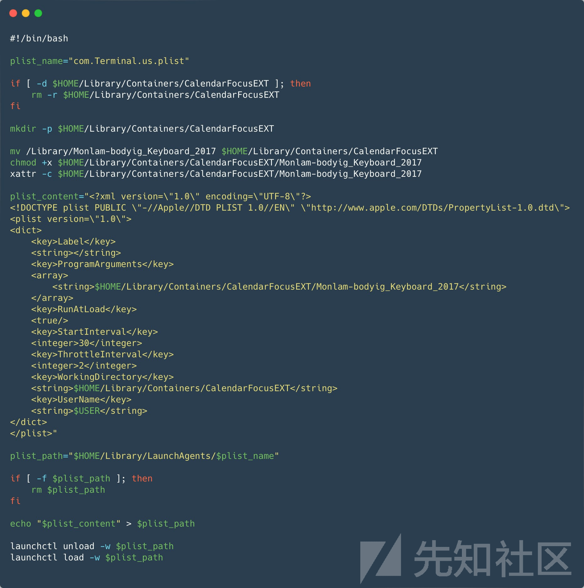](https://xzfile.aliyuncs.com/media/upload/picture/20240311235105-2b5b2f92-dfbf-1.png)  
图 13 中的恶意 Mach-O Monlam-bodyig\_Keyboard\_2017 使用名称和团队标识符为 ya ni yang (2289F6V4BN) 的开发者证书（不是通常用于分发的证书类型）进行签名，但未经公证。签名中的时间戳显示其签署日期为 2024 年 1 月 7 日 th。该日期也用于 ZIP 存档元数据中恶意文件的修改时间戳。该证书是在三天前才颁发的。完整的证书可在 IoC 部分找到。我们的团队于 1 月 25 日联系了 Apple th，证书于同一天被撤销。  
=======
  
图 13 中的恶意 Mach-O Monlam-bodyig\_Keyboard\_2017 使用名称和团队标识符为 ya ni yang (2289F6V4BN) 的开发者证书（不是通常用于分发的证书类型）进行签名，但未经公证。签名中的时间戳显示其签署日期为 2024 年 1 月 7 日 th。该日期也用于 ZIP 存档元数据中恶意文件的修改时间戳。该证书是在三天前才颁发的。完整的证书可在 IoC 部分找到。我们的团队于 1 月 25 日联系了 Apple th，证书于同一天被撤销。  
>>>>>>> 4992f5f682bf7aa8873ceb2495ac1d2a8296850f
第一阶段的恶意软件会下载一个 JSON 文件，其中包含下一阶段的 URL。用户代理 HTTP 请求标头中报告了架构（ARM 或 Intel）、macOS 版本和硬件 UUID（每台 Mac 唯一的标识符）。使用与 Windows 版本相同的 URL 来检索该配置：[https://www.monlamit \[.\] com/sites/default/files/softwares/updateFiles/Monlam\_Grand\_Tibetan\_Dictionary\_2018/UpdateInfo.dat。但是，macOS](https://www.monlamit[.]com/sites/default/files/softwares/updateFiles/Monlam_Grand_Tibetan_Dictionary_2018/UpdateInfo.dat。但是，macOS) 版本将查看 JSON 对象的 mac 键而不是 win 键下的数据。  
mac 键下的对象应包含以下内容：

-   url：下一阶段的 URL。
-   md5：有效载荷的 MD5 和。
-   vernow：硬件 UUID 列表。如果存在，则有效负载将仅安装在具有列出的硬件 UUID 之一的 Mac 上。如果列表为空或缺失，则跳过此检查。
<<<<<<< HEAD
-   version：一个数值，必须高于之前下载的第二阶段“版本”。否则不会下载有效负载。当前运行版本的值保留在应用程序用户默认值中。
=======
-   version：一个数值，必须高于之前下载的第二阶段“版本”。否则不会下载有效负载。当前运行版本的值保留在应用程序用户默认值中。
>>>>>>> 4992f5f682bf7aa8873ceb2495ac1d2a8296850f

恶意软件使用 curl 从指定 URL 下载文件后，使用 MD5 对文件进行哈希处理，并与 md5 密钥下的十六进制摘要进行比较。如果匹配，则删除其扩展属性（以清除 com.apple.quarantine 属性），将文件移动到 $HOME/Library/SafariBrowser/Safari.app/Contents/MacOS/SafariBrower，并使用 execvp 启动论证运行。  
与 Windows 版本不同，我们找不到 macOS 版本的任何后期版本。一项 JSON 配置包含 MD5 哈希 (3C5739C25A9B85E82E0969EE94062F40)，但 URL 字段为空。

# Nightdoor

我们命名为 Nightdoor 的后门（恶意软件作者根据 PDB 路径将其命名为 NetMM）是 Evasive Panda 工具集中的最新添加内容。我们对 Nightdoor 的最早了解可以追溯到 2020 年，当时 Evasive Panda 将其部署到了越南一个备受瞩目的目标的机器上。后门通过 UDP 或 Google Drive API 与其 C&C 服务器通信。这次活动中的 Nightdoor 植入程序使用了后者。它对数据部分中的 Google API OAuth 2.0 令牌进行加密，并使用该令牌访问攻击者的 Google Drive。我们已要求删除与此令牌关联的 Google 帐户。  
<<<<<<< HEAD
首先，Nightdoor 在 Google Drive 中创建一个文件夹，其中包含受害者的 MAC 地址，该地址也充当受害者 ID。该文件夹将包含植入程序和 C&C 服务器之间的所有消息。Nightdoor 和 C&C 服务器之间的每条消息都被构造为一个文件，并分为文件名和文件数据，如图 15 所示。  
[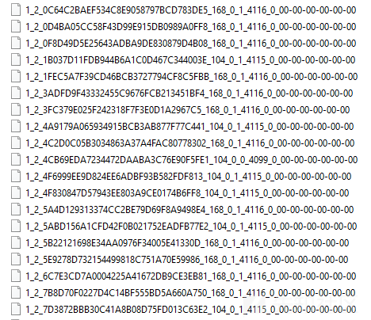](https://xzfile.aliyuncs.com/media/upload/picture/20240311235422-a0b27516-dfbf-1.png)  
=======
首先，Nightdoor 在 Google Drive 中创建一个文件夹，其中包含受害者的 MAC 地址，该地址也充当受害者 ID。该文件夹将包含植入程序和 C&C 服务器之间的所有消息。Nightdoor 和 C&C 服务器之间的每条消息都被构造为一个文件，并分为文件名和文件数据，如图 15 所示。  
[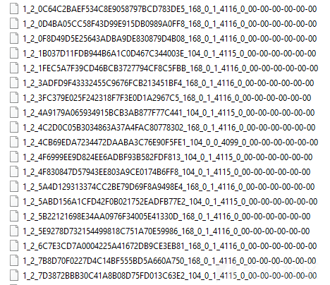](https://xzfile.aliyuncs.com/media/upload/picture/20240311235422-a0b27516-dfbf-1.png)  
>>>>>>> 4992f5f682bf7aa8873ceb2495ac1d2a8296850f
每个文件名包含八个主要属性，如下面的示例所示。  
Example: 例子：

-   1\_2\_0C64C2BAEF534C8E9058797BCD783DE5\_168\_0\_1\_4116\_0\_00-00-00-00-00-00
-   1\_2：魔法值。
-   0C64C2BAEF534C8E9058797BCD783DE5：pbuf 数据结构头。
-   168：消息对象的大小或文件大小（以字节为单位）。
-   0：文件名，始终默认为 0（空）。
-   1：命令类型，根据样本硬编码为 1 或 0。
-   4116：命令 ID。
-   0：服务质量（QoS）。
-   00-00-00-00-00-00：意味着目标的 MAC 地址，但始终默认为 00-00-00-00-00-00。

每个文件内的数据代表控制器对后门的命令以及执行它所需的参数。图 16 显示了存储为文件数据的 C&C 服务器消息的示例。  
<<<<<<< HEAD
[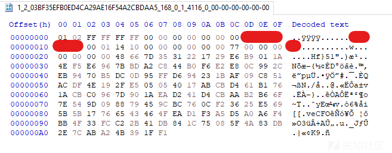](https://xzfile.aliyuncs.com/media/upload/picture/20240311235629-ec9c3e3a-dfbf-1.png)  
通过逆向工程 Nightdoor，我们能够理解文件中重要字段的含义，如图 17 所示。  
我们发现本次活动中使用的 Nightdoor 版本添加了许多有意义的更改，其中之一就是命令 ID 的组织。在以前的版本中，每个命令 ID 都被一一分配给一个处理函数，如图 18 所示。编号选择，例如从 0x2001 到 0x2006、从 0x2201 到 0x2203、从 0x4001 到 0x4003、从 0x7001 到 0x7005，建议将命令分为具有相似功能的组。  
[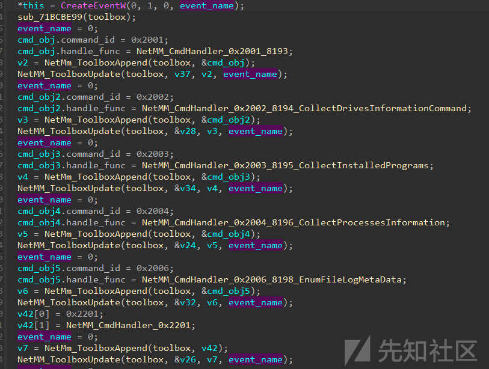](https://xzfile.aliyuncs.com/media/upload/picture/20240311235709-04a70d8e-dfc0-1.png)  
然而，在此版本中，Nightdoor 使用分支表来组织所有命令 ID 及其相应的处理程序。命令 ID 始终是连续的，并充当分支表中相应处理程序的索引，如图 19 所示。  
[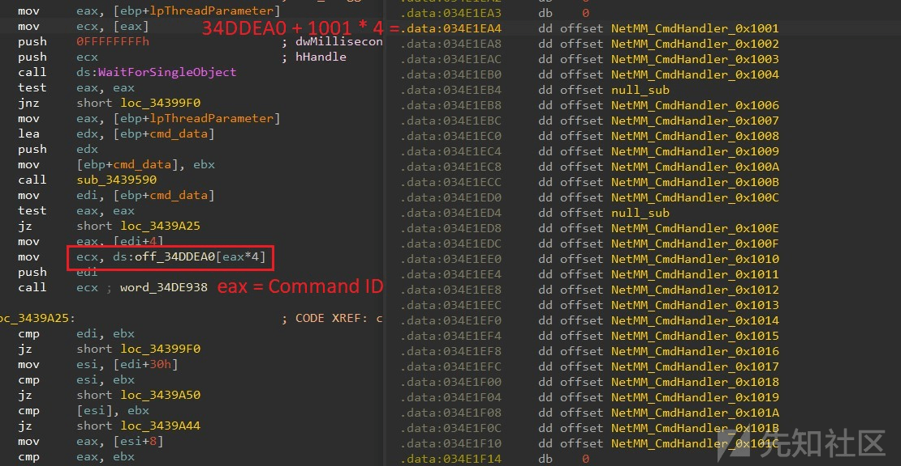](https://xzfile.aliyuncs.com/media/upload/picture/20240311235734-132f4de4-dfc0-1.png)
=======
[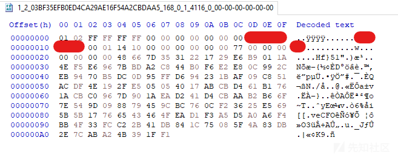](https://xzfile.aliyuncs.com/media/upload/picture/20240311235629-ec9c3e3a-dfbf-1.png)  
通过逆向工程 Nightdoor，我们能够理解文件中重要字段的含义，如图 17 所示。  
我们发现本次活动中使用的 Nightdoor 版本添加了许多有意义的更改，其中之一就是命令 ID 的组织。在以前的版本中，每个命令 ID 都被一一分配给一个处理函数，如图 18 所示。编号选择，例如从 0x2001 到 0x2006、从 0x2201 到 0x2203、从 0x4001 到 0x4003、从 0x7001 到 0x7005，建议将命令分为具有相似功能的组。  
[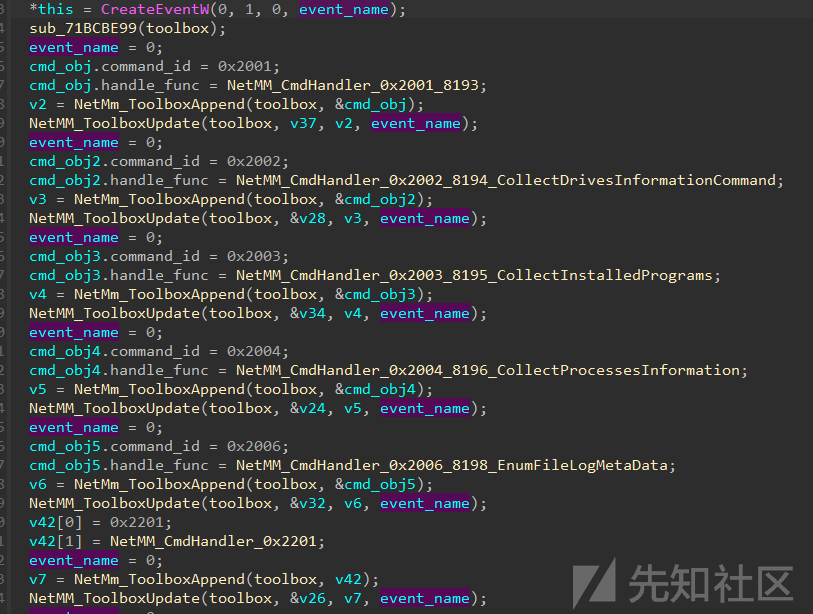](https://xzfile.aliyuncs.com/media/upload/picture/20240311235709-04a70d8e-dfc0-1.png)  
然而，在此版本中，Nightdoor 使用分支表来组织所有命令 ID 及其相应的处理程序。命令 ID 始终是连续的，并充当分支表中相应处理程序的索引，如图 19 所示。  
[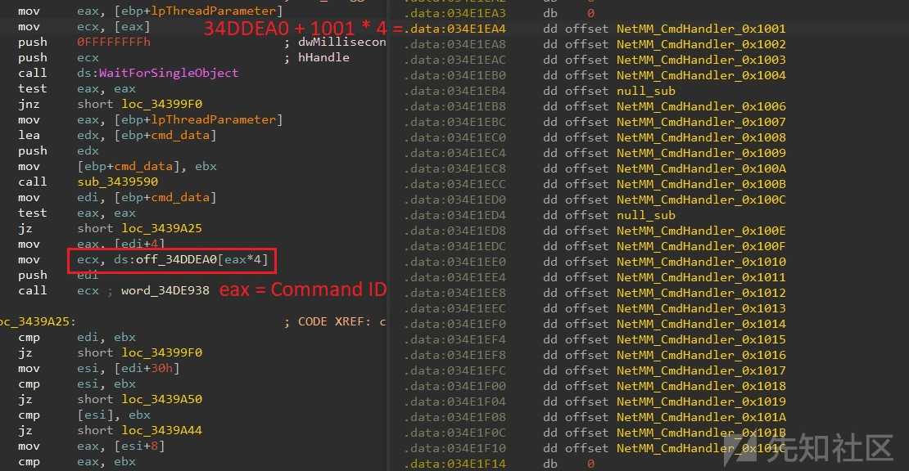](https://xzfile.aliyuncs.com/media/upload/picture/20240311235734-132f4de4-dfc0-1.png)
>>>>>>> 4992f5f682bf7aa8873ceb2495ac1d2a8296850f

# 结论

我们分析了与中国地区的 APT Evasive Panda 针对多个国家和地区的藏人发起的活动。我们认为，攻击者当时利用即将于 2024 年 1 月和 2 月举行的 Monlam 节日，在用户访问该节日网站时对用户进行了水坑攻击。此外，攻击者还破坏了藏语翻译应用软件开发商的供应链。  
攻击者部署了多个下载器、植入程序和后门，包括 MgBot（Evasive Panda 专用）和 Nightdoor：该组织工具包的最新主要新增内容，已用于针对东亚的多个网络。

IOCs:  
[https://github.com/eset/malware-ioc/tree/master/evasive\_panda](https://github.com/eset/malware-ioc/tree/master/evasive_panda)

翻译参考：  
[https://www.welivesecurity.com/2023/04/26/evasive-panda-apt-group-malware-updates-popular-chinese-software/](https://www.welivesecurity.com/2023/04/26/evasive-panda-apt-group-malware-updates-popular-chinese-software/)  
[https://www.openfind.com.tw/taiwan/markettrend\_detail.php?news\_id=7047](https://www.openfind.com.tw/taiwan/markettrend_detail.php?news_id=7047)  
[https://www.trendmicro.com/vinfo/us/threat-encyclopedia/web-attack/137/watering-hole-101](https://www.trendmicro.com/vinfo/us/threat-encyclopedia/web-attack/137/watering-hole-101)  
[https://malpedia.caad.fkie.fraunhofer.de/actor/evasive\_panda](https://malpedia.caad.fkie.fraunhofer.de/actor/evasive_panda)  
[https://blog.csdn.net/XavierDarkness/article/details/88417001](https://blog.csdn.net/XavierDarkness/article/details/88417001)  
[https://symantec-enterprise-blogs.security.com/blogs/threat-intelligence/apt-attacks-telecoms-africa-mgbot](https://symantec-enterprise-blogs.security.com/blogs/threat-intelligence/apt-attacks-telecoms-africa-mgbot)  
[https://kagyumonlam.org/zh/](https://kagyumonlam.org/zh/)
