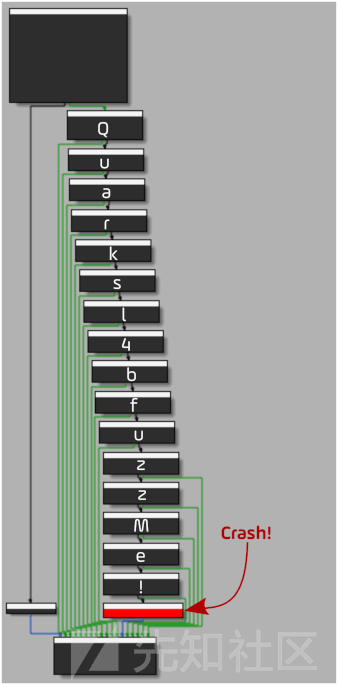
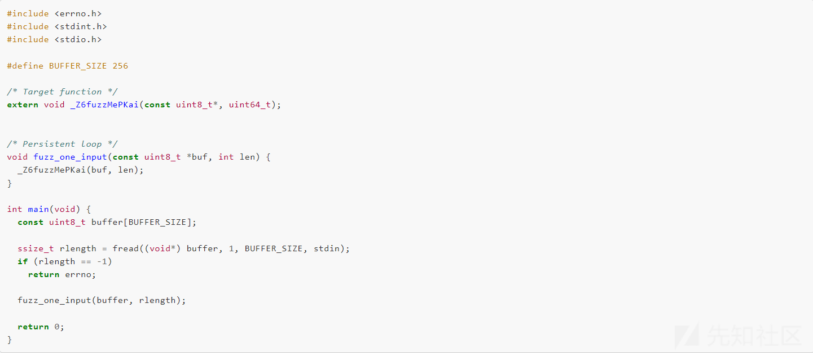
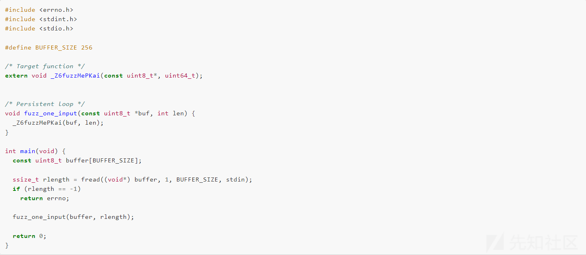
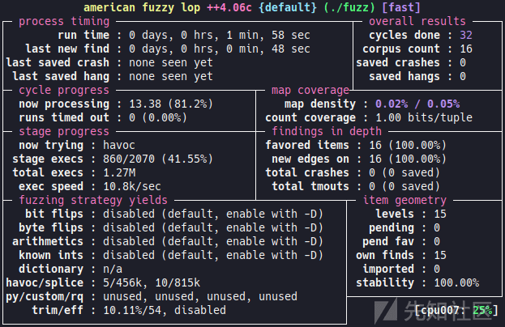
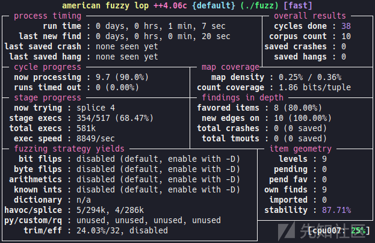
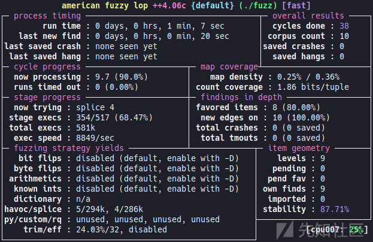

<<<<<<< HEAD
---
title: 【翻译】使用 AFL++ Frida 模式进行 Android 灰盒模糊测试 - 先知社区
url: https://xz.aliyun.com/t/14062
clipped_at: 2024-03-20 09:55:36
category: default
tags: 
 - xz.aliyun.com
---
=======
>>>>>>> 4992f5f682bf7aa8873ceb2495ac1d2a8296850f


# 【翻译】使用 AFL++ Frida 模式进行 Android 灰盒模糊测试 - 先知社区

<<<<<<< HEAD
=======
【翻译】使用 AFL++ Frida 模式进行 Android 灰盒模糊测试

- - -

>>>>>>> 4992f5f682bf7aa8873ceb2495ac1d2a8296850f
**原文地址：**[Android greybox fuzzing with AFL++ Frida mode](https://blog.quarkslab.com/android-greybox-fuzzing-with-afl-frida-mode.html "Android greybox fuzzing with AFL++ Frida mode")

-   之前接触过 Linux 可执行文件的模糊测试，当时只是用 AFL 跑。看到一篇关于 AFL++ 针对 Android 的模糊测试，感觉还不错，翻译一下给大家推荐一下。

## 介绍

-   本文介绍的是 Android 中使用 AFL++ 及其 Frida 模式时可能遇到的用户态目标的灰盒模糊测试。作者还讨论了如何针对 JNI 函数来测试 Java 代码调用的本机功能。
-   在原生 Android 二进制文件上进行灰盒模糊测试的便捷方法，主要是下面两种方法：
    -   直接在 Android 系统上进行 fuzz。
    -   通过模拟全部或部分 Android 系统进行模糊测试。
-   作者在文章中讨论的方法主要是第一种：直接在 Android 设备上进行模糊测试。为此，选择了 AFL++ 模糊器。灰盒模糊测试需要二进制仪器来使用覆盖范围并提高模糊器的有效性。AFL++ 提供了 Frida 模式，使之成为可能。

## Android 和 native libraries

-   在 Android 系统中，有许多本机二进制文件，尤其是许多共享库。这些库可以嵌入到应用程序、框架或系统的其他低级部分中。选择的目标是专为本文目的而设计的 Android 应用程序，以便以基本方式评估模糊测试解决方案的功能、覆盖范围以及针对 Android 上常见的几种情况的不同利用策略。
-   目标应用程序评估三种情况：
    -   目标函数是标准本机函数，与 Android 特定元素没有特定链接；
    -   目标函数是一个 JNI 函数，它对应用程序的字节码没有特定的依赖性。下面将此类函数称为弱链接 JNI 函数；
    -   目标函数是与应用程序字节码交互的 JNI 函数。下面将这种函数称为强链接 JNI 函数。
-   本文相关的代码下载：`shell git clone git@github.com:quarkslab/android-fuzzing.git`

## FuzzMe 应用程序

-   用于评估模糊解决方案的 qb.blogfuzz 应用程序有一个本机库，其主要功能是 fuzzMe。该函数只是使用嵌套条件结构来评估作为参数传递的缓冲区的前 16 个字节，这允许评估模糊器是否受益于覆盖率反馈：
    
<<<<<<< HEAD
    ```plain
=======
    ```bash
>>>>>>> 4992f5f682bf7aa8873ceb2495ac1d2a8296850f
    void fuzzMe(const jbyte *buffer, jsize length) {
    void (*crashMe)() = nullptr;
    
    if (length < 16)
      return;
    
      /* Quarksl4bfuzzMe! */
    if (buffer[0] == 'Q')
      if (buffer[1] == 'u')
        if (buffer[2] == 'a')
          if (buffer[3] == 'r')
            if (buffer[4] == 'k')
              if (buffer[5] == 's')
                if (buffer[6] == 'l')
                  if (buffer[7] == '4')
                    if (buffer[8] == 'b')
                      if (buffer[9] == 'f')
                        if (buffer[10] == 'u')
                          if (buffer[11] == 'z')
                            if (buffer[12] == 'z')
                              if (buffer[13] == 'M')
                                if (buffer[14] == 'e')
                                  if (buffer[15] == '!')
                                    crashMe();
    }
    ```
    
<<<<<<< HEAD
-   如果缓冲区的前 16 个字节与 Quarksl4bfuzzMe! 匹配，那么崩溃是由对该 crashMe 函数的调用故意引起的。函数 crashMe 指针初始化为 0，在取消引用时引发 SIGSEGV。  
    [](https://xzfile.aliyuncs.com/media/upload/picture/20240308151756-fc9f69ac-dd1b-1.png)
=======
-   如果缓冲区的前 16 个字节与 Quarksl4bfuzzMe! 匹配，那么崩溃是由对该 crashMe 函数的调用故意引起的。函数 crashMe 指针初始化为 0，在取消引用时引发 SIGSEGV。  
    [](https://xzfile.aliyuncs.com/media/upload/picture/20240308151756-fc9f69ac-dd1b-1.png)
>>>>>>> 4992f5f682bf7aa8873ceb2495ac1d2a8296850f
-   该 fuzzMe 函数是标准的本机函数案例。有了它，就有两个 JNI 调用函数：
    
    -   Java\_qb\_blogfuzz\_NativeHelper\_fuzzMeArray 链接到 qb.blogfuzz.NativeHelper.fuzzMeArray (byte \[\] bArr) Java 方法；
    -   Java\_qb\_blogfuzz\_NativeHelper\_fuzzMeWrapper 链接到 qb.blogfuzz.NativeHelper.fuzzMeWrapper (Wrapper wrapper) Java 方法。
-   Java\_qb\_blogfuzz\_NativeHelper\_fuzzMeArray 是一个弱链接 JNI 函数的函数，因为它不操作特定于 qb.blogfuzz 应用程序的 Java 对象。Java\_qb\_blogfuzz\_NativeHelper\_fuzzMeWrapper 是一个强链接 JNI 函数的 Wrapper 函数，因为它操作特定于应用程序 qb.blogfuzz 的类型的 Java 对象。
    

## 在 Android 系统上构建 AFL++ 和 Frida 模式

### 编译 / 执行上下文

-   环境：Ubuntu:22.04 x86\_64；AFL++ 4.06c；Frida GumJs devkit 16.0.13; Android standalone NDK r25c；Android 12 (API 31) - aarch64 on a Samsung Galaxy A32 (SM-A325F) device。

### 编译过程

<<<<<<< HEAD
-   在本节中，我们将了解如何编译在具有 Android 12 stock ROM 的 aarch64 设备上使用模糊测试解决方案所需的最低限度。设备已 root，以便在运行模糊器时拥有必要的权限，尤其是共享内存管理。为 Android 构建 AFL++ 并非易事。如果您想使用 AOSP 编译 AFL++，请参考 fpicker-aflpp-android 项目。出于研究目的，作者使用 CMakeLists.txt，它允许以最低要求为所使用的平台构建基本的二进制文件。

#### 要求

```plain
=======
-   在本节中，我们将了解如何编译在具有 Android 12 stock ROM 的 aarch64 设备上使用模糊测试解决方案所需的最低限度。设备已 root，以便在运行模糊器时拥有必要的权限，尤其是共享内存管理。为 Android 构建 AFL++ 并非易事。如果您想使用 AOSP 编译 AFL++，请参考 fpicker-aflpp-android 项目。出于研究目的，作者使用 CMakeLists.txt，它允许以最低要求为所使用的平台构建基本的二进制文件。

#### 要求

```bash
>>>>>>> 4992f5f682bf7aa8873ceb2495ac1d2a8296850f
# 系统要求
$ apt update
$ apt install cmake curl unzip xxd

# 工作目录
$ cd /opt

# 下载 AFL++ 
$ curl https://codeload.github.com/AFLplusplus/AFLplusplus/zip/refs/tags/4.06c --output 4.06c.zip
$ unzip 4.06c.zip

<<<<<<< HEAD
# 下载 Android NDK
$ curl https://dl.google.com/android/repository/android-ndk-r25c-linux.zip --output ndk.zip
$ unzip ndk.zip

# 获取 AFL++ Android CMakeLists.txt
=======
# 下载 Android NDK
$ curl https://dl.google.com/android/repository/android-ndk-r25c-linux.zip --output ndk.zip
$ unzip ndk.zip

# 获取 AFL++ Android CMakeLists.txt
>>>>>>> 4992f5f682bf7aa8873ceb2495ac1d2a8296850f
$ cd AFLplusplus-4.06c
$ curl https://raw.githubusercontent.com/quarkslab/android-fuzzing/main/AFLplusplus/CMakeLists.txt --output CMakeLists.txt
```

### 编译

<<<<<<< HEAD
```plain
=======
```bash
>>>>>>> 4992f5f682bf7aa8873ceb2495ac1d2a8296850f
$ mkdir build && cd build
$ cmake -DANDROID_PLATFORM=31 \
        -DCMAKE_TOOLCHAIN_FILE=/opt/android-ndk-r25c/build/cmake/android.toolchain.cmake \
        -DANDROID_ABI=arm64-v8a ..
$ make
```

-   编译后，afl-fuzz（fuzzer）和 afl-frida-trace.so（Frida 模式）二进制文件在当前目录中可用，并且可以上传到设备（这里要配置好 adb，作者在这篇文章中没有提到，但是这是基础）：`shell $ adb push afl-fuzz afl-frida-trace.so /data/local/tmp`

## 标准线束

-   在标准本机函数上开发工具并不罕见，但 Frida 模式带来了一些特殊性。该工具的代码可在 [GitHub 存储库](https://github.com/quarkslab/android-fuzzing/tree/main/native "GitHub存储库")中找到。
-   然后从 [qb.blogfuzz](https://github.com/quarkslab/android-fuzzing/blob/main/apk/qb.blogfuzz.apk "qb.blogfuzz") APK 获取目标本机库。
    -   （注释：apk 可以看做 zip 压缩包）
        
<<<<<<< HEAD
        ```plain
=======
        ```bash
>>>>>>> 4992f5f682bf7aa8873ceb2495ac1d2a8296850f
        unzip -j qb.blogfuzz.apk lib/arm64-v8a/libblogfuzz.so
        ```
        
-   目标函数符号 fuzzMe：`shell objdump -T libblogfuzz.so`
-   使用这个[损坏的符号](https://github.com/quarkslab/android-fuzzing/blob/main/native/fuzz.c#L6 "损坏的符号")作为工具中的外部函数：  
<<<<<<< HEAD
    [](https://xzfile.aliyuncs.com/media/upload/picture/20240308153114-d7eb5b1e-dd1d-1.png)
=======
    [](https://xzfile.aliyuncs.com/media/upload/picture/20240308153114-d7eb5b1e-dd1d-1.png)
>>>>>>> 4992f5f682bf7aa8873ceb2495ac1d2a8296850f
    -   线束代码比较简洁。这里重要的函数是 fuzz\_one\_input，它以一个缓冲区和一个大小作为参数，并调用 fuzzMelibblogfuzz.so 的函数。
-   AFL++ 的 Frida 模式对于 fuzzer 的配置与 QEMU 模式比较相似，因为环境变量有一定的对称性。不过，Frida 模式带来了在 JavaScript 3 中完成大部分配置的可能性，同时受益于部分 GumJS API，与通过环境变量进行配置相比，它提供了一定的灵活性。通常，对某些参数使用环境变量并使用 JavaScript API 来动态配置更方便，这通常非常方便。
-   在这里，模糊器的配置基本上是在 [afl.js](https://github.com/quarkslab/android-fuzzing/blob/main/native/afl.js "afl.js") 脚本中完成的，它允许动态配置模糊器的入口点和持久性循环所需的元素：
    
<<<<<<< HEAD
    ```plain
=======
    ```bash
>>>>>>> 4992f5f682bf7aa8873ceb2495ac1d2a8296850f
    const pStartAddr = DebugSymbol.fromName("fuzz_one_input").address;
    Afl.setPersistentAddress(pStartAddr);
    Afl.setEntryPoint(pStartAddr);
    ```
    
-   配置脚本的另一个有趣的功能是持久性 hook 的实现，它允许在每次迭代时正确初始化执行上下文：
    
<<<<<<< HEAD
    ```plain
=======
    ```bash
>>>>>>> 4992f5f682bf7aa8873ceb2495ac1d2a8296850f
    const cm = new CModule(`
    #include <string.h>
    #include <gum/gumdefs.h>
    
    #define BUF_LEN 256
    
    void afl_persistent_hook(GumCpuContext *regs, uint8_t *input_buf,
      uint32_t input_buf_len) {
    
      uint32_t length = (input_buf_len > BUF_LEN) ? BUF_LEN : input_buf_len;
      memcpy((void *)regs->x[0], input_buf, length);
      regs->x[1] = length;
    }
    `,
    {
      memcpy: Module.getExportByName(null, "memcpy")
    }
    );
    Afl.setPersistentHook(cm.afl_persistent_hook);
    ```
    
-   在这里，利用 Frida 的能力来利用 CModule 4 编译 C 代码。afl\_persistent\_hook 在持久性循环的每次迭代之前执行。它需要三个参数。第一个 ( ) 是指向 GumCpuContext 结构 GumCpuContext *regs 的 aarch64 版本的指针。这个结构允许访问 CPU 寄存器。第二个 ( uint8\_t* input\_buf) 和第三个 (uint32\_t input\_buf\_len) 分别是模糊器的输入及其大小。上下文在持久性循环的每次迭代开始时都会恢复，但是，需要更新输入参数，就像以 fuzz\_one\_input 标准方式调用函数一样，以便持久性循环的下一次迭代能够正确执行。模糊器生成的输入缓冲区 input\_buf 必须设置为将其作为第一个参数传递给函数，并将大小 input\_buf\_len 作为第二个参数。根据 aarch64 调用约定 5，缓冲区地址必须为 in x0，大小必须为 in x1。
    
-   编译过程与编译 AFL++ 的过程类似：
    
<<<<<<< HEAD
    ```plain
=======
    ```bash
>>>>>>> 4992f5f682bf7aa8873ceb2495ac1d2a8296850f
    $ mkdir build && cd build
    $ cmake -DANDROID_PLATFORM=31
          -DCMAKE_TOOLCHAIN_FILE=${ANDROID_NDK}/build/cmake/$ android.toolchain.cmake
          -DANDROID_ABI=arm64-v8a ..
    $ make
    ```
    
-   然后在设备上上传相关的文件：
    
<<<<<<< HEAD
    ```plain
=======
    ```bash
>>>>>>> 4992f5f682bf7aa8873ceb2495ac1d2a8296850f
    adb push fuzz ../afl.js ../lib/libblogfuzz.so /data/local/tmp
    ```
    
-   然后在设备上为第一次模糊测试活动准备环境（在根目录中）：
    
<<<<<<< HEAD
    ```plain
=======
    ```bash
>>>>>>> 4992f5f682bf7aa8873ceb2495ac1d2a8296850f
    # cd /sys/devices/system/cpu
    # echo performance | tee cpu*/cpufreq/scaling_governor
    #或者只使用 AFL++ 提供的 afl-system-config 脚本。
    $ cd /data/local/tmp
    $ mkdir in out
    $ dd if=/dev/urandom of=in/sample.bin bs=1 count=16 # our dummy corpus
    ```
    
-   进行模糊测试（和传统的 AFL Fuzz 命令都是一样的）。用最少的选项启动模糊器，目标不是调整模糊器活动，而只是通过 Frida 的覆盖范围检查模糊器的正常运行。由于在工具中定义了 256 字节的缓冲区大小，因此没有必要生成更大的条目，因此使用标志限制条目的最大大小 - G。这里该 - O 标志用于指定要使用 Frida 模式。
    
<<<<<<< HEAD
    ```plain
=======
    ```bash
>>>>>>> 4992f5f682bf7aa8873ceb2495ac1d2a8296850f
    ./afl-fuzz -O -G 256 -i in -o out ./fuzz
    ```
    
-   默认情况下，模糊器使用当前目录中的 afl.js 文件作为配置文件。可以使用环境变量指定另一个 JS 文件 AFL\_FRIDA\_JS\_SCRIPT。
-   fuzz 启动界面  
<<<<<<< HEAD
    [](https://xzfile.aliyuncs.com/media/upload/picture/20240308153938-0461f88c-dd1f-1.png)
    
-   产生 crash
    
    ```plain
=======
    [](https://xzfile.aliyuncs.com/media/upload/picture/20240308153938-0461f88c-dd1f-1.png)
    
-   产生 crash
    
    ```bash
>>>>>>> 4992f5f682bf7aa8873ceb2495ac1d2a8296850f
    # xxd out/default/crashes/id*
    00000000: 5175 6172 6b73 6c34 6266 757a 7a4d 6521  Quarksl4bfuzzMe!
    ```
    

## JNI

### 介绍

-   在 Java 历史的早期，就提出了一种弥合 Java 世界和本机世界之间差距的机制：Java 本机接口 (JNI)。如今，这种机制在 Android 中被大量使用，特别是应用程序和 Android 框架。该接口以双向方式工作，也就是说，它允许从 Java 调用本机代码，但也允许从本机部分与 Java 世界进行交互。JNI 函数的第一个参数是 类型，是指向 jni.hJNIEnv \* 中定义的结构的指针。JNIEnv 提供允许操作 Java 对象的完整 API，允许从本机函数与 Java 世界进行交互。因此，为了实现此类功能，需要提供 JNI 环境。使之可以使用调用 API。

### JNI 调用 API

-   借助特定函数，调用 API 允许创建 JVM JNI\_CreateJavaVM：. 正是这个函数允许正确初始化 JNIEnv，以便随后在调用 JNI 函数时使用它。在 Android 上，此 API 由运行时提供。
-   为了分解这部分代码以便在不同的工具中使用，将其实现为一个库：
    
<<<<<<< HEAD
    ```plain
=======
    ```bash
>>>>>>> 4992f5f682bf7aa8873ceb2495ac1d2a8296850f
    #include <dlfcn.h>
    #include <stdbool.h>
    #include "jenv.h"
    #define LOG_TAG "jenv"
    #define ANDROID_RUNTIME_DSO "libandroid_runtime.so"
    typedef jint(*JNI_CreateJavaVM_t)(JavaVM **p_vm, JNIEnv **p_env, void *vm_args);
    int init_java_env(JavaCTX *ctx, char **jvm_options, uint8_t jvm_nb_options) {
    JNI_CreateJavaVM_t JNI_CreateJVM;
    JniInvocationImpl* (*JniInvocationCreate)();
    bool (*JniInvocationInit)(JniInvocationImpl*, const char*);
    jint (*registerFrameworkNatives)(JNIEnv*);
    void* runtime_dso;
    ALOGV("[+] Initialize Java environment");
    if ((runtime_dso = dlopen(ANDROID_RUNTIME_DSO, RTLD_NOW)) == NULL) {
      ALOGE("[!] %s\n", dlerror());
      return JNI_ERR;
    }
    if ((JniInvocationCreate = dlsym(runtime_dso, "JniInvocationCreate")) == NULL) {
      ALOGE("[!] %s\n", dlerror());
      return JNI_ERR;
    }
    if ((JniInvocationInit = dlsym(runtime_dso, "JniInvocationInit")) == NULL) {
      ALOGE("[!] %s\n", dlerror());
      return JNI_ERR;
    }
    if ((JNI_CreateJVM = (JNI_CreateJavaVM_t) dlsym(runtime_dso, "JNI_CreateJavaVM")) == NULL) {
      ALOGE("[!] %s\n", dlerror());
      return JNI_ERR;
    }
    if ((registerFrameworkNatives = dlsym(runtime_dso, "registerFrameworkNatives")) == NULL) {
      ALOGE("[!] %s\n", dlerror());
      return JNI_ERR;
    }
    ctx->invoc = JniInvocationCreate();
    JniInvocationInit(ctx->invoc, ANDROID_RUNTIME_DSO);
    JavaVMOption options[jvm_nb_options];
    for (int i = 0; i < jvm_nb_options; ++i)
      options[i].optionString = jvm_options[i];
    
    JavaVMInitArgs args;
    args.version = JNI_VERSION_1_6;
    args.nOptions = jvm_nb_options;
    args.options = options;
    args.ignoreUnrecognized = JNI_TRUE;
    
    jint status = JNI_CreateJVM(&ctx->vm, &ctx->env, &args);
    if (status == JNI_ERR) return JNI_ERR;
    
    ALOGD("[d] vm: %p, env: %p\n", ctx->vm, ctx->env);
    
    status = registerFrameworkNatives(ctx->env);
    if (status == JNI_ERR) return JNI_ERR;
    
    return JNI_OK;}
    ```
    
    -   该 init\_java\_env 函数允许初始化一个 JavaCTX 结构，该结构包含一个指向 Java VM 的指针和另一个指向 JNIEnv 的指针：
        
<<<<<<< HEAD
        ```plain
=======
        ```bash
>>>>>>> 4992f5f682bf7aa8873ceb2495ac1d2a8296850f
        /* CTX */
        typedef struct JavaContext {
        JavaVM *vm;
        JNIEnv *env;
        struct JniInvocationImpl *invoc;
        } JavaCTX;
        ```
        
    -   还存储了指向定义 API 调用实现的结构的指针 JniInvocationImpl，以便稍后能够访问清理环境。该部件不用于线束中。要使用该 JNI\_CreateJavaVM 函数，必须首先初始化运行时，告诉它在哪里可以找到调用 API 的实现。这一步的完成要归功于函数 JniInvocationCreate 和 JniInvocationInit。该 JniInvocationInit 函数将一个字符串作为第二个参数，该字符串定义包含 API 实现的库的名称。这里为它提供 Android 运行时库的名称，以便可以使用它自己的实现：`cpp JniInvocationInit(ctx->invoc, ANDROID_RUNTIME_DSO);`
    -   该函数 JNI\_CreateJavaVM 采用三个参数：指向将要创建的 Java VM 的指针（双重间接）；指向 的指针 JNIEnv，也会在调用期间创建；最后是一个指向该 JavaVMInitArgs 结构的指针，它允许传递许多参数以初始化 Java 环境。
    -   该 JavaVMInitArgs 结构的 options 字段允许以类型结构数组的形式传递特别有用的参数 JavaVMOption：
        
<<<<<<< HEAD
        ```plain
=======
        ```bash
>>>>>>> 4992f5f682bf7aa8873ceb2495ac1d2a8296850f
        typedef struct JavaVMOption {
        char *optionString;
        void *extraInfo;
        } JavaVMOption;
        ```
        
    -   该 optionString 字段可用于（除其他外）指定本机库的类路径或加载路径。init\_java\_env 为了获得更大的灵活性，可以在通过 jvm\_options（C 字符串数组）和 jvm\_nb\_options（数组中的元素数量）参数调用时传递这些选项，以便可以从线束配置环境。
-   最后，调用该 registerFrameworkNatives 函数，该函数允许将框架的某些本机部分与 Java 部分链接起来。不一定是强制的，这取决于目标函数使用的功能。无论如何，最好还是这样做，以避免在 UnsatisfiedLinkError 使用框架的本机部分时引发异常。可以参考 AndroidRuntime.cpp 来查看具体注册的内容。

### JNI 利用

-   这是目标函数的源代码 Java\_qb\_blogfuzz\_NativeHelper\_fuzzMeArray：
    
<<<<<<< HEAD
    ```plain
=======
    ```bash
>>>>>>> 4992f5f682bf7aa8873ceb2495ac1d2a8296850f
    extern "C" JNIEXPORT void JNICALL
    Java_qb_blogfuzz_NativeHelper_fuzzMeArray(
          JNIEnv* env,
          jobject /* this */,
          jbyteArray array) {
      jboolean isCopy = false;
      jsize length = env->GetArrayLength(array);
      jbyte *buffer = env->GetByteArrayElements(array, &isCopy);
    
      fuzzMe(buffer, length);
    }
    ```
    
-   可以看到该函数实际上是一个简单的包装器，它调用前面的目标函数（fuzzMe）。缓冲区首先作为 Java 字节数组进行检索，此处由 JNI 类型表示 jbyteArray。数组的元素以 GetByteArrayElements 元素数组的形式提取 jbyte，然后可以将其传递给 fuzzMe 函数。显然，这里可以直接模糊 fuzzMe 函数，但这不是示例的目的。由于 JNI 函数是高级函数，因此模糊测试通常较慢。然而，模糊化 JNI 函数确实提供了一些优点：能够对相对简单的 Java 接口进行模糊测试，该接口与本机库有多个复杂的交互，因此不必反转二进制文件来了解如何在执行流程中进一步生成函数上的工具；模糊器发现的崩溃可以从 Java 部分重现。
-   为了使用线束插入此函数，需要生成一个类型的对象 jbyteArray：
    
<<<<<<< HEAD
    ```plain
=======
    ```bash
>>>>>>> 4992f5f682bf7aa8873ceb2495ac1d2a8296850f
    /* Persistent loop */
    void fuzz_one_input(const uint8_t *buffer, size_t length) {
    jbyteArray jBuffer = (*ctx.env)->NewByteArray(ctx.env, length);
    (*ctx.env)->SetByteArrayRegion(ctx.env, jBuffer, 0, length,
                                   (const jbyte *)buffer);
    
    Java_qb_blogfuzz_NativeHelper_fuzzMeArray(ctx.env, NULL, jBuffer);
    
    (*ctx.env)->DeleteLocalRef(ctx.env, jBuffer);
    }
    ```
    
    -   对象的创建是通过该 NewByteArray 函数完成的，然后 jbyteArray 通过该函数使用模糊器生成的缓冲区进行初始化 SetByteArrayRegion。然后可以调用目标 JNI 函数，最后使用 清理引用 DeleteLocalRef。在这种情况下，Java 环境不需要任何特定参数。所以这样初始化它：`cpp init_java_env(&ctx, NULL, 0)`
    -   模糊器的配置与第一个工具几乎相同，这里只是添加了一个排除机制，以避免检测像 Android 运行时这样的大型模块：
        
<<<<<<< HEAD
        ```plain
=======
        ```bash
>>>>>>> 4992f5f682bf7aa8873ceb2495ac1d2a8296850f
        /* Modules to be instrumented by Frida */
        const MODULE_WHITELIST = [
        "fuzz",
        "libblogfuzz.so",
        ];
        /* Exclude from instrumentation */
        Module.load("libandroid_runtime.so");
        new ModuleMap().values().forEach(m => {
        if (!MODULE_WHITELIST.includes(m.name)) {
        Afl.print(`Exclude: ${m.base}-${m.base.add(m.size)} ${m.name}`);
        Afl.addExcludedRange(m.base, m.size);
        }});
        ```
        
    -   该 libandroid\_runtime.so 模块已加载，Module.load 以便在迭代所有已加载模块的列表时可以将其排除。还指定持久性循环的迭代次数：`cpp Afl.setPersistentCount(10000);`
-   像第一个活动一样启动模糊器：`shell ./afl-fuzz -O -G 256 -i in -o out ./fuzz`
-   AFL++ 启动  
<<<<<<< HEAD
    [](https://xzfile.aliyuncs.com/media/upload/picture/20240308155341-fb380312-dd20-1.png)
-   一段时间后，出现 crash
    
    ```plain
=======
    [](https://xzfile.aliyuncs.com/media/upload/picture/20240308155341-fb380312-dd20-1.png)
-   一段时间后，出现 crash
    
    ```bash
>>>>>>> 4992f5f682bf7aa8873ceb2495ac1d2a8296850f
    # xxd out/default/crashes/id*
    00000000: 5175 6172 6b73 6c34 6266 757a 7a4d 6521  Quarksl4bfuzzMe!
    00000010: 9d21 2121 2121 2121 2121 2121 2121 2164  .!!!!!!!!!!!!!!d
    ```
    

## 结论

这项研究表明，AFL++ 非常适合 Android 中的灰盒模糊测试，并且 Frida 模式提供了宝贵的配置灵活性。该解决方案允许以相对较少的努力来模糊尤其是 JNI 函数。研究还发现，目标与 Java 元素的链接越多，性能就越差。  
也还存在其他使用 AFL++ 的 Android 灰盒模糊测试解决方案，例如 fpicker-aflpp-android 项目，它允许在应用程序的上下文中进行模糊测试，并为创建工具带来一些工具。AFL ++ on Android with QEMU support 文章提出了使用 QEMU 模式的替代解决方案。

## 参考

[AFL++](https://github.com/AFLplusplus/AFLplusplus "AFL++")  
[Frida CModule 关于 Frida 文档](https://frida.re/docs/javascript-api/#cmodule "Frida CModule关于 Frida 文档")  
[ARM 文档中的 aarch64 调用约定](https://developer.arm.com/documentation/102374/0101/Procedure-Call-Standard "ARM 文档中的 aarch64 调用约定")  
[Oracle 文档上的 JNI 调用 API](https://docs.oracle.com/javase/8/docs/technotes/guides/jni/spec/invocation.html "Oracle 文档上的 JNI 调用 API")  
[AOSP 源中 JNI 调用 API 的使用](https://android.googlesource.com/platform/art/+/07798c2e898a8c3344cac123f9873a50ad2e075d/dalvikvm/dalvikvm.cc#109 "AOSP 源中 JNI 调用 API 的使用")  
[从 Android 本机代码创建 Java VM](https://calebfenton.github.io/2017/04/05/creating_java_vm_from_android_native_code/ "从 Android 本机代码创建 Java VM")  
[fpicker-aflpp-android](https://github.com/marcinguy/fpicker-aflpp-android "fpicker-aflpp-android")  
[Android 上的 AFL ++ 与 QEMU 支持文章](https://alephsecurity.com/2021/11/16/fuzzing-qemu-android/ "Android 上的AFL ++ 与 QEMU 支持文章")
