# 【翻译】变脸 BianLian 用 PowerShell 重写了 BianLian GO 后门 - 先知社区

翻译：[https://www.guidepointsecurity.com/blog/bianlian-gos-for-powershell-after-teamcity-exploitation/](https://www.guidepointsecurity.com/blog/bianlian-gos-for-powershell-after-teamcity-exploitation/)

<<<<<<< HEAD
[](https://xzfile.aliyuncs.com/media/upload/picture/20240311204041-926720da-dfa4-1.png)
=======
[](https://xzfile.aliyuncs.com/media/upload/picture/20240311204041-926720da-dfa4-1.png)
>>>>>>> 4992f5f682bf7aa8873ceb2495ac1d2a8296850f

# 介绍

自从 Avast 在 2023 年 1 月发布了对 BianLian 的解密工具以来，该组织已转向仅勒索的运营模式。从那时起，GuidePoint 的研究与情报团队（GRIT）一直密切关注 BianLian 的操作。与 GuidePoint 的 DFIR 团队合作，我们对一起事件作出了应急响应，该事件通过对 TeamCity 服务器的利用，BianLian 用 PowerShell 重写了 BianLian GO 后门。

在本博客中，我们将深入探讨以下主题：

-   BianLian 对 TeamCity 漏洞的利用及利用后行为
-   BianLian GO 后门的 PowerShell 实现
-   重点关注 PowerShell 后门和 BianLian 关联的细节

# 首先利用 TeamCity

在最近的一次入侵中，GuidePoint 的 DFIR 团队观察到客户端网络中的恶意活动。威胁行为团体识别出易受攻击的 TeamCity 服务器，并利用 CVE-2024-27198 / CVE-2023-42793 作为初始访问环境，在 TeamCity 中创建用户并在 TeamCity 产品的服务帐户下调用恶意命令。在分析时，无法获取确定威胁行为团体所利用的两个 CVE 中的哪一个所需的日志。

<<<<<<< HEAD
初次访问环境后，威胁行为团体使用 Windows 本机命令发现了受害者网络中的其他基础设施，包括 net user、systeminfo、nltest，也许是所有 CLI 命令中最常见的 - whoami。随着威胁行为团体继续进行后渗透工作，他们在环境中发现了两个 build servers，可以从中进行进一步的利用。威胁行为团体利用了两个文件 winpty-agent.exe 和 winpty.dll 到 build servers，这些文件是 winpty 的合法文件，用于创建运行 Windows 命令的界面。威胁行为团体在 build servers 上使用 winpty-agent.exe 从被利用的 TeamCity 服务器远程运行命令，并利用 BITSAdmin 将其他工具部署到服务器，包括恶意 PowerShell 脚本 web.ps1。在下载和执行 web.ps1 之前的几个时间点，威胁行为团体尝试部署几个 DLL，这些 DLL 最终根据被 Windows 自带杀毒软件根据签名 Win64/BianDoor.D 进行了隔离，这提供了一些有关 web.ps1 其功能推断。其他部署的工具包括其他恶意二进制文件，它们与威胁行为团体的 C2 服务器进行通信。威胁行为团体还使用 FuzzySecurity 的 PowerShell Suite 中的工具尝试转储凭据。
=======
初次访问环境后，威胁行为团体使用 Windows 本机命令发现了受害者网络中的其他基础设施，包括 net user、systeminfo、nltest，也许是所有 CLI 命令中最常见的 - whoami。随着威胁行为团体继续进行后渗透工作，他们在环境中发现了两个 build servers，可以从中进行进一步的利用。威胁行为团体利用了两个文件 winpty-agent.exe 和 winpty.dll 到 build servers，这些文件是 winpty 的合法文件，用于创建运行 Windows 命令的界面。威胁行为团体在 build servers 上使用 winpty-agent.exe 从被利用的 TeamCity 服务器远程运行命令，并利用 BITSAdmin 将其他工具部署到服务器，包括恶意 PowerShell 脚本 web.ps1。在下载和执行 web.ps1 之前的几个时间点，威胁行为团体尝试部署几个 DLL，这些 DLL 最终根据被 Windows 自带杀毒软件根据签名 Win64/BianDoor.D 进行了隔离，这提供了一些有关 web.ps1 其功能推断。其他部署的工具包括其他恶意二进制文件，它们与威胁行为团体的 C2 服务器进行通信。威胁行为团体还使用 FuzzySecurity 的 PowerShell Suite 中的工具尝试转储凭据。
>>>>>>> 4992f5f682bf7aa8873ceb2495ac1d2a8296850f

该团体还能够在其中一台 build servers 上创建一个新帐户并将新帐户添加到用户组中。在尝试执行安全帐户管理器 (SAM) 凭证转储技术后，在环境中检测到威胁行为团体，该技术向受害者的 VSOC、GuidePoint 的 DFIR 团队和 GuidePoint 的威胁情报团队 (GRIT) 发出警报，并启动了对此的深入审查 PowerShell 后门。

# BianLian 转向 PowerShell

在多次尝试执行标准 GO 后门失败后，威胁行为团体转而利用 LOLBins 技术，并利用 PowerShell 实现了他们的后门，该后门几乎与他们原本 BianLian GO 后门具有相同的功能。

第一层分析  
PowerShell 后门被混淆了，但没有利用任何牛逼的新技术。第一层混淆涉及一个加密的字节数组，利用一个简单的解密程序来解密和执行下一层混淆的 PowerShell。这种混淆很容易被破解，只需对恶意脚本进行小小的操作，通过 iex 命令替换，得到输出文件 .\\LayerTwo.ps1，这样我们就得到了一个单独的第二层文件来处理。

<<<<<<< HEAD
```plain
=======
```bash
>>>>>>> 4992f5f682bf7aa8873ceb2495ac1d2a8296850f
[byte[]] $payload = 88,83,97,68,74,8,40,40,85,8,0,22,25,10,25,45,38,57,117,30,58,16,9,15,37,2,51,3,116,35,47,9,12,49,57,62,8,25,115,42,46,60,46,62,52,17,63,62,100,24,…redacted for brevity…85,24,14,29,59,41,78,65,85,42,103,86,60,68,120,32,95,39,32,93,30,43,77,70,2,86,88,34,81,40,30,86,77,64,116,86,88,32,93,45,100,43,61,74,4,34,86,81,66,97

function x($pt, $key)
{
  $ct = ""
  $kp = 0
  $ka = $key.ToCharArray()
  $pt.ToCharArray() | foreach-object -process {
       $ct += [char]([byte][char]$_ -bxor $ka[$kp])
       $kp += 1
       if ($kp -eq $key.Length) {$kp = 0}
  }
  return $ct
}

$key = <redacted>
$ps = [System.Text.Encoding]::UTF8.GetString($payload)
$cmd = x $ps $key
$cmd | iex
```

Figure 1: Initial PowerShell Script

第二层分析  
乍一看，PowerShell 脚本的第二层绝对是一团糟，所以我们不太愿意继续。  
<<<<<<< HEAD
[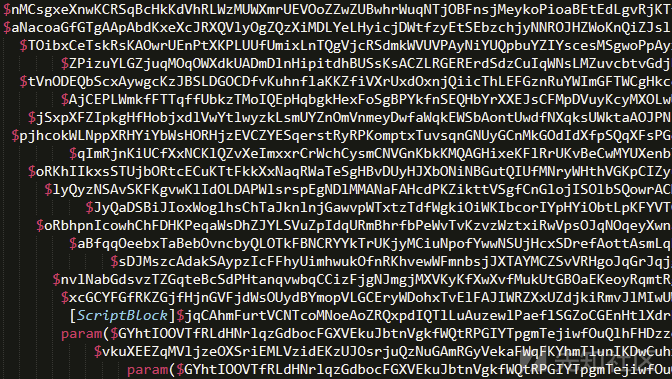](https://xzfile.aliyuncs.com/media/upload/picture/20240311205820-097fe240-dfa7-1.png)  
=======
[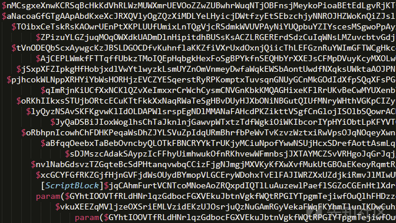](https://xzfile.aliyuncs.com/media/upload/picture/20240311205820-097fe240-dfa7-1.png)  
>>>>>>> 4992f5f682bf7aa8873ceb2495ac1d2a8296850f
我们在我的文本编辑器中快速扫描了脚本，意识到它并不像我们最初想象的那样糟糕，虽然仍然不够美观，处理起来可能有点烦人，但是它是可以管理的，并且很快就可以美化。具体来说，在初步审查中，以下特征突出显示：

-   有两个名为 cakes 和 cookies 的函数。  
    cookies 在脚本的最后一行被调用。
-   在 cookies 函数中，有两个 Write-Host 语句有助于提供我们可能分析的内容的一些上下文：  
    Write-Host “Connecting to Server. . .”  
    Write-Host “Connected”  
    这些陈述中的每一个都暗示了与特定命令和控制（C2）服务器的连接，尽管在审查的初始阶段，我们不确定这是否是为了持续操作（就像我们期望在后门中看到的那样）还是其他什么简单化，例如下载后续有效负载。
-   在审查的初期阶段，有一个明确定义的脚本块，但是不可能辨认出它的作用。
-   整个脚本中调用了有关 SSL 流和 TCP 套接字的多种方法，这使该脚本比简单的下载程序更具隧道或后门的感觉，但需要进行更多分析才能确定。

<<<<<<< HEAD
在我们进行初步审查时最后注意到的一件事是脚本中发生了一些非常基本的字符串替换，因此我们决定采用我们熟悉的“查找和替换”方法。我们继续处理脚本内容，执行与大多数人在 IDA 或 Ghidra 中重命名变量类似的过程，不久之后，我们得到了一些更容易处理的东西。  
[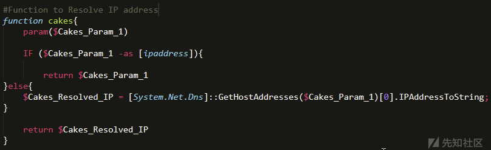](https://xzfile.aliyuncs.com/media/upload/picture/20240311210537-0da53f40-dfa8-1.png)
=======
在我们进行初步审查时最后注意到的一件事是脚本中发生了一些非常基本的字符串替换，因此我们决定采用我们熟悉的“查找和替换”方法。我们继续处理脚本内容，执行与大多数人在 IDA 或 Ghidra 中重命名变量类似的过程，不久之后，我们得到了一些更容易处理的东西。  
[](https://xzfile.aliyuncs.com/media/upload/picture/20240311210537-0da53f40-dfa8-1.png)
>>>>>>> 4992f5f682bf7aa8873ceb2495ac1d2a8296850f

# 最终（去混淆）分析

现在我们有了一个干净且经过反混淆的脚本可以使用，分析速度很快。在最初的几分钟内，我们能够确认我们第一次审查该脚本时的几个初步假设，即该脚本不是下载程序。让我们更深入地了解我们在分析过程中观察到的一些有趣的组件。  
cakes 函数  
cakes 函数是一个很好的起点，因为它简短而有趣。此函数的目的是根据作为参数提供的内容解析 IP 地址。  
当脚本执行前面提到的 ScriptBlock 时，将从已建立的 SSL 流中读取内容，并将其用作条件语句的一部分，以根据 C2 提供的 IP 地址或主机名确认或解析 IP 地址。确认预期的 IP 地址后，将使用它建立 TCP 套接字以进行其他网络通信。  
<<<<<<< HEAD
[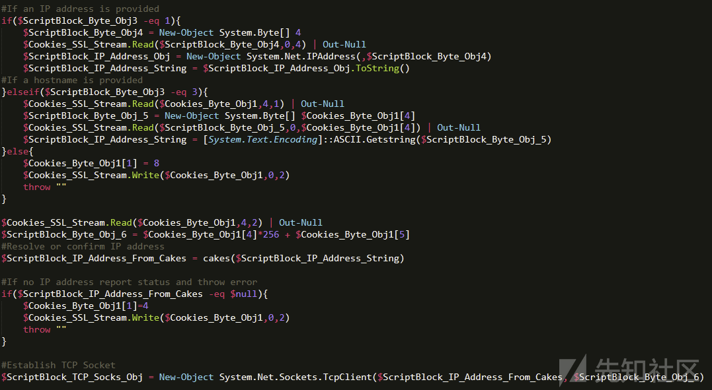](https://xzfile.aliyuncs.com/media/upload/picture/20240311210901-87925838-dfa8-1.png)  
cookies 函数  
在我们继续分析的过程中，我们意识到 cookies 功能负责大部分网络连接管理和疑似后门执行的高级操作。首先引人注目的是将 0x7F000001 设为其第一个参数的默认值。很少被讨论的一点是，IP 地址可以表示为十六进制数，而在这种情况下，它表示 127.0.0.1。

[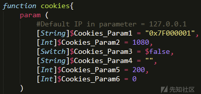](https://xzfile.aliyuncs.com/media/upload/picture/20240311211042-c3c4aa4a-dfa8-1.png)

Cookies 功能的另一个有趣方面是使用了运行 Runspace Pool。Runspace Pool 允许 PowerShell 高效异步地执行代码。之前的 PowerShell 恶意软件程序使用了 jobs 来实现此目的，但利用.NET 可以提高性能。

[](https://xzfile.aliyuncs.com/media/upload/picture/20240311211433-4d7f8b24-dfa9-1.png)  
这个后门中最有趣的组件可能是对 Runspace Pool 的创新使用，结合了 .NET PowerShell.Create () 方法来调用具有异步功能的 ScriptBlock，同时利用 SSL 流在 C2 服务器和被感染系统之间传递数据。在以往对恶意 PowerShell 脚本的分析中，攻击者通常利用 Invoke-Command 或 Invoke-Expression 作为执行恶意代码的手段，这提供了一种更少异步且可能更易被检测到的执行命令方法。通过一个加密的 SSL 通道异步传递命令，攻击者实现了更高效的性能，同时也可能更难被检测到的后期利用活动手段。

[](https://xzfile.aliyuncs.com/media/upload/picture/20240311211721-b1a1d1a2-dfa9-1.png)
=======
[](https://xzfile.aliyuncs.com/media/upload/picture/20240311210901-87925838-dfa8-1.png)  
cookies 函数  
在我们继续分析的过程中，我们意识到 cookies 功能负责大部分网络连接管理和疑似后门执行的高级操作。首先引人注目的是将 0x7F000001 设为其第一个参数的默认值。很少被讨论的一点是，IP 地址可以表示为十六进制数，而在这种情况下，它表示 127.0.0.1。

[](https://xzfile.aliyuncs.com/media/upload/picture/20240311211042-c3c4aa4a-dfa8-1.png)

Cookies 功能的另一个有趣方面是使用了运行 Runspace Pool。Runspace Pool 允许 PowerShell 高效异步地执行代码。之前的 PowerShell 恶意软件程序使用了 jobs 来实现此目的，但利用.NET 可以提高性能。

[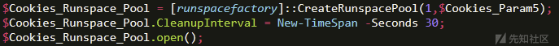](https://xzfile.aliyuncs.com/media/upload/picture/20240311211433-4d7f8b24-dfa9-1.png)  
这个后门中最有趣的组件可能是对 Runspace Pool 的创新使用，结合了 .NET PowerShell.Create () 方法来调用具有异步功能的 ScriptBlock，同时利用 SSL 流在 C2 服务器和被感染系统之间传递数据。在以往对恶意 PowerShell 脚本的分析中，攻击者通常利用 Invoke-Command 或 Invoke-Expression 作为执行恶意代码的手段，这提供了一种更少异步且可能更易被检测到的执行命令方法。通过一个加密的 SSL 通道异步传递命令，攻击者实现了更高效的性能，同时也可能更难被检测到的后期利用活动手段。

[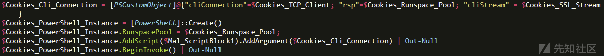](https://xzfile.aliyuncs.com/media/upload/picture/20240311211721-b1a1d1a2-dfa9-1.png)
>>>>>>> 4992f5f682bf7aa8873ceb2495ac1d2a8296850f

# 网络功能标注

在这个阶段的分析中，我们几乎已经确认这是一个后门，允许远程攻击者在受感染的系统上任意进行操作，与 BianLian GO 木马所允许的情况非常相似。最为画龙点睛的是（现在你可能在摇头）确认与此脚本相关的所有网络能力，并确认这些是与其他后门以及特别是 BianLian GO 后门观察到的相同类型的能力。  
BianLian 在其 GO 后门方面以证书认证而闻名；事实上，这正是许多安全研究人员主动识别其基础设施的方式。这种行为类型也在其后门的 PowerShell 实现中得以复制。具体来说，PowerShell 实现利用 RemoteCertificateValidationCallback 来验证用于认证的远程 SSL 证书。同样，脚本还利用 GetCertHashString 方法获取包含 X.509 证书哈希值的十六进制字符串。在脚本的执行流程中，我们看到一个十六进制值被传递为参数，用于验证远程 C2 服务器。  
<<<<<<< HEAD
[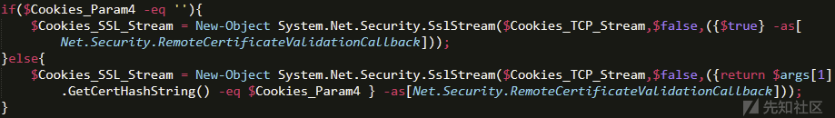](https://xzfile.aliyuncs.com/media/upload/picture/20240311212528-d3de2634-dfaa-1.png)  
验证证书后，就会建立 SSL 流，并利用执行期间作为参数传递的 IP 地址。  
[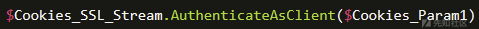](https://xzfile.aliyuncs.com/media/upload/picture/20240311212556-e43d5cc0-dfaa-1.png)  
=======
[](https://xzfile.aliyuncs.com/media/upload/picture/20240311212528-d3de2634-dfaa-1.png)  
验证证书后，就会建立 SSL 流，并利用执行期间作为参数传递的 IP 地址。  
[](https://xzfile.aliyuncs.com/media/upload/picture/20240311212556-e43d5cc0-dfaa-1.png)  
>>>>>>> 4992f5f682bf7aa8873ceb2495ac1d2a8296850f
处理到这个阶段，现在确认的后门能够与 C2 服务器通信，并根据远程攻击者的后渗透目标异步执行。需要注意的是，由于这个后门的性质，我们无法确定攻击者可以与此后门结合使用的所有后渗透功能。正如我们在 BianLian GO 实现中看到的那样，这个后门的主要优势在于它在后渗透活动期间提供了灵活性，同时将活动掩盖在加密隧道内。

# 关联指向 BianLian

如前所述，我们分析的 PowerShell 脚本的最后一行显示了使用一些指定参数调用 cookies 函数。  
<<<<<<< HEAD
[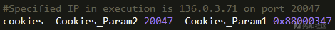](https://xzfile.aliyuncs.com/media/upload/picture/20240311212900-523c6a0e-dfab-1.png)  
当 Cookies\_Param1 中传入的十六进制值转换为十进制时，观察到的值为 136 \[.\] 0 \[.\] 3 \[.\] 71。简单进行 OSINT 搜索后发现，根据 C2IntelFeeds 的说法，该 IP 地址与截至 2024 年 3 月 6 日 运行 BianLian GO 后门的服务器相关联，这对应于在此事件中观察到的活动。  
[](https://xzfile.aliyuncs.com/media/upload/picture/20240311213038-8cc22b32-dfab-1.png)  
另外，在首次成功执行 PowerShell 后门之前不久，GuidePoint 的事件响应团队观察到多次检测到 Microsoft AV 签名 Win64/BianDoor.D。  
=======
[](https://xzfile.aliyuncs.com/media/upload/picture/20240311212900-523c6a0e-dfab-1.png)  
当 Cookies\_Param1 中传入的十六进制值转换为十进制时，观察到的值为 136 \[.\] 0 \[.\] 3 \[.\] 71。简单进行 OSINT 搜索后发现，根据 C2IntelFeeds 的说法，该 IP 地址与截至 2024 年 3 月 6 日 运行 BianLian GO 后门的服务器相关联，这对应于在此事件中观察到的活动。  
[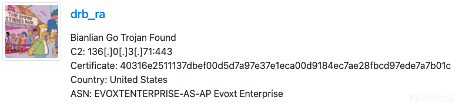](https://xzfile.aliyuncs.com/media/upload/picture/20240311213038-8cc22b32-dfab-1.png)  
另外，在首次成功执行 PowerShell 后门之前不久，GuidePoint 的事件响应团队观察到多次检测到 Microsoft AV 签名 Win64/BianDoor.D。  
>>>>>>> 4992f5f682bf7aa8873ceb2495ac1d2a8296850f
根据这些共享基础设施和反病毒检测的结果，GRIT 非常有信心地评估所分析的 PowerShell 脚本是 BianLian GO 后门的 PowerShell 实现。

# 总结

在整个 2023 年以及 2024 年初，我们已经看到，BianLian 继续证明了他们如何适应环境不断变化，特别是在利用新兴漏洞方面。这种行为与 GRIT 在我们的 2024 年勒索软件报告中评估和假设的情况一致，我们预计这种类型的攻击行为将继续增长，特别是对于那些仅利用数据外泄方法的勒索软件的团体。  
随着我们集体迈向 2024 年，我们最大的建议集中在准备工作上，更具体地说，是修补您的互联网侧应用程序。同样，演练事件响应计划，继续进行威胁情报驱动的渗透测试，并专注于寻找利用威胁情报来跟上当前威胁趋势的方法，将有助于使您的团队在预防这类攻击方面变得更加有效和高效。一个信息充分的预防和准备意识，加上一个极其有效的应对能力，将确保您对 BianLian 或任何其他威胁行为团体可能带来的挑战做好准备。

IOCs:  
INDICATOR TYPE DESCRIPTION  
web.ps1 Filename PowerShell Implementation of BianLian GO Backdoor  
136\[.\]0\[.\]3\[.\]71 IP Address BianLian C2 Infrastructure  
88\[.\]169\[.\]109\[.\]111 IP Address IP Address associated with malicious authentication to TeamCity  
165\[.\]227\[.\]151\[.\]123 IP Address IP Address associated with malicious authentication to TeamCity  
77\[.\]75\[.\]230\[.\]164 IP Address IP Address associated with malicious authentication to TeamCity  
164\[.\]92\[.\]243\[.\]252 IP Address IP Address associated with malicious authentication to TeamCity  
64\[.\]176\[.\]229\[.\]97 IP Address IP Address associated with malicious authentication to TeamCity  
164\[.\]92\[.\]251\[.\]25 IP Address IP Address associated with malicious authentication to TeamCity  
126\[.\]126\[.\]112\[.\]143 IP Address IP Address associated with malicious authentication to TeamCity  
38\[.\]207\[.\]148\[.\]147 IP Address IP Address associated with malicious authentication to TeamCity  
101\[.\]53\[.\]136\[.\]60 IP Address IP Address associated with malicious authentication to TeamCity  
188\[.\]166\[.\]236\[.\]38 IP Address IP Address associated with malicious authentication to TeamCity  
185\[.\]174\[.\]137\[.\]26 IP Address IP Address associated with malicious authentication to TeamCity  
977ff17cd1fbaf0753d4d5aa892af7aa MD5 Web.ps1  
1af5616fa3b4d2a384000f83e450e4047f04cb57 SHA1 Web.ps1  
7981cdb91b8bad8b0b894cfb71b090fc9773d830fe110bd4dd8f52549152b448 SHA256 Web.ps1  
hxxp://136\[.\]0\[.\]3\[.\]71:8001/win64.exe URL BianLian C2 Infrastructure  
hxxp://136\[.\]0\[.\]3\[.\]71:8001/64.dll URL BianLian C2 Infrastructure

翻译参考：  
[https://www.bleepingcomputer.com/news/security/avast-releases-free-bianlian-ransomware-decryptor/](https://www.bleepingcomputer.com/news/security/avast-releases-free-bianlian-ransomware-decryptor/)  
[https://www.secrss.com/articles/64155](https://www.secrss.com/articles/64155)  
[https://redacted.com/blog/bianlian-ransomware-gang-continues-to-evolve/](https://redacted.com/blog/bianlian-ransomware-gang-continues-to-evolve/)  
[https://www.freebuf.com/articles/network/390739.html](https://www.freebuf.com/articles/network/390739.html)  
[https://blog.csdn.net/qq\_53058639/article/details/132256920](https://blog.csdn.net/qq_53058639/article/details/132256920)
