# 记一次安服薅洞实战 - 先知社区

```plain
记一次为数不多但还算有点收获的一次实战（平时摸鱼来着...），大致任务是对某某市某*院进行次漏洞收集和外网资产梳理且是有授权的（其实是甲方不大清楚自己外网有多少资产），漏洞质量要求还挺高。emmm 本来是打算摸鱼来着的
```

- - -

言归正传，先从信息收集开始，查备案找到四个域名，批量丢到鹰图看一看资产，顺便灯塔也跑一跑（灯塔这里不放了，上面东西蛮多的）。

[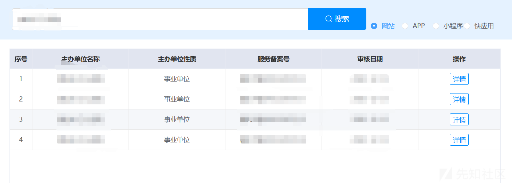](https://xzfile.aliyuncs.com/media/upload/picture/20240124213739-be4a9c10-babd-1.png)

[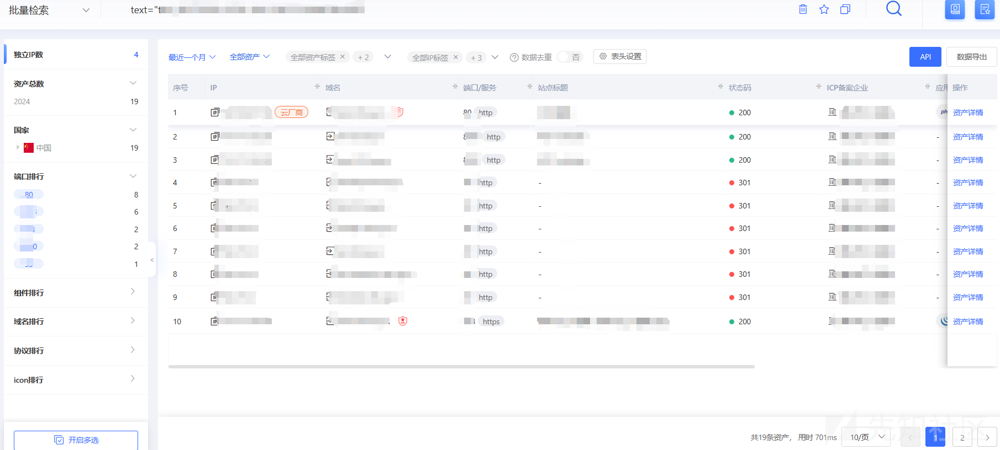](https://xzfile.aliyuncs.com/media/upload/picture/20240124214223-672c08a0-babe-1.png)

子域名、扫扫目录，收集大概就这些了，子域名收集到一个 403 页面，属实是没怎么见过了一般遇到的访问根目录下就能看到网站页面，只有部分域名下存在多个网站（类似于一台主机中一个目录一个网站）或没做好重定向，所以会出现 403。  
话不多说，扫扫目录好了，dirsearch -u [https://domain/-r](https://domain/-r) -x 404

[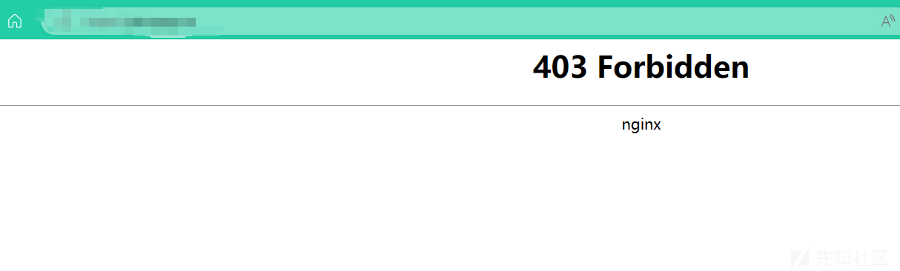](https://xzfile.aliyuncs.com/media/upload/picture/20240124215025-86baac02-babf-1.png)

这不就来了吗，访问搞到多个网站，全都是直接跳转到登录页面。  
[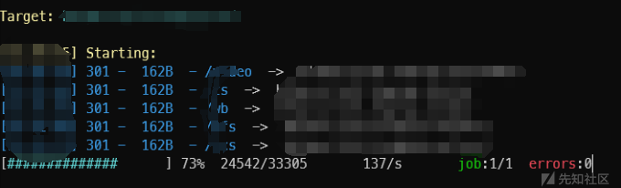](https://xzfile.aliyuncs.com/media/upload/picture/20240124215812-9cc70b98-bac0-1.png)

柿子还得挑软的捏，还是熟悉的页面  
[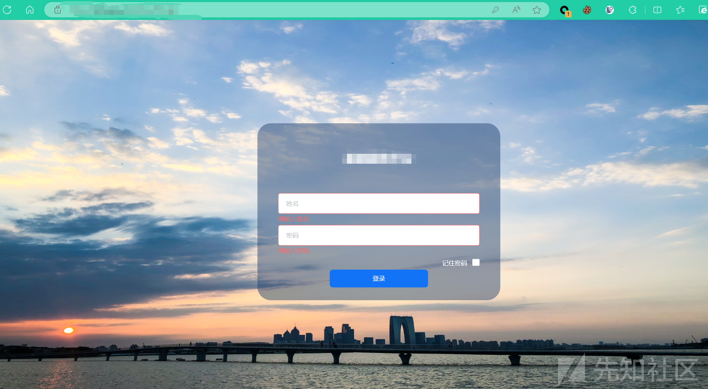](https://xzfile.aliyuncs.com/media/upload/picture/20240124214902-54fae9f2-babf-1.png)  
直接开启 burp，抓包进行爆破，顺便试试有无注入，很好，跑出来的弱口令账号几乎都没有进入后台的权限。  
无奈，只好看看 swagger、druid 之类的

[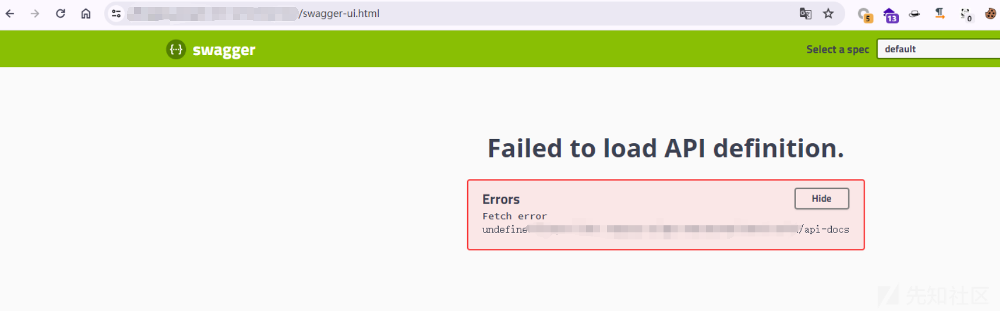](https://xzfile.aliyuncs.com/media/upload/picture/20240124220652-d2f91a02-bac1-1.png)  
很好，swagger 寄了  
关键时刻还得看看 druid，弱口令

[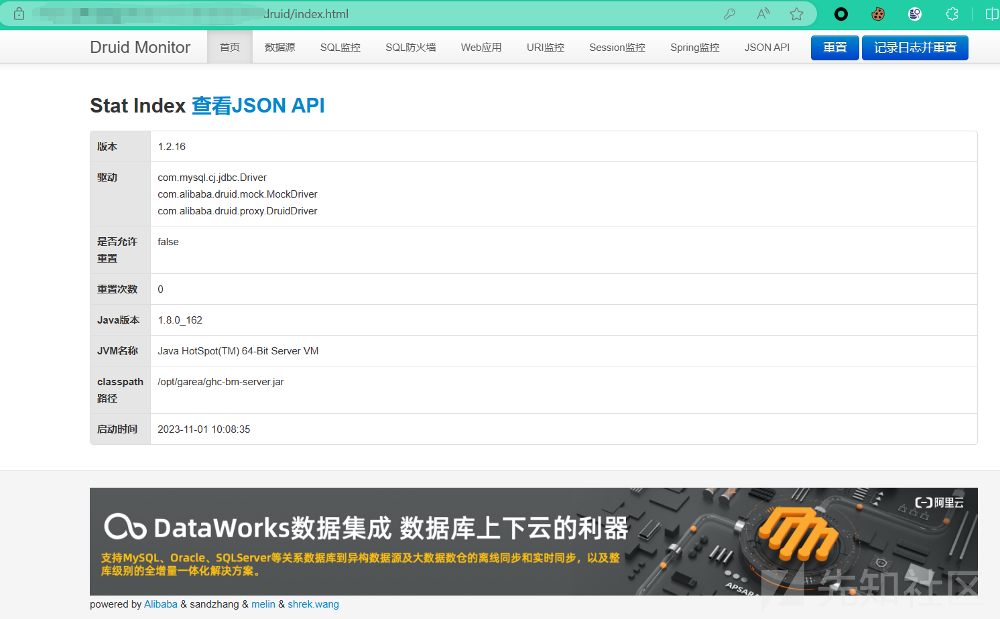](https://xzfile.aliyuncs.com/media/upload/picture/20240124220838-1233b9fc-bac2-1.png)  
很好总算是有点收获了。  
但是吧，离交差还是差点。提取出 url 看看有没有未授权  
[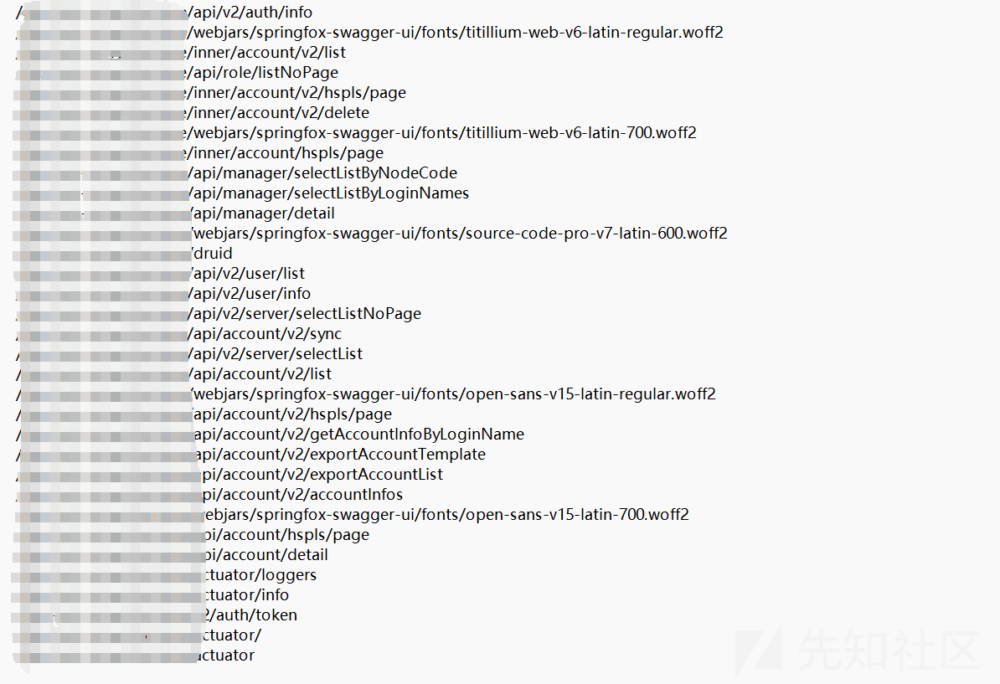](https://xzfile.aliyuncs.com/media/upload/picture/20240124221151-84e4e89a-bac2-1.png)  
再次祭出 dirsearch 指定目录然后代理到 burp 看看有没有可用的。  
dirsearch -u [http://domain/](http://domain/) -w dir --proxy=[http://127.0.0.1:8080](http://127.0.0.1:8080/)  
[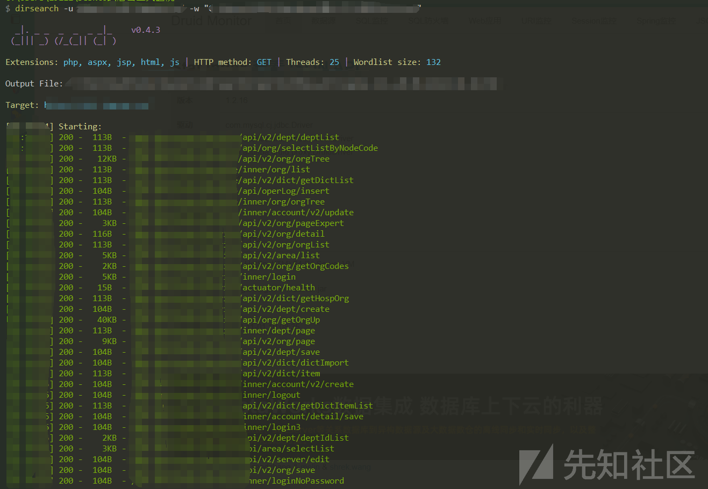](https://xzfile.aliyuncs.com/media/upload/picture/20240124221627-296aedc4-bac3-1.png)  
很好这波狂喜，路径几乎全都可以正常访问。heapdump 文件也有但是用处不是很多，解开并没有发现有用的东西。  
其中找到几个接口拼接参数直接拿到网站登陆的用户账号密码  
[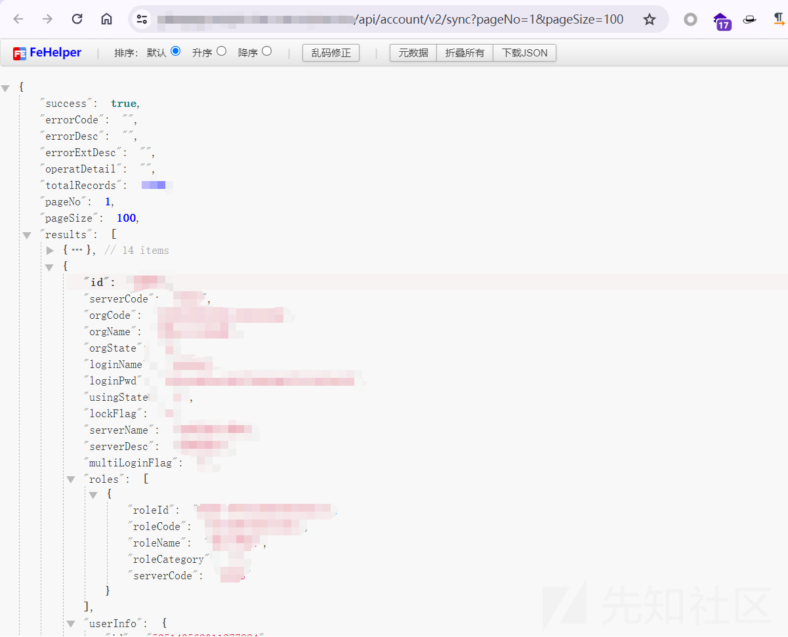](https://xzfile.aliyuncs.com/media/upload/picture/20240124222127-dc4229b2-bac3-1.png)  
密码 md5 的可以直接接出来，好家伙直接就是弱口令 123，就是用户名有点难猜八成有的人可能不多，格式是这样的“AA001”、“xxxx0000”，大概就是四个字母缩写加四个数字的用户名，这里就不看了。

[](https://xzfile.aliyuncs.com/media/upload/picture/20240124222649-9c34428c-bac4-1.png)  
后面简单看了看翻了翻之前的接口，找到个类似系统管理的接口  
很好，资产收集算是可以交差了  
[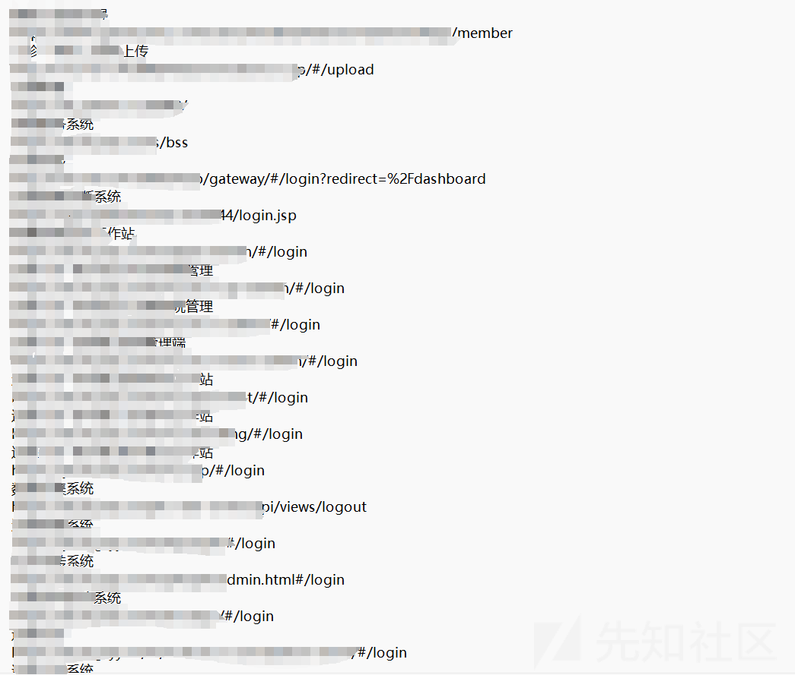](https://xzfile.aliyuncs.com/media/upload/picture/20240124223157-53b0dbd2-bac5-1.png)

最后，因为时间原因这次其实有些遗憾没能拿下，但是薅了 7、8 个洞，资产收集的也差不多算是可以交差。

祝各位师傅天天好运气！
