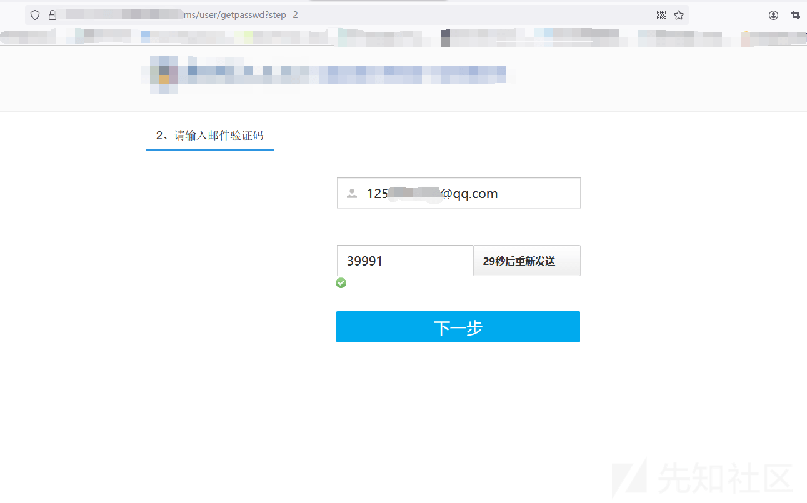
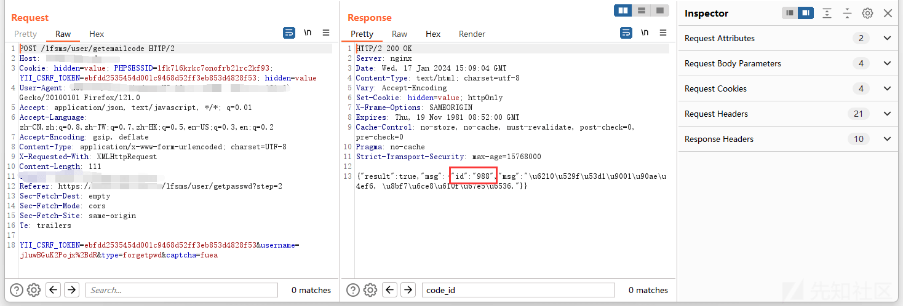
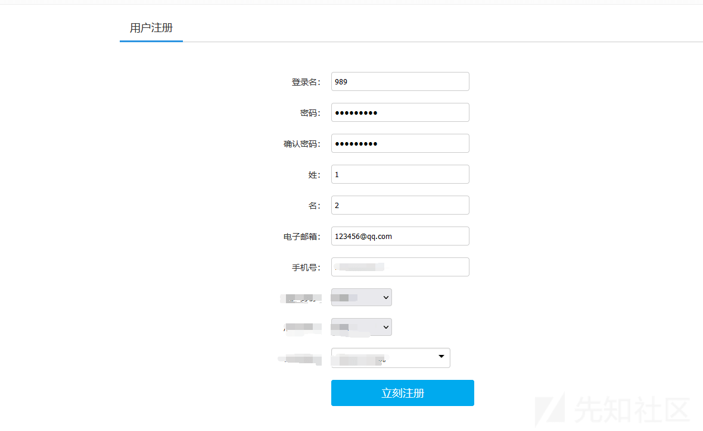
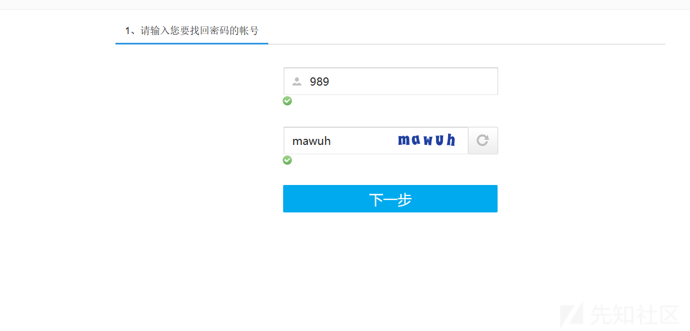
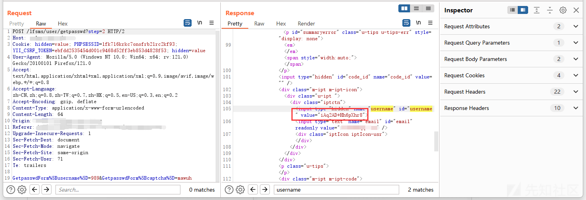
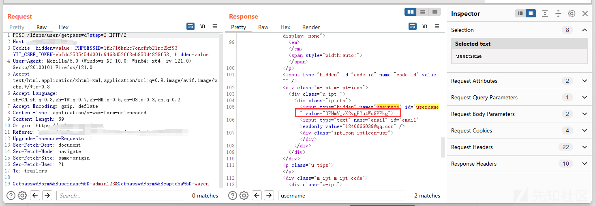
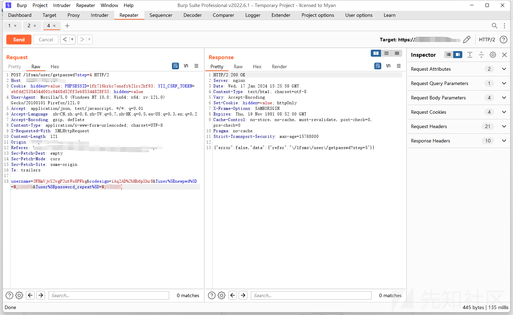
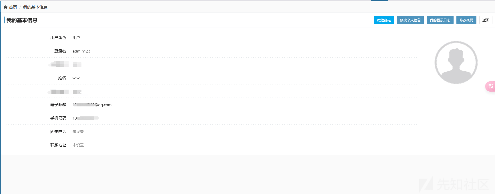

# 记一次某网站任意用户账号密码修改 - 先知社区

记一次某网站任意用户账号密码修改

- - -

网站存在注册、修改密码等界面，使用我们之前注册好的账号进入修改密码处尝试修改  
  
点击下一步后，进入验证的第二步，填入我们注册账号时使用的邮箱，点击获取验证码  
  
然后我们可以在 bp 数据包中找到发送验证码的数据包  
  
可以看到发送验证码后，响应包中的 id 值为 988，后面测试发现这里每一次忘记密码发送邮箱后会告诉我们 id 值，从这里我们可以知道我们下一次点击忘记密码的值应该为 989，这里为什么需要这个值我们后面会讲到的，知道下一个值后我们需要知道该值在经过网站加密后的值是多少  
在上图中可以看到 username 的值在发送验证码时会可以得到加密值为 j1uwBGuK2Pojx%2BdR 所以我们是否可以通过注册一个用户名为 989 的用户来获取 989 的网站加密值呢？使用网站的注册界面注册一个 989 用户  
  
注册好后回到忘记密码界面  
  
然后点击下一步用 bp 抓包看到下面这个数据包中有 989 的加密值  
  
然后我们就可以开始修改其他用户的密码了，这里以 admin123 用户为例去修改密码，跟上面类似，输入用户可以获取到用户的加密值  
  
然后可以使用下面这个数据包修改密码了，其中的 username 的值为需要修改用户的加密值，codesign 的值为我们前面需要的 id 值的加密值，最后填上要修改的密码即可  
  
可以看到虽然返回值为 false，但是返回跳转路径为 step=5，也就是我们确实成功修改了 admin123 的密码了，使用修改的密码尝试登录  
  
可以看到成功登录，通过这个方法可以修改任意用户的密码，主要思路是注册一个与下一次忘记密码的 id 值一样的用户来获取到 id 的加密值进而实现的任意用户账号密码修改
