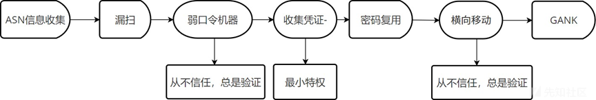

# 运营人员关于零信任现状的梳理 - 先知社区

#### 00X0 前言

- - -

根据国外一份 2023 年零信任安全状况的一份报告，97% 的安全人员都表达了对零信任策略的认可与支持，安全运营人员计划在未来 18 个月内实施零信任策略。这使得零信任普及率从 24%(2021 年) 增加到 55%(2023 年)，笔者也认为 "零信任" 安全模型是一种相对全面的安全策略，对内部和外部资源的访问可以持续审核与验证。零信任依靠对应用程序、用户和设备的持续监控和访问控制。其对资源的访问限制在绝对最低限度，并且平台上的所有身份都使用相同的标准进行评估。零信任目标是仅向那些不断证明其身份且其行为受到持续审查的人授予访问权限，从而增强安全性。  
笔者以前很懊恼，为啥所在的企业压根没有推进零信任的欲望，领导还是一如既往的纠结买那家的 IPS、IDS、态势感知、漏扫服务。按照数据驱动安全的标准继续搭建企业的防御网络框架。匪夷所思，难道还是要依靠 "事件驱动" 嘛！后来深入企业环境，实地推进杀软更新后，终于理解了领导。企业内部的不配和、企业资产的不清晰，外加不同厂商的设备，没有标准接口等一系列的问题，导致了零信任的破产。但是也不是完全没有希望，零信任的二次验证、AI 等局部的技术手段，开始在安全产品上出现，在一次次攻防演练和实战的监测下，体现了零信任的优越性。这让笔者看到了希望，相信未来零信任会成为安全运营人员的第一选择。

#### 00X1 信任到验证的坎坷

- - -

某师傅在某推某特发表了自己对红队的几点建议：

```plain
不放弃旧的/不再维护的资产：进入旧资产以后收集各种密码，“密码复用”是很好的攻击姿势。
不放过任何 nday 细节：某系统有两个 sql 注入点，其中接口 A 的注入点比较出名，导致搜索引擎甚 至知名漏洞库只能搜到接口 A，仔细搜才能搜到接口 B。
漏洞组合利用思路：看到 ssrf 想到什么，看到 lfi 想到什么，反射 xss 只能弹个窗吗？self-xss 只能自 慰吗？open-redirect 百无一用吗？
挖一挖供应链吧：试想一下如果有了 idc 的权限，干掉目标岂不是动动鼠标的事？打 idc 你可能觉得 难，但是打 idc 的代理商呢？
```

顺便附带了自己的攻击流程图（如下图所示）：  
[](https://xzfile.aliyuncs.com/media/upload/picture/20240330221340-b51157d6-ee9f-1.png)  
从不信任，总是验证的原则是许多安全运营中心 (SOC) 都认可的安全策略，其原则是网络设备和用户必须不断证明自己的身份，因为它们不会自动受到信任。这意味着，即使之前已验证过，并且用户、设备或 IP 依旧没有发生改变，在常规情况下，系统依然都不会信任该访问资源的请求。需要重新进行访问验证，通过系统确认后再授予访问权限。如果是这样某师傅在第三步，登录验证的时候，因为第二次令牌验证，就会导致登录失败，无法通过弱口令进入工作人员的机器，导致攻击失效。  
虽然公司和公共管理部门的负责人针对零信任的概念还在持观望态度，一部分安全人员也觉得零信任 "有点扯"、"不靠谱"，但 APT（高级持续威胁）一方面正在一步步的检验零信任有效性和可靠性。另一方面，也让安全人员明白，只有全面了解企业设备和环境，才能实现零信任，降低企业被攻击的风险。

#### 00X2 特权与原则的坚持

- - -

由黑客组织 Storm-0558 发起针对多个政府机构的攻击流程（如下图所示）他们使用伪造的数字身份验证令牌来访问在 Microsoft Outlook 服务上运行的网络邮件帐户。在此事件中，攻击者窃取了 Microsoft 签名密钥，使他们能够为 Outlook Web Access (OWA) 和 Outlook.com 颁发功能访问令牌并下载电子邮件和附件。由于配置失误，导致仅适用于私人客户帐户 (MSA) 的数字签名也适用于企业客户的 Azure Active Directory。  
[](https://xzfile.aliyuncs.com/media/upload/picture/20240330221434-d59b60be-ee9f-1.png)  
零信任模型通常应用于企业的数字基础设施组件当中，通过消除隐式信任并利用持续证明后的最小特权原则，强制执行严格的身份 AuthN 和 AuthZ 访问。为了零信任策略的高效实施，企业安全运营中心 (SOC) 越来越倾向于利用网络分析工具，来监控其网络、搜索威胁、检测应用程序和资产以及捕获恶意数据包，这些行动有助于有效检测 IT 基础设施内的威胁。身份和访问管理（IAM）无疑在零信任体系当中发挥着不可替代的作用。在身份被盗用的情况下，部分对用户身份的持续验证证明是无效的。除此之外，攻击者可以通过使用欺骗性 VPN 地址操纵元信息（例如：伪造登录的地理位置）来绕过零信任系统。虽然 IDS、IPS 系统的任务是检测可疑或未经授权的活动、病毒感染、恶意软件和勒索软件、零日攻击等。但是 IDS、IPS 系统通常只能检测已知的攻击行为（例如：先前识别的恶意域或 IP 地址。如果 IP 没有被事先标记为恶意 IP，常规的安全解决方案大概率会忽略，从而成为攻击者利用链中的一环）。因此传统的网络安全系统有时会阻碍零信任执行。

#### 00X3 脆弱性识别的磨难

- - -

在零信任架构下，脆弱性识别起着至关重要的作用。通过持续的监测和审查，安全团队可以及时发现并应对潜在的安全威胁，提高网络的安全性和防御能力。与此同时，企业也应该加强员工的安全意识培训，提高整体的网络安全素养，共同构建一个安全稳固的网络环境。  
因此，安全运营中心 (SOC) 需要不断加强对脆弱性识别方案的应用和实践，以建立一个强大的零信任架构。安全团队应该采取主动的态度，定期进行网络扫描和审查，以发现网络中的潜在漏洞和威胁。同时，应建立完善的安全事件响应计划，包括应急响应流程、恢复策略和持续监控机制，以便在真正发生安全事件时能够迅速做出反应，减少损失。  
[](https://xzfile.aliyuncs.com/media/upload/picture/20240330221459-e4ba66f8-ee9f-1.png)  
笔者认为，攻击者尝尝青睐对企业实施网络攻击。攻击者会使用虚假身份或 0day 漏洞渗透企业网络，然后在网络中横向移动以搜索目标、访问特权系统、安装勒索软件或其他恶意软件并窃取企业数据。零信任有助于在攻击者内部侦察（攻击者调查潜在目标）或横向移动（当攻击者已在网络中时）的过程当中提高攻击者的攻击成本，使得攻击者因为攻击成本过高而放弃攻击。安全运营中心在网络安全漏洞和威胁存在的前提下，需要始终保持高度警惕，加强脆弱性识别解决方案的应用和实践，建立有弹性且有效的零信任架构，以保护企业免受网络攻击的威胁，确保网络安全和数据安全。

#### 00X4AI 加安全的未来

- - -

机器学习算法通过分析数据来了解网络通信过程中的 "正常" 行为，从而建立正常网络行为的基线。这类算法经过训练，可以了解什么构成了网络的“正常”活动，从而使它们能够判读网络通信的 "区别"。这些 "区别" 的示例包括可疑连接、异常数据传输、超出既定规范的流量模式、网络内的横向移动、数据泄露等。  
我们可以转变思路，大型语言模型 (LLM) 加充沛的安全数据，就可以开发出一款不错的 Gen AI 产品，相较于第三方的产品，企业敏感数据被泄露的风险大大降低。就个人经验来说，相较于部分 IPS、IDS、态势感知平台单纯的匹配流量特征和规则来说，检测到的实际威胁的转化率以及威胁的严重程度是非常低的。为了检测 ATT&CK 的威胁，需要安排大部分安全运营人员全天候的值守，人力成本过于高昂。借助机器学习，系统能够检测流量异常，而无需依赖预存储的已知 Indicators of Compromise (IOC)。机器学习模型通过持续训练，使其能够检测新的威胁和攻击技术。这种方法提高了恶意活动的检测速度，并能够快速告知运维人员，及早针对告警事件作出响应。Gen AI 还有助于识别未知的可疑行为，并最大限度地减少攻击者在网络中不被注意地停留的时间，从而增强整体安全性。

#### 00X5 笔者点评

- - -

企业在推进零信任时所面临的挑战和困境。零信任作为一种成熟的安全理念，要求企业在安全防御上彻底放弃信任，对所有用户和设备都进行严格的验证和监控。然而，实际推进零信任在企业内部可能会遇到种种问题，如内部不配和、资产不清晰、设备标准接口不统一等。笔者认为这些问题并不是无法克服的。通过加强内部沟通和合作，建立明确的资产管理和标准接口规范，企业可以逐步解决这些问题，逐步推进零信任的实施。同时，利用零信任的二次验证、AI 等技术手段，可以在一定程度上弥补现有安全 防御体系的不足，提高安全性和有效性。  
笔者相信随着安全技术的不断发展和完善，零信任会成为安全运营人员的首选。因为零信任理念更加符合现代网络环境中复杂的安全挑战，可以为企业提供更加全面和强大的安全防御能力。因此，我建议企业在推进零信任时要积极解决内部问题，同时不断学习和应用新的安全技术手段，以确保企业网络的安全和稳定。  
参考资料：

-   [https://mp.weixin.qq.com/s/6WuRJBIRTKPGJPZiF1tjeQ](https://mp.weixin.qq.com/s/6WuRJBIRTKPGJPZiF1tjeQ) [https://thehackernews.com/2023/08/the-vulnerability-of-zero-trust-lessons.html](https://thehackernews.com/2023/08/the-vulnerability-of-zero-trust-lessons.html)
-   [https://medium.com/@flxflx/the-relationship-between-zero-trust-and-confidential-computing-24a8e95a4531](https://medium.com/@flxflx/the-relationship-between-zero-trust-and-confidential-computing-24a8e95a4531)
