# 针对一道面试题样本的详细分析 - 先知社区

# 前言概述

群里有朋友私信我，说面试的时候需要分析一个样本，最后没有过，说只分析停留在外壳代码，没有深入进去，让我有空帮忙看看，简单看了一下这个样本，发现有点意思，给想从事恶意软件分析的朋友一些参考。  
[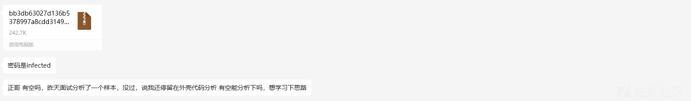](https://xzfile.aliyuncs.com/media/upload/picture/20240320191502-18af4458-e6ab-1.png)

# 详细分析

1\. 样本无加壳，编译时间为 2022 年 1 月 13 日，如下所示：  
[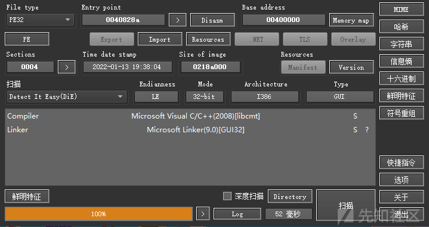](https://xzfile.aliyuncs.com/media/upload/picture/20240320192559-a084dc20-e6ac-1.png)  
2\. 主体代码结构，如下所示：  
[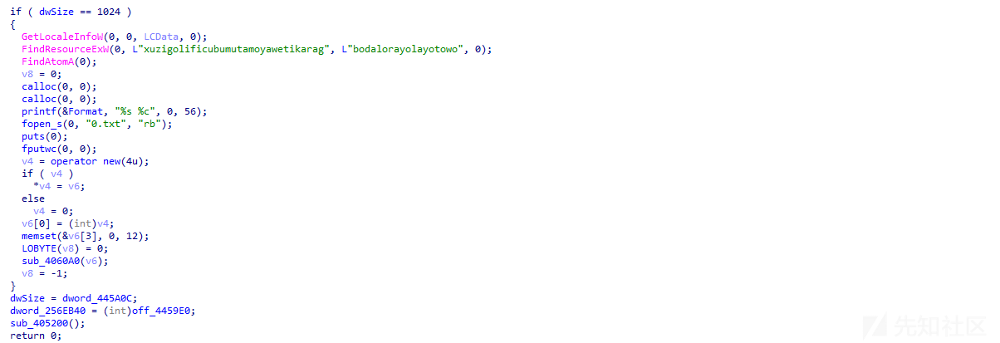](https://xzfile.aliyuncs.com/media/upload/picture/20240320192624-af256718-e6ac-1.png)  
3\. 进入 sub\_405200 函数，很明显对某个内存地址进行了赋值操作，如下所示：  
[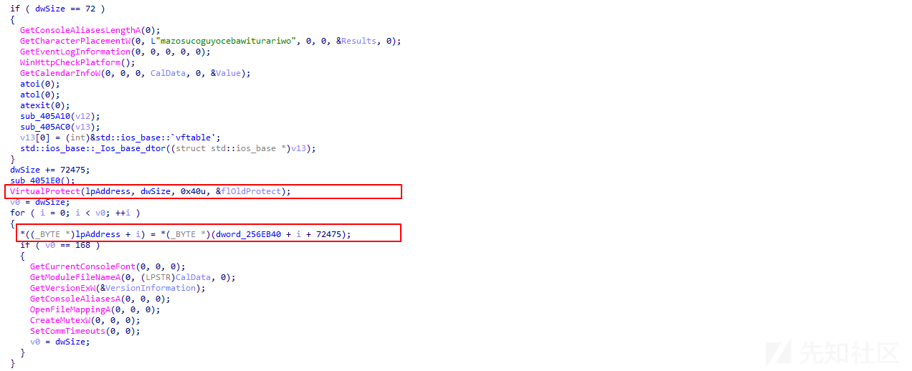](https://xzfile.aliyuncs.com/media/upload/picture/20240320192641-b92b1852-e6ac-1.png)  
4\. 最后跳转执行该地址代码，如下所示：  
[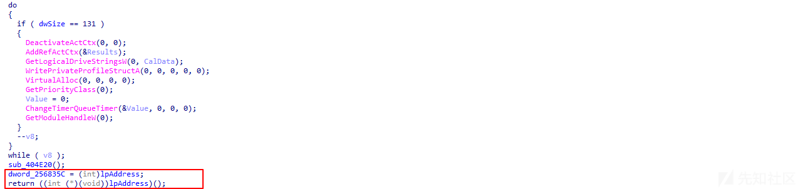](https://xzfile.aliyuncs.com/media/upload/picture/20240320192657-c327993e-e6ac-1.png)  
5\. 该内存地址是通过 GlobalAlloc 动态分配的，如下所示：  
[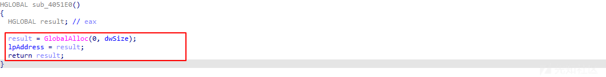](https://xzfile.aliyuncs.com/media/upload/picture/20240320192712-cbc68e6a-e6ac-1.png)  
6\. 将 shellcode 代码，拷贝到分配的内存地址当中，如下所示：  
[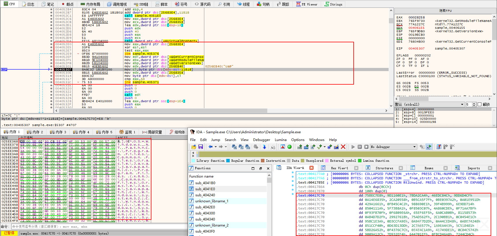](https://xzfile.aliyuncs.com/media/upload/picture/20240320192726-d412a004-e6ac-1.png)  
7\. 赋值之后的内存代码，如下所示：  
[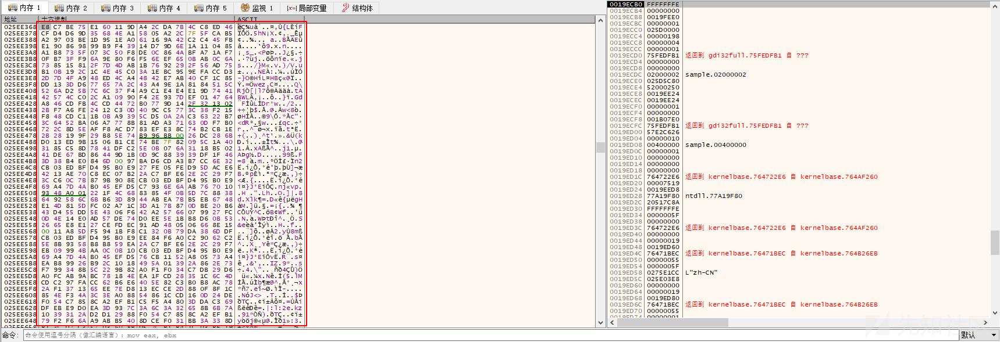](https://xzfile.aliyuncs.com/media/upload/picture/20240320192740-dcb2b6cc-e6ac-1.png)  
8\. 解密 shellcode 代码，如下所示：  
[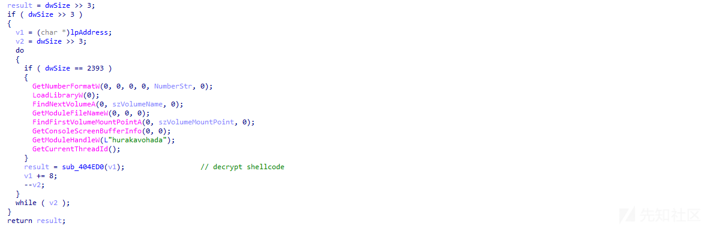](https://xzfile.aliyuncs.com/media/upload/picture/20240320192805-eb936196-e6ac-1.png)  
9\. 解密之后的 shellcode 代码，如下所示：  
[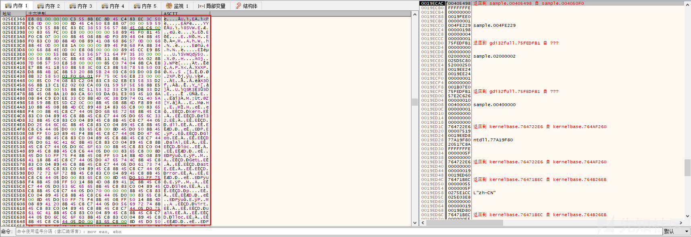](https://xzfile.aliyuncs.com/media/upload/picture/20240320192819-f39597d8-e6ac-1.png)  
10\. 跳转执行解密出来的 shellcode 代码，如下所示：  
[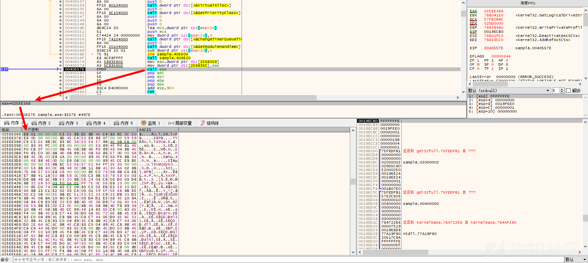](https://xzfile.aliyuncs.com/media/upload/picture/20240320192834-fcf8c2a0-e6ac-1.png)  
11\. 外壳代码基本上就分析完了，进入 shellcode 代码，获取相关函数地址，如下所示：  
[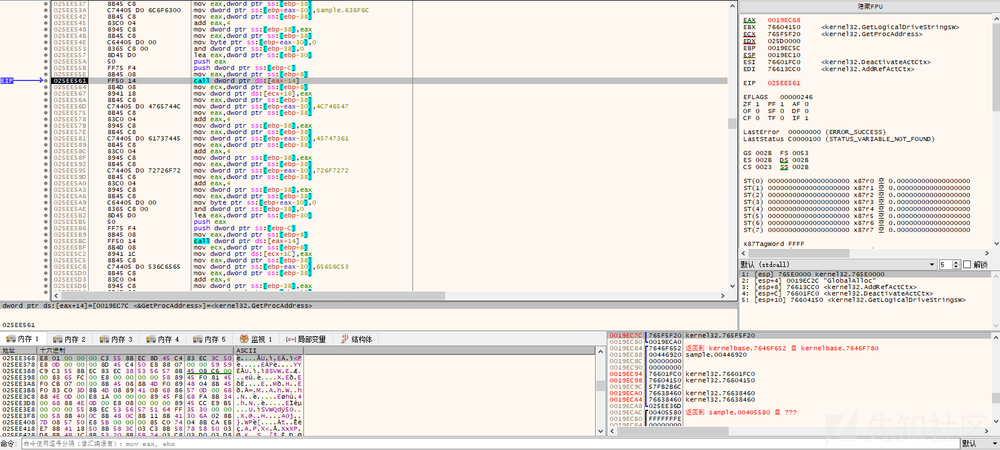](https://xzfile.aliyuncs.com/media/upload/picture/20240320192851-070e0f5c-e6ad-1.png)  
12\. 解密第二段 shellcode 数据，如下所示：  
[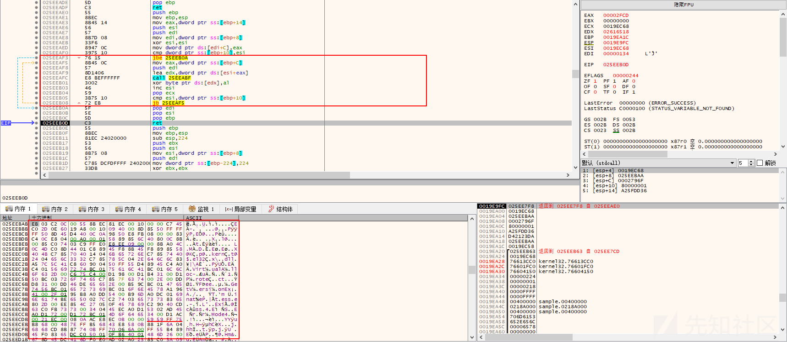](https://xzfile.aliyuncs.com/media/upload/picture/20240320192906-0fc5dc24-e6ad-1.png)  
13\. 通过 VirtualAlloc 分配内存空间，然后将第二段 shellcode 解密拷贝到分配的内存空间，如下所示：  
[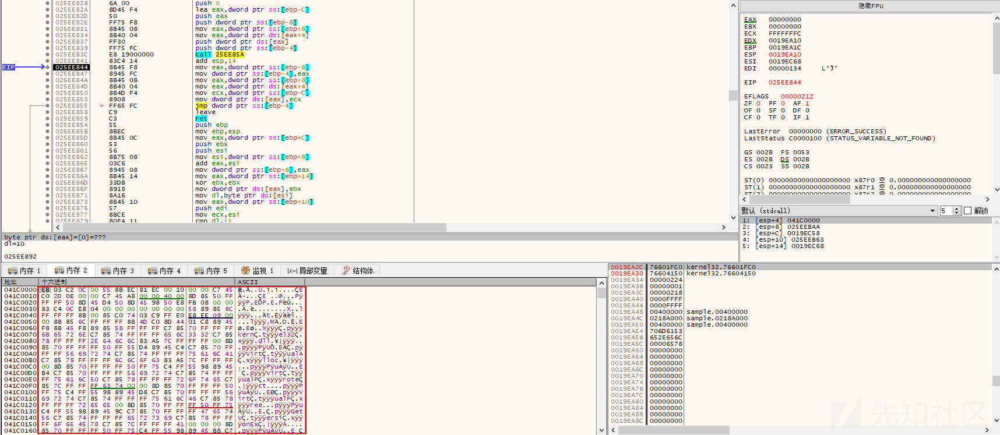](https://xzfile.aliyuncs.com/media/upload/picture/20240320192921-18d0e886-e6ad-1.png)  
14\. 跳转执行到第二段 shellcode 代码，如下所示：  
  
15\. 第二段 shellcode 代码，如下所示：  
[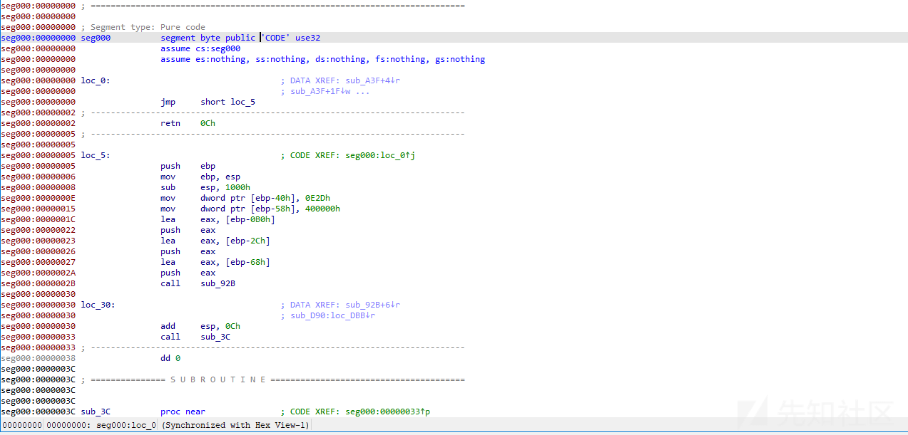](https://xzfile.aliyuncs.com/media/upload/picture/20240320192954-2cc25424-e6ad-1.png)  
16\. 分配内存空间，如下所示：  
[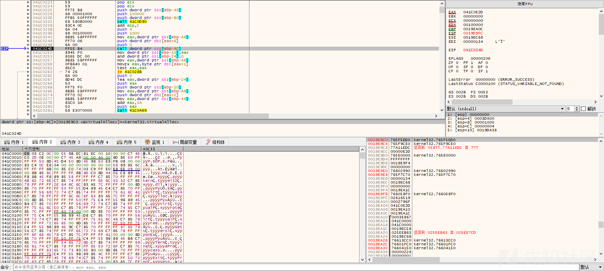](https://xzfile.aliyuncs.com/media/upload/picture/20240320193009-35314f34-e6ad-1.png)  
17\. 将 shellcode 代码中 payload 数据拷贝到分配的内存空间当中，如下所示：  
[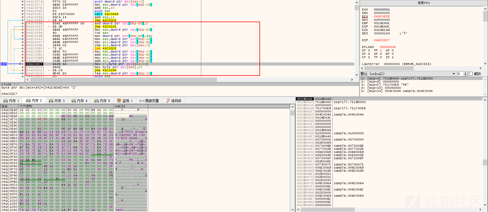](https://xzfile.aliyuncs.com/media/upload/picture/20240320193025-3f1f25ca-e6ad-1.png)  
18\. 拷贝完成之后内存空间，如下所示：  
[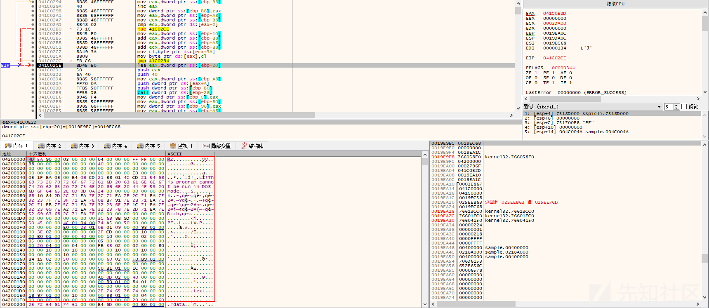](https://xzfile.aliyuncs.com/media/upload/picture/20240320193040-47d3061e-e6ad-1.png)  
19\. 将 payload 代码加载到 00400000 内存代码中，如下所示：  
[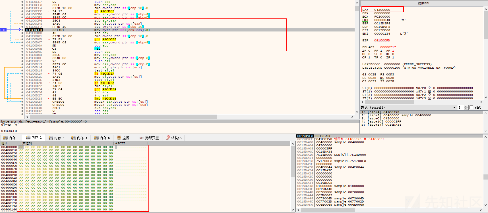](https://xzfile.aliyuncs.com/media/upload/picture/20240320193055-50baec9c-e6ad-1.png)  
20\. 跳转到加载到内存的 payload 代码入口点执行，如下所示：  
[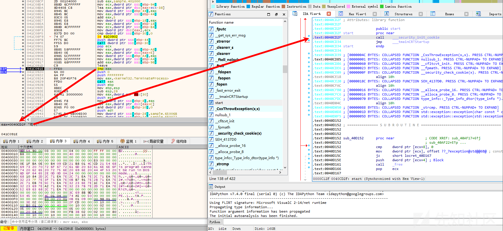](https://xzfile.aliyuncs.com/media/upload/picture/20240320193110-59db5c26-e6ad-1.png)  
21.main 函数主体代码，如下所示：  
[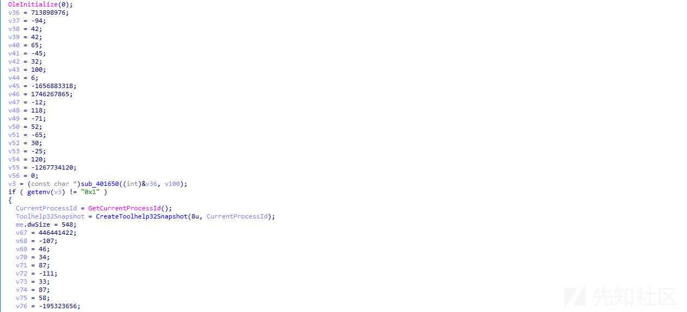](https://xzfile.aliyuncs.com/media/upload/picture/20240320193126-636351f4-e6ad-1.png)  
22\. 查找程序中资源数据，如下所示：  
[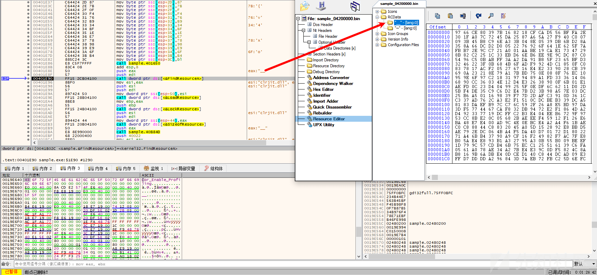](https://xzfile.aliyuncs.com/media/upload/picture/20240320193141-6c2756dc-e6ad-1.png)  
23\. 获取资源数据到内存当中，如下所示：  
[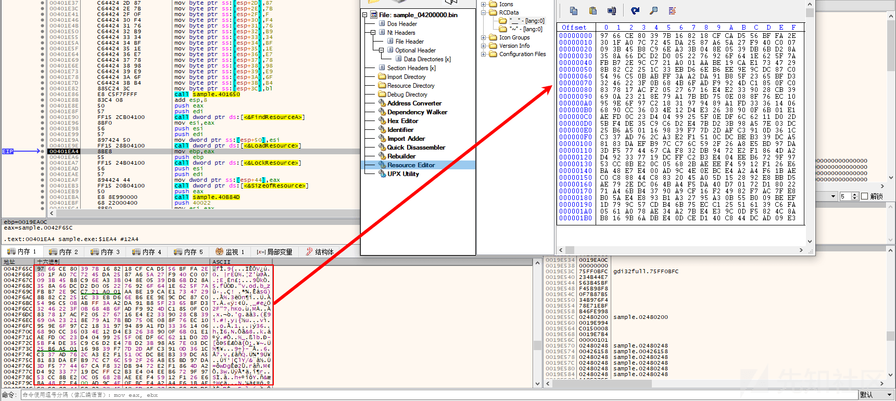](https://xzfile.aliyuncs.com/media/upload/picture/20240320193158-768f5c8c-e6ad-1.png)  
24\. 解密出 payload 数据，如下所示：  
[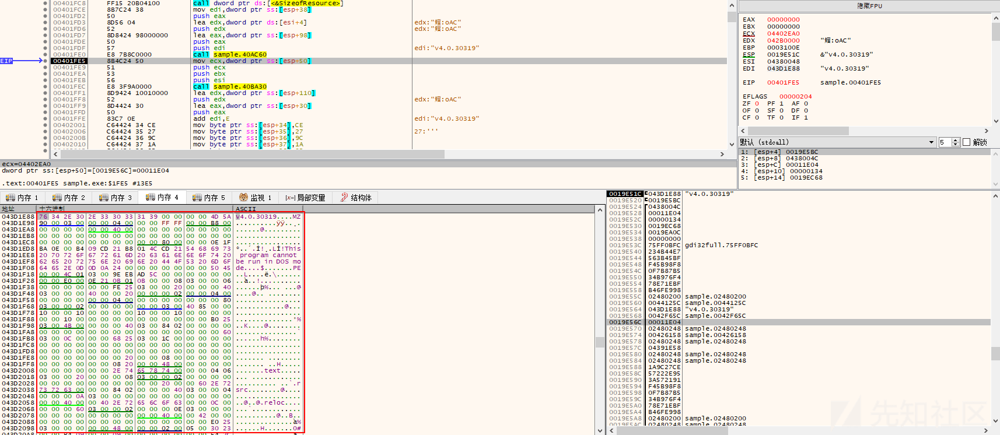](https://xzfile.aliyuncs.com/media/upload/picture/20240320193212-7eff675e-e6ad-1.png)  
25\. 使用 CLR 非托管接口调用 payload 恶意代码，如下所示：  
[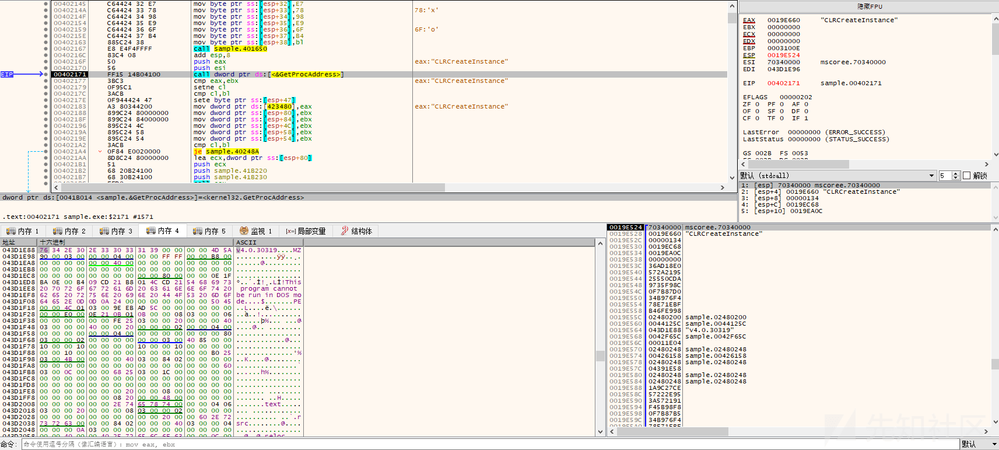](https://xzfile.aliyuncs.com/media/upload/picture/20240320193227-87f21b7c-e6ad-1.png)  
26\. 调用 payload 的恶意类代码，如下所示：  
[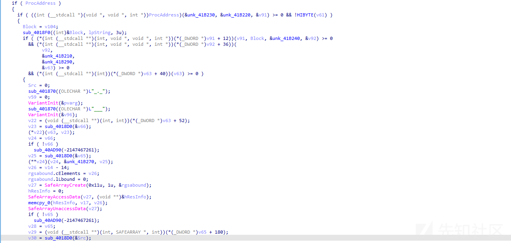](https://xzfile.aliyuncs.com/media/upload/picture/20240320193243-90ea11f8-e6ad-1.png)  
27.payload 的恶意类代码，如下所示：  
[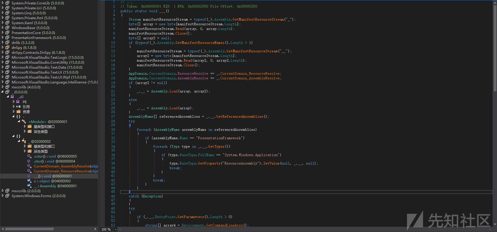](https://xzfile.aliyuncs.com/media/upload/picture/20240320193258-9a06388e-e6ad-1.png)  
28\. 恶意类代码加载程序中的资源数据，资源数据，如下所示：  
[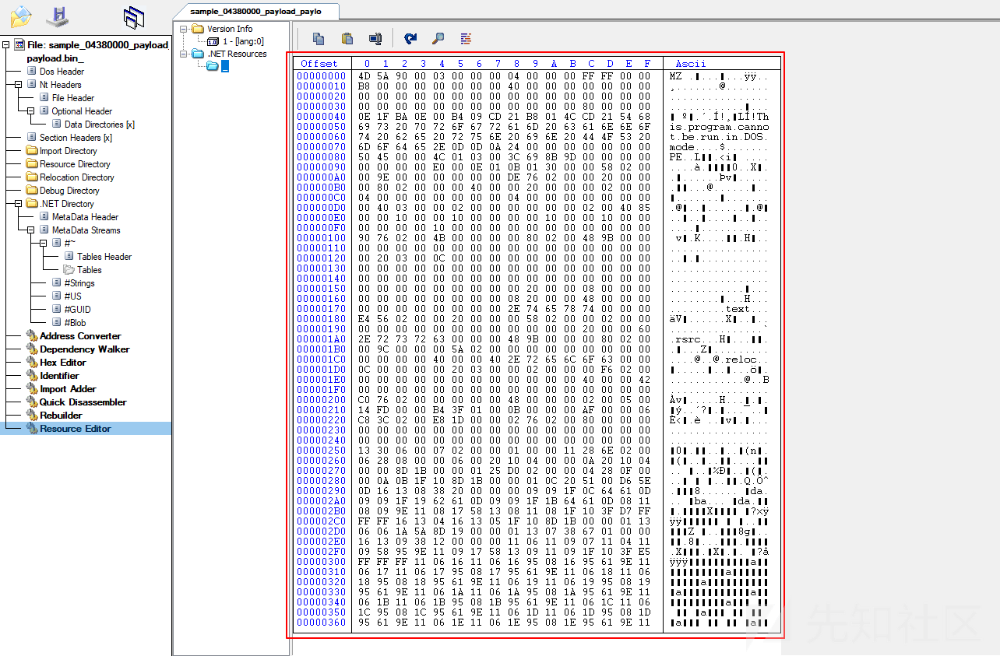](https://xzfile.aliyuncs.com/media/upload/picture/20240320193314-a36924f4-e6ad-1.png)  
29\. 该资源数据包含的恶意 payload 为 NET 语言编写并使用.NET Reactor 加壳，如下所示：  
[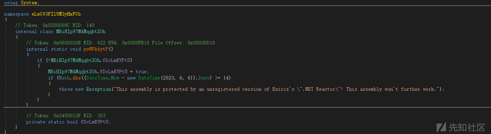](https://xzfile.aliyuncs.com/media/upload/picture/20240320193331-ad872b8e-e6ad-1.png)  
30\. 脱壳之后，动态调试，解密出 payload 相关数据，如下所示：  
[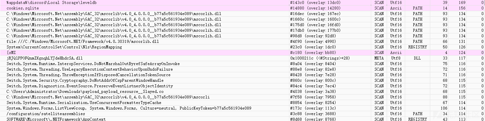](https://xzfile.aliyuncs.com/media/upload/picture/20240320193352-ba3bf67a-e6ad-1.png)  
31\. 通过分析 payload 为 RedLine Stealer 窃密木马，会枚举 Chrome 和 Opera GX Stable 的登录数据、Web 数据、Cookies 文件夹，如下所示：  
[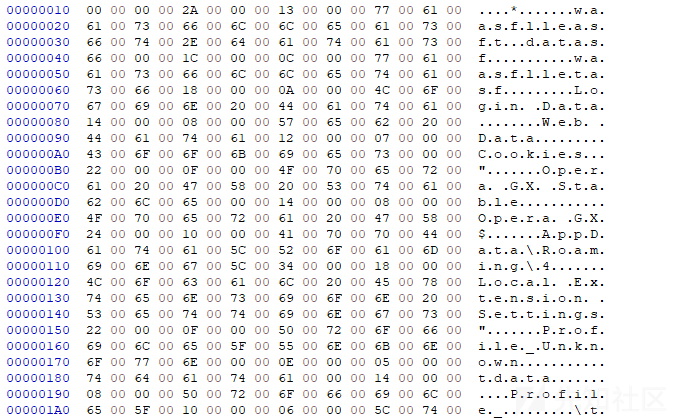](https://xzfile.aliyuncs.com/media/upload/picture/20240320193422-cbf6ee6a-e6ad-1.png)  
32\. 搜索以下加密货币相关 Google Chrome、Microsoft Edge 和 Mozilla Firefox 扩展是否存在，解密出硬编码的搜索的加密钱包扩展列表，如下所示：  
[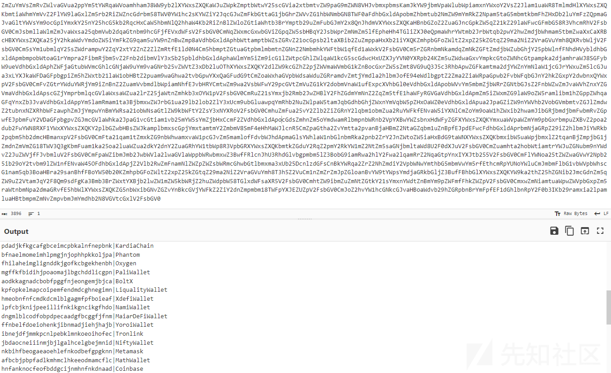](https://xzfile.aliyuncs.com/media/upload/picture/20240320193458-e189fb64-e6ad-1.png)  
加密钱包列表，如下：  
ffnbelfdoeiohenkjibnmadjiehjhajb|YoroiWallet  
ibnejdfjmmkpcnlpebklmnkoeoihofec|Tronlink  
jbdaocneiiinmjbjlgalhcelgbejmnid|NiftyWallet  
nkbihfbeogaeaoehlefnkodbefgpgknn|Metamask  
afbcbjpbpfadlkmhmclhkeeodmamcflc|MathWallet  
hnfanknocfeofbddgcijnmhnfnkdnaad|Coinbase  
fhbohimaelbohpjbbldcngcnapndodjp|BinanceChain  
odbfpeeihdkbihmopkbjmoonfanlbfcl|BraveWallet  
hpglfhgfnhbgpjdenjgmdgoeiappafln|GuardaWallet  
blnieiiffboillknjnepogjhkgnoapac|EqualWallet  
cjelfplplebdjjenllpjcblmjkfcffne|JaxxxLiberty  
fihkakfobkmkjojpchpfgcmhfjnmnfpi|BitAppWallet  
kncchdigobghenbbaddojjnnaogfppfj|iWallet  
amkmjjmmflddogmhpjloimipbofnfjih|Wombat  
fhilaheimglignddkjgofkcbgekhenbh|AtomicWallet  
nlbmnnijcnlegkjjpcfjclmcfggfefdm|MewCx  
nanjmdknhkinifnkgdcggcfnhdaammmj|GuildWallet  
nkddgncdjgjfcddamfgcmfnlhccnimig|SaturnWallet  
fnjhmkhhmkbjkkabndcnnogagogbneec|RoninWallet  
aiifbnbfobpmeekipheeijimdpnlpgpp|TerraStation  
fnnegphlobjdpkhecapkijjdkgcjhkib|HarmonyWallet  
aeachknmefphepccionboohckonoeemg|Coin98Wallet  
cgeeodpfagjceefieflmdfphplkenlfk|TonCrystal  
pdadjkfkgcafgbceimcpbkalnfnepbnk|KardiaChain  
bfnaelmomeimhlpmgjnjophhpkkoljpa|Phantom  
fhilaheimglignddkjgofkcbgekhenbh|Oxygen  
mgffkfbidihjpoaomajlbgchddlicgpn|PaliWallet  
aodkkagnadcbobfpggfnjeongemjbjca|BoltX  
kpfopkelmapcoipemfendmdcghnegimn|LiqualityWallet  
hmeobnfnfcmdkdcmlblgagmfpfboieaf|XdefiWallet  
lpfcbjknijpeeillifnkikgncikgfhdo|NamiWallet  
dngmlblcodfobpdpecaadgfbcggfjfnm|MaiarDeFiWallet  
ffnbelfdoeiohenkjibnmadjiehjhajb|YoroiWallet  
ibnejdfjmmkpcnlpebklmnkoeoihofec|Tronlink  
jbdaocneiiinmjbjlgalhcelgbejmnid|NiftyWallet  
nkbihfbeogaeaoehlefnkodbefgpgknn|Metamask  
afbcbjpbpfadlkmhmclhkeeodmamcflc|MathWallet  
hnfanknocfeofbddgcijnmhnfnkdnaad|Coinbase  
fhbohimaelbohpjbbldcngcnapndodjp|BinanceChain  
odbfpeeihdkbihmopkbjmoonfanlbfcl|BraveWallet  
hpglfhgfnhbgpjdenjgmdgoeiappafln|GuardaWallet  
blnieiiffboillknjnepogjhkgnoapac|EqualWallet  
cjelfplplebdjjenllpjcblmjkfcffne|JaxxxLiberty  
fihkakfobkmkjojpchpfgcmhfjnmnfpi|BitAppWallet  
kncchdigobghenbbaddojjnnaogfppfj|iWallet  
amkmjjmmflddogmhpjloimipbofnfjih|Wombat  
fhilaheimglignddkjgofkcbgekhenbh|AtomicWallet  
nlbmnnijcnlegkjjpcfjclmcfggfefdm|MewCx  
nanjmdknhkinifnkgdcggcfnhdaammmj|GuildWallet  
nkddgncdjgjfcddamfgcmfnlhccnimig|SaturnWallet  
fnjhmkhhmkbjkkabndcnnogagogbneec|RoninWallet  
aiifbnbfobpmeekipheeijimdpnlpgpp|TerraStation  
fnnegphlobjdpkhecapkijjdkgcjhkib|HarmonyWallet  
aeachknmefphepccionboohckonoeemg|Coin98Wallet  
cgeeodpfagjceefieflmdfphplkenlfk|TonCrystal  
pdadjkfkgcafgbceimcpbkalnfnepbnk|KardiaChain  
bfnaelmomeimhlpmgjnjophhpkkoljpa|Phantom  
fhilaheimglignddkjgofkcbgekhenbh|Oxygen  
mgffkfbidihjpoaomajlbgchddlicgpn|PaliWallet  
aodkkagnadcbobfpggfnjeongemjbjca|BoltX  
kpfopkelmapcoipemfendmdcghnegimn|LiqualityWallet  
hmeobnfnfcmdkdcmlblgagmfpfboieaf|XdefiWallet  
lpfcbjknijpeeillifnkikgncikgfhdo|NamiWallet  
dngmlblcodfobpdpecaadgfbcggfjfnm|MaiarDeFiWallet  
bhghoamapcdpbohphigoooaddinpkbai|Authenticator  
ookjlbkiijinhpmnjffcofjonbfbgaoc|TempleWallet  
到此该面试题样本基本就分析完毕了，可以判定该样本为 RedLine Stealer 窃密木马。

# 总结结论

说点题外话，做安全研究一定要多动手，不管是恶意软件研究，还是做其他方向的安全技术研究，一定要多动手，看别人的报告或分析，只能学到很少的东西，多动手是学习安全的唯一方法，当你真正动手分析和调试一个样本或一个漏洞的时候，你才能学到真正的安全技术，纸上得来终觉浅，绝知此事要躬行。

样本 HASH  
f22e976a3cc892e7c21cf6e222d0cf2e0e6c0dc0f7b882c7ac8d365a1e3b4cd1  
有兴趣的可以自己对照着文章调试分析一遍，应该能学到一些分析技术。
