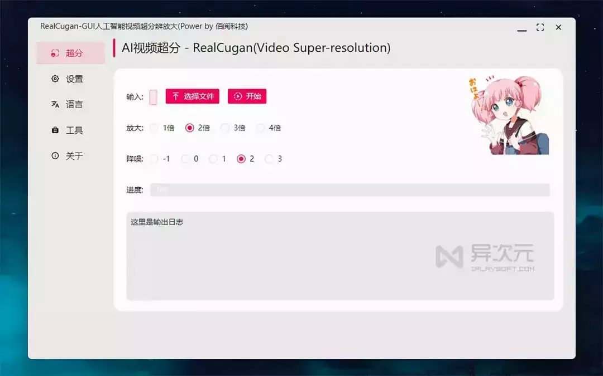
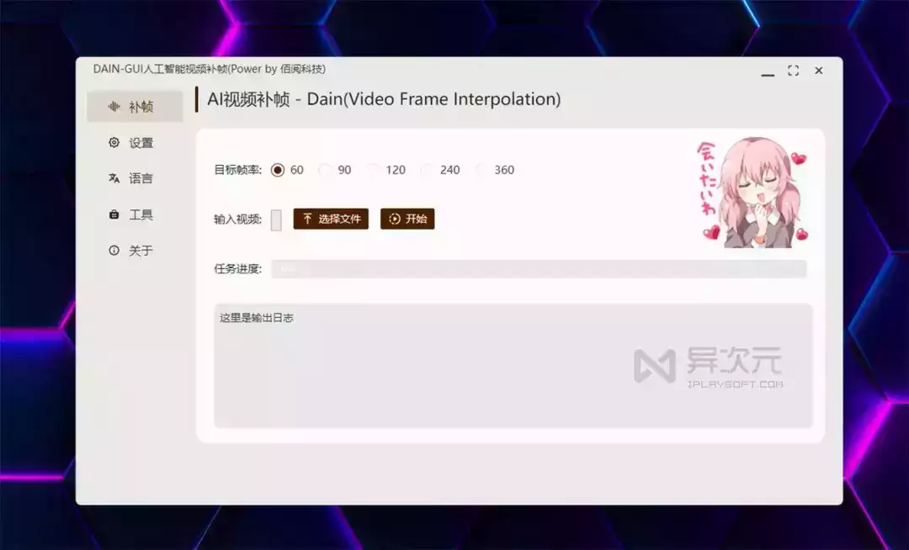
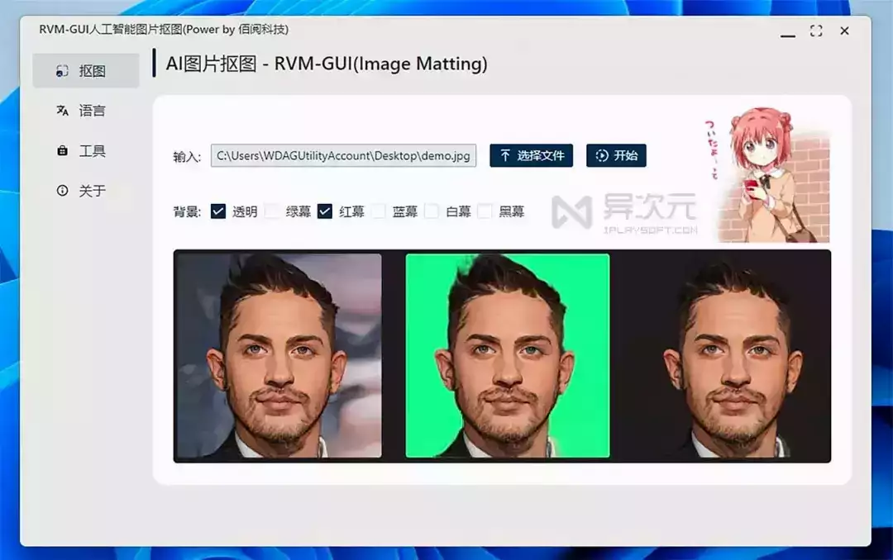
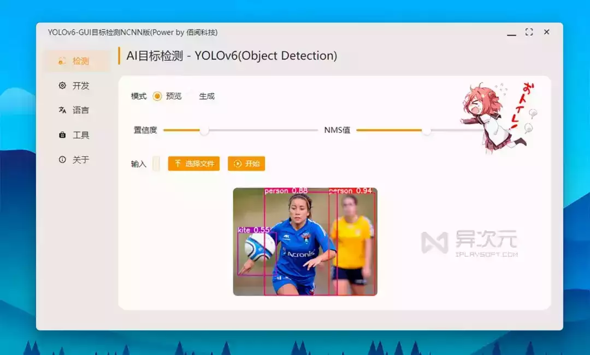

# 免费的“AI 黑科技”工具箱！Paper2GUI 十几款上手即用的人工智能软件合集

**Paper2GUI** 是一个免费的**多功能 AI 工具箱**开源项目，它收录了超过 19 个“黑科技”般的人工智能算法模型，并制作了直观的 GUI 图形界面，将原本“技术男专用”的代码，摇身一变成简单易用的「桌面应用」，让所有普通用户都能轻松无门槛地享受、使用这些高端的 AI 功能。

如果说，我的 ABC 软件工具箱、[一个木函](http://mp.weixin.qq.com/s?__biz=MjM5NjExODEyMA==&mid=2247486590&idx=1&sn=66f2419844d4fa06d2afa252bfaa0fe6&chksm=a6ef67799198ee6fa03f1e3c54ea1e996a0609eeaee5f174889e475a90c02d96bd11567bed9b&scene=21#wechat_redirect)、[万彩办公大师](http://mp.weixin.qq.com/s?__biz=MjM5NjExODEyMA==&mid=2247483892&idx=1&sn=7a4ceb1765af740cba13534d7d9fc308&chksm=a6ef6af39198e3e587a0bfe38b2ed148534c95995220fbb73bfd333485db3431bc7614744355&scene=21#wechat_redirect) 这类都是常用办公软件百宝箱，那么 Paper2GUI 就是收录各种前沿**黑科技 AI 软件的智能工具箱**了。它不仅免费开源，而且绿色免安装，内容涵盖了语音合成、视频补帧、视频高清化、图片风格转换、OCR 识别等领域。

由于这类开源 AI 模型算法的入门使用门槛较高，以至于不少投机者将它们“打包”成付费软件去赚钱，有些还卖得特别贵。而 **Paper2GUI** 则非常良心，它为这些 AI 算法打造了简单易上手的 GUI 图形界面，但依然保持开源发布，让你能轻松用上这些高大上的工具，还完全免费！！相当于帮你白白省下很多钱了。

，时长 00:50

本系列的软件主要支持 Windows 系统，不过 Mac、Linux 平台也会陆续跟进，作者表示未来还将会适配安卓 Android 和苹果 iOS 设备，另外还有小程序等等。那下面，我们一起来看看 Paper2GUI (**佰阅 AI 工具箱**) 里都包含有哪些厉害的工具吧。

### 视频超分辨放大 / 图片高清放大

视频超分辨率 (超采样) 技术源于图像智能无损放大技术，目前集成的所有工具都支持单张图片或单个视频进行超分辨率放大，比如将 720p 转换成 4K 高清，让一些原本模糊的视频变得清晰锐利！效果非常厉害！对旧动画、老电影进行“高清翻新”有奇效。

#### 图片/视频超分辨率提升效果演示：  

  

，时长 01:27

视频超分辨率的算法目前百花齐放，不过目前主要在动漫领域表现较为出色，其中 RealESGAN、RealCugan 等算法已经明显优于之前比较流行的 Waifu2x。

由于视频超采样算法非常吃 GPU 性能，因此建议使用性能强劲的独立显卡，可以有效提高计算速度。动漫类推荐使用 RealESGAN 或 RealCugan，真实拍摄的照片视频推荐 RealSR。

### AI 视频补帧

如果你是个游戏玩家，可能会比较能理解 30 FPS 帧率跟 60FPS 以上高帧率在「流畅度」方面的区别。帧率越高，每秒显示的画面数就越多，实际效果就会越流畅！视频也是一样，补帧技术可以大幅提升视频的动态流畅度，让原本低帧率的视频补上更多的画面，从而实现丝般顺滑的动态效果，比较适合运动类的视频。

#### 视频补帧效果演示：

左边为原视频，右边补帧后的效果。由于 GIF 图片压缩得比较厉害，左边看起来卡顿有点多，但用来对比补帧后的流畅度还是能一目了然的。

目前收的视频补帧工具有 Rife 和 Dain，其中 Rife 算法速度更快，可自由补帧，插帧的效果让人满意，是目前推荐的主流方案。

### 图像风格化：

人工智能的图像风格化技术可以将一些照片转换成漫画 (手绘头像)、油画、抽象画、甚至是梵高风格、毕加索风格等不同的艺术风格，从而获得另一种不同视觉感受的作品。这类开源算法目前并不多，主要是 AnimeGAN，总体还是比较有趣耐玩的。

#### 转换手绘漫画头像风格效果：

### 智能人像抠图：

我们在工作中常常需要对照片中的人像进行抠图。以往我们需要在 [PhotoShop](http://mp.weixin.qq.com/s?__biz=MjM5NjExODEyMA==&mid=2247489103&idx=3&sn=441f590a8ca75bbc34a496f6bd4a8233&chksm=a6ef7d489198f45e2b552d57d69de4e901aaf12c176b2c4b9adee66d8d0138fbc937550987a2&scene=21#wechat_redirect) 等图片处理软件上手工去操作，非常耗费时间和精力。而借助 AI 人工智能 **RVM** 算法，可以实现超快的一键抠图并且生成透明背景、绿幕等图片。

而且，即便对于手工难以处理的头发丝等部位，AI 也处理得非常好，因此可以轻松实现批量抠图，大幅提高工作效率。

### 视频人像抠图：

除图片外，我们常常还需要给视频中的人像抠图。通过 **MODNet**、**MobileNetV2** 等 AI 智能算法，可以实现无绿幕的自动视频抠图，并能一键生成绿幕！

操作简单，也可以应对比较复杂的实物场景，适合自媒体制作视频使用，能节省大量人力和时间。该系列工具均支持图片和视频抠图。

#### 视频抠图效果演示：

### 人像修复：

AI 人脸图像修复技术 **GFPGAN** 算法，可以将一些老旧的人像照片，智能修复成高清晰度的图片，进行美颜，甚至可以给原本黑白的照片智能上色等。

#### 老照片修复效果对比：

左边为人像照片原图，非常模糊，右边为 GFP-GAN 算法修复的效果，区别非常巨大！而且即便原版是黑白照片，都能为人脸自动上色，非常不错。

### 目标识别检测：

适用范围非常广泛，YOLO v5/v6、YOLOX 等算法可以识别图片中的各种内容，比如：物体检测、口罩检测、车牌检测、车辆检测、苹果质量等级检测等等。

### 智能语音合成：

包含文字转语音工具，适用于自媒体视频配音、讲解、读书、广告等场景。语音合成一直以来是语言、语音、深度学习及人工智能等领域的热门研究方向，现在已发展有多种情绪、呼吸停顿等效果非常接近真人！Paper2GUI 工具箱已集成了来自微软、阿里云、火山的语音合成引擎。

|     |     |     |     |     |
| --- | --- | --- | --- | --- |
| 名称  | Model | Windows | Mac | Linux |
| 微软语音合成 | FastSpeech | √   | √   | √   |
| 抖音火山语音 | Unkonw | √   | √   | √   |
| 阿里云语音合成 | Unkonw | √   | √   | √   |

注意：上面几个语音合成的工具都需要开通对应的 API 服务 (付费)，获得并填入 Key 后才能使用。之前异次元推荐的这一款[「微软智能语音合成助手」](http://mp.weixin.qq.com/s?__biz=MjM5NjExODEyMA==&mid=2247494379&idx=1&sn=048c2013978451bd493bd107c54ea568&chksm=a6ec81ec919b08fa9f98f2387a5ac2cd0334ee812d1e233b4632b8d6c72c47b038c07da24e7b&scene=21#wechat_redirect)则可以完全免费使用。

### 辅助工具：

提供了一些常用的辅助工具，比如视频比对工具等。视频超分、补帧、抠图等经常需要对比效果，因此作者特意开发了这个视频对比辅助工具，可让你居中、水平或垂直比对两个视频。

### 总结：

由于作者本人的开发环境为 Windows 系统，加上很多 AI 功能都需要显卡 GPU 的算力来加速，因此 **Paper2GUI** 的工具都以 Win 平台为主。而 Mac、Linux 仅部分提供，而 Android、iOS 以及小程序等方案只能在未来慢慢完善。

总的来说，Paper2GUI 可以让更多普通用户能轻松接触到这些比较前沿的 AI 技术研究成果！满满的一堆“黑科技”可以供你玩耍，而且还是免费的！可以说是不可多得的工具合集了，感兴趣的同学不妨都去下载玩玩吧。

- - -