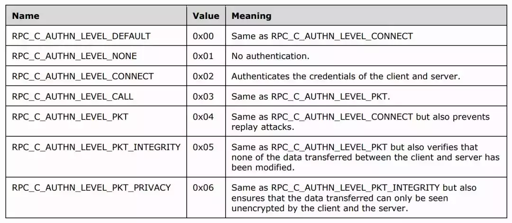
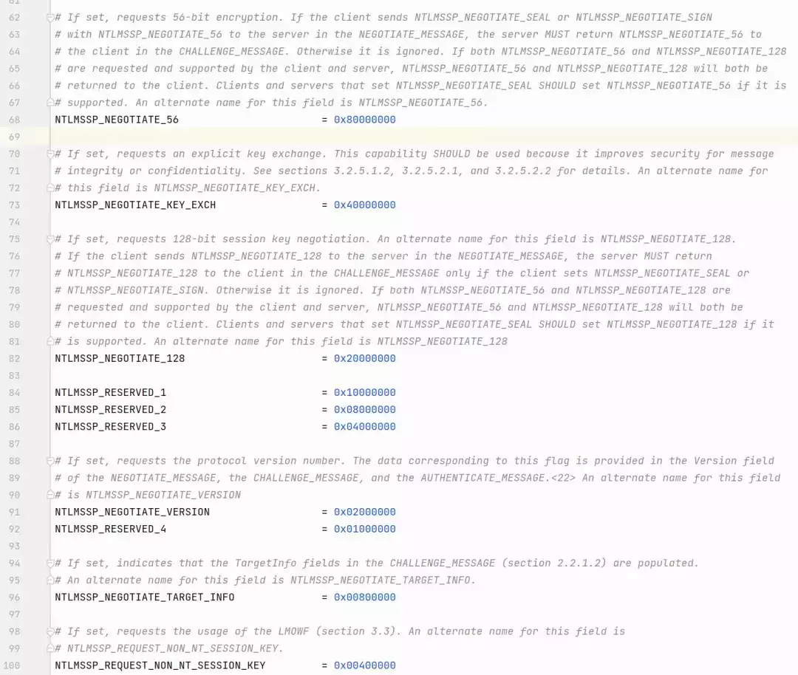
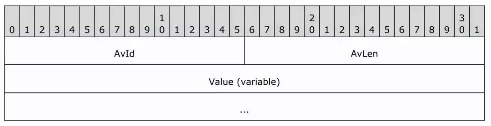
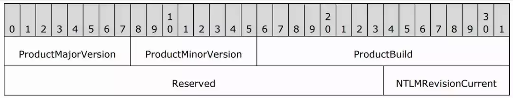
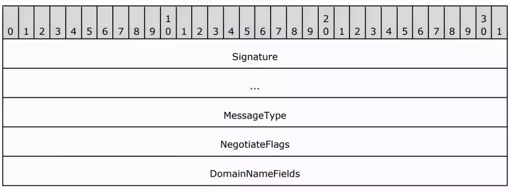
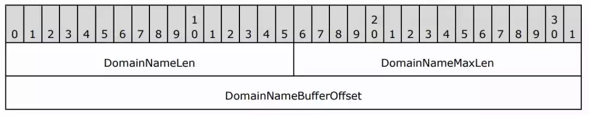
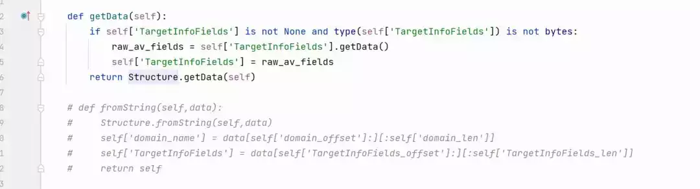

# 内网渗透瑞士军刀-impacket 工具解析（一）

  

  

  

**impacket 工具解析之 NTLM 协议实现**

preface

      impacket 是一系列网络协议的 python 实现，实现包括 IP、TCP、ICMP 等基础的网络协议，更重要的是其实现了大量的 Windows 通信协议，包含 Windows 认证使用的 ntlm 和 kerberos 协议、用于活动目录数据存储的 ldap 及大量的 msrpc 协议。利用 impacket 既可以通过一系列的 python 类和方法构造协议对应的数据包，也可以将服务器返回的原始数据包“反序列化”为对应的 python 类，通过 Impacket，开发人员可以编写 Python 脚本来构建自定义的网络安全工具，进行网络协议分析、渗透测试、漏洞利用等任务。它在渗透测试、红队行动和网络安全研究中得到了广泛的应用。

    **impacket 工具解析系列文章将以协议为切入点，针对不同的协议实现进行详细解析，由于 impacket 中实现的协议众多，我们将着重于内网渗透中常用的 ntlm、kerberos、ldap、smb、rpc 等协议分析，通过代码解读及示例帮助大家了解这款工具的原理和使用。作为系列文章的第一篇，我们首先介绍 ntlm 协议的实现。**

    我们使用 impacket0.11.0 版本为例，impacket 中对 ntlm 的实现在 ntlm.py 一个文件中，文件位于 impacket-ntlm.py

  

01

  

  

NTLM 常量

**NTLM 常量**

 USE\_NTLMv2


      在 35-36 行，作者在 ntlm 中首先定义了两个全局变量 USE\_NTLMv2、TEST\_CASE 分别代表使用 NTLMv2 和测试用例，在大部分的网络环境中 NTLMv1 已经非常少见了，所以这里默认是使用 NTLMv1。

  

 **Auth Level**


      55-60 行定义了 6 个常量，分别表示 6 个认证级别在 dcerpc 中会使用到这些参数，但是在 ntlm 并没有使用。



  

NEGOTIATE FLAGS



        62-191 行是 ntlm 消息中 FLAG 字段的各个比特位的含义，NEGOTIATE FLAGS 是 ntlm 消息中的一个字段，长度固定为 4 字节（32bit）每个字段及其含义如下

  

|     |     |     |
| --- | --- | --- |
| **标识位** | **名称** | **描述** |
| 0x00000001 | Negotiate Unicode | 表示支持在安全缓冲区数据中使用 Unicode 字符串。 |
| 0x00000002 | Negotiate OEM | 表示支持在安全缓冲区数据中使用 OEM 字符串。 |
| 0x00000004 | Request Target | 要求服务端在 Type2 消息中包含目标服务器的域名 |
| 0x00000008 | *unknown* | *保留字段（未使用）* |
| 0x00000010 | Negotiate Sign | 指定客户端和服务器之间经过身份验证的通信应携带数字签名（消息完整性） |
| 0x00000020 | Negotiate Seal | 指定客户端和服务器之间经过身份验证的通信应加密（消息机密性）。 |
| 0x00000040 | Negotiate Datagram Style | 表明正在使用数据报验证。 |
| 0x00000080 | Negotiate Lan Manager Key | 指示将 lm Session Key 应用于签名和密封经过身份验证的通信。 |
| 0x00000100 | Negotiate Netware | *保留字段（未使用）* |
| 0x00000200 | Negotiate NTLM | 指示正在使用 NTLM 身份验证。 |
| 0x00000400 | *unknown* | *保留字段（未使用）* |
| 0x00000800 | Negotiate Anonymous | 由客户端在 Type 3 消息中发送，表明匿名上下文已建立。这也会影响响应字段（如“匿名响应”部分中详述）。 |
| 0x00001000 | Negotiate Domain Supplied | 由客户端在 Type 1 消息中发送，指示消息中包含客户端所在的域名，服务器使用它来确定客户端是否有资格进行本地身份验证。 |
| 0x00002000 | Negotiate Workstation Supplied | 由客户端在 Type 1 消息中发送，指示消息中包含客户端工作站的名称，服务器使用它来确定客户端是否有资格进行本地身份验证。 |
| 0x00004000 | Negotiate Local Call | *保留字段（未使用）* |
| 0x00008000 | Negotiate Always Sign | 设置此字段后，无论 Negotiate Sign 或 Negotiate Seal 是否设置都会生成 session key |
| 0x00010000 | Target Type Domain | 表示在 Type 2 消息中 Target 字段的类型是域名 |
| 0x00020000 | Target Type Server | 表示在 Type 2 消息中 Target 字段的类型是服务器名 |
| 0x00040000 | Target Type Share | *保留字段（未使用）* |
| 0x00080000 | Negotiate NTLM2 Key | 指示应使用 NTLM2 签名和密封方案来保护经过身份验证的通信。请注意，这是指特定的会话安全方案，与 NTLMv2 身份验证的使用无关。 |
| 0x00100000 | Request Init Response | *保留字段（未使用）* |
| 0x00200000 | Request Accept Response | *保留字段（未使用）* |
| 0x00400000 | Request Non-NT Session Key | *保留字段（未使用）* |
| 0x00800000 | Negotiate Target Info | 由服务器在 Type 2 消息中发送，以指示它在消息中包含目 TargetInfo 字段，TargetInfo 用于计算 NTLMv2 响应。 |
| 0x01000000 | *unknown* | *保留字段（未使用）* |
| 0x02000000 | *unknown* | *保留字段（未使用）* |
| 0x04000000 | *unknown* | *保留字段（未使用）* |
| 0x08000000 | *unknown* | *保留字段（未使用）* |
| 0x10000000 | *unknown* | *保留字段（未使用）* |
| 0x20000000 | Negotiate 128 | 表示支持 128 位加密。 |
| 0x40000000 | Negotiate Key Exchange | 指示客户端将在 Type 3 消息的“session key”字段中提供加密的主密钥。 |
| 0x80000000 | Negotiate 56 | 表示支持 56 位加密。 |

  

  

02

  

  

  NTLM 消息结构

 NTLM 消息结构

AVPAIRS

      AVPAIRS 是一个在 Challenge 和 ChallengeResponse 都使用到的结构，由一系列的 AV\_PAIR 组成，并且以 AvId 为 MsvAvEOL 的 AV\_PAIR 结构结束，AV\_PAIR 的结构如下。



      其中 AvId 表示 AV\_PAIR 的类型，AvLen 表示值的长度，紧跟着的是值的内容，在 impacket 中定义了一个类 AV\_PAIRS 来表示这个结构

```plain
class AV_PAIRS:
    def __init__(self, data = None):
        self.fields = {}
        if data is not None:
            self.fromString(data)

    def __setitem__(self,key,value):
        self.fields[key] = (len(value),value)

    def __getitem__(self, key):
        if key in self.fields:
           return self.fields[key]
        return None

    def __delitem__(self, key):
        del self.fields[key]

    def __len__(self):
        return len(self.getData())

    def __str__(self):
        return len(self.getData())

    def fromString(self, data):
        tInfo = data
        fType = 0xff
        while fType is not NTLMSSP_AV_EOL:
            fType = struct.unpack('<H',tInfo[:struct.calcsize('<H')])[0]
            tInfo = tInfo[struct.calcsize('<H'):]
            length = struct.unpack('<H',tInfo[:struct.calcsize('<H')])[0]
            tInfo = tInfo[struct.calcsize('<H'):]
            content = tInfo[:length]
            self.fields[fType]=(length,content)
            tInfo = tInfo[length:]

    def dump(self):
        for i in list(self.fields.keys()):
            print("%s: {%r}" % (i,self[i]))

    def getData(self):
        if NTLMSSP_AV_EOL in self.fields:
            del self.fields[NTLMSSP_AV_EOL]
        ans = b''
        for i in list(self.fields.keys()):
            ans+= struct.pack('<HH', i, self[i][0])
            ans+= self[i][1]

        # end with a NTLMSSP_AV_EOL
        ans += struct.pack('<HH', NTLMSSP_AV_EOL, 0)

        return ans
```

  

    AV\_PAIRS 类中使用了字典 fields 来存储 AV\_PAIR，getData 和 fromString 分别用于序列化和反序列化 AV\_PAIRS 数据类型。

  

Version

    impacket 中 ntlm 定义的第二个类是 Version，这个类的主要作用是用于反序列化 NTLM 消息中的 version 字段，我们可以看一下协议中对 version 字段的定义

  



    前 8 个字节表示的是操作系统信息，后 1 字节表示 NTLMSSP 的版本，固定为常量 NTLMSSP\_REVISION\_W2K3(0x0F)，再来看一下 impacket 里的表示方式

  

```plain
class VERSION(Structure):
    NTLMSSP_REVISION_W2K3 = 0x0F

    structure = (
        ('ProductMajorVersion', '<B=0'),
        ('ProductMinorVersion', '<B=0'),
        ('ProductBuild', '<H=0'),
        ('Reserved', '3s=""'),
        ('NTLMRevisionCurrent', '<B=self.NTLMSSP_REVISION_W2K3'),
    )
```

    可以看到，VERSION 类继承了 Structure 类，Structure 类是 impacket 中一个非常核心的类，impacket 中基本上所有的数据结构都是通过继承该类来实现，在 Structure 类的说明文档中可以看到这个类的使用方法。

  

```plain
sublcasses can define commonHdr and/or structure.
    each of them is an tuple of either two: (fieldName, format) or three: (fieldName, ':', class) fields.
    [it can't be a dictionary, because order is important]

    where format specifies how the data in the field will be converted to/from bytes (string)
    class is the class to use when unpacking ':' fields.

    each field can only contain one value (or an array of values for *)
       i.e. struct.pack('Hl',1,2) is valid, but format specifier 'Hl' is not (you must use 2 dfferent fields)

    format specifiers:
      specifiers from module pack can be used with the same format
      see struct.__doc__ (pack/unpack is finally called)
        x       [padding byte]
        c       [character]
        b       [signed byte]
        B       [unsigned byte]
        h       [signed short]
        H       [unsigned short]
        l       [signed long]
        L       [unsigned long]
        i       [signed integer]
        I       [unsigned integer]
        q       [signed long long (quad)]
        Q       [unsigned long long (quad)]
        s       [string (array of chars), must be preceded with length in format specifier, padded with zeros]
        p       [pascal string (includes byte count), must be preceded with length in format specifier, padded with zeros]
        f       [float]
        d       [double]
        =       [native byte ordering, size and alignment]
        @       [native byte ordering, standard size and alignment]
        !       [network byte ordering]
        <       [little endian]
        >       [big endian]

      usual printf like specifiers can be used (if started with %)
      [not recommended, there is no way to unpack this]

        %08x    will output an 8 bytes hex
        %s      will output a string
        %s\\x00  will output a NUL terminated string
        %d%d    will output 2 decimal digits (against the very same specification of Structure)
        ...

      some additional format specifiers:
        :       just copy the bytes from the field into the output string (input may be string, other structure, or anything responding to __str__()) (for unpacking, all what's left is returned)
        z       same as :, but adds a NUL byte at the end (asciiz) (for unpacking the first NUL byte is used as terminator)  [asciiz string]
        u       same as z, but adds two NUL bytes at the end (after padding to an even size with NULs). (same for unpacking) [unicode string]
        w       DCE-RPC/NDR string (it's a macro for [  '<L=(len(field)+1)/2','"\\x00\\x00\\x00\\x00','<L=(len(field)+1)/2',':' ]
        ?-field length of field named 'field', formatted as specified with ? ('?' may be '!H' for example). The input value overrides the real length
        ?1*?2   array of elements. Each formatted as '?2', the number of elements in the array is stored as specified by '?1' (?1 is optional, or can also be a constant (number), for unpacking)
        'xxxx   literal xxxx (field's value doesn't change the output. quotes must not be closed or escaped)
        "xxxx   literal xxxx (field's value doesn't change the output. quotes must not be closed or escaped)
        _       will not pack the field. Accepts a third argument, which is an unpack code. See _Test_UnpackCode for an example
        ?=packcode  will evaluate packcode in the context of the structure, and pack the result as specified by ?. Unpacking is made plain
        ?&fieldname "Address of field fieldname".
                    For packing it will simply pack the id() of fieldname. Or use 0 if fieldname doesn't exists.
                    For unpacking, it's used to know weather fieldname has to be unpacked or not, i.e. by adding a & field you turn another field (fieldname) in an optional field.
```

  

    从文档可以看到，structure 字段为一个含有 2 个或者 3 个元素的元组列表，用于定义各个字段的名称以及结构，比如 ('ProductMajorVersion', '<B=0') 这一个字段表示，字段名为 ProductMajorVersion，格式为<B=0，从文档可以看到？=packcode 这种格式，首先会计算出 packcode 的值，然后再按照？指定的方式进行打包也就是占用一个字节小端序的方式打包值 0，对于 python 中的打包及解包不熟悉的可以参考一下 python 内置的 struct 包的使用方法，所以这里表示 ProductMajorVersion 字段占用 1 个字节，默认值为 0，这是一个反序列化的过程。序列化则比较简单，就是按照<B 来计算占用的字节数，并对对应的字节进行解包，然后赋值给 ProductMajorVersion 字段。

  

Negotiate

    Negotiate 是 ntlm 认证使用的 3 大数据包结构之一，通常被称作 Type1。消息结构如下




    这里出现了一个两个新字段格式 DomainNameFields 和 WorkstationFields，我们可以看一下这两个字段的定义



    DomainNameLen 表示字段的长度，DomainNameMaxLen 和 DomainNameLen 相同，DomainNameBufferOffset 表示这个字段的值偏移，通过 DomainNameBufferOffset 和 DomainNameLen 也就可以存储字段的值内容。来看一下 impacket 的类设计。

```plain
class NTLMAuthNegotiate(Structure):

    structure = (
        ('','"NTLMSSP\x00'),
        ('message_type','<L=1'),
        ('flags','<L'),
        ('domain_len','<H-domain_name'),
        ('domain_max_len','<H-domain_name'),
        ('domain_offset','<L=0'),
        ('host_len','<H-host_name'),
        ('host_maxlen','<H-host_name'),
        ('host_offset','<L=0'),
        ('os_version',':'),
        ('host_name',':'),
        ('domain_name',':'))

    def __init__(self):
        Structure.__init__(self)
        self['flags']= (
               NTLMSSP_NEGOTIATE_128     |
               NTLMSSP_NEGOTIATE_KEY_EXCH|
               # NTLMSSP_LM_KEY      |
               NTLMSSP_NEGOTIATE_NTLM    |
               NTLMSSP_NEGOTIATE_UNICODE     |
               # NTLMSSP_ALWAYS_SIGN |
               NTLMSSP_NEGOTIATE_SIGN        |
               NTLMSSP_NEGOTIATE_SEAL        |
               # NTLMSSP_TARGET      |
               0)
        self['host_name']=''
        self['domain_name']=''
        self['os_version']= ''
        self._workstation = ''

    def setWorkstation(self, workstation):
        self._workstation = workstation

    def getWorkstation(self):
        return self._workstation

    def __hasNegotiateVersion(self):
        return (self['flags'] & NTLMSSP_NEGOTIATE_VERSION) == NTLMSSP_NEGOTIATE_VERSION

    def getData(self):
        if len(self.fields['host_name']) > 0:
            self['flags'] |= NTLMSSP_NEGOTIATE_OEM_WORKSTATION_SUPPLIED
        if len(self.fields['domain_name']) > 0:
            self['flags'] |= NTLMSSP_NEGOTIATE_OEM_DOMAIN_SUPPLIED
        version_len = len(self.fields['os_version'])
        if version_len > 0:
            self['flags'] |= NTLMSSP_NEGOTIATE_VERSION
        elif self.__hasNegotiateVersion():
            raise Exception('Must provide the os_version field if the NTLMSSP_NEGOTIATE_VERSION flag is set')
        if (self['flags'] & NTLMSSP_NEGOTIATE_OEM_WORKSTATION_SUPPLIED) == NTLMSSP_NEGOTIATE_OEM_WORKSTATION_SUPPLIED:
            self['host_offset']=32 + version_len
        if (self['flags'] & NTLMSSP_NEGOTIATE_OEM_DOMAIN_SUPPLIED) == NTLMSSP_NEGOTIATE_OEM_DOMAIN_SUPPLIED:
            self['domain_offset']=32+len(self['host_name']) + version_len
        return Structure.getData(self)

    def fromString(self,data):
        Structure.fromString(self,data)

        domain_offset = self['domain_offset']
        domain_end    = self['domain_len'] + domain_offset
        self['domain_name'] = data[ domain_offset : domain_end ]

        host_offset = self['host_offset']
        host_end    = self['host_len'] + host_offset
        self['host_name'] = data[ host_offset : host_end ]

        if len(data) >= 36 and self.__hasNegotiateVersion():
            self['os_version'] = VERSION(data[32:])
        else:
            self['os_version'] = ''
```

    这里也出现了一种针对 Field 字段的表示方式？-field，表示该字段打包 field 的长度，在这个类里面还重写了 Structure 类的 fromString 方法，fromString 方法是用于反序列也就是解包的方法，可以通过一个简单的实验来测试一下反序列化。

```plain
from impacket.ntlm import NTLMAuthNegotiate

if __name__ == '__main__':
    nego_data = bytes.fromhex('4e544c4d5353500001000000978208e2000000000000000000000000000000000a00614a0000000f')
    nego = NTLMAuthNegotiate()
    nego.fromString(nego_data)
    nego.dump()
```

  

结果如下

```plain
NTLMAuthNegotiate
: {'NTLMSSP\x00'}
message_type: {1}
flags: {3792208535}
domain_len: {0}
domain_max_len: {0}
domain_offset: {0}
host_len: {0}
host_maxlen: {0}
host_offset: {0}

os_version:{
    ProductMajorVersion: {10}
    ProductMinorVersion: {0}
    ProductBuild: {19041}
    Reserved: {b'\x00\x00\x00'}
    NTLMRevisionCurrent: {15}
}
host_name: {b''}
domain_name: {b''}
```

  

Challenge

```plain
class NTLMAuthChallenge(Structure):

    structure = (
        ('','"NTLMSSP\x00'),
        ('message_type','<L=2'),
        ('domain_len','<H-domain_name'),
        ('domain_max_len','<H-domain_name'),
        ('domain_offset','<L=40'),
        ('flags','<L=0'),
        ('challenge','8s'),
        ('reserved','8s=""'),
        ('TargetInfoFields_len','<H-TargetInfoFields'),
        ('TargetInfoFields_max_len','<H-TargetInfoFields'),
        ('TargetInfoFields_offset','<L'),
        ('VersionLen','_-Version','self.checkVersion(self["flags"])'),
        ('Version',':'),
        ('domain_name',':'),
        ('TargetInfoFields',':'))

    @staticmethod
    def checkVersion(flags):
        if flags is not None:
           if flags & NTLMSSP_NEGOTIATE_VERSION == 0:
              return 0
        return 8

    def getData(self):
        if self['TargetInfoFields'] is not None and type(self['TargetInfoFields']) is not bytes:
            raw_av_fields = self['TargetInfoFields'].getData()
            self['TargetInfoFields'] = raw_av_fields
        return Structure.getData(self)

    def fromString(self,data):
        Structure.fromString(self,data)
        self['domain_name'] = data[self['domain_offset']:][:self['domain_len']]
        self['TargetInfoFields'] = data[self['TargetInfoFields_offset']:][:self['TargetInfoFields_len']]
        return self
```

  

    Challenge 消息也叫 Type2，在 Type2 的定义中又出现了一个新的字段格式 ('VersionLen','\_-Version','self.checkVersion(self\["flags"\])')，这里表示的含义是 VersionLen 字段为 Version 的长度，在序列化时不会将这个字段加入数据中，并且这个值可以被 self.checkVersion(self\["flags"\]) 计算的结果覆盖，作者重写了 fromString 方法用来反序列化 domain\_name 和 TargetInfoFields 字段，实际上并不需要这一段，在 Structure 的 findLengthFieldFor 实现中就已经对 Field 字段对应的值的判断，也就是说 domain\_name 和 TargetInfoFields 的值在 domain\_field 和 TargetInfo\_Fields 确定的情况下，长度也是确定的。  

  


将这段代码注释也是可以正常序列化的。



示例

```plain
if __name__ == '__main__':
    challenge_data = bytes.fromhex('4e544c4d53535000020000000400040038000000158289e267bf6a81e0c5dcd300000000000000006a006a003c0000000a0063450000000f4a004400020004004a004400010008004400430030003100040010006a0064002e006c006f00630061006c0003001a0044004300300031002e006a0064002e006c006f00630061006c00050010006a0064002e006c006f00630061006c00070008004e3a1907b2dbd90100000000')
    challenge = NTLMAuthChallenge()
    challenge.fromString(nego_data)
    challenge.dump()
```

```plain
NTLMAuthChallenge
: {'NTLMSSP\x00'}
message_type: {2}
domain_len: {4}
domain_max_len: {4}
domain_offset: {56}
flags: {3800662549}
challenge: {b'g\xbfj\x81\xe0\xc5\xdc\xd3'}
reserved: {b'\x00\x00\x00\x00\x00\x00\x00\x00'}
TargetInfoFields_len: {106}
TargetInfoFields_max_len: {106}
TargetInfoFields_offset: {60}
VersionLen: {8}
Version: {b'\n\x00cE\x00\x00\x00\x0f'}
domain_name: {b'J\x00D\x00'}
TargetInfoFields: {b'\x02\x00\x04\x00J\x00D\x00\x01\x00\x08\x00D\x00C\x000\x001\x00\x04\x00\x10\x00j\x00d\x00.\x00l\x00o\x00c\x00a\x00l\x00\x03\x00\x1a\x00D\x00C\x000\x001\x00.\x00j\x00d\x00.\x00l\x00o\x00c\x00a\x00l\x00\x05\x00\x10\x00j\x00d\x00.\x00l\x00o\x00c\x00a\x00l\x00\x07\x00\x08\x00N:\x19\x07\xb2\xdb\xd9\x01\x00\x00\x00\x00'}
```

  

ChallengeResponse

     ChallengeResponse 也就是 Type3，Type3 的字段相对来说要更多一点，其中重要的字段有 lanman，ntlm，session\_key，MIC。

```plain
class NTLMAuthChallengeResponse(Structure):

    structure = (
        ('','"NTLMSSP\x00'),
        ('message_type','<L=3'),
        ('lanman_len','<H-lanman'),
        ('lanman_max_len','<H-lanman'),
        ('lanman_offset','<L'),
        ('ntlm_len','<H-ntlm'),
        ('ntlm_max_len','<H-ntlm'),
        ('ntlm_offset','<L'),
        ('domain_len','<H-domain_name'),
        ('domain_max_len','<H-domain_name'),
        ('domain_offset','<L'),
        ('user_len','<H-user_name'),
        ('user_max_len','<H-user_name'),
        ('user_offset','<L'),
        ('host_len','<H-host_name'),
        ('host_max_len','<H-host_name'),
        ('host_offset','<L'),
        ('session_key_len','<H-session_key'),
        ('session_key_max_len','<H-session_key'),
        ('session_key_offset','<L'),
        ('flags','<L'),
        ('VersionLen','_-Version','self.checkVersion(self["flags"])'),
        ('Version',':=""'),
        ('MICLen','_-MIC','self.checkMIC(self["flags"])'),
        ('MIC',':=""'),
        ('domain_name',':'),
        ('user_name',':'),
        ('host_name',':'),
        ('lanman',':'),
        ('ntlm',':'),
        ('session_key',':'))
        ...
```

  

  lanman，表示的是 LMChallengeResponse，由 lm 计算得到，现代网络环境中这个字段的值基本都是为空。  

    ntlm，表示 NTChallengeResponse，在 ntlm v1 和 v2 中都存在这个字段，计算方式有所不同。

    session\_key，用于使用 ntlm 协议的通信协议加密密钥的协商。

    MIC，用于保证 ChallengeResponse 的消息完整性，防止其被篡改。

  

03

  

  

NTLMSSP

**NTLMSSP**

      除了定义了基本的数据结构，在 ntlm 实现里还存在两个常用的高层函数，由于在 impacket 中 ntlm 基本上是作为客户端，而在 ntlm 认证中客户端需要构造 Type1 和 Type3，所以在这里分别定义了 getNTLMSSPType1 和 getNTLMSSPType3 函数，用于构造数据包。

  

getNTLMSSPType1

      getNTLMSSPType1 用于构造 Type1 数据包，虽然函数接收了 4 个参数，但是 workstation 和 domain 参数并没有使用，主要还是用于协商的 Flag 的初始化。

```plain
def getNTLMSSPType1(workstation='', domain='', signingRequired = False, use_ntlmv2 = USE_NTLMv2):
    # Let's do some encoding checks before moving on. Kind of dirty, but found effective when dealing with
    # international characters.
    import sys
    encoding = sys.getfilesystemencoding()
    if encoding is not None:
        try:
            workstation.encode('utf-16le')
        except:
            workstation = workstation.decode(encoding)
        try:
            domain.encode('utf-16le')
        except:
            domain = domain.decode(encoding)

    # Let's prepare a Type 1 NTLMSSP Message
    auth = NTLMAuthNegotiate()
    # auth['os_version'] = bytes.fromhex('0a00614a0000000f')
    auth['flags']=0
    if signingRequired:
       auth['flags'] = NTLMSSP_NEGOTIATE_KEY_EXCH | NTLMSSP_NEGOTIATE_SIGN | NTLMSSP_NEGOTIATE_ALWAYS_SIGN | \
                       NTLMSSP_NEGOTIATE_SEAL
    if use_ntlmv2:
       auth['flags'] |= NTLMSSP_NEGOTIATE_TARGET_INFO
    auth['flags'] |= NTLMSSP_NEGOTIATE_NTLM | NTLMSSP_NEGOTIATE_EXTENDED_SESSIONSECURITY | NTLMSSP_NEGOTIATE_UNICODE | \
                     NTLMSSP_REQUEST_TARGET |  NTLMSSP_NEGOTIATE_128 | NTLMSSP_NEGOTIATE_56

    # We're not adding workstation / domain fields this time. Normally Windows clients don't add such information but,
    # we will save the workstation name to be used later.
    auth.setWorkstation(workstation)

    return auth
```

  

getNTLMSSPType3

      Type 3 消息是 NTLMSSP 握手过程的最后一步，用于向服务器发送身份验证凭据以进行身份验证，这也是 ntlm 认证最核心的部分。

```plain
def getNTLMSSPType3(type1, type2, user, password, domain, lmhash = '', nthash = '', use_ntlmv2 = USE_NTLMv2):

    # Safety check in case somebody sent password = None.. That's not allowed. Setting it to '' and hope for the best.
    if password is None:
        password = ''

    # Let's do some encoding checks before moving on. Kind of dirty, but found effective when dealing with
    # international characters.
    import sys
    encoding = sys.getfilesystemencoding()
    if encoding is not None:
        try:
            user.encode('utf-16le')
        except:
            user = user.decode(encoding)
        try:
            password.encode('utf-16le')
        except:
            password = password.decode(encoding)
        try:
            domain.encode('utf-16le')
        except:
            domain = user.decode(encoding)

    ntlmChallenge = NTLMAuthChallenge(type2)

    # Let's start with the original flags sent in the type1 message
    responseFlags = type1['flags']
    # responseFlags = 3767042613
    # Token received and parsed. Depending on the authentication
    # method we will create a valid ChallengeResponse
    ntlmChallengeResponse = NTLMAuthChallengeResponse(user, password, ntlmChallenge['challenge'])

    clientChallenge = b("".join([random.choice(string.digits+string.ascii_letters) for _ in range(8)]))

    serverName = ntlmChallenge['TargetInfoFields']

    ntResponse, lmResponse, sessionBaseKey = computeResponse(ntlmChallenge['flags'], ntlmChallenge['challenge'],
                                                         clientChallenge, serverName, domain, user, password,
                                                         lmhash, nthash, use_ntlmv2)
```

  

    由于需要通过 Type2 中的信息来计算 response，可以看到函数以 type1，type2 作为输入参数，在 25 行，利用 type2 来初始化 NTLMAuthChallenge 类，在这个过程会自动进行反序列化，32 和 36 行分别获取了 Type2 的 challenge 和 TargetInfoFields 字段，第 34 行生成了 8 字节的 client challenge，注意这里的 client challenge 是由数字和字母组成，但是正常的 client challenge 基本不可能全部是可见字符，所以这里也可以作为特征来识别 impacket 的 ntlm 实现。第 38 行是最为重要的计算 ntResponse 和 lmResponse 的步骤，很多人可能会将 ntlmv1、ntlmv2、nthash 及 lmhash 等概念搞混淆，我们可以通过 computeResponse 发现 ntlmv1 和 ntlmv2 的基本结构都是也一样的，唯一的区别就在于 ntResponse 和 lmResponse 的计算方式。

  

**computeResponseNTLMv1**  

    computeResponseNTLMv1 用于计算 ntlmv1 中的 ntResponse 和 lmResponse

```plain
def computeResponseNTLMv1(flags, serverChallenge, clientChallenge, serverName, domain, user, password, lmhash='',
                          nthash='', use_ntlmv2=USE_NTLMv2):
    if user == '' and password == '':
        # Special case for anonymous authentication
        lmResponse = ''
        ntResponse = ''
    else:
        lmhash = LMOWFv1(password, lmhash, nthash)
        nthash = NTOWFv1(password, lmhash, nthash)
        if flags & NTLMSSP_NEGOTIATE_LM_KEY:
           ntResponse = ''
           lmResponse = get_ntlmv1_response(lmhash, serverChallenge)
        elif flags & NTLMSSP_NEGOTIATE_EXTENDED_SESSIONSECURITY:
           md5 = hashlib.new('md5')
           chall = (serverChallenge + clientChallenge)
           md5.update(chall)
           ntResponse = ntlmssp_DES_encrypt(nthash, md5.digest()[:8])
           lmResponse = clientChallenge + b'\x00'*16
        else:
           ntResponse = get_ntlmv1_response(nthash,serverChallenge)
           lmResponse = get_ntlmv1_response(lmhash, serverChallenge)

    sessionBaseKey = generateSessionKeyV1(password, lmhash, nthash)
    return ntResponse, lmResponse, sessionBaseKey
```

  

      ntlmv1 计算 ntResponse 和 lmResponse 分为 3 种情况，如果在 Type 中 flag 设置了 NTLMSSP\_NEGOTIATE\_LM\_KEY，那么就只有 lmResponse，lmResponse 由 lmhash 加密 serverChallenge 得到，如果在 Type 中 flag 设置了 NTLMSSP\_NEGOTIATE\_EXTENDED\_SESSIONSECURITY，lmResponse 部分填充 clientChallenge 和 16 个 0，ntResponse 使用 nthash 加密，加密的内容为 serverChallenge + clientChallenge 进行 md5 后的前 8 字节，其他的情况下 ntResponse 和 lmResponse 分别由 nthash 和 lmhash 加密 serverChallenge 得到，可以发现三种情况下计算的到的 ntResponse 和 lmResponse 都是 24 字节。

  

  

**computeResponseNTLMv2**  

      ntlmv2 中 ntResponse 和 lmResponse 的计算发生了比较大的变化，首先是加密 key 不再使用 lmhash，并且没有直接将 nthash 作为 key，而是由 nthash 派生出来的一个 responseKeyNT，加密方式也由 des 变成了 hmac\_md5

```plain
def computeResponseNTLMv2(flags, serverChallenge, clientChallenge, serverName, domain, user, password, lmhash='',
                          nthash='', use_ntlmv2=USE_NTLMv2):

    responseServerVersion = b'\x01'
    hiResponseServerVersion = b'\x01'
    responseKeyNT = NTOWFv2(user, password, domain, nthash)

    av_pairs = AV_PAIRS(serverName)
    # In order to support SPN target name validation, we have to add this to the serverName av_pairs. Otherwise we will
    # get access denied
    # This is set at Local Security Policy -> Local Policies -> Security Options -> Server SPN target name validation
    # level
    if TEST_CASE is False:
        av_pairs[NTLMSSP_AV_TARGET_NAME] = 'cifs/'.encode('utf-16le') + av_pairs[NTLMSSP_AV_HOSTNAME][1]
        if av_pairs[NTLMSSP_AV_TIME] is not None:
           aTime = av_pairs[NTLMSSP_AV_TIME][1]
        else:
           aTime = struct.pack('<q', (116444736000000000 + calendar.timegm(time.gmtime()) * 10000000) )
           av_pairs[NTLMSSP_AV_TIME] = aTime
        serverName = av_pairs.getData()
    else:
        aTime = b'\x00'*8

    temp = responseServerVersion + hiResponseServerVersion + b'\x00' * 6 + aTime + clientChallenge + b'\x00' * 4 + \
           serverName + b'\x00' * 4

    ntProofStr = hmac_md5(responseKeyNT, serverChallenge + temp)

    ntChallengeResponse = ntProofStr + temp
    lmChallengeResponse = hmac_md5(responseKeyNT, serverChallenge + clientChallenge) + clientChallenge
    sessionBaseKey = hmac_md5(responseKeyNT, ntProofStr)

    if user == '' and password == '':
        # Special case for anonymous authentication
        ntChallengeResponse = ''
        lmChallengeResponse = ''

    return ntChallengeResponse, lmChallengeResponse, sessionBaseKey
```

  

    ntChallengeResponse 由两个部分组成，16 字节的 Response 和一个 NTLMv2\_CLIENT\_CHALLENGE 结构体，NTLMv2\_CLIENT\_CHALLENGE 包含了当前时间、client challenge、及 Type2 中的 TargetInfo 信息，Response 由 responseKeyNT 加密（serverChallenge+NTLMv2\_CLIENT\_CHALLENGE）得到，lmChallengeResponse 包含 16 字节的 Response 和 ChallengeFromClient，Response 计算比较简单，由 responseKeyNT 加密 serverChallenge + clientChallenge，ChallengeFromClient 字段填充 clientChallenge。

  

      从这里可以看到不管是 ntlmv1 还是 ntlmv2 都是通过 OWF（one way function）将密码转换成 hash 后再作为加密的 key 使用，这也是我们可以通过 nthash 进行 pth 的原因。

    本篇文章大致介绍了 impacket 库中对 ntlm 的实现，包括了一些底层数据结构设计，加密流程以及两个辅助构造数据包的函数，由于 ntlm 是一个嵌入式协议，我们将在后续的应用层协议中再详细介绍应用层与 ntlm 之间的交互。