# 内网渗透瑞士军刀-impacket 工具解析（三）

  

  

  

**前言**

preface

前两篇我们介绍了 impacket 中对 Windows 认证的两种协议 ntlm 及 Kerberos 的实现细节，今天我们开始 Windows 网络中应用层协议的介绍，众所周知 impacket 是一个实现了一系列网络协议的套件，而其受到黑客们的青睐一方面是因为其实现了 Windows 的认证协议，并且通过暴露不同参数实现了 PTH、PTT 等功能，另一方面则是因为其中包含了大量的 Windows RPC 的实现，利用 RPC，黑客们可以非常方便的实现远程调用计划任务，查询注册表、操作 DCOM 等等功能。从本章开始，我们正式开始对 impacket 中 RPC 的实现细节进行介绍。

  

**什么是 Windows RPC**

  

  在 Windows 操作系统中，DCERPC（Distributed Computing Environment Remote Procedure Call）是一种基于 DCE（Distributed Computing Environment）标准的远程过程调用机制。它是用于在分布式环境中进行进程间通信的一种协议。

  DCERPC 在 Windows 中被广泛用于实现远程管理和协议交互，特别是在 Windows 网络环境中。它提供了一种标准化的方式，使得不同计算机间的进程可以通过网络进行通信和调用远程过程。

  

  

**impacket 中的 RPC**

  

我们查看 impacket 的源码结构会发现 impacket 下面有一个文件夹 dcerpc，在子文件夹 v5 中包含了非常多的文件，在这些文件中除了 rpc 使用的一些通用数据类型或者是 rpc 运行时的实现代码外，其他的每一个文件都代表不同服务的 rpc 实现，例如 atsvc.py 是\[MS-TSCH\] 计划任务服务的实现，epm.py 则是\[MS-RPCE\]端点映射服务的实现。

  

  

rpcrt.py 可以通过文件名来判断其为 rpc 运行时的代码，其中就包含了 rpc 最核心的会话建立，认证，数据包构建及收发等逻辑。

  

  

**RPC 数据传输**

  

RPC 的数据传是将请求和响应数据在客户端和服务器之间进行传输，RPC 支持使用不同的传输协议和机制来实现数据的传输和通信。比如在 Windows 中最常用的就是 TCP/IP 和 SMB。

  

  

**01**

**DCERPCTransport**

    在 transport.py 中我们可以看到首先定义了一个基类 DCERPCTransport，在这个基类中包含 5 个虚函数需要实现，connect、send、recv、disconnect、get\_socket。

  

  

通过这五个函数可以实现 RPC 底层的网络连接和数据收发、断连等功能。

    在这个基类中还有一个非常重要的函数 DCERPCTransport.get\_dce\_rpc

  

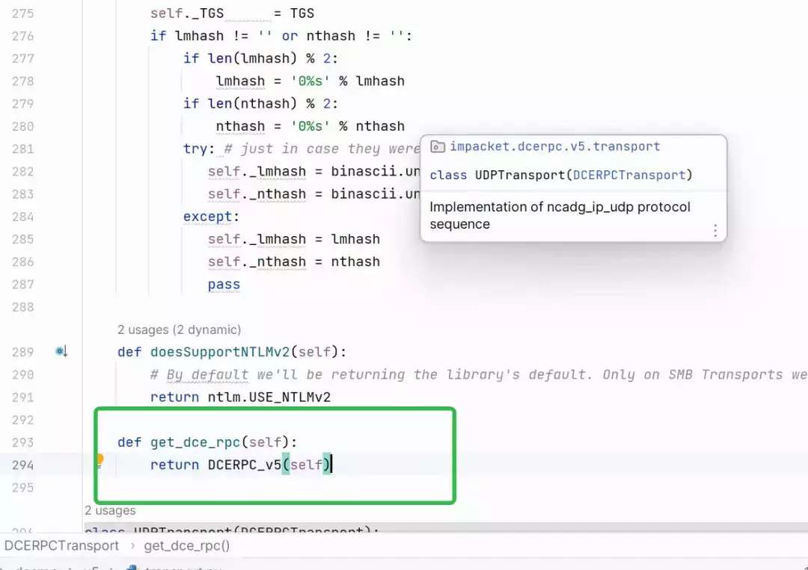

  

    这个方法将当前 transport 的实例作为 DCERPC\_V5 类的参数，实例化后返回，DCERPC\_V5 包含了 dcerpc 的运行时实现，是一个非常关键的类，功能我们后面再说，在 impacket 中没有直接实例化 DCERPC\_V5 来对 RPC 进行调用，都是首先实例化一个 Transport 或者利用 Transport 工厂生成一个 Transport 实例，再通过这个 Transport 实例调用 get\_dce\_rpc 来获取 DCERPC 实例来进行操作。

  

我们首先可以看一下最常用的两个传输协议 TCPTransport 和 SMBTransport。

**TCPTransport**

顾名思义 TCPTransport 就是利用 TCP 来进行数据传输，这也是最简单的一种传输方式。

  

  

可以看到网络连接就是建立了一个简单的 tcp 连接，rpc 断开就是 socket 断开连接。

  

  

    数据发送和接收实际上也就是 socket 的发送和接收，不同的是数据发送时会根据\_max\_send\_frag 参数来进行分批发送，数据包接收则默认是接收 8192 字节。

**SMBTransport**

  与 TCPTransport 不同，SMBTransport 传输方式以 SMB 为基础。

  

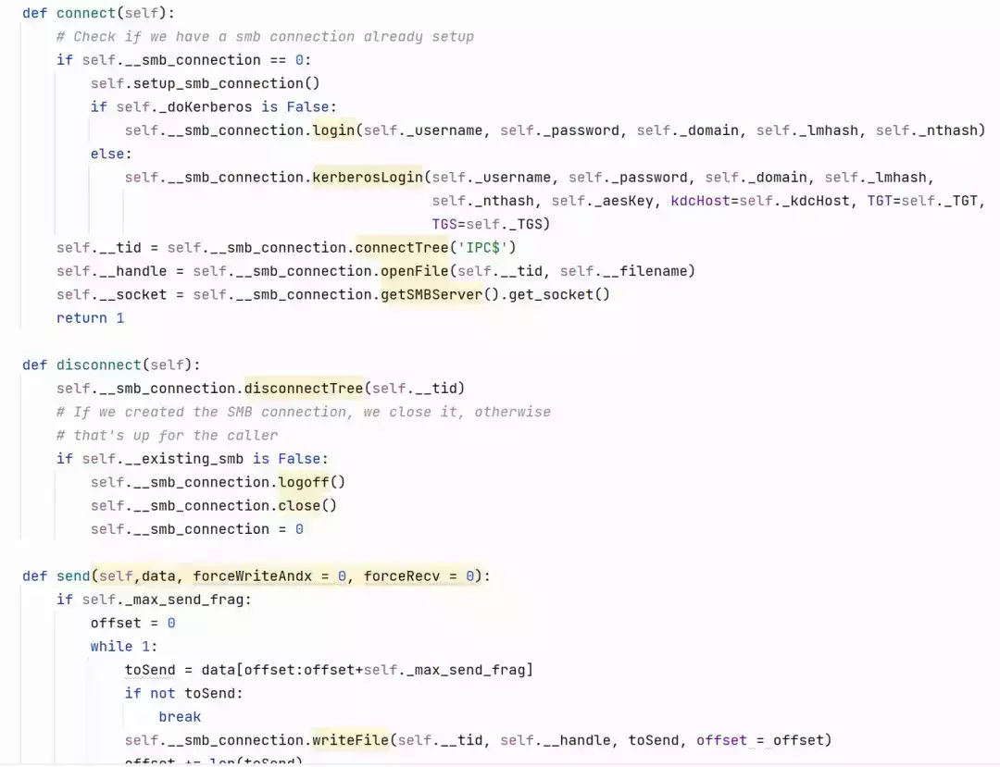

  

  

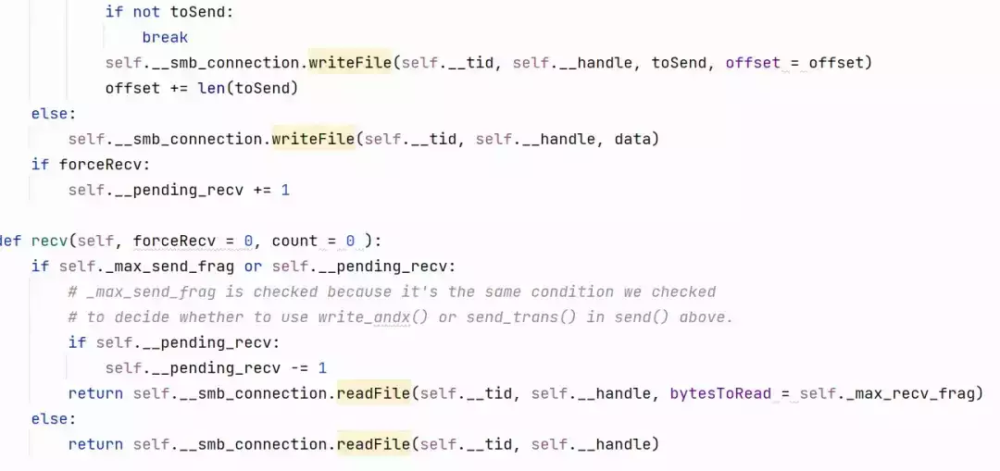

  

  SMB 传输中数据连接实际上有以下几个步骤，首先建立 SMB 连接，然后连接到 IPC$共享，这个共享是 Windows 服务器专门用于进程间通讯使用的共享，最后打开一个文件，这个文件代表提供服务的端点，而数据的发送和接收实际上就是对共享文件的写入和读取。

  

  

**02**

**stringBinding**

  stringBinding 是 rpc 中定义的一个概念，和 url 比较类似，是一种标识远程对象的位置和通信细节的字符串格式，我们在阅读 impacket 源码时经常能看到这种数据格式，比如在横向移动工具 atexec.py 中

  

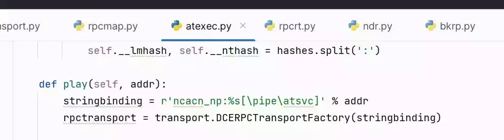

  

r'ncacn\_np:%s\[\\pipe\\atsvc\]' % addr，将这个字符串解析之后就是 ncacn\_np:192.168.31.110\[\\pipe\\atsvc\]

这里就包含了以下几个信息

  

1.  协议标识符（Protocol Identifier）：指定用于通信的协议，如 TCP/IP、HTTP、HTTPS 等，这里 ncacn\_np 表示 smb。
    
2.  网络地址（Network Address）：指定远程对象所在的网络地址，可以是 IP 地址或主机名，在这里是 192.168.31.110。
    
3.  附加信息，这里由于是 smb 协议，所以后面的附加信息就表示命名管道的路径。
    

  

    stringBinding 不仅是我们在初始化 RPC 时会使用到，通过 epm 定位 rpc 服务端点也会返回 stringBinding 格式的数据。

  

  

**03**

**DCERPCTransportFactory**

  这是使用 impacket 中的 RPC 中最常用的一个函数，从函数名可以知道这是一个 DCERPCTransport 工厂，使用工厂模式生产 DCERPCTransport 实例，这个函数的参数就是我们上面介绍的 stringBinding。

  

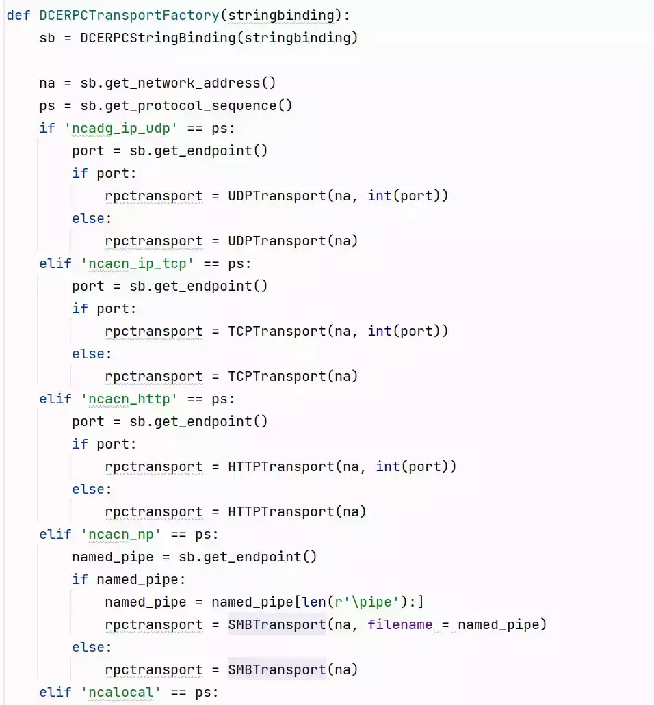

  

    在这个函数中，首先对 stringbinding 进行解析，这里使用的是 DCERPCStringBinding 类进行解析，这个类使用了一个正则来匹配 stringbinding 字符串中的各个部分的信息。

  

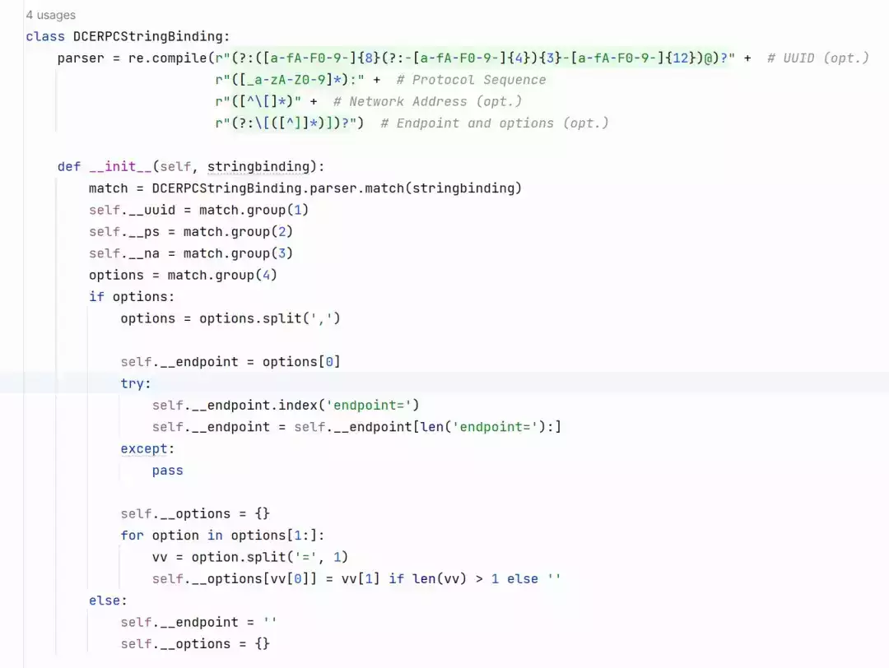

  

    包含协议\_\_ps、网络地址\_\_na、以及两个可选的部分 UUID 和 options，回到 DCERPCTransportFactory 中，解析完 stringBinding 后，通过协议来确定返回的 DCERPCTransport 类实例。

  

  

**DCERPC 数据结构**  

  

  DCERPC 协议中定义了一系列的协议数据单元（PDU），这些 PDU 具有一些固定的数据结构，我们在 rpcrt.py 中可以找到 DCERPC PDU 通用结构的定义。

  

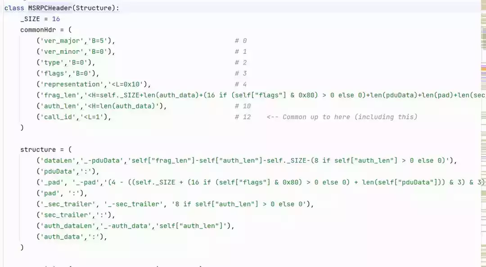

  

**01**

**通用 PDU 结构**

  所有 DCERPC PDU 都由以下三部分组成

  

1.  PDU Header，包含协议版本、标志位等控制信息，所有 DCERPC PDU 都包含这个部分
    
2.  PDU body，包含 RPC 传输的数据内容，例如在 REQUEST 和 RESPONSE 中，body 分别代表 RPC 调用的输入和输出。
    
3.  Auth Info，包含了用于认证的数据结构，其具体内容取决于使用的认证协议。
    

  

  impacket 中使用 MSRPCHeader 类来表示 通用的 PDU Header，我们可以看到这个类也是继承了 Structure 类

  

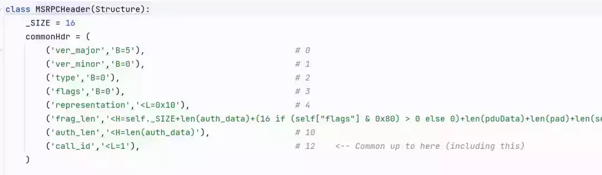

  

RPC Header 中包含了 8 个字段，具体的头部字段和其含义如下

  

-   Version (ver\_major, ver\_minor)：指定使用的 RPC 协议的主版本号和次版本号， 目前版本为 5.0。  
    
-   type：指示消息的类型，如 Request（请求）、Response（响应）、Bind（绑定）、Fault（错误）等。
    
-   flags：包含一组标志位，用于指示消息的各种特性和选项。例如，标志位可以指示消息的重要性、同步或异步调用、身份验证要求等。
    
-   representation：指定数据的表示方式，用于解析和序列化数据。它包括数据编码方式（如大端字节序或小端字节序）和数据类型（如整数、浮点数的表示方法）。
    
-   frag\_len(Total Length, Offset)：如果消息被分片传输，这些字段用于指示分片的总长度和当前分片的偏移量。
    
-   auth\_len：指示身份验证数据的长度。
    
-   call\_id：用于标识特定的 RPC 调用。在请求和响应之间进行匹配，以确保正确的请求和响应之间的关联。
    

  

**02**

**PDU 类型**

  DCERPC 中有不同的消息类型也就是 PDU 类型，这些类型的定义都在 rpcrt.py 文件中

  

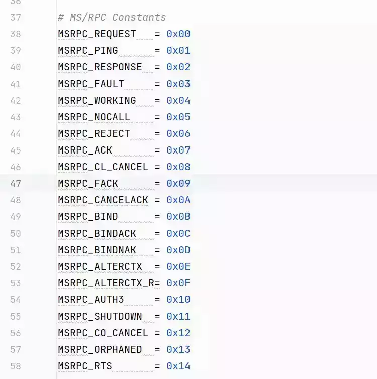

  

  常用的 PDU 类型有 BIND、BIND\_ACK、REQUEST、RESPONSE 等，常见的 PDU 类型及其作用如下：

  

-   Request PDU（请求 PDU）：客户端使用请求 PDU 向服务器发送远程过程调用请求。它包含有关要调用的远程过程、参数和其他相关信息。请求 PDU 触发服务器执行相应的远程过程，并返回执行结果。  
    
-   Response PDU（响应 PDU）：服务器使用响应 PDU 向客户端发送远程过程调用的执行结果。它包含有关执行结果、返回值和其他相关信息。响应 PDU 将执行结果传递给客户端，以便客户端继续处理。  
    
-   Fault PDU（错误 PDU）：如果在远程过程调用期间发生错误或异常，服务器可以使用错误 PDU 向客户端发送错误信息。错误 PDU 包含有关错误类型、错误代码和错误描述的信息。客户端可以根据错误 PDU 中的信息采取适当的错误处理措施。  
    
-   Bind PDU（绑定 PDU）：在 RPC 中，客户端和服务器之间需要建立连接和协商通信参数。绑定 PDU 用于在客户端和服务器之间交换连接和协商信息，以确保双方能够正确地通信。  
    
-   Bind Ack PDU（绑定确认 PDU）：绑定确认 PDU 是服务器对绑定 PDU 的响应。它确认绑定请求并指示连接和协商参数的成功建立。  
    
-   Bind Nack PDU（绑定拒绝 PDU）：绑定拒绝 PDU 是服务器对绑定 PDU 的拒绝响应。它指示连接和协商参数的失败或拒绝。
    

  

**03**

**BIND**

  BIND 操作用于建立客户端和服务器之间的连接，并协商通信参数，以进行后续的远程过程调用，具体的作用有以下几个部分：

  连接建立：使客户端和服务端建立一个逻辑上的连。

  身份验证：在 BIND 消息中可以携带身份认证数据，用于客户端的身份验证。

  错误处理：在 BIND 阶段，如果服务端拒绝接口绑定，会返回 BIND\_NAK 类型的 PDU，在这种类型的 PDU 中包含服务端返回的一些错误信息。

  

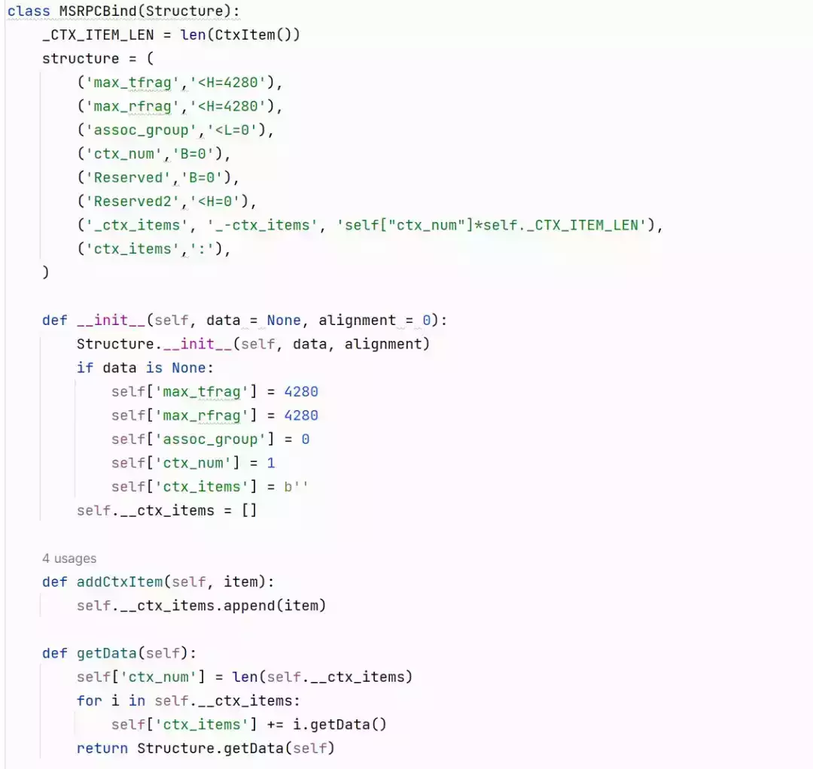

  

  impacket 中 BIND PDU 的实现如上图所示，注意这里的 MSRPCBind 其实只是除了 Header 部分的字段，其中最重要的是 ctx\_items 字段，该字段中可以携带客户端希望绑定的服务接口信息。另外在这里的 BIND PDU 中 max\_tfrag 和 max\_rfrag 默认都是 4280，在新版本的 Windows 中默认的值并不是 4280，大家可以通过抓包观察一下。

  

**04**

**REQUEST**

  

  

  

  

    REQUEST PDU 用于向服务端发起函数调用，下面是 impacket 中 REQUEST PDU Header 部分的定义。

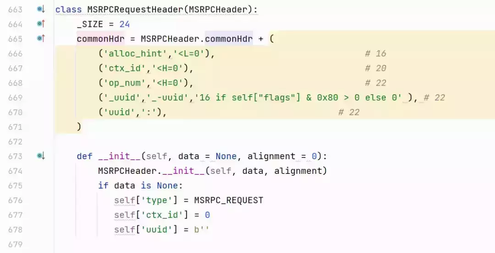

    REQUEST PDU 头部比通用 PDU 头部多出来 4 个字段，alloc\_hint、ctx\_id、op\_num、uuid,alloc\_hint 用于向服务器指示需要分配的内存大小，ctx\_id 用于维护上下文状态，op\_num 表示具体的 RPC 函数，uuid 是一个可选字段，表示一个对象句柄，当 uuid 存在时，需要将 PDU 的 flag 字段最高位置为 1。

  

**RPC 运行时**

  

    整个 rpcrt.py 中最为核心的 rpc 执行逻辑的部分位于 DCERPC\_V5 中，我们来看一下这个类的结构，在 rpc 数据传输部分我们知道这个类的初始化是在 Transport 的 get\_dce\_rpc 中，来看一下类的初始化方法。

  

  

调用的是父类的初始化方法

  

  

父类初始化方法中对一些成员变量进行了初始化，并且将传入的 transport 传到自己的私有变量中。

再来看一下这个类中一些重要的方法。

  

  

首先是 connect 和 disconnect，这两个方法都是继承于父类 DCERPC，实际上是调用 transport 的 connect 和 disconnect 方法，作用是建立数据连接。

  

其次是 bind 方法，bind 也是 DCERPC 运行时中的一个重要方法，在 DCERPC 协议中 BIND 的作用就是与对应的 RPC 服务创建一个逻辑上的绑定，创建绑定之后再进行对应的 RPC 函数调用

  

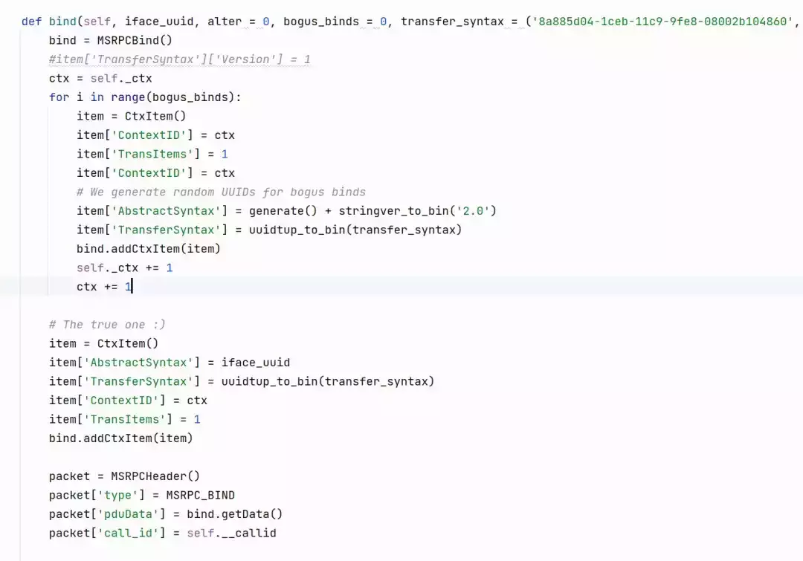

  

我们可以发现函数的参数中包含 iface\_uuid、alter、bogus\_binds、transfer\_syntax 五个参数，其中 iface\_uuid 是一个必要参数，其表示希望绑定的服务接口的 uuid。

  

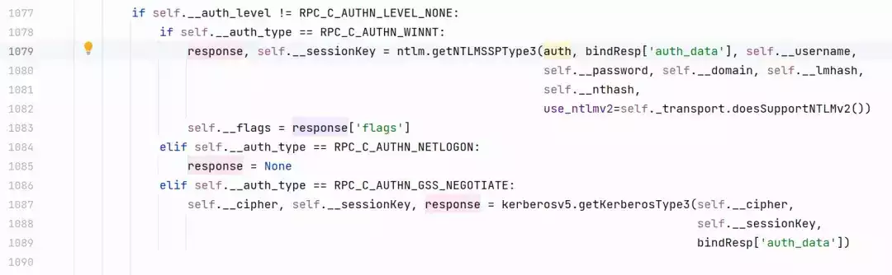

  

1077-1090 行、根据初始化时选择的认证类型来生成对应的 sessonKey 和 response，例如 RPC\_C\_AUTHN\_WINNT 代表使用 ntlm 认证协议、RPC\_C\_AUTHN\_NETLOGON 代表 NETLOGON 认证协议、RPC\_C\_AUTHN\_GSS\_NEGOTIATE 则是代表 Kerberos 协议。

  

  

1120-1123 行，初始化了一个 SEC\_TRAILER 结构体，也就是 PDU 中的 AUTH INFO 部分，注意这里的 auth\_ctx\_id 是从 79231 这个数字起步。

  

request 方法，这个方法是用于发送和接收 MSRPC Request PDU，在这里有一个很巧妙的设计，通过获取输入的请求类名去查找对应的响应类名并且在内部进行反序列化，隐藏了网络通信的细节，我们只需要实现 Request 和 Request+Response 两个类的结构就可以，不需要单独实现序列化和反序列化逻辑。

  

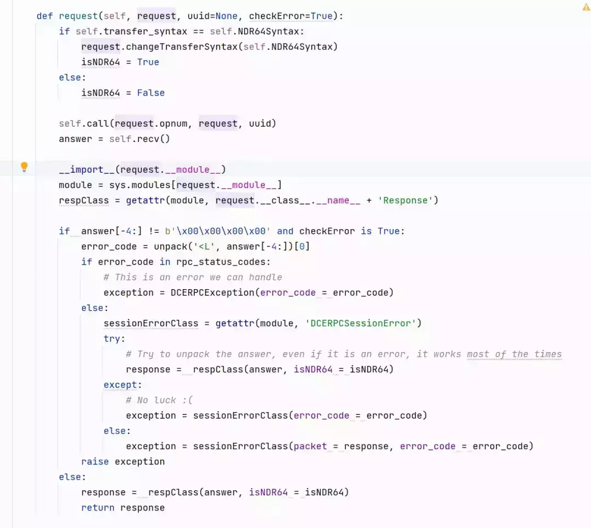

  

本篇对 impacket 的 RPC 进行了一个大致的介绍、并且重点介绍了 rpc 运行时的介绍，在 Windows 服务中，有大量不同的 rpc 服务，我们从 impacket 中的 dcerpc 文件夹也可以看出来，我们在后续的文章中也会通过具体的工具分析中引用的服务类型来进行对应 RPC 的介绍。

  

