# 内网渗透瑞士军刀-impacket工具解析（九）

  

**DCOM介绍**  

DCOM 是 COM 的扩展，它允许应用程序使用基于 DCERPC 的 DCOM 协议与远程计算机上的 COM 对象进行通信并使用它们，就像它们在本地一样。有关每个 COM（和 DCOM）对象的身份、实现和配置的信息都存储在注册表中，并与一些重要的标识符相关联：

  


  


  

-   CLSID - 类标识符（Class Identifier）是一个 GUID，是 COM 类的唯一标识符，在 Windows 中注册的每个类都与 CLSID 相关联（COM 对象可在未注册的情况下使用，但这不在本文讨论范围内）。注册表中的 CLSID 键指向类的实现，如果是基于 dll 的对象，则使用 InProcServer32 子键，如果是 exe，则使用 LocalServer32 键。  
    
-   ProgID - Programmatic Identifier（程序标识符）是一种可选的标识符，它可以作为 CLSID 的一种更方便用户使用的替代标识符，因为它不必遵循 CLSID 令人生畏的 GUID 格式（例如，"System.AppDomainManager "就比 GUID 更容易识别）。ProgID 并不保证唯一，而且与 CLSID 不同，并非每个类都与 ProgID 关联。  
    
-   AppID - 应用程序标识符用于指定与同一可执行文件相关联的一个或多个 COM 对象的配置。这包括赋予各组在本地和远程实例化和访问相关类的权限。  
    

  

为了使 DCOM 可以访问 COM 对象，AppID 必须与类的 CLSID 相关联，并且需要向 AppID 授予适当的权限。没有关联 AppID 的 COM 对象无法从远程计算机直接访问。

  

远程 DCOM 对象的实例化行为如下：

  

1.  客户端计算机向远程计算机请求由 CLSID 表示的对象的实例化。如果客户端使用 ProgID，它首先在本地解析为 CLSID。  
    
2.  远程计算机检查是否存在与相关 CLSID 关联的 AppID，并验证客户端的权限。
    
3.  如果一切顺利，DCOMLaunch服务将创建所请求类的实例，最常见的是通过运行 LocalServer32 子项的可执行文件，或者通过创建 DllHost 进程来托管 InProcServer32 子项引用的 dll。
    
4.  通信是在客户端应用程序和服务器进程之间建立的。在大多数情况下，新进程是在与 DCOM 通信关联的会话中创建的。
    
5.  然后客户端就能够访问新创建的对象的成员和方法。
    

  

目前可通过多种DCOM对象进行命令执行，包括MMC20.APPLICATION、SHELLWINDOWS、SHELLBROWSERWINDOW、VISIO.APPLIATION、Shell.Application、Excel.Application、PowerPoint.Application等，然而最为常用的还是MMC20.APPLICATION、SHELLWINDOWS、SHELLBROWSERWINDOW。

  

为了在之后分析dcomexec.py工具的时候对整个流程有一个清晰的认识，我们先利用DCOM对象MMC20.APPLICATION在Powershell中进行简单的演示，弹出一个计算器：

  

创建MMC20.Application对象的实例:

  

```plain
$com =
[activator]::CreateInstance([type]::GetTypeFromProgID("MMC20.Application","127.0.0.1"))
```

  

获得MMC20.Application对象的实例后，枚举这个此对象中的不同方法和属性：

  

```plain
 $com | Get-Member
```

  


  

```plain
$com.Document | Get-Member
```

  


  

  

```plain
$com.Document.ActiveView | Get-Member
```

  


  

通过ExecuteShellCommand执行命令，这里启动计算器：

  

```plain
$com.Document.ActiveView.ExecuteShellCommand('cmd.exe',$null,"/c calc.exe","Minimized")
```

  


  

  

**工具解析**  

**工具概况**  

dcomexec.py是impacket工具库下比较流行的工具之一，由于它利用windows系统的DCOM组件进行攻击，因此使得攻击具有通用性。下面通过对工具的实时调试来简单地分析工具的原理：

  

工具由4个类、1个函数构成，其中DCOMEXEC是最为核心的类，也是此工具的关键所在，另外RemoteShell和RemoteShellMMC20是用来实现shell的两个类，RemoteShellMMC20类继承自RemoteShell类。AuthFileSyntaxError类用于定义当加载smbclient-style的认证文件出错时如何处理。load\_smbclient\_auth\_file函数用于加载sombclinet认证文件。

  


  

打开DCOMEXEC类，我们可以看到dcomexec.py支持通过三类对象实例化进行命令执行，分别为ShellWindows、ShellBrowserWindow、MMC20。

  


  

在指定命令的时候，如果不用-object参数显式指定对象使用哪个对象执行命令，那么默认会使用ShelloWindows。

  

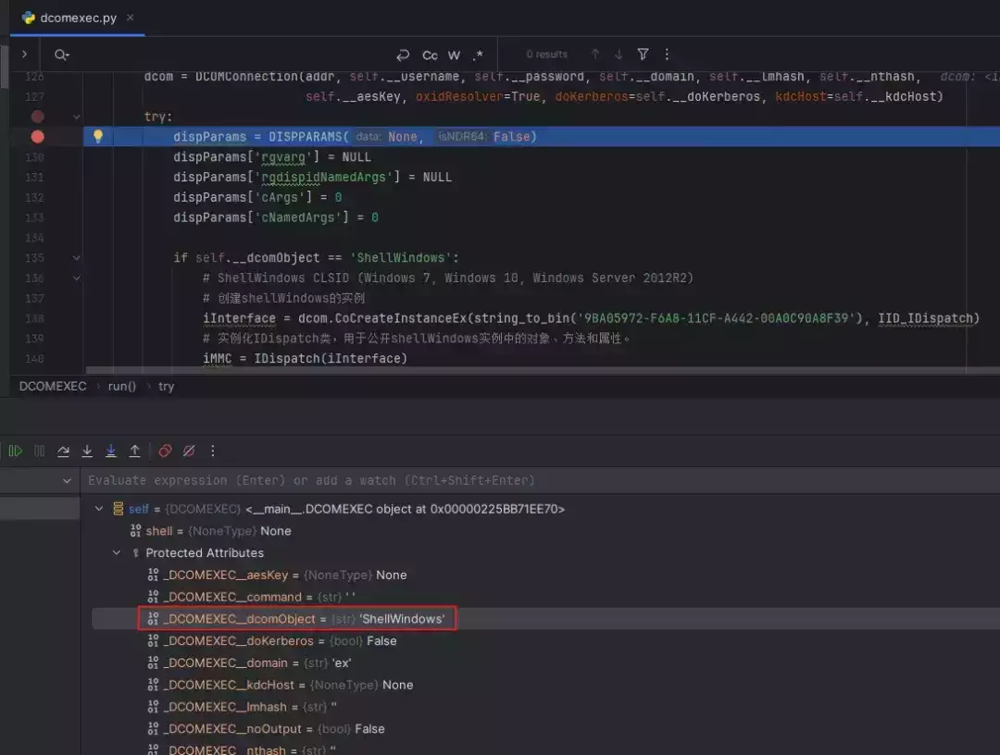

**代码分析**  

由于支持的三种实例化执行命令的方式原理基本一致，下面以MMC20为例实现一个交互式shell

  

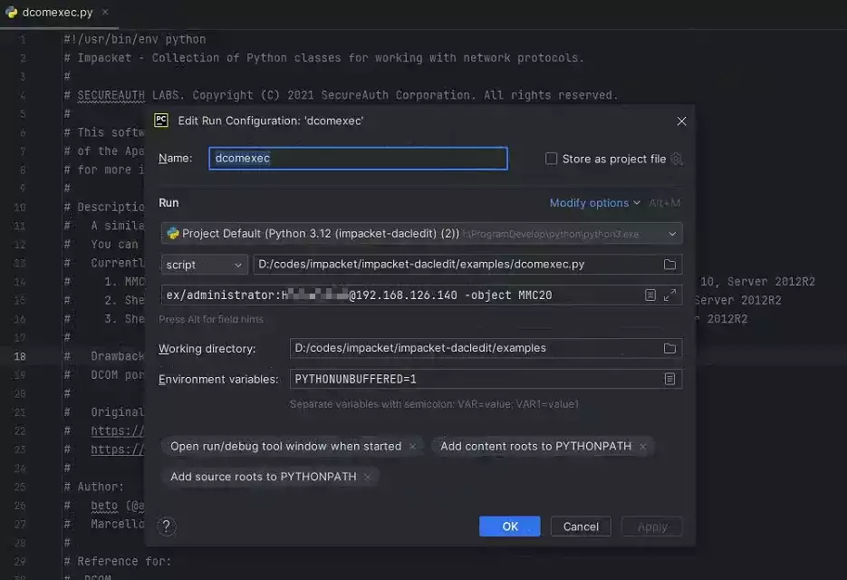

  

主程序中，通过传入用户名、密码、dc\_ip等参数，对DCOMEXE类进行实例化，然后对DCOMEXEC类中的run方法进行了调用。

  

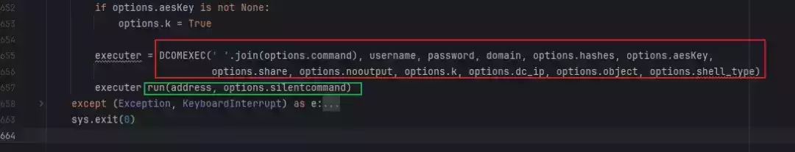

  

先在DCOMEXEC类实例化这一栏打上一个断点，使得程序在关键位置暂停

  


  

F7进入run方法，可以看到由SMB连接的操作，连接SMB是为了进行文件的上传、下载等行为。

  


  


  

按F8将程序运行到126行，传入一些必要的参数，实例化DCOMConnection类，进行DCOM连接，后续的很多关键操作都会基于此而展开。

  

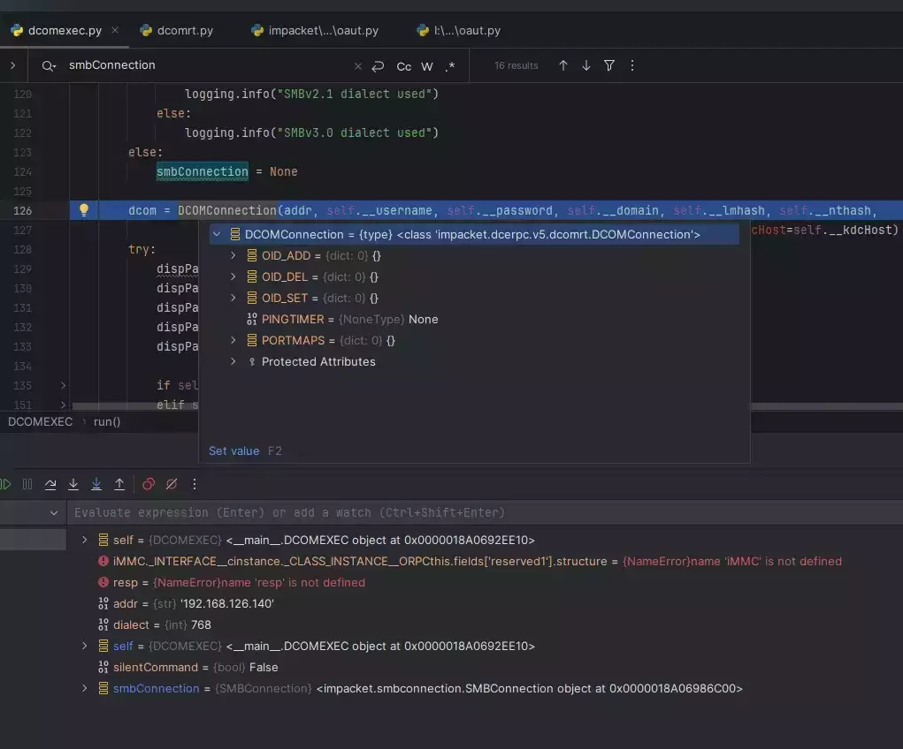

  

以下是已经实例化之后的DCOMConnection，相关字段里面已经有了相应的数据。

  

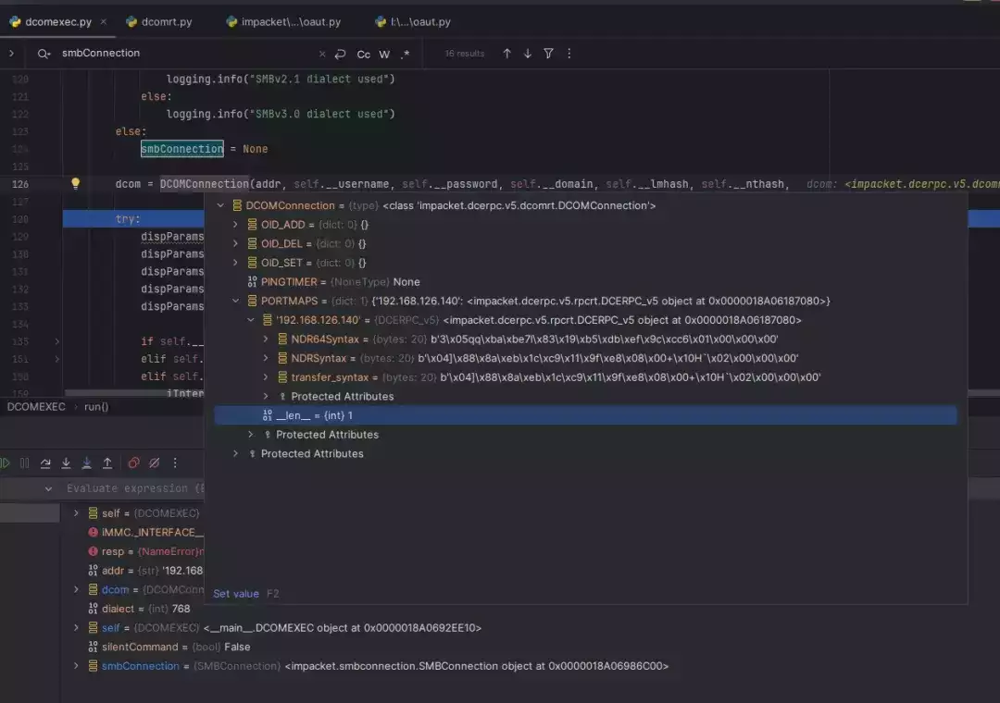

  

F8继续往下运行程序到129行，实例化DISPPARAMS类，它包含传递给方法或属性的参数。之后进行了相关参数的设置。

  

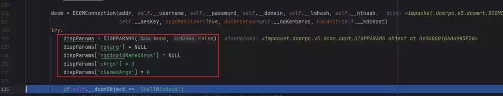

  

参考微软官方文档，DISPPARAMS 结构如下：

```plain
typedef struct DISPPARAMS {
  VARIANTARG *rgvarg;
  参数数组。

  DISPID     *rgdispidNamedArgs;
  命名参数的调度 ID。

  UINT       cArgs;
  参数的数量。

  UINT       cNamedArgs;
  命名参数的数量。

} DISPPARAMS;
```

查看变量窗口，\_\_dcomObject值为MMC20，可知程序逻辑会从158行进入MMC20这个分支。

  

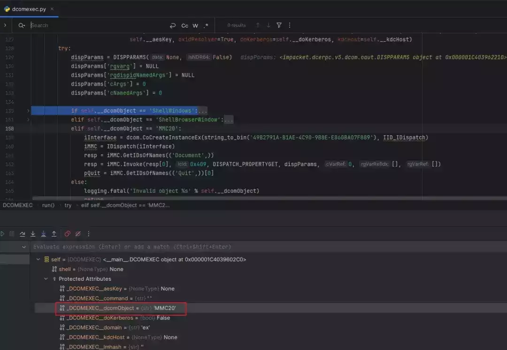

  

和猜测的一样，程序并没有运行ShellWindows和ShellBrowserWindow逻辑，而是进入了MMC20逻辑。这里来到了整个程序的关键之所在，需要特别介绍以下相关类、方法。

  

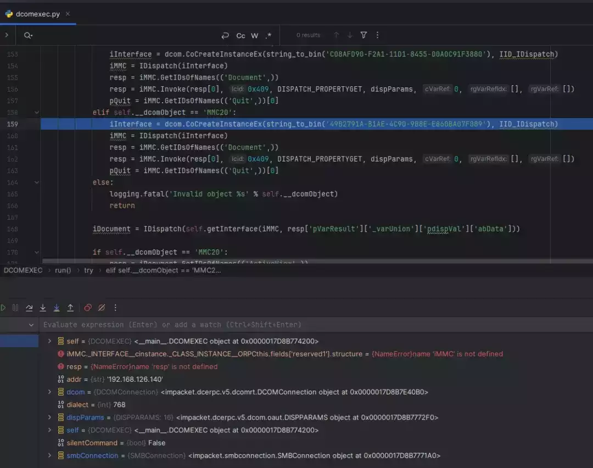

  

49B2791A-B1AE-4C90-9B8E-E860BA07F889为MMC20对应的CLSID，把它作为参数传入CoCreateInstanceEx函数，用于创建MMC20类的实例。

  

微软官方 CoCreateInstanceEx 函数如下：

```plain
HRESULT CoCreateInstanceEx(
  [in]      REFCLSID     Clsid,
  要创建的对象的 CLSID。

  [in]      IUnknown     *punkOuter,
  如果此参数非NULL，则表示实例正在作为聚合的一部分创建，并且punkOuter将用作新实例的控制IUnknown。目前不支持跨进程或跨计算机的聚合。在进程外实例化对象时，如果punkOuter为非NULL ，则将返回 CLASS_E_NOAGGREGATION。

  [in]      DWORD        dwClsCtx,
  来自CLSCTX枚举的值

  [in]      COSERVERINFO *pServerInfo,
  有关实例化对象的计算机的信息。此参数可以为NULL ，在这种情况下，根据dwClsCtx参数的解释，该对象将在本地计算机上或在注册表中类的RemoteServerName值下指定的计算机上实例化。

  [in]      DWORD        dwCount,
  pResults中的结构数量。该值必须大于 0。

  [in, out] MULTI_QI     *pResults
  MULTI_QI结构数组。每个结构都有三个成员：所请求接口的标识符 ( pIID )、返回接口指针的位置 ( pItf ) 以及QueryInterface调用的返回值( hr )。

);
```

按F7,进入CoCreateInstanceEx函数，可以看见首先实例化了IRemoteSCMActivator类，IRemoteSCMActivator是DCOM远程协议的另一个远程激活接口。

  

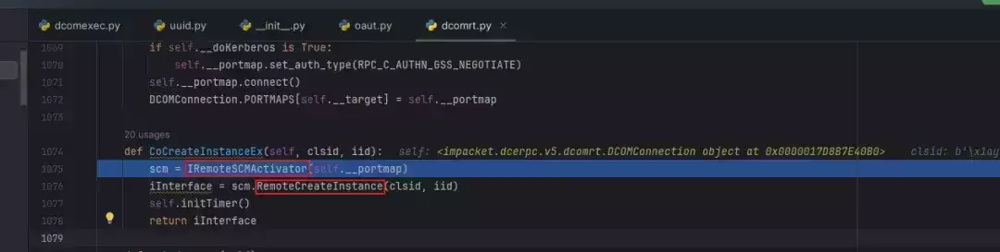

  

跟进IRemoteSCMActivator类，它支持两个函数RemoteGetClassObject和RemoteCreateInstance。RemoteGetClassObject函数作用是客户端使用它来创建类工厂对象的对象引用；RemoteCreateInstance函数作用是客户端使用它来创建实际对象的对象引用。同时，这样的实现和微软官方dcom文档也不谋而合。

  


  

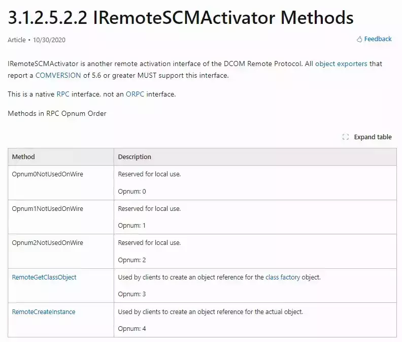

  

按shift+F8将程序返回到主程序，按F8继续运行程序到下一行，这一行将创建的MMC实例对象作为参数传入IDispatch，对IDispatch类进行了实例化。

  


  

查阅微软官方文档可知，IDispatch接口向编程工具和其他支持自动化的应用程序公开对象、方法和属性。COM 组件实现IDispatch接口以允许自动化客户端进行访问。IDispatch接口支持以下4个方法，其中GetIDsOfNames和Invoke将是最为重要的方法，在接下来程序逻辑中将会多次用到。

```plain
IDispatch::GetIDsOfNames
将单个成员和可选的参数名称集映射到相应的整数 DISPID 集，该集可在对 Invoke 的后续调用中使用。

IDispatch::GetTypeInfo
检索对象的类型信息，然后可以使用该信息获取接口的类型信息。

IDispatch::GetTypeInfoCount
检索对象提供的类型信息接口的数量（0 或 1）。

IDispatch::Invoke
提供对对象公开的属性和方法的访问。
```

  

跟进IDispatch类，代码中确实实现了这四个方法

  

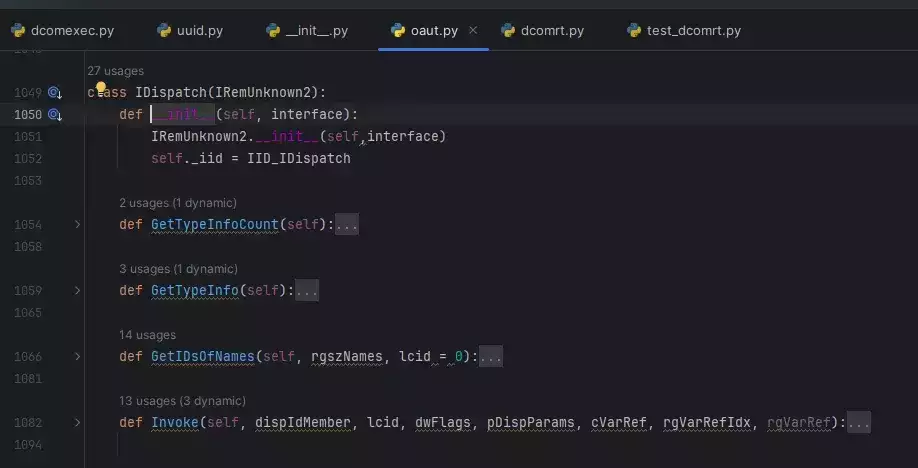

  

F8继续运行程序，GetIDsOfNames函数将document映射成整数，随后将得到的整数传入Invoke函数，实现对document进行调用

  

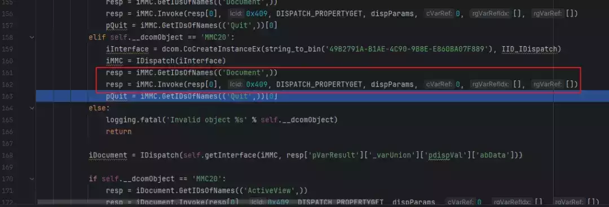

  

F8程序运行到168行，实例化IDispatch类，根据给定的接口类型和响应数据，构建一个相应的接口实例并返回。

  

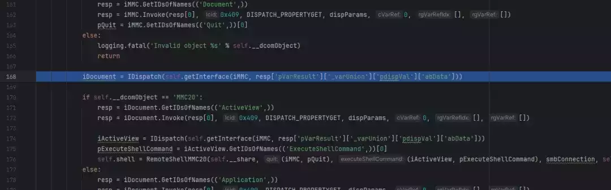

  

跟进getInterface方法，最后返回了一个接口

  

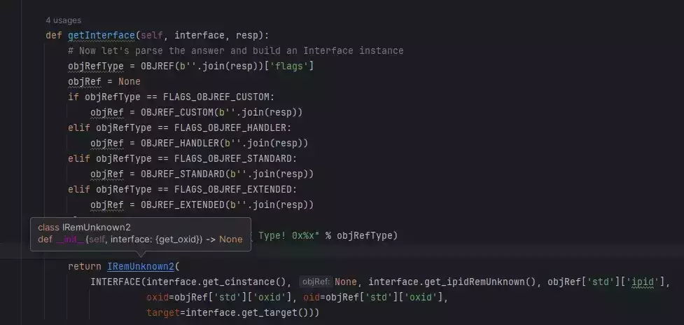

  

回到主程序，按F8继续往下运行程序，由于\_\_dcomObject的值仍然为MMC20，所以会进入以下逻辑。

  

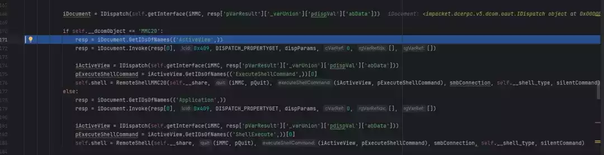

  

接下来和上面的原理基本一样，调用ActiveView属性，返回对应接口iActiveView；返回ShellExecute对应的DISPID，最后将相关参数传入类RemoteShellMMC20进行实例化，一直运行程序，最终实现了一个交互式shell。

  

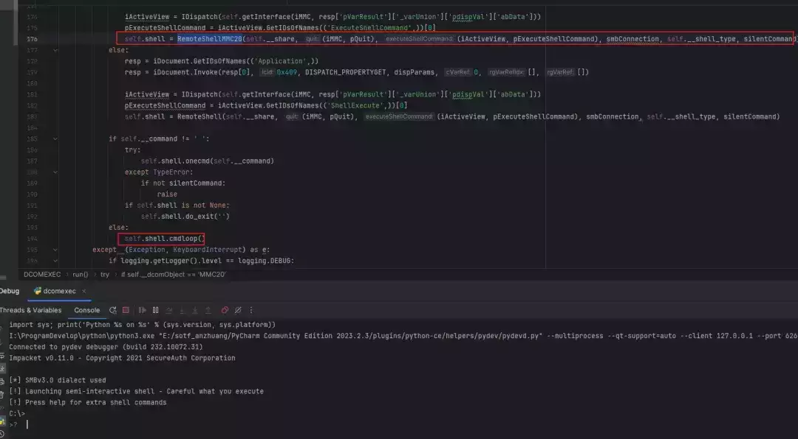

  

以上就是对dcomexec.py中的关键技术进行的简单分析，演示的是通过MMC20进行的命令执行，另外两种方式和MMC20实现方式基本一致。

  

**检测防御**  

关于利用DCOM对象进行命令执行，它不是漏洞利用，而是对正常功能的滥用。如果要防御攻击者利用DCOM对象进行攻击，可参考以下几点：

  

-   想使用这些DCOM方法（通常）需要远程主机的特权访问。请保护具备高级权限的域账户，避免本地主机账户复用密码凭据。  
    
-   启用基于主机的防火墙可以阻止RPC/DCOM交互及实例化操作；
    
-   禁用内置帐户Administrator对COM的远程启动和远程激活权限。
    

  


  


  

  

[](http://mp.weixin.qq.com/s?__biz=MzkxNTEzMTA0Mw==&mid=2247494508&idx=1&sn=f9e58ae8f443688da2ca34d7c0bccf60&chksm=c16174a0f616fdb63dd79b34dc047b0f4fbaf6a88c02f3789a7ad9df54709096b7a98fd9806b&scene=21#wechat_redirect)

  

[](http://mp.weixin.qq.com/s?__biz=MzkxNTEzMTA0Mw==&mid=2247494536&idx=1&sn=71a81e364162b2dc77247d363730274e&chksm=c1617444f616fd528b64c8bf4c6c675a3da6f3bd92280d709ced88effeb4cf13e3c522c465c8&scene=21#wechat_redirect)

  

[](http://mp.weixin.qq.com/s?__biz=MzkxNTEzMTA0Mw==&mid=2247494737&idx=1&sn=c95529f2518ed06ddbbd2b59ec90b9f7&chksm=c161739df616fa8b7b6983113819e54c93b2da7ce246ec63dcfdbdd6aea6df485e849336e460&scene=21#wechat_redirect)