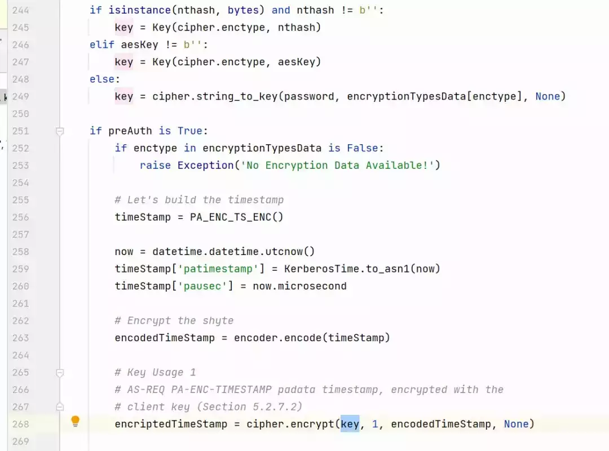
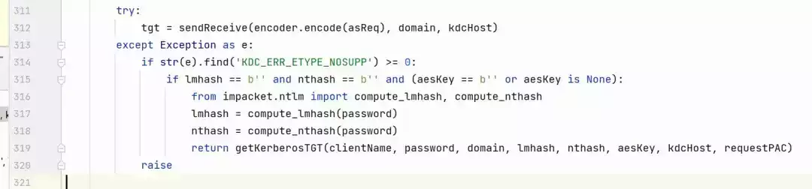
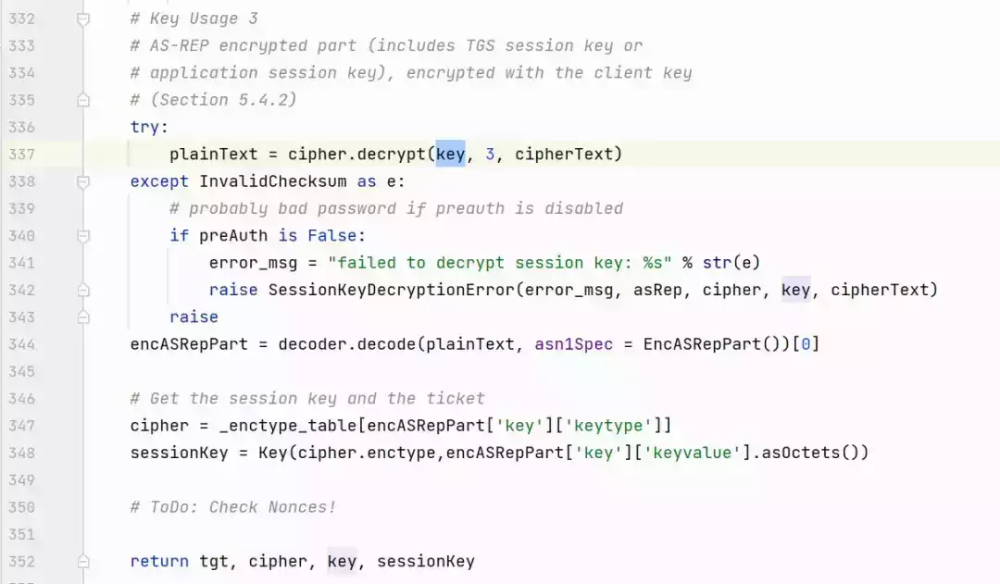
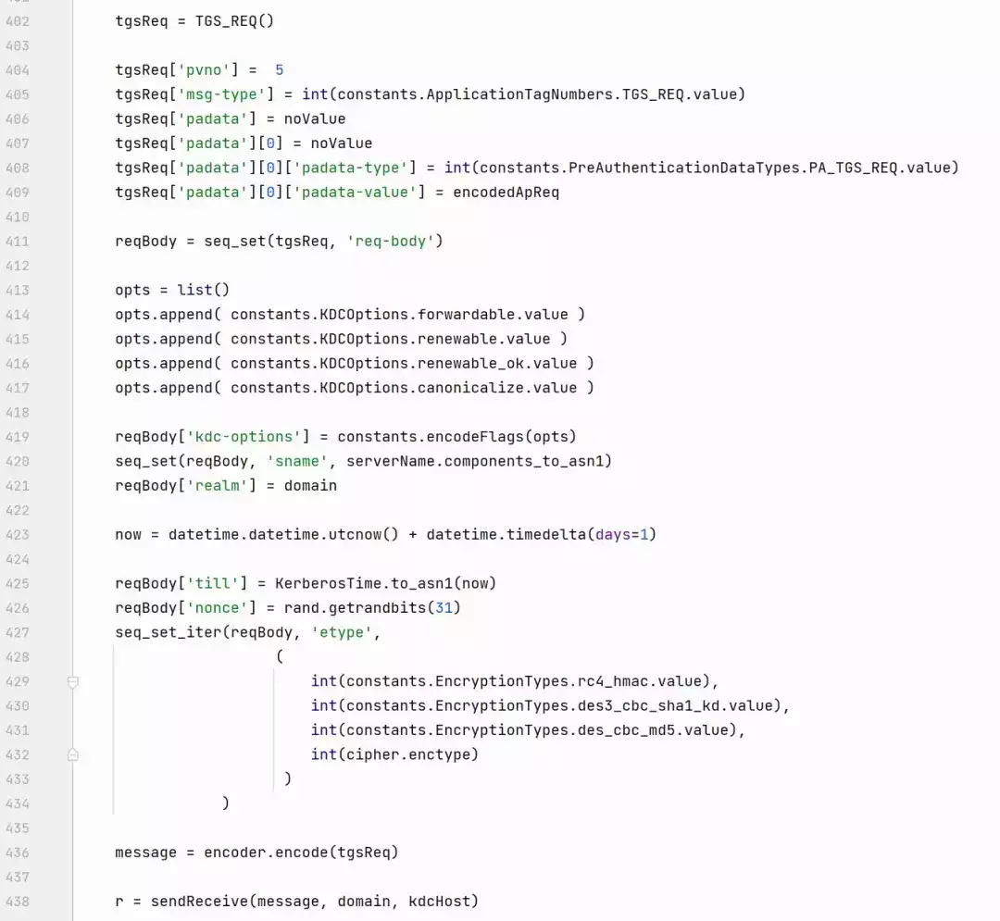
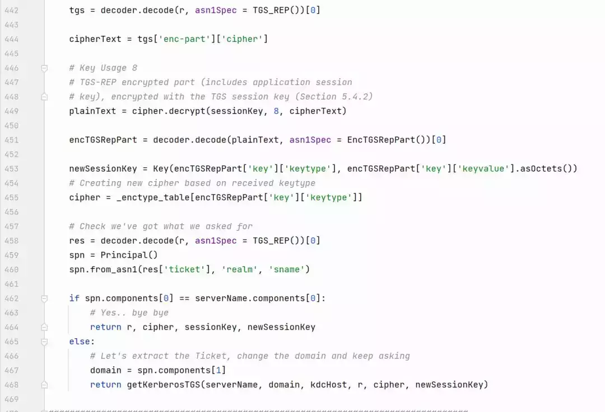

# 内网渗透瑞士军刀-impacket工具解析（二）

  

  

  

******impacket工具解析之Kerberos认证协议******

preface

上一期我们介绍了impacket中ntlm协议的实现，在Windows认证中除了使用ntlm认证，还支持Kerberos认证协议，Kerberos认证也是Windows 活动目录中占比最高的认证方式。

**什么是Kerberos协议？**

**Kerberos协议是一种网络身份验证协议，用于在计算机网络环境中进行安全的身份验证和授权，最初由麻省理工学院（MIT）开发。微软在Windows 操作系统中实现了 Kerberos 协议，作为Windows Active Directory（AD）默认的身份验证协议。**

  

**ASN.1**

  我们在Kerberos协议RFC文档可以看到使用类似于以下格式的语句来描述Kerberos的消息结构。

  

```plain
PrincipalName::= SEQUENCE {
           name-type       [0] Int32,
           name-string     [1] SEQUENCE OF KerberosString
   }
```

  

  这种表示方法和ntlm协议直接使用字节排列的方式来描述有所不同，该描述方式被称作ASN.1。

  Kerberos 协议使用 ASN.1（Abstract Syntax Notation One）来定义和描述其消息格式和数据结构。ASN.1 是一种通用的数据表示和编码规范，用于描述结构化数据和交换格式。

  

**01**

**类型表示**  

ASN.1 定义了一套抽象的数据类型和结构，包括简单类型（如整数、字符串）和复合类型（如序列、集合）。这些抽象数据类型提供了一种独立于具体实现的方式来描述数据结构。

  

**简单类型**

  

  ASN.1定义了多种简单类型，用于描述基本的数据类型。

1.  INTEGER：INTEGER 类型用于表示整数。它可以表示正整数、负整数或零。根据需要，可以指定整数的取值范围和约束条件。
    
2.  BOOLEAN：BOOLEAN 类型用于表示布尔值，即真或假。它只有两个取值：TRUE 和 FALSE。
    
3.  ENUMERATED：ENUMERATED 类型用于表示枚举类型，其中每个枚举值都有一个对应的整数值。ENUMERATED 类型可以定义一组具体的枚举值，并为每个值分配一个整数。
    
4.  NULL：NULL 类型用于表示一个空值，不包含任何数据。它通常用于表示缺少值或占位符。
    
5.  OCTET STRING：OCTET STRING 类型用于表示二进制数据，通常是字节序列。它可以表示任意长度的字节流，用于传输和存储二进制数据。
    
6.  BIT STRING：BIT STRING 类型用于表示位串，即位的序列。它可以表示定长或变长的位序列，用于表示比特字段和位标志。
    
7.  OBJECT IDENTIFIER：OBJECT IDENTIFIER 类型用于表示对象标识符（OID），它是一个全局唯一的标识符，用于标识实体、算法、属性等。
    
8.  UTF8String：UTF8String 类型用于表示以 UTF-8 编码的字符串。它可以包含任意 Unicode 字符，并支持国际化字符集。
    

  

  这些简单类型提供了一种通用的方式来表示和传输基本数据类型。ASN.1 还支持其他一些简单类型，如实数、日期时间等，以满足更具体的数据需求。

  

**复合类型**

  

  除了简单类型，ASN.1还提供了多种复合类型，用于描述和组织结构化数据。以下是一些常见的 ASN.1 复合类型：

  

1.  SEQUENCE：SEQUENCE 是最常用的复合类型之一，它定义了一组按顺序排列的成员。每个成员可以是简单类型或其他复合类型。成员的顺序在序列化和解析数据时必须保持一致。
    
2.  SET：SET 类型与 SEQUENCE 类似，但是它不要求成员的顺序，可以无序地存储和表示。在序列化和解析数据时，SET 类型会根据成员的标签进行匹配。
    
3.  CHOICE：CHOICE 类型允许在一组成员中选择一个进行存储和表示。每个成员都有一个唯一的标签，用于标识所选择的成员。CHOICE 类型只能存储和表示选择的成员，而其他成员则被忽略。
    
4.  SEQUENCE OF 和 SET OF：SEQUENCE OF 和 SET OF 类型允许定义一个成员的序列或集合。它们表示成员的重复出现，可以包含零个或多个相同类型的成员。
    
5.  ARRAY：ARRAY 类型定义了一个固定长度的数组，其中每个元素可以是简单类型或其他复合类型。ARRAY 类型在某些编程语言中可能与 SEQUENCE OF 或 SET OF 类型实现相似。
    

  

  这些 ASN.1 复合类型提供了组织和描述结构化数据的灵活性和可扩展性。通过组合和嵌套这些复合类型，可以构建复杂的数据结构，以满足特定应用或协议的需求。

  

**02**

**编码**

  ASN.1 定义了不同的编码规则，用于将抽象的数据类型转换为二进制格式进行传输和存储。常见的编码规则包括基于长度的编码（BER，Basic Encoding Rules）、基于标记的编码（DER，Distinguished Encoding Rules）、基于CER的编码（CER，Canonical Encoding Rules）等。

  

  其中Kerberos协议规定使用DER编码方式。

  

**示例**

  

    我们可以通过impacket中使用的asn.1开源实现pyasn1来演示一些基本的asn1数据类型表示及数据编码。首先使用asn.1定义一个复合类型。

  

```plain
Record ::= SEQUENCE {
    id        INTEGER,
    room  [0] INTEGER OPTIONAL,
    house [1] INTEGER DEFAULT 0
    }
```

  

  根据pyasn1提供的类描述该类型

  

```plain
from pyasn1.type.univ import *
from pyasn1.type.tag import *
from pyasn1.type.namedtype import *

class Record(Sequence):
    componentType = NamedTypes(
        NamedType('id', Integer()),
        OptionalNamedType(
            'room', Integer().subtype(
                implicitTag=Tag(tagClassContext, tagFormatSimple, 0)
            )
        ),
        DefaultedNamedType(
            'house', Integer(0).subtype(
                implicitTag=Tag(tagClassContext, tagFormatSimple, 1)
            )
        )
    )
```

  

  直接输出

  

```plain
record = Record()
record['id'] = 123
record['room'] = 321
print(record)

-----------------------------------
Record:
 id=123
 room=321
```

  

  pyasn1也实现了ber、der、cer编码方式，例如使用der对该消息进行编码。

  

```plain
from pyasn1.codec.der import encoder

encodedRecord = encoder.encode(record)
print(encodedRecord.hex())

----------------------------------------
300702017b80020141
```

  

**Kerberos数据类型**

  

    kerberos大部分的数据类型定义位于impacket/krb5/asn1.py中，文件中实现了Kerberos协议中定义的简单类型如Int32、UInt32、Microseconds、KerberosString。

  

```plain
class Int32(univ.Integer):
    subtypeSpec = univ.Integer.subtypeSpec + constraint.ValueRangeConstraint(
        -2147483648, 2147483647)

class UInt32(univ.Integer):
    pass
#    subtypeSpec = univ.Integer.subtypeSpec + constraint.ValueRangeConstraint(
#        0, 4294967295)

class Microseconds(univ.Integer):
    subtypeSpec = univ.Integer.subtypeSpec + constraint.ValueRangeConstraint(
        0, 999999)

class KerberosString(char.GeneralString):
    # TODO marc: I'm not sure how to express this constraint in the API.
    # For now, we will be liberal in what we accept.
    # subtypeSpec = constraint.PermittedAlphabetConstraint(char.IA5String())
    pass
```

  

  在简单类型的基础上通过序列组合形成多个复合类型如PrincipalName、HostAddress、AuthorizationData、PA\_DATA等。

  

```plain
class PrincipalName(univ.Sequence):
    componentType = namedtype.NamedTypes(
        _sequence_component("name-type", 0, Int32()),
        _sequence_component("name-string", 1,
                            univ.SequenceOf(componentType=KerberosString()))
                            )

class HostAddress(univ.Sequence):
    componentType = namedtype.NamedTypes(
        _sequence_component("addr-type", 0, Int32()),
        _sequence_component("address", 1, univ.OctetString())
        )

class AuthorizationData(univ.SequenceOf):
    componentType = univ.Sequence(componentType=namedtype.NamedTypes(
        _sequence_component('ad-type', 0, Int32()),
        _sequence_component('ad-data', 1, univ.OctetString())
        ))

class PA_DATA(univ.Sequence):
    componentType = namedtype.NamedTypes(
        _sequence_component('padata-type', 1, Int32()),
        _sequence_component('padata-value', 2, univ.OctetString())
        )
```

  

  通过以上数据的嵌套组合形成Kerberos协议中最主要的两种消息格式，KDC-REQ和KDC\_REP。

  

**01**

**KDC\_REQ**

    KDC\_REQ用于客户端向KDC发送请求，impacket中用于认证的请求AS\_REQ和票据请求的TGS\_REQ都通过继承KDC\_REQ来实现自身结构，该结构定义如下：

  

```plain
KDC-REQ        ::= SEQUENCE {
    pvno         [0] INTEGER (5),
    msg-type     [1] INTEGER (10 -- AS --),
    padata       [2] SEQUENCE OF PA-DATA OPTIONAL,
    req-body     [3] KDC-REQ-BODY
}
```

  

**KDC-REQ中的字段有4种：**

-   pvno：协议版本号，表示 Kerberos 协议的版本。
    
-   msg-type：消息类型，表示消息的类型，对于 AS\_REQ 结构，它的值为 10，表示 AS 请求。
    
-   padata：可选字段，表示附加的认证数据（Pre-Authentication Data）。
    
-   req-body：KDC-REQ-BODY 结构，包含了请求的主体信息，如客户端的身份信息、请求的服务等。
    

```plain
KDC-REQ-BODY   ::= SEQUENCE {
    kdc-options             [0] KDCOptions,
    cname                   [1] PrincipalName OPTIONAL,
    realm                   [2] Realm,
    sname                   [3] PrincipalName OPTIONAL,
    from                    [4] KerberosTime OPTIONAL,
    till                    [5] KerberosTime,
    rtime                   [6] KerberosTime OPTIONAL,
    nonce                   [7] UInt32,
    etype                   [8] SEQUENCE OF Int32 -- EncryptionType
    addresses               [9] HostAddresses OPTIONAL,
    enc-authorization-data  [10] EncryptedData OPTIONAL,
    additional-tickets      [11] SEQUENCE OF Ticket OPTIONAL
}
```

  

 **KDC-REQ-BODY 结构中的字段包括：**

  

-   kdc-options：KDC 选项，表示请求的选项，如是否要求可续期票据、是否要求使用预认证等。
    
-   cname：客户端名称，表示客户端的主体名称。
    
-   realm：域，表示域的名称。
    
-   sname：服务名称，表示请求的服务的主体名称。
    
-   from：可选字段，表示票据的有效起始时间。
    
-   till：票据的有效截止时间。
    
-   rtime：可选字段，表示票据的可续期时间。
    
-   nonce：随机数，用于防止重放攻击。
    
-   etype：加密类型，表示请求的票据的加密类型。
    
-   addresses：可选字段，表示客户端的网络地址。
    
-   enc-authorization-data：可选字段，表示加密的授权数据。
    
-   additional-tickets：可选字段，表示附加的票据。
    

  

**02**

**KDC\_REP**

  KDC\_REP用于表示KDC向客户端发送的响应，impacket中用于认证的请求AS\_REP和票据请求的TGS\_REP通过继承KDC\_REP来实现自身结构，该结构定义如下：

  

```plain
KDC-REP        ::= SEQUENCE {
    pvno         [0] INTEGER (5),
    msg-type     [1] INTEGER (11 -- AS -- | 13 -- TGS --),
    padata       [2] SEQUENCE OF PA-DATA OPTIONAL,
    crealm       [3] Realm,
    cname        [4] PrincipalName,
    ticket       [5] Ticket,
    enc-part     [6] EncryptedData
}
```

  

**KDC\_REP 结构中的字段包括：**

  

-   pvno：协议版本号，表示 Kerberos 协议的版本。
    
-   msg-type：消息类型，表示消息的类型。对于 KDC\_REP 结构，它的值可以是 11（AS 响应）或 13（TGS 响应），取决于是 AS 请求还是 TGS 请求的响应。
    
-   padata：可选字段，表示附加的认证数据（Pre-Authentication Data）。
    
-   crealm：域（realm），表示响应的域的名称。
    
-   cname：客户端名称，表示客户端的主体名称。
    
-   ticket：票据，表示请求的票据（Ticket Granting Ticket，TGT）或服务票据（Service Ticket）。
    
-   enc-part：加密的部分，表示加密的票据部分或认证数据。
    

  

**Kerberos函数**

  

    在impacket库中，用于Kerberos认证最常用的一些顶层函数位于impacket/krb5/kerberosv5.py中，在文件中主要通过以下3个函数来实现Kerberos认证。

  

**01**

**sendReceive**

    sendReceive是一个Kerberos消息发送和接收函数，该函数除了与KDC的88端口建立通信连接外，还对KDC的消息进行了一些处理，我们可以看到在25行，对接收到的数据包进行了解码，在39行的判断中，如果出现KDC\_ERR\_PREAUTH\_REQUIRED以外的错误，都会抛出异常。同时我们也可以看到，这个函数会优先使用kdcHost参数作为连接目标，只有kdcHost为None的情况下才会使用host作为连接目标，kdcHost和host分别代表了目标ip和目标主机名。

  

    在impacket中，通常会将域名设置为host，kdcHost作为一个可选参数，通过Kerberos认证时如果没有指定kdc地址，会尝试通过解析域名来获取kdc地址，所以如果在一台无法解析域名的机器上在没有指定kdcHost(一般是-dc-ip参数)的话就会导致连接失败，这也是使用impacket一个经常出现的问题。

  

```plain
def sendReceive(data, host, kdcHost):
    if kdcHost is None:
        targetHost = host
    else:
        targetHost = kdcHost

    messageLen = struct.pack('!i', len(data))

    LOG.debug('Trying to connect to KDC at %s' % targetHost)
    try:
        af, socktype, proto, canonname, sa = socket.getaddrinfo(targetHost, 88, 0, socket.SOCK_STREAM)[0]
        s = socket.socket(af, socktype, proto)
        s.connect(sa)
    except socket.error as e:
        raise socket.error("Connection error (%s:%s)" % (targetHost, 88), e)

    s.sendall(messageLen + data)

    recvDataLen = struct.unpack('!i', s.recv(4))[0]

    r = s.recv(recvDataLen)
    while len(r) < recvDataLen:
        r += s.recv(recvDataLen-len(r))

    try:
        krbError = KerberosError(packet = decoder.decode(r, asn1Spec = KRB_ERROR())[0])
    except:
        return r

    if krbError.getErrorCode() != constants.ErrorCodes.KDC_ERR_PREAUTH_REQUIRED.value:
        try:
            for i in decoder.decode(r):
                if type(i) == Sequence:
                    for k in vars(i)["_componentValues"]:
                        if type(k) == GeneralizedTime:
                            server_time = datetime.datetime.strptime(k.asOctets().decode("utf-8"), "%Y%m%d%H%M%SZ")
                            LOG.debug("Server time (UTC): %s" % server_time)
        except:
            # Couldn't get server time for some reason
            pass
        raise krbError

    return r
```

  

**02**

**getKerberosTGT**

    getKerberosTGT实现的部分比较长，可以从其名称可以看出来是用于获取TGT。

  

```plain
def getKerberosTGT(clientName, password, domain, lmhash, nthash, aesKey='', kdcHost=None, requestPAC=True):

    # Convert to binary form, just in case we're receiving strings
    if isinstance(lmhash, str):
        try:
            lmhash = unhexlify(lmhash)
        except TypeError:
            pass
    if isinstance(nthash, str):
        try:
            nthash = unhexlify(nthash)
        except TypeError:
            pass
    if isinstance(aesKey, str):
        try:
            aesKey = unhexlify(aesKey)
        except TypeError:
            pass

    asReq = AS_REQ()
    ...
```

  

    从这个函数里面我们也能看到一些重要的信息，首先通过参数我们可以看到支持的凭据包括password、lmhash、nthash、aesKey（lmhash实际没有参与运算）。

  


  

  在156行至174行，这里是预认证过程发送的第一个AS\_REQ加密方式的初始化，可以看出来客户端支持的加密方式是由提供的凭据类型决定的，输入的凭据对应的加密方式如下，优先级从到下逐渐降低。

  

|     |     |
| --- | --- |
| nthash | rc4 |
| aesKey(32) | aes256 |
| aesKey(16) | aes128 |
| password | aes256 |

  

  从加密方式的设置上也能看出来，不管提供的是什么凭据，AS\_REQ中的加密方式始终只有一种，但是在实际的Windows客户端一般都支持多种加密方式，这也是一个比较明显的特征。

  



  

  244行至268行是预身份验证中的第二个AS\_REQ进行初始化，在impacket中只实现了加密时间戳的认证方式，这里也是对时间戳进行加密的核心部分，可以看到使用的凭据优先级与上一个AS\_REQ相同，根据不同的凭据类型转换成对应的加密key，加密时间戳使用的也是经过编码后的KerberosTime结构。

  



  

  311至320行实现了加密方式的回滚，在前面的代码中，我们可以知道当指定了password也就是明文密码时会使用aes256加密方式，而这里捕获了KDC\_ERR\_ETYPE\_NOSUPP异常，也就是KDC不支持aes256，在这里的操作是将明文密码转换为hash，再进行请求。

  



  

  332-352行是对AS\_REP的enc-part进行解密，这里的enc-part是KDC使用客户端的密钥进行加密的，这里所说的客户端就是AS\_REQ中设置的cname，在cname对应的用户UAC设置了DONT\_REQ\_PREAUTH的情况下，没有设置预认证信息，kdc也会返回使用该用户凭据加密的enc-part，这时候就可以通过离线破解enc-part来获取用户的密钥，这也就是aesreproating攻击的原理。在这个部分的代码，作用主要就是获取sessionKey， sessionKey作为下阶段（TGS\_REQ）的认证加密密钥。最后返回的tgt实际上并不是协议描述的TGT，而是整个AS\_REP的数据包。

  

**03**

**getKerberosTGS**

  

    getKerberosTGS函数用于获取服务票据，也就是Kerberos认证的第二个阶段，我们从函数的参数可以看到，参数中一些名称正好是和getKerberosTGT的返回值相吻合的，getKerberosTGT通过传参的设计实现了pth（Pass-the-Hash），而在getKerberosTGS参数中的tgt实现ptt（Pass-the-Ticket）。

  

```plain
def getKerberosTGS(serverName, domain, kdcHost, tgt, cipher, sessionKey):

    # Decode the TGT
    try:
        decodedTGT = decoder.decode(tgt, asn1Spec = AS_REP())[0]
    except:
        decodedTGT = decoder.decode(tgt, asn1Spec = TGS_REP())[0]

    domain = domain.upper()
    # Extract the ticket from the TGT
    ticket = Ticket()
    ticket.from_asn1(decodedTGT['ticket'])

    apReq = AP_REQ()
    apReq['pvno'] = 5
    apReq['msg-type'] = int(constants.ApplicationTagNumbers.AP_REQ.value)
```

  

  在函数的开头部分对tgt进行了解码，注意这里使用的结构并不是TGT而是AS\_REP或者TGS\_REP，这是因为两种数据类型虽然不一样，但是结构是完全相同的，并且在AS\_REP中的ticket与请求服务为krbtgt返回的TGS\_REP中的ticket都可以当作TGT来使用。

  367-400行涉及到两个重要结构的初始化，AP\_REQ和Authenticator，在AP\_REQ的ticket设置的是AS\_REQ中获取的tgt，而在Authenticator中设置了客户端主体、请求的spn、域名、时间戳等信息，整个Authenticator使用上一步的sessionKey进行加密。

  


  

  402-438行对TGS\_REQ进行了初始化，设置好票据选项、认证数据、域名、时间戳等信息后发送到KDC

  



  

  442-468行中，处理与getKerberosTGT类似，首先是对TGS\_REP进行解码，在利用sessionKey对enc-part进行解密，获取下一阶段的sessionKey以及服务票据等信息。在这里还进行了返回票据的判断，如果返回票据的spn和请求中设置的spn不一致的话再进行递归调用。请求服务票据。

  



  

    服务端根据请求的spn来确定服务主体，如果spn存在的话就会返回TGS票据，并且TGS票据中的ticket部分使用该服务主体的密钥进行加密，绝大部分情况下服务主体都是计算机账户，如果一个用户账户存在spn，就可以利用TGS请求用户的服务票据，这时候返回的TGS票据就会包含使用该用户的密钥进行加密的ticket部分，此时就可以通过离线破解获取用户的密钥，这种攻击手法就是kerberoasting攻击。

  

  **以上就是impacket中kerberos实现部分，主要包含了Kerberos消息编码、基础数据结构、消息类型及两个常用的助手函数。**

  **在Windows实际的认证中smb、rpc、ldap、http等服务都支持使用ntlm协议和Kerberos协议，两种协议的认证信息如何嵌入到上述协议的数据包中，以及认证数据的交互，我们将在后续的应用层协议解析中再进行具体介绍。**