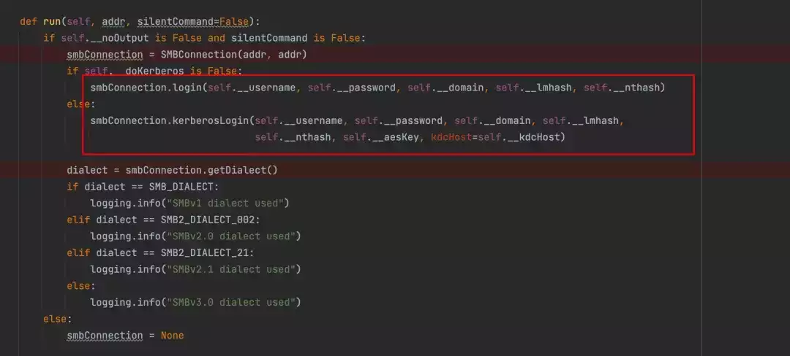
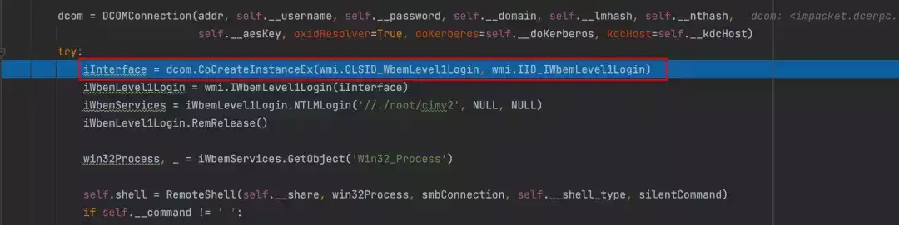
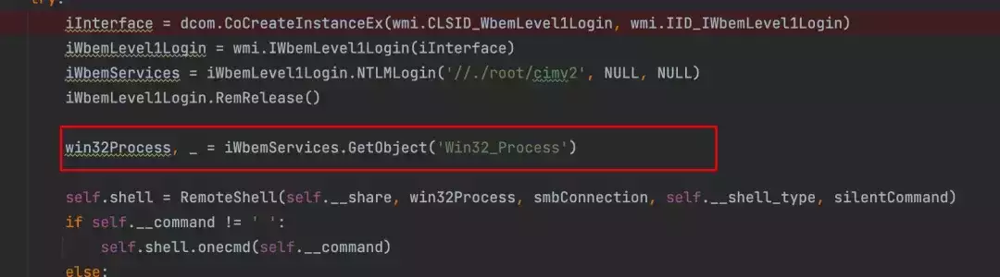
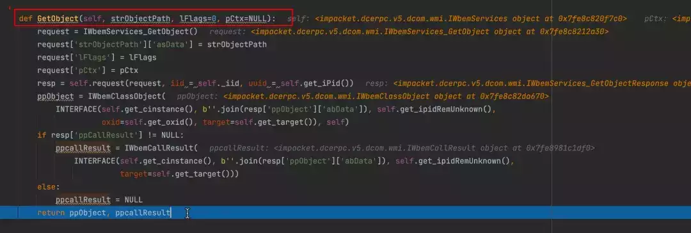
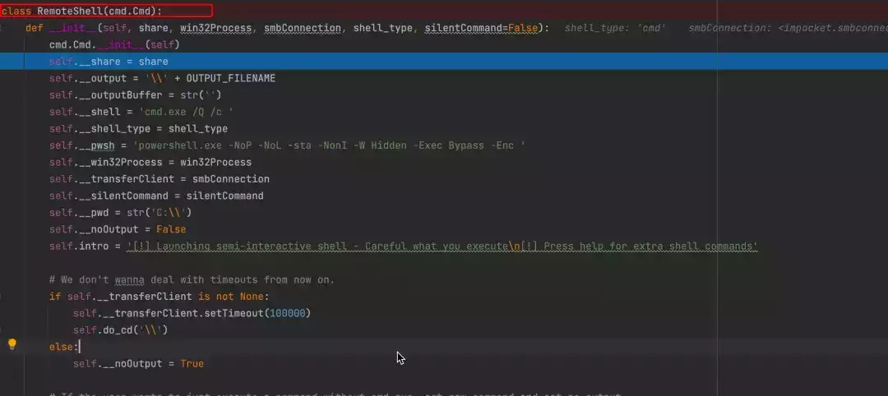
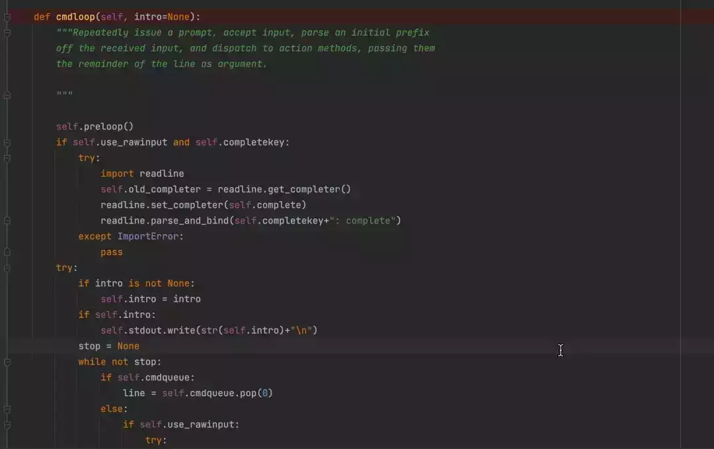
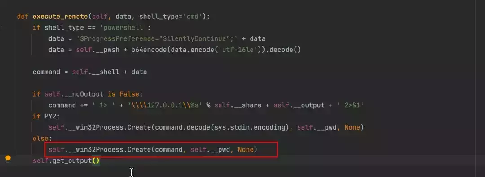
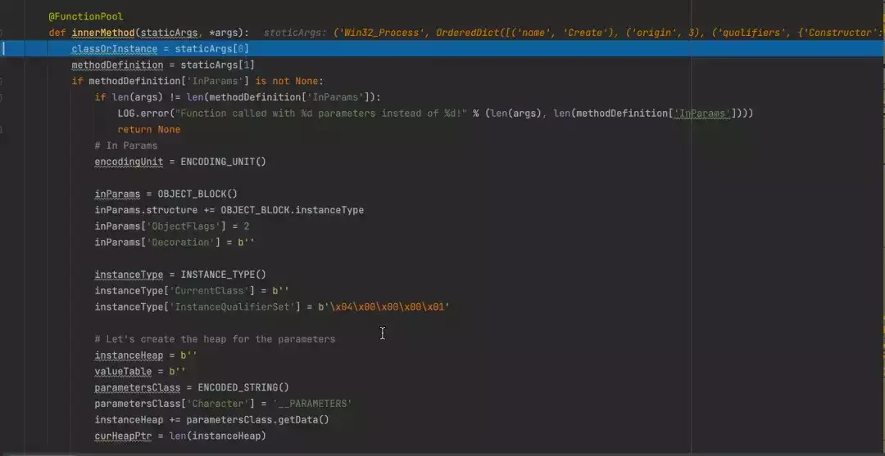
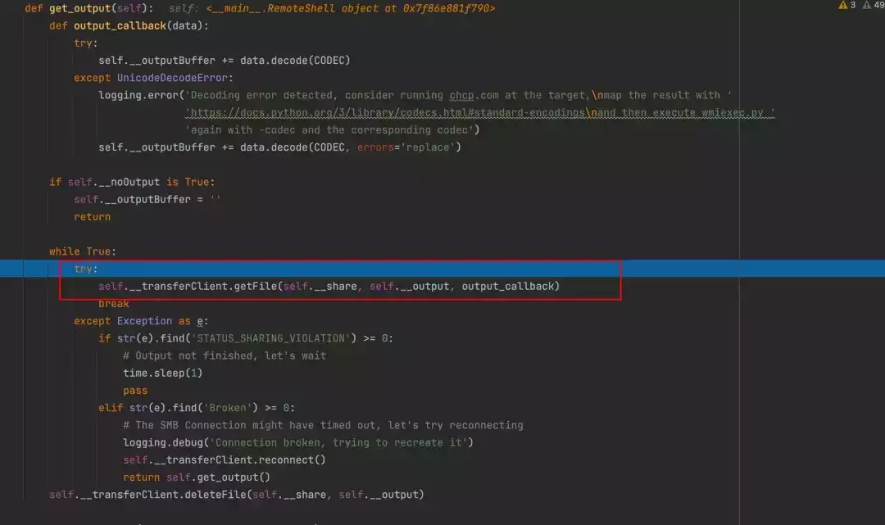

# 内网渗透瑞士军刀-impacket工具解析（八）

  

**WMI介绍**  

WMI（Windows Management Instrumentation）Windows 管理工具，是微软提供的一种用于管理和监控Windows操作系统的框架，它允许系统管理员，开发人员通过编程的方式来获取有关计算机系统，应用程序和服务的信息，以及执行相关的管理任务。WMI也支持远程管理，允许在网络上的远程计算机上执行管理任务，查询信息，以及接收事件通知等。

  

下图是WMI的结构图，其有三部分内容，WMI Consumers（WMI使用者），WMI Infrastructure（WMI 基础结构），WMI  providers and managed objects（WMI提供者和托管对象）。

  


**WMI Consumers（WMI使用者）**  

位于WMI架构的最顶层，是指使用WMI服务提供的信息的应用程序，脚本或工具。如果是C++程序则直接通过COM技术与下层通信，而一些脚本则需要一些WMI Scripting API来与下层通信，而.NET则将使用System.Management命名空间与下层通信。

**WMI Infrastructure（WMI基础架构）**  

WMI 基础架构有两个核心模块 WMI Core 与 WMI repository （WMI 存储库）。WMI 存储库是通过 WMI Namepace （WMI命名空间）组织起来的。在系统启动时，WMI服务会自动创建诸如 root\\default , root\\cimv2 和 root\\subscription 等WMI命名空间，同时会预安装一部分WMI类的定义信息到这些命名空间中。其他命名空间是在操作系统或者产品调用有关WMI提供者(WMI Provider)时才被创建出来的，总之，WMI存储库是用于存储WMI静态数据的存储空间。WMI Core也可以叫做WMI Service，其服务名叫做Winmgmt，WMI Service扮演着WMI提供者，管理应用和WMI存储库之间的协调者角色，WMI Service通过一个共享的服务进程Svchost来实施工作，当一个管理应用向WMI命名空间发起连接的时候，WMI服务将会启动，当管理应用不调用时，WMI将会关闭或者进入一个低内存状态。

  

当一个应用通过接口向WMI发起请求时，WMI服务将会判断请求的是静态数据还是动态数据，如果是静态数据则WMI将从WMI存储库中查找数据并返回，如果是一个动态数据，WMI服务将请求传递给已经在WMI服务中注册的相应的 WMI providers ，WMI提供者将数据返回给WMI服务，WMI服务再将结果返回给请求的应用。

  

**WMI providers and managed objects（WMI提供者和托管对象）**  

托管对象是通过 WMI 表示的系统资源或配置的实例，例如硬盘驱动器，网络适配器，数据库系统，进程或服务。WMI 提供者是一组用于将托管对象暴露给 WMI 的组件。这些提供者负责实现 WMI 接口，使得 WMI 可以与不同的系统组件、硬件和软件进行交互。

  

前面我们已经说了WMI可以进行远程管理。其主要使用DCOM或WinRM进行远程访问，DCOM是WMI较早的实现先方式，通过使用DCOM，WMI可以在网络上远程执行查询，获取信息，执行管理任务等操作。而WinRM则提供了一种更现代，更灵活的远程管理协议。

  

**impacket中实现**  

在impacket中也实现了WMI的远程命令执行。实现时，先实现构造方法，然后进入到run方法中执行我们的主要实现逻辑。

  


  

先建立SMB连接，可以是密码，hash，也可以是kerberos票据，来建立SMB连接。

  



  

建立连接之后，然后建立DCOM连接，在前面我们已经说过WMI通过DCOM或者WinRm来进行访问。在impacket中使用DCOM来进行远程访问，首先使用 CoCreateInstanceEx(wmi.CLSID\_WbemLevel1Login, wmi.IID\_IWbemLevel1Login) 来创建一个COM对象实例，其中 CLSID\_WbemLevel1Login 为WMI中IWbemLevel1Login接口的类标识符（CLSID）， IID\_IWbemLevel1Login 代表 IWbemLevel1Login 接口的接口标识符。

  



  


  

可以在注册表中找到WMI得CLSID

  


  

通过DCOM拿到WMI的接口对象实例之后，接着通过 iWbemLevel1Login = wmi.IWbemLevel1Login(iInterface)  来封装已经创建的 iInterface 接口实例，并将其赋值给 iWbemLevel1Login 变量。在封装的时候 IRemUnknown 是用于处理远程过程调用（RPC）的接口。

  


  

接着我们用拿到的实例进行WMI访问权限，impacket实现了 NTLMLogin() 的认证方式，其中 //./root/cimv2 为WMI的命名空间，在 //./root/cimv2 命名空间中存在我们要调用的类 Win32\_Process 的实例，在powershell下我们可以使用命令查看 Win32\_process 实例：

  

```plain
Get-WmiObject -Namespace root/cimv2 -Class Win32_Process
```

  


  


  


  

接着就是获取我们的 Win32\_Process 实例，通过方法GetObject来进行获取，并返回对象实例，赋值给win32Process，具体里面的实现细节，我们不必太多关注，我们只要一个对象实例就行，这个对象实例来执行一个 create() 创建进程的操作。

  



  



  

拿到对象实例后，我们就需要进行执行命令，impacket使用Remoteshell来执行命令,其中我们可以选择cmd或者powershell来执行命令。

  



  

在初始化的时候会先进入到 c:\\\\ ，然后终端通过 cmdloop() 函数一直监听我们输入的命令，然后此时我们进行命令执行 whoami 

  



  

接着调用send\_data函数中execute\_remote函数来执行命令

  


  

最终执行是由win32\_process的 Create 方法来执行命令，其会创建一个新的进程，并且可以指定文件路径，并且将执行的命令存放到共享文件中，其中里面的具体执行漏洞涉及到一些wmi底层实现，无需特别关注。

  



  



  

执行完之后，通过SMB来进行共享文件的读取,读取完之后删除共享文件，这就用到SMB的445端口。还有别的师傅写过通过135端口来进行文件的读取。

  



  

  

**总结**  

impacket实现了通过DCOM协议来远程进行WMI命令执行，并且在windows默认日志中是不记录wmi执行的命令，不过可以检测到读取共享文件的日志，如果不使用共享读取文件那么常规检测是检测不到，不过从流量层面，在流量中会有 18 ad 09 f3 6a d8 d0 11 a0 75 00 c0 4f b6 88 20 (IWbemLevel1Login ) 关键字，可以通过此来进行检测。

  

  

[](http://mp.weixin.qq.com/s?__biz=MzkxNTEzMTA0Mw==&mid=2247494429&idx=1&sn=9f2bca983297a5fc968547f4663d2ac7&chksm=c16174d1f616fdc77bc935ac63229ac7f49ffd27686736755e989fdcc28764daa9bb548813ec&scene=21#wechat_redirect)

  

[](http://mp.weixin.qq.com/s?__biz=MzkxNTEzMTA0Mw==&mid=2247494508&idx=1&sn=f9e58ae8f443688da2ca34d7c0bccf60&chksm=c16174a0f616fdb63dd79b34dc047b0f4fbaf6a88c02f3789a7ad9df54709096b7a98fd9806b&scene=21#wechat_redirect)

  

[](http://mp.weixin.qq.com/s?__biz=MzkxNTEzMTA0Mw==&mid=2247494536&idx=1&sn=71a81e364162b2dc77247d363730274e&chksm=c1617444f616fd528b64c8bf4c6c675a3da6f3bd92280d709ced88effeb4cf13e3c522c465c8&scene=21#wechat_redirect)