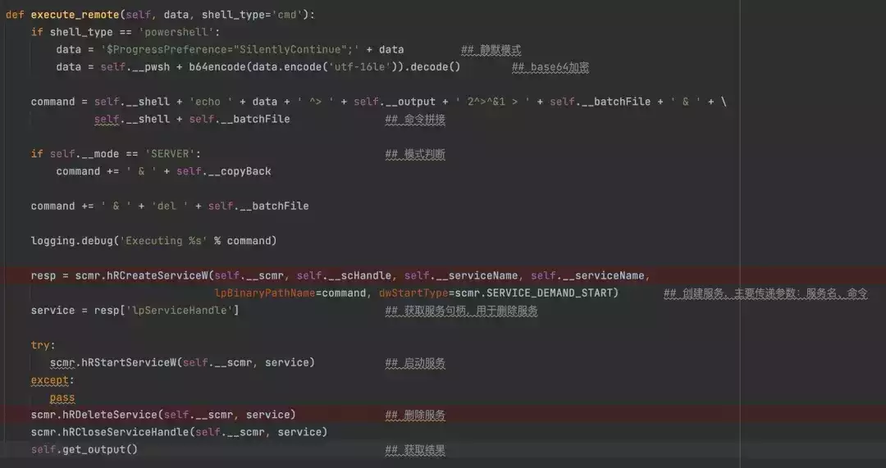
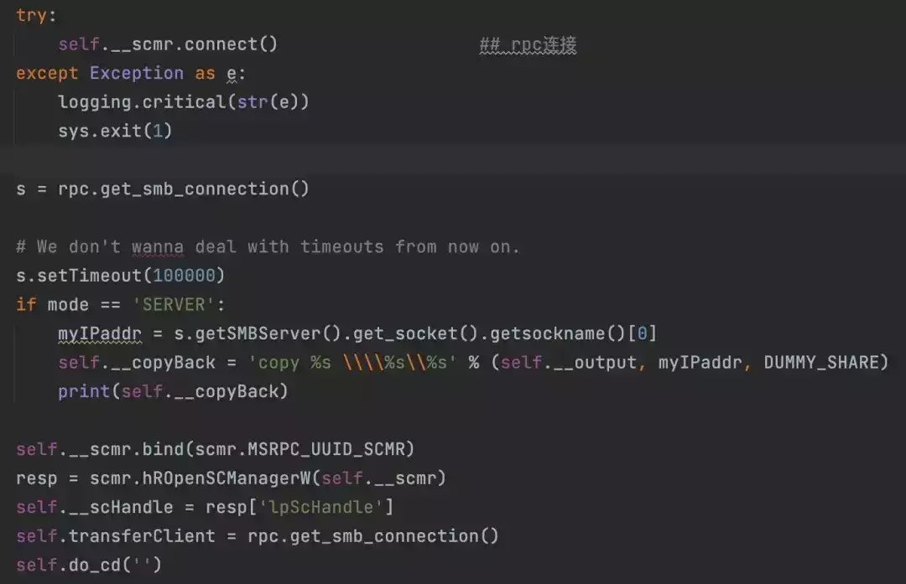
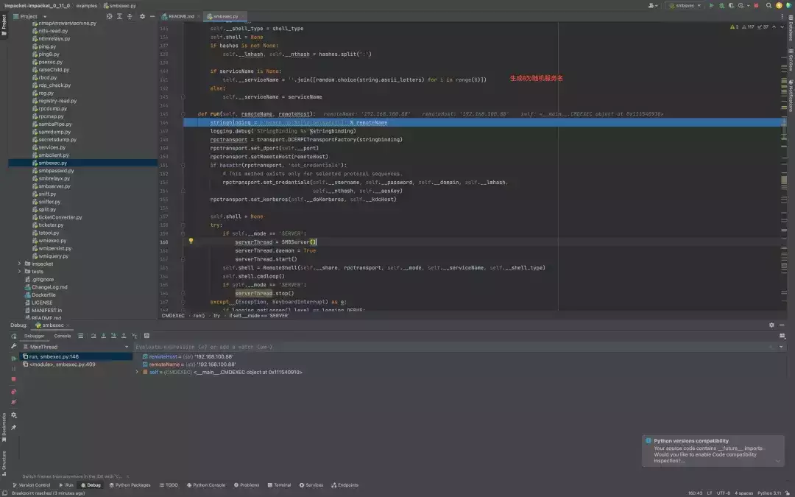
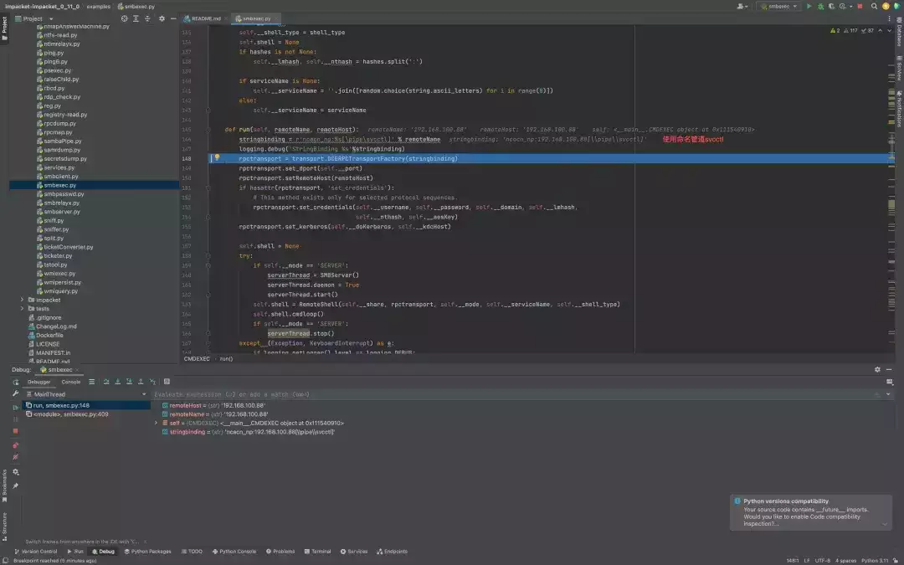
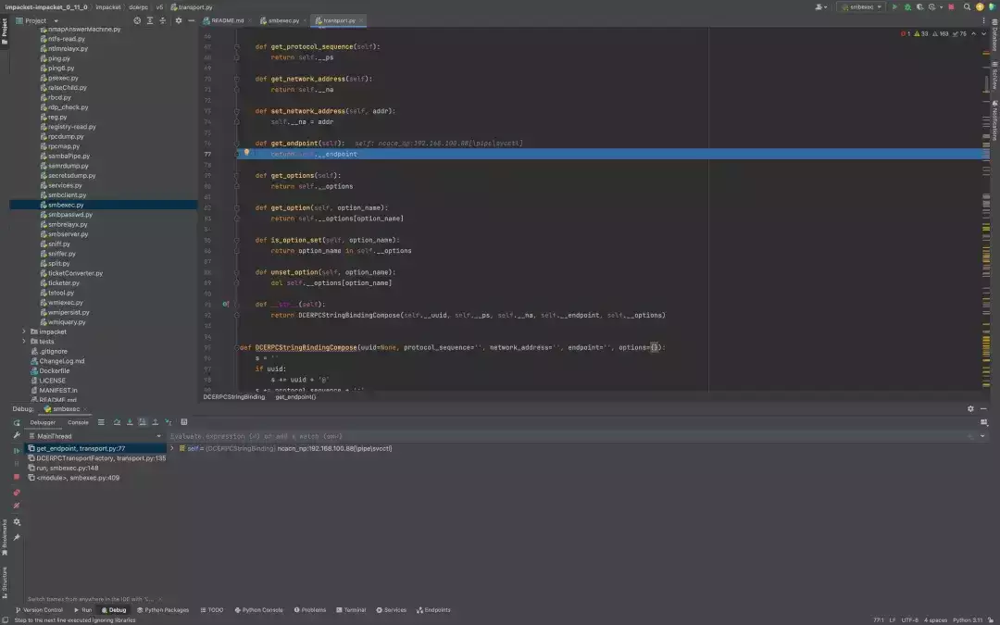
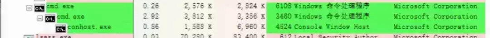
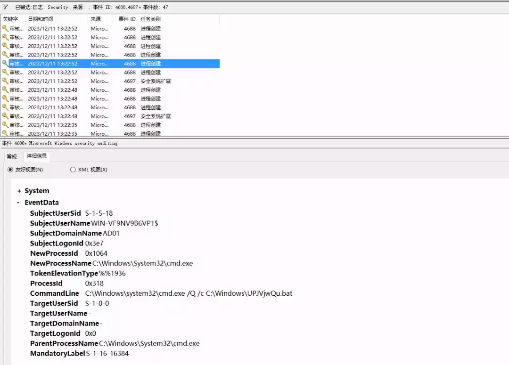
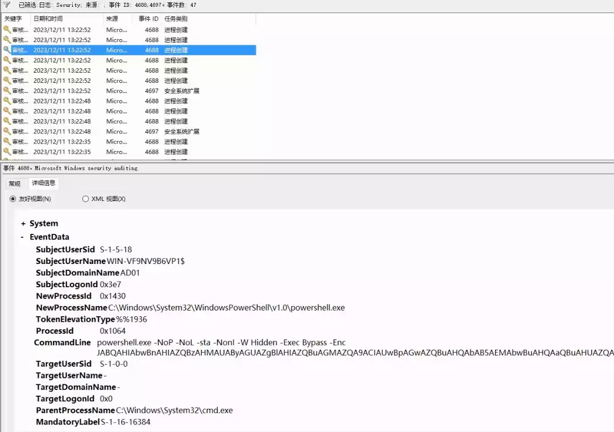

# 内网渗透瑞士军刀-impacket工具解析（六）

  

  

  

**前言**

preface

通过SMB协议进行的攻击行为确实是相对隐秘的。和psexec相同，smbexec也有不同的版本，我们这里讲的是impacket里的python版本，众所周知，psexec通过将同一个二进制可执行文件落地到目标来执行，这个文件是写死在remcomsvc里的。smbexec同样是通过ntlm认证使用调用rpc创建服务，但是由于具体实现不同，它不会落地固定的一个文件。

  

**smbexec原理分析**  

  

一句话了解smbexec:ntlm认证后通过rpc创建system 权限的服务，通过服务执行写入到bat文件，将结果写入到指定文件，读取结果，之后删除服务和生成的文件。  

  

smbexec主要包含了三个类， SMBServer 这个类用于SERVER模式开启新的线程在本地创建SMB服务， CMDEXEC 用于身份认证、通道绑定和调用 RemoteShell 类，最后这个 RemoteShell 类是命令执行和服务创建逻辑的最终实现。  

  


  

关于通道绑定和ntlm认证之前已经提过这部分我们就不再讲了，我们直接看smbexec的执行命令部分。这个类包含了下面这些方法，其中我们需要看的主要就是用于执行命令的 execute\_remote 方法。  

  


  

这里补充一下，smbexec包含两种模式，server和share，返回的shell也有两种:cmd和powershell。  

  

先看执行命令的部分,先判断我们用什么shell模式启动，如果是powershell就开启进度消息静默，然后使用分号把要执行的命令拼接到后面，再base64加密一次,拼接参数的时候会用到函数初始化的时候的一些数据，powershell下的命令就类似于这样。  

  

```plain
echo powershell.exe -NoP -NoL -sta -NonI -W Hidden -Exec Bypass -Enc
JABQAHIAbwBnAHIAZQBzAHMAUAByAGUAZgBlAHIAZQBuAGMAZQA9ACIAUwBpAGwAZQBuAHQAbAB5AEMA
bwBuAHQAaQBuAHUAZQAiADsAbABkAA== ^> \\127.0.0.1\C$\__output2 2^>^&1 >
C:\Windows\TEMP\execute.bat & C:\Windows\system32\cmd.exe /Q /c
C:\Windows\TEMP\execute.bat & del C:\Windows\TEMP\execute.bat
```

  

这就很简单了，将powershell语句写到bat文件里，然后通过cmd来执行bat文件，powershell执行结果输出到文件 \_\_output 里。这部分其实就是命令拼接和执行的核心，当然，在最开始第一次的时候会传递默认的命令'cd '，其切换到当前的工作目录。cmd模式就不再讲了，只是省略了调用powershell的部分而已。服务创建的 hRCreateServiceW 函数其实是使用了 RCreateServiceW API具体的参数结构可以去看一下微软文档，  

  



  

创建后的服务

  


  

最后读取结果使用 get\_output 方法，如果是 SHARE 模式就调用 smbconnection 里的 getFile 方法把文件拿到本地，然后读结果再删除这个文件。如果是 SERVER 模式就在本地直接去读然后删除文件。  

  


  


  

这里就要提到 SERVER 模式，默认的是share，server模式和它不同的点在于 SERVER 会在攻击机本地启一个SMB服务端监听，然后让目标机器来连本地的smb服务，这个过程里我们可以记录目标机器账户的ntlmv2。  

  



  


  

**生成8位随机服务名  
**

但是由于最开始初始化的时候给的是“BTOBTO”，所以不会走这个逻辑，咱们自己用的参数-service-name也是.  

  



  

**使用命名管道svcctl  
**



  

**创建RPC绑定**

使用transport.py里的 DCERPCStringBinding 类来创建DCERPC绑定。  

  


  

**创建实例工厂函数  
**

工厂函数 DCERPCTransportFactory ，接受字符串绑定，创建传输实例。  

  


  

**判断使用协议，进入命名管道协议代码块**

之后会对使用的协议进行判断，因为我们smbexec使用 ncacn\_np ，之后就进入命名管道相关的部分。  

  


  

**获取管道端点  
**



  

  

**进程树**  

**cmd  
**



**powershell  
**


  

  

**监测**  

  

这里我们只从日志层面来对它进行监测。在创建服务的时候会触发服务服务创建  

  


  

然后就是进程树往下走，服务启动创建cmd进程用来执行命令。  

  


  



  



  

出错的话可能会有wermgr的进程日志  

  


  

  

**总结**  

  

现在impacket里的smbexec还是比较简单的，特征也比较很明显，大部分杀软都有针对它的监控，很多地方都是可以改的，比如rpc调用、服务创建，还有server模式的部分细节都可以更加的完善。当然，因为SMB协议的局限性，所以整个执行过程相对还是比较容易追踪和溯源的。  

  

  

[](http://mp.weixin.qq.com/s?__biz=MzkxNTEzMTA0Mw==&mid=2247493393&idx=1&sn=8fce0054925cc69d6eabc827042a43f6&chksm=c16178ddf616f1cbf9c6a61d8fcba4b3233d83cf4acb3446c97088efd909a456a356751dc136&scene=21#wechat_redirect)

  

[](http://mp.weixin.qq.com/s?__biz=MzkxNTEzMTA0Mw==&mid=2247493468&idx=1&sn=e5137d7a47ec7de4b39f1a1fe2789b3a&chksm=c1617890f616f1866beea59a3894ddeb4e07107976212376ef7476b0dcf149bd7e8ab26582a0&scene=21#wechat_redirect)

  

[](http://mp.weixin.qq.com/s?__biz=MzkxNTEzMTA0Mw==&mid=2247493609&idx=1&sn=5af3d71755ede7435c10fd280a5fbaf0&chksm=c1617825f616f133ccd617e98534ddea2d43d332ba3540e00bd46a612e583e873c60d4fb63bd&scene=21#wechat_redirect)

  

[](http://mp.weixin.qq.com/s?__biz=MzkxNTEzMTA0Mw==&mid=2247494259&idx=1&sn=fabc3b5aa92e25b64e38dfd54468b70a&chksm=c16175bff616fca95206483b15c4679ad12c159ab15bdd10bd9b6372ab71d070f6327bf476fc&scene=21#wechat_redirect)

  

[](http://mp.weixin.qq.com/s?__biz=MzkxNTEzMTA0Mw==&mid=2247494429&idx=1&sn=9f2bca983297a5fc968547f4663d2ac7&chksm=c16174d1f616fdc77bc935ac63229ac7f49ffd27686736755e989fdcc28764daa9bb548813ec&scene=21#wechat_redirect)