# 内网渗透瑞士军刀-impacket工具解析（十）

  

**PAC和MS14-068**  

 在kerberos协议中，域中不同权限的用户能够访问的资源是不同的，因此微软使用PAC (Privilege Attribute Certificate，特权属性证书)用于辨别用户身份和权限，其中所包含的是各种授权信息、附加凭据信息、配置文件和策略信息等。例如用户所属的用户组， 用户所具有的权限等。

  

       在一个正常的Kerberos认证流程中，KDC返回的TGT和ST中都是带有PAC的。这样在以后对资源的访问中， 服务端再接收到客户请求的时候不再需要借助KDC的帮助提供完整的授权信息来完成对用户权限的判断， 而只需要根据请求中所包含的PAC信息直接与本地资源的ACL比较即可。PAC中包含了用户的SID、用户所在的组等，下图为PAC的KERB\_VALIDATION\_INFO结构，在下图结构中可以看到有这两个字段，通过对Userid和groupid的值对用户权限进行区分。

  

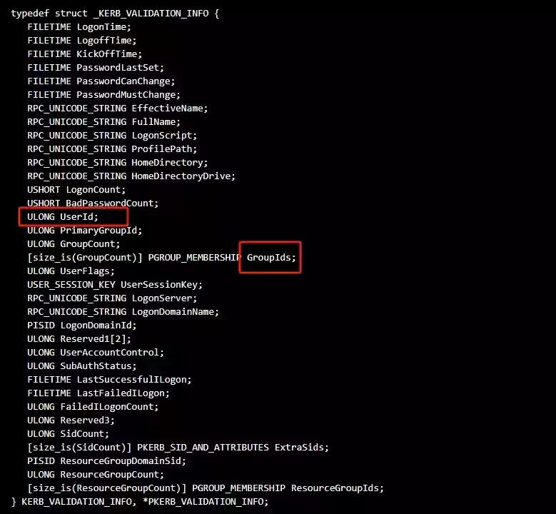

  

在进行kerberos认证时，用户向KDC发起AS\_REQ，请求凭据是用户hash加密的时间戳，KDC使用用户hash进行解密，如果结果正确返回用krbtgt hash加密的TGT票据，TGT里面包含PAC，而PAC尾部会有两个数字签名， 分别由 KDC 密码和 server 密码加密，防止数字签名内容被篡改。

  


  

在 MS14068中，KDC没有正确检查PAC中的有效签名，签名原本的设计是要用到HMAC系列的checksum算法，需要用到server端密码和KDC的密码进行签名，攻击者并没有krbtgt的hash以及服务的hash，所以正常情况下无法伪造PAC，但是微软在实现上却允许任意签名算法，所以客户端可以指定任意签名算法，KDC 就会使用客户端指定的算法进行签名验证。例如只需要把 PAC 进行md5，就生成新的校验和。这也就意味着可以随意更改PAC的内容，完了之后再用md5 生成一个服务检验和以及KDC校验和。在MS14-068修补程序之后，Microsoft添加了一个附加的验证步骤，以确保校验和类型为KRB\_CHECKSUM\_HMAC\_MD5。

  

GroupId是用户所在的组，在伪造PAC的实话将高权限组(比如域管组)的sid加进GroupId，当包含伪造PAC的TGS被服务向KDC询问此用户是否有访问服务权限的时候，KDC解密PAC并提取里面用户的SID以及所在的组(GroupId)，因为我们将域管组的GroupId添加进去了，所以KDC把这个用户当做域管组里面的成员。从而达到提升为域管的效果。

  

**工具分析**

**Pykek**  

对于MS14-068漏洞最经典的攻击脚本是Pykek工具，此工具代码和功能较为简单，仅实现将伪造的PAC注入到TGT中，利用者还需要使用其他工具将伪造的 TGT 导入用户会话并连接到域控制器的 admin$ 共享，实现权限提升。

  

在使用pykek工具之前，进行攻击前需知道用户名、密码、SID、域控主机地址来伪造TGT，其中可以通过whoami /user和wmic命令获取sid。

  

```plain
Whoami /user
```

```plain
Wmic useraccount get name,sid
```

  

在pykek的文件夹下生成了ccache票据，需借助mimikatz将票据写入内存中，创建缓存证书。之后系统会从使用此TGT发送给KDC申请ServiceTicket。

  


**goldenpac**

而impacket工具包中的goldenpac.py脚本是针对MS14-068漏洞进行了更加方便的实现，其添加了请求TGS和PSEXEC相关代码，在PAC伪造成功后直接请求TGS票据，并开启一个交互式shell。同时相对于Pykek，goldenpac还添加了getUserSID函数，省略了输入SID的流程。

  


  

从代码上来看，goldenpac脚本主要分为两个部分，即ms14-068 exp实现和psexec实现。

  

其中PSEXEC部分我们已经在之前的文章中进行了详细的分析，这里不再赘述，直接看MS14-068的功能实现部分。

  


  

**AS-REQ**  

GoldenPac代码中实现了kerberos认证的全部过程，在构建AS-REQ请求中，调用了getKerberosTGT函数来请求TGT，通过普通域用户的用户名和HASH加密时间戳，完成AS\_REQ请求的构建并发送，通过身份认证过程。在源码中可以明显看到把requestPAC设置为False，这代表了要将include\_pac的值设置为false，这样在向KDC申请的TGT票据就不会带有PAC。

  

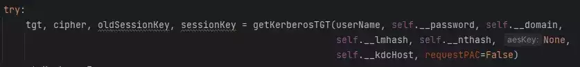

  

如果指定为True，由于不知道krbtgt的Hash，所以客户端无法解密提取PAC进行篡改。

  

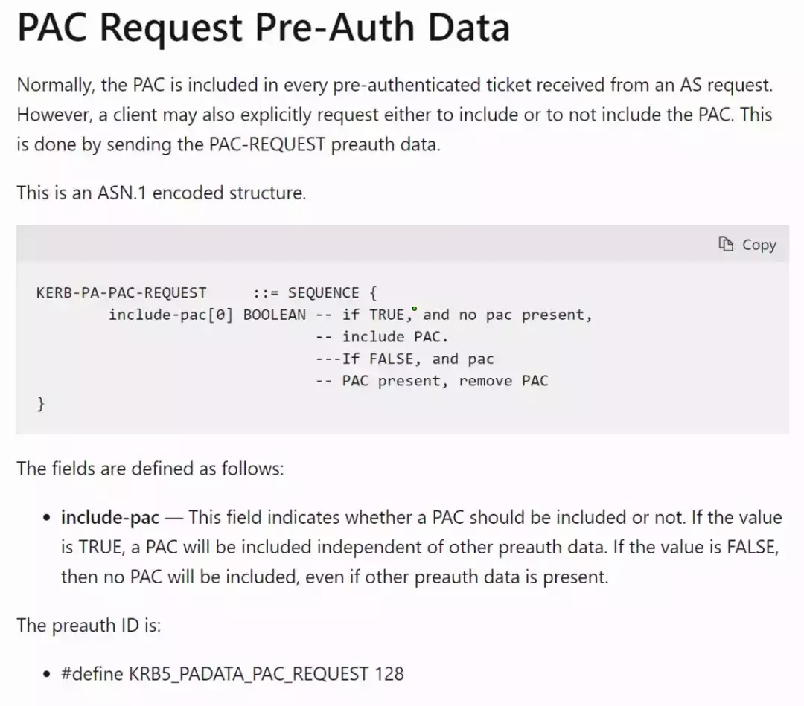

  

通过分析AS-REQ 数据包也可以看到 include-pac:False  字段。

  

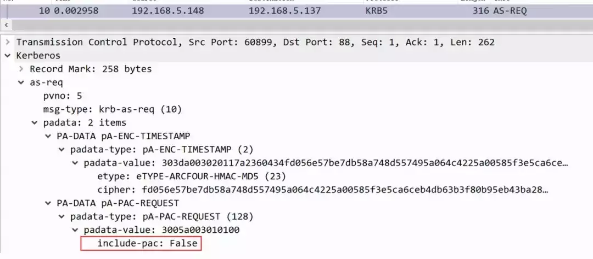

  

**AS-REP**  

KDC收到AS\_REQ请求之后并做出AS-REP响应，在返回的内容中包含请求用户hash加密的session\_key和TGT票据，TGT不包含PAC部分，即cipher字段。

  


  

在TGT中提取ticket部分，ticket被KDC进行加密，作为域内普通用户是无法解密的。

  

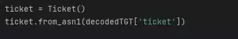

  

在以下代码中，通过用户密码hash作为解密key，并使用key去解密密文返回的请求，解密后获取时间戳和session\_key等信息，用于之后TGS通信中。

  

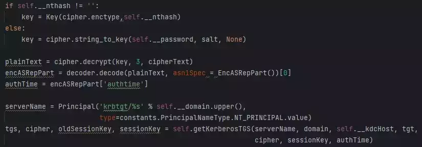

  

**TGS-REQ**  

在处理完TGT之后，在TGS-REQ阶段中通过伪造PAC进行权限提升，Goldenpac使用了getGoldenPAC函数和getKerberosTGS函数来构造PAC和请求TGS。

  

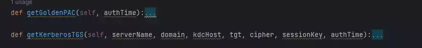

  

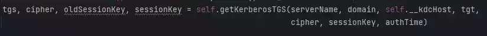

  

首先要解决的就是伪造校验和问题，前面说到在攻击实现的时候允许所有的checksum算法包括MD5，所以这里构造PAC中的两个尾部签名，即服务器检验serverChecksum和私有服务器检验privSvrChecksum，在如下PAC构造代码中可以发现，签名类型SignatureType被设置为RSA\_MD5，签名Signature在初始化后进行了组合操作。

  

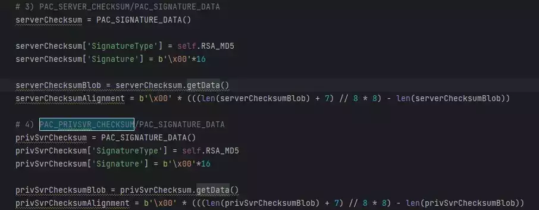

  

在前面我们看到，在构建PAC时，GoldenPac无需输入user SID，这是为GoldenPac通过调用getusersid函数，通过 MS-SAMR 协议获取指定用户名的 SID，MS-SAMR用于管理Windows用户和组的安全标识符等信息。

  

首先，构造了一个RPC绑定字符串stringBinding，使用ncacn\_np协议（Named Pipe）连接到指定主机的SAMR管道。然后，创建了一个RPC传输对象，并通过set\_credentials方法设置身份验证所需的凭据（用户名、密码、域名、LM哈希、NT哈希）。之后便通过RPC服务连接到SAMR服务器，查找指定用户名的SID。

  

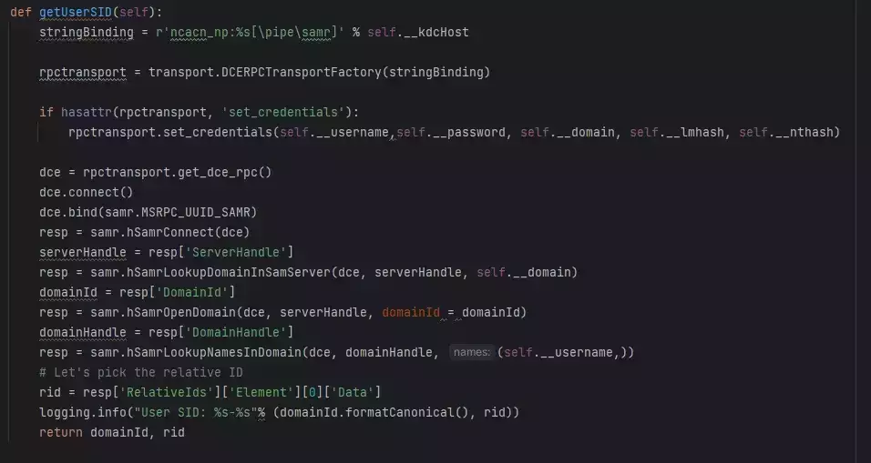

  

在sid中，最后的数字则代表了不同权限的用户组。其中513、512、520、518、519分别为不同的组的sid号，通过这种方式构造了包含高权限组SID的PAC。

  

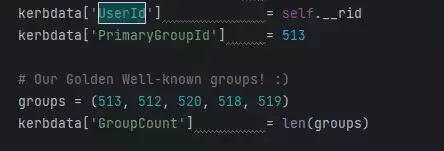

  

```plain
域用户（513）
域管理员（512）
架构管理员（518）
企业管理员（519）
组策略创建者所有者（520）
```

  

构造了高权限的pac，同时可以通过检验和校验，但是PAC时包含在TGT中，没有krbtgt hash无法将伪造的pac传输给KDC。这里代码中将PAC放在enc-authorization-data里面，enc-authorization-data的结构如下：

  

```plain
 AuthorizationData::= SEQUENCE OF SEQUENCE {
    ad-type[0] Int32,
    ad-data[1] OCTET STRING
 }
```

代码中可以看到，将 'enc-authorization-data' 设置为 noValue 。接着，设置了加密类型 ( etype ) 和相应的加密数据 ( cipher )，而 encryptedEncodedIfRelevant 中则是已经加密并编码的PAC，通过这种方式将PAC传输给KDC。

  

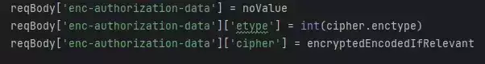

  

**TGS\_REP**  

当 KDC对krbtgt 服务的TGS-REQ后。对攻击者伪造的PAC进行权限验证，通过之后返回高权限的、使用MD5校验的TGS，因为服务为krbtgt，因此可以作为一个新的TGT使用去请求任何服务，在下面的代码中可以看到，获得krbtgt服务的TGS后再次调用了 getKerberosTGS 函数来获取CIFS服务的TGS票据，

  

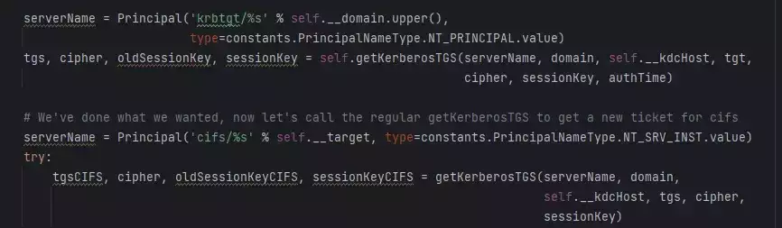

  

在下面的代码中，通过 SMBConnection 对象创建一个SMB连接，并使用Kerberos票据进行身份验证，同时使用PSEXEC代码执行命令或创建一个交互式shell，极大的简化了攻击流程。

  

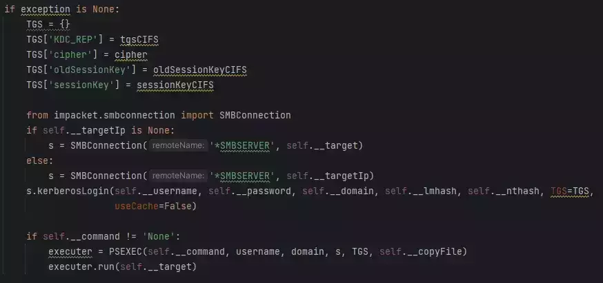

  

**检测防御**  

关于利用GoldenPac进行权限提升，由于利用了典型的MS14-068漏洞，微软也对漏洞发布了对应的补丁，如果要防御攻击可参考以下几点：

1.安装KB3011780补丁

2.监测include-pac字段为False的特征，如果出现了False则可能出现了异常

  

  

[](http://mp.weixin.qq.com/s?__biz=MzkxNTEzMTA0Mw==&mid=2247494536&idx=1&sn=71a81e364162b2dc77247d363730274e&chksm=c1617444f616fd528b64c8bf4c6c675a3da6f3bd92280d709ced88effeb4cf13e3c522c465c8&scene=21#wechat_redirect)

  

[](http://mp.weixin.qq.com/s?__biz=MzkxNTEzMTA0Mw==&mid=2247494737&idx=1&sn=c95529f2518ed06ddbbd2b59ec90b9f7&chksm=c161739df616fa8b7b6983113819e54c93b2da7ce246ec63dcfdbdd6aea6df485e849336e460&scene=21#wechat_redirect)

  

[](http://mp.weixin.qq.com/s?__biz=MzkxNTEzMTA0Mw==&mid=2247494969&idx=1&sn=213bbb5d3f100d9d8cda153823cdb7a8&chksm=c16172f5f616fbe31b939b525963be95606e9865b99f00298e0334ebf216822e9e6bf3c815a1&scene=21#wechat_redirect)